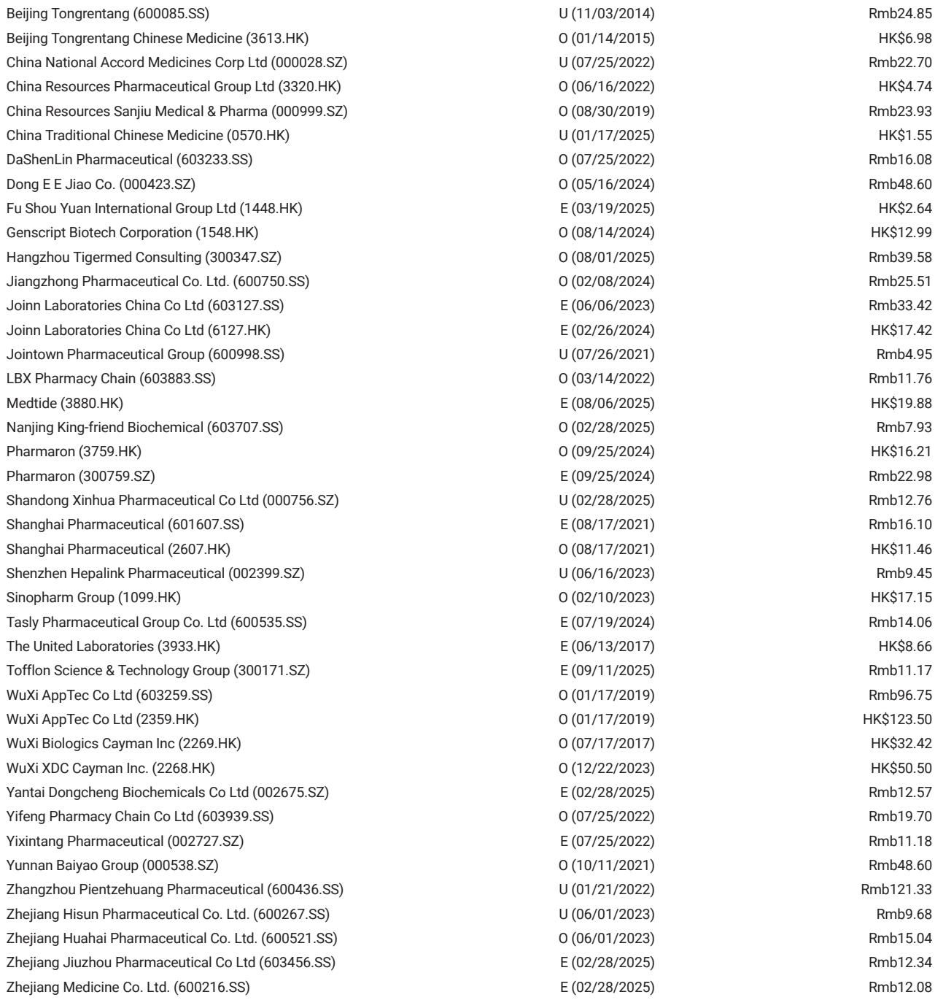
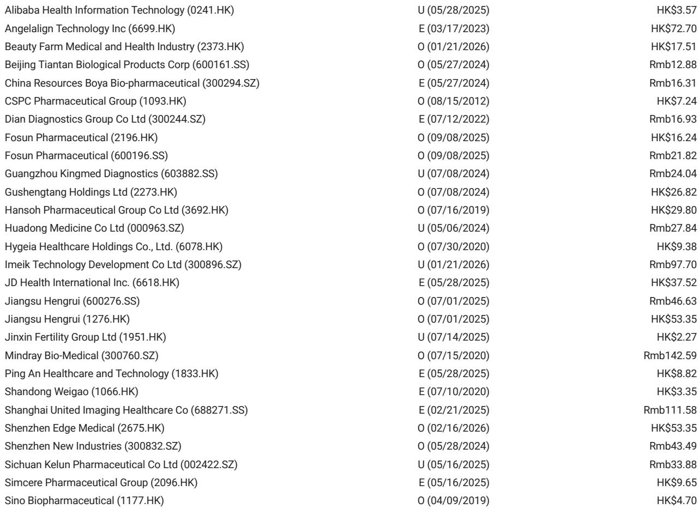
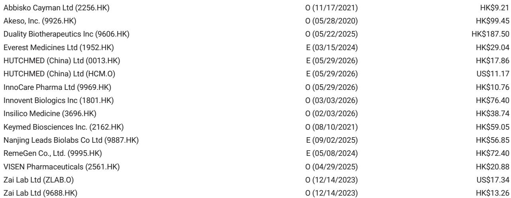

# ASCO 2026第三天：市场低估的不是PD-1/VEGF组合的竞争，而是IL-2赛道“可成药性基准”的转移

每年ASCO的第三天，往往是泡沫退潮、信号浮现的时刻。前两天的喧嚣过后，临床数据开始接受更冷静的拆解。

某外资投行在ASCO 2026第三天发布的研报，表面上是一份常规的会议纪要，但细读之下，它揭示了一个正在发生的结构性变化：中国创新药行业正在从“跟随式创新”进入“基准定义”阶段。这个判断，比任何单个分子的数据都更重要。

市场当前关注的焦点是PD-1/VEGF双抗的竞争格局，但报告真正值得重视的信号，是IL-2赛道正在经历的“可成药性基准”的转移。谁定义了基准，谁就掌握了下一轮定价权。

## 1. PD-1/VEGF的竞争已进入“数据细节决定估值分化”的阶段

HB0025在1L鳞状NSCLC中交出了ORR 84.5%、mPFS 16.46个月的数据。单看数字，这组数据在同类分子中具有竞争力。但报告明确指出，存在几个需要谨慎解读的“caveats”：患者分期的偏倚、PD-L1表达水平的分布差异、以及低转移负荷患者的比例偏高。

这意味着什么？意味着PD-1/VEGF这个赛道的竞争，已经从“有没有疗效”进入了“疗效是否经得起亚组分析”的阶段。对于投资者而言，这不再是一个“买赛道”的逻辑，而是一个“挑分子”的逻辑。

AK112的Ph2数据作为参照系，HB0025的疗效信号需要放在同样的患者基线下去比较。报告没有给出结论，但暗示了方向：在鳞癌PD-L1<1%的患者中，mPFS达到16.72个月，这一信号如果能在更大样本中复现，将具有临床意义。但G3+蛋白尿和TRAE死亡事件的存在，说明安全性窗口仍是这类分子的核心挑战。

所以呢？PD-1/VEGF双抗的估值分化已经开始。那些能够提供更干净安全性数据、更稳健亚组疗效的分子，将获得估值溢价。而那些仅靠整体ORR吸引眼球的分子，将面临越来越严格的质疑。

## 2. IL-2赛道正在经历“可成药性基准”的转移，IBI363成为新的参照系

这是报告中最被低估的一个信号。

ANV600的剂量仍然被限制在微克/公斤级别，活性在方案和适应症之间表现参差不齐。IL-2相关的TRAEs——CRS、发热、转氨酶升高——仍然显著。AWT020的爬坡停留在0.3-1mg/kg水平，虽然实体瘤篮式试验的ORR达到30%、DCR达到67%，但Gr3+炎症性TRAEs（关节痛、结肠炎、血液毒性）的出现，说明这类分子的剂量窗口仍然受限。

报告用了一个关键词：“IBI363 contrast”。在2L IO耐药的EGFR野生型非鳞NSCLC中，IBI363在3mg剂量下展示的mOS数据，被认为足以支撑注册路径。这句话的潜台词是：IBI363已经成为了这个赛道的“druggable benchmark”。

这是一个重要的判断。当一个分子被分析师称为“可成药性基准”时，意味着后来者不仅要证明自己的疗效，还要证明自己比基准更好。这提高了行业的进入门槛，也意味着先发者的估值逻辑正在从“技术验证”转向“市场独占”。

对于关注IL-2赛道的读者，这里有一个尚未完全回答的问题：IBI363的mOS数据究竟是多少？报告没有披露具体数字，但既然分析师认为它足以支撑注册路径，这个数字可能就是决定整个赛道估值天花板的关键。欢迎来星球微信群里继续讨论，我们会基于完整报告的数据表进行深度拆解。

## 3. RASolute302的“耐受性证明”正在改写2L胰腺癌的治疗范式

LBA05/RASolute302是第三天全体会议的重头戏。报告给出的数据值得仔细解读：停药率1.2% vs 化疗组的11.2%，中位剂量强度93.1%。皮疹（17%）和口腔炎（6.6%）是剂量调整的主要原因。

这几个数字合在一起意味着什么？意味着RAS抑制剂在2L治疗中的“耐受性证明”已经基本建立。当停药率只有化疗的十分之一时，临床医生在选择治疗方案时的天平会发生显著倾斜。

讨论者的意见与报告第二天的一致：1L治疗的真正挑战在于试验设计——是组合疗法、RAS单药、还是SOC/维持治疗？以及如何区分不同分子的差异化临床表现。

这里有一个值得深入思考的问题：RASolute302的数据是否足以改变2L的标准治疗？报告没有直接回答，但给出了一个框架：现在的焦点已经从“疗效是否足够”转向了“暴露量与皮疹-口腔炎管理”的平衡。这意味着，那些能够提供更好耐受性管理方案的公司，将获得临床推广的优势。

## 4. “剂量窗口”仍然是IL-2赛道尚未解决的核心约束

回到IL-2赛道，报告揭示了一个尚未被市场充分定价的约束：剂量窗口。

ANV600的剂量被限制在微克/公斤，AWT020的爬坡停留在0.3-1mg/kg。这不是一个技术细节，而是一个商业判断。当剂量窗口如此狭窄时，意味着治疗窗口的拓宽空间有限，联合用药的可能性受到制约，商业化的天花板也随之降低。

报告没有展开讨论的是：为什么剂量窗口如此难以突破？IL-2的生物学机制决定了其免疫激活与毒性之间的紧密耦合。PD-1导向的IL-2设计虽然在一定程度上改善了靶向性，但βγ设计的IL-2仍然面临系统性炎症反应的风险。这是分子设计层面的根本性挑战。

对于关注这一赛道的读者，这里有一个值得持续追踪的问题：是否有分子能够突破这个剂量窗口？如果有，它将获得显著的竞争优势。如果没有，这个赛道的估值将始终受到治疗窗口的限制。

## 5. 报告尚未完全回答的关键问题：1L RAS抑制剂的试验设计将成为下一个估值分歧点

报告在结尾处留下了明确的伏笔。讨论者提出的1L挑战——组合 vs 单药 vs SOC/维持治疗——实际上是一个估值问题。

不同的试验设计将导致不同的临床价值主张。如果RAS抑制剂作为单药在1L中展现出竞争力，那么它的峰值销售额将远高于作为组合疗法一部分的预期。反之，如果它只能作为SOC的补充，那么市场空间将受到限制。

报告没有给出答案，但暗示了方向：不同分子的差异化临床表现将成为关键。这意味着，投资者需要关注的不只是PFS和OS数据，还有这些数据是在什么样的试验设计下产生的。

这里有一个尚未被回答的问题：1L RAS抑制剂的试验设计是否已经足够成熟，能够区分不同分子的临床价值？欢迎来星球微信群里继续讨论，我们会基于完整报告中的讨论者点评和后续分析，深入拆解这个估值分歧点。

---

ASCO 2026第三天的信号是清晰的：中国创新药行业正在从“有没有”进入“好不好”的阶段。那些能够定义基准、突破约束、优化试验设计的公司，将获得估值溢价。而那些仅仅依靠整体数据吸引眼球的分子，将面临越来越严格的审视。

对于产业决策者和高净值投资者而言，现在需要做的不是追逐热点，而是建立一套能够区分“基准定义者”和“基准跟随者”的观察框架。

Personal reading notes and learning share only. Not investment advice.

