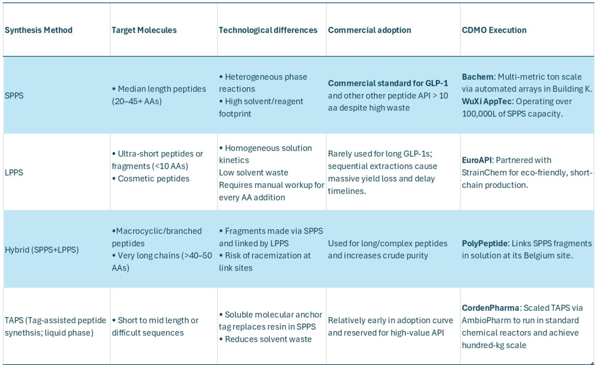
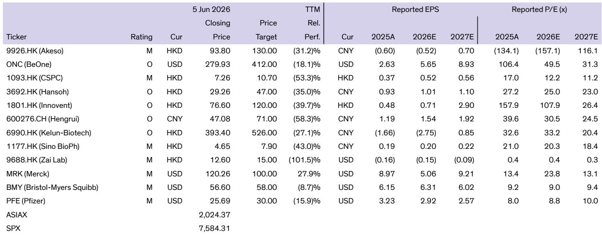
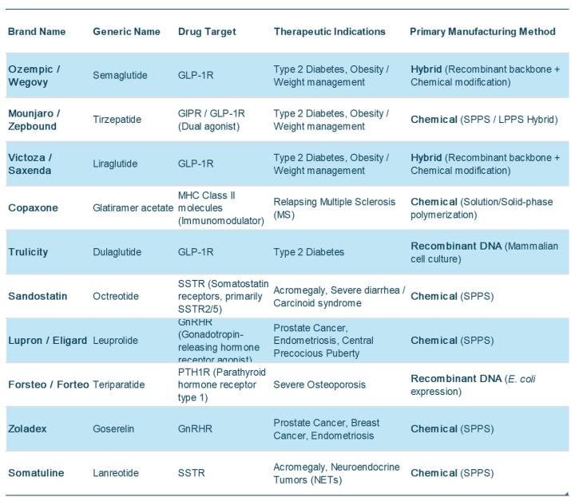

# The Peptide Manufacturing Bottleneck Is the Real Story Behind the Obesity Boom

The global obesity drug market is on track to add more than USD 50 billion in incremental spending between 2025 and 2029, pushing the category toward the USD 100 billion threshold by the end of the decade. This growth trajectory, forecast to compound in the mid-twenties annually, places obesity in a quadrant of its own among the top twenty therapy areas. But the investment narrative has focused overwhelmingly on commercial demand, pricing dynamics, and patient access. What has received far less scrutiny is the manufacturing infrastructure that must deliver this volume—and the mounting evidence that it is not ready.

Peptide-based drugs, led by GLP-1 agonists, represent the fastest-growing and largest new drug modality by 2030, surpassing antibody-drug conjugates, next-generation antibodies, and oligonucleotides in both market size and growth rate. Yet the chemistry required to produce these molecules is among the most resource-intensive in all of pharmaceutical manufacturing. A single kilogram of GLP-1 agonist peptide can consume up to 14 metric tons of solvent. The process mass intensity for peptide synthesis is roughly forty times that of a typical small-molecule drug. This is not a marginal inefficiency. It is a structural constraint that will determine which companies capture value in the obesity boom and which ones get squeezed by rising costs, regulatory pressure, and capacity limits.

The central argument of this article is straightforward: the peptide manufacturing bottleneck is the most underappreciated strategic variable in the obesity drug ecosystem. The winners in this market will not be determined solely by clinical differentiation or commercial execution. They will be determined by which manufacturers can solve the solvent problem, compress cycle times, and deliver multi-ton scale with purity standards that regulators and patients demand. The companies that treat peptide synthesis as a chemistry problem rather than a supply chain problem will be the ones that survive the coming capacity crunch.

## Peptide Manufacturing Has Become a Strategic Constraint, Not Just a Technical Challenge

The historical context matters here. A decade ago, peptide APIs were produced in kilogram quantities annually, serving niche indications in endocrinology, oncology, and neuroendocrine tumors. The manufacturing methods—solid-phase peptide synthesis, hybrid recombinant-chemical routes, and solution-phase approaches—were adequate for volumes measured in single-digit kilograms. The blockbuster drugs of that era were monoclonal antibodies and recombinant proteins, not peptides.

That has changed fundamentally. Semaglutide, tirzepatide, and liraglutide each require chemically synthesized or hybrid-manufactured peptides at scales that the industry has never attempted. The combined demand from these three molecules alone pushes annual peptide API requirements into the multi-metric-ton range. Add to this the existing demand from established peptide drugs like octreotide, leuprolide, goserelin, teriparatide, and lanreotide, and the manufacturing burden becomes staggering.

The dominant manufacturing route for these molecules is solid-phase peptide synthesis, which builds the peptide stepwise on a resin through iterative deprotection, coupling, and washing cycles. The process is flexible and compatible with automation, which is why it became the industry standard. But it is also extraordinarily wasteful. Industry analyses indicate that up to 16,000 kilograms of chemicals are required to produce one kilogram of GLP-class peptide API. Purification and lyophilization are the largest contributors to this process mass intensity. At the scales now required, any inefficiency in coupling, deprotection, or chromatography multiplies directly into higher cost of goods sold and more hazardous waste.

The strategic implication is that peptide manufacturing is no longer a back-office function to be outsourced to the lowest bidder. It is a core competitive variable that determines pricing flexibility, margin sustainability, and supply reliability. Pharmaceutical companies that cannot secure efficient manufacturing capacity for their peptide assets will face chronic supply risk, higher costs, and potential market share losses to competitors who have solved the manufacturing puzzle.

## The Solvent Problem Is the Central Economic Constraint, and It Is Getting Worse

The environmental, social, and governance dimension of peptide manufacturing is not a peripheral concern. Organizations like the American Chemical Society Green Chemistry Institute have explicitly flagged peptide APIs as among the least sustainable drug modalities. The solvents used in peptide synthesis—N,N-dimethylformamide, N-methyl-2-pyrrolidone, and dichloromethane—are hazardous chemicals that require careful handling, disposal, and regulatory compliance.

But the solvent problem is not primarily an ESG issue. It is an economic issue. At the volumes now required, solvent consumption becomes a dominant driver of variable costs. A manufacturer producing one metric ton of GLP-1 agonist API annually would consume approximately 14,000 metric tons of solvent. At commercial solvent prices, this represents hundreds of millions of dollars in direct material costs alone. Add waste handling, disposal fees, and regulatory compliance costs, and the total cost burden becomes a significant drag on margins.

The problem is compounded by the nature of batch purification. Traditional batch chromatography for peptide purification is stop-start, wasteful, and capacity-constrained. A significant fraction of the partially purified material is discarded as waste or sent for rework, further increasing the solvent and energy footprint. As batch sizes increase, the inefficiencies multiply. What works at kilogram scale becomes economically untenable at multi-ton scale.

This is not a problem that can be solved by simply building more capacity. Building more reactors and more chromatography columns using the same solvent-intensive methods will only amplify the cost and environmental liabilities. The solution must come from process innovation that fundamentally changes the solvent and material footprint of peptide synthesis.

## Continuous Chromatography and Solvent Recycling Are the Most Promising Near-Term Solutions

The most significant process innovation in peptide manufacturing in recent years is multi-column countercurrent solvent gradient purification, or MCSGP. Developed by researchers at ETH Zurich and commercialized by Bachem, MCSGP replaces traditional batch purification with a continuous process that passes partially pure fractions back and forth between two connected columns until the peptide is cleanly separated.

The results are striking. Compared to traditional batch purification, MCSGP cuts solvent consumption by approximately 30 percent and total material use by 70 percent. What previously required five days of batch work can be completed in a 24-hour continuous run. This reduces in-process control checks, shrinks lyophilization volumes, and frees up both equipment and quality control resources. The purity achieved is over 99.3 percent, meeting the most demanding regulatory specifications.

The economic implications are significant. A 30 percent reduction in solvent consumption at multi-ton scale translates directly into lower variable costs. The 70 percent reduction in total material use means less waste to dispose of and lower raw material procurement costs. The compression of purification time from five days to one effectively increases capacity without additional capital expenditure. For a CDMO running multiple purification trains, this represents a meaningful improvement in capital productivity.

Solvent recycling is the other major lever. WuXi AppTec has demonstrated that replacing 50 percent of dimethylformamide with more sustainable solvents, combined with recycling the remainder for use by nearby industrial facilities, can reduce total solvent consumption by 25 percent. More importantly, the company has achieved a process mass intensity reduction of over three times relative to the industry benchmark. For commercial manufacturing, the PMI dropped from approximately 13,000 to below 4,000. This is not an incremental improvement. It is a step-change in manufacturing efficiency.

The strategic implication is that CDMOs that invest in continuous chromatography and solvent recycling will have a structural cost advantage over those that remain on legacy batch platforms. This advantage will compound as volumes grow. The cost differential per kilogram will widen, making it increasingly difficult for lagging manufacturers to compete on price or margin.

## The Race to Compress Development Timelines Creates a New Competitive Dynamic

Process innovation is not limited to purification. Asymchem has demonstrated that tag-assisted peptide synthesis combined with continuous flow reactors can dramatically compress development timelines. The company's case study on Mazdutide, a dual GCG/GLP-1 agonist, is instructive. Typical process performance qualification programs for complex long peptides and GLP-1s run 18 to 24 months. Asymchem completed pre-PPQ and PPQ in 12 months, submitted the NDA dossier in 6 months, passed a dynamic pre-approval inspection within 6 months, and delivered a batch exceeding 5 kilograms with over 98.5 percent purity.

This represents a 6 to 12 month acceleration relative to industry norms. In a market where first-to-market advantages are substantial and where clinical trial timelines are already compressed, the ability to shave a year off the manufacturing development timeline is a meaningful competitive advantage. It means that drug developers working with Asymchem can reach the market faster, capture market share earlier, and generate revenue sooner.

The combination of faster development timelines, lower solvent consumption, and higher purity is not coincidental. These outcomes are linked. Tag-assisted peptide synthesis reduces the number of wash steps and experiments required. Continuous flow reactors enhance mixing and reaction rates, improving yield and reducing side-product formation. Real-time process analytical technology allows for predictive kinetic modeling that further optimizes the process. The result is a manufacturing platform that is simultaneously faster, cleaner, and more reliable.

For drug developers evaluating CDMO partners, this creates a new evaluation framework. The traditional criteria—capacity, price, regulatory track record—remain important. But they are no longer sufficient. Developers must also assess the CDMO's process innovation capabilities, its solvent and material footprint, and its ability to compress development timelines. The CDMO that can demonstrate measurable improvements in PMI, solvent consumption, and cycle time will have a compelling value proposition.

## What the Report Does Not Fully Answer: The Scalability and Reproducibility of Novel Approaches

For all the promise of continuous chromatography, solvent recycling, and tag-assisted synthesis, several critical questions remain unanswered. The first is scalability. The MCSGP data from Bachem and the PMI reduction data from WuXi AppTec are based on specific case studies and pilot-scale operations. It is not yet clear whether these results can be replicated at the multi-hundred-ton scale that the obesity market will require within the next five years. Scaling continuous processes from pilot to commercial production is notoriously difficult, and the peptide manufacturing industry has limited experience with continuous chromatography at very large scales.

The second question is reproducibility across different peptide sequences. The case studies focus on GLP-1 agonists, which have specific sequence characteristics. It is not clear whether the same process innovations will work equally well for other peptide classes, including those with longer sequences, higher hydrophobicity, or greater structural complexity. The risk is that the reported improvements are sequence-specific and may not generalize to the broader peptide pipeline.

The third question is the regulatory pathway. Process changes that alter solvent composition, purification methods, or reaction conditions may require regulatory reapproval, particularly if they affect impurity profiles or product quality attributes. The timeline and cost of obtaining regulatory approval for new manufacturing processes are uncertain. Drug developers and CDMOs must weigh the benefits of process innovation against the risks of regulatory delays.

These open questions do not diminish the significance of the reported innovations. They simply underscore that the peptide manufacturing landscape is still evolving. The companies that invest in process innovation today will have a head start, but the ultimate winners will be determined by their ability to scale, reproduce, and validate these approaches under regulatory scrutiny.

## A Decision Framework for Evaluating Peptide Manufacturing Partners

For drug developers, portfolio managers, and strategic investors evaluating exposure to the obesity market, the manufacturing dimension requires a structured decision framework. The following criteria should guide the assessment of CDMO partners and internal manufacturing capabilities.

First, assess process mass intensity. Request PMI data for the specific peptide sequences of interest, not just industry benchmarks. A CDMO that cannot provide sequence-specific PMI data is likely not investing in process optimization. Look for PMI values below 5,000 for commercial manufacturing, which would indicate meaningful progress beyond the industry average of approximately 13,000.

Second, evaluate solvent strategy. Determine what solvents are used, whether the CDMO has implemented solvent recycling, and what the net solvent consumption per kilogram is. A CDMO that still relies primarily on dimethylformamide without recycling is at risk of rising costs and regulatory pressure. A CDMO that has replaced a significant fraction of hazardous solvents with greener alternatives is demonstrating strategic foresight.

Third, examine purification technology. Ask whether the CDMO uses batch or continuous chromatography for peptide purification. If batch, what is the yield loss and solvent consumption per kilogram? If continuous, what is the throughput improvement and purity achieved? The gap between batch and continuous purification is not marginal; it is a factor of three to four in material efficiency.

Fourth, review development timeline track records. How long does the CDMO take to go from process development to PPQ for complex long peptides? A track record of 12 to 18 months is significantly better than the industry norm of 18 to 24 months. Faster timelines translate into earlier market entry and longer patent-protected revenue periods.

Fifth, assess regulatory experience with novel processes. Has the CDMO successfully obtained regulatory approval for processes that use continuous chromatography, tag-assisted synthesis, or alternative solvents? Regulatory precedent matters. A CDMO that has navigated the approval process for novel manufacturing methods is less likely to encounter surprises.

Sixth, consider capacity expansion plans. The CDMO's announced capacity expansion must be evaluated in the context of its process innovation. Building more reactors using legacy methods is not the same as building more reactors using optimized processes. Capacity expansion without process improvement will simply amplify cost and waste.

## The Unresolved Questions That Make This a Story Worth Following

The peptide manufacturing story is still in its early chapters. The innovations described in this article are real and significant, but they have not yet been validated at the scale that the obesity market demands. The next two to three years will determine whether continuous chromatography, solvent recycling, and tag-assisted synthesis can deliver on their promise.

Several questions will define the outcome. Will the major CDMOs converge on a dominant process technology, or will the industry remain fragmented with multiple competing approaches? Will regulatory agencies require additional validation for novel manufacturing processes, potentially slowing adoption? Will the cost savings from process innovation be passed through to drug developers, or will CDMOs capture the margin improvement for themselves? Will the environmental benefits of greener peptide manufacturing translate into commercial advantages through preferential contracting?

These questions do not have clear answers today. But they are precisely the questions that sophisticated investors and strategic planners should be asking. The obesity market is not just a demand story. It is a supply story, and the supply side is undergoing a transformation that will determine which companies thrive and which ones struggle.

Join the community to read the full report and review the original charts.

*This article is for learning and discussion only and does not constitute investment advice.*

Personal reading notes and learning share only. Not investment advice.

