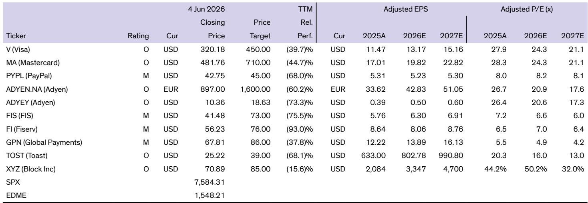
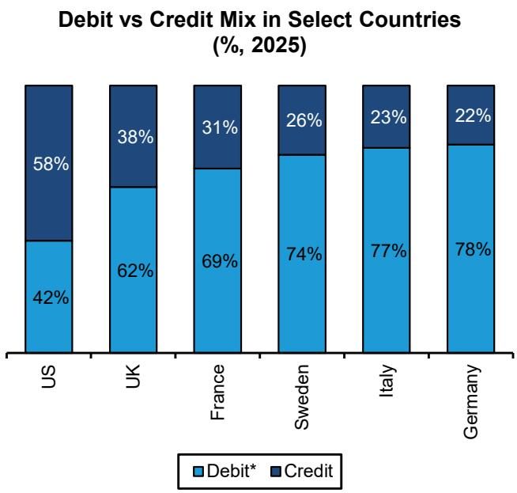

# Card Acceptance Costs Are Misunderstood: The Real Strategic Picture for Payments Networks

The debate over the cost of accepting card payments has intensified, but most comparisons are fundamentally flawed. When merchants, regulators, and alternative payment providers compare card fees to other payment methods, they typically compare apples to oranges. The real strategic question is not whether cards are expensive, but whether the value they deliver justifies their cost.

Debit cards, which are functionally similar to bank transfers and other money-movement alternatives, are already quite cheap. In the United States, regulated debit carries an average merchant discount rate of approximately 70 basis points. Credit cards, which provide credit and rewards, average around 240 basis points. The distinction matters because many comparisons lump debit and credit together, then contrast the blended rate against alternatives that only replicate debit functionality.

The timing of this analysis is critical. The United States is approaching a delicate moment in payment economics. A pending merchant settlement could reshape credit card interchange, small merchants are increasingly adopting surcharging, and new technologies like stablecoins and autonomous agents promise to change how payments work. Understanding the true economics of card acceptance is essential for investors, merchants, and strategists.

## The Card Ecosystem Delivers Bundled Services That Alternatives Cannot Easily Replicate

When merchants pay to accept cards, they are not paying for money movement alone. Money movement is a commodity. Automated clearing house transactions cost a fraction of a cent. What merchants actually pay for is a bundle of services that includes fraud protection, dispute resolution, chargeback management, universal acceptance across more than 100 million merchant locations, and access to over 7 billion KYCed credentials.

Consider dispute management. Stablecoin transactions are non-reversible. If a consumer disputes a stablecoin payment, there is currently no mechanism for resolution. Card networks have spent decades building governance standards and dispute processes that handle millions of cases annually. Similarly, fraud costs for credit cards average approximately 150 basis points of transaction value, and dispute costs add another 120 basis points. These are real costs that merchants would otherwise bear directly or pass to consumers through higher prices.

Card rewards, often criticized as a cost driver, serve a strategic function. They incentivize consumer behavior and drive transaction volume. The funding cost for credit card rewards averages approximately 250 basis points, but this cost is offset by the economic activity it generates. Fintechs, which position themselves as disruptors, increasingly rely on interchange revenue. The best consumer use case for stablecoins today is a stablecoin-linked card that benefits from the same interchange economics.

The implication is clear: alternative payment methods can theoretically replicate card services, but doing so requires years of investment and billions of dollars. Claims of being cheaper often ignore the cost of building equivalent trust and governance infrastructure.

## Interchange Regulation Has Historically Expanded, Not Contracted, Card Ecosystems

Interchange is the fee that a merchant's bank pays to the issuing bank for card transactions. Merchants dislike it. Consumers are largely unaware of it. Issuers depend on it. Regulators want to cap it. Yet the evidence suggests that well-designed interchange regulation can actually accelerate card adoption.

Europe capped interchange at approximately 20 basis points for debit and 30 basis points for credit in December 2015. Since then, card penetration in Europe has surged from 33 percent to an estimated 77 percent. Pandemic-driven digitization certainly helped, but the regulatory framework created conditions for growth by providing certainty and reducing merchant resistance.

The United States presents a different picture. Credit card interchange rates are higher than in most developed economies, driven partly by the growing share of premium credit cards. An average merchant pays 2.4 percent, but large merchants like Amazon and Walmart pay significantly less, while small merchants often pay more than 3 percent. This disparity is fueling merchant pushback.

A pending merchant settlement could reduce credit card interchange by approximately 10 basis points for five years and cap standard consumer credit rates for up to eight years. Separately, the Federal Reserve is overdue on rule-making for a proposed 30 percent reduction in regulated debit interchange. Recent conflicting court rulings on regulated debit interchange add further uncertainty.

The strategic lesson from Europe is that moderate interchange regulation does not destroy network economics. It can actually strengthen the ecosystem by aligning merchant and issuer interests and enabling broader acceptance.

## The United States Faces a Tipping Point in Merchant Acceptance and Consumer Experience

Small business owners in the United States are increasingly adopting surcharging. A survey conducted in early 2025 found that 34 percent of small business owners now surcharge credit card transactions. This number is still low in aggregate terms, but the trajectory is concerning.

The pending merchant settlement will further enable flexible surcharging. Merchant acquirers like Toast have additional incentive to promote surcharging because it improves their monetization and average revenue per user. Occasional reports of merchants refusing to accept cards entirely, such as Meta's decision to shift some advertisers to invoice or debit payments, add to the narrative.

Surcharging is only allowed for credit cards, not debit cards, which are already cheaper. American Express rules do not allow surcharging at all, following a 2018 Supreme Court ruling. But for Visa and Mastercard, the risk is that surcharging degrades the consumer experience and reduces the preference for card payments over time.

The networks face a delicate balancing act. Their issuer customers want higher interchange. Merchants want lower costs. Consumers want convenience and rewards. If surcharging becomes widespread, consumers may start to question the value proposition of credit cards, potentially reducing transaction volume and network revenue.

## The Networks Have Demonstrated Flexibility to Address New Categories, and Agentic Commerce Represents the Next Test

Card networks have historically adapted their pricing models to unlock new merchant categories. Groceries, vending machines, and transit were all once considered unaddressable because of how interchange and fee structures worked. Over time, the networks adjusted their models to accommodate these categories.

The next frontier is agentic commerce. Autonomous agents will need to make micro-transactions for compute, images, tokens, and API calls. The command line interface could become a commerce platform. Visa is already building the ability for users to load their Visa card into a command line interface and have agents autonomously make purchases, including very small ticket transactions.

B2B digitization represents another significant opportunity. The networks already have flexible interchange models for buyers and sellers. AI agents could accelerate B2B digitization by cards, and flexible interchange will help capture this volume.

The key insight is that the networks are not passive participants in their own evolution. They can adjust interchange and pricing to ensure they remain the best way to pay for new transaction types. This flexibility is a structural advantage that alternatives cannot easily replicate.

## The Report Leaves Unanswered Questions About the Sustainability of Current Economics

While the analysis provides a comprehensive framework, several important questions remain unresolved. First, how will the networks balance the competing demands of issuers and merchants in the United States if surcharging becomes mainstream? The report notes that the networks can be flexible with interchange, but does not specify the limits of that flexibility.

Second, can alternative payment methods build equivalent trust and governance infrastructure without charging comparable fees? The report argues that this would take years and billions of dollars, but does not model the timeline or probability of success for major alternatives like stablecoins or pay-by-bank systems.

Third, what happens to card economics if the Federal Reserve implements the proposed 30 percent reduction in regulated debit interchange? The report notes conflicting court rulings but does not provide a scenario analysis for how this would affect network revenue, issuer economics, or merchant acceptance.

Fourth, how will agentic commerce affect the mix of debit versus credit transactions? If autonomous agents prefer debit-like functionality for micro-transactions, the economics could shift toward lower-margin volume.

These questions are not weaknesses in the analysis. They are the natural frontier for investors and strategists who want to understand the next phase of payment network evolution.

## A Decision Framework for Evaluating Payment Network Resilience

For investors and strategists evaluating payment networks, the report suggests a four-part framework:

First, assess the value-added service bundle. Networks that deliver fraud protection, dispute resolution, universal acceptance, and governance standards have structural advantages over pure money-movement providers. The more services bundled into the transaction fee, the more resilient the pricing model.

Second, evaluate regulatory exposure. Markets with moderate interchange regulation have historically seen stronger card adoption. Markets with no regulation face political risk. Markets with aggressive caps may compress margins but expand volumes. The key is understanding which scenario applies to each geography.

Third, monitor merchant acceptance trends. Surcharging rates, merchant defections, and regulatory changes affecting surcharging are leading indicators of network pricing power. If surcharging becomes normalized, networks may need to adjust their value proposition to maintain consumer preference.

Fourth, track new category development. The networks ability to adapt pricing for agentic commerce, B2B digitization, and other emerging transaction types will determine long-term growth. Networks that maintain flexibility will capture new volume. Networks that resist change will lose share.

The networks net yields are a fraction of total merchant discount rates. Visa US yield is approximately 23 basis points against an average merchant discount rate of 160 basis points. This suggests the networks are not over-earning relative to the value they provide. The question is whether that value perception holds as the ecosystem evolves.

Join the community to read the full report and review the original charts.

*This article is for learning and discussion only and does not constitute investment advice.*

Personal reading notes and learning share only. Not investment advice.

