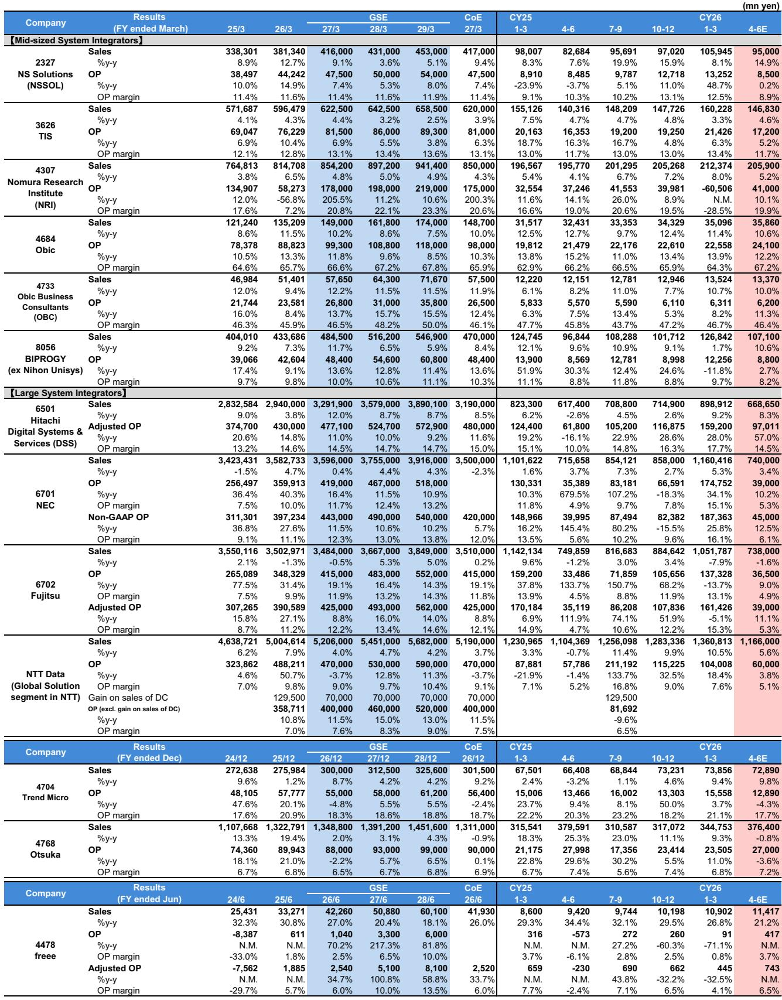
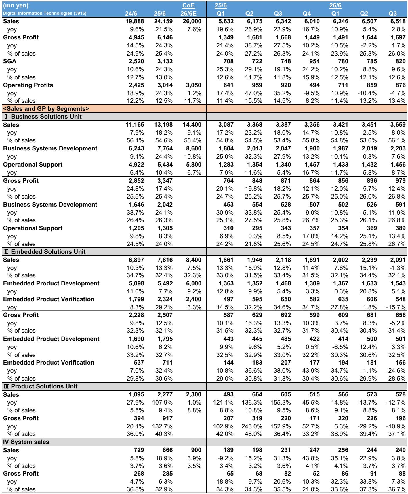
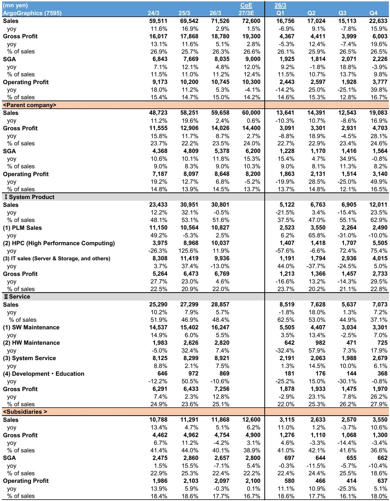

# Japan’s Automotive IT Slowdown Is a Warning Signal for the Broader IT Services Sector

The narrative that Japan’s IT services sector enjoys uniform, secular demand is breaking down. Recent earnings reports from three specialized system integrators serving the manufacturing and automotive industries reveal a clear and growing divergence: while financial services and digital integration projects remain buoyant, the automotive vertical is entering a period of deliberate investment restraint that will likely drag on sector-wide growth through fiscal 2027. This is not a temporary pause. It is a structural recalibration by automakers grappling with uneven returns from Software Defined Vehicle investments, rising internal cost pressures, and strategic uncertainty about the pace of next-generation mobility adoption. For investors tracking Japan’s IT services coverage, the implication is straightforward: sector-level growth forecasts that assume broad-based demand are too optimistic, and the dispersion between winning and losing end-markets will widen meaningfully over the next 12 to 18 months.

The three companies examined in a recent global investment bank research report—Systena, Argo Graphics, and Digital Information Technologies—collectively represent a microcosm of the manufacturing and automotive IT supply chain. None of these companies are directly covered by the bank’s analysts, which makes their collective signal even more valuable as an independent data point. All three reported fiscal 2027 guidance that fell short of the momentum implied by their recent order backlogs. The common culprit: automotive customers are pulling back. At Argo Graphics, operating profit is expected to decline year-on-year for the first time in six years. At DIT, operating profits have fallen for two consecutive quarters, driven by declining investment appetite from major automakers. Systena, the relative outperformer, still guided to only modest single-digit operating profit growth, held back by share-based compensation costs but also by a cautious outlook for its next-generation mobility business. The pattern is consistent, and it demands a reassessment of how much of the IT services sector’s growth is truly secular versus cyclical.

The timing of this slowdown matters. Japan’s automotive industry is not in crisis, but it is in a period of strategic re-evaluation. After several years of aggressive spending on SDVs, autonomous driving, and digital cockpits, automakers are now asking harder questions about return on investment. The enthusiasm for next-generation mobility has not vanished—Systena noted that demand for ADAS, autonomous driving, and digital keys is still expanding—but the pace of spending is becoming more selective. Some automakers are maintaining strong investment, while others are visibly slowing down. This unevenness creates a fragmented demand environment that is difficult for system integrators to manage efficiently. When a major customer pulls back, the impact cascades through the supply chain, especially for smaller, specialized vendors like DIT and Argo Graphics that lack the diversification of larger players. The report’s read-across conclusion is measured but clear: the declining investment appetite in the automotive sector is a slight negative for the overall IT services sector demand environment. For investors, the key question is whether this “slight negative” is the beginning of a larger trend or a contained correction.

## The Automotive Vertical Is Entering a Deliberate Investment Pause, Not a Structural Decline

The evidence from all three companies points to a coordinated, if not coordinated, pullback by automotive customers that is distinct from a cyclical downturn. At Argo Graphics, the company explicitly cited investment curbs by major automotive customers as the primary reason for its first operating profit decline in six years. The company also noted that, beyond weak earnings across the auto industry, IT investment is being curbed due to customer-specific strategic changes. This language suggests that automakers are not simply reacting to near-term profit pressure; they are making deliberate choices to pause or redirect spending as they reassess their technology roadmaps. At DIT, the situation is more acute: the investment appetite of major automotive customers is declining rapidly, and both the development and verification businesses are facing strong headwinds. DIT’s management expects this trend to continue into fiscal 2027, forcing the company to rely on its business solutions segment to offset the shortfall. Systena, which has a more diversified customer base and a stronger presence in financial services, still noted that investment stances vary among customers and that the waning appetite of some automakers needs to be watched closely.

The implications for the IT services sector are more significant than the aggregate exposure numbers suggest. As the report notes, there are no major system integrators with high sales exposure to the automotive sector. However, the sector acts as a bellwether for broader manufacturing IT spending. When automotive, one of the most capital-intensive and technology-forward industries, begins to restrain IT investment, it signals that other manufacturing verticals may follow. The report’s analysts are closely watching Fujitsu and NEC, two diversified system integrators that serve a wide range of industries. If the automotive slowdown spreads to other manufacturing segments, these larger players will feel the impact through lower project volumes and pricing pressure. The question is not whether the automotive slowdown will affect the broader sector, but how quickly and how deeply it will propagate.

## Digital Integration and Financial Services Are the Bright Spots, But They Cannot Fully Offset Automotive Weakness

Not all parts of Japan’s IT services market are slowing. Systena’s digital integration business, which focuses on core system renewals for financial institutions, continues to see strong order inquiries and growth. The company expects this segment to drive its medium-term growth, with a target operating profit of 20.2 billion yen for fiscal 2029, implying a 9% CAGR from fiscal 2026. Financial sector demand is particularly robust, driven by core system modernization, regulatory compliance, and digital transformation initiatives that are less discretionary than automotive R&D projects. This divergence between financial services and automotive IT spending is not new, but it is becoming more pronounced. For investors, the key question is whether the strength in financial services can compensate for the weakness in automotive at a sector level. The answer, based on the data from these three companies, is likely no. Systena’s overall guidance of only 4% operating profit growth, despite a strong digital integration business, illustrates that even a well-positioned company cannot fully escape the drag from its automotive-exposed segments.

The medium-term outlook for Systena’s digital integration business is encouraging, but it is not a panacea. The company’s fiscal 2029 target does not factor in efficiency improvements from data-driven management or human resource reallocation, which could provide upside. However, these are internal operational improvements, not external demand drivers. They can enhance margins, but they cannot create revenue growth where end-market demand is absent. For Argo Graphics and DIT, the bright spots are even narrower. Argo Graphics sees signs of recovery in semiconductor investment, with multiple major customers planning to expand spending at plants in Hokkaido, Kyushu, and Mie. But this is a partial offset, not a full replacement for automotive weakness. DIT has no comparable bright spot; its embedded solutions business is facing headwinds that management expects to persist into fiscal 2027, and the company is relying on cost cuts and delayed investments to meet profit guidance. The asymmetry between the financial services and automotive trajectories is a critical insight for portfolio construction: investors should favor IT services firms with high exposure to financial sector modernization and low exposure to automotive R&D.

## What the Report Does Not Fully Answer: The Magnitude and Duration of the Automotive Investment Slowdown

The report provides a clear snapshot of current conditions, but it leaves several important questions unanswered. First, how long will the automotive investment pause last? DIT’s management expects headwinds to continue into fiscal 2027, but that is a relatively short horizon. If automakers are undergoing a structural reassessment of their SDV strategies, the pause could extend well beyond that timeframe. The report does not provide a framework for distinguishing between a cyclical pullback and a structural shift. Second, what is the transmission mechanism from automotive to other manufacturing verticals? The report notes that the declining investment appetite in automotive is a slight negative for the overall IT services sector, but it does not quantify the spillover effects or identify which other industries are most at risk. Third, how will the larger, diversified system integrators like Fujitsu and NEC navigate this environment? The report says it will be watching them closely, but it does not offer a predictive framework for their performance. These open questions are not flaws in the analysis; they are the natural boundaries of a report focused on three small, specialized companies. For investors seeking a complete picture, the full report likely contains additional data on order trends, customer concentration, and competitive dynamics that would help answer these questions.

## A Decision Framework for Navigating the Divergence in Japan’s IT Services Sector

For readers who manage portfolios or allocate capital to Japanese IT services, the key takeaway from this analysis is that sector-level aggregation is no longer sufficient. The divergence between end-markets is wide enough to create meaningful performance differences between companies that appear similar on the surface. A useful decision framework involves three steps. First, map your portfolio’s exposure to automotive and manufacturing IT spending, both direct and indirect through diversified players. Companies with more than 20% revenue exposure to automotive R&D projects should be scrutinized for guidance risk. Second, assess the quality and duration of non-automotive revenue streams. Financial services core system renewal projects are likely to be more resilient than discretionary manufacturing IT projects, but they also face margin pressure from competition and labor costs. Third, evaluate management’s ability to reallocate resources away from slowing segments. Systena’s ability to pivot toward digital integration is a positive signal, but it is not replicable by every firm. Argo Graphics’ investment in a data center and managed services is a long-term bet that adds near-term depreciation costs without immediate revenue offset. DIT’s reliance on cost cuts and delayed investments is a short-term fix that may not be sustainable. The framework should lead to a clear portfolio tilt: overweight companies with strong financial services exposure and proven resource reallocation capabilities, and underweight or avoid those with high automotive dependence and limited diversification options.

## The Full Report Contains the Charts and Data That Make This Argument Actionable

The data behind this analysis—the quarterly earnings tables for Systena, Argo Graphics, and DIT, the segment-level breakdowns, and the year-on-year growth trajectories—are essential for building conviction around this thesis. The charts in the original report show the precise inflection points where automotive investment began to slow, the magnitude of the decline relative to guidance, and the offsetting strength in digital integration and financial services. Without these visuals, the argument remains qualitative. With them, it becomes a quantitative framework for position sizing, risk management, and catalyst timing. The full report also includes the bank’s broader coverage of the IT services sector, including ratings and price targets for Fujitsu and NEC, which are the most relevant read-across names for investors who want to act on this analysis.

Join the community to read the full report and review the original charts.

*This article is for learning and discussion only and does not constitute investment advice.*

Personal reading notes and learning share only. Not investment advice.

