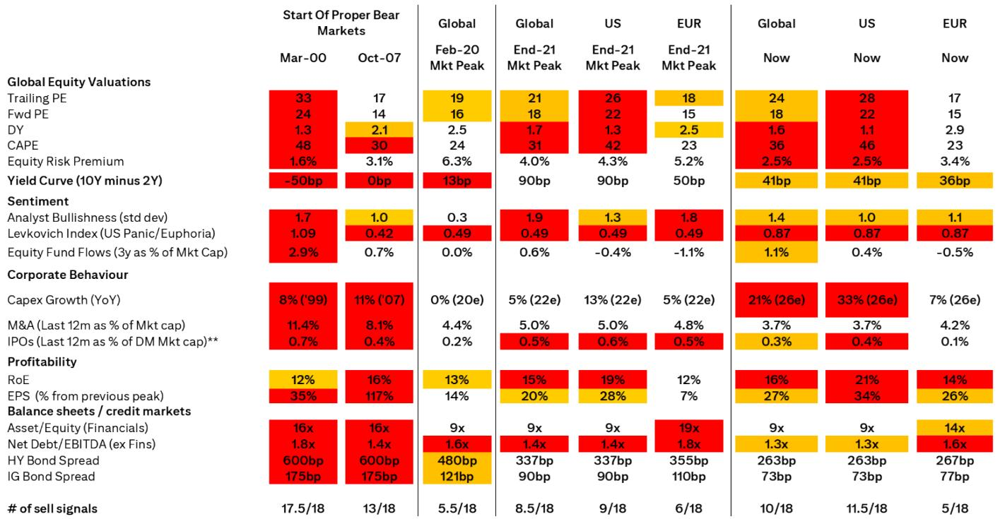
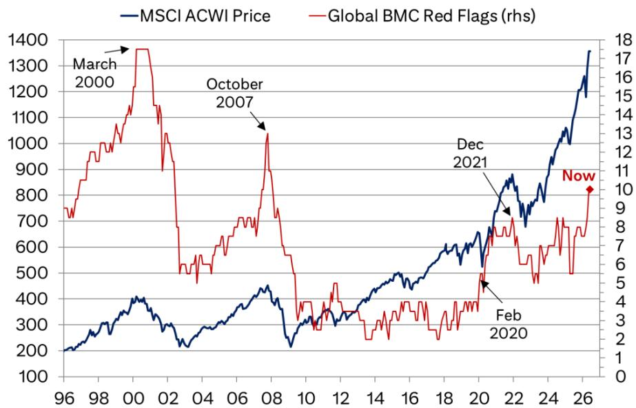
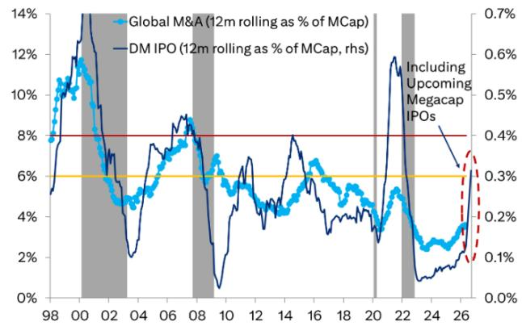

# The Bear Market Checklist Is Flashing Amber, Not Red: Why This Cycle Still Has Room to Run

Global equities are scaling new highs, and the narrative is shifting from cautious optimism to something closer to exuberance. Valuations in several segments are stretched, investor sentiment is turning bullish, and IPO activity is picking up. These are precisely the conditions that historically precede major market peaks. Yet, a closer look at one of the most disciplined frameworks for measuring market froth—the Bear Market Checklist—suggests that while risks are building, we are not yet at the point of overexuberance. The global checklist now stands at 10 out of 18 red flags, the highest since the Global Financial Crisis, but still below the 13 flags seen before the 2007 peak and far from the 17.5 flags of the 2000 dot-com bubble. This is the critical distinction: the market is hot, but it is not yet overdone.

The question every serious investor must answer is not whether the market is expensive, but whether it is priced for a downturn that has not yet materialized. The answer, based on the current data, is that we are in a zone of building risk, not imminent collapse. The checklist is not a timing tool; it is a framework for decision-making during pullbacks. When the flag count is low, dips are buying opportunities. When it rises into double digits, the calculus changes. Right now, we are at the threshold where the next few data points will determine whether this cycle extends or turns.

The most important takeaway is that the current environment is asymmetrical. The upside from continued momentum is real, but the downside risk is accelerating. The checklist has historically risen more rapidly once it crosses into double digits. This means the window for risk-taking is narrowing, but it has not closed. The distinction between a market that is "frothy" and one that is "overexuberant" is not semantic; it is the difference between a correction that can be bought and a bear market that should be avoided.

## The Global BMC Has Reached Its Frothiest Level Since the GFC, But Regional Divergence Tells a More Nuanced Story

The global Bear Market Checklist is now at 10 out of 18 flags, a level not seen since the aftermath of the 2008 financial crisis. This is a significant milestone, but the headline number masks a critical regional divergence. The US checklist stands at 11.5 flags, while Europe is at only 5 flags. This asymmetry is not just a statistical curiosity; it has profound implications for portfolio construction and risk management.

The US market is driving the froth. US valuations, measured by trailing P/E at 28x and CAPE at 46x, are in the top decile of historical readings. The equity risk premium has compressed to 2.5%, a level that historically offers little compensation for equity risk. The Levkovich Index, a measure of panic and euphoria, is at 0.87, edging toward euphoria territory. US capex growth is running at 33% year-over-year, driven largely by AI-related spending. These are all classic late-cycle signals.

Europe, by contrast, is showing remarkable restraint. Its trailing P/E is 17x, CAPE is 23x, and the dividend yield is 2.9%, nearly three times the US level. European capex growth is 7%, a fraction of the US pace. The European checklist at 5 flags is closer to the level seen at market bottoms than at peaks. This divergence creates a strategic opportunity: the froth is concentrated, not systemic. A global equity allocation that mirrors the MSCI AC World Index is implicitly overweight the most extended market. The question is whether the risk-adjusted return of US equities still justifies that concentration.

## The Checklist Is Not a Timing Tool, But Its Components Reveal Which Risks Are Accelerating and Which Are Still Benign

The Bear Market Checklist is composed of 18 factors spanning valuations, sentiment, corporate behavior, profitability, and credit markets. Each factor has an amber and red threshold. The current configuration is instructive because it shows that the froth is not uniform. Some indicators are flashing red, while others remain in green or amber territory. Understanding which are accelerating is more important than the aggregate count.

The most concerning accelerants are in corporate behavior. Global capex growth is 21%, the highest in decades, and US capex growth is 33%. This is not inherently bearish—capex can be productive—but it is historically associated with the late stages of cycles when companies overinvest. The IPO factor has moved into amber territory, driven by the announced or expected listings of several large US companies. IPO waves are a classic signal of market tops because they indicate that private market owners see peak pricing.

On the benign side, credit spreads remain remarkably tight. High-yield spreads are 263 basis points, and investment-grade spreads are 73 basis points. These are levels typically associated with strong economic conditions and low default risk. The yield curve is flattening but not inverted, suggesting that recession fears are not yet priced in. Fund flows are positive but not extreme, with three-year flows at 1.1% of market cap, below the red threshold of 2%. The checklist is sending a mixed signal: the equity market is overheating, but the credit market is not yet confirming the risk. This divergence is typical of mid-cycle transitions, not the prelude to a bear market.

## The Most Dangerous Pattern Is Not the Current Flag Count, But the Speed at Which New Flags Are Likely to Turn

History shows that once the Bear Market Checklist enters double-digit territory, the rate of flag accumulation tends to accelerate. In 2000, the checklist rose from 10 to 17.5 flags in a matter of months. In 2007, the move from 10 to 13 flags was slower but still decisive. The current level of 10 flags is a warning that the environment is becoming increasingly fragile, but it is not yet a sell signal.

The speed of future flag accumulation depends on several factors. First, the IPO pipeline. If the announced large US IPOs are completed, the IPO factor will move from amber to red, adding another half flag. Second, the trajectory of equity fund flows. If retail investors continue to pour money into equities, the flow factor could cross the red threshold. Third, the behavior of credit spreads. If the AI capex wave leads to a significant increase in debt issuance, spreads could widen, adding multiple flags in the credit and balance sheet categories.

The critical insight is that the checklist is not a static snapshot; it is a dynamic system. The current level of 10 flags is concerning, but the path from 10 to 13 or 15 flags is what will determine whether this is a correction or a bear market. Investors should monitor the rate of change, not just the level. A slow accumulation of flags over several quarters is manageable. A rapid acceleration over a few weeks is a red flag that the market is entering dangerous territory.

## The Report Leaves a Critical Question Unanswered: What Happens If the AI Capex Boom Turns Into a Capex Bust?

The current cycle is unique in that a significant portion of the froth is concentrated in AI-related capital expenditure. US capex growth of 33% is being driven by a handful of hyperscalers and technology companies. This is not a broad-based investment boom; it is a sector-specific phenomenon. The report acknowledges that capex growth is elevated and that this is contributing to the BMC flags, but it does not fully explore the second-order implications of a potential capex slowdown.

The risk is twofold. First, if AI-related spending disappoints, the companies that have been the primary drivers of earnings growth could face a sharp revaluation. The US equity market is increasingly dependent on a narrow set of mega-cap names. A slowdown in AI capex would not only reduce earnings expectations but also trigger a reassessment of the growth premium that these stocks command. Second, the debt issuance associated with AI capex could become a credit risk if the expected returns do not materialize. The report notes that credit spreads remain tight, but it also acknowledges that this could change if there are "more pronounced worries around the private credit space or AI capex-related debt issuance."

This is the unresolved analytical question: Is the AI capex boom a sustainable investment in future productivity, or is it a speculative overbuild that will lead to a wave of writedowns and credit losses? The answer will determine whether the current froth is a mid-cycle consolidation or a prelude to a bear market. The report provides the framework for monitoring this risk, but it does not offer a definitive view. That is the gap that investors need to fill with their own analysis.

## A Decision Framework: How to Use the Bear Market Checklist to Allocate Capital in the Current Environment

The Bear Market Checklist is not a black-box signal; it is a decision-making tool. The most useful way to apply it is to define a set of contingent actions based on the flag count and the rate of change. Here is a framework for translating the current BMC reading into portfolio decisions.

First, establish a baseline. At 10 global flags, the environment is "frothy but not overexuberant." This means that the default stance should be constructive, but with a lower risk tolerance. Dips should be evaluated on a case-by-case basis rather than automatically bought. The historical pattern suggests that at this level, corrections are more likely to be buying opportunities than the start of bear markets, but the probability of a deeper downturn is rising.

Second, identify the triggers that would cause a shift in stance. The most important are the IPO pipeline, the trajectory of fund flows, and the behavior of credit spreads. If the IPO factor moves to red, that is a clear signal that private market participants are exiting at peak prices. If equity fund flows cross the 2% threshold, that indicates that retail euphoria is reaching dangerous levels. If credit spreads widen by more than 50 basis points, that would be a confirmation that the credit market is beginning to price in stress.

Third, use the regional divergence to manage concentration risk. The US market is carrying the bulk of the froth, while Europe is relatively cheap. A portfolio that is overweight US equities is implicitly taking on more BMC risk than a globally diversified portfolio. This does not mean that US equities are a sell, but it does mean that the risk premium for US exposure should be higher. Investors should consider whether the expected returns from US equities justify the additional flag risk.

Fourth, define a hard stop. If the global BMC rises to 13 flags, the historical precedent is that a bear market is likely. At that point, the framework shifts from "buy the dip" to "avoid the dip." This is the level at which the report suggests that dips should not necessarily be bought. Having a pre-defined exit point prevents emotional decision-making during a period of market stress.

The value of the Bear Market Checklist is not that it predicts the future, but that it forces a structured conversation about risk. The current reading is a yellow light, not a red light. The question is whether the driver is paying attention.

Join the community to read the full report and review the original charts.

*This article is for learning and discussion only and does not constitute investment advice.*

Personal reading notes and learning share only. Not investment advice.

