# Japan Rates Strategy | Japan

# How much can 10y JGB rally?

The risk that the BoJ is falling behind the curve has eased, even though Middle East uncertainty remains high. With the 10-year JGB sector still carrying an estimated 30-40bp inflation risk premium, we continue to see attractive risk-reward in being long the belly as the market shifts from inflation overshoot concerns toward growth downside risks. We also discuss lifers' disclosure at end-Y2025.

# Key Takeaways

The 10-year JGB sector has started to stabilize as breakevens have stopped making new highs and inflation overshoot concerns have eased.   
- BoJ communication remains hawkish, but the market already prices nearly three hikes over the next 12 months, leaving limited room for further front-end repricing.   
If prolonged Middle East tensions weaken growth through supply-chain disruption and tighter financial conditions, the belly's inflation risk premium should compress.   
Large lifers decreased their 10y+ JGB holdings in FY3/26 amid switching operations from low coupon to high coupon bonds. We see limited net duration demand and no clear repatriation sign.   
Swap and swaption notionals declined as ESR-driven ALM adjustments matured; payer hedges may be rebuilt selectively to manage lapse risk, not to add broad duration.

Please add me to your distribution list.

MS MUFG SECURITIES CO., LTD.+

# Koichi Sugisaki

Strategist

Koichi.Sugisaki@morganstanleymufg.com

+81 3 6836-8428

# Hiromu Uezato

Strategist

Hiromu.Uezato@morganstanleymufg.com

+81 3 6836-8431

# Japan Summer School 2026

MS does and seeks to do business with companies covered in MS. As a result, investors should be aware that the firm may have a conflict of interest that could affect the objectivity of MS. Investors should consider MS as only a single factor in making their investment decision.

# For analyst certification and other important disclosures, refer to the Disclosure Section, located at the end of this report.

+= Analysts employed by non-U.S. affiliates are not registered with FINRA, may not be associated persons of the member and may not be subject to FINRA restrictions on communications with a subject company, public appearances and trading securities held by a research analyst account.

# Interest Rate Strategy

# Japan | How much can 10y JGB rally?

MS MUFG SECURITIES CO., LTD.

Koichi Sugisaki

koichi.sugisaki@morganstanleymufg.com +81 3 6836-8428

Hiromu Uezato

hiromu.uezato@morganstanleymufg.com +81 3 6836-8431

# The risk of BoJ falling behind the curve somewhat eased.

The Middle East situation remains highly uncertain, and there is still limited visibility on any agreement toward a ceasefire. That said, concerns about an inflation overshoot have started to ease somewhat.

On Polymarket, the view that the Strait of Hormuz will return to normal soon has again receded recently. Even so, breakevens have not reached new highs (see Exhibit 1).

In the JPY rates market, the 10-year sector finally appears to be finding firmer footing. This likely reflects a declining inflation risk premium, as concerns about an inflation overshoot have eased somewhat.

The 10-year JGB auction on June 2nd had a large amount of unidentified demand (Nikkei news paper, 4th-June, only Japanese article is available).

This effectively confirmed strong demand from investors that appear to have received direct allotments.

On the other hand, short-term rates expectations started to reprice higher (see Exhibit 2). At his speech to the Kisaragi-kai on June 3rd, BoJ Governor Kazuo Ueda emphasized the message that higher crude oil prices would weigh on growth, but that, under current conditions, he was more alert to upside risks to prices.

Exhibit 1: Polymarket: Strait of Hormuz traffic return to normal by end of June/July 2026 versus Japan 10y Breakeven   
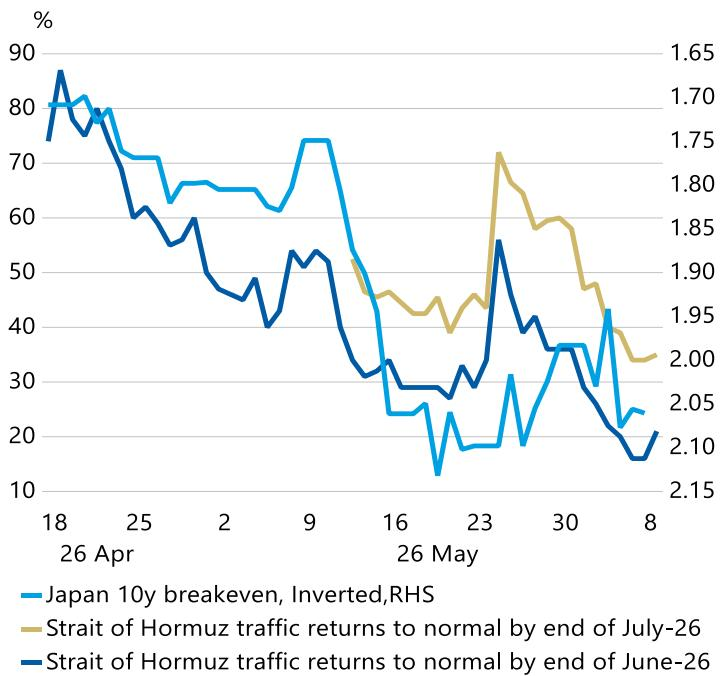

line

| Date       | Japan 10y breakeven, Inverted,RHS (%) | Strait of Hormuz traffic returns to normal by end of July-26 (%) |
| ---------- | -------------------------------------- | ------------------------------------------------------------------ |
| 18 Apr     | 80                                     | 1.65                                                               |
| 26 May     | 25                                     | 2.15                                                               |

Source: MS, Bloomberg

Exhibit 2: The cumulative change in rates expectation across the curve since February 27th   
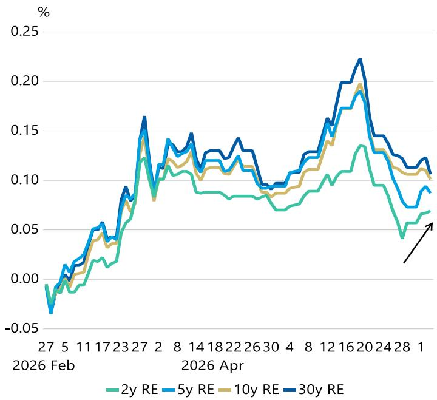

line

| Date       | 2y RE  | 5y RE  | 10y RE | 30y RE |
| ---------- | ------ | ------ | ------ | ------ |
| 2026 Feb   | -0.05  | -0.04  | -0.03  | -0.02  |
| 27         | 0.00   | 0.01   | 0.02   | 0.03   |
| 5          | 0.01   | 0.02   | 0.03   | 0.04   |
| 11         | 0.02   | 0.03   | 0.04   | 0.05   |
| 17         | 0.03   | 0.04   | 0.05   | 0.06   |
| 23         | 0.04   | 0.05   | 0.06   | 0.07   |
| 27         | 0.05   | 0.06   | 0.07   | 0.08   |
| 8          | 0.06   | 0.07   | 0.08   | 0.09   |
| 14         | 0.07   | 0.08   | 0.09   | 0.10   |
| 18         | 0.08   | 0.09   | 0.10   | 0.11   |
| 22         | 0.09   | 0.10   | 0.11   | 0.12   |
| 26         | 0.10   | 0.11   | 0.12   | 0.13   |
| 30         | 0.11   | 0.12   | 0.13   | 0.14   |
| 4          | 0.12   | 0.13   | 0.14   | 0.15   |
| 8          | 0.13   | 0.14   | 0.15   | 0.16   |
| 12         | 0.14   | 0.15   | 0.16   | 0.17   |
| 16         | 0.15   | 0.16   | 0.17   | 0.18   |
| 20         | 0.16   | 0.17   | 0.18   | 0.19   |
| 24         | 0.17   | 0.18   | 0.19   | 0.20   |
| 28         | 0.18   | 0.19   | 0.20   | 0.21   |
| 1          | 0.19   | 0.20   | 0.21   | 0.22   |

Source: MS, Bloomberg

In particular, the Governor suggested that downside risks to the economy were limited, given the resilient corporate earnings and resilient private consumption supported by wage increases following the spring wage negotiations, and government measures to ease the burden of energy costs.

By contrast, the BoJ appears to see greater upside risks to prices. It points to the rising trend in inflation expectations and the recent increase in the Corporate Goods Price Index (CGPI).

Governor Ueda also emphasized that real rates remain negative and that financial conditions are still accommodative. He also noted that the recent rise in long-term yields has come from concerns on the risk of BoJ falling behind the curve.

In that context, he argued that it is important to secure market confidence that inflation will be appropriately controlled through appropriate conduct of monetary policy. Given the clear emphasis on upside price risks, our economists maintain their call for a June rate hike.

Overall, the JGB curve twist-flattened this week (see Exhibit 3). This reflected higher policy-rate expectations centered on the front end, driven by the BoJ's hawkish shift, and a decline in the inflation risk premium in the medium- to long-term sector.

# Our View Differs

Our economists, however, believe that second-round inflation effects are unlikely to materialize (see Heading Again Toward Above 3%: CPI Outlook Table Updated (after May Prelim. Tokyo CPI)). They also expect downside growth risks to emerge toward the second quarter.

At the very least, recent consumption-related data do not show signs of strong inflation momentum. As discussed in "Downward Repricing of the Inflation Risk Premium", April consumer prices were not strong after excluding special factors.

April was a timing point for price revisions by many companies. Even so, price-hike pressure was not as strong as it was last fiscal year.

Looking at the May tracking data from Nikkei CPINow, supermarket prices, which are close to consumers' perceived inflation, have continued to decelerate. Point-of-sale (POS) retail sales have also remained negative year-on-year in real terms (see Exhibit 4).

Exhibit 3: Weekly change in JGB and OIS curve   
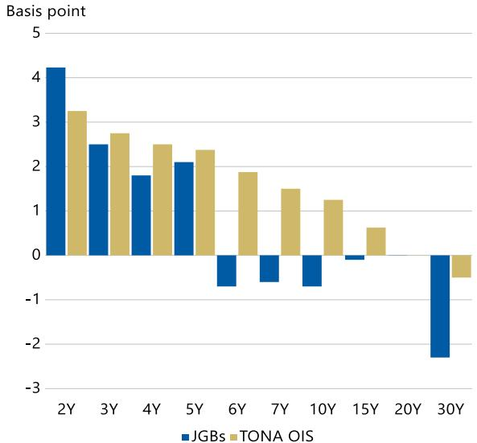

bar

| Term | JGBs | TONA OIS |
|---|---|---|
| 2Y | 4.2 | 3.2 |
| 3Y | 2.5 | 2.8 |
| 4Y | 1.8 | 2.5 |
| 5Y | 2.1 | 2.4 |
| 6Y | -0.7 | 1.9 |
| 7Y | -0.6 | 1.5 |
| 10Y | -0.7 | 1.2 |
| 15Y | -0.1 | 0.6 |
| 30Y | -2.5 | -0.3 |

Source: MS, Bloomberg

Exhibit 4: Nikkei CPI T Index (y/y) vs. POS real retail sales (y/y)   
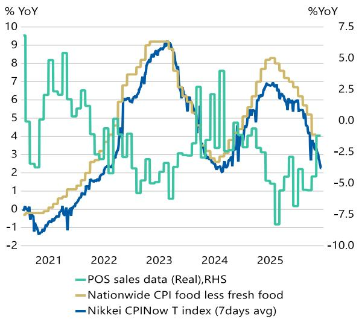

line

| Year | POS sales data (Real), RHS | Nationwide CPI food less fresh food | Nikkei CPINow T index (7days avg) |
|------|-----------------------------|----------------------------------------|------------------------------------|
| 2021 | ~8.5%                       | ~0.0%                                  | ~-1.0%                             |
| 2022 | ~4.0%                       | ~3.0%                                  | ~2.0%                              |
| 2023 | ~9.0%                       | ~6.0%                                  | ~9.0%                              |
| 2024 | ~7.5%                       | ~3.0%                                  | ~2.0%                              |
| 2025 | ~3.0%                       | ~8.0%                                  | ~7.0%                              |

Source: Nowcast, MS

Surveys such as those by Teikoku Databank (only Japanese article is available) suggest that companies are gradually becoming more cautious about passing on costs other than raw material costs. This likely reflects concerns about losing customers.

The January-March Financial Statements Statistics of Corporations by Industry also highlighted a pause in capital investment demand (see Exhibit 5). Capital expenditure excluding software investment, which appears to be related to artificial intelligence (AI), slowed sharply to -3.5% quarter-on-quarter.

This came as uncertainty around the Middle East began to emerge. Following these results, our economists revised down their forecast for real gross domestic product (GDP) in the January-March quarter (see 1Q GDP to Be Revised Down, Led by Capex: Jan-Mar Corporate Statistics).

For April-June, our economists expect that nominal GDP could also show signs of stalling outside AI-related special demand, if the turmoil in the Middle East persists. A deterioration in the terms of trade would be one channel.

The BoJ is concerned about future upside risks to prices, including those implied by the rise in the CGPI. Yet actual data also show that downside growth risks are beginning to emerge, even if some of that weakness has been partly masked by capex investment demand.

If Middle East tensions persist and supply-chain disruptions gradually become more visible, the market should begin to focus more on the risk of slowing growth. In that case, the inflation risk premium already priced sufficiently into the belly of the curve should decline.

# How Far Can 10-Year Yields Rally?

In "Detail about underlying our updated JGB yield forecasts", we introduced a fair-value model that explains Overnight Index Swap (OIS) rates using near-term BoJ rate-hike pricing and the 10-year US Treasury yield.

As discussed in that report, some support has started to appear for 10-year JGB yields. Even so, the gap from fair value remains large (see Exhibit 6).

This gap can largely be explained by elevated inflation expectations. In other words, the belly of the curve can still be interpreted as carrying an inflation risk premium of around 30-40 basis points (bp).

Exhibit 5: Corporate capex investment (software versus ex software)   
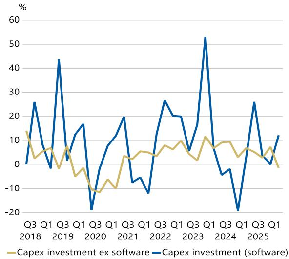

line

| Quarter | Capex investment ex software | Capex investment (software) |
| ------- | ---------------------------- | --------------------------- |
| Q3 2018 | 13                           | 0                           |
| Q1 2019 | 6                            | 44                          |
| Q3 2019 | -2                           | 17                          |
| Q1 2020 | -10                          | -20                         |
| Q3 2020 | -8                           | 19                          |
| Q1 2021 | 4                            | -8                          |
| Q3 2021 | 6                            | -12                         |
| Q1 2022 | 8                            | 27                          |
| Q3 2022 | 10                           | 20                          |
| Q1 2023 | 8                            | 53                          |
| Q3 2023 | 11                           | -5                          |
| Q1 2024 | 8                            | -20                         |
| Q3 2024 | 6                            | 26                          |
| Q1 2025 | -2                           | 12                          |

Source: Japan MoF, MS

Exhibit 6: 10y OIS residual versus 10y JGBi breakeven   
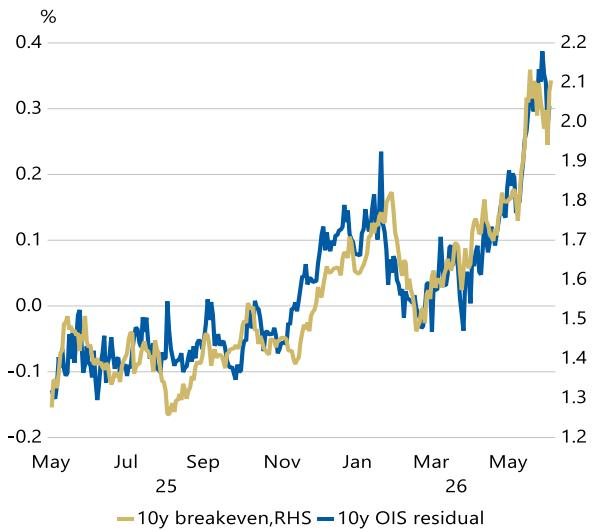

line

| Month | 10y breakeven,RHS | 10y OIS residual |
|-------|-------------------|------------------|
| May   | -0.1              | 1.3              |
| Jul   | -0.1              | 1.4              |
| Sep   | -0.1              | 1.5              |
| Nov   | 0.0               | 1.6              |
| Jan   | 0.1               | 1.7              |
| Mar   | 0.1               | 1.8              |
| May   | 0.3               | 2.2              |

Source: MS, Bloomberg

The same inflation risk premium can be seen from another angle. Comparing market-based inflation expectations, as measured by breakevens, with survey-based inflation expectations, survey-based expectations remain broadly flat below 2% (see Exhibit 7).

Breakevens, by contrast, are around 30bp higher than that level. On this basis, the inflation risk premium priced into the 10-year sector is estimated at around 30-40bp.

As discussed above, if the market starts to focus more on growth concerns caused by a prolonged Middle East shock than on inflation concerns, yields should have room to decline by another 30bp through the disappearance of that risk premium.

We also need to consider changes in the market's policy-rate expectations. One explanatory variable in the OIS fair-value model is the number of BoJ rate hikes priced over the next 12 months (see Exhibit 8).

Exhibit 7: Quick 10y inflation average forecast versus 10y JGBi breakeven   
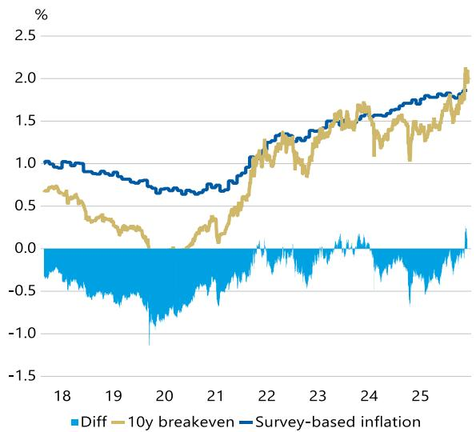

line

| Year | Diff | 10y breakeven | Survey-based inflation |
|------|------|---------------|------------------------|
| 18   | -0.5 | 0.7           | 1.0                    |
| 19   | -0.6 | 0.3           | 0.9                    |
| 20   | -1.0 | 0.0           | 0.7                    |
| 21   | -0.8 | 0.5           | 0.8                    |
| 22   | -0.5 | 1.0           | 1.3                    |
| 23   | -0.3 | 1.5           | 1.5                    |
| 24   | -0.2 | 1.6           | 1.7                    |
| 25   | -0.1 | 1.8           | 1.9                    |
| 26   | 0.0  | 2.1           | 2.0                    |

Source: QUICK, MS

Exhibit 8: Market Implied pace of 25bp hike in the following 12 months   
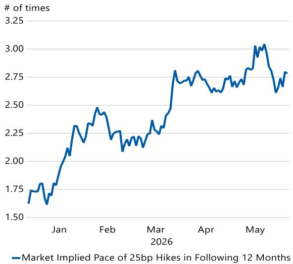

line

| Month | Market Implied Pace of 25bp Hikes |
|-------|-----------------------------------|
| Jan   | 1.75                              |
| Feb   | 2.45                              |
| Mar   | 2.80                              |
| Apr   | 2.70                              |
| May   | 3.00                              |

Source: MS, Bloomberg

This is currently just under three hikes. According to media reports, the BoJ is considering a rate hike at the June meeting and also sees the possibility of additional rate hikes later this year if needed.

The market has already priced in such a possibility almost fully (see Exhibit 9). In addition, survey-based expectations in the QUICK monthly bond survey conducted at the end of May still show that the dominant view is for a terminal rate of around 1.5%.

At this point, there has still been no clear acceleration in inflation caused by the Middle East shock, excluding the energy component. Under these conditions, it seems difficult for the market to price in more than three rate hikes (including June hike) over the next year.

If the rise in policy-rate expectations is offset against the decline in the inflation risk premium, we think the net rally potential is around 20-30bp (see Exhibit 10).

Both the BoJ and the market are currently concerned that renewed Middle East tensions will ultimately create more upside risk to prices than downside risk to growth.

As discussed above, however, if supply-chain stagnation and tighter financial conditions lead investors to focus more on the growth downside from a prolonged Middle East shock, the near-term path of rate-hike pricing itself could also be revised lower.

Given that the market has already priced in a large inflation risk premium, we continue to see attractive risk-reward in being long the belly of the curve.

Exhibit 9: BoJ Market pricing versus survey based inflation forecast   
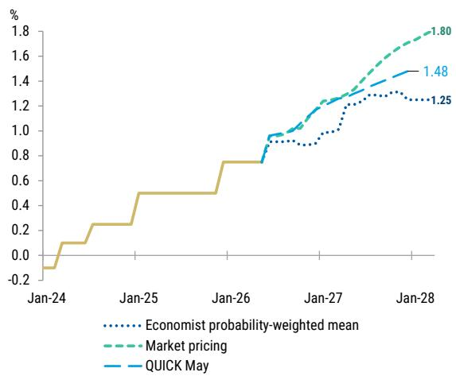

line

| Date   | Economist probability-weighted mean | Market pricing | QUICK May |
|--------|-------------------------------------|----------------|---------|
| Jan-28 | 1.25                                | 1.80           | 1.48    |

Exhibit 10: 10y JGB fair value by BoJ market pricing and 10y UST yield (Note: 10y JGB yield at 2.64% on compound yield basis as of 6th-June) 

<table><tr><td colspan="6">Implied pace of hike in the following 12 months (# of 25bp hike)</td></tr><tr><td>10y</td><td>1</td><td>1.5</td><td>2</td><td>2.5</td><td>3</td></tr><tr><td>3</td><td>1.65</td><td>1.80</td><td>1.96</td><td>2.11</td><td>2.27</td></tr><tr><td>3.25</td><td>1.68</td><td>1.83</td><td>1.99</td><td>2.14</td><td>2.30</td></tr><tr><td>3.5</td><td>1.70</td><td>1.86</td><td>2.01</td><td>2.17</td><td>2.32</td></tr><tr><td>3.75</td><td>1.73</td><td>1.89</td><td>2.04</td><td>2.20</td><td>2.35</td></tr><tr><td>4</td><td>1.76</td><td>1.91</td><td>2.07</td><td>2.22</td><td>2.38</td></tr><tr><td>4.25</td><td>1.78</td><td>1.94</td><td>2.10</td><td>2.25</td><td>2.41</td></tr><tr><td>4.5</td><td>1.81</td><td>1.97</td><td>2.12</td><td>2.28</td><td>2.43</td></tr><tr><td>4.75</td><td>1.84</td><td>1.99</td><td>2.15</td><td>2.30</td><td>2.46</td></tr><tr><td>5</td><td>1.87</td><td>2.02</td><td>2.18</td><td>2.33</td><td>2.49</td></tr></table>

Source: MS   
Source: QUICK, MS, Bloomberg

Trade Idea: Maintain 5y JGB outright
Trade Idea: Maintain Short 30y JGB ASW
Trade Idea: Maintain receive July MPM OIS

# Japanese Lifers Investment Activity in FY3/26

In the March 2026 period, major lifers continued to reduce and rotate out of low-coupon super-long JGBs. As a result, JGB holdings in the general account and the average duration measured on a remaining-maturity basis declined.

ALM duration adjustments aimed at ESR compliance have progressed considerably among the major lifers. Given the shortening of liability duration and mass-lapse risk, lifers' role as structural buyers of super-long JGBs has weakened compared with the past.

On derivatives, receive-side/receiver hedges appear to be nearing completion, while we believe there remains room to rebuild pay-side/payer hedges as protection against dynamic lapse risk and mass-lapse risk associated with rising interest rates.

Foreign bond balances increased modestly, but this should be viewed with some discount because FX effects are included. There are few signs of large-scale repatriation into JGBs, and the importance of indirect overseas asset exposure through overseas M&A, alternative investments, and offshore reinsurance is increasing.

# JGB demand was in line with our view

In FY3/26 results, Japanese lifers' general-account JGB holdings stood at JPY 90.8tn, down by around JPY 4.6tn from the September 2025 period. Looking at holdings by remaining maturity, JGB holdings with maturities of 10y+ declined by a similar amount. The decline in average duration also widened, with average duration falling to 12.1 years as of March 2026.

Exhibit 11: Major eleven Japanese life insurance companies: Asset class outstanding   
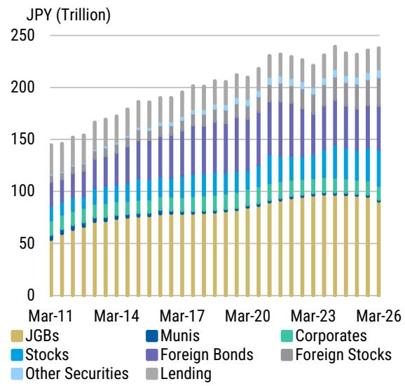

bar_stacked

| Date | JGBs (Trillion) | Munis (Trillion) | Stocks (Trillion) | Foreign Bonds (Trillion) | Other Securities (Trillion) | Corporates (Trillion) | Foreign Stocks (Trillion) | Lending (Trillion) |
|---|---|---|---|---|---|---|---|---|
| Mar-11 | 50 | 10 | 30 | 40 | 10 | 20 | 10 | 20 |
| Mar-12 | 55 | 10 | 35 | 45 | 10 | 20 | 10 | 20 |
| Mar-13 | 60 | 10 | 40 | 50 | 10 | 20 | 10 | 20 |
| Mar-14 | 65 | 10 | 45 | 55 | 10 | 20 | 10 | 20 |
| Mar-15 | 70 | 10 | 50 | 60 | 10 | 20 | 10 | 20 |
| Mar-16 | 75 | 10 | 55 | 65 | 10 | 20 | 10 | 20 |
| Mar-17 | 80 | 10 | 60 | 70 | 10 | 20 | 10 | 20 |
| Mar-18 | 85 | 10 | 65 | 75 | 10 | 20 | 10 | 20 |
| Mar-19 | 90 | 10 | 70 | 80 | 10 | 20 | 10 | 20 |
| Mar-20 | 95 | 10 | 75 | 85 | 10 | 20 | 10 | 20 |
| Mar-21 | 100 | 10 | 80 | 90 | 10 | 20 | 10 | 20 |
| Mar-22 | 105 | 10 | 85 | 95 | 10 | 20 | 10 | 20 |
| Mar-23 | 110 | 10 | 90 | 100 | 10 | 20 | 10 | 20 |
| Mar-24e | 115 | 10 | 95 | 105 | 10 | 20 | 10 | 20 |
| Mar-25e | 120 | 10 | 100 | 110 | 10 | 20 | 10 | 20 |
| Mar-26e | 125 | 10 | 105 | 115 | 10 | 20 | 10 | 20 |
The chart displays a stacked bar chart with categories: JGBs, Munis, Corporates, Stocks, Foreign Bonds, Foreign Stocks, Other Securities, and Lending. The x-axis represents time periods from Mar-11 to Mar-26. The y-axis represents the value in Trillion. There are no labels for the bars but rather a series of stacked bars for each category. The data is already in English.

Source: Lifer financial statements, MS

Exhibit 12: Major eleven Japanese life insurance companies: Bond holdings by investment purpose classification   
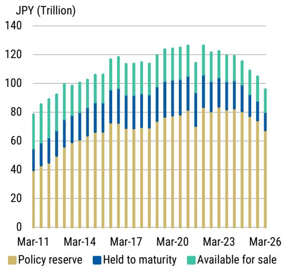

bar_stacked

| Date | Policy reserve (JPY Trillion) | Held to maturity (JPY Trillion) | Available for sale (JPY Trillion) |
| :--- | :--- | :--- | :--- |
| Mar-11 | 40 | 20 | 30 |
| Mar-12 | 45 | 25 | 35 |
| Mar-13 | 50 | 30 | 40 |
| Mar-14 | 55 | 35 | 45 |
| Mar-15 | 60 | 40 | 50 |
| Mar-16 | 65 | 45 | 55 |
| Mar-17 | 70 | 50 | 60 |
| Mar-18 | 75 | 55 | 65 |
| Mar-19 | 80 | 60 | 70 |
| Mar-20 | 85 | 65 | 75 |
| Mar-21 | 90 | 70 | 80 |
| Mar-22 | 95 | 75 | 85 |
| Mar-23 | 100 | 80 | 90 |
| Mar-24 | 105 | 85 | 95 |
| Mar-25 | 110 | 90 | 100 |
| Mar-26 | 115 | 95 | 105 |
The chart displays a stacked bar chart with three categories: Policy reserve (yellow), Held to maturity (blue), and Available for sale (green). The x-axis represents time in years from Mar-11 to Mar-26. The y-axis represents the value in trillions of JPY. There is no label for the data series.

Source: Lifer financial statements, MS

The reduction in holdings 10y+ was concentrated among the major lifers. As noted in "What Major Changes Involving Japan's Lifers and Households Mean For Fixed Income Markets", the major lifers have been rotating from low-coupon bonds into high-coupon bonds, while their relatively abundant unrealized gains on equities give them capacity to offset realized losses from bond sales undertaken to avoid impairment losses.

Meanwhile, some mid-sized lifers recorded modest increases in JGB holdings, but the impact on the overall total was limited because the reduction by the major insurers was large. Some mid-sized lifers with limited capacity to realize gains find it difficult to carry out large-scale sales of low-coupon bonds and loss realization in the same way as the majors (see also our report "Potential Market Impact of Lifers' Accounting Rule Changes").

At the same time, in a rising-rate environment they have an incentive to gradually add higher-yielding bonds, thereby lowering the portfolio's average acquisition cost and improving its book yield. Lifers that still have ALM duration mismatches are also likely to retain demand for super-long bonds.

Exhibit 13: Major eleven Japanese life insurance companies: JGB outstanding by maturity   
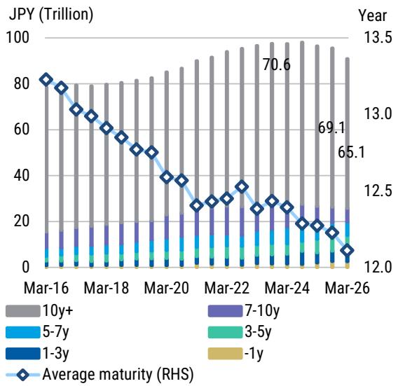

bar_line

| Date | 10y+ (Trillion) | 5-7y (Trillion) | 1-3y (Trillion) | 3-5y (Trillion) | 7-10y (Trillion) | Average maturity (RHS) |
|---|---|---|---|---|---|---|
| Mar-16 | 80 | 5 | 0 | 0 | 0 | 13.5 |
| Mar-17 | 80 | 5 | 0 | 0 | 0 | 13.4 |
| Mar-18 | 80 | 5 | 0 | 0 | 0 | 13.3 |
| Mar-19 | 80 | 5 | 0 | 0 | 0 | 13.2 |
| Mar-20 | 85 | 5 | 0 | 0 | 0 | 12.9 |
| Mar-21 | 90 | 5 | 0 | 0 | 0 | 12.6 |
| Mar-22 | 95 | 5 | 0 | 0 | 0 | 12.4 |
| Mar-23 | 98 | 5 | 0 | 0 | 0 | 12.3 |
| Mar-24 | 100 | 5 | 0 | 0 | 0 | 12.2 |
| Mar-25 | 99 | 5 | 0 | 0 | 0 | 12.1 |
| Mar-26 | 92.1 | 5 | 0 | 0 | 0 | 12.0 |
Average maturity (RHS) = (Year - Month): $70.6, $69.1, $65.1

Source: Lifer financial statements, MS

Exhibit 14: Cumulative net purchase flow of super-long JGBs in each fiscal year by Japan lifers and non-life insurances   
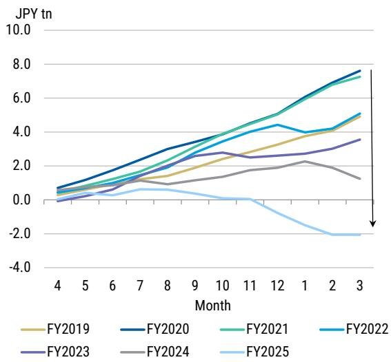

line

| Month | FY2019 | FY2020 | FY2021 | FY2022 | FY2023 | FY2024 | FY2025 |
|-------|--------|--------|--------|--------|--------|--------|--------|
| 4     | 0.5    | 0.7    | 0.6    | 0.8    | 0.4    | 0.3    | 0.1    |
| 5     | 0.6    | 1.0    | 0.8    | 1.1    | 0.5    | 0.4    | 0.2    |
| 6     | 0.7    | 1.3    | 1.0    | 1.4    | 0.6    | 0.5    | 0.3    |
| 7     | 0.8    | 1.6    | 1.2    | 1.7    | 0.7    | 0.6    | 0.4    |
| 8     | 0.9    | 1.9    | 1.4    | 2.0    | 0.8    | 0.7    | 0.5    |
| 9     | 1.0    | 2.2    | 1.6    | 2.3    | 0.9    | 0.8    | 0.6    |
| 10    | 1.1    | 2.5    | 1.8    | 2.6    | 1.0    | 0.9    | 0.7    |
| 11    | 1.2    | 2.8    | 2.0    | 2.9    | 1.1    | 1.0    | 0.8    |
| 12    | 1.3    | 3.1    | 2.2    | 3.2    | 1.2    | 1.1    | -0.1   |
| 1     | 1.4    | 3.4    | 2.4    | 3.5    | 1.3    | 1.2    | -0.3   |
| 2     | 1.5    | 3.7    | 2.6    | 3.8    | 1.4    | 1.3    | -0.5   |
| 3     | 1.6    | 4.0    | 2.8    | 4.1    | 1.5    | 1.4    | -0.7   |

Source: JSDA, MS

Core profits at Japanese lifers increased, but the drivers have not changed. In FY3/26, the downward trend in mortality profits continued. Although part of premium income appears to have recovered on the back of higher interest rates, surrender value payments also increased, and net new money remains weak.

The structure in which improving spread gains, supported by better investment yields, underpin overall core profits has become more pronounced.

Exhibit 15: Major eleven Japanese life insurance companies: Core profits and its breakdown   
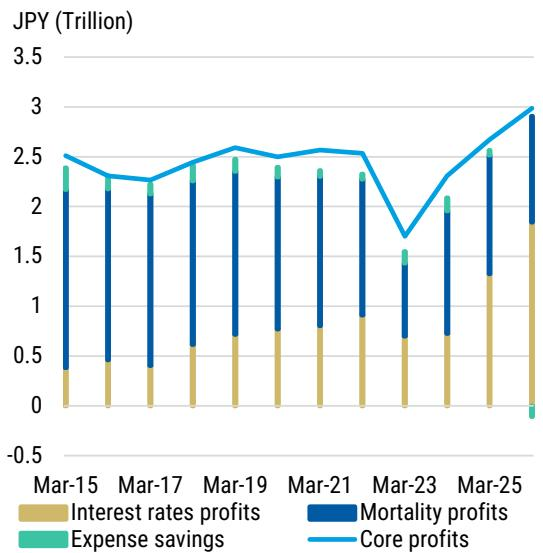

bar_line

| Date | Interest rates profits (Trillion) | Mortality profits (Trillion) | Expense savings (Trillion) | Core profits (Trillion) |
| :--- | :--- | :--- | :--- | :--- |
| Mar-15 | 0.35 | 1.8 | 0.1 | 2.45 |
| Mar-16 | 0.45 | 1.9 | 0.05 | 2.3 |
| Mar-17 | 0.4 | 1.8 | 0.05 | 2.25 |
| Mar-18 | 0.6 | 1.9 | 0.05 | 2.4 |
| Mar-19 | 0.7 | 1.9 | 0.05 | 2.55 |
| Mar-20 | 0.75 | 1.9 | 0.05 | 2.45 |
| Mar-21 | 0.8 | 1.9 | 0.05 | 2.5 |
| Mar-22 | 0.85 | 1.9 | 0.05 | 2.5 |
| Mar-23 | 0.65 | 1.3 | 0.05 | 1.7 |
| Mar-24 | 0.7 | 1.6 | 0.05 | 2.3 |
| Mar-25 | 1.3 | 1.9 | -0.1 | 2.95 |
JPY (Trillion)

Source: Lifer financial statements, MS

Exhibit 16: Japanese lifers' premium income and 30y JGB yield   
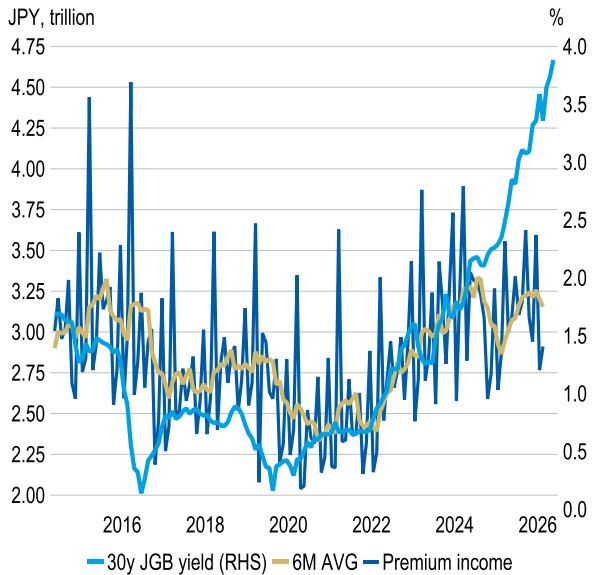

bar_line

| Year | 30y JGB yield (RHS) | 6M AVG | Premium income |
|------|---------------------|--------|----------------|
| 2016 | 2.00                | 3.00   | 3.50           |
| 2018 | 2.50                | 2.75   | 3.60           |
| 2020 | 2.25                | 2.50   | 3.30           |
| 2022 | 2.75                | 2.75   | 3.40           |
| 2024 | 3.00                | 3.00   | 3.90           |
| 2026 | 4.75                | 3.50   | 3.60           |

Source: Bloomberg, Life Insurance Association of Japan, MS

As we pointed out in our report "Is This Déjà Vu?", we expect Japanese lifers' investment stance toward super-long JGBs to remain unchanged.

Higher interest rates have improved the investment appeal of super-long JGBs, but at least among the major lifers, operations are centered on rotating from low-coupon bonds into high-coupon bonds rather than simply increasing balances.

Therefore, gross JGB trading should remain large, but we expect net incremental duration demand and pressure for JGB holdings to increase, remain limited.

Exhibit 17: Major Japanese life insurers' 2H FY2025 investment plans by each asset class 

<table><tr><td>Company</td><td>Domestic Bond</td><td>Foreign Bond(FX hedged)</td><td>Foreign Bond(Non-FX hedged)</td><td>Domestic Stock</td><td>Foreign Stock</td><td>Alternative</td></tr><tr><td>A</td><td>Decrease(Not larger than previous FY of -JPY1.9 trillion)</td><td>Increase</td><td>Flat</td><td>Decrease</td><td colspan="2">Increase</td></tr><tr><td>B</td><td>Flat</td><td>Flat</td><td>Decrease</td><td>Decrease</td><td>Flat</td><td>Increase(PE, PD, HF, Real Asset)</td></tr><tr><td>C</td><td>Increase</td><td>Flat</td><td>Flat</td><td>Increase</td><td colspan="2">Increase(mainly PE)</td></tr><tr><td>D</td><td>Flat</td><td>Decrease</td><td>Decrease</td><td>Slightly Decrease</td><td>Flat</td><td>Increase(Infrastructure, Real Asset)</td></tr><tr><td>E</td><td>Decrease</td><td>Increase</td><td>Decrease</td><td colspan="2">Increase</td><td>Increase</td></tr><tr><td>F</td><td>Flat</td><td>Flat</td><td>Decrease</td><td colspan="2">Flat</td><td>Increase(Direct lending, PE, Foreign real estate, Infrastructure)</td></tr><tr><td>G</td><td>Increase(Super long JGBs: JPY +110 bn, Other JPY bonds: JPY +60bn)</td><td>Flat</td><td>Decrease</td><td colspan="2">Flat</td><td>Increase(Private Credit, PE, Real estate)</td></tr><tr><td>H</td><td>Increase(JPY +200bn)</td><td colspan="2">Decrease</td><td colspan="2">Decrease</td><td>Increase</td></tr><tr><td>I</td><td>Marginally Increase</td><td colspan="2">Flat</td><td colspan="2">Decrease</td><td>Increase</td></tr><tr><td>J</td><td>Decrease(-JPY 65 bn)</td><td colspan="2">Decrease(-JPY 35 bn)</td><td>Decrease(-JPY 5 bn)</td><td>Flat</td><td>Increase(+JPY 5 bn)</td></tr></table>

Source: Bloomberg, Reuters, MS

If JPY rates were to rise sharply, mass-lapse risk under ESR could worsen modeled solvency, reducing the incentive to add duration or making sales of super-long JGBs more likely (which is the negative gamma characteristics). Although we do not assume such a sharp rise in rates as our outlook, from a risk-reward perspective as well, lifers' JGB

demand is likely to remain subdued.

From the perspective of structural demand, it is also important that liability duration itself has shortened compared with the past, reflecting the aging of policyholders and changes in the product mix of new policies (see our report for more detail). During the low-rate period, lifers increased their use of super-long JGBs, receive-fixed swaps, and receiver swaptions for ALM duration matching with ESR compliance in mind.

However, as discussed below, this adjustment has progressed considerably among the major lifers. Accordingly, even if interest-rate levels rise, we do not expect the kind of structural and price-insensitive super-long JGB buying seen in the past to return.

# Derivative demand is likely to vary going forward

The simple notional-basis sum of Japanese lifers' receive-fixed swaps and receiver swaptions decreased from JPY 5.97tn in the September period to JPY 4.62tn as of March 2026.

For Japanese lifers, these receive-side positions provided an incentive to use derivatives for ALM duration matching with economic-value-based solvency regulation in mind.

- Receive-fixed swaps allow lifers to create duration flexibly without moving the balance sheet as much as they would by buying cash bonds. In addition, when hedge accounting requirements are satisfied, they can also reduce accounting volatility in valuation gains and losses.   
- Receiver swaptions allow lifers to construct a nonlinear hedge that adds asset-side duration when interest rates decline, while incurring option premiums in normal times.

That said, not all lifers were active users of derivatives; these positions appear to be concentrated mainly among a few major lifers.

Among the major lifers, duration matching for regulatory purposes has broadly been completed, and in that sense the need to add receive-fixed swaps or receiver swaptions has likely declined compared with the past.

Exhibit 18: Major eleven Japanese life insurance companies: SWAPs (receive fix) and Swaptions (Receiver) outstanding   
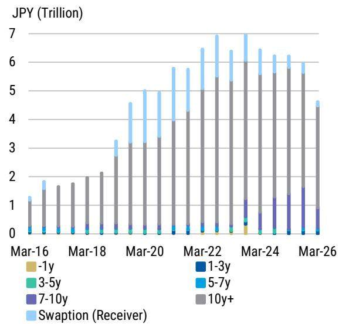

bar_stacked

| Date | -1y | 1-3y | 3-5y | 5-7y | 7-10y | 10y+ | Swaption (Receiver) |
|---|---|---|---|---|---|---|---|
| Mar-16 | 0.0 | 0.0 | 0.0 | 0.0 | 0.0 | 1.2 | 0.1 |
| Mar-17 | 0.0 | 0.0 | 0.0 | 0.0 | 0.0 | 1.6 | 0.2 |
| Mar-18 | 0.0 | 0.0 | 0.0 | 0.0 | 0.2 | 1.9 | 0.2 |
| Mar-19 | 0.0 | 0.0 | 0.1 | 0.0 | 0.2 | 2.1 | 0.4 |
| Mar-20 | 0.0 | 0.1 | 0.2 | 0.1 | 0.2 | 2.7 | 1.3 |
| Mar-21 | 0.0 | 0.1 | 0.2 | 0.1 | 0.2 | 3.3 | 1.9 |
| Mar-22 | 0.0 | 0.1 | 0.2 | 0.1 | 0.2 | 4.4 | 2.4 |
| Mar-23 | 0.1 | 0.1 | 0.2 | 0.1 | 0.2 | 5.4 | 3.3 |
| Mar-24 | 0.3 | 0.1 | 0.2 | 0.1 | 0.7 | 6.1 | 3.3 |
| Mar-25 | 0.0 | 0.1 | 0.2 | 0.1 | 1.3 | 5.5 | 3.3 |
| Mar-26 | 0.0 | 0.1 | 0.2 | 0.1 | 1.6 | 5.6 | 3.3 |
JPY (Trillion)

Source: Lifer financial statements, MS

Exhibit 19: Major eleven Japanese life insurance companies: Swaptions (Receiver) outstanding   
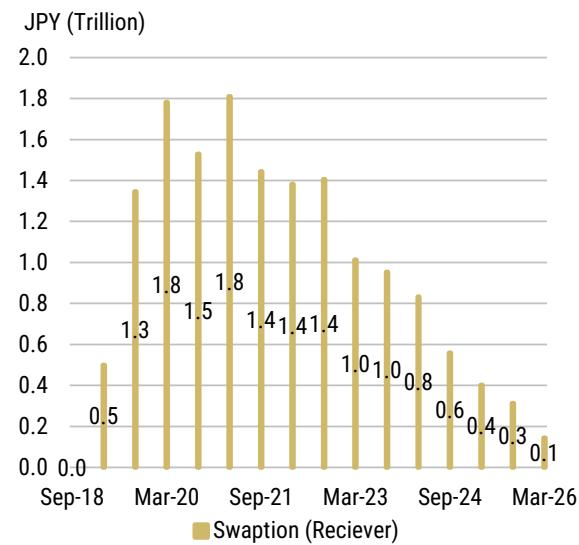

bar

| Date | Swaption (Receiver) (JPY Trillion) |
| :--- | :--- |
| Sep-18 | 0.0 |
| Mar-20 | 1.3 |
| Sep-20 | 1.8 |
| Mar-21 | 1.5 |
| Sep-21 | 1.8 |
| Mar-23 | 1.4 |
| Sep-23 | 1.4 |
| Mar-24 | 1.0 |
| Sep-24 | 1.0 |
| Mar-26 | 0.8 |
| Sep-26 | 0.6 |
| Mar-26 | 0.4 |
| Sep-26 | 0.3 |
| Mar-26 | 0.1 |

Source: Lifer financial statements, MS

In this set of results, the simple notional-basis sum of pay-fixed swaps and payer swaptions also declined, from JPY2.63tn to JPY1.54tn. Swaption balances fell by nearly JPY1tn, while the decline in pay-fixed swap balances was modest.

The major lifers have been rotating from low-coupon bonds into high-coupon bonds, and demand for additional rising-rate hedges against their existing super-long bond portfolios may have declined relative to the past. Alternatively, higher interest-rate volatility may have raised option premiums, suppressing the rolling or new construction of payer swaptions.

At the same time, major Japanese lifers likely still need to address mass-lapse risk under ESR, particularly dynamic lapse risk associated with rising interest rates. Therefore, demand for hedges using payer swaptions and other derivatives has not disappeared completely, and there may be scope for major lifers to rebuild payer swaption positions going forward.

Exhibit 20: Major eleven Japanese life insurance companies: SWAPs (pay fix) and Swaptions (Payer) outstanding   
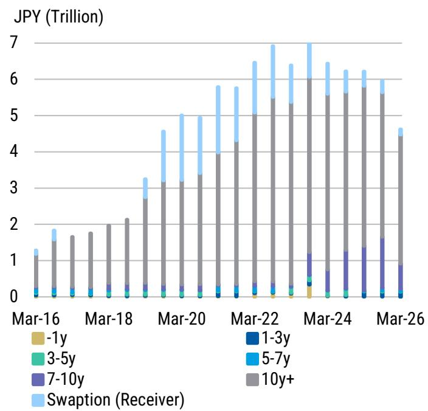

bar_stacked

| Date | -1y | 3-5y | 7-10y | 1-3y | 5-7y | 10y+ | Swaption (Receiver) |
|---|---|---|---|---|---|---|---|
| Mar-16 | 0.0 | 0.0 | 0.0 | 0.0 | 0.0 | 1.0 | 0.0 |
| Mar-17 | 0.0 | 0.0 | 0.0 | 0.0 | 0.0 | 1.5 | 0.0 |
| Mar-18 | 0.0 | 0.0 | 0.0 | 0.0 | 0.0 | 1.8 | 0.0 |
| Mar-19 | 0.0 | 0.0 | 0.0 | 0.0 | 0.0 | 2.2 | 0.0 |
| Mar-20 | 0.0 | 0.0 | 0.0 | 0.0 | 0.0 | 3.2 | 1.4 |
| Mar-21 | 0.0 | 0.0 | 0.0 | 0.0 | 0.0 | 3.8 | 1.8 |
| Mar-22 | 0.0 | 0.0 | 0.0 | 0.0 | 0.0 | 4.2 | 2.2 |
| Mar-23 | 0.1 | 0.1 | 0.1 | 0.1 | 0.1 | 5.5 | 2.8 |
| Mar-24 | 0.2 | 0.2 | 0.3 | 0.1 | 0.1 | 5.8 | 3.2 |
| Mar-25 | 0.1 | 0.1 | 1.3 | 0.1 | 0.1 | 5.8 | 3.2 |
| Mar-26 | 0.1 | 0.1 | 1.6 | 0.1 | 0.1 | 4.5 | 1.4 |
The chart displays a stacked bar chart with categories labeled as 'Swaption (Receiver)' and '1y', '3-5y', '5-7y', '7-10y', and '10y+'. The x-axis represents dates from Mar-16 to Mar-26, and the y-axis represents values in Trillion (JPY). The data is extracted from the image and presented in a CSV format with three columns: 'Year' (top), 'Month' (bottom), and 'Return Rate' (top-right). The bars are color-coded by category, with darker shades indicating higher values for the 'Swaption (Receiver)' category in later years and lighter shades for earlier years and longer maturities.

Source: Lifer financial statements, MS

Exhibit 21: Major eleven Japanese life insurance companies: Swaptions (Payer) outstanding   
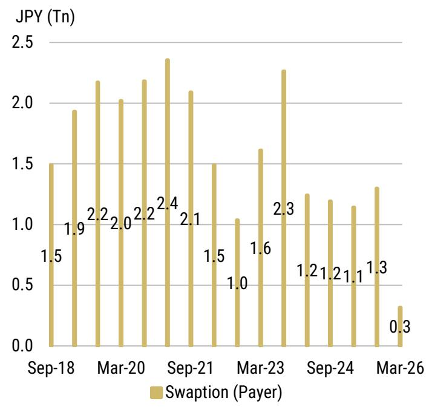

bar

| Date | Swaption (Payer) (JPY Tn) |
| :--- | :--- |
| Sep-18 | 1.5 |
| Mar-20 | 1.9 |
| Mar-20 | 2.2 |
| Mar-20 | 2.0 |
| Mar-20 | 2.2 |
| Sep-21 | 2.4 |
| Sep-21 | 2.1 |
| Sep-21 | 1.5 |
| Mar-23 | 1.0 |
| Mar-23 | 1.6 |
| Mar-23 | 2.3 |
| Sep-24 | 1.2 |
| Sep-24 | 1.2 |
| Sep-24 | 1.1 |
| Mar-26 | 1.3 |
| Mar-26 | 0.3 |

Source: Lifer financial statements, MS

# Foreign bonds: balances increased modestly; outlook remains cautious

Foreign bond balances within other securities increased modestly compared with the September 2025 period. By region, Latin America declined slightly, while North America and Europe rose modestly. North America still accounts for a high share, at 57% of the total.

Exhibit 22: Major eleven Japanese life insurance companies: Foreign bonds outstanding   
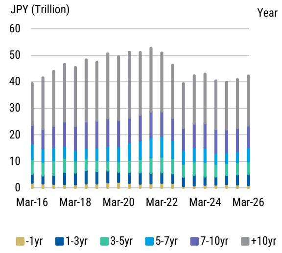

bar_stacked

| Year | -1yr | 1-3yr | 3-5yr | 5-7yr | 7-10yr | +10yr |
|---|---|---|---|---|---|---|
| Mar-16 | 1 | 3 | 4 | 8 | 10 | 19 |
| Mar-17 | 1 | 3 | 4 | 8 | 10 | 20 |
| Mar-18 | 1 | 3 | 4 | 8 | 10 | 20 |
| Mar-19 | 1 | 3 | 4 | 8 | 10 | 20 |
| Mar-20 | 1 | 3 | 4 | 8 | 10 | 20 |
| Mar-21 | 1 | 3 | 4 | 8 | 10 | 20 |
| Mar-22 | 1 | 3 | 4 | 8 | 10 | 20 |
| Mar-23 | 1 | 3 | 4 | 8 | 10 | 20 |
| Mar-24 | 1 | 3 | 4 | 8 | 10 | 20 |
| Mar-25 | 1 | 3 | 4 | 8 | 10 | 20 |
| Mar-26 | 1 | 3 | 4 | 8 | 10 | 20 |

Source: Lifer financial statements, MS

Exhibit 23: Major eleven Japanese life insurance companies: foreign currency denominated bonds outstanding   
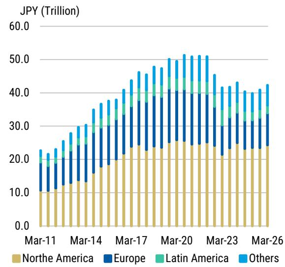

bar_stacked

| Date | North America (Trillion) | Europe (Trillion) | Latin America (Trillion) | Others (Trillion) |
|---|---|---|---|---|
| Mar-11 | 10.0 | 8.0 | 1.0 | 2.0 |
| Mar-12 | 11.0 | 9.0 | 1.0 | 2.0 |
| Mar-13 | 12.0 | 10.0 | 1.0 | 2.0 |
| Mar-14 | 13.0 | 11.0 | 1.0 | 2.0 |
| Mar-15 | 14.0 | 12.0 | 1.0 | 2.0 |
| Mar-16 | 15.0 | 13.0 | 1.0 | 2.0 |
| Mar-17 | 16.0 | 14.0 | 1.0 | 2.0 |
| Mar-18 | 17.0 | 15.0 | 1.0 | 2.0 |
| Mar-19 | 18.0 | 16.0 | 1.0 | 2.0 |
| Mar-20 | 19.0 | 17.0 | 1.0 | 2.0 |
| Mar-21 | 20.0 | 18.0 | 1.0 | 2.0 |
| Mar-22 | 21.0 | 19.0 | 1.0 | 2.0 |
| Mar-23 | 22.0 | 20.0 | 1.0 | 2.0 |
| Mar-24 | 23.0 | 21.0 | 1.0 | 2.0 |
| Mar-25 | 24.0 | 22.0 | 1.0 | 2.0 |
| Mar-26 | 25.0 | 23.0 | 1.0 | 2.0 |
The chart displays a stacked bar chart with the Y-axis labeled 'JPY (Trillion)' and the X-axis labeled 'Date' in descending order from Mar-11 to Mar-26. The legend indicates four categories: North America (tan), Europe (blue), Latin America (green), and Others (light blue). The data is extracted from the image and presented in a CSV format as requested.

Source: Lifer financial statements, MS

At first glance, this is somewhat surprising given that BoP net flow data have continued to show a selling trend. However, financial-statement balances likely reflect not only simple trading flows but also the impact of yen depreciation.

The FX hedge ratio continued to decline. Although hedged asset balances increased for the first time in three half-year periods, the increase in foreign-currency-denominated assets, which appear to be mainly equities, was larger.

Even though FX hedging costs have declined, lifers that are active in foreign bond investment are still taking a tactical stance depending on FX and interest-rate levels. With global interest rates trending upward, the results suggest that this was not a phase in which they actively added exposure.

Exhibit 24: Monthly net purchase of foreign bonds by Japanese lifers   
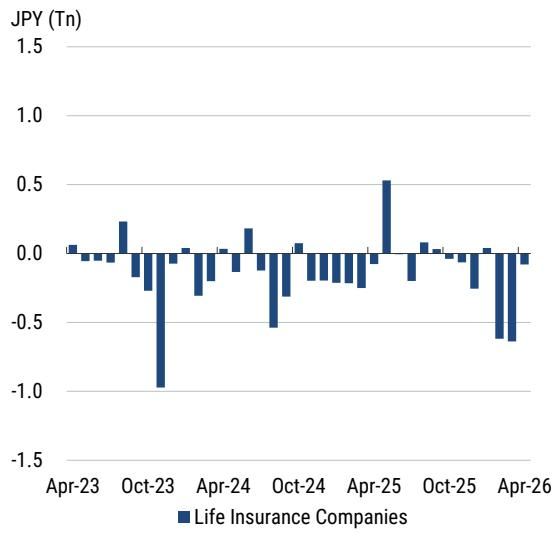

bar

| Date    | Life Insurance Companies (JPY Tn) |
|---------|-----------------------------------|
| Apr-23  | 0.0                               |
| Oct-23  | -0.9                              |
| Apr-24  | -0.3                              |
| Oct-24  | -0.5                              |
| Apr-25  | 0.5                               |
| Oct-25  | -0.7                              |
| Apr-26  | -0.8                              |

Source: Ministry of Finance, MS

Exhibit 25: Major eleven Japanese life insurance companies: Estimated JPY-hedged ratio   
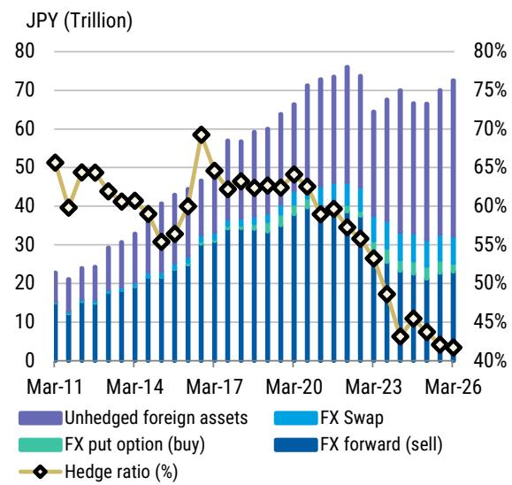

bar_line

| Date | Unhedged foreign assets (Trillion) | FX Swap (Trillion) | FX put option (buy) (Trillion) | FX forward (sell) (Trillion) | Hedge ratio (%) |
|---|---|---|---|---|---|
| Mar-11 | 22 | 0 | 0 | 13 | 52 |
| Mar-12 | 24 | 0 | 0 | 15 | 48 |
| Mar-13 | 26 | 0 | 0 | 17 | 46 |
| Mar-14 | 30 | 0 | 0 | 19 | 44 |
| Mar-15 | 33 | 0 | 0 | 21 | 42 |
| Mar-16 | 41 | 0 | 0 | 23 | 38 |
| Mar-17 | 47 | 0 | 0 | 25 | 60 |
| Mar-18 | 57 | 0 | 0 | 28 | 52 |
| Mar-19 | 59 | 0 | 0 | 30 | 48 |
| Mar-20 | 67 | 0 | 0 | 32 | 46 |
| Mar-21 | 72 | 0 | 0 | 34 | 44 |
| Mar-22 | 75 | 0 | 0 | 36 | 42 |
| Mar-23 | 74 | 0 | 0 | 38 | 38 |
| Mar-24 | 68 | 0 | 0 | 40 | 34 |
| Mar-25 | 67 | 0 | 0 | 42 | 32 |
| Mar-26 | 72 | 0 | 0 | 44 | 30 |
The chart displays a stacked bar chart with 'Unhedged foreign assets' as the base layer and 'FX Swap', 'FX put option (buy)', and 'FX forward (sell)' as the individual components. The 'Hedge ratio (%)' is plotted as a line connecting the bars. The data is already in English.

Source: Lifer financial statements, MS

Investment plans for FY2026 also indicate that lifers remain cautious on both hedged and unhedged foreign bonds. Based on our interest-rate and FX forecasts, even tactical investments are likely to be limited in scale.

We continue not to expect large-scale repatriation into JGBs despite the sharp rise in JGB yields. Since January, the sharp rise in super-long JGB yields has revived the narrative of repatriation by Japanese lifers, but there are currently no signs of this happening.

Japanese lifers' incremental duration demand has declined, and some major lifers may even have an incentive to shorten asset duration in order to correct over-hedging, given shorter liability duration and mass-lapse risk under ESR.

Lifers' funds are more likely to be directed toward diversification of income sources, such as overseas M&A and alternative investments, rather than repatriation into super-long JGBs (as we discussed in our report "What Major Changes Involving Japan's Lifers and Households Mean For Fixed Income Markets").

From the perspective of capital efficiency and ALM, indirect overseas investment channels are also becoming more important, including the transfer of insurance risk through offshore reinsurance and investment by reinsurers in high-yielding overseas assets such as private credit.

# Valuation Methodology and Risks

Below, you will find a list of our current trade ideas, entry levels, entry dates, rationales, and risks.

Exhibit 26: Trade ideas: Valuation methodology and risks 

<table><tr><td colspan="5">Interest Rate Strategy</td></tr><tr><td>TRADE</td><td>ENTRY LEVEL</td><td>ENTRY DATE</td><td>RATIONALE</td><td>RISKS</td></tr><tr><td>Receive July BoJ MPM OIS</td><td>97.1bp</td><td>5/15/2026</td><td>While it is not our economists&#x27; base case, if the Strait of Hormuz remains effectively closed beyond July, our economists see the risk of the BoJ maintaining the status quo for longer as the signs of supply disruption emerge.</td><td>Risk to the trade include consecutive BoJ rate hikes on June and July MPM.</td></tr><tr><td>Short 30y JGB ASW</td><td>57.3bp</td><td>5/15/2026</td><td>We expect renewed fiscal concern to make offshore investors reluctant to buy long-end JGBs, thereby leading to the cheapening of ASW.</td><td>Risk to the trade include strong demand for long-end JGB ASW to persist on the back of its attractive carry profile.</td></tr><tr><td>Buy 5y JGB outright</td><td>1.858%</td><td>4/10/2026</td><td>We think the belly of the curve already prices in enough inflation risk premium. Shifting either &quot;de-escalation&quot; or &quot;Effective closure&quot; scenario should lead to a lower inflation term premium.</td><td>The main risk to this trade is that soaring energy prices cause medium- to long-term inflation expectations to strengthen yet further.</td></tr></table>

Source: MS

Important note regarding economic sanctions. This report references jurisdiction(s) or person(s) which may be the subject of economic sanctions. Readers are solely responsible for ensuring that their investment activities are carried out in compliance with applicable laws.

Global Macro Strategy Team 

<table><tr><td rowspan="5">MS &amp; CO. LLC</td><td>Matthew Hornbach, CMT Matthew.Hornbach@morganstanley.com</td><td>Global Head of Macro Strategy</td><td>+1 212 761-1837</td></tr><tr><td>Martin Tobias, CFA, CMT</td><td>US Rates Strategist</td><td>+1 212 761-6076</td></tr><tr><td>Shaun Zhou</td><td>US Rates Strategist</td><td>+1 212 761-3348</td></tr><tr><td>Aryaman Singh</td><td>US Rates Strategist</td><td>+1 212 761-1993</td></tr><tr><td>Eli Carter</td><td>US Rates Strategist</td><td>+1 212 761-4703</td></tr><tr><td rowspan="6">MS &amp; CO. LLC</td><td>Andrew Watrous</td><td>G10 FX Strategist</td><td>+1 212 761-5287</td></tr><tr><td>Molly Nickolin</td><td>G10 FX Strategist</td><td>+1 212 761-3592</td></tr><tr><td>Simon Waever Simon.Waever@morganstanley.com</td><td>Head of EM Sovereign Credit and Latin America Fixed Income Strategy</td><td>+1 212 296-8101</td></tr><tr><td>Ioana Zamfir</td><td>Head of Latin America Macro Strategy</td><td>+1 212 761-4012</td></tr><tr><td>Emma Cerda</td><td>Latin America Sovereign Credit</td><td>+1 212 761-2344</td></tr><tr><td>Sofia Palacios</td><td>Latin America Macro Strategist</td><td>+1 212 761-0428</td></tr><tr><td rowspan="7">MS &amp; CO. INTERNATIONAL PLC</td><td>James K. Lord James.Lord@morganstanley.com</td><td>Global Head of FXEM Strategy</td><td>+44 20 7677-3254</td></tr><tr><td>Gianluca Salford Luca.Salford@morganstanley.com</td><td>Head of European Rates Strategy</td><td>+44 20 7677-1337</td></tr><tr><td>Maria Chiara Russo</td><td>Euro Area Rates Strategist</td><td>+44 20 7425-3499</td></tr><tr><td>Fabio Bassanin, CFA</td><td>UK Rates Strategist</td><td>+44 20 7425-1869</td></tr><tr><td>David S. Adams, CFA David.S.Adams@morganstanley.com</td><td>Head of G10 FX Strategy</td><td>+44 20 7425-3518</td></tr><tr><td rowspan="2">Neville Mandimika Arnav Gupta</td><td>CEEMEA Sovereign Credit Strategist</td><td>+44 20 7425-2509</td></tr><tr><td>CEEMEA Rates Strategist</td><td>+44 20 7677-0382</td></tr><tr><td>MS ASIA LIMITED+</td><td>Gek Teng Khoo</td><td>AXJ Macro Strategist</td><td>+852 3963-0303</td></tr><tr><td>MS INDIA COMPANY PRIVATE LIMITED</td><td>Nimish Prabhune</td><td>AXJ Macro Strategist</td><td>+91 22 6996-1862</td></tr><tr><td rowspan="2">MS MUFG SECURITIES CO., LTD.</td><td>Koichi Sugisaki Koichi.Sugisaki@morganstanleymufg.com</td><td>Head of Japan Macro Strategy</td><td>+81 3 6836-8428</td></tr><tr><td>Hiromu Uezato</td><td>Japan Macro Strategist</td><td>+81 3 6836-8431</td></tr></table>

# Disclosure Section

The information and opinions in MS were prepared by MS MUFG Securities Co., Ltd. and its affiliates (collectively, "MS").

For important disclosures, stock price charts and equity rating histories regarding companies that are the subject of this report, please see the MS Disclosure Website at www.morganstanley.com/eqr/disclosures/webapp/generalresearch, or contact your investment representative or MS at 1585 Broadway, (Attention: Research Management), New York, NY, 10036 USA.

For valuation methodology and risks associated with any recommendation, rating or price target referenced in this research report, please contact the Client Support Team as follows: US/Canada +1 800 303-2495; Hong Kong +852 2848-5999; Latin America +1 718 754-5444 (U.S.); London +44 (0)20-7425-8169; Singapore +65 6834-6860; Sydney +61 (0)2-9770-1505; Tokyo +81 (0)3-6836-9000. Alternatively you may contact your investment representative or MS at 1585 Broadway, (Attention: Research Management), New York, NY 10036 USA.

# Analyst Certification

The following analysts hereby certify that their views about the companies and their securities discussed in this report are accurately expressed and that they have not received and will not receive direct or indirect compensation in exchange for expressing specific recommendations or views in this report: Koichi Sugisaki; Hiromu Uezato.

# Global Research Conflict Management Policy

MS has been published in accordance with our conflict management policy, which is available at www.morganstanley.com/institutional/research/conflictpolicies. A Portuguese version of the policy can be found at www.morganstanley.com.br

# Important Regulatory Disclosures on Subject Companies

In the next 3 months, MS expects to receive or intends to seek compensation for investment banking services from Japan.

Within the last 12 months, MS has provided or is providing investment banking services to, or has an investment banking client relationship with, the following company: Japan. The equity research analysts or strategists principally responsible for the preparation of MS have received compensation based upon various factors, including quality of research, investor client feedback, stock picking, competitive factors, firm revenues and overall investment banking revenues. Equity Research analysts' or strategists' compensation is not linked to investment banking or capital markets transactions performed by MS or the profitability or revenues of particular trading desks.

MS and its affiliates do business that relates to companies/instruments covered in MS, including market making, providing liquidity, fund management, commercial banking, extension of credit, investment services and investment banking. MS sells to and buys from customers the securities/instruments of companies covered in MS on a principal basis. MS may have a position in the debt of the Company or instruments discussed in this report. MS trades or may trade as principal in the debt securities (or in related derivatives) that are the subject of the debt research report.

Certain disclosures listed above are also for compliance with applicable regulations in non-US jurisdictions.

# STOCK RATINGS

MS uses a relative rating system using terms such as Overweight, Equal-weight, Not-Rated or Underweight (see definitions below). MS does not assign ratings of Buy, Hold or Sell to the stocks we cover. Overweight, Equal-weight, Not-Rated and Underweight are not the equivalent of buy, hold and sell. Investors should carefully read the definitions of all ratings used in MS. In addition, since MS contains more complete information concerning the analyst's views, investors should carefully read MS, in its entirety, and not infer the contents from the rating alone. In any case, ratings (or research) should not be used or relied upon as investment advice. An investor's decision to buy or sell a stock should depend on individual circumstances (such as the investor's existing holdings) and other considerations.

# Global Stock Ratings Distribution

(as of May 31, 2026)

The Stock Ratings described below apply to MS's Fundamental Equity Research and do not apply to Debt Research produced by the Firm.

For disclosure purposes only (in accordance with FINRA requirements), we include the category headings of Buy, Hold, and Sell alongside our ratings of Overweight, Equal-weight, Not-Rated and Underweight. MS does not assign ratings of Buy, Hold or Sell to the stocks we cover. Overweight, Equal-weight, Not-Rated and Underweight are not the equivalent of buy, hold, and sell but represent recommended relative weightings (see definitions below). To satisfy regulatory requirements, we correspond Overweight, our most positive stock rating, with a buy recommendation; we correspond Equal-weight and Not-Rated to hold and Underweight to sell recommendations, respectively.

<table><tr><td></td><td colspan="2">Coverage Universe</td><td colspan="3">Investment Banking Clients (IBC)</td><td colspan="2">Other Material Investment ServicesClients (MISC)</td></tr><tr><td>Stock RatingCategory</td><td>Count</td><td>% of Total</td><td>Count</td><td>% of Total IBC</td><td>% of RatingCategory</td><td>Count</td><td>% of Total OtherMISC</td></tr><tr><td>Overweight/Buy</td><td>1542</td><td>42%</td><td>465</td><td>51%</td><td>30%</td><td>707</td><td>43%</td></tr><tr><td>Equal-weight/Hold</td><td>1571</td><td>43%</td><td>369</td><td>40%</td><td>23%</td><td>723</td><td>44%</td></tr><tr><td>Not-Rated/Hold</td><td>3</td><td>0%</td><td>0</td><td>0%</td><td>0%</td><td>1</td><td>0%</td></tr><tr><td>Underweight/Sell</td><td>551</td><td>15%</td><td>86</td><td>9%</td><td>16%</td><td>201</td><td>12%</td></tr><tr><td>Total</td><td>3,667</td><td></td><td>920</td><td></td><td></td><td>1632</td><td></td></tr></table>

Data include common stock and ADRs currently assigned ratings. Investment Banking Clients are companies from whom MS received investment banking compensation in the last 12 months. Due to rounding off of decimals, the percentages provided in the "% of total" column may not add up to exactly 100 percent.

# Analyst Stock Ratings

Overweight (O). The stock's total return is expected to exceed the average total return of the analyst's industry (or industry team's) coverage universe, on a risk-adjusted basis, over the next 12-18 months.

Equal-weight (E). The stock's total return is expected to be in line with the average total return of the analyst's industry (or industry team's) coverage universe, on a risk-adjusted basis, over

the next 12-18 months.

Not-Rated (NR). Currently the analyst does not have adequate conviction about the stock's total return relative to the average total return of the analyst's industry (or industry team's) coverage universe, on a risk-adjusted basis, over the next 12-18 months.

Underweight (U). The stock's total return is expected to be below the average total return of the analyst's industry (or industry team's) coverage universe, on a risk-adjusted basis, over the next 12-18 months.

Unless otherwise specified, the time frame for price targets included in MS is 12 to 18 months.

# Analyst Industry Views

Attractive (A): The analyst expects the performance of his or her industry coverage universe over the next 12-18 months to be attractive vs. the relevant broad market benchmark, as indicated below.

In-Line (I): The analyst expects the performance of his or her industry coverage universe over the next 12-18 months to be in line with the relevant broad market benchmark, as indicated below. Cautious (C): The analyst views the performance of his or her industry coverage universe over the next 12-18 months with caution vs. the relevant broad market benchmark, as indicated below. Benchmarks for each region are as follows: North America - S&P 500; Latin America - relevant MSCI country index or MSCI Latin America Index; Europe - MSCI Europe; Japan - TOPIX; Asia - relevant MSCI country index or MSCI sub-regional index or MSCI AC Asia Pacific ex Japan Index.

# Important Disclosures for MS Smith Barney LLC Customers

Important disclosures regarding any material conflict of interest that can reasonably be expected to have influenced MS Smith Barney LLC's choice of a third-party research provider or the subject company of a third-party research report, are available on the MS Wealth Management disclosure website at www.morganstanley.com/online/researchdisclosures. For MS specific disclosures, you may refer to https://www.morganstanley.com/eqr/disclosures/webapp/generalresearch.

Each MS report is reviewed and approved on behalf of MS Smith Barney LLC. This review and approval is conducted by the same person who reviews the research report on behalf of MS. This could create a conflict of interest.

# Other Important Disclosures

MS policy is to update research reports as and when the Research Analyst and Research Management deem appropriate, based on developments with the issuer, the sector, or the market that may have a material impact on the research views or opinions stated therein. In addition, certain Research publications are intended to be updated on a regular periodic basis (weekly/monthly/quarterly/annual) and will ordinarily be updated with that frequency, unless the Research Analyst and Research Management determine that a different publication schedule is appropriate based on current conditions.

MS is not acting as a municipal advisor and the opinions or views contained herein are not intended to be, and do not constitute, advice within the meaning of Section 975 of the Dodd-Frank Wall Street Reform and Consumer Protection Act.

MS produces an equity research product called a "Tactical Idea." Views contained in a "Tactical Idea" on a particular stock may be contrary to the recommendations or views expressed in research on the same stock. This may be the result of differing time horizons, methodologies, market events, or other factors. For all research available on a particular stock, please contact your sales representative or go to Matrix at http://www.morganstanley.com/matrix.

MS is provided to our clients through our proprietary research portal on Matrix and also distributed electronically by MS to clients. Certain, but not all, MS products are also made available to clients through third-party vendors or redistributed to clients through alternate electronic means as a convenience. For access to all available MS, please contact your sales representative or go to Matrix at http://www.morganstanley.com/matrix.

Any access and/or use of MS is subject to MS's Terms of Use (http://www.morganstanley.com/terms.html). By accessing and/or using MS, you are indicating that you have read and agree to be bound by our Terms of Use (http://www.morganstanley.com/terms.html). In addition you consent to MS processing your personal data and using cookies in accordance with our Privacy Policy and our Global Cookies Policy (http://www.morganstanley.com/privacy\_pledge.html), including for the purposes of setting your preferences and to collect readership data so that we can deliver better and more personalized service and products to you. To find out more information about how MS processes personal data, how we use cookies and how to reject cookies see our Privacy Policy and our Global Cookies Policy (http://www.morganstanley.com/privacy\_pledge.html). Please use the provided link to review the Terms and Conditions and Most Important Terms and Conditions for MS India Company Private Limited (https://www.morganstanley.com/assets/pdfs/about-us-global-offices/india/Terms\_and\_conditions.pdf) and the following link to review the audit report (https://ny.matrix.ms.com/eqr/research/webapp/researchdocs/MSICPL\_Morgan\_Stanley\_Research\_Audit\_Report.pdf).

If you do not agree to our Terms of Use and/or if you do not wish to provide your consent to MS processing your personal data or using cookies please do not access our research. MS does not provide individually tailored investment advice. MS has been prepared without regard to the circumstances and objectives of those who receive it. MS recommends that investors independently evaluate particular investments and strategies, and encourages investors to seek the advice of a financial adviser. The appropriateness of an investment or strategy will depend on an investor's circumstances and objectives. The securities, instruments, or strategies discussed in MS may not be suitable for all investors, and certain investors may not be eligible to purchase or participate in some or all of them. MS is not an offer to buy or sell or the solicitation of an offer to buy or sell any security/instrument or to participate in any particular trading strategy. The value of and income from your investments may vary because of changes in interest rates, foreign exchange rates, default rates, prepayment rates, securities/instruments prices, market indexes, operational or financial conditions of companies or other factors. There may be time limitations on the exercise of options or other rights in securities/instruments transactions. Past performance is not necessarily a guide to future performance. Estimates of future performance are based on assumptions that may not be realized. If provided, and unless otherwise stated, the closing price on the cover page is that of the primary exchange for the subject company's securities/instruments.

The fixed income research analysts, strategists or economists principally responsible for the preparation of MS have received compensation based upon various factors, including quality, accuracy and value of research, firm profitability or revenues (which include fixed income trading and capital markets profitability or revenues), client feedback and competitive factors. Fixed Income Research analysts', strategists' or economists' compensation is not linked to investment banking or capital markets transactions performed by MS or the profitability or revenues of particular trading desks.

The "Important Regulatory Disclosures on Subject Companies" section in MS lists all companies mentioned where MS owns 1% or more of a class of common equity securities of the companies. For all other companies mentioned in MS, MS may have an investment of less than 1% in securities/instruments or derivatives of securities/instruments of companies and may trade them in ways different from those discussed in MS. Employees of MS not involved in the preparation of MS may have investments in securities/instruments or derivatives of securities/instruments of companies mentioned and may trade them in ways different from those discussed in MS. Derivatives may be issued by MS or associated persons.

With the exception of information regarding MS, MS is based on public information. MS makes every effort to use reliable, comprehensive information, but we make no representation that it is accurate or complete. We have no obligation to tell you when opinions or information in MS change apart from when we intend to discontinue equity research coverage of a subject company. Facts and views presented in MS have not been reviewed by, and may not reflect information known to, professionals in other MS business areas, including investment banking personnel.

MS personnel may participate in company events such as site visits and are generally prohibited from accepting payment by the company of associated expenses unless pre-approved by authorized members of Research management.

MS may make investment decisions that are inconsistent with the recommendations or views in this report.

To our readers based in Taiwan or trading in Taiwan securities/instruments: Information on securities/instruments that trade in Taiwan is distributed by MS Taiwan Limited ("MSTL"). Such information is for your reference only. The reader should independently evaluate the investment risks and is solely responsible for their investment decisions. MS may not be distributed to the public media or quoted or used by the public media without the express written consent of MS. Any non-customer reader within the scope of Article 7-1 of the Taiwan Stock Exchange Recommendation Regulations accessing and/or receiving MS is not permitted to provide MS to any third party (including but not limited to related parties, affiliated companies and any other third parties) or engage in any activities regarding MS which may create or give the appearance of creating a conflict of interest. Information on securities/instruments that do not trade in Taiwan is for informational purposes only and is not to be construed as a recommendation or a solicitation to trade in such securities/instruments. MSTL may not execute transactions for clients in these securities/instruments.

MS is not incorporated under PRC law and the research in relation to this report is conducted outside the PRC. MS does not constitute an offer to sell or the solicitation of an offer to buy any securities in the PRC. PRC investors shall have the relevant qualifications to invest in such securities and shall be responsible for obtaining all relevant approvals, licenses, verifications and/or registrations from the relevant governmental authorities themselves. Neither this report nor any part of it is intended as, or shall constitute, provision of any consultancy or advisory service of securities investment as defined under PRC law. Such information is provided for your reference only.

MS is disseminated in Brazil by MS C.T.V.M. S.A. located at Av. Brigadeiro Faria Lima, 3600, 6th floor, São Paulo - SP, Brazil; and is regulated by the Comissão de Valores Mobiliários; in Mexico by MS México, Casa de Bolsa, S.A. de C.V which is regulated by Comision Nacional Bancaria y de Valores. Paseo de los Tamarindos 90, Torre 1, Col. Bosques de las Lomas Floor 29, 05120 Mexico City; in Japan by MS MUFG Securities Co., Ltd. and, for Commodities related research reports only, MS Capital Group Japan Co., Ltd; in Hong Kong by MS Asia Limited (which accepts responsibility for its contents) and by MS Bank Asia Limited; in Singapore by MS Asia (Singapore) Pte. (Registration number 199206298Z) and/or MS Asia (Singapore) Securities Pte Ltd (Registration number 200008434H), regulated by the Monetary Authority of Singapore (which accepts legal responsibility for its contents and should be contacted with respect to any matters arising from, or in connection with, MS) and by MS Bank Asia Limited, Singapore Branch (Registration number T14FC0118); in Australia to "wholesale clients" within the meaning of the Australian Corporations Act by MS Australia Limited A.B.N. 67 003 734 576, holder of Australian financial services license No. 233742, which accepts responsibility for its contents; in Australia to "wholesale clients" and "retail clients" within the meaning of the Australian Corporations Act by MS Wealth Management Australia Pty Ltd (A.B.N. 19 009 145 555, holder of Australian financial services license No. 240813, which accepts responsibility for its contents; in Korea by MS & Co International plc, Seoul Branch; in India by MS India Company Private Limited having Corporate Identification No (CIN) U22990MH1998PTC115305, regulated by the Securities and Exchange Board of India ("SEBI") and holder of licenses as a Research Analyst (SEBI Registration No. INH000001105); Stock Broker (SEBI Stock Broker Registration No. INZ000244438), Merchant Banker (SEBI Registration No. INM000011203), and depository participant with National Securities Depository Limited (SEBI Registration No. IN-DP-NSDL-567-2021) having registered office at Altimus, Level 39 & 40, Pandurang Budhkar Marg, Worli, Mumbai 400018, India; Telephone no. +91-22-61181000; Compliance Officer Details: Mr. Tejarshi Hardas, Tel. No.: +91-22-61181000 or Email: tejarshi.hardas@morganstanley.com; Grievance officer details: Mr. Tejarshi Hardas, Tel. No.: +91-22-61181000 or Email: msic-compliance@morganstanley.com. MS India Company Private Limited (MSICPL) may use AI tools in providing research services. All recommendations contained herein are made by the duly qualified research analysts; in Canada by MS Canada Limited; in Germany and the European Economic Area where required by MS Europe S.E., authorised and regulated by Bundesanstalt fuer Finanzdienstleistungsaufsicht (BaFin) under the reference number 149169; in the US by MS & Co. LLC, which accepts responsibility for its contents. MS & Co. International plc, authorized by the Prudential Regulation Authority and regulated by the Financial Conduct Authority and the Prudential Regulation Authority, disseminates in the UK research that it has prepared, and research which has been prepared by any of its affiliates, only to persons who (i) are investment professionals falling within Article 19(5) of the Financial Services and Markets Act 2000 (Financial Promotion) Order 2005 (as amended, the "Order"); (ii) are persons who are high net worth entities falling within Article 49(2)(a) to (d) of the Order; or (iii) are persons to whom an invitation or inducement to engage in investment activity (within the meaning of section 21 of the Financial Services and Markets Act 2000, as amended) may otherwise lawfully be communicated or caused to be communicated. RMB MS Proprietary Limited is a member of the JSE Limited and A2X (Pty) Ltd. RMB MS Proprietary Limited is a joint venture owned equally by MS International Holdings Inc. and RMB Investment Advisory (Proprietary) Limited, which is wholly owned by FirstRand Limited. The information in MS is being disseminated by MS Saudi Arabia, regulated by the Capital Market Authority in the Kingdom of Saudi Arabia, and is directed at Sophisticated investors only.

The information in MS is being communicated by MS & Co. International plc (DIFC Branch), regulated by the Dubai Financial Services Authority (the DFSA) or by MS & Co. International plc (ADGM Branch), regulated by the Financial Services Regulatory Authority Abu Dhabi (the FSRA), and is directed at Professional Clients only, as defined by the DFSA or the FSRA, respectively. The financial products or financial services to which this research relates will only be made available to a customer who we are satisfied meets the regulatory criteria of a Professional Client. A distribution of the different MS Research ratings or recommendations, in percentage terms for Investments in each sector covered, is available upon request from your sales representative.

The information in MS is being communicated by MS & Co. International plc (QFC Branch), regulated by the Qatar Financial Centre Regulatory Authority (the QFCRA), and is directed at business customers and market counterparties only and is not intended for Retail Customers as defined by the QFCRA.

As required by the Capital Markets Board of Turkey, investment information, comments and recommendations stated here, are not within the scope of investment advisory activity. Investment advisory service is provided exclusively to persons based on their risk and income preferences by the authorized firms. Comments and recommendations stated here are general in nature. These opinions may not fit to your financial status, risk and return preferences. For this reason, to make an investment decision by relying solely to this information stated here may not bring about outcomes that fit your expectations.

The trademarks and service marks contained in MS are the property of their respective owners. Third-party data providers make no warranties or representations relating to the accuracy, completeness, or timeliness of the data they provide and shall not have liability for any damages relating to such data. The Global Industry Classification Standard (GICS) was developed by and is the exclusive property of MSCI and S&P.

MS, or any portion thereof may not be reprinted, sold or redistributed without the written consent of MS.

Indicators and trackers referenced in MS may not be used as, or treated as, a benchmark under Regulation EU 2016/1011, or any other similar framework.

The issuers and/or fixed income products recommended or discussed in certain fixed income research reports may not be continuously followed. Accordingly, investors should regard those fixed income research reports as providing stand-alone analysis and should not expect continuing analysis or additional reports relating to such issuers and/or individual fixed income products.

MS may hold, from time to time, material financial and commercial interests regarding the company subject to the Research report.

Registration granted by SEBI and certification from the National Institute of Securities Markets (NISM) in no way guarantee performance of the intermediary or provide any assurance of returns to investors. Investment in securities market are subject to market risks. Read all the related documents carefully before investing.

The following authors are Fixed Income Research Analysts/Strategists and are not opining on or expressing recommendations on equity securities: Koichi Sugisaki; Hiromu Uezato.

© 2026 MS