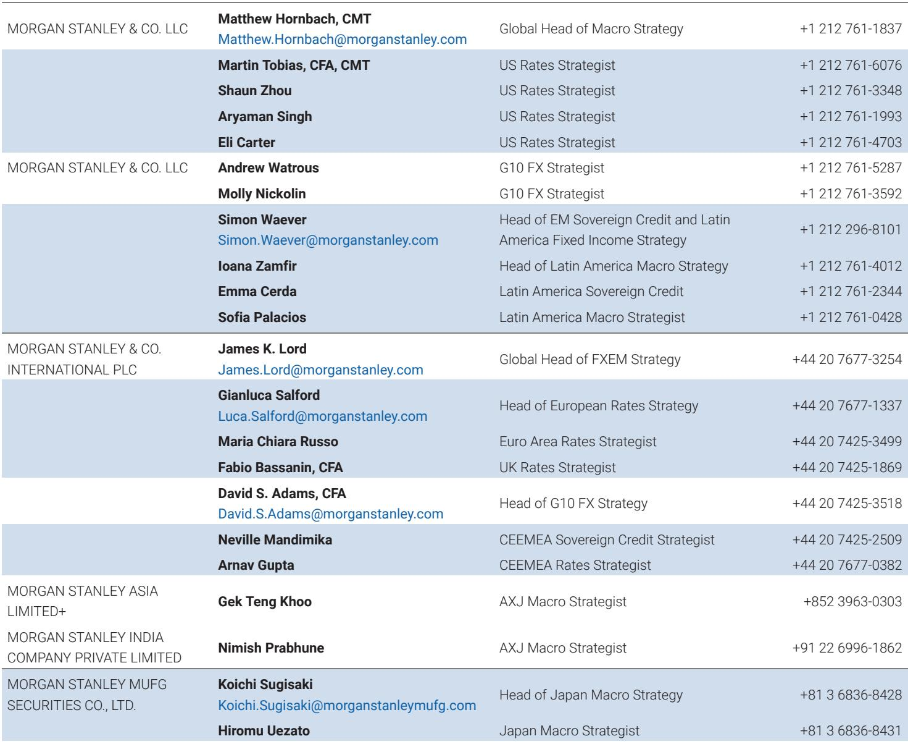
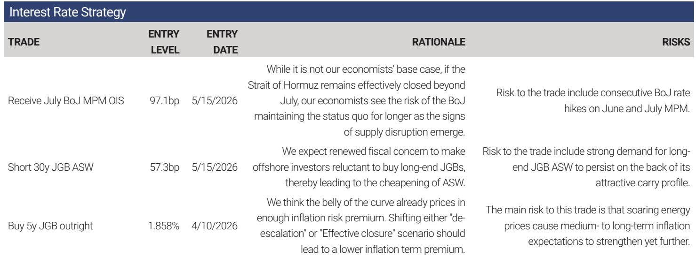
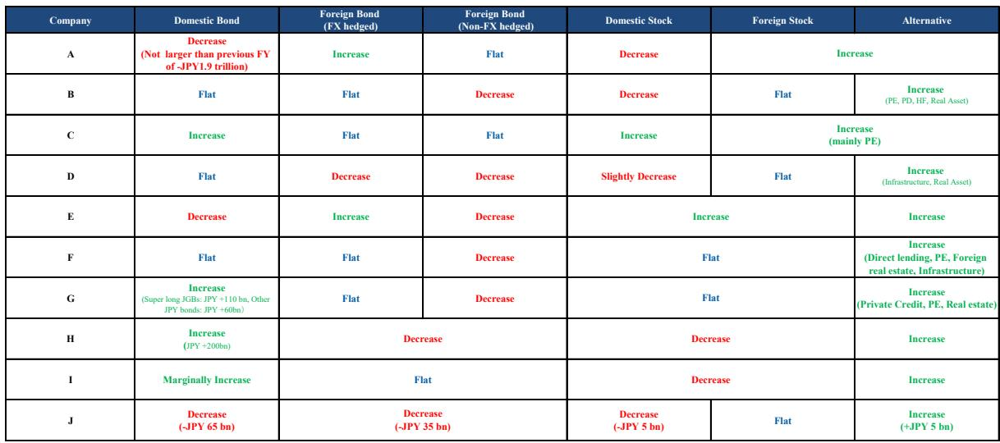

# The 10-Year JGB Rally Has Room to Run: A 30-Basis-Point Opportunity in the Belly of the Curve

The Japanese Government Bond market has reached an inflection point. After months of relentless pressure from inflation overshoot fears and hawkish Bank of Japan rhetoric, the 10-year sector is finally stabilizing. But this is not merely a pause. For investors who can look past the immediate noise of rate-hike expectations, a compelling tactical opportunity is emerging: the belly of the JGB curve still carries an estimated 30-40 basis points of inflation risk premium that is likely to compress as the market's focus shifts from price pressures to growth downside risks.

The risk that the BoJ is falling behind the curve has eased considerably, even as Middle East uncertainty remains elevated. The breakeven inflation rate has stopped making new highs, and the 10-year JGB auction on June 2nd confirmed strong investor demand from direct allotment participants. Yet the market is still pricing in nearly three rate hikes over the next twelve months, leaving limited room for further front-end repricing. The real action, and the real opportunity, lies further out the curve.

The central argument is straightforward but powerful: the belly of the curve is pricing in an inflation scare that the data does not support, and a growth slowdown that the market has not yet fully discounted. If prolonged Middle East tensions weaken growth through supply-chain disruption and tighter financial conditions, the inflation risk premium embedded in medium-term JGBs should compress meaningfully. The question is not whether yields will rally, but how far.

## The Market Has Priced a Hawkish BoJ Fully, Leaving Asymmetric Reward for Dovish Surprises

The BoJ's communication has been unambiguously hawkish. Governor Ueda's recent speech to the Kisaragi-kai emphasized upside risks to prices, highlighted that real rates remain negative, and stressed the importance of maintaining market confidence in the central bank's commitment to controlling inflation. The market has listened intently. Short-term rate expectations have repriced sharply higher, and the cumulative change in pricing across the curve since late February shows a clear front-end skew.

But here is the critical insight: the market has already priced in almost everything the BoJ has signaled. The implied pace of rate hikes over the next twelve months stands at just under three 25-basis-point moves. According to media reports, the BoJ is considering a hike at the June meeting and sees the possibility of additional moves later this year. The market has already discounted this scenario almost fully. Survey-based expectations from the QUICK monthly bond survey still show the dominant view for a terminal rate around 1.5 percent, which is consistent with the current pricing.

What does this mean for a strategic investor? It means that the front end of the curve offers very little room for further repricing to the upside. The risk-reward has shifted. Any dovish surprise—whether from weaker economic data, a more cautious BoJ, or an external shock that forces the central bank to pause—would result in a meaningful compression of front-end yields. The asymmetry is now tilted toward lower rates, not higher.

## The Inflation Risk Premium in the Belly Is 30-40 Basis Points and Supported by Neither Data nor Surveys

The most striking finding in the analysis is the persistent gap between market-based and survey-based inflation expectations. The 10-year breakeven inflation rate is currently around 30-40 basis points above the survey-based inflation forecast from QUICK, which remains broadly flat below 2 percent. This gap is not an anomaly; it is a structural feature of the current market environment, driven by the inflation overshoot narrative that has dominated since the Middle East tensions escalated.

Yet the actual data tells a different story. April consumer prices, after excluding special factors, were not strong. The timing of price revisions by many companies in April failed to generate the same momentum as last fiscal year. The Nikkei CPINow tracking data shows supermarket prices—which are closest to consumers' perceived inflation—continuing to decelerate. Point-of-sale retail sales remain negative year-on-year in real terms. Surveys from Teikoku Databank suggest that companies are becoming more cautious about passing on costs beyond raw materials, reflecting concerns about losing customers.

The gap between market pricing and economic reality is the source of the opportunity. If the market begins to focus more on growth concerns caused by a prolonged Middle East shock, the inflation risk premium should compress. The fair-value model for 10-year OIS rates, which uses near-term BoJ rate-hike pricing and the 10-year US Treasury yield as explanatory variables, shows that the current yield level is significantly above fair value. The residual is almost entirely explained by elevated inflation expectations.

## Growth Downside Risks Are Emerging, Even If the BoJ Has Not Yet Acknowledged Them

The BoJ's hawkish stance is predicated on the view that upside risks to prices dominate downside risks to growth. Governor Ueda explicitly argued that downside risks to the economy were limited, citing resilient corporate earnings and private consumption supported by wage increases. But the data is beginning to challenge this narrative.

The January-March Financial Statements Statistics of Corporations by Industry revealed a sharp slowdown in capital expenditure. Excluding software investment related to artificial intelligence, capex slowed to -3.5 percent quarter-on-quarter. This weakness emerged as uncertainty around the Middle East began to build. Following these results, economists have revised down their forecast for first-quarter real GDP. For the April-June period, nominal GDP could show signs of stalling outside AI-related special demand if the turmoil in the Middle East persists.

The channel through which this happens is a deterioration in the terms of trade. Higher energy and shipping costs squeeze corporate margins, reduce real incomes, and dampen consumption. The BoJ is concerned about the CGPI rising, but this is a supply-side shock that depresses output, not a demand-driven inflation that warrants tighter policy. If Middle East tensions persist and supply-chain disruptions become more visible, the market should begin to focus more on the risk of slowing growth. In that case, the inflation risk premium in the belly should decline.

## Lifers Are Not Providing Duration Support, But That May Be a Contrarian Signal

One of the most interesting findings from the report concerns the behavior of large life insurance companies. The analysis of lifers' disclosure at end-FY2025 shows that these major institutional investors decreased their 10-year-and-longer JGB holdings in FY2026 amid switching operations from low-coupon to high-coupon bonds. There is limited net duration demand and no clear sign of repatriation.

This is important context for understanding the current market dynamics. The absence of lifer buying has been a headwind for long-end JGBs, and it helps explain why the curve has remained steep despite the BoJ's hawkish tilt. But the strategic implication is more nuanced. If the inflation risk premium compresses and yields rally, lifers may be forced to extend duration to meet their liability-matching requirements. The very lack of current demand could set the stage for future buying pressure.

Swap and swaption notionals have also declined as ESR-driven ALM adjustments matured. Payer hedges may be rebuilt selectively to manage lapse risk, but not to add broad duration. This means that the hedging demand that has been a source of short-end pressure is likely to diminish, further supporting the case for a belly rally.

## What the Report Does Not Fully Answer: The Duration of the Middle East Shock and the BoJ's Reaction Function

The analysis makes a compelling case for a 20-30 basis point rally in 10-year JGB yields through the compression of the inflation risk premium. But two critical uncertainties remain unaddressed.

First, the duration of the Middle East shock is the key variable. The report uses Polymarket data on the Strait of Hormuz returning to normal as a proxy for geopolitical risk. But the path from current tensions to a resolution is highly uncertain. If the shock persists longer than expected, supply-chain disruptions could become more severe, and the growth impact could be larger than modeled. Conversely, a rapid resolution could see the inflation risk premium collapse quickly, but the growth narrative would also fade, limiting the rally.

Second, the BoJ's reaction function under a prolonged growth shock is unclear. Governor Ueda has emphasized that the BoJ is more alert to upside risks to prices. But if growth data deteriorates significantly, the central bank could be forced to pause or even reverse course. The market is pricing in nearly three hikes over the next twelve months, but this pricing assumes that the BoJ maintains its current hawkish stance. A dovish pivot would trigger a significant repricing of the entire curve.

These are not weaknesses in the analysis; they are the open questions that make the trade interesting. The rally potential depends on the interplay between these two uncertainties, and investors need to form their own views on the likely path.

## A Decision Framework for Positioning in the Belly of the Curve

For strategic investors, the current environment offers a clear framework for decision-making. The core trade is to be long the belly of the JGB curve, specifically the 5-to-10-year sector, funded by short positions in the front end or by outright cash.

The rationale rests on three pillars. First, the inflation risk premium is elevated and unsupported by data. Second, the market has already priced in a hawkish BoJ, leaving limited room for further repricing. Third, growth downside risks are emerging and are likely to become the dominant narrative if the Middle East shock persists.

The risk to this trade is that the BoJ delivers more than the three hikes currently priced, or that inflation data surprises to the upside. But the asymmetry is favorable. The potential for a 20-30 basis point rally through premium compression outweighs the risk of a 10-15 basis point sell-off from additional hawkish surprises.

Position sizing should reflect the uncertainty around the timing of the rally. The compression of the inflation risk premium is likely to be gradual, occurring as data points confirm the growth slowdown and the market shifts its focus. Investors should be patient and use any short-term weakness to add to positions.

The key monitoring points are the monthly CPI releases, the BoJ's policy statements, and the trajectory of Middle East tensions. If the data continues to show decelerating inflation and weakening growth, the case for the trade strengthens. If the geopolitical situation escalates further, the growth impact becomes more certain, and the inflation risk premium should compress faster.

## Join the Community to Read the Full Report and Review the Original Charts

The analysis presented here draws on a detailed global investment bank report that includes proprietary fair-value models, breakeven analysis, and institutional flow data that cannot be fully replicated in a summary. The original report contains the charts and exhibits that underpin the argument, including the OIS fair-value model, the comparison of market-based and survey-based inflation expectations, and the detailed analysis of lifer positioning.

For investors who want to understand the full analytical framework and make informed decisions, the complete report is essential reading. It provides the data, the models, and the institutional context that this article can only outline. Join the community to read the full report and review the original charts.

*This article is for learning and discussion only and does not constitute investment advice.*

Personal reading notes and learning share only. Not investment advice.

