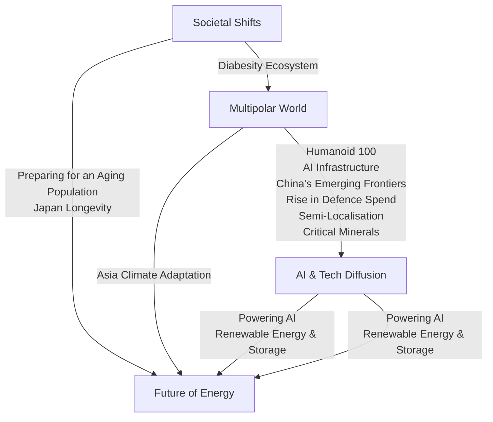

你是知乎商业/行业研究作者，擅长把英文/中文研报改写成适合知乎发布的长文。

【目标】
- 基于下面研报解析内容，生成一篇中文知乎文章。
- 风格接近微信公众号文章，但更适合知乎：论证更完整、语气更克制、有问题意识、有推理链条。
- 文章不需要把研报所有内容讲完，要留下继续阅读完整报告或加入社群讨论的空间。
- 目标长度：约 2200 字，允许上下浮动 20%。

【结构要求】
1. 第一行：知乎标题，直接讲观点，不要标题党，不要夸张极限词。
2. 开头 2-3 段：用一个真实问题或市场分歧切入，说明为什么这份报告值得看。
3. 正文按金字塔原则组织：先给核心判断，再展开 3-5 个支撑逻辑。
4. 每个小标题都要像观点句，不要写“核心判断”“支撑逻辑一”“对读者的启发”这种模板名。
5. 内容要比小红书更理性，比微信更像问答式分析，可以适度提出反问。
6. 结尾自然留下讨论空间，可使用这类表达：`完整报告里还有不少细节，适合放在社群里继续拆。`

【平台发布合规要求】
- 不要出现“投资建议”“买入”“卖出”“强烈推荐”“稳赚”“保本”“必涨”“抄底”“上车”“内幕”“翻倍”等金融操作或收益承诺表达。
- 不要写“非投资建议”“仅做学习交流”这种免责声明，也不要出现包含“投资”的免责声明。
- “投资”相关词尽量改成“投研”“研究”“观察”“学习参考”。
- 不要写“关注”“点赞”“求关注”“评论区留言”等直接互动诱导。
- 不要使用“爆款”“震惊”“必看”“必读”“最强”“最全”“唯一”“全网首发”等极限词。

【内容要求】
- 只能基于研报原文和解析内容推导，不要编造数据、页数、作者、结论或引用。
- 可以基于报告内容做适度发散，但必须明确哪些是报告内容，哪些是你的延展观察。
- 默认避免具体投行品牌名，比如“GS”“GS”，统一写作“投行研报”或使用 GS/JPM/MS 等缩写。
- 不要输出解释说明，只输出知乎文章正文。

【研报解析内容】
"""
# Investor Presentation | Asia Pacific

# Asia Equity Strategy and Thematic Research: Opportunities in the Collision of Themes

The competitive reinvention of Asia and global thematic drivers have set up an investment supercycle across AI Infra, Energy/Economic Security and Defence. We continue to prefer upstream sectors and Financials vs. consumer/services, but highlight potential opportunities to broaden out from Compute.

Asia and EM equities provide an array of thematic opportunities, with strongest concentrations in Japan, Korea and Taiwan, underpinned by a broadening reform agenda that also includes Singapore and China.

A super-cycle of investment in Security (Energy, Economic and Military) and AI Compute are driving a strong outlook for the Industrials, Materials and Energy sectors, while we expect Consumer/Services to lag.

Across Economic Exposure Groups, we note that Commodities have lagged and are UW-positioned versus Compute and Capital Goods, presenting opportunities for broadening exposure beyond Tech.

Our Focus Lists are concentrated in capital goods players across Renewable Energy and ESS, Semi Localization, AI Compute Infrastructure, Defence and Electrical Equipment.

MS ASIA (SINGAPORE) PTE.+

# Jonathan F Garner

Equity Strategist

Jonathan.Garner@morganstanley.com +65 6834-8172

# Daniel K Blake

Equity Strategist

Daniel.Blake@morganstanley.com +65 6834-6597

# Kristal Ji

Equity Strategist

Kristal.Ji@morganstanley.com +65 6834-6949

MS ASIA LIMITED+

# Laura Wang

Equity Strategist

Laura.Wang@morganstanley.com +852 2848-6853

MS MUFG SECURITIES CO., LTD.+

# Sho Nakazawa

Equity Strategist

Sho.Nakazawa@morganstanleymufg.com +81 3 6836-8926

# Asia Summer School 2026

MS does and seeks to do business with companies covered in MS. As a result, investors should be aware that the firm may have a conflict of interest that could affect the objectivity of MS. Investors should consider MS as only a single factor in making their investment decision.

# For analyst certification and other important disclosures, refer to the Disclosure Section, located at the end of this report.

+= Analysts employed by non-U.S. affiliates are not registered with FINRA, may not be associated persons of the member and may not be subject to FINRA restrictions on communications with a subject company, public appearances and trading securities held by a research analyst account.

# Higher Targets at Mid-Year – Still Seeking a Robust Approach for an Uncertain World

• We view the current environment as exceptionally uncertain due to the combined effect of the global energy shock and impact of AI capex and disruption. We continue to set unusually wide bear to bull target price spreads.   
- Our Focus Lists are geared to core MS research themes and are centered on a preference for Goods over Services and concentrated in Energy, Materials, Industrials and Semis / Memory. We are negative on Autos, Consumer & IT services including E-commerce, and downstream industries impacted by higher commodity prices.   
- Japan has broader estimate revisions than EM with multiple sectors/stocks exposed to core MS themes and leveraged to PM Takaichi's agenda. We would invest on an unhedged basis anticipating moderate JPY strength.   
• We are constructive on North Asia versus South Asia & Australia, prefer Brazil versus the rest of Latin America, and prefer Greece, Hungary and Saudi Arabia versus the rest of EEMEA.   
- In general, we view the rally in EM as cyclical rather than the start of a new secular bull market. Multipolar World trends are also seeing dispersion in country development strategies.   
- China remains in deflation with weak aggregate earnings revisions due to continued deflationary forces and AI disruption. We prefer A-shares to H-shares and emphasize capex over consumption.

Targets Moving Higher, But We Retain Wide Bull/Bear Spreads Given Potential Scenarios Ahead 

<table><tr><td rowspan="2">Market/Region (Index)</td><td rowspan="2">MS Rating</td><td rowspan="2">Latest Price</td><td colspan="6">June 2027 Index Target</td></tr><tr><td colspan="2">Bear Case (%)</td><td colspan="2">Base Case (%)</td><td colspan="2">Bull Case (%)</td></tr><tr><td>MSCI Emerging Markets</td><td>EW</td><td>1,759</td><td>1,100</td><td>-37.5%</td><td>1,800</td><td>2.3%</td><td>2,100</td><td>19.4%</td></tr><tr><td>MSCI Asia Pac ex Japan</td><td>-</td><td>907</td><td>590</td><td>-34.9%</td><td>900</td><td>-0.7%</td><td>1,080</td><td>19.1%</td></tr><tr><td>Japan (TOPIX)</td><td>OW</td><td>3,952</td><td>2,600</td><td>-34.2%</td><td>4,300</td><td>8.8%</td><td>4,900</td><td>24.0%</td></tr><tr><td>China (MSCI China)</td><td>EW</td><td>77</td><td>60</td><td>-22.1%</td><td>91</td><td>17.5%</td><td>103</td><td>33.7%</td></tr><tr><td>China A-Shares (CSI 300)</td><td>-</td><td>4,905</td><td>3,550</td><td>-27.6%</td><td>5,400</td><td>10.1%</td><td>6,090</td><td>24.2%</td></tr><tr><td>Hong Kong (Hang Seng)</td><td>EW</td><td>25,253</td><td>18,000</td><td>-28.7%</td><td>28,400</td><td>12.5%</td><td>32,400</td><td>28.3%</td></tr><tr><td>Australia (S&amp;P/ASX 200)</td><td>EW</td><td>8,686</td><td>6,850</td><td>-21.1%</td><td>9,250</td><td>6.5%</td><td>10,325</td><td>18.9%</td></tr><tr><td>India (SENSEX)</td><td>EW</td><td>74,360</td><td>66,000</td><td>-11.2%</td><td>89,000</td><td>19.7%</td><td>100,000</td><td>34.5%</td></tr><tr><td>South Korea (KOSPI)</td><td>EW</td><td>8,639</td><td>6,000</td><td>-30.6%</td><td>8,500</td><td>-1.6%</td><td>10,000</td><td>15.7%</td></tr><tr><td>Latin America (MSCI LatAm)</td><td>-</td><td>2,953</td><td>2,300</td><td>-22.1%</td><td>3,600</td><td>21.9%</td><td>4,700</td><td>59.2%</td></tr><tr><td>Brazil (Bovespa)</td><td>OW</td><td>170,331</td><td>145,000</td><td>-14.9%</td><td>240,000</td><td>40.9%</td><td>280,000</td><td>64.4%</td></tr><tr><td>Mexico (MEXBOL)</td><td>EW</td><td>67,392</td><td>62,000</td><td>-8.0%</td><td>80,000</td><td>18.7%</td><td>90,000</td><td>33.5%</td></tr><tr><td>USA (S&amp;P 500)</td><td>-</td><td>7,584</td><td>5,900</td><td>-22.2%</td><td>8,300</td><td>9.4%</td><td>9,400</td><td>23.9%</td></tr><tr><td>Europe (MSCI Europe)</td><td>-</td><td>2,483</td><td>1,820</td><td>-26.7%</td><td>2,700</td><td>8.7%</td><td>3,020</td><td>21.6%</td></tr></table>

Source: FactSet, MS forecasts; Data as of June 4, 2026

MS Base-case Earnings, Valuations and Targets for June 2027 — We Continue to Prefer Japan Within Our Coverage Universe 

<table><tr><td rowspan="2">Index</td><td rowspan="2">Current Price</td><td rowspan="2">MS Target Price Jun-27</td><td rowspan="2">Prior MS Target Dec - 26</td><td colspan="3">MS Top-Down EPS</td><td colspan="3">Consensus EPS</td><td rowspan="2">MS Target Fwd P/E Jun-27</td><td rowspan="2">MS Target P/E 10yr Hist. %ile</td><td rowspan="2">Consensus Fwd P/E Current</td></tr><tr><td>Dec-25</td><td>Dec-26</td><td>Dec-27</td><td>Dec-25</td><td>Dec-26</td><td>Dec-27</td></tr><tr><td rowspan="2">TOPIX</td><td rowspan="2">3,952</td><td>4,300</td><td>4,250</td><td>198</td><td>216</td><td>235</td><td>225</td><td>251</td><td>276</td><td rowspan="2">17.5x</td><td rowspan="2">95%</td><td rowspan="2">16.8x</td></tr><tr><td>9%</td><td>8%</td><td>8%</td><td>9%</td><td>9%</td><td>13%</td><td>11%</td><td>10%</td></tr><tr><td rowspan="2">MSCI EM</td><td rowspan="2">1,759</td><td>1,800</td><td>1,700</td><td>89</td><td>125</td><td>136</td><td>86</td><td>134</td><td>160</td><td rowspan="2">13.0x</td><td rowspan="2">82%</td><td rowspan="2">12.2x</td></tr><tr><td>2%</td><td>-3%</td><td>13%</td><td>40%</td><td>9%</td><td>9%</td><td>56%</td><td>20%</td></tr><tr><td rowspan="2">MSCI APxJ</td><td rowspan="2">907</td><td>900</td><td>870</td><td>42</td><td>59</td><td>64</td><td>40</td><td>63</td><td>76</td><td rowspan="2">14.0x</td><td rowspan="2">74%</td><td rowspan="2">13.3x</td></tr><tr><td>-1%</td><td>-4%</td><td>11%</td><td>40%</td><td>8%</td><td>6%</td><td>57%</td><td>20%</td></tr><tr><td rowspan="2">Hang Seng</td><td rowspan="2">25,253</td><td>28,400</td><td>27,500</td><td>2,100</td><td>2,254</td><td>2,408</td><td>2,053</td><td>2,304</td><td>2,538</td><td rowspan="2">11.4x</td><td rowspan="2">66%</td><td rowspan="2">10.6x</td></tr><tr><td>12%</td><td>9%</td><td>4%</td><td>7%</td><td>7%</td><td>-2%</td><td>12%</td><td>10%</td></tr><tr><td rowspan="2">HSCEI</td><td rowspan="2">8,502</td><td>9,900</td><td>9,700</td><td>897</td><td>939</td><td>993</td><td>879</td><td>923</td><td>984</td><td rowspan="2">9.7x</td><td rowspan="2">86%</td><td rowspan="2">9.4x</td></tr><tr><td>16%</td><td>14%</td><td>2%</td><td>5%</td><td>6%</td><td>0%</td><td>5%</td><td>7%</td></tr><tr><td rowspan="2">MSCI China</td><td rowspan="2">77</td><td>91</td><td>90</td><td>6.2</td><td>6.6</td><td>7.2</td><td>5.8</td><td>6.6</td><td>7.6</td><td rowspan="2">12.2x</td><td rowspan="2">62%</td><td rowspan="2">11.1x</td></tr><tr><td>18%</td><td>17%</td><td>5%</td><td>7%</td><td>10%</td><td>-2%</td><td>14%</td><td>15%</td></tr><tr><td rowspan="2">CSI300</td><td rowspan="2">4,905</td><td>5,400</td><td>4,840</td><td>286</td><td>315</td><td>347</td><td>298</td><td>356</td><td>406</td><td rowspan="2">14.8x</td><td rowspan="2">95%</td><td rowspan="2">14.6x</td></tr><tr><td>10%</td><td>-1%</td><td>6%</td><td>10%</td><td>10%</td><td>9%</td><td>19%</td><td>14%</td></tr></table>

Source: MSCI, IBES, FactSet, MS. Note: Data as of Jun 4, 2026. Our top-down fiscal year TOPIX EPS for F3/26, F3/27 and F3/28 are ¥203 (+8%), ¥221 (+9%), and ¥240 (+9%), Bottom-up Consensus EPS for F3/26, F3/27 and F3/28 are ¥210(+11%), ¥231(+10%) and ¥257(+12%).

Asia/EM Equity Markets: MS Bull- and Bear-case Earnings, Valuations and Index Targets for June 2027 

<table><tr><td rowspan="2"></td><td rowspan="2">Index</td><td rowspan="2">Current Price</td><td rowspan="2">MS Target Price (Jun-2027)</td><td colspan="4">MS Top-Down EPS YoY %</td><td colspan="3">Consensus EPS Forecast YoY %</td><td rowspan="2">MS Target Fwd P/E Jun - 2027</td><td rowspan="2">Consensus 12m Fwd P/E Current</td></tr><tr><td>Dec-25</td><td>Dec-26</td><td>Dec-27</td><td>Dec-28</td><td>Dec-26</td><td>Dec-27</td><td>Dec-28</td></tr><tr><td rowspan="7">Base Case</td><td>TOPIX</td><td>3,952</td><td>4,3009%</td><td>1988%</td><td>2169%</td><td>2359%</td><td>26312%</td><td>25111%</td><td>27610%</td><td>2760%</td><td>17.5x</td><td>16.8x</td></tr><tr><td>MSCI EM</td><td>1,759</td><td>1,8002%</td><td>8913%</td><td>12540%</td><td>1369%</td><td>1414%</td><td>13456%</td><td>16020%</td><td>17811%</td><td>13.0x</td><td>12.2x</td></tr><tr><td>MSCI APxJ</td><td>907</td><td>900-1%</td><td>4211%</td><td>5940%</td><td>648%</td><td>652%</td><td>6357%</td><td>7620%</td><td>8411%</td><td>14.0x</td><td>13.3x</td></tr><tr><td>Hang Seng</td><td>25,253</td><td>28,40012%</td><td>2,1004%</td><td>2,2547%</td><td>2,4087%</td><td>2,5576%</td><td>2,30412%</td><td>2,53810%</td><td>2,79410%</td><td>11.4x</td><td>10.6x</td></tr><tr><td>HSCEI</td><td>8,502</td><td>9,90016%</td><td>8972%</td><td>9395%</td><td>9936%</td><td>10506%</td><td>9235%</td><td>9847%</td><td>1,0527%</td><td>9.7x</td><td>9.4x</td></tr><tr><td>MSCI China</td><td>77</td><td>9118%</td><td>6.25%</td><td>6.67%</td><td>7.210%</td><td>7.77%</td><td>6.614%</td><td>7.615%</td><td>8.614%</td><td>12.2x</td><td>11.1x</td></tr><tr><td>CSI300</td><td>4,905</td><td>5,40010%</td><td>2866%</td><td>31510%</td><td>34710%</td><td>3789%</td><td>35619%</td><td>40614%</td><td>45412%</td><td>14.8x</td><td>14.6x</td></tr><tr><td rowspan="7">Bull Case</td><td>TOPIX</td><td>3,952</td><td>4,90024%</td><td>1988%</td><td>22413%</td><td>25514%</td><td>29014%</td><td>25111%</td><td>27610%</td><td>2760%</td><td>18.0x</td><td>16.8x</td></tr><tr><td>MSCI EM</td><td>1,759</td><td>2,10019%</td><td>9014%</td><td>13550%</td><td>1479%</td><td>1545%</td><td>13456%</td><td>16020%</td><td>17811%</td><td>14.0x</td><td>12.2x</td></tr><tr><td>MSCI APxJ</td><td>907</td><td>1,08019%</td><td>4212%</td><td>6553%</td><td>7210%</td><td>732%</td><td>6357%</td><td>7620%</td><td>8411%</td><td>15.0x</td><td>13.3x</td></tr><tr><td>Hang Seng</td><td>25,253</td><td>32,40028%</td><td>2,1214%</td><td>2,2998%</td><td>2,5049%</td><td>2,6757%</td><td>2,30412%</td><td>2,53810%</td><td>2,79410%</td><td>12.5x</td><td>10.6x</td></tr><tr><td>HSCEI</td><td>8,502</td><td>11,00029%</td><td>9062%</td><td>9586%</td><td>1,0136%</td><td>1,0797%</td><td>9235%</td><td>9847%</td><td>1,0527%</td><td>10.6x</td><td>9.4x</td></tr><tr><td>MSCI China</td><td>77</td><td>10334%</td><td>6.26%</td><td>6.78%</td><td>7.411%</td><td>8.08%</td><td>6.614%</td><td>7.615%</td><td>8.614%</td><td>13.3x</td><td>11.1x</td></tr><tr><td>CSI300</td><td>4,905</td><td>6,09024%</td><td>2896%</td><td>32111%</td><td>36112%</td><td>40111%</td><td>35619%</td><td>40614%</td><td>45412%</td><td>16.0x</td><td>14.6x</td></tr><tr><td rowspan="7">Bear Case</td><td>TOPIX</td><td>3,952</td><td>2,600-34%</td><td>1988%</td><td>2022%</td><td>2094%</td><td>2226%</td><td>25111%</td><td>27610%</td><td>2760%</td><td>12.0x</td><td>16.8x</td></tr><tr><td>MSCI EM</td><td>1,759</td><td>1,100-37%</td><td>8812%</td><td>10316%</td><td>101-2%</td><td>99-2%</td><td>13456%</td><td>16020%</td><td>17811%</td><td>11.0x</td><td>12.2x</td></tr><tr><td>MSCI APxJ</td><td>907</td><td>590-35%</td><td>4210%</td><td>5021%</td><td>512%</td><td>510%</td><td>6357%</td><td>7620%</td><td>8411%</td><td>11.5x</td><td>12.9x</td></tr><tr><td>Hang Seng</td><td>25,253</td><td>18,000-29%</td><td>2,0583%</td><td>2,1414%</td><td>2,2395%</td><td>2,3786%</td><td>2,30412%</td><td>2,53810%</td><td>2,79410%</td><td>7.8x</td><td>10.6x</td></tr><tr><td>HSCEI</td><td>8,502</td><td>6,200-27%</td><td>8700%</td><td>8923%</td><td>9234%</td><td>9452%</td><td>9235%</td><td>9847%</td><td>10527%</td><td>6.7x</td><td>9.4x</td></tr><tr><td>MSCI China</td><td>77</td><td>60-22%</td><td>5.92%</td><td>6.13%</td><td>6.45%</td><td>6.75%</td><td>6.614%</td><td>7.615%</td><td>8.614%</td><td>9.1x</td><td>11.1x</td></tr><tr><td>CSI300</td><td>4,905</td><td>3,550-28%</td><td>2834%</td><td>3047%</td><td>3195%</td><td>3334%</td><td>35619%</td><td>40614%</td><td>45412%</td><td>10.9x</td><td>14.6x</td></tr></table>

Source: MSCI, IBES, FactSet, MS. Note: Data as of Jun 4, 2026. Our top-down fiscal year TOPIX EPS for F3/26, F3/27 and F3/28 are ¥203 (+8%), ¥221 (+9%), and ¥240 (+9%), Bottom-up Consensus EPS for F3/26, F3/27 and F3/28 are ¥210(+11%), ¥231(+10%) and ¥257(+12%).

Asia's Competitive Reinvention – MS's Core Themes Are Driving Transformation and Thematic Opportunity   

flowchart

# Asia's Capital Market and Governance Reforms

• Japan ROE & Productivity Journey

• China Anti-Involution Initiative

• New India and IndiaStack

• Korea Reform Renaissance

• Singapore Capital Market Reforms

• Asia Financial Acceleration

# Global Thematic Equity Exposure – Assessing Relative Breadth Across Regions/Markets

Thematic Exposure by Region – North America has significant exposure to AI & Tech Diffusion   

pie

| Region | Category | Percentage (%) |
| :--- | :--- | :--- |
| North America | AI & Tech Diffusion | 55 |
| North America | Multipolar World | 27 |
| North America | Future of Energy | 16 |
| North America | Societal Shifts | 8 |
| North America | Not Thematic | 27 |
| Europe | AI & Tech Diffusion | 26 |
| Europe | Multipolar World | 4 |
| Europe | Future of Energy | 5 |
| Europe | Societal Shifts | 10 |
| Europe | Not Thematic | 46 |
Asia/EM | AI & Tech Diffusion | 57 |
| Asia/EM | Future of Energy | 16 |
| Asia/EM | Societal Shifts | 6 |
| Asia/EM | Not Thematic | 27 |

Source: MS. Note: Stocks mapped to multiple themes have a pro-rated share assigned to each

Thematic Exposure in Asia Pacific – Japan, Taiwan and Korea have the highest concentration of opportunity   

bar_stacked

| Region       | AI & Tech Diffusion | Multipolar World | Future of Energy | Societal Shifts | Not Thematic |
| ------------ | ------------------- | ---------------- | ---------------- | --------------- | ------------ |
| Japan        | 36%                 | 1%               | 4%               | 8%              | 27%          |
| Taiwan/Korea | 57%                 | 1%               | 6%               | 8%              | 26%          |
| China/HK     | 24%                 | 3%               | 6%               | 4%              | 61%          |
| India        | 20%                 | 17%              | 11%              | 4%              | 61%          |
| Australia    | 15%                 | 19%              | 8%               | 21%             | 64%          |
| ASEAN        | 19%                 | 1%               | 3%               | 1%              | 51%          |

Source: MS; Note stocks mapped to multiple themes have a pro-rated share assigned to each. We include Corporate Reform sub-themes in Asia/EM

Global Equities Industry Group Performance Year to Date – Major Dispersion in Performance Between Goods & Services Producing Firms   

bar

| Industry | Value (%) |
| :--- | :--- |
| Semiconductors | 60 |
| Tech Hardware | 47 |
| Energy | 26 |
| Capital Goods | 15 |
| Materials | 13 |
| Telecommunication Services | 11 |
| REITs | 9 |
| Transportation | 6 |
| Utilities | 4 |
| Food Beverage & Tobacco | 4 |
| Banks | 3 |
| Consumer Staples Distribution & Retail | 1.5 |
| Media & Entertainment | 0.5 |
| Consumer Discretionary Distribution & Retail | -1.5 |
| Insurance | -2 |
| Automobiles & Components | -2.5 |
| Pharmaceuticals | -3 |
| Household & Personal Products | -4 |
| Software & Services | -5 |
| Consumer Durables & Apparel | -7 |
| Financial Services | -8 |
| Consumer Services | -9 |
| Real Estate Management & Development | -9 |
| Commercial & Professional Services | -10 |
| Health Care Equipme

[中间内容因长度限制已省略]

. No.: +91-22-61181000 or Email: msic-compliance@morganstanley.com. MS India Company Private Limited (MSICPL) may use AI tools in providing research services. All recommendations contained herein are made by the duly qualified research analysts; in Canada by MS Canada Limited; in Germany and the European Economic Area where required by MS Europe S.E., authorised and regulated by Bundesanstalt fuer Finanzdienstleistungsaufsicht (BaFin) under the reference number 149169; in the US by MS & Co. LLC, which accepts responsibility for its contents. MS & Co. International plc, authorized by the Prudential Regulation Authority and regulated by the Financial Conduct Authority and the Prudential Regulation Authority, disseminates in the UK research that it has prepared, and research which has been prepared by any of its affiliates, only to persons who (i) are investment professionals falling within Article 19(5) of the Financial Services and Markets Act 2000 (Financial Promotion) Order 2005 (as amended, the "Order"); (ii) are persons who are high net worth entities falling within Article 49(2)(a) to (d) of the Order; or (iii) are persons to whom an invitation or inducement to engage in investment activity (within the meaning of section 21 of the Financial Services and Markets Act 2000, as amended) may otherwise lawfully be communicated or caused to be communicated. RMB MS Proprietary Limited is a member of the JSE Limited and A2X (Pty) Ltd. RMB MS Proprietary Limited is a joint venture owned equally by MS International Holdings Inc. and RMB Investment Advisory (Proprietary) Limited, which is wholly owned by FirstRand Limited. The information in MS is being disseminated by MS Saudi Arabia, regulated by the Capital Market Authority in the Kingdom of Saudi Arabia, and is directed at Sophisticated investors only.

MS Hong Kong Securities Limited is the liquidity provider/market maker for securities of AIA Group Ltd, Aluminum Corp. of China Ltd., Contemporary Amperex Technology Co. Ltd., Ping An Insurance Group Co of China Ltd, Tencent Holdings Ltd., WuXi AppTec Co Ltd, Zijin Mining Group listed on the Stock Exchange of Hong Kong Limited. An updated list can be found on HKEx website: http://www.hkex.com.hk.

The information in MS is being communicated by MS & Co. International plc (DIFC Branch), regulated by the Dubai Financial Services Authority (the DFSA) or by MS & Co. International plc (ADGM Branch), regulated by the Financial Services Regulatory Authority Abu Dhabi (the FSRA), and is directed at Professional Clients only, as defined by the DFSA or the FSRA, respectively. The financial products or financial services to which this research relates will only be made available to a customer who we are satisfied meets the regulatory criteria of a Professional Client. A distribution of the different MS Research ratings or recommendations, in percentage terms for Investments in each sector covered, is available upon request from your sales representative.

The information in MS is being communicated by MS & Co. International plc (QFC Branch), regulated by the Qatar Financial Centre Regulatory Authority (the QFCRA), and is directed at business customers and market counterparties only and is not intended for Retail Customers as defined by the QFCRA.

As required by the Capital Markets Board of Turkey, investment information, comments and recommendations stated here, are not within the scope of investment advisory activity. Investment advisory service is provided exclusively to persons based on their risk and income preferences by the authorized firms. Comments and recommendations stated here are general in nature. These opinions may not fit to your financial status, risk and return preferences. For this reason, to make an investment decision by relying solely to this information stated here may not bring about outcomes that fit your expectations.

The following companies do business in countries which are generally subject to comprehensive sanctions programs administered or enforced by the U.S. Department of the Treasury's Office of Foreign Assets Control ("OFAC") and by other countries and multi-national bodies: Samsung Electronics.

The trademarks and service marks contained in MS are the property of their respective owners. Third-party data providers make no warranties or representations relating to the accuracy, completeness, or timeliness of the data they provide and shall not have liability for any damages relating to such data. The Global Industry Classification Standard (GICS) was developed by and is the exclusive property of MSCI and S&P.

MS, or any portion thereof may not be reprinted, sold or redistributed without the written consent of MS.

Indicators and trackers referenced in MS may not be used as, or treated as, a benchmark under Regulation EU 2016/1011, or any other similar framework.

The issuers and/or fixed income products recommended or discussed in certain fixed income research reports may not be continuously followed. Accordingly, investors should regard those fixed income research reports as providing stand-alone analysis and should not expect continuing analysis or additional reports relating to such issuers and/or individual fixed income products.

MS may hold, from time to time, material financial and commercial interests regarding the company subject to the Research report.

Registration granted by SEBI and certification from the National Institute of Securities Markets (NISM) in no way guarantee performance of the intermediary or provide any assurance of returns to investors. Investment in securities market are subject to market risks. Read all the related documents carefully before investing.

© 2026 MS
"""
