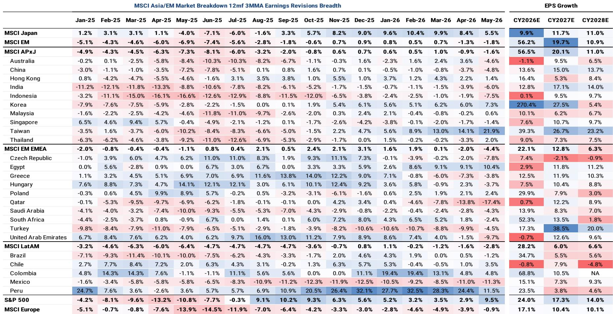
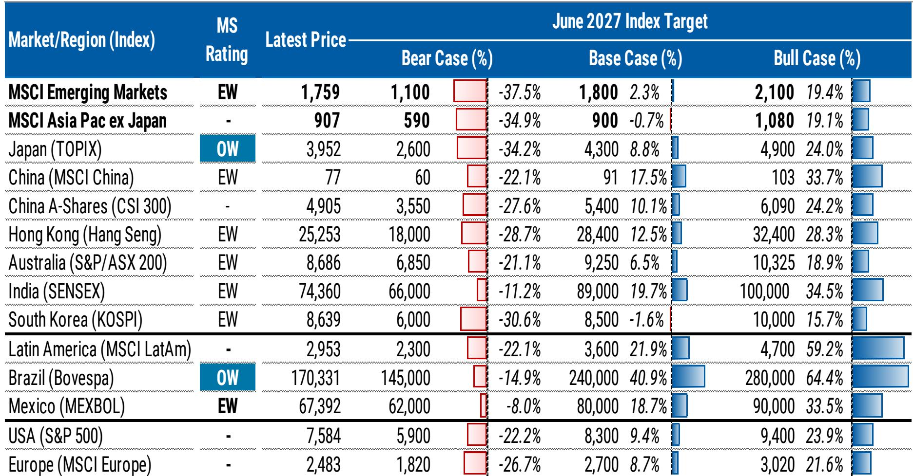
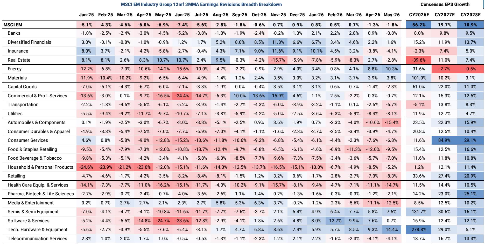

# The Asia Investment Supercycle Has Shifted from Compute to Infrastructure — But the Real Opportunity Lies Beyond Tech

The prevailing narrative among global allocators is that Asia’s investment case rests on artificial intelligence and semiconductor demand. That view is incomplete. A major global investment bank’s mid-year strategy report makes a far more provocative argument: the region is entering a multi-theme investment supercycle, and the most compelling opportunities are moving beyond pure compute into capital goods, energy security, and defence. The report’s core thesis is that Asia’s competitive reinvention is being driven by the collision of three structural forces — AI infrastructure buildout, energy and economic security, and military modernisation — and that investors who remain fixated on technology hardware alone are missing the broader rotation.

This is not a cyclical call. The report frames the current environment as “exceptionally uncertain,” citing the combined effect of the global energy shock and AI capex disruption. Yet it raises index targets across much of Asia, with Japan as the standout overweight. The strategic logic is clear: the region’s upstream sectors — industrials, materials, energy, and semis — are positioned to capture the capex supercycle, while consumer and services sectors are expected to lag. The question every serious investor should be asking is not whether to be in Asia, but which parts of the real economy will absorb the next wave of capital.

## The Investment Supercycle Is Real, But It Is Concentrated in Goods-Producing Sectors, Not Services

The report’s most actionable insight is its explicit preference for goods over services. This is not a stylistic preference; it is a structural call rooted in the nature of the themes driving Asia’s transformation. AI compute, energy security, and defence are all capital-intensive, supply-chain-deep, and dependent on physical infrastructure. They require factories, transmission lines, battery storage, semi fabrication plants, and military hardware. These are not service-sector activities. They are the domain of industrials, materials, and energy companies.

The data supports the argument. The report shows that year-to-date global equity industry group performance reveals a stark divergence: semiconductors are up 60 percent, tech hardware up 47 percent, energy up 26 percent, and capital goods up 15 percent. At the other end, consumer discretionary distribution and retail, automobiles, and pharmaceuticals are flat to negative. This dispersion is not random. It reflects a regime where capex-driven demand is overwhelming consumption-driven growth. For institutional portfolios that remain overweight consumer and services in Asia, the report’s message is uncomfortable but clear: the structural tailwinds are in upstream goods, and the laggards are downstream.

The implication for asset allocation is significant. If the supercycle persists — and the report’s focus lists are concentrated in capital goods players across renewable energy, energy storage, semi localisation, AI compute infrastructure, defence, and electrical equipment — then investors need to reassess their sector weights. The report does not say to abandon technology, but it does argue that the broadening opportunity lies outside pure compute. That is a subtle but powerful shift in emphasis.

## Japan Is the Structural Outlier, Driven by Corporate Reform and a Broader Thematic Base

Among all Asia-Pacific markets, Japan receives the most constructive treatment. The report assigns an overweight rating to the TOPIX index, with a base-case target implying roughly 9 percent upside and a bull case of 24 percent. More importantly, Japan’s estimate revisions are described as broader than those in emerging markets, with multiple sectors and stocks exposed to the core themes. This is not a narrow AI story. Japan’s exposure spans corporate reform, productivity enhancement, and the prime minister’s policy agenda, alongside its established strength in capital goods and semi equipment.

The report also advises investing in Japan on an unhedged basis, anticipating moderate yen strength. This is a notable call. For global investors who have historically hedged yen exposure due to Japan’s low-yield environment, the suggestion to go unhedged implies a view that the currency cycle is turning, and that the structural reforms underway — including the Japan ROE and productivity journey — are beginning to attract sustained foreign inflows.

What makes Japan different from other Asian markets is the breadth of its thematic exposure. The report’s data on regional thematic concentration shows that Japan has 36 percent exposure to AI and tech diffusion, but also 8 percent to societal shifts and 4 percent to future of energy. This diversification matters. While Taiwan and Korea are heavily concentrated in AI and tech diffusion at 57 percent, Japan offers a more balanced set of drivers. For a portfolio seeking exposure to the supercycle without single-theme risk, Japan is the natural overweight.

## China Remains a Deflationary Puzzle, But the Report Points to a Narrow Path Through Capex and A-Shares

China is the most complex call in the report. The base-case target for MSCI China implies 18 percent upside, and the CSI 300 target suggests 10 percent upside. Yet the report’s language is cautious: China remains in deflation, aggregate earnings revisions are weak, and deflationary forces combined with AI disruption are weighing on the broader market. The report prefers A-shares over H-shares and emphasises capex over consumption.

This distinction is critical. The report is not making a broad bullish case for China. It is making a selective one. The preference for A-shares reflects the view that domestic liquidity and policy support are more reliable than external capital flows. The emphasis on capex over consumption suggests that the report expects the government’s investment-driven stimulus — particularly in clean energy, semi localisation, and infrastructure — to outperform the consumer recovery narrative that many global investors still favour.

The open question is whether China’s deflationary environment can be resolved without a major fiscal expansion or a property sector recovery. The report does not answer this definitively, and the wide bull-bear spreads — with a bear case of minus 22 percent for MSCI China and a bull case of plus 34 percent — reflect genuine uncertainty. For investors, the takeaway is that China is a tradeable market within the supercycle, but only if positioned in the right segments. Broad-based exposure to Chinese consumer and internet stocks may not capture the themes that matter.

## The Report’s Most Important Unanswered Question: How Durable Is the Commodities and Capital Goods Cycle?

One of the report’s most intriguing observations is that commodities have lagged and are underweight-positioned relative to compute and capital goods. This presents an opportunity for broadening exposure beyond technology, but it also raises a critical question: what would cause commodities to catch up, and what would break the cycle?

The report does not fully answer this, and it should not. The supercycle thesis depends on sustained capex in AI infrastructure, energy security, and defence. If any of these legs weaken — due to a recession, a policy shift, or a technological breakthrough that reduces capital intensity — the rotation into commodities and capital goods could stall. Conversely, if the themes strengthen, commodities could become the next leg of the rally.

For investors, this is the analytical frontier. The report provides the framework but leaves the timing and triggers open. The decision to maintain unusually wide bull-bear spreads across all major indices is itself a signal: the range of outcomes is exceptionally wide, and conviction should be tempered with scenario planning. The report’s value is not in predicting the path, but in identifying the structural forces that will determine it.

## A Decision Framework for Investors: Three Tests for Positioning in the Asia Supercycle

Translating the report’s analysis into a practical framework requires answering three questions. First, is your portfolio tilted toward goods-producing sectors or services? If the answer is services, the report suggests you are structurally underweight the supercycle. Second, are you positioned for the broadening of themes beyond compute? The report’s focus lists include renewable energy, defence, electrical equipment, and semi localisation — not just AI chips. Third, do you have exposure to Japan on an unhedged basis? The report’s strongest conviction call is there, and the rationale is supported by both thematic breadth and policy momentum.

For each of these questions, the report offers data but not certainty. The wide bull-bear spreads are a reminder that even the best frameworks cannot eliminate uncertainty. What they can do is help investors avoid being caught on the wrong side of structural change. The report’s central argument is that Asia’s investment supercycle is real, but it is not evenly distributed. The winners will be those who recognise that the collision of themes — AI, energy security, defence, and reform — is reshaping the region’s capital allocation, and that the opportunity is moving upstream.

Join the community to read the full report and review the original charts.

*This article is for learning and discussion only and does not constitute investment advice.*

Personal reading notes and learning share only. Not investment advice.

