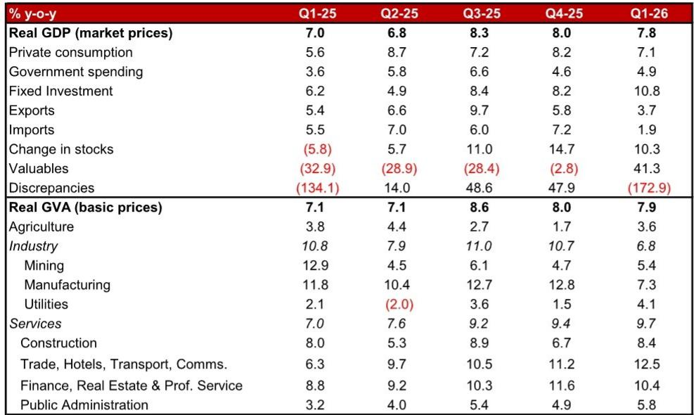
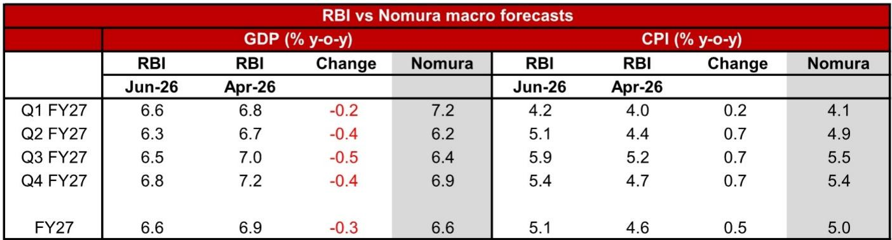

# India’s Policy Bazooka for the Rupee Avoids the Rate Trigger: Why the RBI’s Non-Monetary Response Redefines the Playbook for Emerging Market Crisis Management

The Reserve Bank of India has fired a policy bazooka at the country’s widening balance of payments deficit, but strikingly, the weapon of choice was not the policy rate. In a decision that will reshape how markets assess India’s macroeconomic resilience, the RBI left its key interest rate unchanged at 5.25 percent while unleashing a coordinated set of capital flow measures designed to plug an estimated USD 70 billion external financing gap. This is not a dovish surprise. It is a strategic signal that the central bank has chosen a different path for currency defense, one that prioritizes financial engineering over monetary tightening.

The implications for investors are profound. By rejecting an interest rate defense of the rupee, the RBI has implicitly accepted a higher inflation tolerance in the near term, set a high bar for any future rate hikes, and placed the burden of external adjustment squarely on non-monetary tools. For those managing emerging market portfolios, this decision framework requires a fundamental rethinking of how to price Indian assets. The old playbook—where a widening current account deficit automatically triggers rate hikes—no longer applies. The new playbook is built on targeted capital account interventions, diaspora bond mobilization, and a willingness to let the currency absorb some pressure while keeping domestic demand intact.

This article unpacks the logic behind the RBI’s choice, examines the size and credibility of the announced measures, and provides a decision framework for investors navigating the resulting landscape. The analysis is based on a detailed research report from a global investment bank, but the argument here extends beyond the report’s conclusions to explore the second-order implications for rates, currencies, and portfolio strategy across emerging Asia.

## The RBI’s Policy Hold Is a Deliberate Signal That the Bar for Tightening Has Been Raised, Not Lowered

The most important takeaway from the June policy meeting is not what the RBI did, but what it chose not to do. Despite sharply raising its FY27 inflation forecast by 50 basis points to 5.1 percent and downgrading its GDP growth forecast by 30 basis points to 6.6 percent, the Monetary Policy Committee voted unanimously to hold the repo rate and retain a neutral stance. This decision runs counter to the expectations of a segment of the market that had anticipated an interest rate defense of the weakening currency.

By keeping rates on hold even as inflation forecasts moved decisively higher, the RBI has inadvertently set a very high bar for any future policy deviation. The logic is straightforward: if the central bank is willing to tolerate a 5.1 percent inflation forecast—well above its 4 percent target—without tightening, then inflation would need to trend significantly higher to trigger a rate hike. The RBI’s own guidance reinforces this interpretation. The MPC stated that it would be prudent to wait for greater clarity and that the litmus test for tightening remains the generalization of supply-side inflation shocks through second-round effects on expectations and wages. This is a carryover from the April policy meeting, and it signals that the central bank is not prepared to act on each and every deviation from its target.

The strategic rationale is clear. The RBI is wary of the collateral damage that rate hikes would inflict on an economy that is already showing signs of slowing. The growth downgrade to 6.6 percent, combined with the RBI’s own acknowledgment of downside risks, suggests that the central bank sees a rising probability that the current supply-side shock could morph into a sharper demand-side slowdown. In this context, tightening would be counterproductive. The policy hold is therefore not a sign of complacency about inflation; it is a calculated judgment that the risks to growth outweigh the risks to price stability at this juncture.

For investors, this means that the front end of the interest rate curve should remain elevated. The OIS market has already priced out the possibility of a near-term rate cut, but the RBI’s guidance suggests that the next move, if any, is more likely to be a hike than a cut. However, the threshold for that hike is now materially higher. The market should not expect a rate increase unless inflation prints consistently above 5.5 percent or second-round effects become visible in wage and expectation data. This creates a scenario where short-term rates remain anchored at current levels, but the risk premium for holding Indian duration increases.

## The Capital Flow Measures Are Sizeable and Credible, but Their Success Depends on Execution and the Global Environment

The centerpiece of the RBI’s policy response is a suite of measures designed to attract capital inflows and ease balance of payments pressures. These measures are not cosmetic; they represent a coordinated effort by the central bank and the government to address the external deficit through the capital account rather than through monetary tightening or a sharp currency depreciation.

The most significant measure is the revival of the Foreign Currency Non-Resident Bank (FCNR) deposit scheme. Under this program, banks raising fresh three- to five-year foreign currency deposits will receive RBI support for the entire hedging costs until September 30. Additionally, banks will be granted dispensations on mandatory reserve ratios, meaning these deposits will not be subject to Cash Reserve Ratio or Statutory Liquidity Ratio requirements. This is a powerful incentive. It effectively offers banks a cheaper source of funding while ensuring an attractive return for non-resident Indian depositors. The RBI is essentially subsidizing the cost of hedging currency risk to attract dollar inflows.

Based on the performance of similar schemes during previous crises—most notably the 2013 Taper Tantrum, when the FCNR scheme generated around USD 26 billion or 1.4 percent of GDP—the research report estimates that the current program could attract deposits worth approximately 1 percent of GDP, or roughly USD 40 billion. Against a projected balance of payments deficit of USD 70 billion for FY27, this would cover more than half of the financing gap. That is a material contribution.

Beyond the FCNR scheme, the authorities have announced a series of complementary measures. The government has expanded the list of specified securities eligible for foreign portfolio investment, including new issuances of 15-, 30-, and 40-year government bonds and sovereign green bonds. Restrictions on short-term investment, concentration limits, and security-wise limits have been relaxed. Investment limits for non-resident Indians and overseas citizens of India in equity markets have been increased. Perhaps most importantly, foreign portfolio investment in government securities will be exempted from income tax on interest and capital gains, a move designed to attract durable, patient capital.

The tax exemption is noteworthy, but its impact on flows may be limited. The primary concern for foreign investors in Indian bonds has been currency risk, not taxation. As the report notes, the hedging costs for foreign investors remain prohibitive, and until these costs come down materially, the tax benefit alone is unlikely to trigger a significant inflow. The real game-changer is the FCNR scheme, which directly addresses the hedging cost problem by having the RBI absorb it.

However, the success of these measures is not guaranteed. It depends on two factors: execution and the global environment. On execution, the details of the FCNR scheme have not yet been published. The quantum of inflows will depend on the precise terms offered to banks and depositors, as well as the willingness of public sector companies to raise external commercial borrowings under the concessional swap facility. On the global environment, the ability to attract USD 40 billion in deposits will be influenced by the level of global interest rates, the strength of the US dollar, and the risk appetite of international investors. If global financial conditions tighten further, the task becomes more difficult.

## The Inflation-Growth Trade-Off Is More Nuanced Than the Headline Numbers Suggest, and the RBI’s Forecasts Carry Important Asymmetries

The RBI’s revised macro forecasts tell a story, but the details matter more than the headlines. The central bank now projects FY27 CPI inflation at 5.1 percent, up from 4.6 percent in April, with a sharp acceleration in the second half of the fiscal year to 5.7 percent. Core inflation has been revised up to 4.7 percent from 4.4 percent. On the growth side, GDP is now forecast at 6.6 percent, down from 6.9 percent, with the first half expected to be weaker than the second.

The asymmetry in these forecasts is critical. The RBI has raised its inflation forecast significantly but maintained upside risks, meaning it sees the possibility of even higher inflation. At the same time, it has downgraded growth and flagged downside risks, meaning it sees the possibility of even lower growth. This creates a scenario where the central bank is simultaneously warning about higher inflation and weaker growth, which is precisely the stagflationary dynamic that makes monetary policy decisions so difficult.

The research report broadly agrees with the RBI’s inflation view, projecting FY27 inflation at 5.0 percent, slightly below the central bank’s estimate. However, it expects quarterly inflation to peak at around 5.5 percent in the October-December quarter, below the RBI’s forecast of 5.9 percent. The difference matters because it suggests that the RBI may be overestimating the persistence of inflation pressures. If inflation peaks lower than the RBI expects, the case for a rate hike weakens further.

On growth, the report has revised its FY27 forecast down to 6.6 percent, in line with the RBI. But the composition of growth matters. The Q4 FY26 GDP print, released on the same day as the policy decision, showed a surprisingly strong 7.8 percent year-on-year growth, driven by broad-based strength across most categories. This resilience reflects unscathed domestic demand, continued public capex growth, and a relatively muted impact from the supply-side shocks earlier in the year. However, the sequential momentum has eased, and the risks to the outlook are tilted to the downside. Higher commodity costs, supply-side disruptions, deficient monsoons, and increased global market volatility all pose threats.

For investors, the key question is whether the RBI’s policy response is calibrated correctly. If inflation proves more persistent than expected, the central bank may be forced to tighten later, potentially at a time when growth is already slowing. If growth weakens more sharply than expected, the RBI may come under pressure to cut rates despite elevated inflation. Either scenario creates a challenging environment for fixed income investors.

## What the Report Does Not Fully Answer: The Sustainability of the Capital Flow Measures and the Risk of Policy Fatigue

The research report provides a detailed and credible assessment of the RBI’s policy response, but it leaves several important questions unanswered. These are not weaknesses of the report; they are inherent uncertainties that any investor must grapple with.

The first unanswered question is whether the capital flow measures can be sustained beyond the September 30 deadline. The FCNR scheme and the concessional ECB facility are both time-limited, designed to attract a surge of inflows before the end of September. This creates a cliff risk. If the inflows materialize as expected, the balance of payments pressure will ease significantly in the near term. But what happens after September? Will the authorities extend the scheme, or will they need to find alternative sources of financing? The report does not provide a clear answer, and the uncertainty around the post-September landscape is a risk that investors must price.

The second unanswered question is the extent to which the measures will crowd out other forms of capital flows. The FCNR scheme is designed to attract diaspora deposits, but it may also reduce the incentive for other types of foreign investment. If banks can raise cheap dollar deposits through the FCNR window, they may have less need to tap international bond markets or attract foreign portfolio investment. The net effect on total capital inflows is unclear.

The third unanswered question is the impact on the banking system. The FCNR scheme offers banks a cheaper source of funding that is free from reserve requirements, which should help narrow the credit-deposit gap and inject liquidity. However, it also creates a maturity mismatch, as the deposits are three- to five-year instruments while the hedging support is time-limited. The report notes that the scheme hits two birds with one stone, but it does not fully explore the potential risks to bank balance sheets if the hedging costs rise or if the deposits are withdrawn prematurely.

Finally, the report does not address the political economy of the policy response. The tax exemptions for foreign investors and the subsidized hedging for banks and public sector companies represent a significant fiscal cost. In an environment where fiscal risks are already elevated, the sustainability of these measures depends on the government’s willingness to bear the cost. The report flags fiscal risks as a concern for rates strategy, but it does not quantify the potential impact on the fiscal deficit.

These open questions are not reasons to dismiss the report’s analysis. Rather, they are the natural boundaries of any research that attempts to forecast the impact of unprecedented policy measures. Investors who want to go deeper should seek out the full report, which includes the original charts and data that underpin the analysis.

## A Decision Framework for Investors: How to Position for the New Regime

The RBI’s policy response creates a new regime for Indian markets, and investors need a framework to navigate it. The following decision matrix is designed to help investors assess their positioning across rates, currencies, and equities.

**For rates investors, the core question is whether to flatten or steepen the curve.** The report recommends retaining OIS flatteners, specifically shifting from Sep-IMM 1s5s to Sep-IMM 2s5s, given the negative carry of the position and better valuations. The logic is that the front end of the curve will remain elevated due to the CPI path and currency risks, while the back end will be constrained by the RBI’s commitment to remain on hold. However, this trade is not without risk. If the capital flow measures are successful in attracting inflows, the currency pressure may ease, and the front end could rally. Conversely, if inflation surprises to the upside, the market may start pricing in a rate hike, which would steepen the curve.

**For currency investors, the decision hinges on the credibility of the capital flow measures.** The RBI has signaled that it will not use interest rates to defend the rupee, which means the currency will be more sensitive to capital flows. If the FCNR scheme attracts the expected USD 40 billion, the rupee could stabilize or even appreciate in the near term. However, if the inflows fall short, the currency will come under renewed pressure. The report notes that the beta to USDINR for the one-year part of the curve will increase, meaning that short-dated rupee forwards will become more sensitive to currency movements. Investors should watch the weekly FCNR deposit data closely as a leading indicator.

**For equity investors, the implications are more nuanced.** The policy hold is positive for domestic demand-sensitive sectors, as it avoids the drag of higher interest rates on consumption and investment. The capital flow measures are positive for banks, which will benefit from cheaper deposit funding and lower reserve requirements. However, the elevated inflation outlook is negative for margins in sectors with pricing power constraints. The overall impact will depend on the trajectory of growth and inflation, which remains uncertain.

The unifying theme across all asset classes is that the RBI has chosen a path of managed adjustment rather than abrupt tightening. This reduces the risk of a hard landing in the near term, but it also prolongs the period of uncertainty. Investors should be prepared for a regime where policy rates remain on hold, but risk premia remain elevated.

## The Unresolved Analytical Questions That Make the Full Report Essential Reading

The analysis presented here is based on a detailed research report that goes far beyond the summary provided. The full report contains the original charts, data tables, and scenario analysis that underpin the conclusions. For serious investors who want to make informed decisions, reading the full report is not a luxury; it is a necessity.

The report includes a comparison of the RBI’s and the research team’s macro forecasts, which reveals important differences in the quarterly path of inflation and growth. It also includes a detailed analysis of the historical performance of FCNR schemes, which provides the basis for the USD 40 billion inflow estimate. The rates strategy section includes specific trade recommendations and risk management guidance that cannot be fully captured in a summary.

Most importantly, the report leaves the reader with a set of unresolved analytical questions that are essential for forward-looking investment decisions. How will the RBI respond if inflation exceeds its forecast? What happens if the FCNR scheme underperforms? How will the fiscal cost of the measures affect the government’s ability to sustain public capex? These are the questions that separate surface-level analysis from deep strategic thinking.

Join the community to read the full report and review the original charts. The data and analysis contained in the original document are the foundation upon which any serious investment thesis must be built.

*This article is for learning and discussion only and does not constitute investment advice.*

Personal reading notes and learning share only. Not investment advice.

