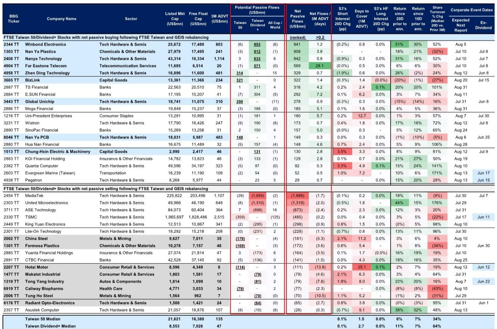
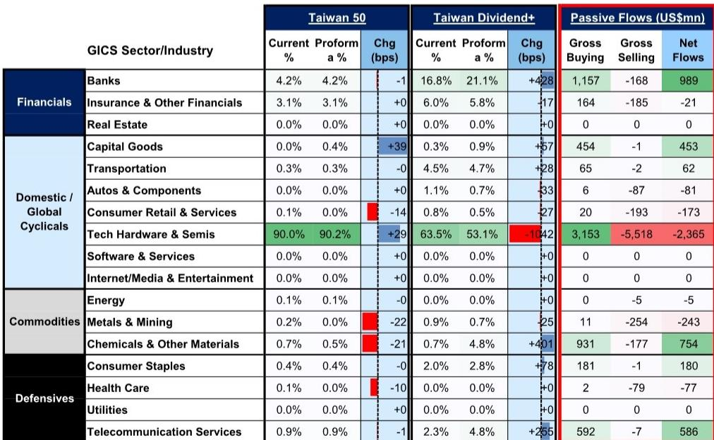
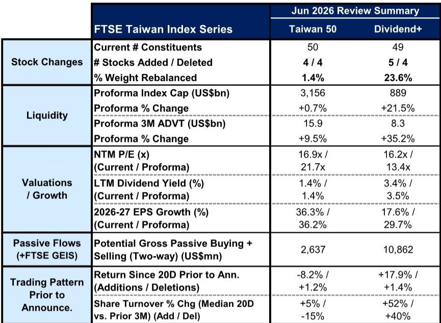

# 台湾市场真正的再定价，不是科技股，而是金融与化工

当大多数投资者仍将目光聚焦在台积电与AI半导体时，一份来自某外资投行的FTSE台湾指数系列季度调整报告揭示了另一个正在发生的结构性变化：资金正在从科技硬件与半导体板块大规模流出，流向银行、化工、电信和资本品。这不仅是季度调仓的技术性操作，更可能标志着被动资金对台湾市场行业权重的重新定价。

2026年6月5日收盘后，FTSE Russell公布了其台湾指数系列的季度审核结果，所有调整将于6月18日收盘后生效。表面上看，这只是指数成分股的常规更替，但深入拆解数据后，我们发现这次调整的规模、方向以及隐含的信号，远比一次普通的季度调仓更具分析价值。

本次调整最值得关注的判断是：市场真正低估的不是科技股的增长，而是非科技板块在被动资金流中的结构性权重重置。科技硬件与半导体板块将面临约24亿美元的净被动资金流出，而银行、化工、电信与资本品板块合计将吸纳超过27亿美元的净流入。这种资金流向的逆转，不是短期交易噪音，而是指数方法论与市场结构共同作用的结果。

## 1. 这次调仓的规模远超市场预期，资金流向呈现明显的行业轮动特征

根据报告测算，本次FTSE台湾指数系列调整可能产生总计130至140亿美元的双向被动资金流。其中，台湾50指数的权重调整幅度约为1.4%，而台湾高股息指数的权重调整幅度高达23.6%。这意味着后者的成分股结构正在经历一次实质性重组。

从行业层面看，资金流向的分布极不均衡。银行板块预计获得约9.9亿美元的净被动资金流入，化工板块约7.5亿美元，电信服务约5.9亿美元，资本品约4.5亿美元。与之形成鲜明对比的是，科技硬件与半导体板块预计净流出约23.7亿美元。这种规模的单行业资金流出，在台湾市场的历史记录中并不常见。

更值得关注的是，这些资金流并非来自主动管理型基金的判断调整，而是被动指数基金必须执行的机械性操作。这意味着在6月18日调整生效前后，相关个股将面临确定性的买卖压力，而这种压力的大小与个股的日均交易量相比，在某些标的上已经达到了相当高的比例。

## 2. 台湾高股息指数的结构性重组，正在重塑被动资金的配置逻辑

本次调整最被低估的变化发生在台湾高股息指数。该指数有5只股票被纳入、4只被剔除，权重调整比例高达23.6%。这意味着该指数近四分之一的权重结构将被重新分配。

纳入的股票包括华邦电子、南亚塑料、南亚科技、远传电信和中兴电工。剔除的股票包括儒鸿、东阳实业、丰兴钢铁和瑞仪光电。从行业分布看，被剔除的股票主要集中在传统制造业与消费相关领域，而被纳入的股票则分布在半导体、化工、电信与资本品等更具成长性或防御性的板块。

这种调整直接改变了指数的估值与成长特征。调整后，台湾高股息指数的远期市盈率从16.2倍下降至13.4倍，2026-2027年每股收益增长率从17.6%大幅提升至29.7%。这意味着新纳入的成分股不仅估值更低，而且成长性更强。对于追求股息收益的被动投资者而言，这种变化意味着他们持有的指数组合在风险收益特征上发生了实质性改变。

这里需要特别指出的是，台湾高股息指数23.6%的权重调整幅度，在历史上属于较高水平。这反映出FTSE在构建该指数时，可能正在对成分股的质量标准或股息可持续性进行更严格的筛选。报告没有完全展开这一逻辑，但这一变化值得关注。

## 3. 科技硬件与半导体板块的资金流出，不能简单归因于基本面恶化

科技硬件与半导体板块面临的最大净被动资金流出，很容易被市场解读为对该行业基本面的悲观信号。但仔细分析报告数据后，我们认为这种解读可能过于简单。

首先，从台湾50指数的权重变化看，科技硬件与半导体的权重实际上从90.0%微升至90.2%，增加了29个基点。这说明在台湾50指数内部，该板块并未被削弱。真正的权重下降发生在台湾高股息指数中，该板块权重从63.5%降至53.1%，下降了1042个基点。

这意味着科技板块的资金流出主要是由于高股息指数的大幅调仓所致，而非台湾50指数的减持。高股息指数的调仓逻辑更侧重于股息收益率与可持续性，而非行业前景。因此，科技板块的资金流出更多反映的是股息指标的相对变化，而非对科技行业增长预期的下调。

其次，报告显示被纳入台湾50指数的四只股票——臻鼎科技、BizLink、创意电子和南亚电路板——均属于科技硬件与半导体领域。这说明FTSE对科技行业的整体判断并未转向负面，只是在高股息指数层面进行了结构性调整。

对于投资者而言，这意味着科技板块的资金流出更多是一次性的被动调仓冲击，而非趋势性的行业减持。在6月18日调整生效后，这种压力可能逐渐消退。但报告没有完全回答的问题是：如果被动资金流出与主动资金减仓形成共振，科技板块是否面临更长时间的资金压力？

## 4. 历史模式显示，调仓前后的交易策略存在明确的时间窗口

报告提供了两组具有操作价值的历史模式数据。对于台湾50指数，新增成分股在公告前20个交易日内表现落后于被剔除成分股，但公告后可能出现相对跑赢，随后在调整生效后可能出现反转。对于台湾高股息指数，新增成分股在公告前已显著跑赢被剔除成分股，历史趋势显示公告后相对跑赢可能继续，但幅度趋于温和，随后在生效日前后存在反转风险。

当前数据与历史模式存在一些差异。台湾50指数的新增成分股在公告前20个交易日的累计回报为-8.2%，而被剔除成分股为+1.2%，这与历史模式中新增跑输剔除的特征一致。但台湾高股息指数的新增成分股在同期回报为+17.9%，被剔除成分股为+1.4%，新增跑赢剔除的幅度远超历史中位数水平。

这种偏离可能意味着市场已经提前定价了部分调仓预期，或者当前的市场环境与历史均值存在结构差异。报告没有完全展开这一分析，但这一偏差本身就是一个值得深入研究的信号。对于短线交易者而言，历史模式提供的参考价值需要结合当前的市场流动性、资金面以及个股基本面进行综合判断。

## 5. 报告尚未完全回答的关键问题：被动资金流出的二阶效应如何传导

尽管报告对本次调仓的资金流规模、方向和个股影响进行了详尽测算，但有几个关键问题尚未完全展开。

第一，科技板块23.7亿美元的净被动资金流出，是否会引发主动管理型基金的跟随性减持？如果主动基金将此次调仓视为科技板块估值过高的信号，那么科技板块面临的压力可能远超被动资金流本身。

第二，银行板块9.9亿美元的净流入中，有相当一部分来自台湾高股息指数的权重调整。但银行股的流动性相对较低，部分标的的净流入与日均交易量之比已经达到4-7天。这意味着在调整生效前后，这些银行股可能面临较大的价格冲击。报告列出了部分标的的流动性数据，但未对价格冲击的具体幅度进行量化分析。

第三，台湾高股息指数调整后，远期市盈率下降而盈利增长大幅提升，这种估值与成长的组合变化是否可持续？新纳入的成分股中，部分属于周期性较强的行业，其盈利增长的可持续性仍需时间验证。

这些未解问题恰恰是理解本次调仓长期含义的关键。被动资金流的短期冲击是确定的，但其对市场定价、行业估值和投资者行为的二阶效应，才是真正值得深入讨论的部分。

## 欢迎来星球微信群里继续讨论

上述分析只是基于公开报告的初步解读。关于科技板块资金流出的二阶效应如何传导、银行板块的价格冲击具体有多大、以及高股息指数调整后的估值可持续性等问题，我们将在知识星球微信群里进行更深入的讨论。欢迎扫码加入，与更多产业决策者和专业投资者一起，持续跟踪台湾市场的结构性变化。

Personal reading notes and learning share only. Not investment advice.

