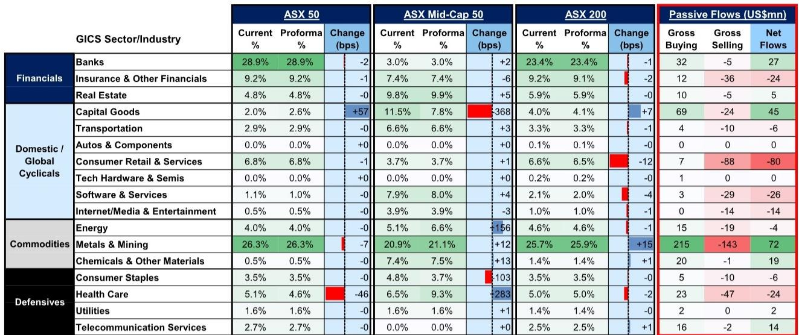
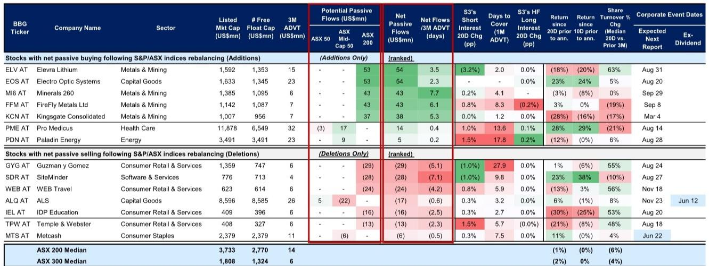
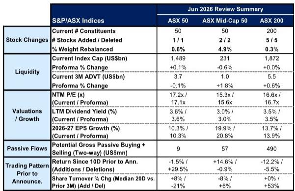

# 指数调仓不只是换股，它正在重新定价澳洲市场的结构性偏移

每年六月的S&P/ASX指数季度调整，在多数投资者眼中不过是成分股进出与被动资金再平衡的技术性事件。但某外资投行刚刚发布的2026年6月调仓分析报告揭示了一个更值得关注的信号：这次调仓引发的被动资金流向，正在暴露澳洲市场内部一个被低估的结构性偏移——资源板块的权重扩张与消费板块的持续萎缩，并非周期性的轮动，而是资本对澳洲经济结构变化的长期定价。

这不是一次普通的指数维护。这是市场在告诉投资者，谁在获得定价权，谁正在失去。

## 1. 被动资金流向揭示的板块优先级：资源与资本品在吸走流动性，消费零售在失血

本次调仓最直观的信号来自资金流向的行业分布。根据报告估算，ASX 200指数调仓将产生超过9亿美元的被动双向交易流量。其中，金属与采矿板块将获得约7200万美元的净被动买入，资本品板块紧随其后，净流入约4500万美元。与此同时，消费者零售与服务板块面临约8000万美元的净卖出。

这一流向并非偶然。五只新纳入ASX 200的成分股中，有三只来自金属与采矿板块——Elevra Lithium、Minerals 260、FireFly Metals。而五只被剔除的成分股中，有三只属于消费者零售与服务板块——Guzman y Gomez、WEB Travel、IDP Education。

这意味着，被动投资者正在系统性地将资金从消费端抽离，重新配置到资源与工业资本品端。这不是短期交易行为，而是指数编制规则背后所反映的市值变迁。当一个板块的上市公司市值持续增长，它就会在指数中获得更大权重，进而吸引更多被动资金；反之亦然。

这里的关键洞察在于：被动调仓本身不是原因，而是结果。它反映的是过去一个季度乃至更长时间内，澳洲资本市场对哪些行业赋予了更高的估值溢价。资源板块的强势纳入，本质上是市场对澳洲作为大宗商品供应国角色的再确认。

## 2. 调仓窗口期的交易策略：历史规律显示，公告后至生效日之间存在可捕捉的波动机会

报告详细分析了ASX 200指数新增与剔除成分股在调仓公告前后的交易模式。数据显示，在公告前20个交易日内，新增与剔除股票的价格走势高度波动，且两者之间的相对表现分化显著。以当前调仓为例，新增股票在公告前10个交易日的平均回报为-12.2%，剔除股票则为-5.5%。

更值得关注的是历史模式。报告引用的历史中位数数据显示，公告日后，新增与剔除股票的表现仍保持波动，并带有小幅负向偏差，直到生效日前后才出现反弹。这意味着，公告日至生效日之间的窗口期，对于熟悉被动资金流节奏的交易者而言，存在明确的套利或对冲机会。

具体而言，剔除股票在公告后往往面临被动卖出压力，但历史数据显示这种压力在生效日前会部分缓解，甚至出现反弹。对于新增股票，被动买入需求通常在生效日前后集中释放，但公告后初期可能因前期炒作获利了结而出现回调。

这一规律对于跟踪指数基金、ETF以及量化策略的管理人尤为重要。它意味着，简单的“公告日买入新增、卖出剔除”策略未必最优。更精细的做法是结合个股流动性、空头持仓和资金流规模，在时间维度上进行择时。

## 3. 个股层面的流动性冲击：部分新增股票面临远超日均成交量的被动买入压力

报告在个股层面提供了极为细致的数据，揭示了被动调仓对个股流动性的影响差异。以ASX 200新增股票为例，Minerals 260预计将获得约4300万美元的净被动买入，相当于其过去三个月日均成交量的7.7倍。FireFly Metals的净买入规模也达到日均成交量的6.1倍。Kingsgate Consolidated为5.3倍。

这些倍数意味着，被动资金流入将在生效日前后对这些股票的流动性形成巨大压力。对于日均成交量仅数百万美元的股票，数千万美元的集中买入可能导致价格显著偏离基本面。

与此同时，被剔除的股票面临相反的流动性冲击。Guzman y Gomez的净被动卖出约2900万美元，相当于其日均成交量的5.1倍。SiteMinder的净卖出约2800万美元，倍数为7.1倍。

这里存在一个尚未被充分讨论的风险：当被动卖出规模远超日均成交量时，价格下跌可能触发更多主动资金的止损或追保，形成负反馈循环。报告提供了空头持仓和做市商覆盖天数的数据，但并未深入分析这种流动性冲击是否会被高杠杆或量化策略放大。这恰恰是投资者需要自行评估的核心变量。

## 4. 报告尚未完全回答的关键问题：调仓后的估值变化是否可持续？

报告给出了调仓前后的估值对比：ASX 200的远期12个月市盈率从16.6倍微升至16.7倍，2026-2027年EPS复合增长率从13.7%调整至13.9%。这些变化幅度极小，似乎表明调仓本身对指数整体估值的影响有限。

但这里隐藏着一个更深层的问题：新增股票的高估值是否合理？以Elevra Lithium为例，其在公告前20个交易日内下跌了18%，但依然以超过15亿美元的市值被纳入ASX 200。类似的，Minerals 260和FireFly Metals的市值均在10-14亿美元区间，但日均成交量仅600-700万美元。这些公司的估值是否已经充分反映了其资源储量、生产计划和融资需求？报告没有给出明确答案。

同样，被剔除的消费者零售股票如Guzman y Gomez和Temple & Webster，其市值萎缩是否只是周期性压力，还是反映了澳洲消费结构性的疲软？报告提供了调仓数据，但没有展开行业基本面的深度分析。

这些未解问题意味着，投资者不能简单地将调仓视为一个交易信号。它更像是一个路标，指向需要进一步研究的方向。

## 5. 投资者应建立的观察框架：从三个维度评估调仓的长期含义

基于本次调仓揭示的信号，投资者可以建立以下观察框架，用于评估后续的市场演变：

第一，板块权重的趋势性变化。本次调仓中，金属与采矿在ASX 200中的权重从25.7%升至25.9%，而消费者零售从6.6%降至6.5%。单次调整幅度很小，但如果这一趋势持续两到三个季度，将意味着澳洲市场的行业结构正在发生根本性转变。投资者应密切关注下一季度调仓时，是否会有更多资源股进入、更多消费股退出。

第二，个股流动性与被动资金规模的匹配度。对于日均成交量低于1000万美元、但被动资金流超过日均成交量5倍的股票，投资者应警惕生效日前后的价格异常波动。这类股票不适合作为流动性管理工具，但可能为熟悉事件驱动策略的投资者提供短期交易机会。

第三，调仓后的主动管理空间。被动调仓完成后，新增股票可能因被动买入而暂时高估，剔除股票可能因被动卖出而暂时低估。这为主动管理者创造了逆向布局的窗口。关键在于判断哪些被剔除的股票基本面并未恶化，只是因市值暂时萎缩而被移出指数。

本次调仓还揭示了一个报告未明确提及但值得深思的细节：被剔除的股票中，Guzman y Gomez和Temple & Webster在公告前20个交易日内均录得正回报，但依然被剔除。这说明市值门槛的竞争远比短期股价表现复杂。投资者不应将调仓结果简单等同于基本面评级。

---

指数调仓从来不是终点，它只是市场结构演变的一个快照。本次S&P/ASX 200的调整，真正值得追问的不是谁进谁出，而是资源与消费板块的权重变迁，是否预示着澳洲经济正在经历一次更深层的再平衡。这些问题的答案，不在调仓公告里，而在更完整的行业研究与公司分析中。

欢迎来星球微信群里继续讨论：哪些被剔除的消费股可能被错杀，哪些新增的资源股估值存在泡沫，以及如何利用调仓窗口构建对冲策略。我们会在社群中分享完整的研报原文与更多数据图表，帮助你在信息不对称中建立自己的判断框架。

Personal reading notes and learning share only. Not investment advice.

