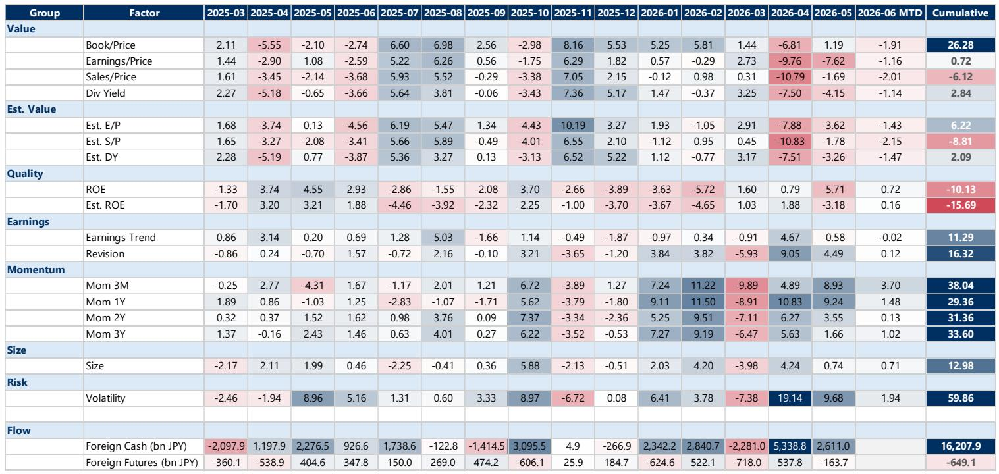
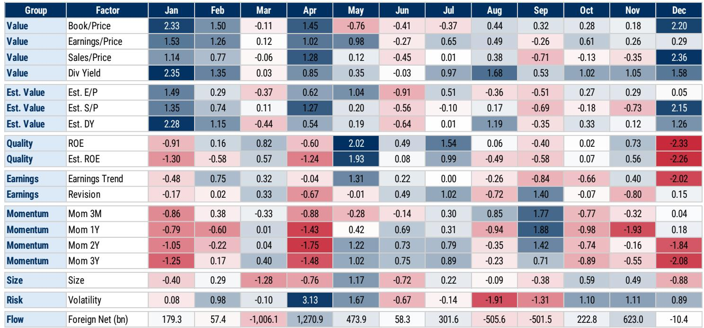
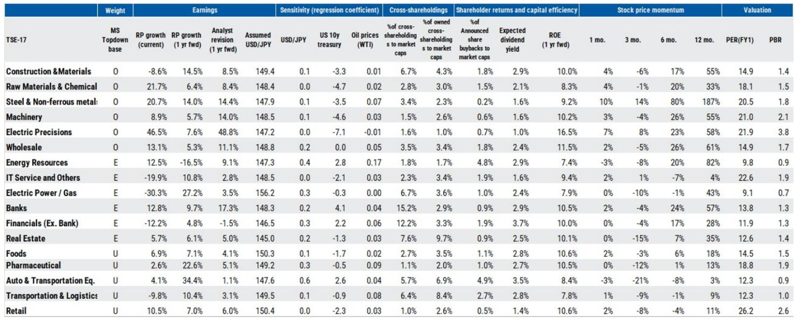

# 日本股市的真正叙事不是避险，而是“增长时刻”的重新定价

当全球投资者还在把日本视为“低利率避风港”或“治理改革故事”时，某外资投行最新发布的日本权益策略报告提出了一个更大胆的判断：日本正站在一个“大增长时刻”的前夜。这个判断的核心，不是通胀、不是汇率、甚至不是公司治理改革本身，而是这些结构性力量正在汇聚成一个新的宏观组合——AI投资加速叠加财政信誉支撑的利率稳定。在这个组合下，增长型股票的重新领导，可能比市场预期的来得更快。

这份报告的标题直接点出了方向：Prepare for the Great Growth Moment。这不是一个温和的“看好”，而是一个明确的“准备”指令。对于长期关注日本市场的投资者来说，这句话的分量在于，它意味着市场正在从“估值修复”阶段切换到“增长溢价”阶段。而这两个阶段的投资逻辑，几乎完全不同。

## 1. 市场低估了日本从“通缩修复”切换到“增长定价”的速度

过去三年，日本股市的上涨主要靠两个引擎：一是公司治理改革推动的估值修复，二是日元贬值带来的出口盈利。但这份报告指出，这两个引擎正在让位给一个新的驱动力——结构性增长。

报告的核心判断基于四个结构性支撑：持续稳定的通胀、政治稳定带来的政策可预期性、公司治理改革的深化，以及家庭资金通过NISA体系加速流入股市。这四个因素单独看都不算新消息，但组合在一起，它们指向一个关键转变：日本经济正在从“低通胀、低利润率、低增长”的旧均衡，走向“温和通胀、企业定价权增强、资本开支回升”的新均衡。

这意味着，过去十年有效的“便宜买入、等治理改革推升估值”的策略，可能不再是最优解。在增长型股票重新获得领导力的环境下，投资者需要重新审视哪些行业和公司真正具备“增长溢价”的资格，而不是仅仅依赖估值修复的贝塔。

## 2. 报告最值得注意的判断：AI行情并未结束，但交易方式已经改变

自2025年4月所谓的“解放日”以来，一个有意思的现象出现了：卖出高估值AI股、买入相对便宜的AI股的策略，其有效性在上升。这不是市场对AI主题失去信心，而是市场在AI内部进行“轮动”——从叙事驱动的估值扩张，转向基本面支撑的估值验证。

报告明确表示，AI行情持续仍是基准情景。但更重要的是，它同时强调：管理AI行情反转风险同样重要。具体来说，对于那些仅靠AI叙事推高、缺乏盈利支撑的股票，买入看跌期权可能是当前环境下最有效的风险管理工具之一。

这句话隐含了一个重要的判断：AI主题的下一阶段分化将极其剧烈。那些能够将AI投资转化为实际盈利增长的公司，将继续获得溢价；而那些仅仅停留在“AI故事”层面的公司，将面临估值回归。对于投资者而言，这意味着需要从“买AI主题”转向“买AI盈利”。

## 3. 日本企业正在做一件过去三十年没做成的事：把利润率做起来

报告中的一个数据点值得反复品味：日元与日本股市的正相关性正在下降。回归模型的R方从2010年代的0.7降至2025年的0.5，USD/JPY的系数也从1.1降至0.4。翻译成白话：日元升值不再像过去那样必然拖累日本企业盈利。

为什么？因为日本企业正在做一件过去三十年没做成的事——提高利润率。报告指出，在经历疫情后的进口价格冲击后，日本企业持续努力改善利润率。这意味着，即使日元走强，企业也能通过定价能力和成本控制来保护盈利。这不是一个短期现象，而是一个结构性变化。

对于投资者来说，这个变化的含义是：过去那种“看日元做日本股票”的简单框架已经过时。那些已经建立起定价权的公司，无论汇率如何波动，都可能持续创造盈利增长。而寻找这类公司，才是未来日本股市超额收益的真正来源。

## 4. 治理改革的风险被低估了，但方向是对的

公司治理改革一直是日本股市的“明牌”。但报告在这部分提出了一个值得警惕的提醒：随着6月股东大会和7月公司治理准则修订的临近，投资者应该谨慎对待“无差别做空治理相关股票”。

这句话的背景是：有些投资者认为治理改革已经充分定价，开始反向做空。但报告认为，治理改革仍在深化，尤其是在推动企业更有效使用现金方面。2026年的公司治理准则修订将进一步推动这一进程。这意味着，那些在治理改革上“言行一致”的公司，仍有估值扩张空间；而那些“说一套做一套”的公司，则可能面临更大压力。

这里的关键判断是：治理改革不是一次性事件，而是一个持续的过程。市场对它的定价，可能仍然不足。

## 5. 报告尚未完全回答的关键问题：增长时刻的“触发器”是什么？

尽管报告给出了一个清晰的牛市框架，但它也诚实地展示了情景分析的巨大差距。TOPIX的基准目标为4300点（2027年6月），但牛市目标为4900点，熊市目标仅为2600点。这个近2300点的差距，意味着不确定性仍然极高。

报告将不确定性主要归结为地缘政治风险，尤其是中东局势对能源价格的影响。但更深层的问题是：这个“大增长时刻”的触发器到底是什么？是AI投资的实际落地速度？是日本央行在利率正常化过程中的政策艺术？还是全球宏观经济能否避免衰退？

报告没有完全回答这个问题。它提出了一个“共存”框架：近端盈利下行风险与中长期盈利正常化预期可以同时存在。但如何从“共存”走向“确认”，需要更微观的证据——比如企业资本开支的实际数据、AI相关订单的可见度、以及工资-通胀螺旋是否真正形成。

## 6. 投资者需要建立的新观察框架：从“买便宜”到“买增长”

基于报告的判断，投资者可以建立一个三层观察框架：

第一层，区分“治理改革受益者”和“增长受益者”。前者是估值修复逻辑，后者是盈利增长逻辑。两者并不互斥，但权重正在变化。

第二层，在增长主题内部，关注“上游B2B”领域。报告明确表示，在供应链中偏好上游B2B板块。这意味着，那些为AI投资提供设备和材料、为产业升级提供资本品的公司，可能比下游消费类公司更具盈利确定性。

第三层，对银行板块保持谨慎。尽管市场对加息受益者的兴趣上升，但报告维持银行板块的等权重评级。这暗示，利率上升对银行的净息差改善，可能已经被市场充分预期，而贷款需求的不确定性仍然存在。

---

这份报告最有价值的部分，不是它的结论，而是它提供的思考框架。它告诉我们，日本股市正在从一个“被低估的修复故事”变成一个“需要重新定价的增长故事”。但这个故事能否兑现，取决于多个变量的共振——AI投资的持续性、地缘政治的演变、以及日本企业能否真正把利润率做起来。

报告没有给出所有答案，但它指出了正确的问题。对于希望深入理解这些问题的读者，我们欢迎来星球微信群里继续讨论——尤其是在AI投资的实际落地节奏、日本企业利润率变化的微观证据、以及不同情景下的组合构建策略等方面，还有大量值得拆解的内容。

Personal reading notes and learning share only. Not investment advice.

