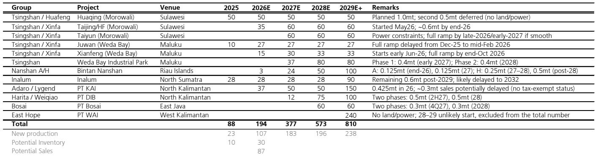
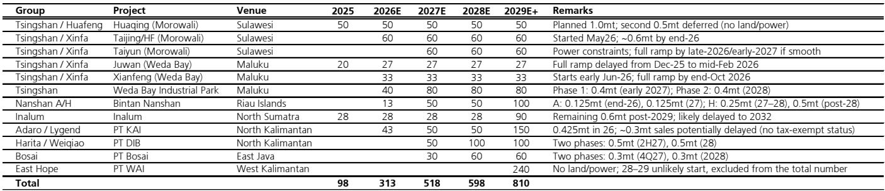

# 铝的全球供给故事，远不止一个“中国限产”那么简单

市场正在用中国产能天花板的故事来定价铝价，但这份外资投行的专家访谈揭示了一个更复杂的图景：中国供给侧的约束确实在收紧，但来自印尼和中东的变量正在改写全球铝的供需方程。真正值得关注的，不是中国产量会不会下降，而是全球新增供给的兑现节奏，以及地缘政治风险如何重塑铝的贸易流向和定价权。

这三股力量——中国的“名义天花板”与“实际超产”、印尼的“产能雄心”与“执行困境”、中东的“供给中断”与“恢复不确定性”——叠加在一起，正在创造一个结构性的供给博弈格局。报告的核心判断是：市场可能低估了印尼产能爬坡的摩擦成本，同时也高估了中国减产的力度。而中东的供给缺口，则可能在2026年成为全球铝价最关键的边际变量。

---

## 1. 中国的“天花板”与“超产”并存，政策容忍度才是真正的锚

专家估计中国2026年铝产量将达到4550万吨，较2025年的4450万吨增长2%。这个数字本身并不令人意外，但背后的结构性细节值得拆解。

报告指出，当前中国有效运行产能已经超过4550万吨，其中包含了约60-70万吨的“历史违规产能”——这些项目在三到五年前启动，尚未获得最终批准，但在申请阶段就已经建成并投产。地方政府出于财政收入考虑，缺乏关停动力。这并非新现象，但专家提供了一个关键判断：中央层面的政策重心可能会逐步转向“通过碳合规来正式化历史产能”。一旦解决，授权产能上限可能上调至约4600万吨，与当前实际运行水平基本一致。

这意味着什么？市场普遍讨论的“产能天花板”可能不是一个硬约束，而是一个正在被政策重新定义的软约束。投资者需要关注的不是中国产量会不会下降，而是政策何时、以何种方式将“事实上的超产”转化为“名义上的合规”。

此外，产能置换不同步、高电流强度操作有限、电解槽升级带来的单产提升等因素，也在边际上增加了供给。但专家特别指出，生产商对短期最大化产量持谨慎态度，因为这会增加下一年的业绩压力并缩短电解槽寿命。这个细节值得注意：企业的行为约束，有时比政策约束更有效。

## 2. 印尼的产能爬坡，真正的瓶颈不在产能本身，而在税收与电力

印尼是市场寄予厚望的全球铝产能增量来源。专家预计2026/2027年将分别增加220万吨和200万吨产能，对应产量110万吨和180万吨。但这份报告的价值，在于它系统性地揭示了印尼产能爬坡的三重执行风险。

第一重是税收优惠。许多冶炼厂尚未获得免税资格，涉及进口关税（13.5%）、出口税和企业所得税。没有这些豁免，利润空间被严重压缩，企业缺乏销售动力。Juwan和Adaro在2025年已积累约10万吨未售库存，而Adaro的免税资格可能到2027年都拿不到，这意味着2026年可能再增加约30万吨库存。这不是产能问题，这是商业决策问题——企业宁愿囤货也不愿亏本销售。

第二重是电力和设备约束。电厂建设需要两年以上，中国发电设备的交付周期因订单积压已拉长至约四年。电解槽的交付也需要6-12个月。青山集团目前计划将镍产能的电力转用于铝，这能在短期内支撑供给，但到2027年，随着新产能爬坡和镍/铝相对盈利的变化，电力供应的确定性将下降。

第三重是氧化铝的原料约束。印尼计划在2026/2027年分别增加100万吨和520万吨氧化铝产能，但关键瓶颈是铝土矿开采审批（RKAB）的收紧——年度审批制导致进度缓慢，截至5月底仅约三分之一的配额获批。监管趋严还体现在更高的土地费用、更严格的环境标准、生产控制和下游关联要求上。HPM挂钩定价已推动铝土矿FOB价格从1月的32美元/吨升至约42美元/吨，氧化铝生产成本从2000-2200元/吨升至2200-2400元/吨。

这些细节共同指向一个结论：印尼的铝产能故事，与其说是一个供给冲击，不如说是一个需要逐个项目跟踪的执行风险组合。市场对印尼供给的线性外推，很可能被这些摩擦成本打乱节奏。

## 3. 中东的供给中断，可能是2026年最被低估的边际变量

如果说中国是“慢变量”，印尼是“执行变量”，那么中东就是“冲击变量”。

专家预计2026年中东铝产量将减少约220万吨，受影响产能达350-380万吨。这个数字本身已经足够惊人，但更关键的是恢复时间的不对称性。报告将中断分为两类：一类是原料短缺导致的产能削减（Alba超过110万吨、Jebel Ali约20万吨、伊朗超过30万吨），恢复周期为3-6个月；另一类是冶炼和电力基础设施的严重损坏（Al Taweelah超过160万吨、Qatalum约20万吨），恢复周期超过12个月。

这意味着，部分供给中断是“暂时性的”，但另一部分可能是“中期性的”。而物流约束进一步复杂化了局面——通过红海和海湾港口的氧化铝流入有限，只能支持巴林和卡塔尔的部分运营；铝出口也受到限制，仅有少量铝锭从沙特阿拉伯运出。专家估计自中断以来，区域库存已积累至约110-120万吨。

这些库存是缓冲还是隐患？这取决于恢复时间。如果恢复快于预期，库存释放可能压制价格；如果恢复慢于预期，库存去化后反而会加剧短缺。报告没有给出明确判断，但这个问题的答案，对全球铝价的定价至关重要。

## 4. 三个区域的供给博弈，正在重塑铝的定价逻辑

把以上三个区域放在一起看，一个清晰的供给博弈框架浮现出来。

中国提供的是一张“政策安全网”——产能天花板虽然存在，但政策弹性足以吸收大部分超产，中国供给不会成为价格上行的主要驱动，也不会成为下行的主要压力。印尼提供的是“增量期权”——但这个期权的执行价格很高，税收、电力、原料三重约束意味着实际产量可能持续低于市场预期。中东提供的是“尾部风险”——供给中断的规模和持续时间，是当前最不确定的变量，也是2026年铝价最可能的“意外来源”。

在这个框架下，市场对铝价的定价逻辑可能需要从“需求驱动”转向“供给博弈驱动”。传统上，铝价更多跟随中国房地产、基建和出口需求波动。但在当前时点，供给端的结构性变化——中国政策调整、印尼执行风险、中东地缘冲击——正在成为更重要的边际定价因素。

报告的未解问题在于：这些供给变量如何相互作用？例如，如果中东供给恢复慢于预期，中国是否会放松对违规产能的容忍度？印尼的税收优惠问题是否会在某个时点得到解决，从而释放被压制的库存？这些二阶效应，报告没有完全展开，但正是这些“如果”，决定了铝价的实际走势。

## 5. 投资者的观察框架：从“总量思维”转向“边际博弈”

基于上述分析，投资者需要建立一个新的观察框架，而不是简单跟踪供需平衡表。

第一个观察维度是“政策信号”。中国碳合规政策的推进节奏，将直接影响约4600万吨的“名义天花板”是否会被正式认可。如果政策转向正式化历史产能，那意味着中国供给的“超产溢价”将被消除，市场的定价锚将上移。

第二个观察维度是“印尼项目执行”。不要只看产能规划，要跟踪每个项目的税收状态、电力保障和原料供应。Adaro的免税资格、青山集团的电力分配、铝土矿审批进度，这些微观信号比宏观预测更有效。

第三个观察维度是“中东恢复时间”。Al Taweelah和Qatalum的修复进度，是2026年铝价最关键的变量。如果恢复慢于预期，全球铝市场可能面临一个结构性缺口，库存去化将推动价格上行；如果恢复快于预期，库存释放可能带来短期压力。

第四个观察维度是“库存分布”。报告提到中东区域库存已积累至110-120万吨，但印尼也有约10-30万吨的潜在库存。这些库存的持有者是谁、成本结构如何、是否有销售压力，决定了它们何时会进入市场。

---

这份报告的价值，不在于它给出了一个精确的价格预测，而在于它提供了一个思考铝供给的框架。中国、印尼、中东三股力量同时作用，全球铝市场正在从一个相对可预测的“需求故事”，转变为一个高度博弈的“供给故事”。对于产业决策者和投资者来说，理解这个博弈的结构，比猜测下一个季度的价格更重要。

欢迎来星球微信群里继续讨论。我们会在群内分享完整的研报原文和原始图表，并围绕中东恢复时间、印尼税收进展、中国碳合规政策等关键变量，持续跟踪和更新判断。这些未被报告完全回答的问题，恰恰是未来市场定价的核心。

Personal reading notes and learning share only. Not investment advice.

