

text_image

Jah Mangan

# Turning long-USD in a low-vol regime

# Global FX Strategy

Patrick Locke $^{AC}$

(1-212) 834-4254

patrick.r.locke@jpmchase.com

JPM Securities LLC

See the end pages of this presentation for analyst certification and important disclosures.

All charts are sourced from JPM unless otherwise specified.

# GLOBAL FX MACRO STRATEGY

# Overview

- Long-carry, long-energy exporters vs importers remains high conviction...   
• ...with growth still resilient and inflation pressures keeping CBs cautious. Carry has anchored G10 post-invasion.   
• We turned long-USD again in May on stronger signals out of the US and signs of entrenched EUR weakness...   
- ...while USD still benefits from 1) carry/ToT, 2) a more balanced Fed, 3) firmer domestic data, and 4) renewed US equity strength. Conditions to be long USD now (low-grade US exceptionalism) differ from our tactical bullish-USD stance in March (hedge).   
- We’ve pivoted to a bearish-EUR/USD forecast for the first time in a year. 2H’26 1.13-15 range (prior 1.20). Hold 3m EUR/USD put spread. Continue to use EUR as a funder (vs AUD).   
- Various supports are blunting the impact of the energy shock – but are not evenly distributed globally. NorthAm most insulated; EUR vulnerable. Risks still asymmetric.   
• Governments, politics impacting FX (JPY-MoF, GBP-leadership contest).   
• DM: Long AUD, NOK, and now USD vs EUR, JPY, CHF, SEK, CAD   
- New Trades:   
• Buy 3m EUR/USD 1.1650 / 1.14 put spread.   
• Take profit on short-CAD vs AUD & NOK.   
• Buy 3m USD/CAD 40d/20d call spread   
- Existing Trades:   
- Short EUR/AUD   
- Short CAD/MXN   
• Long NOK/JPY, NOK/CHF   
- Hold 3m NOK/SEK 1.01/1.03 call spread

G10 Currency Summary 

<table><tr><td></td><td>Bullish Bias</td><td>Neutral</td><td>Bearish Bias</td></tr><tr><td rowspan="5">G10</td><td>USD. Near-term prospects have improved through firming inflation, ToT, resilient labor market data, the hawkish Fed pivot and a return to US equity outperformance. USD also benefits in a pro-carry environment in G10 given current yields and repricing of Fed expectations. Near-term risks from reopening of SoH, but downside should be limited. We turn long vs. EUR &amp; CAD.</td><td>GBP. Tactically took profits on longs pre-election and now neutral as solid carry and positive data surprises meet political risk. Multi-month timeline of any leadership challenge would mean carry and data should reassert themselves and support GBP vs lower yielders in the meantime before the new leader and associated fiscal risks are known, but can provide tactical setbacks.</td><td>EUR. Bearish. EUR/USD forecasts now signal a bearish profile for the first time in a year. Medium term targets revised down to 1.13 – 1.15 from 1.20 given worsening fundamentals: significant downside growth momentum, deteriorating terms-of-trade, narrowing real yield differentials and relative equities underperformance vs. the US. Near term target unchanged on potential conflict resolution between the US and Iran, but view any knee-jerk strength as short-lived. We continue to view EUR as an attractive funder vs. other regions incl APAC and high yielders. Short EUR vs. AUD and USD.</td></tr><tr><td>AUD. The expected FX recovery driven by commodity factors and rates repricing is now mature. Expecting gradual fade in 2H26 as policy spreads cap out. RBA tightening has weakened growth and housing, though carry remains supportive. Background supports from capital flows (FX hedging by super funds, and unhedged capital inflows) remain in place and should mean a higher floor for AUD than in recent years. Short EUR/AUD.</td><td>NZD. Activity data continue to recover, now complemented by housing, setting the stage for policy normalization/hiking cycle. Carry deficit continues to weigh on performance vs. AUD despite growth normalizing. Prolonged oil product supply disruption is a clear downside growth risk making NZD/USD shorts a carry efficient hedge for escalation.</td><td>SEK. Bearish bias on low carry exacerbated by downside inflation and growth surprises and equity momentum headwinds. SEK would tactically benefit from conflict resolution, but would require regional growth, fiscal focus and equity momentum to move back in its favour to reap the gains more medium-term. Short vs. NOK.</td></tr><tr><td>NOK. Bullish bias; set to benefit from carry environment as G10 high yielder with solid growth and sticky inflation keeping the central bank hawkish. Conflict de-escalation would tactically weigh on NOK, but we would view this as a buying opportunity given still-high energy prices, carry environment, and domestic inflation dynamics meaning the central bank is unlikely to quickly reverse course. Long vs. CHF, SEK.</td><td></td><td>JPY. Bearish as the intervention does not change our medium term bearish view and the global monetary policy cycle is increasingly unfavorable for JPY. The policy mix under the Takaichi administration heightens the risk of elevated domestic inflation and further yen depreciation. Elevated oil prices amplify inflationary pressures and the likelihood of fiscal expansion, reinforcing our medium- to long-term bearish outlook for JPY. We forecast USD/JPY at 158 for 2Q and 164 for 4Q. Short yen vs. NOK.</td></tr><tr><td></td><td></td><td>CAD. We retain a strategic bearish bias on CAD and prefer using it as a funder, but flip from short-USD proxies (short CAD vs AUD,NOK) to long USD/CAD in options. Optimism around a turn in the CA cycle looks premature after recent weaker labor data and still-soft underlying inflation. Against this backdrop, BoC market pricing continues to look aggressive in our view. With little USMCA progress thus far, we now see higher odds of annual reviews which are net CAD-negative. Stay short CAD vs. MXN and USD.</td></tr><tr><td></td><td></td><td>CHF. Neutral given cross-currents from franc-supportive forces (BOP, reserve alternative demand, fiscal differentiation, PPP vs pro-carry environment with trend growth providing upward pull on EUR/CHF. SNB&#x27;s higher-alert stance on intervention may dampen safe haven spikes but is unlikely to stand in the way of slow grind higher, but is supportive of use as carry funder: short vs. NOK.</td></tr></table>

# Still monitoring inventories...

The race to low inventories continues...   
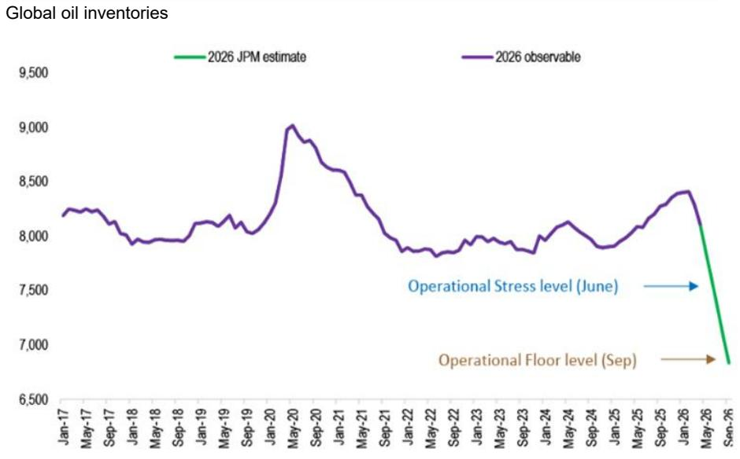

line

| Date     | 2026 JPM estimate | 2026 observable |
|----------|-------------------|-----------------|
| Jan-17   |                   | 8,200           |
| May-17   |                   | 8,150           |
| Sep-17   |                   | 8,050           |
| Jan-18   |                   | 7,950           |
| May-18   |                   | 7,950           |
| Sep-18   |                   | 7,950           |
| Jan-19   |                   | 8,050           |
| May-19   |                   | 8,100           |
| Sep-19   |                   | 8,150           |
| Jan-20   |                   | 8,300           |
| May-20   |                   | 9,000           |
| Sep-20   |                   | 8,800           |
| Jan-21   |                   | 8,600           |
| May-21   |                   | 8,400           |
| Sep-21   |                   | 8,100           |
| Jan-22   |                   | 7,900           |
| May-22   |                   | 7,850           |
| Sep-22   |                   | 7,900           |
| Jan-23   |                   | 7,950           |
| May-23   |                   | 7,950           |
| Sep-23   |                   | 7,950           |
| Jan-24   |                   | 8,100           |
| May-24   |                   | 8,150           |
| Sep-24   |                   | 7,950           |
| Jan-25   |                   | 7,950           |
| May-25   |                   | 8,100           |
| Sep-25   |                   | 8,300           |
| Jan-26   |                   | 8,400           |
| May-26   |                   | 8,450           |
| Sep-26   | 6,800             |                     |

Source: JPM

...despite offsets   
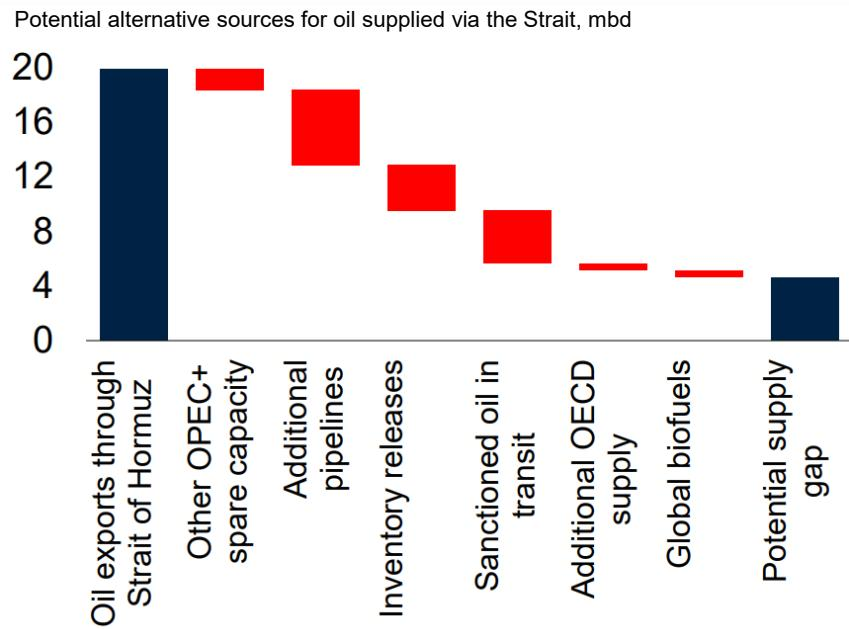

bar

Potential alternative sources for oil supplied via the Strait, mbd
| Source | Potential alternative sources (mbd) |
| :--- | :--- |
| Oil exports through Strait of Hormuz | 20 |
| Other OPEC+ spare capacity | 19 |
| Additional pipelines | 17 |
| Inventory releases | 12 |
| Sanctioned oil in transit | 8 |
| Additional OECD supply | 6 |
| Global biofuels | 5 |
| Potential supply gap | 4 |

Source: World Bank

- The race to low inventories continues, despite offsets in alternative supply sources.   
• Material offsets and supports in the global economy have buffered the worst of the energy price spike so far.   
- Strait traffic, while still low, has shown some modest improvement, albeit well short of pre-war levels.   
• JPM crude prices are above the forwards; avg brent 2Q'26 \$103, 4Q'26 \$98

# Energy exposure and offsets create strong regional divergence for FX, led by US resilience

North America has the best mix of direct energy impact and degree of offsets...   
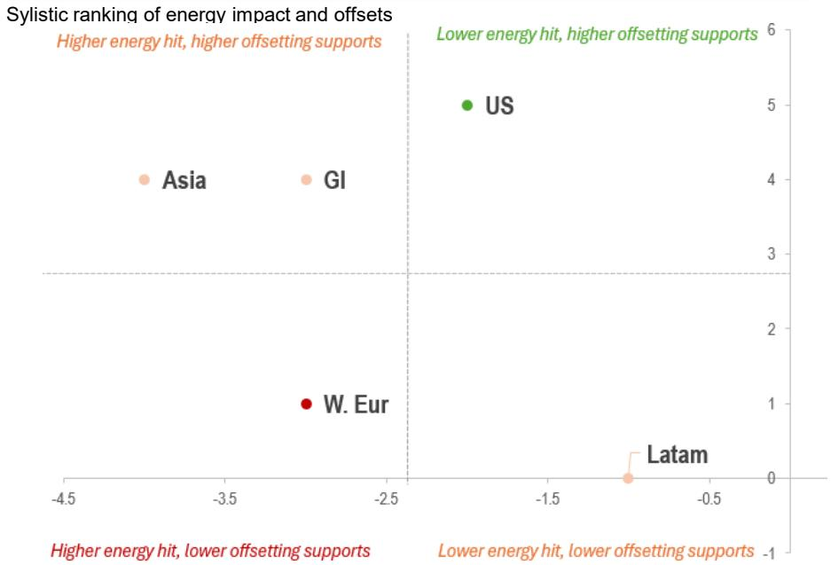

scatter

Sylistic ranking of energy impact and offsets
| Region | Sylistic ranking of energy impact and offsets | Sylistic ranking of energy impact and offsetting supports |
| :--- | :--- | :--- |
| Asia | Higher energy hit, higher offsetting supports | 4 |
| GI | Higher energy hit, higher offsetting supports | 4 |
| US | Lower energy hit, higher offsetting supports | 5 |
| W. Eur | Lower energy hit, lower offsetting supports | 1 |
| Latam | Lower energy hit, lower offsetting supports | 0 |

Source: JPM

...which appears to be passing through to cyclicals on our screeners   
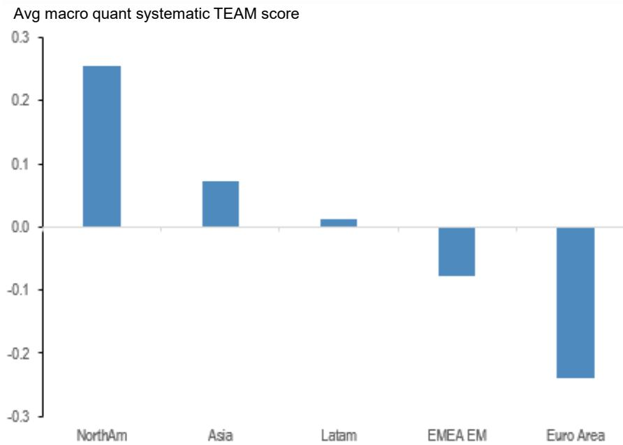

bar

Avg macro quant systematic TEAM score
| Region | Avg macro quant systematic TEAM score |
| :--- | :--- |
| NorthAm | 0.25 |
| Asia | 0.07 |
| Latam | 0.01 |
| EMEA EM | -0.08 |
| Euro Area | -0.24 |

Source: JPM

- Global offsets have been critical so far – bridging tech strength, fiscal support, financial conditions, sentiment, employment and monetary policy. We’ve downgraded global GDP just -0.3%, vs -0.8% without the perceived supports.   
- North America has the best mix of direct energy impact (least) and degree of offsets (most). Western Europe is the most exposed. This is validated by cyclical macro quant criteria that we track for systematic FX trading.   
• Resilient growth is partly attributable to supportive policies; fiscal has eased, CBs have remained patient.   
- Business spending and hiring also supportive – reflecting fading of last year’s sentiment slide from trade war, and global consumers smoothing income shocks.   
- Ongoing resilience will require more lift from the business side, via hiring to offset purchasing power squeezes

# Carry is king, but we're starting to see some wavering

# Carry has anchored G10 performance through the conflict...

(X) Ex-ante carry, 3m % ar; (Y): FX/USD % change since end-Feb. USD is TWI   
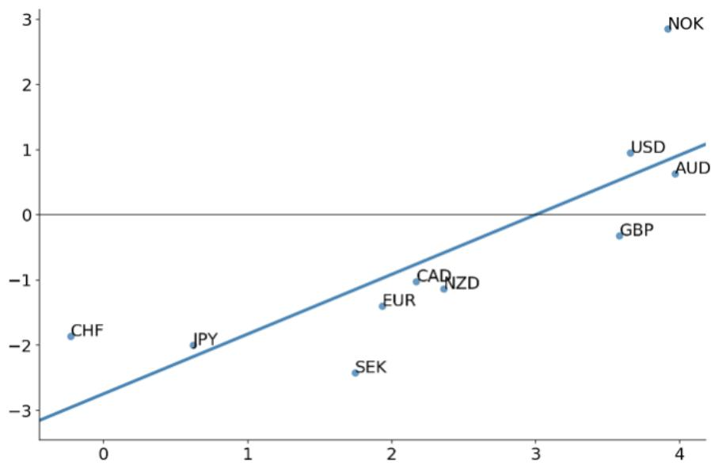

scatter

| Currency | X | Y |
| :--- | :--- | :--- |
| CHF | -0.2 | -1.9 |
| JPY | 0.6 | -2.0 |
| SEK | 1.7 | -2.5 |
| EUR | 1.9 | -1.4 |
| CAD | 2.2 | -1.0 |
| NZD | 2.4 | -1.1 |
| NOK | 3.9 | 2.9 |
| USD | 3.6 | 1.0 |
| AUD | 3.9 | 0.6 |
| GBP | 3.6 | -0.3 |

Source: JPM

# ... but over the past month, the T.E.A.M macro score of high yielders has deteriorated

Y: implied yield on 1M CCYUSD forward VS. X: 1M change in our T.E.A.M macro score incorporating carry, growth, equity momentum, commodity ToT momentum, value and defensive implied volatility.   
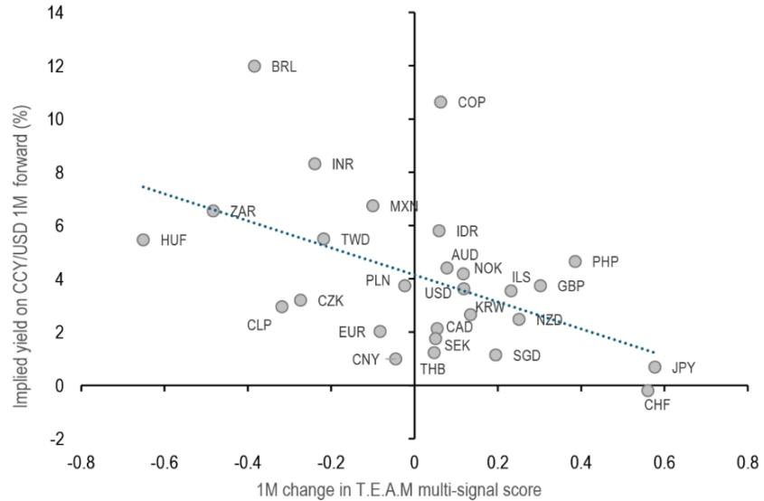

scatter

| Country | 1M change in T.E.A.M multi-signal score | Implied yield on CCY/USD 1M forward (%) |
|---------|----------------------------------------|------------------------------------------|
| BRL     | -0.4                                   | 12.0                                     |
| INR     | -0.2                                   | 8.5                                      |
| MXN     | -0.1                                   | 7.0                                      |
| ZAR     | -0.5                                   | 6.5                                      |
| HUF     | -0.6                                   | 5.5                                      |
| TWD     | -0.2                                   | 5.5                                      |
| PLN     | -0.1                                   | 4.0                                      |
| CZK     | -0.3                                   | 3.0                                      |
| EUR     | -0.1                                   | 2.0                                      |
| CNY     | -0.1                                   | 1.0                                      |
| USD     | 0.1                                    | 3.5                                      |
| IND     | 0.1                                    | 6.0                                      |
| AUD     | 0.1                                    | 4.5                                      |
| NOK     | 0.1                                    | 4.0                                      |
| KRW     | 0.1                                    | 2.5                                      |
| CAD     | 0.1                                    | 2.0                                      |
| SEK     | 0.1                                    | 1.5                                      |
| THB     | 0.1                                    | 1.0                                      |
| SGD     | 0.2                                    | 1.5                                      |
| GBP     | 0.3                                    | 3.5                                      |
| PHP     | 0.4                                    | 4.5                                      |
| NZD     | 0.2                                    | 2.5                                      |
| JPY     | 0.6                                    | 0.5                                      |
| CHF     | 0.6                                    | -0.5                                     |

Source: JPM

- Carry explains most of the returns for G10 FX since the start of the conflict, reflecting 1) only modestly lower growth, 2) higher inflation, and thus 3) cautious central banks protecting carry dispersion.   
- But the quality of global carry has deteriorated somewhat. Our systematic macro scores (carry, growth, equity / commodity momentum, vol, valuations) has evolved in favor of low/mid-yielders.

# USD did not underperform the oil move, after adjusting for market vol

USD has been held down by low vol / positive risk, despite oil prices still elevated   
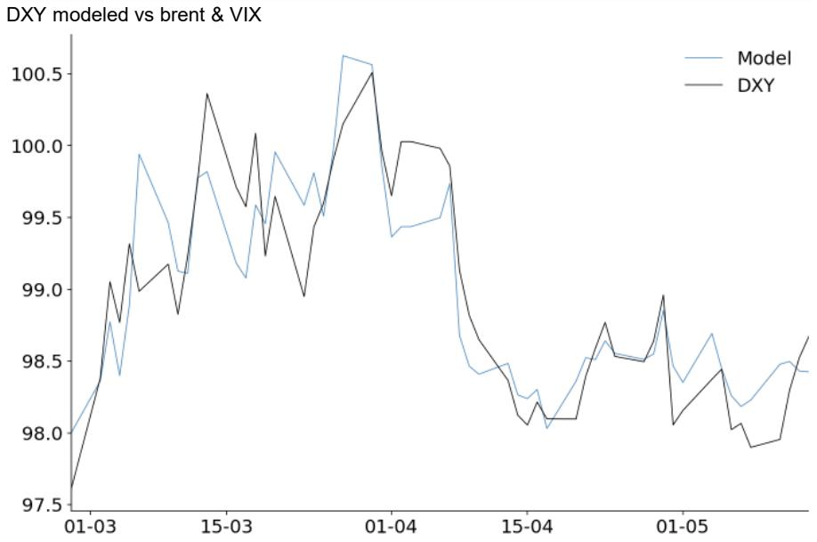

line

| Date   | Model | DXY   |
|--------|-------|-------|
| 01-03  | 98.0  | 97.6  |
| 15-03  | 99.8  | 100.4 |
| 01-04  | 100.6 | 100.5 |
| 15-04  | 98.5  | 98.1  |
| 01-05  | 98.7  | 98.4  |

Source: JPM

USD's oil sensitivity has spiked as its energy BoP has evolved   
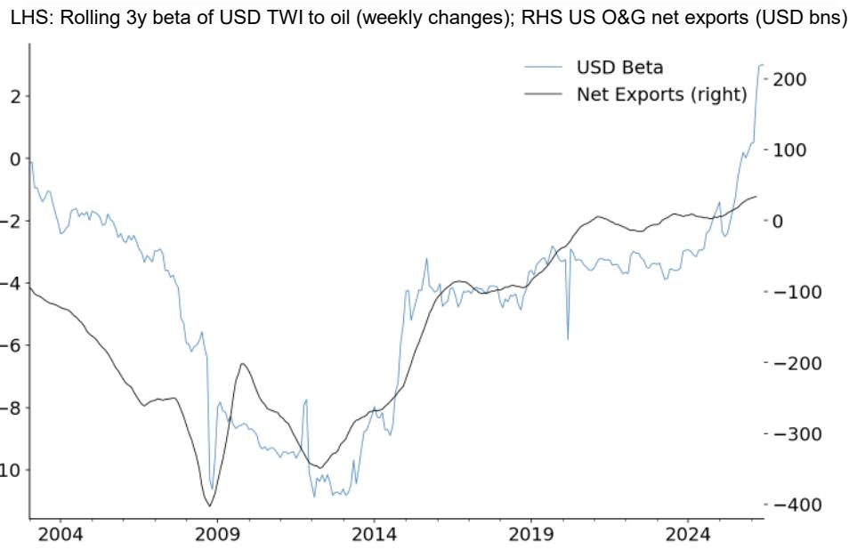

line

| Year | USD Beta | Net Exports (right) |
|------|----------|---------------------|
| 2004 | ~0       | ~-4                 |
| 2009 | ~-8      | ~-400               |
| 2014 | ~-4      | ~-100               |
| 2019 | ~-2      | ~-100               |
| 2024 | ~2       | ~0                  |

Source: JPM

- USD has been held down by low vol / positive risk, despite oil prices still elevated; the dollar continues to oscillate with fluctuations in both oil and vol.   
- USD's oil sensitivity has spiked as its energy BoP has evolved, with a positive beta to oil now fundamentally justified with US exports hitting record levels.

# Inflation has surprised to the upside in pockets even as energy vol moderates

# Energy prices may have moderated – but some upside inflation beats turned us long USD in early May

M/M change in Bloomberg US inflation data surprise index (z-score)   
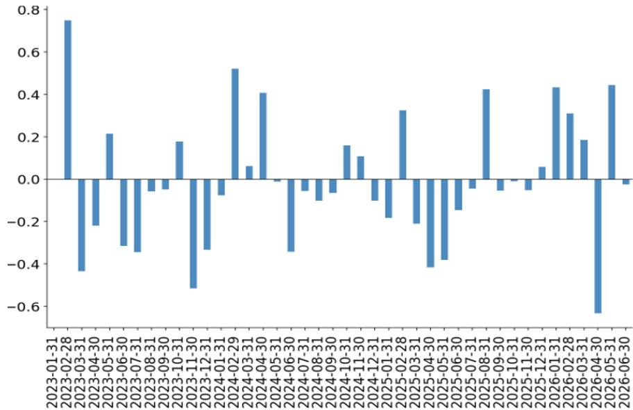

bar

| Date | Value |
|---|---|
| 2023-01-31 | 0.75 |
| 2023-02-28 | -0.43 |
| 2023-03-31 | -0.22 |
| 2023-04-30 | 0.21 |
| 2023-05-31 | -0.31 |
| 2023-06-30 | -0.34 |
| 2023-07-31 | -0.05 |
| 2023-08-31 | -0.06 |
| 2023-09-30 | -0.04 |
| 2023-10-31 | 0.18 |
| 2023-11-30 | -0.51 |
| 2023-12-31 | -0.34 |
| 2024-01-31 | -0.07 |
| 2024-02-29 | 0.52 |
| 2024-03-31 | 0.06 |
| 2024-04-30 | 0.41 |
| 2024-05-31 | -0.01 |
| 2024-06-30 | -0.34 |
| 2024-07-31 | -0.06 |
| 2024-08-31 | -0.11 |
| 2024-09-30 | -0.05 |
| 2024-10-31 | 0.16 |
| 2024-11-30 | 0.11 |
| 2024-12-31 | -0.11 |
| 2025-01-31 | -0.18 |
| 2025-02-28 | 0.33 |
| 2025-03-31 | -0.21 |
| 2025-04-30 | -0.41 |
| 2025-05-31 | -0.38 |
| 2025-06-30 | -0.14 |
| 2025-07-31 | -0.04 |
| 2025-08-31 | 0.42 |
| 2025-09-30 | -0.04 |
| 2025-10-31 | -0.04 |
| 2025-11-30 | -0.06 |
| 2025-12-31 | 0.06 |
| 2026-01-31 | 0.43 |
| 2026-02-28 | 0.31 |
| 2026-03-31 | 0.19 |
| 2026-04-30 | -0.61 |
| 2026-05-31 | 0.44 |
| 2026-06-30 | -0.01 |

Source: JPM

# US headline pass-through to core is expected to be muted, but some data still suggest some upside risk

JPM inflation FRIs; (X): Headline; (Y): Core. Changes since end-Feb.   
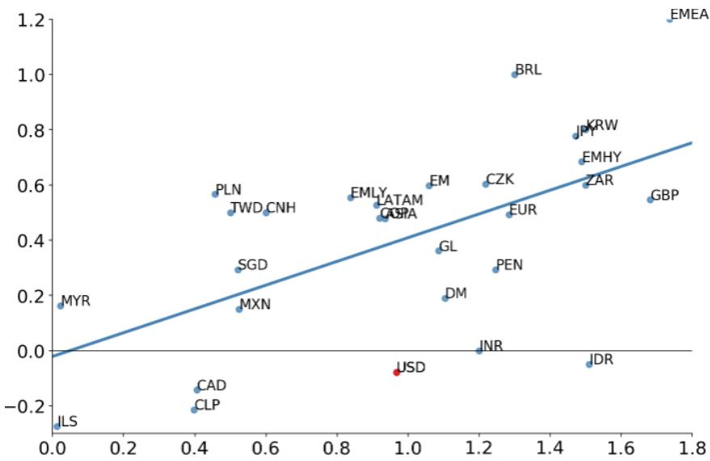

scatter

| Country | X    | Y    |
|---------|------|------|
| EMEA    | 1.75 | 1.20 |
| BRL     | 1.30 | 1.00 |
| JPY     | 1.45 | 0.80 |
| KRW     | 1.45 | 0.75 |
| EMHY    | 1.50 | 0.70 |
| ZAR     | 1.50 | 0.60 |
| GBP     | 1.65 | 0.55 |
| EUR     | 1.30 | 0.50 |
| CZK     | 1.25 | 0.60 |
| EM      | 1.10 | 0.60 |
| GL      | 1.10 | 0.35 |
| PEN     | 1.25 | 0.30 |
| DM      | 1.10 | 0.20 |
| USD     | 1.00 | -0.10 |
| CAD     | 0.45 | -0.15 |
| CLP     | 0.40 | -0.20 |
| SGD     | 0.50 | 0.30 |
| MXN     | 0.55 | 0.15 |
| TWD     | 0.55 | 0.50 |
| CNH     | 0.60 | 0.50 |
| PLN     | 0.45 | 0.60 |
| MYR     | 0.05 | 0.15 |
| JLS     | 0.05 | -0.25 |
| INR     | 1.20 | 0.00 |
| IDR     | 1.55 | -0.10 |

Source: JPM

- Energy price vol has moderated, but some US inflation outcomes have beat consensus expectations and business survey inflation measures are rising.   
- Upside inflation risks have intensified, from the possibility of a small amount of energy pass-through into core inflation, the ongoing surge in technology hardware costs, and widespread reports of supply chain challenges. Some household measures of inflation expectations have also firmed   
- Thus, inflation surprises are starting to challenge expectations of limited pass-through to core, which for the US has unusually-soft presumed spillover effect into underlying.   
• The spike in inflation beats in May compelled us into a more obvious long-USD stance.

# With new Fed leadership, watching various measures of core inflation and breadth

Trimmed mean inflation is relatively low, but other alt measures of core are not...   
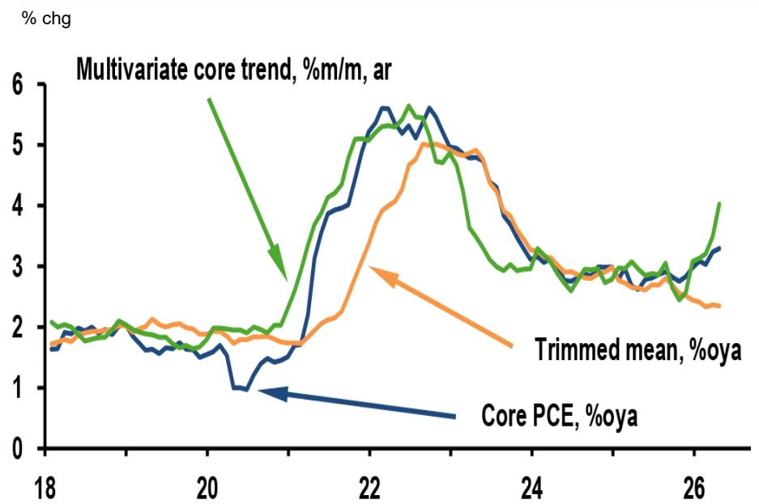

line

| Year | Core PCE, %oya | Trimmed mean, %oya | Multivariate core trend, %m/m, ar |
|------|----------------|--------------------|-----------------------------------|
| 18   | ~1.7           | ~1.8               | ~2.0                              |
| 20   | ~1.5           | ~1.9               | ~2.0                              |
| 22   | ~5.5           | ~4.5               | ~5.5                              |
| 24   | ~3.0           | ~3.0               | ~3.0                              |
| 26   | ~3.3           | ~2.5               | ~4.0                              |

Source: JPM Economics

...while some evidence points to core inflation breadth increasing   
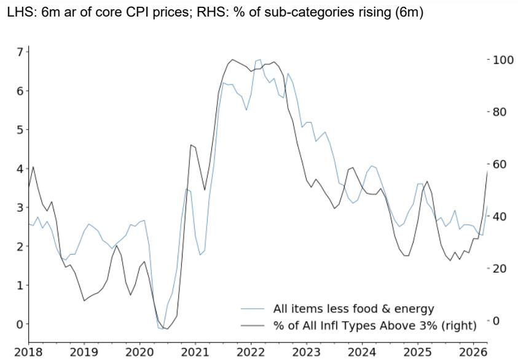

line

| Year | All items less food & energy | % of All Infl Types Above 3% (right) |
|------|-------------------------------|-------------------------------------|
| 2018 | ~2.5                          | ~40                                 |
| 2019 | ~2.0                          | ~15                                 |
| 2020 | ~2.5                          | ~10                                 |
| 2021 | ~3.5                          | ~45                                 |
| 2022 | ~6.5                          | ~100                                |
| 2023 | ~5.0                          | ~80                                 |
| 2024 | ~4.0                          | ~60                                 |
| 2025 | ~3.0                          | ~40                                 |
| 2026 | ~40                           | ~60                                 |

Source: JPM, Haver

• PCE at 3.3% probably encourages an FOMC shift toward a neutral bias.   
- Among alternative PCE measures, the trimmed mean PCE, which Fed Chair Warsh had mentioned in his confirmation hearing, did fall back to just 2.3% oya.   
- On the more concerning side, the FRBNY's multivariate core trend inflation metric has surged over the last couple of months.   
As recently as early '24 the trimmed mean was running above the core.

# Further inflation upside in the US is consistent with a stronger USD

# USD has tracked the contours of supercore momentum, which has been firm recently

LHS: Supercore CPI, 6m %chg ar; RHS: USD 6m % chgs  
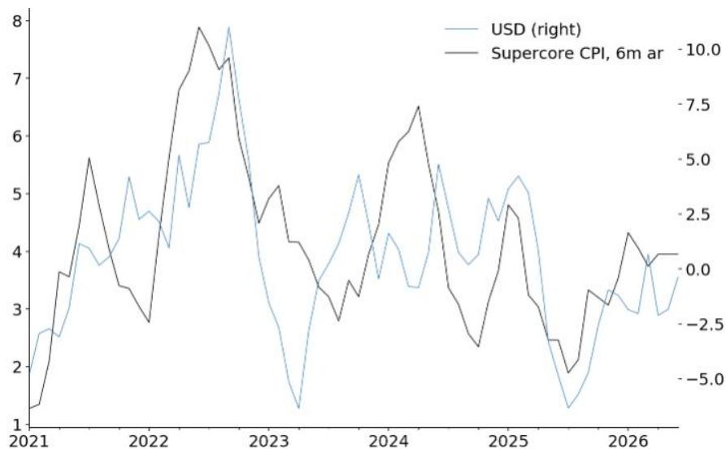

line

| Year | USD (right) | Supercore CPI, 6m ar |
|------|-------------|----------------------|
| 2021 | ~2.5        | ~-10.0               |
| 2022 | ~4.5        | ~-5.0                |
| 2023 | ~1.5        | ~-7.5                |
| 2024 | ~5.5        | ~-5.0                |
| 2025 | ~5.0        | ~-2.5                |
| 2026 | ~3.5        | ~-10.0               |

Source: JPM

# ...with USD also outperforming when US inflation momentum proxies outpace others

LHS: US vs G10 inflation proxy; RHS; UDS TWI, 6m % chgs  
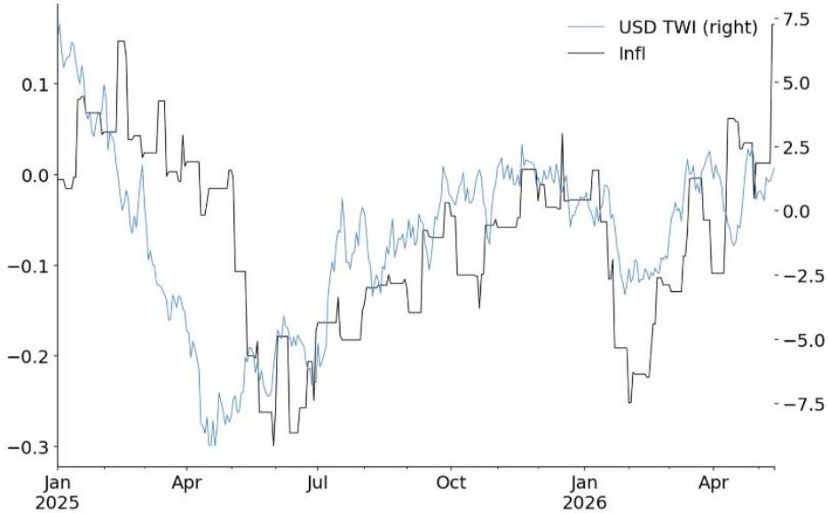

line

| Date   | USD TWI (right) | Infl |
|--------|-----------------|------|
| Jan 2025 | ~0.1            | ~0.0 |
| Apr    | ~-0.3           | ~-0.2 |
| Jul    | ~-0.2           | ~-0.1 |
| Oct    | ~-0.1           | ~-0.1 |
| Jan 2026 | ~-0.1           | ~-0.2 |
| Apr    | ~0.0            | ~-0.1 |

Source: JPM   
Inflation Proxy: JPMaQS avg of 3m/6m/oya headline/core + 1y/2y/5y infl exp (%)

• USD has traded correlated with core measures like supercore...   
• ... as well as relative US-G10 measures of inflation momentum which have jumped

# A sustained USD bull trend will need more labor market strength

# USD has tracked measures of US labor demand

LHS: PC1 of alternative US private labor demand; RHS: USD TWI   
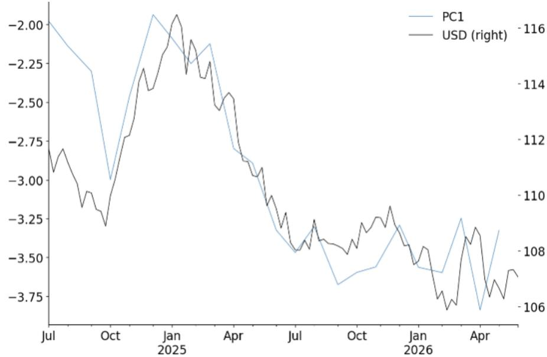

line

| Month   | PC1    | USD (right) |
|---------|--------|-------------|
| Jul 2025 | -2.00  | -116        |
| Oct 2025 | -3.00  | -114        |
| Jan 2026 | -2.50  | -112        |
| Apr 2026 | -3.50  | -110        |
| Jul 2026 | -3.75  | -108        |
| Oct 2026 | -3.50  | -106        |

Source: JPM

# USD would benefit from labor demand pulling earnings higher in a way that pushes inflation up

LHS: Avg hourly earnings (6m avg); RHS: Private payrolls growth, 6m % ar   
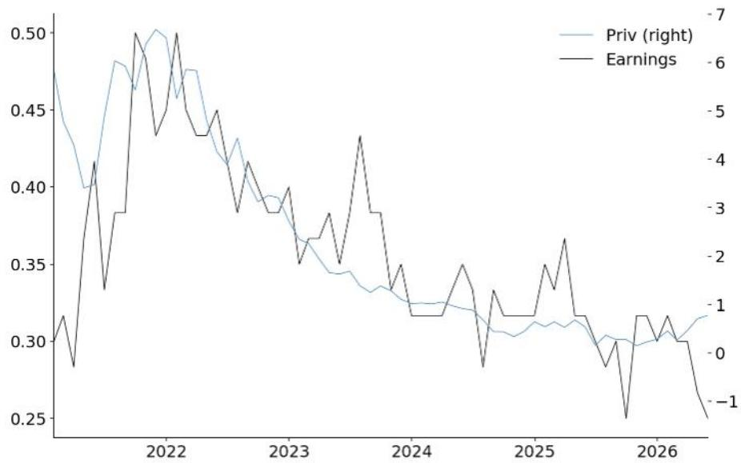

line

| Year | Priv (right) | Earnings |
|------|--------------|----------|
| 2022 | 0.48         | 0.50     |
| 2023 | 0.39         | 0.38     |
| 2024 | 0.33         | 0.35     |
| 2025 | 0.31         | 0.37     |
| 2026 | 0.32         | 0.25     |

Source: JPM

• USD has been well-correlated with proxies of US labor market momentum in recent years...   
• ...meaning a more sustained uplift in business demand is quite important for USD...   
...particularly as higher demand can pressure wages which can pressure core inflation such and engender Fed repricing to boost the dollar further

# Risks appear to the upside for USD looking at valuations and relative rates...

CB expectations still have room to compress in USD's favor, albeit the gap has narrowed over the last few weeks   
Cumulative priced hikes, 1m OIS (%).   
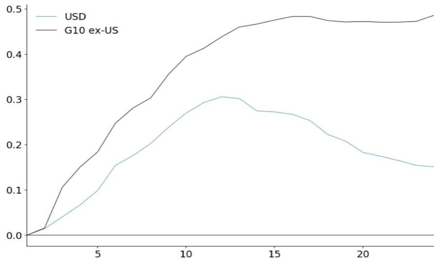

line

| x  | USD   | G10 ex-US |
|----|-------|-----------|
| 0  | 0.000 | 0.000     |
| 5  | 0.100 | 0.250     |
| 10 | 0.250 | 0.400     |
| 15 | 0.275 | 0.480     |
| 20 | 0.180 | 0.470     |
| 25 | 0.150 | 0.480     |

Source: JPM

USD screens cheap on some real rate measures...   
DXY vs model of US-G10 5y real yield differentials   
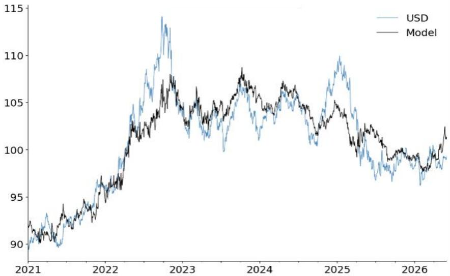

line

| Year | USD  | Model |
|------|------|-------|
| 2021 | 90   | 90    |
| 2022 | 105  | 104   |
| 2023 | 114  | 107   |
| 2024 | 106  | 108   |
| 2025 | 110  | 105   |
| 2026 | 98   | 102   |

Source: JPM

CB expectations still have room to compress in USD's favor.   
- The skew of risks from relative rates still looks to favor the USD tactically on inflation beats.   
- The US money market curve has turned positive for the first time in four years.   
- USD has undershot real rate spreads on multiple channels, suggesting some room for USD to catch up.

...and on crosses   
USD crosses vs model of US-G10 5y real yield differentials. USD is DXY 

<table><tr><td rowspan="2"></td><td colspan="3">Since 2021</td></tr><tr><td>Implied</td><td>Mispricing</td><td> $R^{2}$ </td></tr><tr><td>DXY</td><td>101.2</td><td>-2.2%</td><td>0.81</td></tr><tr><td>EUR</td><td>1.118</td><td>4.2%</td><td>0.82</td></tr><tr><td>AUD</td><td>0.697</td><td>2.7%</td><td>0.46</td></tr><tr><td>CAD</td><td>1.415</td><td>2.7%</td><td>0.87</td></tr><tr><td>GBP</td><td>1.318</td><td>1.9%</td><td>0.22</td></tr><tr><td>JPY</td><td>140.85</td><td>-12%</td><td>0.87</td></tr></table>

<table><tr><td colspan="3">Since 2025</td></tr><tr><td>Implied</td><td>Mispricing</td><td> $R^{2}$ </td></tr><tr><td>101.2</td><td>-2.2%</td><td>0.48</td></tr><tr><td>1.111</td><td>4.8%</td><td>0.48</td></tr><tr><td>0.663</td><td>7.9%</td><td>0.47</td></tr><tr><td>1.412</td><td>2.4%</td><td>0.45</td></tr><tr><td>1.307</td><td>2.8%</td><td>0.46</td></tr><tr><td>153.85</td><td>-3.4%</td><td>0.12</td></tr></table>

Source: JPM

# ...against a backdrop of solid relative cyclicals and some underpriced rates

# Treasuries appear rich relative to EGBs...

(X) 1y1y USD/EUR OIS spread (bp), regression over the last year   
(Y) 10-year Treasury/German bund spread; bp   
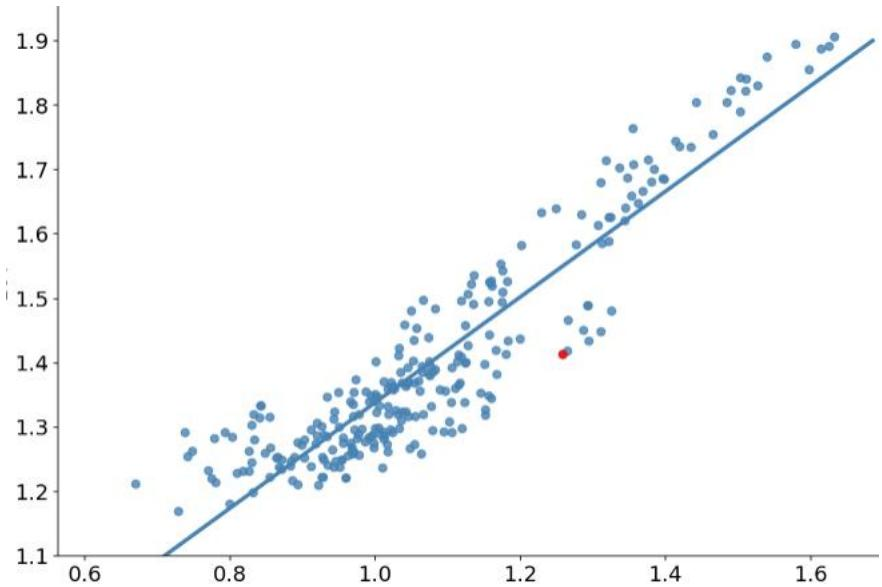

scatter

| x    | y    |
| ---- | ---- |
| 0.6  | 1.2  |
| 0.7  | 1.3  |
| 0.8  | 1.35 |
| 0.9  | 1.4  |
| 1.0  | 1.45 |
| 1.1  | 1.5  |
| 1.2  | 1.55 |
| 1.3  | 1.6  |
| 1.4  | 1.7  |
| 1.5  | 1.8  |
| 1.6  | 1.9  |

Source: JPM

# ...while G10 complex yields generally are lower than central bank NLP scores

Avg of G10 majors 10Y yields vs avg Hawk-Dove NLP scores   
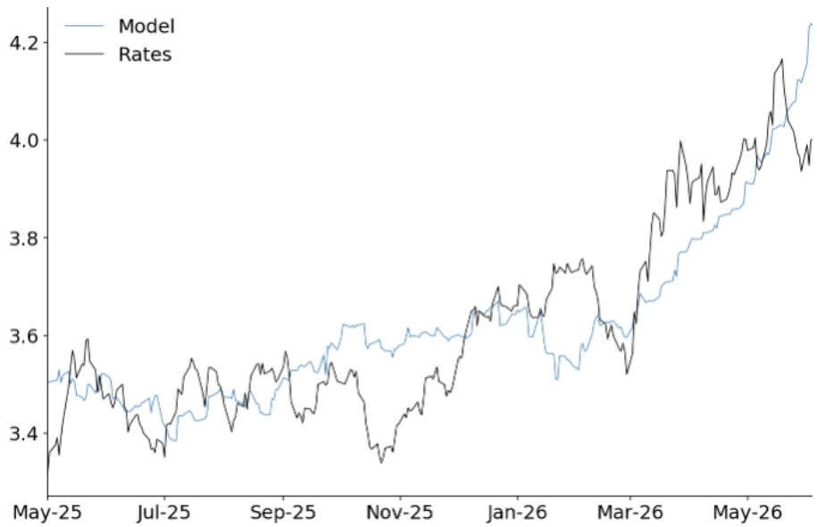

line

| Date   | Model | Rates |
|--------|-------|-------|
| May-25 | 3.5   | 3.4   |
| Jul-25 | 3.45  | 3.35  |
| Sep-25 | 3.55  | 3.45  |
| Nov-25 | 3.6   | 3.35  |
| Jan-26 | 3.65  | 3.7   |
| Mar-26 | 3.7   | 3.8   |
| May-26 | 4.1   | 4.0   |

Source: JPM

• US cyclical resilience is evident on select metrics since the war started   
- And yet US yields are cheap vs European peers, and vs some UST FV estimates. Our global rates colleagues have added long 10Y bunds vs UST 10s   
- With USD itself cheap to real rates, that suggests a couple channels of valuation support in the offing...   
• ...especially with global yields potentially undershooting relative to central bank NLP scores

# US equity outperformance has been a key incremental driver of USD strength

# US equity outperformance is boosting USD

Contributions to USD TWI vs two factor equity models (outright global equities and relative US-GL equity differential). 3m % changes.   
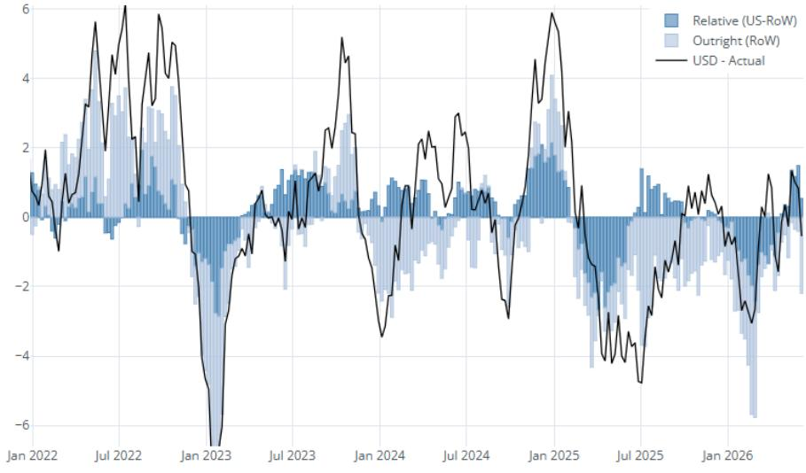

bar_line

| Date     | Relative (US-RoW) | Outright (RoW) | USD - Actual |
|----------|-------------------|----------------|--------------|
| Jan 2022 | ~1.5              | ~1.0           | ~1.0         |
| Jul 2022 | ~3.0              | ~4.0           | ~6.0         |
| Jan 2023 | ~-6.0             | ~-4.0          | ~-7.0        |
| Jul 2023 | ~1.0              | ~1.5           | ~1.0         |
| Jan 2024 | ~1.5              | ~2.0           | ~5.0         |
| Jul 2024 | ~1.0              | ~1.5           | ~3.0         |
| Jan 2025 | ~2.0              | ~3.0           | ~6.0         |
| Jul 2025 | ~1.5              | ~1.0           | ~3.0         |
| Jan 2026 | ~1.0              | ~1.5           | ~1.5         |

Source: JPM

# The skew of USD returns depends on both relative equity performance, and outright global equity performance

USD sensitivity to equity scenarios. Columns: Global outright equity returns; Index: US vs RoW returns. % 

<table><tr><td></td><td>-20</td><td>-15</td><td>-10</td><td>-5</td><td>0</td><td>5</td><td>10</td><td>15</td><td>20</td></tr><tr><td>-12.5</td><td>2.8%</td><td>1.7%</td><td>0.5%</td><td>-0.7%</td><td>-1.8%</td><td>-3.0%</td><td>-4.1%</td><td>-5.3%</td><td>-6.5%</td></tr><tr><td>-10.0</td><td>3.3%</td><td>2.1%</td><td>1.0%</td><td>-0.2%</td><td>-1.4%</td><td>-2.5%</td><td>-3.7%</td><td>-4.9%</td><td>-6.0%</td></tr><tr><td>-7.5</td><td>3.7%</td><td>2.6%</td><td>1.4%</td><td>0.2%</td><td>-0.9%</td><td>-2.1%</td><td>-3.3%</td><td>-4.4%</td><td>-5.6%</td></tr><tr><td>-5.0</td><td>4.2%</td><td>3.0%</td><td>1.8%</td><td>0.7%</td><td>-0.5%</td><td>-1.7%</td><td>-2.8%</td><td>-4.0%</td><td>-5.2%</td></tr><tr><td>-2.5</td><td>4.6%</td><td>3.4%</td><td>2.3%</td><td>1.1%</td><td>-0.1%</td><td>-1.2%</td><td>-2.4%</td><td>-3.6%</td><td>-4.7%</td></tr><tr><td>0.0</td><td>5.0%</td><td>3.9%</td><td>2.7%</td><td>1.5%</td><td>0.4%</td><td>-0.8%</td><td>-1.9%</td><td>-3.1%</td><td>-4.3%</td></tr><tr><td>2.5</td><td>5.5%</td><td>4.3%</td><td>3.2%</td><td>2.0%</td><td>0.8%</td><td>-0.3%</td><td>-1.5%</td><td>-2.7%</td><td>-3.8%</td></tr><tr><td>5.0</td><td>5.9%</td><td>4.8%</td><td>3.6%</td><td>2.4%</td><td>1.3%</td><td>0.1%</td><td>-1.1%</td><td>-2.2%</td><td>-3.4%</td></tr><tr><td>7.5</td><td>6.4%</td><td>5.2%</td><td>4.0%</td><td>2.9%</td><td>1.7%</td><td>0.5%</td><td>-0.6%</td><td>-1.8%</td><td>-3.0%</td></tr><tr><td>10.0</td><td>6.8%</td><td>5.6%</td><td>4.5%</td><td>3.3%</td><td>2.1%</td><td>1.0%</td><td>-0.2%</td><td>-1.4%</td><td>-2.5%</td></tr><tr><td>12.5</td><td>7.2%</td><td>6.1%</td><td>4.9%</td><td>3.7%</td><td>2.6%</td><td>1.4%</td><td>0.3%</td><td>-0.9%</td><td>-2.1%</td></tr></table>

Source: JPM

- US equity outperformance has been supporting USD. This is a drastic reversal from 4Q'25 and early 1Q'26 when US equity returns were flat vs surging RoW.   
- That period was negative for USD via two channels – outright global equity strength (negative for USD via its anti-cyclical properties) and relative underperformance.   
• This factor has important relevance for EUR/USD over the last year.   
- 5% US outperformance and 5% global equity returns would mean USD about flat. 10% relative outperformance and -5% outright RoW returns would see USD +2.4%.

# This remains a high dollar-corrs environment, but inflation outturns could challenge that

Dollar correlations remain elevated in a high-inflation energy shock environment, but this should be ebbing   
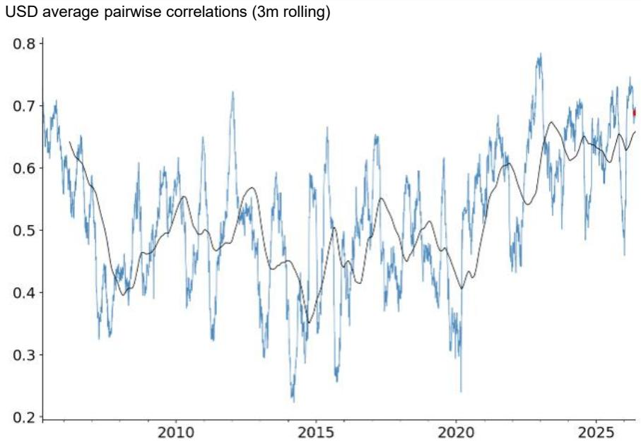

line

| Year | USD average pairwise correlations (3m rolling) |
| ---- | ----------------------------------------------- |
| 2015 | 0.45                                            |
| 2020 | 0.40                                            |
| 2025 | 0.65                                            |

Source: JPM

USD corrs could soften if more inflation divergences emerge   
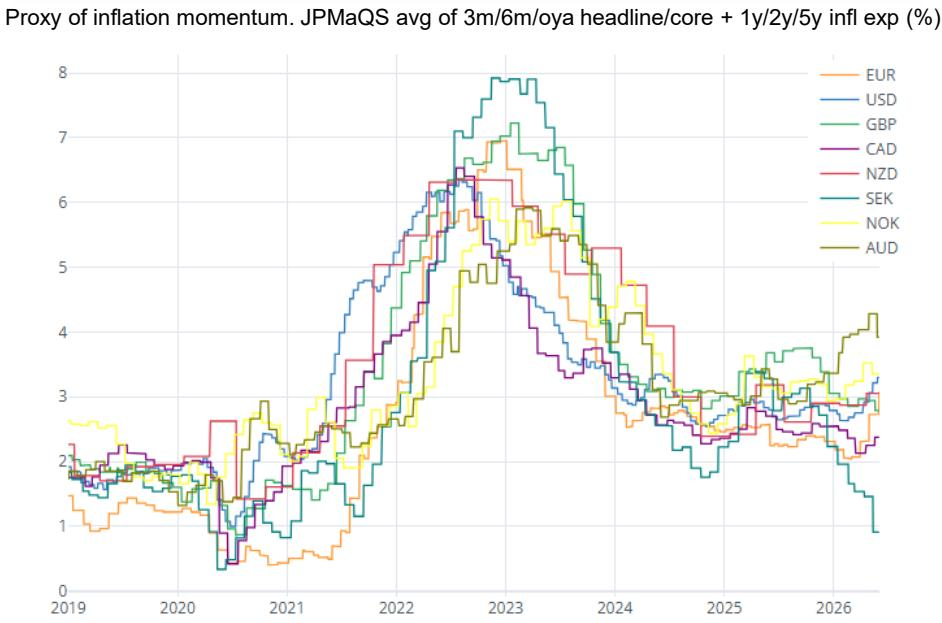

line

| Year | EUR  | USD  | GBP  | CAD  | NZD  | SEK  | NOK  | AUD  |
|------|------|------|------|------|------|------|------|------|
| 2019 | 1.5  | 1.8  | 1.7  | 1.9  | 2.0  | 1.6  | 2.5  | 1.7  |
| 2020 | 1.2  | 1.6  | 1.5  | 1.7  | 1.8  | 1.4  | 2.3  | 1.6  |
| 2021 | 0.8  | 1.4  | 1.3  | 1.5  | 1.6  | 1.2  | 2.0  | 1.4  |
| 2022 | 2.5  | 3.0  | 2.8  | 3.2  | 3.5  | 2.7  | 3.8  | 3.0  |
| 2023 | 6.0  | 6.5  | 6.3  | 6.7  | 6.8  | 6.2  | 7.0  | 5.5  |
| 2024 | 3.5  | 4.0  | 3.8  | 4.2  | 4.5  | 3.7  | 4.8  | 4.0  |
| 2025 | 2.8  | 3.2  | 3.0  | 3.5  | 3.8  | 3.0  | 3.5  | 3.2  |
| 2026 | 2.5  | 3.0  | 2.8  | 3.2  | 3.5  | 2.5  | 3.0  | 3.8  |
| End   | -    | -    | -    | -    | -    | -    | -    | -    |

Source: JPM

• Dollar correlations remain elevated in a high-inflation energy shock environment.   
• More divergent inflation outcomes could deliver softer corrs, though.   
- Lower yielders (CAD, SEK) have had softer inflation outturns, while higher-yielders like AUD and NOK have firmer inflation, entrenching the carry dynamic.

# Carry positioning is increasing but not yet obviously stretched

# Global carry positioning is picking back up...

LHS: global outright carry returns (6m % chgs); RHS: Proxy for carry positioning (top 2 / bottom 2 by % yield, IMM futures data)   
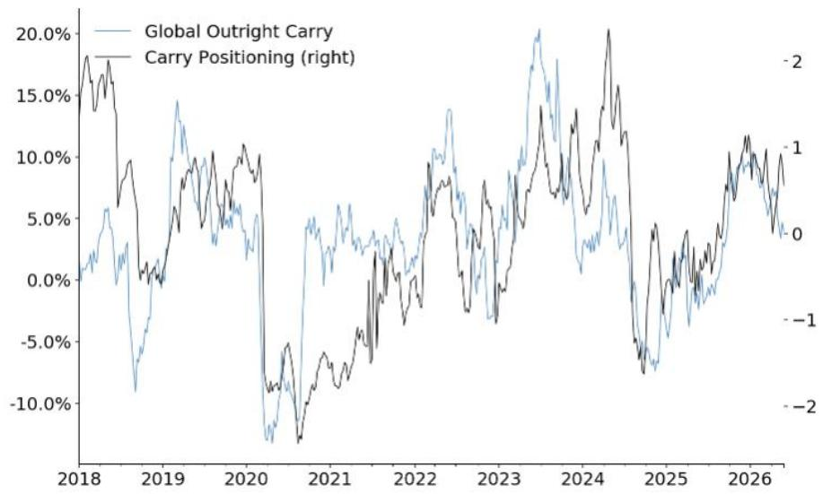

line

| Year | Global Outright Carry | Carry Positioning (right) |
|------|------------------------|----------------------------|
| 2018 | ~18.0%                 | ~18.0%                     |
| 2019 | ~14.0%                 | ~10.0%                     |
| 2020 | ~-12.0%                | ~-10.0%                    |
| 2021 | ~5.0%                  | ~-5.0%                     |
| 2022 | ~10.0%                 | ~-5.0%                     |
| 2023 | ~14.0%                 | ~-5.0%                     |
| 2024 | ~20.0%                 | ~-5.0%                     |
| 2025 | ~-7.0%                 | ~-7.0%                     |
| 2026 | ~-5.0%                 | ~-5.0%                     |

Source: JPM, CFTC

# ...but has room to run

Rolling cross-sectional Rsq of weekly IMM futures positioning vs carry levels   
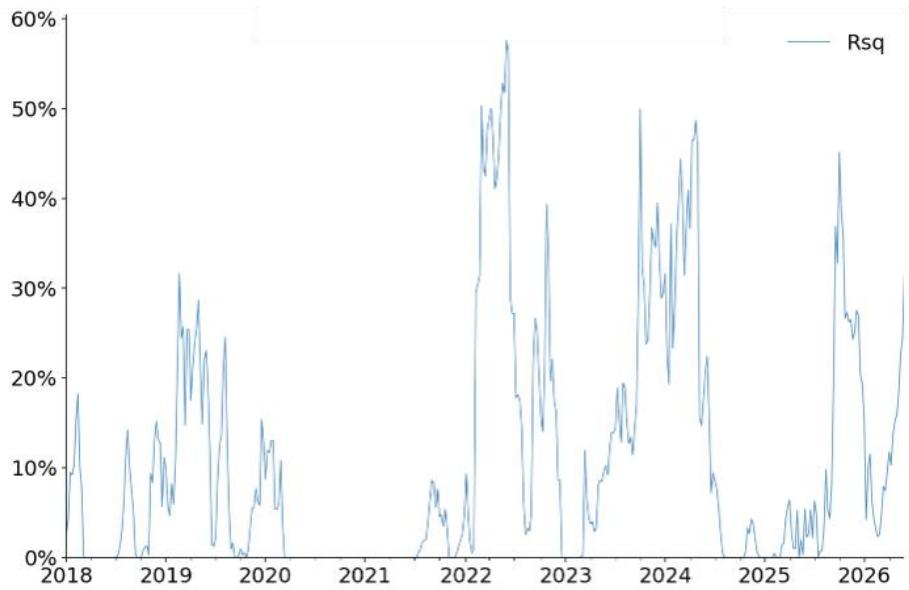

line

| Year | Rsq   |
|------|-------|
| 2018 | ~18%  |
| 2019 | ~31%  |
| 2020 | ~15%  |
| 2021 | ~0%   |
| 2022 | ~50%  |
| 2023 | ~39%  |
| 2024 | ~50%  |
| 2025 | ~3%   |
| 2026 | ~31%  |

Source: JPM, CFTC

- Carry positioning proxies track changes in net carry returns. Those indicate rising positioning yet short of 2024 levels, which featured extreme JPY shorts.   
• Still, concentration is rising.

# SYSTEMATIC

# Systematic: The quality of global carry has deteriorated

# Over the past month, the T.E.A.M macro score of high yielders has deteriorated

X: 1M change in our T.E.A.M macro score (incorporating carry, growth, equity momentum, commodity ToT momentum, value & defensive implied volatility)

Y: implied yield on 1M CCY/USD forward

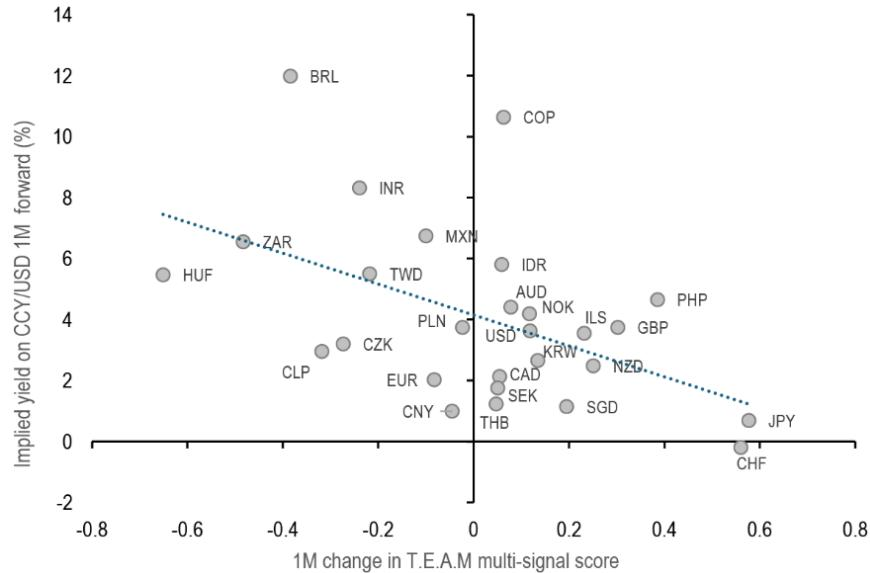

scatter

| Country | 1M change in T.E.A.M multi-signal score | Implied yield on CCY/USD 1M forward (%) |
|---------|----------------------------------------|------------------------------------------|
| BRL     | -0.4                                   | 12.0                                     |
| INR     | -0.2                                   | 8.5                                      |
| MXN     | -0.1                                   | 7.0                                      |
| ZAR     | -0.5                                   | 6.5                                      |
| HUF     | -0.6                                   | 5.5                                      |
| TWD     | -0.2                                   | 5.5                                      |
| PLN     | -0.1                                   | 3.5                                      |
| CZK     | -0.3                                   | 3.0                                      |
| CLP     | -0.3                                   | 2.8                                      |
| EUR     | -0.1                                   | 2.0                                      |
| CNY     | -0.1                                   | 1.0                                      |
| PHP     | 0.4                                    | 4.5                                      |
| USD     | 0.1                                    | 3.5                                      |
| KRW     | 0.1                                    | 2.5                                      |
| IND     | 0.1                                    | 4.5                                      |
| AUD     | 0.1                                    | 4.0                                      |
| NOK     | 0.1                                    | 4.0                                      |
| ILS     | 0.2                                    | 3.5                                      |
| GBP     | 0.3                                    | 3.5                                      |
| NZD     | 0.2                                    | 2.5                                      |
| SGD     | 0.2                                    | 1.5                                      |
| SEK     | 0.1                                    | 1.5                                      |
| THB     | 0.1                                    | 1.5                                      |
| JPY     | 0.6                                    | 0.5                                      |
| CHF     | 0.6                                    | -0.5                                     |

Source: JPM

# Global FX carry remains correlated with equities

X: Long-term CCY/USD beta to equities (3Y beta of monthly returns to MSCI World)
Y: CCY carry vs. USD based on 1M forward (%; annualised number).

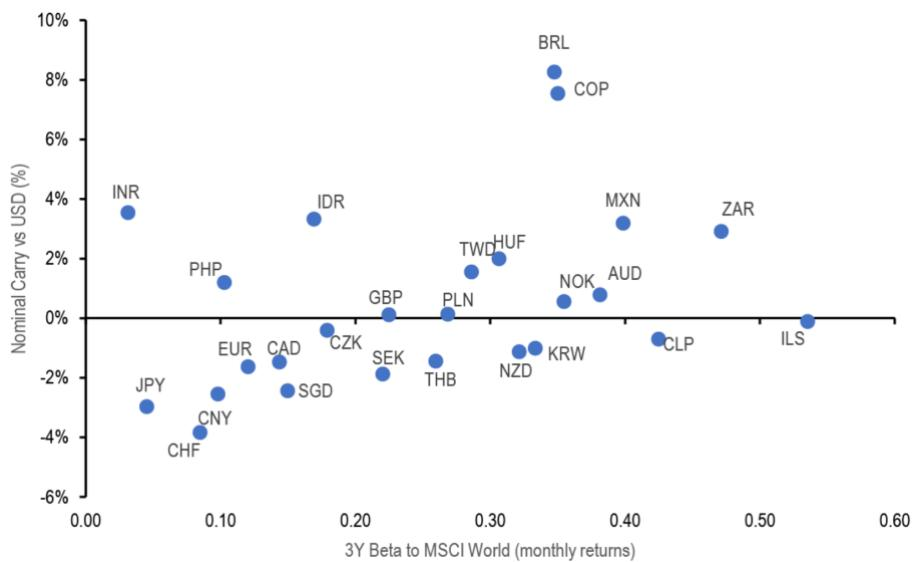

scatter

| Country Code | Nominal Carry vs USD (%) |
| ------------ | ------------------------ |
| INR          | 3.5%                     |
| PHP          | 1.0%                     |
| IDR          | 3.2%                     |
| EUR          | -1.8%                    |
| CAD          | -1.5%                    |
| CZK          | -0.5%                    |
| GBP          | 0.1%                     |
| SEK          | -1.8%                    |
| THB          | -1.2%                    |
| TWD          | 1.5%                     |
| HUF          | 2.0%                     |
| PLN          | 0.1%                     |
| MXN          | 3.0%                     |
| NOK          | 0.5%                     |
| AUD          | 0.7%                     |
| KRW          | -1.0%                    |
| NZD          | -1.2%                    |
| CLP          | -0.8%                    |
| ZAR          | 2.8%                     |
| ILS          | -0.2%                    |
| BRL          | 8.0%                     |
| COP          | 7.5%                     |

Source: JPM

- Global and EM carry baskets have recovered from the mid-May correction, with real carry leading the way YTD.   
- However, we are turning somewhat more cautious on global carry now. Our currency T.E.A.M macro score (incorporating carry, growth, equity & commodity momentum, volatility, and valuations) has evolved in favor of low/mid vs. high yielders.   
- Global FX carry remains correlated with equities, suggesting FX carry outperformance can continue so long as the equity/AI trade does not collapse

# Systematic: EUR stands out

Our fast T.E.A.M portfolio is currently biased by dispersion in commodity ToT and relative equity performance   
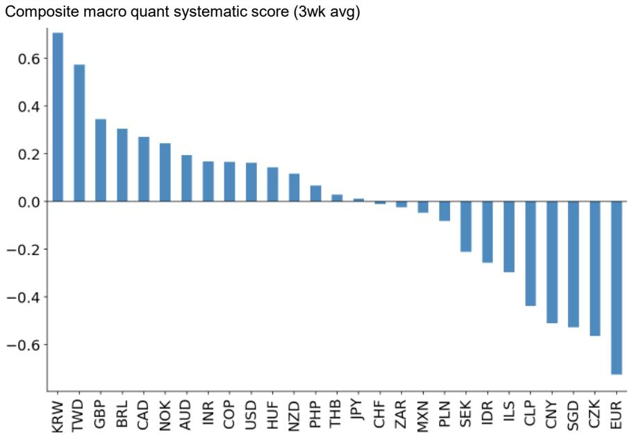

bar

Composite macro quant systematic score (3wk avg)
| Country | Composite macro quant systematic score (3wk avg) |
| :--- | :--- |
| KRW | 0.7 |
| TWD | 0.58 |
| GBP | 0.35 |
| BRL | 0.31 |
| CAD | 0.27 |
| NOK | 0.24 |
| AUD | 0.2 |
| INR | 0.17 |
| COP | 0.17 |
| USD | 0.16 |
| HUF | 0.14 |
| NZD | 0.12 |
| PHP | 0.07 |
| THB | 0.03 |
| JPY | 0.01 |
| CHF | -0.01 |
| ZAR | -0.02 |
| MXN | -0.05 |
| PLN | -0.08 |
| SEK | -0.21 |
| IDR | -0.25 |
| ILS | -0.3 |
| CLP | -0.43 |
| CNY | -0.49 |
| SGD | -0.52 |
| CZK | -0.56 |
| EUR | -0.7 |

Source: JPM

# The performance of our key market themes over the past three months has been concentrated in a few currencies, especially NOK

G10 currencies ranking on 5 of our single signal metrics: commodity ToT momentum; risk-adjusted carry; composite fiscal score; composite growth momentum (EASI+FRI) and current account balances. All the top/bottom 2 baskets based on these metrics have returned between +3% and +6% YTD.

<table><tr><td>top:</td><td>1</td><td>2</td><td>3</td><td>4</td><td>5</td><td>6</td><td>7</td><td>8</td><td>9</td><td>10</td></tr><tr><td>Commodity ToT mom</td><td>CAD</td><td>USD</td><td>NOK</td><td>AUD</td><td>CHF</td><td>GBP</td><td>NZD</td><td>EUR</td><td>JPY</td><td>SEK</td></tr><tr><td>Risk-adjusted carry</td><td>AUD</td><td>NOK</td><td>GBP</td><td>USD</td><td>NZD</td><td>SEK</td><td>EUR</td><td>CAD</td><td>JPY</td><td>CHF</td></tr><tr><td>Fiscal score</td><td>NOK</td><td>CHF</td><td>SEK</td><td>AUD</td><td>CAD</td><td>NZD</td><td>EUR</td><td>GBP</td><td>JPY</td><td>USD</td></tr><tr><td>Composite Growth mom</td><td>NOK</td><td>GBP</td><td>CAD</td><td>JPY</td><td>CHF</td><td>AUD</td><td>USD</td><td>SEK</td><td>NZD</td><td>EUR</td></tr><tr><td>CAB</td><td>NOK</td><td>CHF</td><td>SEK</td><td>JPY</td><td>EUR</td><td>CAD</td><td>GBP</td><td>AUD</td><td>USD</td><td>NZD</td></tr></table>

Source: JPM

- The T.E.A.M portfolio is biased by two signals: (i) our relative equity momentum and (ii) our commodity ToT momentum. The recent dispersion in EM equity performance (strong Asia vs. weak LatAm) makes our equity signal the most weighted (22%).   
- Commodity ToT momentum is the second most weighted (18%) as oil prices stay elevated (Brent>100).   
- On the short side, EUR continues to screen as the worst currency with weak growth signals, carry, commodity ToT momentum and still expensive valuations. CNY and SGD are used as funders in Asia.   
- The performance of our key market themes over the past three months has been concentrated in a few currencies, especially NOK.

Average monthly returns of single factors 2026 vs. 2025 

<table><tr><td>Portfolio</td><td colspan="2">Global</td><td colspan="2">G10</td><td colspan="2">EM</td></tr><tr><td>Period</td><td>Ytd 2026</td><td>2025</td><td>Ytd 2026</td><td>2025</td><td>Ytd 2026</td><td>2025</td></tr><tr><td>Real carry</td><td>0.9%</td><td>0.1%</td><td>1.0%</td><td>0.4%</td><td>1.2%</td><td>0.4%</td></tr><tr><td>Momentum 12M-1M Spot*</td><td>0.7%</td><td>-0.3%</td><td>0.5%</td><td>-0.1%</td><td>-</td><td>-</td></tr><tr><td>Growth momentum (EASI)</td><td>0.6%</td><td>0.0%</td><td>0.8%</td><td>0.0%</td><td>0.0%</td><td>-0.6%</td></tr><tr><td>Nominal carry</td><td>0.5%</td><td>0.7%</td><td>1.2%</td><td>0.1%</td><td>0.3%</td><td>1.1%</td></tr><tr><td>Commodity ToT</td><td>0.4%</td><td>-0.4%</td><td>0.8%</td><td>0.7%</td><td>-0.9%</td><td>-0.7%</td></tr><tr><td>Value (REER CPI)</td><td>0.3%</td><td>0.0%</td><td>0.6%</td><td>0.0%</td><td>0.0%</td><td>-0.1%</td></tr><tr><td>FDI&amp;Equity</td><td>0.3%</td><td>0.3%</td><td>-1.0%</td><td>-0.3%</td><td>0.9%</td><td>0.8%</td></tr><tr><td>Risk-adj carry</td><td>0.1%</td><td>0.6%</td><td>0.7%</td><td>0.0%</td><td>0.3%</td><td>0.6%</td></tr><tr><td>Hedged carry</td><td>0.1%</td><td>0.6%</td><td>-0.7%</td><td>0.3%</td><td>0.3%</td><td>0.7%</td></tr><tr><td>Swap rates momentum*</td><td>0.1%</td><td>-0.3%</td><td>-</td><td>-</td><td>-</td><td>-</td></tr><tr><td>Composite balances</td><td>0.1%</td><td>0.3%</td><td>-0.1%</td><td>0.1%</td><td>0.5%</td><td>0.5%</td></tr><tr><td>Composite growth</td><td>-0.1%</td><td>-0.5%</td><td>1.0%</td><td>0.4%</td><td>-0.7%</td><td>-0.7%</td></tr><tr><td>Equity momentum</td><td>-0.2%</td><td>0.0%</td><td>-0.5%</td><td>0.2%</td><td>0.3%</td><td>-0.2%</td></tr><tr><td>VRP (differential)</td><td>-0.2%</td><td>-0.3%</td><td>-</td><td>-</td><td>-</td><td>-</td></tr><tr><td>Growth momentum (FRI)</td><td>-0.4%</td><td>-0.3%</td><td>-0.4%</td><td>0.3%</td><td>-0.7%</td><td>-0.6%</td></tr><tr><td>Fiscal basket</td><td>-0.4%</td><td>0.4%</td><td>1.0%</td><td>1.1%</td><td>-1.5%</td><td>-0.5%</td></tr><tr><td>CAB</td><td>-0.4%</td><td>0.1%</td><td>0.8%</td><td>1.0%</td><td>-0.5%</td><td>-0.8%</td></tr><tr><td>Carry+Growth+Value</td><td>-0.5%</td><td>-0.3%</td><td>-</td><td>-</td><td>-0.5%</td><td>-0.7%</td></tr><tr><td>Defensive IV</td><td>-0.6%</td><td>-0.7%</td><td>-0.7%</td><td>-0.7%</td><td>-0.6%</td><td>-0.9%</td></tr><tr><td>Growth with USD overlay</td><td>-0.6%</td><td>-0.6%</td><td>-</td><td>-</td><td>-</td><td>-</td></tr><tr><td>Value (REER PPI)</td><td>-1.0%</td><td>-0.8%</td><td>-0.6%</td><td>-0.5%</td><td>-0.8%</td><td>-0.9%</td></tr></table>

\*Strategy on 20 most liquid currencies   
Source: JPM

• Real carry has outperformed YTD in 2026 compared to 2025, which is consistent with historical price action around inflationary periods   
- Long-term FX price momentum has fared well in the Global portfolio, driven by persistent Asia FX weakness on the short side   
- Several signals have been performing well in G10 (carry, fiscal, commodity ToT), though the positions are somewhat concentrated in NOK longs vs JPY shorts

# Systematic: Global growth momentum is supportive of modest USD longs

# The distribution of global growth momentum is skewed to the downside; JPY now ranks top-3 in the cross section; EUR still ranks close to the very bottom

1yr z-score of 3M changes in JPM Forecast Revision Indices
Values exceeding +/- 1-sigma are considered significant up/downgrades   
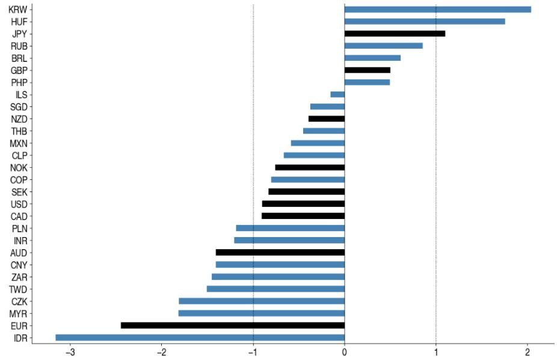

bar

| Entity | Value |
| :--- | :--- |
| KRW | 2.0 |
| HUF | 1.7 |
| JPY | 1.1 |
| RUB | 0.8 |
| BRL | 0.5 |
| GBP | 0.4 |
| PHP | 0.4 |
| ILS | -0.1 |
| SGD | -0.3 |
| NZD | -0.4 |
| THB | -0.5 |
| MXN | -0.6 |
| CLP | -0.7 |
| NOK | -0.8 |
| COP | -0.9 |
| SEK | -0.9 |
| USD | -1.0 |
| CAD | -1.1 |
| PLN | -1.2 |
| INR | -1.3 |
| AUD | -1.5 |
| CNY | -1.6 |
| ZAR | -1.6 |
| TWD | -1.7 |
| CZK | -1.8 |
| MYR | -1.8 |
| EUR | -2.5 |
| IDR | -3.0 |

Source: JPM

# This maps to a +40% USD weight in our economic momentum framework, down from a +100% peak in March

LHS: Net USD weight in our growth momentum framework (based on the balance of growth momentum globally: i.e. downside/upside is USD positive/negative).
RHS: JPM USD trade-weighted index   
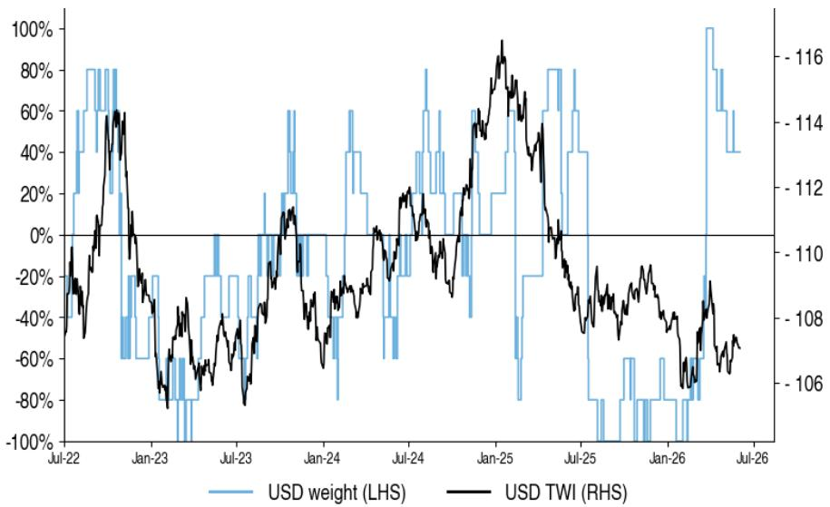

bar_line

| Date   | USD weight (LHS) | USD TWI (RHS) |
|--------|------------------|---------------|
| Jul-22 | ~80%             | ~-108         |
| Jan-23 | ~-60%            | ~-109         |
| Jul-23 | ~-40%            | ~-107         |
| Jan-24 | ~60%             | ~-108         |
| Jul-24 | ~40%             | ~-109         |
| Jan-25 | ~80%             | ~-110         |
| Jul-25 | ~40%             | ~-111         |
| Jan-26 | ~-60%            | ~-108         |
| Jul-26 | ~40%             | ~-109         |

Source: JPM

- The USD weight in our growth strategy has declined towards a more neutral territory at $+40\%$ (down from $+100\%$ peak in March).   
- This strategy allocates a positive (negative) weight to USD if the breadth of global growth momentum screens relatively more negative (positive), in sympathy with the dollar's anti-cyclical properties. We consider levels within the +/- 50% threshold as relatively neutral.   
- 11% of currencies are exhibiting significant positive growth momentum (KRW, HUF & JPY) vs 36% negative (IDR, EUR, MYR, CZK, TWD, ZAR, CNY, AUD, INR, PLN).

# US POLICY CHANNELS FOR FX

# Four primary channels of US policy transmission to FX

Fiscal, trade, foreign policy, and FX policy remain the key policy channels for FX 

<table><tr><td>Policy Channel</td><td>Key Levers</td><td>USD Risk bias</td><td>FX Adjustment Mechanisms</td><td>Authority</td><td>Midterm-Sensitive?</td></tr><tr><td>Fiscal</td><td>Reconciliation 2.0, defense spending</td><td>↓</td><td>Term premium, inflation risk premium, Fed responsiveness</td><td>Congress</td><td>High</td></tr><tr><td>Trade / Tariffs</td><td>Tariff Sections 122/232/301, Tariff Revenue, USMCA</td><td>↔</td><td>Growth (US &amp; RoW), inflation risk, term premium linked to tariff revenues</td><td>Executive (but constrained by courts)</td><td>Low–Medium</td></tr><tr><td>Foreign Policy</td><td>Iran / China esecalation, NATO cohesion</td><td>↑</td><td>ToT/energy supply, risk sentiment, global trade, de-dollarization</td><td>Executive</td><td>Low</td></tr><tr><td>FX Policy</td><td>Rate checks, manipulator reports, FX accords</td><td>↓</td><td>Rhetoric (jawboning, currency manipulator report), rate checks, USD swaps, trade deals</td><td>Executive (Treasury)</td><td>Low</td></tr></table>

Source: JPM

• We revisit four transmission channels from US policy to FX: fiscal, trade, foreign policy, and FX policy.   
- Fiscal: Dollar-negative if deficit widens; USD's negative beta to term premium has risen as fiscal is assessed through deficit and inflation risk premia; Fed response key.   
• Trade: Tariffs have offsetting impacts on USD; targeted bilateral 301 tariffs could prove more USD-positive than universal; lower tariff revenues a downside risk and unwinding tariff uncertainty has weighed on FX vol and supported labor market / sentiment.   
• Trade: Bilateral or trilateral USMCA deal favors MXN over CAD; rolling annual reviews would be negative for both.   
• Foreign: Longer Iran conflict USD+carry positive given lasting ToT benefit; NATO, Greenland, US-China FX impact path dependent.   
• FX Policy: Proactive stance is dollar negative; rate checks, stronger currency manipulator language, and FX accords relevant.

# House poised to flip, but redistricting will make flipping a higher bar

Legal rulings around redistricting have raised Republicans' chances of retaining the House, even though Dems are still presumed to flip   
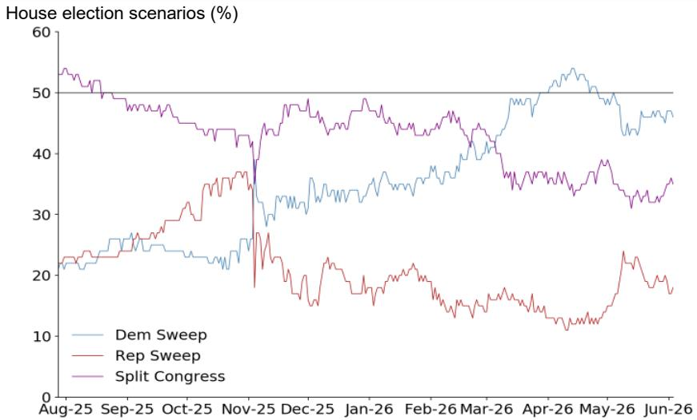

line

| Date    | Dem Sweep | Rep Sweep | Split Congress |
|---------|-----------|-----------|----------------|
| Aug-25  | ~22       | ~23       | ~54            |
| Sep-25  | ~25       | ~24       | ~50            |
| Oct-25  | ~24       | ~27       | ~48            |
| Nov-25  | ~26       | ~37       | ~45            |
| Dec-25  | ~30       | ~20       | ~48            |
| Jan-26  | ~35       | ~18       | ~47            |
| Feb-26  | ~37       | ~19       | ~45            |
| Mar-26  | ~40       | ~17       | ~40            |
| Apr-26  | ~48       | ~13       | ~35            |
| May-26  | ~50       | ~15       | ~38            |
| Jun-26  | ~47       | ~18       | ~35            |

Source: Polymarket, JPM

Legal rulings around redistricting have raised Republicans' chances of retaining the House, even though Dems are still presumed to flip   
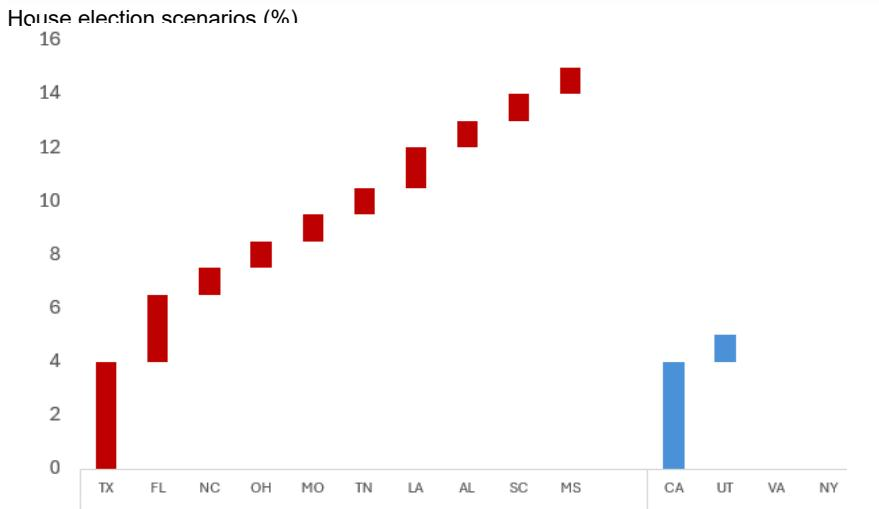

bar

House election scenarios (%)
| State | House election scenario (%) |
| :--- | :--- |
| TX | 4 |
| FL | 6.5 |
| NC | 7.3 |
| OH | 8.2 |
| MO | 9.3 |
| TN | 10.3 |
| LA | 11.9 |
| AL | 12.7 |
| SC | 13.6 |
| MS | 14.7 |
| CA | 4 |
| UT | 4.9 |
| VA | 0 |
| NY | 0 |

The Senate map is advantageous for Republicans this cycle   
Senate (top) and House (bottom) race competitiveness   
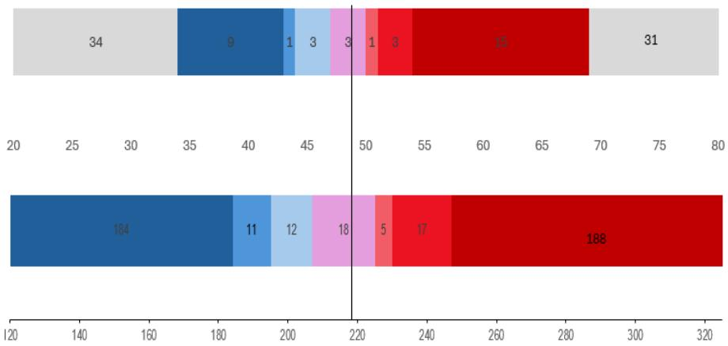

bar_stacked

| Category | Segment 1 | Segment 2 | Segment 3 | Segment 4 | Segment 5 | Segment 6 | Segment 7 |
|---|---|---|---|---|---|---|---|
| Top Left | 34 | 9 | 1 | 3 | 3 | 1 | 3 |
| Top Right | 31 | 0 | 0 | 0 | 0 | 0 | 0 |
| Bottom Left | 184 | 11 | 12 | 18 | 5 | 17 | 188 |
The chart displays a total value of 288, with each segment labeled by its numerical value. The top left section contains values of 34, 0, 34, 0, 34, and 31 respectively; the bottom left section contains values of 184, 11, 12, 18, 5, and 17 respectively; the bottom right section contains values of 188, 0, 34, 0, 34, and 31 respectively. The bars are segmented by color: light blue for the first segment, red for the second, pink for the third, and gray for the fourth. The chart visually compares the relative proportions of each segment within the total value.

Source: Cook Political Report, JPM

- Democrats are still seen as likely to flip the House, but that would likely lead to policy gridlock rather than big policy change.   
- Recent legal and redistricting changes mean the House outcome is less certain than before.   
- Republicans now have a more realistic chance of holding the House, even if Democrats remain the base case.

# Fiscal: Easier fiscal risks weaker USD via higher term premium, but depends on Fed

# USD's (negative) sensitivity to term premium has risen over the last year

Proxy of USD sensitivity to term premium. Rolling 1Y t-stat of USD to long-end ylds (5s30s), controlling for short-end rate differentials. ±2 indicates statistically significant.

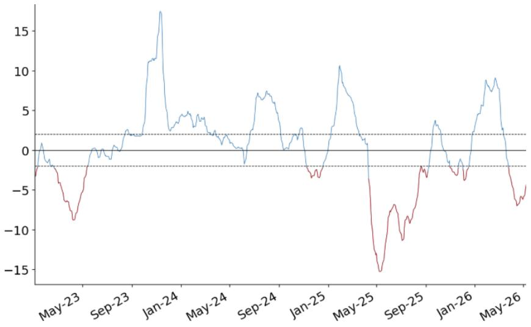

line

| Date   | Series 1 | Series 2 |
|--------|----------|----------|
| May-23 | -3       | -2       |
| Sep-23 | -8       | -1       |
| Jan-24 | 17       | 2        |
| May-24 | 4        | 3        |
| Sep-24 | 7        | 1        |
| Jan-25 | 3        | -3       |
| May-25 | 11       | -15      |
| Sep-25 | -7       | -10      |
| Jan-26 | 4        | -3       |
| May-26 | 9        | -6       |

Source: JPM

# Fed stance matters. USD tends to weaken when term premium is up but the short end is moving lower

Cumulative returns of USD TWI in various term premium scenarios (monthly)   
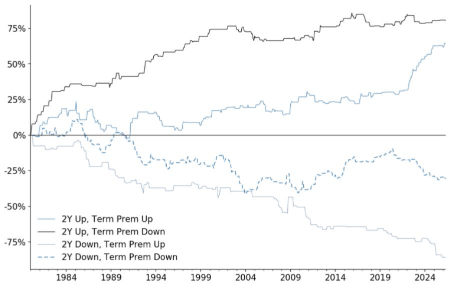

line

| Year | 2Y Up, Term Prem Up | 2Y Up, Term Prem Down | 2Y Down, Term Prem Up | 2Y Down, Term Prem Down |
|------|---------------------|------------------------|------------------------|--------------------------|
| 1984 | ~0%                 | ~30%                   | ~-10%                  | ~-10%                    |
| 1989 | ~-5%                | ~40%                   | ~-25%                  | ~-25%                    |
| 1994 | ~10%                | ~60%                   | ~-30%                  | ~-30%                    |
| 1999 | ~15%                | ~70%                   | ~-35%                  | ~-35%                    |
| 2004 | ~20%                | ~75%                   | ~-40%                  | ~-40%                    |
| 2009 | ~25%                | ~70%                   | ~-45%                  | ~-45%                    |
| 2014 | ~30%                | ~75%                   | ~-50%                  | ~-50%                    |
| 2019 | ~35%                | ~75%                   | ~-55%                  | ~-55%                    |
| 2024 | ~60%                | ~75%                   | ~-75%                  | ~-75%                    |

Source: JPM

• Fiscal is likely dollar-negative if deficits are widening.   
- The dollar's responsiveness to fiscal developments is primarily driven by repricing in term premium and inflation risk premia.   
- The sensitivity of USD to term premia depends on the strength of the Fed’s response.   
• Any additional reconciliation packages are likely dollar negative, particularly if front-loaded and with deferred pay-fors.   
• Any additional fiscal slippage risks reinvigorating fiscal r.v. in G10.

# Trade Policy: Offsetting tariff risks to USD; USMCA more favorable for MXN than CAD

# Broader FX vol has normalized as tariff uncertainty continues to fade

LHS: G7 VXY 3m implied FX vol; RHS: Tariff news story count (1wk rolling sum, 000s)   
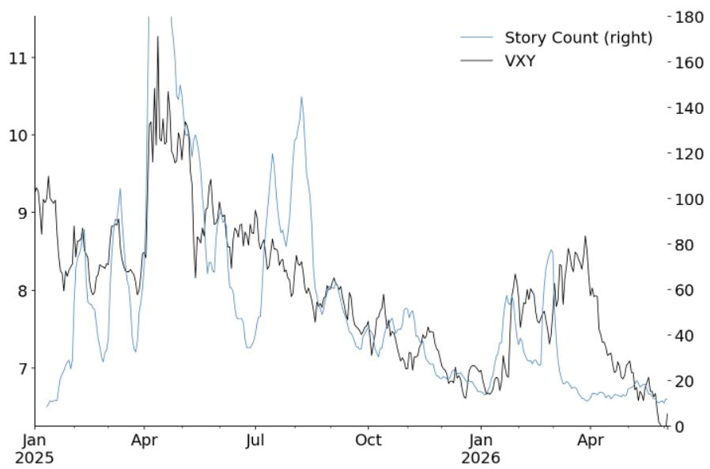

line

| Date       | Story Count (right) | VXY  |
| ---------- | ------------------- | ---- |
| Jan 2025   | ~6.5                | ~9.5 |
| Apr 2025   | ~10.5               | ~10.0|
| Jul 2025   | ~7.5                | ~8.5 |
| Oct 2025   | ~7.0                | ~7.5 |
| Jan 2026   | ~6.5                | ~6.0 |
| Apr 2026   | ~6.0                | ~5.5 |

Source: JPM

# Tariff revenues are about 32% lower than peak flows

Monthly tariff revenue (\$mns) + pos-Liberation Day range   
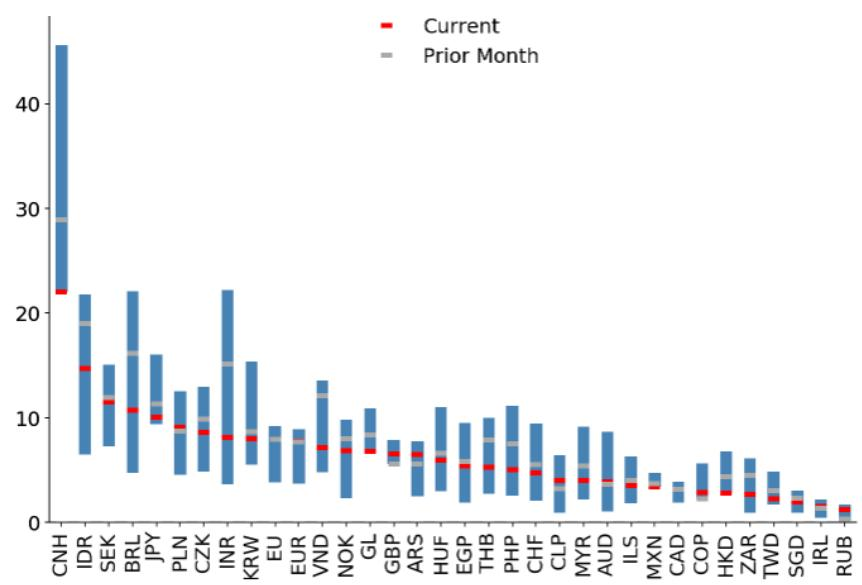

bar

| Country | Current | Prior Month |
| :--- | :--- | :--- |
| CNH | 22 | 29 |
| IDR | 15 | 19 |
| SEK | 11 | 15 |
| BRL | 10 | 16 |
| JPY | 9 | 11 |
| PLN | 9 | 8 |
| CZK | 8 | 9 |
| INR | 7 | 15 |
| KRW | 7 | 15 |
| EU | 4 | 8 |
| EUR | 4 | 8 |
| VND | 7 | 13 |
| NOK | 6 | 8 |
| GL | 6 | 8 |
| GBP | 6 | 6 |
| ARS | 3 | 5 |
| HUF | 5 | 11 |
| EGP | 5 | 9 |
| THB | 5 | 9 |
| PHP | 5 | 11 |
| CHF | 4 | 9 |
| CLP | 2 | 6 |
| MYR | 4 | 9 |
| AUD | 4 | 8 |
| ILS | 3 | 6 |
| MXN | 3 | 4 |
| CAD | 2 | 3 |
| COP | 2 | 5 |
| HKD | 2 | 6 |
| ZAR | 2 | 6 |
| TWD | 2 | 4 |
| SGD | 1 | 2 |
| IRL | 1 | 2 |
| RUB | 1 | 1 |

Source: JPM

• New tariffs unlikely to be as dollar negative as 2025   
- The fading Liberation Day risk premium is still subtly impacting global macro and the dollar   
• But bilateral tariff spats risk being FX-negative   
• Tariff revenue volatility remains a wildcard for USD   
• USMCA remains important for USD stability, with more scenarios positive for MXN than CAD

# Risks towards stronger USD from foreign policy; lower from FX policy

# A USD discount emerged as Greenland tensions heated up and de-dollarization narratives resurfaced

LHS: Story count of ‘Greenland’ (10d rolling). RHS: USD model residual vs wtd 2Y nominal swap spreads (inverted; negative value = USD cheap)   
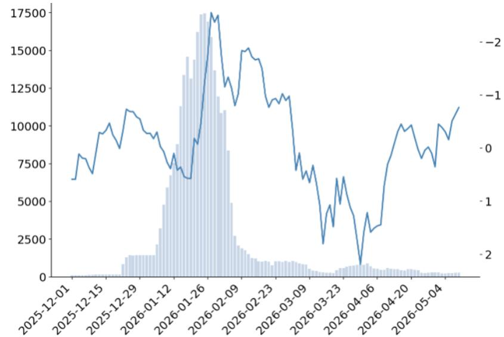

bar_line

| Date       | Bar Value | Line Value |
|------------|-----------|------------|
| 2025-12-01 | 0         | 6500       |
| 2025-12-15 | 0         | 8000       |
| 2025-12-29 | 1000      | 11000      |
| 2026-01-12 | 3000      | 9000       |
| 2026-01-26 | 14000     | 17500      |
| 2026-02-09 | 8000      | 15000      |
| 2026-02-23 | 1500      | 14000      |
| 2026-03-09 | 1000      | 7000       |
| 2026-03-23 | 500       | 3000       |
| 2026-04-06 | 100       | 150        |
| 2026-04-20 | 50        | 100        |
| 2026-05-04 | 20        | 1150       |

Source: JPM

# Relative US equity outperformance often coincides with USD strength

USD TWI = 0.004 + 0.176\*(US-RoW eqs) - 0.233\*(RoW eqs). 3m % chgs.   
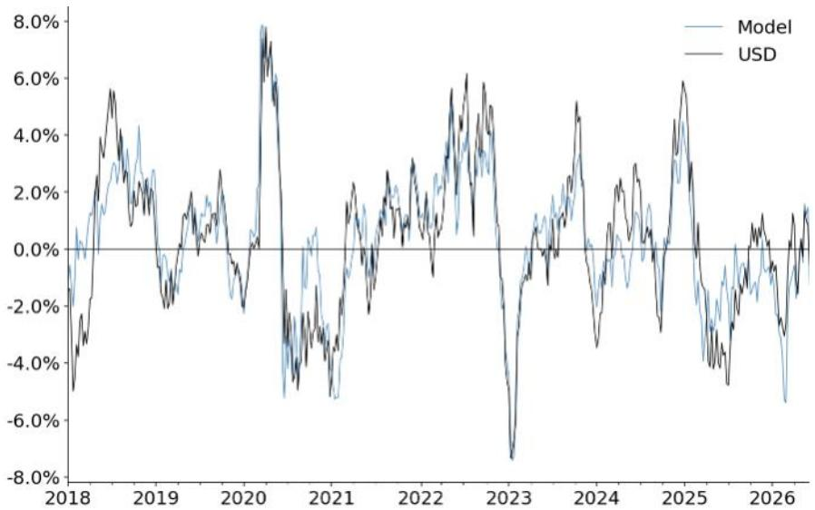

line

| Year | Model  | USD    |
|------|--------|--------|
| 2018 | ~0.5%  | ~-4.5% |
| 2019 | ~2.5%  | ~-2.0% |
| 2020 | ~7.5%  | ~-5.0% |
| 2021 | ~-1.0% | ~-3.0% |
| 2022 | ~3.0%  | ~-1.0% |
| 2023 | ~-7.0% | ~-8.0% |
| 2024 | ~1.0%  | ~-3.0% |
| 2025 | ~6.0%  | ~-4.0% |
| 2026 | ~-5.0% | ~-1.0% |

Source: JPM

• Ongoing conflict in Iran supports USD and FX carry   
• US-China summit offers no grand bargain; uneasy truce to persist   
• EUR-specific risks remain elevated, with regional risks juxtaposed against potential bullish de-dollarization flows   
• FX policy is more active than under past administrations and is likely to remain so

# EUR: Increasing bearish exposure and initiate EUR/USD shorts via options; EUR/USD downgraded for the first time in a year to 1.13-1.15 range in 2H

The terms of trade had already deteriorated for the EU vs. the US; real yield differentials have narrowed as well, reversing their entire move following the German fiscal announcement...

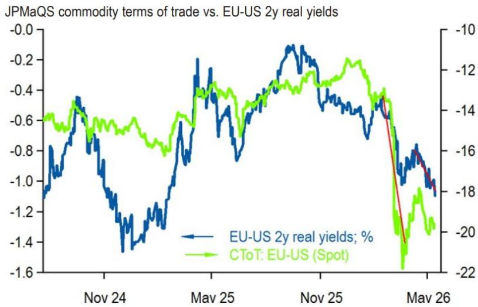

line

| Date   | EU-US 2y real yields; % | CToT: EU-US (Spot) |
|--------|--------------------------|--------------------|
| Nov 24 | -1.0                     | -14.0              |
| May 25 | -0.4                     | -13.0              |
| Nov 25 | -0.2                     | -12.0              |
| May 26 | -1.8                     | -20.0              |

Source: JPM, JPMaQS

...with relative equity returns collapsing as well   
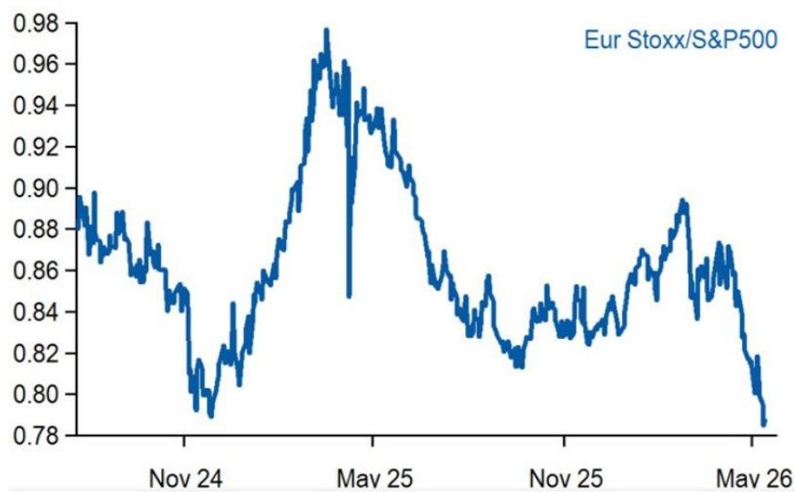

line

| Date   | Value |
|--------|-------|
| Nov 24 | 0.80  |
| May 25 | 0.98  |
| Nov 25 | 0.82  |
| May 26 | 0.78  |

Source: JPM

EUR TEAM score in our fast TEAM model has reached the lowest point since April 2025   
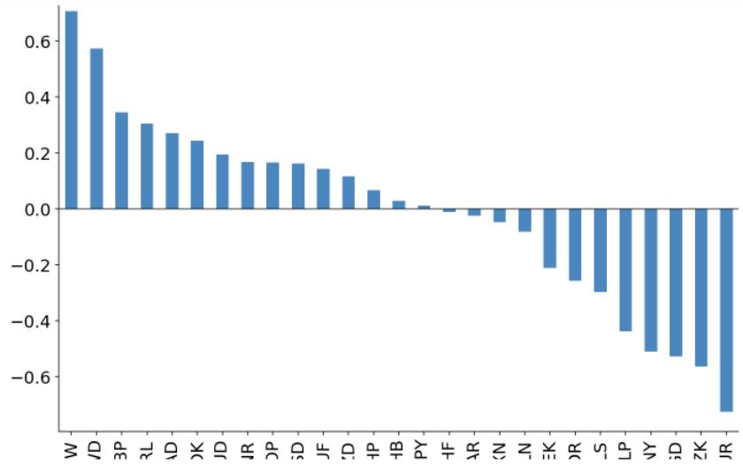

bar

| Category | Value |
|---|---|
| W | 0.7 |
| /D | 0.58 |
| 3P | 0.35 |
| RL | 0.31 |
| AD | 0.27 |
| DK | 0.24 |
| JD | 0.19 |
| JR | 0.17 |
| DP | 0.17 |
| iD | 0.17 |
| JF | 0.14 |
| 'D | 0.12 |
| HP | 0.07 |
| HB | 0.03 |
| PY | 0.01 |
| +F | -0.01 |
| AR | -0.02 |
| KN | -0.05 |
| N | -0.1 |
| EK | -0.22 |
| JR | -0.25 |
| S | -0.3 |
| LP | -0.42 |
| JY | -0.48 |
| jD | -0.5 |
| ZK | -0.55 |
| JR | -0.7 |

We downgraded EUR/USD medium-term targets to 3Q'26 1.15, 1Q'27 1.13. Near-term target at 1.17 unchanged as any resolution between the US and Iran should result in EUR/USD strength, but we expect this to be short-lived.   
- Re-initiate short EUR/USD via a put spread structure to express downside while limiting risk if a US–Iran resolution lifts EUR/USD (+2%); key tail risk is prolonged Strait of Hormuz disruption and potential US oil export controls hurting Eurozone energy importers.   
- EUR ranks worst on our suite of cross-sectional systematic signals.

# EUR/USD: Relative growth and equity flows continue to turn USD supportive again

EUR/USD has generally followed relative momentum of late, which favors USD...

LHS: EUR/USD; RHS: EU-US GDP FRIs. 6m changes  
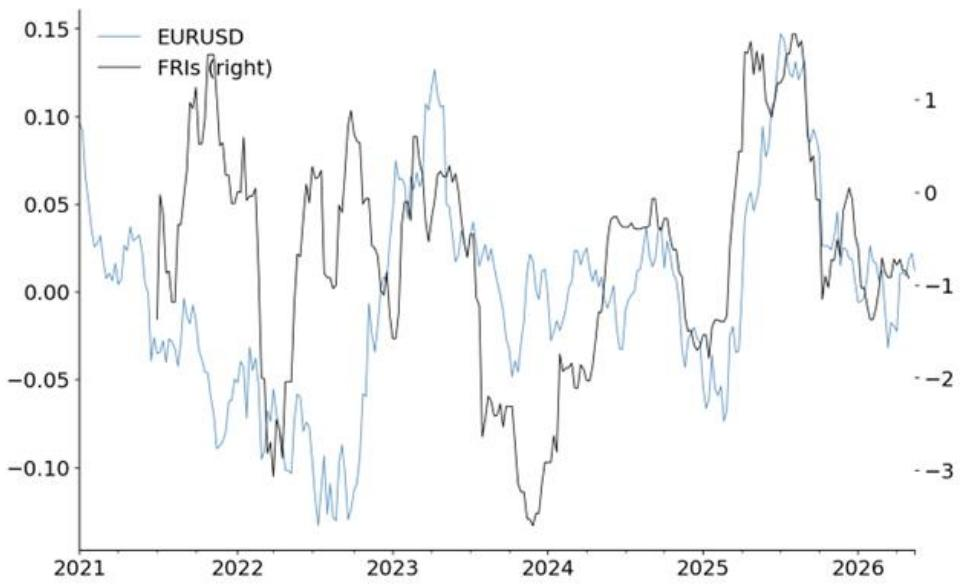

line

| Year | EURUSD | FRIs (right) |
|------|--------|--------------|
| 2021 | 0.10   | 0.10         |
| 2022 | -0.05  | -0.05        |
| 2023 | 0.05   | 0.05         |
| 2024 | -0.10  | -0.10        |
| 2025 | 0.05   | 0.05         |
| 2026 | -0.10  | -0.10        |

Source: JPM

...and equity flow

Proxy for EU-US portfolio flow. 3m rolling ETF equity inflows (z-score)   
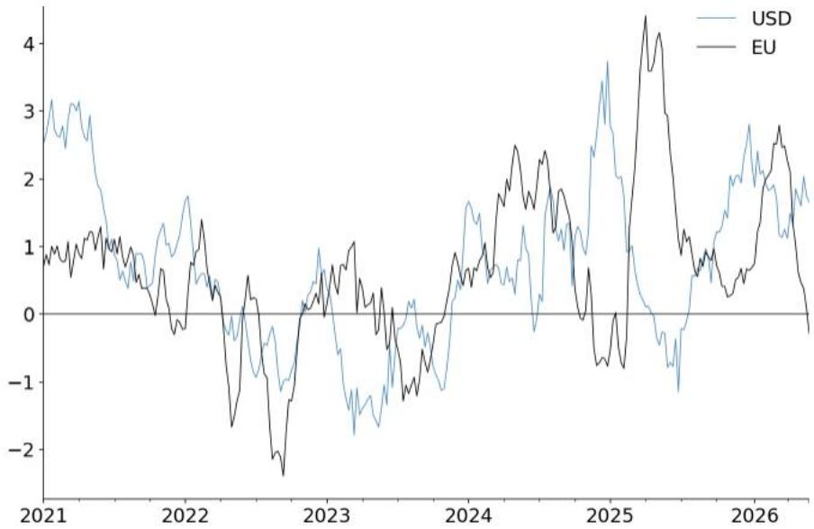

line

| Year | USD  | EU   |
|------|------|------|
| 2021 | 3.0  | 1.0  |
| 2022 | 1.5  | -0.5 |
| 2023 | -1.0 | -2.0 |
| 2024 | 1.0  | 0.5  |
| 2025 | 3.5  | 4.0  |
| 2026 | 2.0  | 2.5  |

Source: JPM

• EUR/USD has generally followed relative momentum of late, which favors USD.   
- US equity outperformance has delivered a nascent boost to USD, with portfolio flows directionally diverging to once again favor USD demand.   
- Weakness in EUR is now looking entrenched – not just tactical.

# GBP: Neutral. Politics overshadows carry, growth, but looking for constrained GBP weakness given multi-month leadership contest timeline

Macro scenarios including political outcomes range from >0.89 to 0.85   

other

GBP weakness
GBP strength
GBP weakness
GBP strength
GBP strength
GBP strength
GBP strength
GBP strength
GBP strength
GBP strength
GBP strength
GBP strength
GBP strength
GBP strength
GBP strength
GBP strength
GBP strength
GBP strength
GBP strength
GBP strength
GBP strength
GBP strength
GBP strength
GBP strength
GBP strength
GBP strength
GBP strength
GBP strength
GBP strength
GBP strength
GBP strength
GBP strength
GBP strength
GBP strength
GBP strength
GBP strength
GBP strength

Source: JPM

Markets are not currently priced to adverse fiscal outcomes   
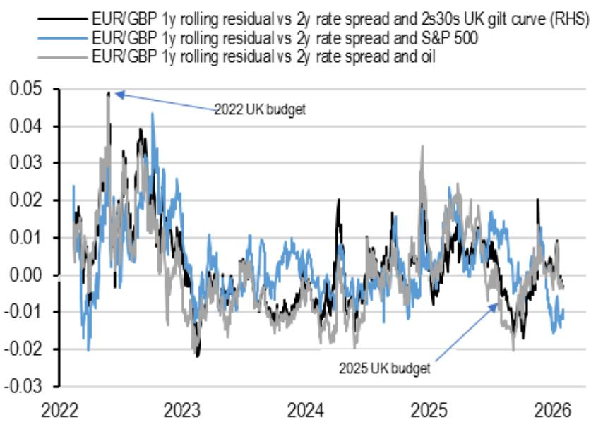

line

| Year | EUR/GBP 1y rolling residual vs 2y rate spread and 2s30s UK gilt curve (RHS) | EUR/GBP 1y rolling residual vs 2y rate spread and S&P 500 | EUR/GBP 1y rolling residual vs 2y rate spread and oil |
|------|----------------------------------------------------------------------------------|-----------------------------------------------------|-----------------------------------------------------|
| 2022 | ~0.015                                                                           | ~0.025                                              | ~0.01                                               |
| 2023 | ~-0.025                                                                          | ~-0.01                                              | ~-0.015                                             |
| 2024 | ~-0.01           | ~-0.005                                             | ~-0.01                                              |
| 2025 | ~-0.025                                                                          | ~-0.01                                              | ~-0.015                                             |
| 2026 | ~-0.015                                                                          | ~-0.01                                              | ~-0.01                                              |

Source: JPM

- Politics will dominate GBP price action, skewing risk bearishly in the near-term, but look for this weakness to be contained with limited runway   
- The balance between UK political risk vs growth/ carry prospects will be key for sterling   
- The key transmission mechanisms are (1) the term premium channel as Labour shifts to the left and (2) business confidence impact from increased and prolonged political uncertainty

# CHF: Bearish; Short vs NOK but EUR/CHF flat at 0.91 due to low carry vs franc-supportive forces still in play (reserve alternative demand, fiscal differentiation, BOP, repatriation, PPP)

EUR/CHF has tended to co-move with the copper/gold ratio, and this suggests the pair should be higher... but European growth has been continuously revised down since the start of the conflict, which is a drag for EUR/CHF

EUR/CHF vs copper/gold ratio   
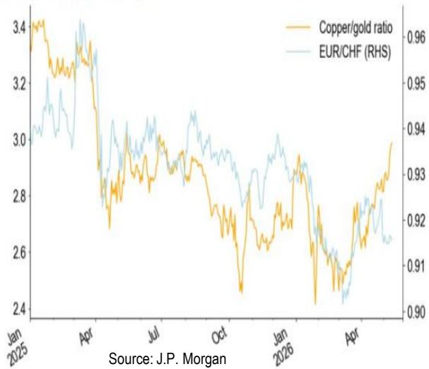

line

| Date   | Copper/gold ratio | EUR/CHF (RHS) |
|--------|-------------------|---------------|
| Jan 2025 | 3.4               | 0.96          |
| Apr    | 3.0               | 0.94          |
| Jul    | 2.8               | 0.93          |
| Oct    | 2.5               | 0.92          |
| Jan 2026 | 2.7               | 0.91          |
| Apr    | 3.0               | 0.90          |

EUR/CHF vs JPM Economics growth forecast revision index   
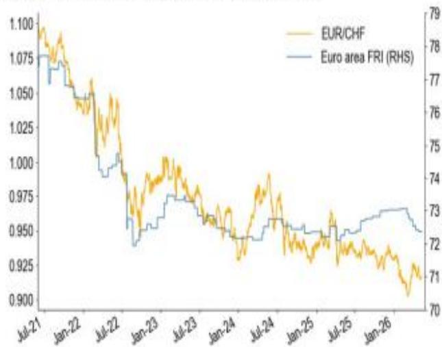

line

| Date   | EUR/CHF | Euro area FRI (RHS) |
|--------|---------|---------------------|
| Jul-21 | 1.100   | 78                  |
| Jan-22 | 1.050   | 77                  |
| Jul-22 | 1.000   | 74                  |
| Jan-23 | 0.950   | 73                  |
| Jul-23 | 0.975   | 72                  |
| Jan-24 | 0.950   | 72                  |
| Jul-24 | 0.975   | 73                  |
| Jan-25 | 0.950   | 73                  |
| Jul-25 | 0.975   | 73                  |
| Jan-26 | 0.950   | 72                  |

Our FX intervention proxies suggest SNB sold CHF in March but not since; they are thus reactive rather than proactive and not offsetting positive BoP flow over time

Official quarterly SNB FX transactions (up to 4Q'25) and our monthly intervention proxies as quarterly sums (up to 4Q'25; then monthly for 2026 with proxy (1) latest value in May; proxy (2) Apr)

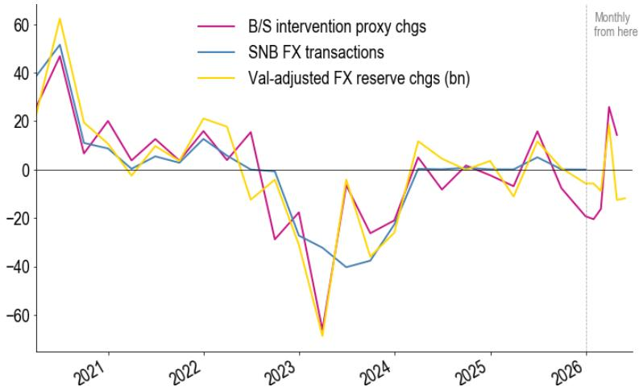

line

| Year | B/S intervention proxy chgs | SNB FX transactions | Val-adjusted FX reserve chgs (bn) |
|------|-----------------------------|---------------------|-----------------------------------|
| 2021 | ~50                         | ~40                 | ~60                               |
| 2022 | ~15                         | ~10                 | ~20                               |
| 2023 | ~-30                        | ~-20                | ~-70                              |
| 2024 | ~-20                        | ~-40                | ~-30                              |
| 2025 | ~0                          | ~0                  | ~0                                |
| 2026 | ~-20                        | ~0                  | ~-10                              |

Source: JPM

New trend to track: net CHF bond issuance by non-resident borrowers has turned meaningfully positive for first time post-GFC   
Net CHF bond issuance by non-resident borrowers on Swiss capital markets (issuance less redemptions; CHF bn, quarterly, rolling 4Q average to 1Q'25; SNB Capital Market Data)   
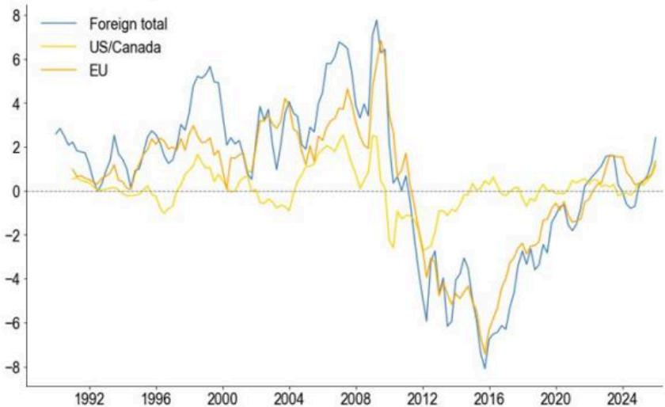

line

| Year | Foreign total | US/Canada | EU |
|------|---------------|-----------|----|
| 1992 | 3.0           | 0.5       | 0.8 |
| 1996 | 2.5           | 0.3       | 1.2 |
| 2000 | 5.5           | 1.0       | 2.0 |
| 2004 | 4.0           | 1.5       | 3.0 |
| 2008 | 7.5           | 4.0       | 5.0 |
| 2012 | -6.0          | -2.0      | -3.0 |
| 2016 | -8.0          | -4.0      | -5.0 |
| 2020 | -2.0          | 0.0       | -1.0 |
| 2024 | 2.0           | 1.0       | 1.5 |

- Cross-currents: Expect carry-trades to do well but structural supports (alt reserve demand, fiscal risks, repatriation focus, BoP dynamics, PPP) cap EUR/CHF upside   
- Relative to cyclical proxies and reserve asset dynamics (copper/gold ratio), CHF looks rich...   
• ...but weaker Euro area growth is EUR/CHF-bearish   
- Intervention proxies suggest SNB sold CHF in March but not April. SNB is reactive; intervening to smooth sharp moves but otherwise allowing CHF grind stronger   
• New drag: return of cross-border CHF debt issuance

# SEK: Bearish; low carry, domestic and equity headwinds; raise EUR/SEK forecast profile 2Q, 4Q 10.80 (10.50) and use as carry funder (long NOK/SEK)

Swedish core inflation missed expectations for the 6th time in a row, and is well-below where Riksbank and our economists were expecting it to be even back in late March   
Core CPIF (ex-energy); historical vs Riksbank and JPM Economics forecasts from week of Riksbank march meeting   
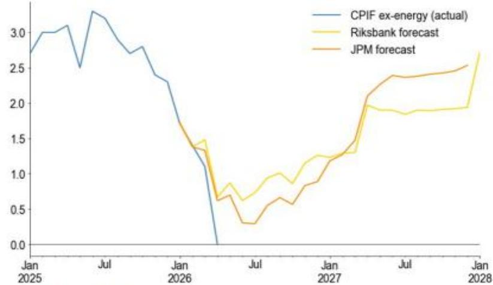

line

| Date       | CPIF ex-energy (actual) | Riksbank forecast | JPM forecast |
| ---------- | ------------------------ | ------------------ | ------------ |
| Jan 2025   | ~2.8                     | ~2.8               | ~2.8         |
| Jul 2025   | ~3.1                     | ~3.1               | ~3.1         |
| Jan 2026   | ~1.4                     | ~1.4               | ~1.4         |
| Jul 2026   | ~0.0                     | ~0.7               | ~0.3         |
| Jan 2027   | ~1.3                     | ~1.3               | ~1.3         |
| Jul 2027   | ~1.9                     | ~1.9               | ~2.4         |
| Jan 2028   | ~2.6                     | ~2.6               | ~2.6         |

Source: Riksbank, JPM

Relative equity returns have mattered for SEK and have moved against it   
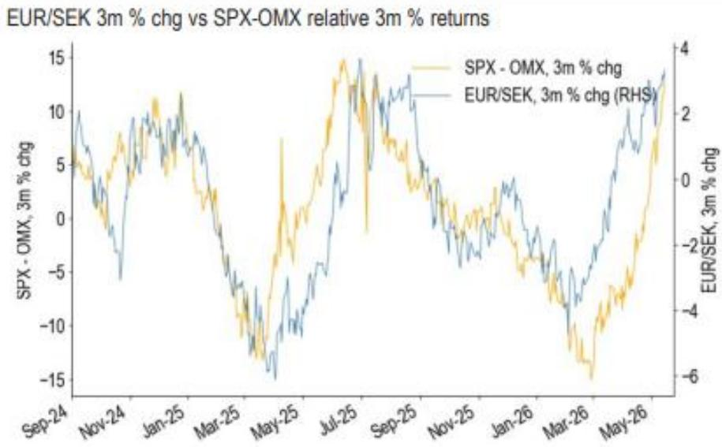

line

| Date   | SPX - OMX, 3m % chg | EUR/SEK, 3m % chg |
|--------|---------------------|-------------------|
| Sep-24 | ~5                  | ~0                |
| Nov-24 | ~10                 | ~2                |
| Jan-25 | ~12                 | ~0                |
| Mar-25 | ~-10                | ~-4               |
| May-25 | ~-15                | ~-6               |
| Jul-25 | ~15                 | ~2                |
| Sep-25 | ~10                 | ~0                |
| Nov-25 | ~0                  | ~-2               |
| Jan-26 | ~-5                 | ~-4               |
| Mar-26 | ~-10                | ~-6               |
| May-26 | ~10                 | ~2                |

Source: Bloomberg L.P., JPM

• Equity momentum convincingly against SEK; global yields, energy prices to continue weighing on low-yielding importers   
• Inflation, growth frequently missing expectations this year   
- Former supports - regional/domestic growth, fiscal dynamics, pro-cyclical global backdrop, equity rotation into Sweden – now less than early 2026   
- Eg: Swedes net sold US equities in size and bought domestic from '25 to early '26. Now reverting to global equity buying   
- SE inflation momentum lowest among G10, anchoring carry-funder dynamics

... contributing to an interruption in 1Q's retail equity repatriation   
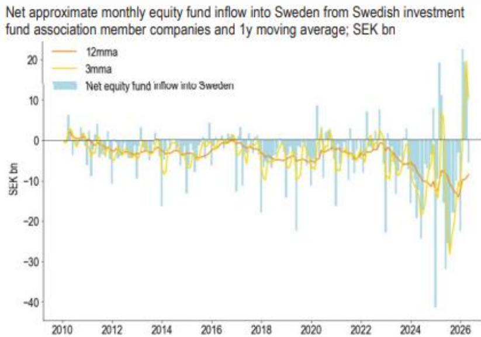

line

| Year | 12mma | 3mma | Net equity fund inflow into Sweden |
|------|-------|------|-----------------------------------|
| 2010 | ~0    | ~0   | ~0                                |
| 2012 | ~-5   | ~-5  | ~-5                               |
| 2014 | ~-5   | ~-5  | ~-5                               |
| 2016 | ~-5   | ~-5  | ~-5                               |
| 2018 | ~-5   | ~-5  | ~-5                               |
| 2020 | ~-5   | ~-5  | ~-5                               |
| 2022 | ~-5   | ~-5  | ~-5                               |
| 2024 | ~-10  | ~-10 | ~-10                              |
| 2026 | ~-15  | ~-15 | ~-15                              |

Source: Swedish investment fund association, JPM

# NOK: Long vs SEK, CHF, JPY & upgraded on hawkish CB, terms of trade, carry environment. EUR/NOK profile lowered to 4Q 10.50 (10.85)

# Most of the move down in EUR/NOK has been in line with fair value

EUR/NOK vs in-sample fair value estimate based on 2y rate differential, Brent front contract, VIX   
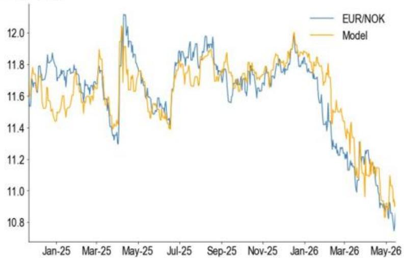

line

| Date   | EUR/NOK | Model |
|--------|---------|-------|
| Jan-25 | 11.7    | 11.7  |
| Mar-25 | 11.6    | 11.6  |
| May-25 | 12.1    | 12.0  |
| Jul-25 | 11.4    | 11.4  |
| Sep-25 | 11.9    | 11.8  |
| Nov-25 | 11.7    | 11.7  |
| Jan-26 | 11.9    | 11.9  |
| Mar-26 | 11.3    | 11.3  |
| May-26 | 10.8    | 10.8  |

Source: JPM, Bloomberg L.P.

NOK/SEK trades rich to 0.99 fair value but has shown less sensitivity to the energy price drawdown, suggesting carry flows may be more influential   
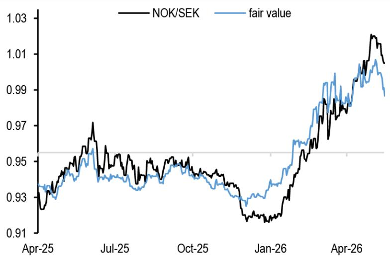

line

| Date   | NOK/SEK | fair value |
|--------|---------|------------|
| Apr-25 | 0.93    | 0.93       |
| Jul-25 | 0.97    | 0.94       |
| Oct-25 | 0.95    | 0.94       |
| Jan-26 | 0.93    | 0.93       |
| Apr-26 | 1.03    | 0.99       |

Norges Bank FX purchases are likely to pick up, though not to 2022 levels given lower gas prices. Equity outflows are continuing beyond that too though   
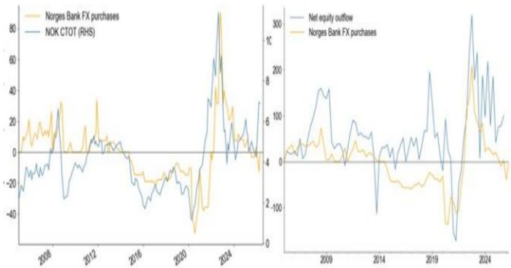

line

| Year | Norges Bank FX purchases | NOK CTOT (RHS) |
|------|--------------------------|----------------|
| 2008 | ~15                      | ~-20           |
| 2012 | ~35                      | ~10            |
| 2016 | ~-10                     | ~-30           |
| 2020 | ~-40                     | ~-50           |
| 2024 | ~85                      | ~30            |

- Beneficiary of carry and ToT; latest hike reinforces NOK's position as a G10 high-yielder   
- Domestic wages and inflation still warrant elevated policy rates and front-loaded policy action   
- Carry is at historical highs vs EUR & SEK, and is above USD   
- The collapse in EUR/NOK has largely tracked FV, which is around 11.00. 10.50 would require \$100 brent and +50bps in rate spreads   
- But still has BoP constraints. Equity outflow pace has slowed but net outflows continue. Norges Bank FX purchases likely to pick up as oil revs rise, though not to '22 levels given lower gas prices

# CAD: Short vs USD & MXN. Optimism around a turn in the CA cycle looks premature; BoC market pricing aggressive. USD/CAD 2Q 1.37, 4Q 1.39.

The 6mma of monthly changes in CA employment growth is still negative even after the May data   
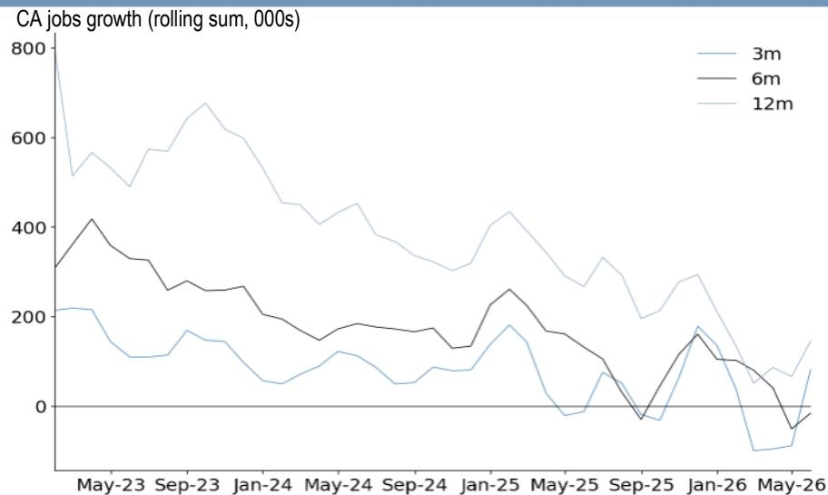

line

| Date    | 3m   | 6m   | 12m  |
|---------|------|------|------|
| May-23  | 220  | 420  | 780  |
| Sep-23  | 180  | 350  | 680  |
| Jan-24  | 150  | 280  | 600  |
| May-24  | 120  | 200  | 450  |
| Sep-24  | 100  | 180  | 400  |
| Jan-25  | 180  | 250  | 450  |
| May-25  | 150  | 150  | 350  |
| Sep-25  | -50  | -50  | 200  |
| Jan-26  | 180  | 150  | 300  |
| May-26  | -100 | -50  | 150  |

Source: JPM

CAD looks cheap given more divergence in US-CA cyclicals   
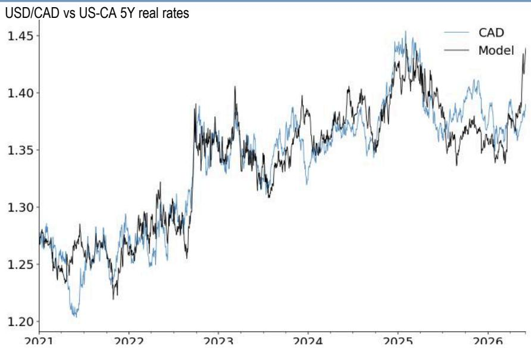

line

| Year | CAD   | Model |
|------|-------|-------|
| 2021 | 1.28  | 1.27  |
| 2022 | 1.29  | 1.28  |
| 2023 | 1.38  | 1.37  |
| 2024 | 1.36  | 1.35  |
| 2025 | 1.45  | 1.44  |
| 2026 | 1.39  | 1.38  |

# We now see increased odds of annual USMCA reviews, warranting a higher probability-weighted CAD discount than before

Scenario analysis around USMCA renegotiations 

<table><tr><td>Scenario</td><td>Description</td><td>Key Risks for CAD</td><td>Likelihood</td><td>CAD FX</td></tr><tr><td>Renewal - Minor Changes</td><td>Agreement extended to 2042 with potential updates.</td><td>Growth-positive; reduces cyclical uncertainty &amp; boosts investment. CAD deprices USMCA-related risk premium</td><td>Low</td><td>3%</td></tr><tr><td>Renewal - Major Changes</td><td>MX, CA make concessions to reduce tariffs, extend USMCA.</td><td>Fractious negotiations that creates modest CAD risk premium, but eventual USMCA renewal ultimately cyclically supportive</td><td>Highest</td><td>1%</td></tr><tr><td>Annual Reviews</td><td>No deal is reached in 2026; yearly reviews begin.</td><td>Limited progress and no deal keep residual risk premium alongside growth-negative investment, hiring, export uncertainty</td><td>Moderate-High</td><td>-2%</td></tr><tr><td>Bilateral Agreements</td><td>No consensus to extend, members pivot to bilateral agreements.</td><td>More fragmented trade environment, elevated uncertainty remains high. Hurts potential, competitiveness. Favors US over CA</td><td>Moderate</td><td>-4%</td></tr><tr><td>Early Withdrawal</td><td>One country exits via withdrawal clause (Art. 34.6).</td><td>Trade and supply chain shocks; growth hit, BoC cuts and risk preium in CAD</td><td>Lowest</td><td>-6%</td></tr></table>

Probability-Weighted CAD Discount:   
-1% to -1.5%

# See original table here

Source: JPM

- CAD remains under pressure from ongoing structural decoupling with the US, resulting in cyclical frictions like soft labor market outturns   
- USMCA uncertainty likely keeps investment and hiring intentions muted...   
- …keeping BoC cautious and making the priced hike this year look to aggressive   
- With low carry and a soft cyclical backdrop, CAD can remain a funder   
• USD/CAD is cheap vs real-rates fair value

Cross-market rate spreads have narrowed and are now a headwind for the exchange rate   
lhs: bps; rhs: AUD/USD   
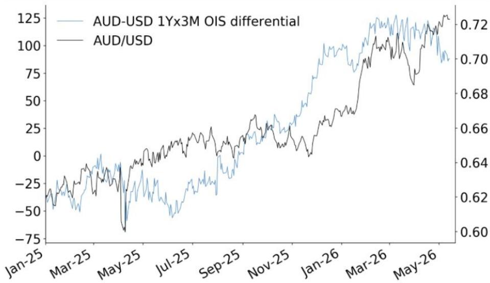

line

| Date   | AUD-USD 1Yx3M OIS differential | AUD/USD |
|--------|----------------------------------|---------|
| Jan-25 | -40                              | 0.62    |
| Mar-25 | -20                              | 0.64    |
| May-25 | -60                              | 0.60    |
| Jul-25 | -40                              | 0.64    |
| Sep-25 | -20                              | 0.66    |
| Nov-25 | 0                                | 0.68    |
| Jan-26 | 40                               | 0.70    |
| Mar-26 | 80                               | 0.72    |
| May-26 | 120                              | 0.72    |

Source: Bloomberg Finance L.P., JPM.

Australian investment into non-US equity markets exceeded those into the US for the first time since 2019   
A\$ billion, net transactions   
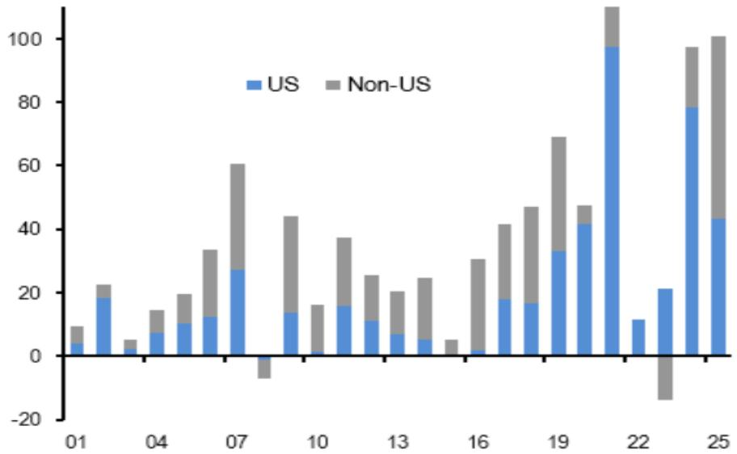

bar_stacked

| Month | US  | Non-US |
|-------|-----|--------|
| 01    | 4   | 8      |
| 02    | 19  | 6      |
| 03    | 2   | 4      |
| 04    | 7   | 10     |
| 05    | 10  | 12     |
| 06    | 12  | 18     |
| 07    | 27  | 28     |
| 08    | -5  | -10    |
| 09    | 14  | 33     |
| 10    | 2   | 16     |
| 11    | 16  | 24     |
| 12    | 11  | 18     |
| 13    | 6   | 18     |
| 14    | 5   | 24     |
| 15    | 2   | 5      |
| 16    | 18  | 24     |
| 17    | 17  | 28     |
| 18    | 33  | 33     |
| 19    | 41  | 33     |
| 20    | 97  | 7      |
| 21    | 12  | -15    |
| 22    | 21  | -5     |
| 23    | 78  | 28     |
| 24    | 43  | 38     |
| 25    | -   | -      |

Source: ABS, JPM.

- AUD/USD near multi-year highs on RBA hiking-cycle support and strong commodities (iron ore/coal/LNG). These factors are expected to fade in 2H26, but carry and pension fund hedging behaviour should keep a higher floor.   
- Maintain forecast for AUD/USD to drift modestly higher into mid-year (June-26: 0.73) before a reversal in 2H. Our Mar-27 target is 0.69.   
- Widening rate spreads have been a key FX support since late-last year, but that dynamic has now run its course with forward spreads tightening. RBA tone has shifted to more neutral/data-dependent, which historically signals stability; the Hawk Dove Score should shift lower from a 2026 G10 outlier.   
Australian investors rotated toward non-US equities (Japan/UK/Europe) in 2025, consistent with de-dollarization rather than routine rebalancing. Australia's superannuation funds with rapid FUM growth require managers to invest offshore to meet diversification and liquidity requirements. That structural shift increases FX exposure and should drive a gradual rise in hedging ratios from low levels.

# NZD has performed only against low-yielding G10 and remains somewhat cheap to global macro factors

Residuals of NZD crosses (%)   
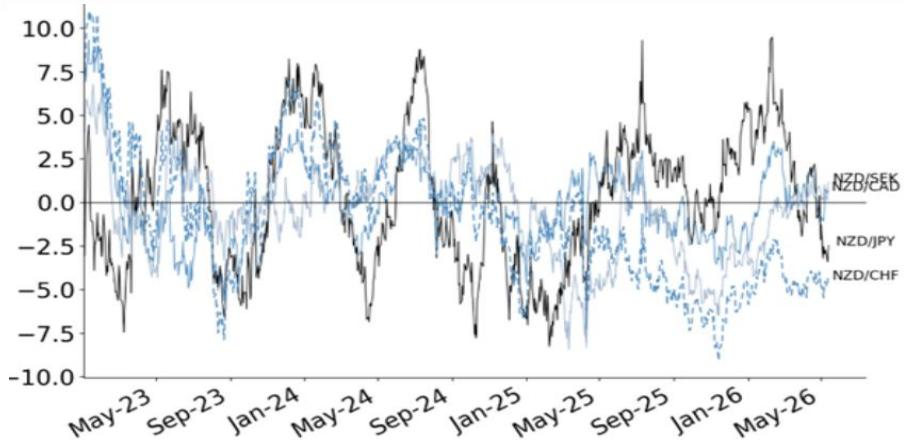

line

| Date    | NZD/SEK | NZD/JPY | NZD/CHF |
|---------|---------|---------|---------|
| May-23  | ~10.0   | ~7.5    | ~5.0    |
| Sep-23  | ~5.0    | ~2.5    | ~0.0    |
| Jan-24  | ~8.0    | ~5.0    | ~2.5    |
| May-24  | ~0.0    | ~-2.5   | ~-5.0   |
| Sep-24  | ~9.0    | ~5.0    | ~2.5    |
| Jan-25  | ~-5.0   | ~-2.5   | ~-5.0   |
| May-25  | ~-2.5   | ~-5.0   | ~-10.0  |
| Sep-25  | ~8.0    | ~5.0    | ~2.5    |
| Jan-26  | ~-5.0   | ~-10.0  | ~-15.0  |
| May-26  | ~10.0   | ~7.5    | ~5.0    |

Note: From fits of NZD/CCY on a constant, JPM commodity index, US GDP FRI, USD 1Yx3M OIS and 3m lags.
Source: Bloomberg Finance L.P., JPM

# NZD is usually highest beta to both global growth and the common factor in the level of G10 inflation

X axis: G10 FX/USD beta to PC1 of JPM's G10 inflation fcst; Y axis: Beta to JPM's global GDP forecast

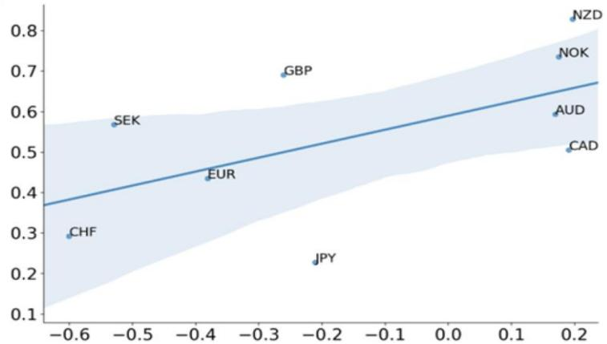

scatter

| Currency | X     | Y     |
|----------|-------|-------|
| CHF      | -0.6  | 0.3   |
| SEK      | -0.5  | 0.58  |
| EUR      | -0.4  | 0.45  |
| GBP      | -0.3  | 0.7   |
| JPY      | -0.2  | 0.25  |
| NZD      | 0.2   | 0.85  |
| NOK      | 0.2   | 0.75  |
| AUD      | 0.2   | 0.6   |
| CAD      | 0.2   | 0.5   |

Note: Individual regressions of FX/USD on a constant, global GDP FHI (forecast), PC1 and PC2 of country CPI FHI (forecasts), and variance of inflation forecast revisions (last 3m, across currencies). Daily data since 2014.   
Source: Bloomberg Finance L.P., JPM

- NZD/USD near 12-month highs, just below pre-Iran conflict levels. We expect further upside as NZ activity/housing recover and the RBNZ begins a full hiking cycle in 3Q26. We maintain a Sep-26 target for NZD/USD of 0.62, and Mar-27 target of 0.61. Global supply shocks remain the central risk factor that could derail further recovery, given NZ's fuel import-dependence.   
In the recent USD selloff, NZD has only outperformed vs low-yield G10 (JPY, SEK, CAD, CHF) and still screens somewhat cheap vs this basket on top-down factors—highlighting the market's carry focus and doubts on NZ's recovery/rate-spread improvement.   
Over multiple cycles, NZD has tended to outperform when global growth is firm and the common factor in country inflation forecasts is elevated. NZD is unusually low-yielding, so delivery of policy normalization matters more. If Iran de-escalates / oil falls, NZ's normalization case remains, while those who have priced hikes due to inflation should see rate pricing fade in relative terms.

# BoJ behind the curve remains a persistent USD/JPY support

USD/JPY vs Japan 2Y1Y-1Y1Y curve shape   
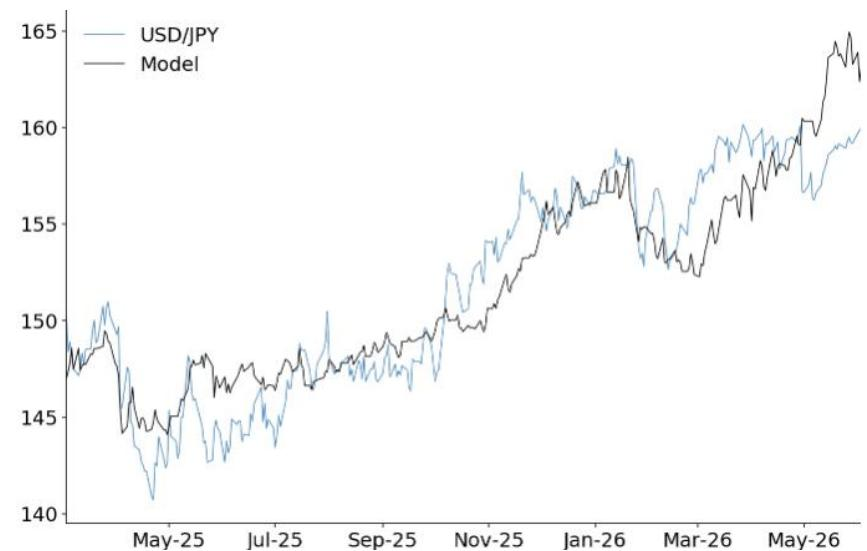

line

| Date   | USD/JPY | Model |
|--------|---------|-------|
| May-25 | 148.0   | 149.0 |
| Jul-25 | 143.0   | 147.0 |
| Sep-25 | 147.0   | 148.0 |
| Nov-25 | 153.0   | 152.0 |
| Jan-26 | 158.0   | 157.0 |
| Mar-26 | 159.0   | 158.0 |
| May-26 | 160.0   | 164.0 |

Source: JPM

# USD/JPY and DXY; USD/JPY decline following MoF intervention was mainly driven by broad USD weakness, not by interventions

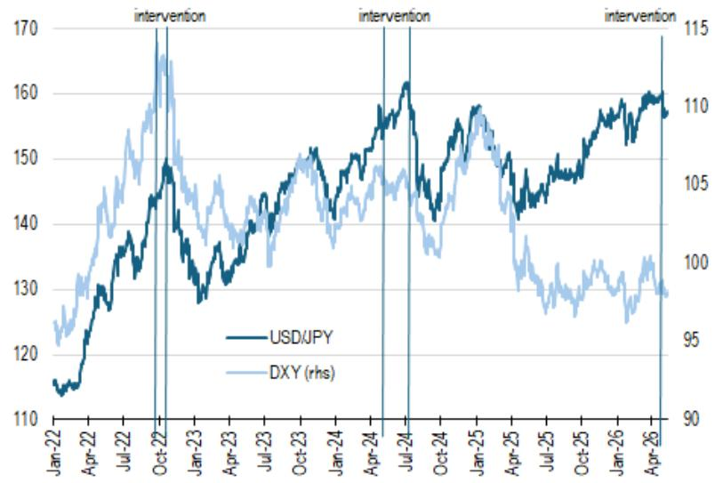

line

| Date    | USD/JPY | DXY (rhs) |
|---------|---------|-----------|
| Jan-22  | 115     | 100       |
| Apr-22  | 130     | 105       |
| Jul-22  | 145     | 110       |
| Oct-22  | 150     | 115       |
| Jan-23  | 130     | 105       |
| Apr-23  | 140     | 100       |
| Jul-23  | 150     | 105       |
| Oct-23  | 145     | 100       |
| Jan-24  | 155     | 105       |
| Apr-24  | 160     | 110       |
| Jul-24  | 150     | 105       |
| Oct-24  | 140     | 100       |
| Jan-25  | 155     | 105       |
| Apr-25  | 145     | 100       |
| Jul-25  | 150     | 95        |
| Oct-25  | 155     | 98        |
| Jan-26  | 160     | 100       |
| Apr-26  | 165     | 105       |

Source: JPM, Bloomberg Finance L.P.

- Our medium- to long-term USD/JPY target already assumed intervention prior to the JPY 162 cycle high; Intervention concerns may cap USD/JPY for a while, but we expect it to eventually break out of its range and move higher; our targets remain 158 in 2Q26, 160 in 3Q26, and 164 in 4Q26.   
USD/JPY has trended higher as Japan's money market curve has steepened, ostensibly reflecting behind-the-curve dynamics   
- The global monetary policy cycle remains unfavorable for JPY, and the Takaichi administration's policy mix heightens risks of elevated inflation and further depreciation. Elevated oil prices reinforce our medium- to long-term bearish outlook.   
In the 2022 and 2024 episodes, the authorities did not try to defend any specific level. This can be seen as consistent with G7 FX commitments, but more fundamentally it simply underscores that, for a currency like the yen—freely traded under a floating regime and with a large market—intervention has difficulty stopping or reversing an underlying trend driven by fundamentals.

Misalignment in USD/CNH vs. rate fundamentals   
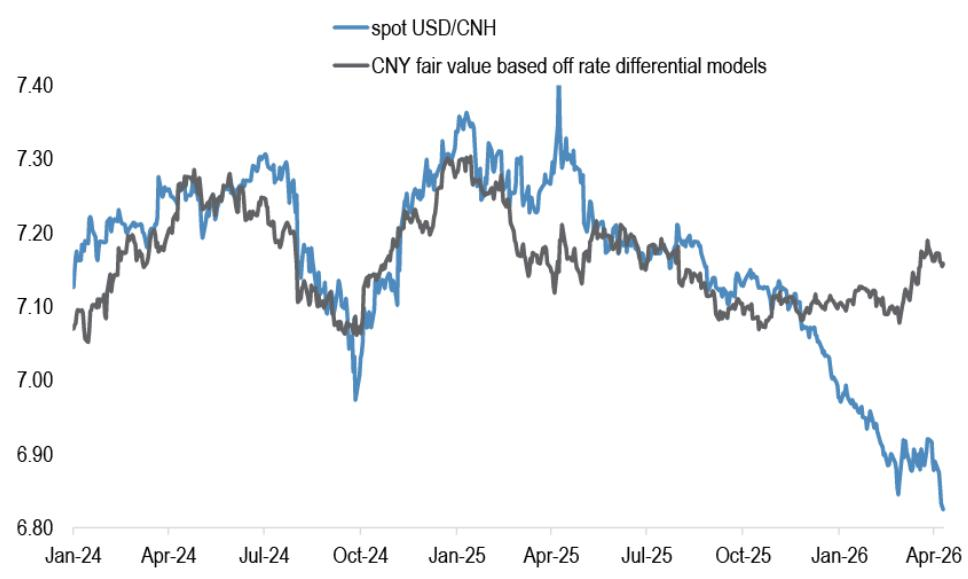

line

| Date   | spot USD/CNH | CNY fair value based off rate differential models |
|--------|-------------|--------------------------------------------------|
| Jan-24 | ~7.15       | ~7.10                                            |
| Apr-24 | ~7.25       | ~7.20                                            |
| Jul-24 | ~7.30       | ~7.25                                            |
| Oct-24 | ~7.00       | ~7.10                                            |
| Jan-25 | ~7.35       | ~7.25                                            |
| Apr-25 | ~7.40       | ~7.20                                            |
| Jul-25 | ~7.20       | ~7.15                                            |
| Oct-25 | ~7.10       | ~7.10                                            |
| Jan-26 | ~6.95       | ~7.10                                            |
| Apr-26 | ~6.85       | ~7.15                                            |

Source for both: Bloomberg Finance L.P., JPM

# CNY fixing bias

Strengthening bias measured as the difference between actual fixings and JPM model estimates derived from overnight basket currency performance only.

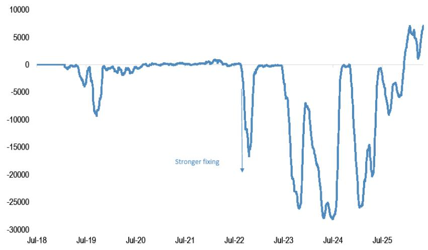

line

| Date   | Value  |
|--------|--------|
| Jul-18 | 0      |
| Jul-19 | -1000  |
| Jul-20 | 0      |
| Jul-21 | 0      |
| Jul-22 | -20000 |
| Jul-23 | -25000 |
| Jul-24 | -28000 |
| Jul-25 | 7000   |

Source: Bloomberg Finance L.P., JPM.

- Historically, following previous summits between President Trump and Xi, both the CNY fix and USD/CNH have tended to trend lower over the subsequent months.   
- PBoC resistance to CNY strength appears to have moderated, reinforcing our conviction to remain positioned for further downside in USD/CNH. We hold 3m 6.75 USD/CNH put as carry remains punitive for outright USD shorts.

# Disclosures

Analyst Certification: The Research Analyst(s) denoted by an “AC” on the cover of this report certifies (or, where multiple Research Analysts are primarily responsible for this report, the Research Analyst denoted by an “AC” on the cover or within the document individually certifies, with respect to each security or issuer that the Research Analyst covers in this research) that: (1) all of the views expressed in this report accurately reflect the Research Analyst’s personal views about any and all of the subject securities or issuers; and (2) no part of any of the Research Analyst's compensation was, is, or will be directly or indirectly related to the specific recommendations or views expressed by the Research Analyst(s) in this report. For all Korea-based Research Analysts listed on the front cover, if applicable, they also certify, as per KOFIA requirements, that the Research Analyst’s analysis was made in good faith and that the views reflect the Research Analyst’s own opinion, without undue influence or intervention.

All authors named within this report are Research Analysts who produce independent research unless otherwise specified. In Europe, Sector Specialists (Sales and Trading) may be shown on this report as contacts but are not authors of the report or part of the Research Department.

Company-Specific Disclosures: JPM does and seeks to do business with companies covered in its research reports. As a result, investors should be aware that the firm may have a conflict of interest that could affect the objectivity of this report. Investors should consider this report as only a single factor in making their investment decision. Important disclosures, including price charts and credit opinion history tables, are available for compendium reports and all JPM-covered companies, and certain non-covered companies, by visiting https://www.jpmm.com/research/disclosures, calling 1-800-477-0406, or e-mailing research.disclosure.inquiries@JPM.com with your request.

A history of JPM investment recommendations disseminated during the preceding 12 months can be accessed on the Research & Commentary page of http://www.JPMmarkets.com where you can also search by analyst name, sector or financial instrument.

Analysts' Compensation: The research analysts responsible for the preparation of this report receive compensation based upon various factors, including the quality and accuracy of research, client feedback, competitive factors, and overall firm revenues.

# Other Disclosures

JPM is a marketing name for investment banking businesses of JPM Chase & Co. and its subsidiaries and affiliates worldwide.

UK MIFID FICC research unbundling exemption: UK clients should refer to UK MIFID Research Unbundling exemption for details of JPM's implementation of the FICC research exemption and guidance on relevant FICC research categorisation.

Any long form nomenclature for references to China; Hong Kong; Taiwan; and Macau within this research material are Mainland China; Hong Kong SAR (China); Taiwan (China); and Macau SAR (China).

JPM may, from time to time, write on issuers or securities targeted by economic or financial sanctions imposed or administered by the governmental authorities of the U.S., EU, UK or other relevant jurisdictions (Sanctioned Securities). Nothing in this report is intended to be read or construed as encouraging, facilitating, promoting or otherwise approving investment or dealing in such Sanctioned Securities. Clients should be aware of their own legal and compliance obligations when making investment decisions.

Any digital or crypto assets discussed in this research report are subject to a rapidly changing regulatory landscape. For relevant regulatory advisories on crypto assets, including bitcoin and ether, please see https://www.JPM.com/disclosures/cryptoasset-disclosure.

The author(s) of this research report may not be licensed to carry on regulated activities in your jurisdiction and, if not licensed, do not hold themselves out as being able to do so.

# Disclosures

Exchange-Traded Funds (ETFs): JPM Securities LLC (“JPMS”) acts as authorized participant for substantially all U.S.-listed ETFs. To the extent that any ETFs are mentioned in this report, JPMS may earn commissions and transaction-based compensation in connection with the distribution of those ETF shares and may earn fees for performing other trade-related services, such as securities lending to short sellers of the ETF shares. JPMS may also perform services for the ETFs themselves, including acting as a broker or dealer to the ETFs. In addition, affiliates of JPMS may perform services for the ETFs, including trust, custodial, administration, lending, index calculation and/or maintenance and other services.

Options and Futures related research: If the information contained herein regards options- or futures-related research, such information is available only to persons who have received the proper options or futures risk disclosure documents. Please contact your JPM Representative or visit https://www.theocc.com/components/docs/riskstoc.pdf for a copy of the Option Clearing Corporation's Characteristics and Risks of Standardized Options or https://www.finra.org/sites/default/files/2020-08/Security\_Futures\_Risk\_Disclosure\_Statement\_2020.pdf for a copy of the Security Futures Risk Disclosure Statement.

Changes to Interbank Offered Rates (IBORs) and other benchmark rates: Certain interest rate benchmarks are, or may in the future become, subject to ongoing international, national and other regulatory guidance, reform and proposals for reform. For more information, please consult: https://www.JPM.com/global/disclosures/interbank\_offered\_rates

Private Bank Clients: Where you are receiving research as a client of the private banking businesses offered by JPM Chase & Co. and its subsidiaries (“JPM Private Bank”), research is provided to you by JPM Private Bank and not by any other division of JPM, including, but not limited to, the JPM Corporate and Investment Bank and its Global Research division.

Legal entity responsible for the production and distribution of research: The legal entity identified below the name of the Reg AC Research Analyst who authored this material is the legal entity responsible for the production of this research. Where multiple Reg AC Research Analysts authored this material with different legal entities identified below their names, these legal entities are jointly responsible for the production of this research. Where more than one legal entity is listed under an analyst's name, the first legal entity is responsible for the production unless stated otherwise. Research Analysts from various JPM affiliates may have contributed to the production of this material but may not be licensed to carry out regulated activities in your jurisdiction (and do not hold themselves out as being able to do so). Unless otherwise stated below in the legal entity disclosures, this material has been distributed by the legal entity responsible for production, or where more than one legal entity is listed under the analyst's name, the first legal entity will be responsible for distribution. If you have any queries, please contact the relevant Research Analyst in your jurisdiction or the entity in your jurisdiction that has distributed this research material.

# Legal Entities Disclosures and Country-/Region-Specific Disclosures:

Argentina: JPM Chase Bank N.A Sucursal Buenos Aires is regulated by Banco Central de la República Argentina (“BCRA”- Central Bank of Argentina) and Comisión Nacional de Valores (“CNV”- Argentinian Securities Commission - ALYC y AN Integral N°51).   
Australia: JPM Securities Australia Limited (“JPMSAL”) (ABN 61 003 245 234/AFS Licence No: 238066) is regulated by the Australian Securities and Investments Commission and is a Market Participant of ASX Limited, a Clearing and Settlement Participant of ASX Clear Pty Limited and a Clearing Participant of ASX Clear (Futures) Pty Limited. This material is issued and distributed in Australia by or on behalf of JPMSAL only to "wholesale clients" (as defined in section 761G of the Corporations Act 2001). A list of all financial products covered can be found by visiting https://www.jpmm.com/research/disclosures. JPM seeks to cover companies of relevance to the domestic and international investor base across all Global Industry Classification Standard (GICS) sectors, as well as across a range of market capitalisation sizes. If applicable, in the course of conducting public side due diligence on the subject company(ies), the Research Analyst team may at times perform such diligence through corporate engagements such as site visits, discussions with company representatives, management presentations, etc. Research issued by JPMSAL has been prepared in accordance with JPM Australia’s Research Independence Policy which can be found at the following link: JPM Australia - Research Independence Policy.   
Brazil: Banco JPM S.A. is regulated by the Comissao de Valores Mobiliarios (CVM) and by the Central Bank of Brazil. Ombudsman JPM: 0800-7700847 / 0800-7700810 (For Hearing Impaired) / ouvidoria.jp.morgan@jpmchase.com.   
Canada: JPM Securities Canada Inc. is a registered investment dealer, regulated by the Canadian Investment Regulatory Organization and the Ontario Securities Commission and is the participating member on Canadian exchanges. This material is distributed in Canada by or on behalf of JPM Securities Canada Inc.   
Chile: Inversiones JPM Limitada is an unregulated entity incorporated in Chile.

# Disclosures

China: JPM Securities (China) Company Limited has been approved by CSRC to conduct the securities investment consultancy business.   
Colombia: Banco JPM Colombia S.A. is supervised by the Superintendencia Financiera de Colombia (SFC). Any reference in this material to products or services offered abroad by entities other than the Bank in Colombia is included exclusively for descriptive purposes. Such references do not constitute, and should not be construed as, promotional activity or the provision of financial products or services within Colombian territory, as defined under applicable Colombian regulation.   
Dubai International Financial Centre (DIFC): JPM Chase Bank, N.A., Dubai Branch is regulated by the Dubai Financial Services Authority (DFSA) and its registered address is Dubai International Financial Centre - The Gate, West Wing, Level 3 and 9 PO Box 506551, Dubai, UAE. This material has been distributed by JPM Chase Bank, N.A., Dubai Branch to persons regarded as professional clients or market counterparties as defined under the DFSA rules.   
European Economic Area (EEA): Unless specified to the contrary, research is distributed in the EEA by JPM SE (“JPM SE”), which is authorised as a credit institution by the Federal Financial Supervisory Authority (Bundesanstalt für Finanzdienstleistungsaufsicht, BaFin) and jointly supervised by the BaFin, the German Central Bank (Deutsche Bundesbank) and the European Central Bank (ECB). JPM SE is a company headquartered in Frankfurt with registered address at TaunusTurm, Taunustor 1, Frankfurt am Main, 60310, Germany. The material has been distributed in the EEA to persons regarded as professional investors (or equivalent) pursuant to Art. 4 para. 1 no. 10 and Annex II of MiFID II and its respective implementation in their home jurisdictions (“EEA professional investors”). This material must not be acted on or relied on by persons who are not EEA professional investors. Any investment or investment activity to which this material relates is only available to EEA relevant persons and will be engaged in only with EEA relevant persons.   
Hong Kong: JPM Securities (Asia Pacific) Limited (CE number AAJ321) is regulated by the Hong Kong Monetary Authority and the Securities and Futures Commission in Hong Kong, and JPM Broking (Hong Kong) Limited (CE number AAB027) is regulated by the Securities and Futures Commission in Hong Kong. JPM Chase Bank, N.A., Hong Kong Branch (CE Number AAL996) is regulated by the Hong Kong Monetary Authority and the Securities and Futures Commission, is organized under the laws of the United States with limited liability. Where the distribution of this material is a regulated activity in Hong Kong, the material is distributed in Hong Kong by or through JPM Securities (Asia Pacific) Limited and/or JPM Broking (Hong Kong) Limited.   
India: JPM India Private Limited (Corporate Identity Number - U67120MH1992FTC068724), having its registered office at JPM Tower, Off. C.S.T. Road, Kalina, Santacruz - East, Mumbai – 400098, is registered with the Securities and Exchange Board of India (SEBI) as a ‘Research Analyst’ having registration number INH000001873. JPM India Private Limited is also registered with SEBI as a member of the National Stock Exchange of India Limited and the Bombay Stock Exchange Limited (SEBI Registration Number – INZ000239730) and as a Merchant Banker (SEBI Registration Number - MB/INM000002970). Telephone: 91-22-6157 3000, Facsimile: 91-22-6157 3990 and Website: http://www.jpmipl.com. JPM Chase Bank, N.A. - Mumbai Branch is licensed by the Reserve Bank of India (RBI) (Licence No. 53/ Licence No. BY.4/94; SEBI - IN/CUS/014/ CDSL : IN-DP-CDSL-444-2008/ IN-DP-NSDL-285-2008/ INBI00000984/ INE231311239) as a Scheduled Commercial Bank in India, which is its primary license allowing it to carry on Banking business in India and other activities, which a Bank branch in India are permitted to undertake. For non-local research material, this material is not distributed in India by JPM India Private Limited. Compliance Officer: Ashutosh Sharma; ashutosh.j.sharma@jpmchase.com; +912261575002. Grievance Officer: Ramprasadh K, jpmipl.research.feedback@JPM.com; +912261573000. Registration granted by SEBI and certification from NISM in no way guarantee performance of the intermediary or provide any assurance of returns to investors. Please visit Terms and Conditions and Most Important Terms and Conditions (MITC). The annual Compliance audit report is available at http://www.jpmipl.com/#research.   
Indonesia: PT JPM Sekuritas Indonesia is a member of the Indonesia Stock Exchange and is registered and supervised by the Otoritas Jasa Keuangan (OJK).   
Korea: JPM Securities (Far East) Limited, Seoul Branch, is a member of the Korea Exchange (KRX). JPM Chase Bank, N.A., Seoul Branch, is licensed as a branch office of foreign bank (JPM Chase Bank, N.A.) in Korea. Both entities are regulated by the Financial Services Commission (FSC) and the Financial Supervisory Service (FSS). For non-macro research material, the material is distributed in Korea by or through JPM Securities (Far East) Limited, Seoul Branch.   
Japan: JPM Securities Japan Co., Ltd. and JPM Chase Bank, N.A., Tokyo Branch are regulated by the Financial Services Agency in Japan.   
Malaysia: This material is issued and distributed in Malaysia by JPM Securities (Malaysia) Sdn Bhd (18146-X), which is a Participating Organization of Bursa Malaysia Berhad and holds a Capital Markets Services License issued by the Securities Commission in Malaysia.   
Mexico: JPM Casa de Bolsa, S.A. de C.V. and JPM Grupo Financiero are members of the Mexican Stock Exchange and are authorized to act as a broker dealer by the National Banking and Securities Exchange Commission. (“Bolsa Mexicana de Valores”) and the Institutional Stock Exchange (“Bolsa Institucional de Valores”), and it is authorized to act as a broker dealer by the National Banking and Securities Exchange Commission (“Comisión Nacional Bancaria y de Valores”).

# Disclosures

New Zealand: This material is issued and distributed by JPMSAL in New Zealand only to "wholesale clients" (as defined in the Financial Markets Conduct Act 2013). JPMSAL is registered as a Financial Service Provider under the Financial Service providers (Registration and Dispute Resolution) Act of 2008.   
Philippines: JPM Securities Philippines Inc. is a Trading Participant of the Philippine Stock Exchange and a member of the Securities Clearing Corporation of the Philippines and the Securities Investor Protection Fund. It is regulated by the Securities and Exchange Commission.   
Singapore: This material is issued and distributed in Singapore by or through JPM Securities Singapore Private Limited (JPMSS) [MDDI (P) 057/08/2025 and Co. Reg. No.: 199405335R], which is a member of the Singapore Exchange Securities Trading Limited, and/or JPM Chase Bank, N.A., Singapore branch (JPMCB Singapore), both of which are regulated by the Monetary Authority of Singapore. This material is issued and distributed in Singapore only to accredited investors, expert investors and institutional investors, as defined in Section 4A of the Securities and Futures Act, Cap. 289 (SFA). This material is not intended to be issued or distributed to any retail investors or any other investors that do not fall into the classes of “accredited investors,” “expert investors” or “institutional investors,” as defined under Section 4A of the SFA. Recipients of this material in Singapore are to contact JPMSS or JPMCB Singapore in respect of any matters arising from, or in connection with, the material.   
South Africa: JPM Equities South Africa Proprietary Limited and JPM Chase Bank, N.A., Johannesburg Branch are members of the Johannesburg Securities Exchange and are regulated by the Financial Services Conduct Authority (FSCA).   
Taiwan: JPM Securities (Taiwan) Limited is a participant of the Taiwan Stock Exchange (company-type) and regulated by the Taiwan Securities and Futures Bureau. Material relating to equity securities is issued and distributed in Taiwan by JPM Securities (Taiwan) Limited, subject to the license scope and the applicable laws and the regulations in Taiwan. To the extent that JPM Securities (Taiwan) Limited produces research materials on securities not listed on the Taiwan Stock Exchange or Taipei Exchange (“Non-Taiwan Listed Securities”), these materials shall not constitute securities recommendations for the purpose of applicable Taiwan regulations, and, for the avoidance of doubt, JPM Securities (Taiwan) Limited does not act as broker for Non-Taiwan Listed Securities. According to Paragraph 2, Article 7-1 of Operational Regulations Governing Securities Firms Recommending Trades in Securities to Customers (as amended or supplemented) and/or other applicable laws or regulations, please note that the recipient of this material is not permitted to engage in any activities in connection with the material that may give rise to conflicts of interests, unless otherwise disclosed in the “Important Disclosures” in this material.   
Thailand: This material is issued and distributed in Thailand by JPM Securities (Thailand) Ltd., which is a member of the Stock Exchange of Thailand and is regulated by the Ministry of Finance and the Securities and Exchange Commission. The registered address is 548 One City Center Building, 50th Floor, Ploenchit Road, Lymphini, Pathum Wan, Bangkok 10330.   
UK: Research is produced in the UK by JPM Securities plc (“JPMS plc”) which is a member of the London Stock Exchange and is authorised by the Prudential Regulation Authority and regulated by the Financial Conduct Authority and the Prudential Regulation Authority or JPM Markets Limited (“JPMML Ltd”) which is authorised and regulated by the Financial Conduct Authority. Unless specified to the contrary, this material is distributed in the UK by JPMS plc and is directed in the UK only to: (a) persons having professional experience in matters relating to investments falling within article 19(5) of the Financial Services and Markets Act 2000 (Financial Promotion) (Order) 2005 (“the FPO”); (b) persons outlined in article 49 of the FPO (high net worth companies, unincorporated associations or partnerships, the trustees of high value trusts, etc.); or (c) any persons to whom this communication may otherwise lawfully be made; all such persons being referred to as "UK relevant persons". This material must not be acted on or relied on by persons who are not UK relevant persons. Any investment or investment activity to which this material relates is only available to UK relevant persons and will be engaged in only with UK relevant persons. A description of JPM EMEA’s policy for prevention and avoidance of conflicts of interest related to the production of Research can be found at the following link: JPM EMEA - Research Independence Policy.   
U.S.: JPM Securities LLC (“JPMS”) is a member of the NYSE, FINRA, SIPC, and the NFA. JPM Chase Bank, N.A. is a member of the FDIC. Material published by non-U.S. affiliates is distributed in the U.S. by JPMS who accepts responsibility for its content.   
General: Additional information is available upon request. The information in this material has been obtained from sources believed to be reliable. While all reasonable care has been taken to ensure that the facts stated in this material are accurate and that the forecasts, opinions and expectations contained herein are fair and reasonable, JPM Chase & Co. or its affiliates and/or subsidiaries (collectively JPM) make no representations or warranties whatsoever to the completeness or accuracy of the material provided, except with respect to any disclosures relative to JPM and the Research Analyst's involvement with the issuer that is the subject of the material. Accordingly, no reliance should be placed on the accuracy, fairness or completeness of the information contained in this material. There may be certain discrepancies with data and/or limited content in this material as a result of calculations, adjustments, translations to different languages, and/or local regulatory restrictions, as applicable. These discrepancies should not impact the overall investment analysis, views and/or recommendations of the subject company(ies) that may be discussed in the material.

# Disclosures

Artificial intelligence tools may have been used in the preparation of this material, including assisting in data analysis, pattern recognition, and content drafting for research material. JPM accepts no liability whatsoever for any loss arising from any use of this material or its contents, and neither JPM nor any of its respective directors, officers or employees, shall be in any way responsible for the contents hereof, apart from the liabilities and responsibilities that may be imposed on them by the relevant regulatory authority in the jurisdiction in question, or the regulatory regime thereunder. Opinions, forecasts or projections contained in this material represent JPM's current opinions or judgment as of the date of the material only and are therefore subject to change without notice. Periodic updates may be provided on companies/industries based on company-specific developments or announcements, market conditions or any other publicly available information. There can be no assurance that future results or events will be consistent with any such opinions, forecasts or projections, which represent only one possible outcome. Furthermore, such opinions, forecasts or projections are subject to certain risks, uncertainties and assumptions that have not been verified, and future actual results or events could differ materially. The value of, or income from, any investments referred to in this material may fluctuate and/or be affected by changes in exchange rates. All pricing is indicative as of the close of market for the securities discussed, unless otherwise stated. Past performance is not indicative of future results. Accordingly, investors may receive back less than originally invested. This material is not intended as an offer or solicitation for the purchase or sale of any financial instrument. The opinions and recommendations herein do not take into account individual client circumstances, objectives, or needs and are not intended as recommendations of particular securities, financial instruments or strategies to particular clients. This material may include views on structured securities, options, futures and other derivatives. These are complex instruments, may involve a high degree of risk and may be appropriate investments only for sophisticated investors who are capable of understanding and assuming the risks involved. The recipients of this material must make their own independent decisions regarding any securities or financial instruments mentioned herein and should seek advice from such independent financial, legal, tax or other adviser as they deem necessary. JPM may trade as a principal on the basis of the Research Analysts' views and research, and it may also engage in transactions for its own account or for its clients' accounts in a manner inconsistent with the views taken in this material, and JPM is under no obligation to ensure that such other communication is brought to the attention of any recipient of this material. Others within JPM, including Strategists, Sales staff and other Research Analysts, may take views that are inconsistent with those taken in this material. Employees of JPM not involved in the preparation of this material may have investments in the securities (or derivatives of such securities) mentioned in this material and may trade them in ways different from those discussed in this material. This material is not an advertisement for or marketing of any issuer, its products or services, or its securities in any jurisdiction.

Confidentiality and Security Notice: This transmission may contain information that is privileged, confidential, legally privileged, and/or exempt from disclosure under applicable law. If you are not the intended recipient, you are hereby notified that any disclosure, copying, distribution, or use of the information contained herein (including any reliance thereon) is STRICTLY PROHIBITED. Although this transmission and any attachments are believed to be free of any virus or other defect that might affect any computer system into which it is received and opened, it is the responsibility of the recipient to ensure that it is virus free and no responsibility is accepted by JPM Chase & Co., its subsidiaries and affiliates, as applicable, for any loss or damage arising in any way from its use. If you received this transmission in error, please immediately contact the sender and destroy the material in its entirety, whether in electronic or hard copy format. This message is subject to electronic monitoring: https://www.JPM.com/disclosures/email

MSCI: Certain information herein (“Information”) is reproduced by permission of MSCI Inc., its affiliates and information providers (“MSCI”) ©2026. No reproduction or dissemination of the Information is permitted without an appropriate license. MSCI MAKES NO EXPRESS OR IMPLIED WARRANTIES (INCLUDING MERCHANTABILITY OR FITNESS) AS TO THE INFORMATION AND DISCLAIMS ALL LIABILITY TO THE EXTENT PERMITTED BY LAW. No Information constitutes investment advice, except for any applicable Information from MSCI ESG Research. Subject also to msci.com/disclaimer

Sustainalytics: Certain information, data, analyses and opinions contained herein are reproduced by permission of Sustainalytics and: (1) includes the proprietary information of Sustainalytics; (2) may not be copied or redistributed except as specifically authorized; (3) do not constitute investment advice nor an endorsement of any product or project; (4) are provided solely for informational purposes; and (5) are not warranted to be complete, accurate or timely. Sustainalytics is not responsible for any trading decisions, damages or other losses related to it or its use. The use of the data is subject to conditions available at https://www.sustainalytics.com/legal-disclaimers. ©2026 Sustainalytics. All Rights Reserved.

"Other Disclosures" last revised May 16, 2026.

Copyright 2026 JPM Chase & Co. All rights reserved. This material or any portion hereof may not be reprinted, sold or redistributed without the written consent of JPM. It is strictly prohibited to use or share without prior written consent from JPM any research material received from JPM or an authorized third-party (“JPM Data”) in any third-party artificial intelligence (“AI”) systems or models when such JPM Data is accessible by a third-

party.