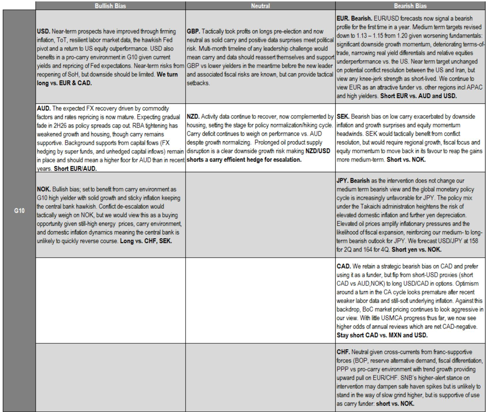
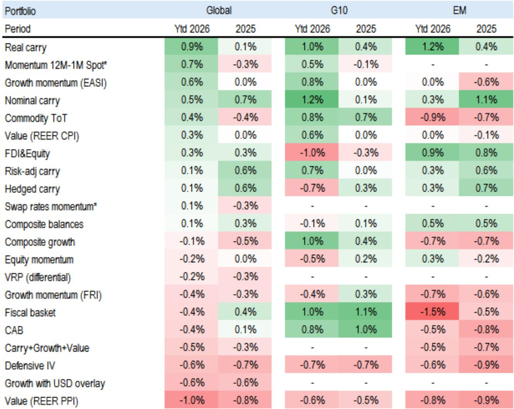
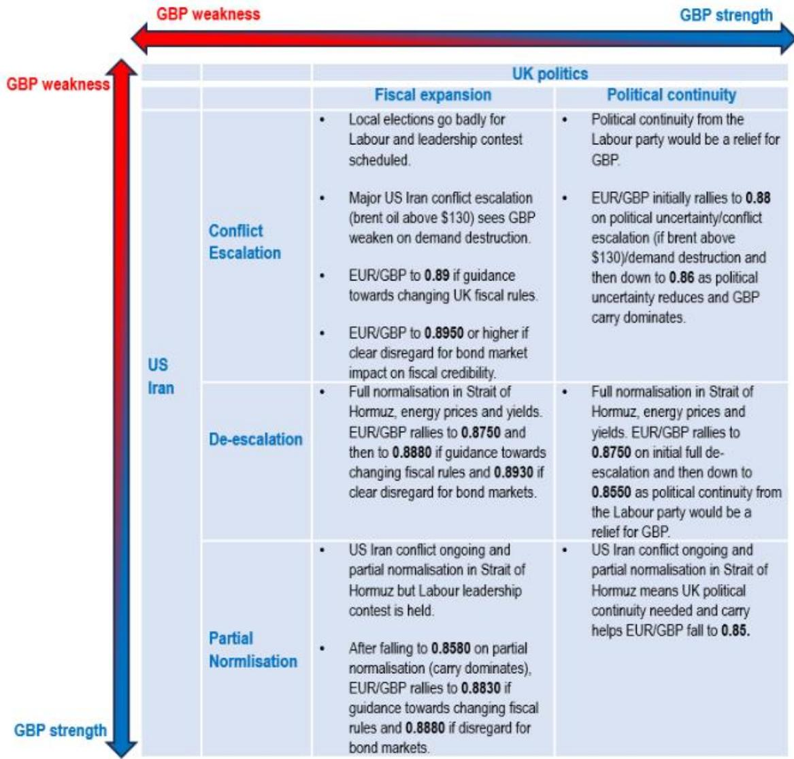

# The Dollar is No Longer a Safe-Haven Trade — It Is a Carry Trade, and That Changes Everything

The global FX regime has shifted, but most investors are still using the wrong framework. For the first time in over a year, a major global investment bank has turned structurally bearish on the euro against the dollar, revising medium-term EUR/USD targets from 1.20 down to a 1.13-1.15 range. This is not a tactical call driven by a single data point or a geopolitical scare. It reflects a deeper structural realignment: the US dollar now behaves like a high-yielding commodity currency, not a safe haven. Its positive correlation with oil prices is no longer an anomaly — it is the new baseline, justified by America's transformed energy balance of payments.

This matters now because the conditions that supported the dollar's post-invasion strength are evolving. The low-volatility, pro-risk environment that suppressed the dollar earlier this year is giving way to a regime where carry, terms of trade, and relative growth momentum are reasserting themselves. The dollar's recent rally in May was not a hedge-driven spike. It was a signal that the quality of global carry is deteriorating, and the US is the least bad house in a structurally shifting neighborhood.

The argument is not that the dollar is universally strong. It is that the dollar is strong against the right currencies — namely the euro, the yen, the Swiss franc, and the Swedish krona — while the Australian dollar and Norwegian krone continue to benefit from a separate set of dynamics. This is a nuanced, regionalized, and strategy-intensive environment. The days of simple long-dollar or short-dollar consensus trades are over. What has replaced them is a regime where currency selection is driven by a multi-signal framework that combines carry, growth momentum, equity performance, commodity terms of trade, and volatility.

## The Dollar's Oil Sensitivity Has Flipped From a Liability Into an Asset

The most underappreciated structural shift in global FX is the transformation of the US energy balance of payments. For decades, a spike in oil prices was a clear negative for the dollar. The US was a net importer, and higher energy costs meant a worsening current account, higher inflation, and a drag on growth. The dollar's beta to oil was negative. That relationship has inverted.

The report's data shows that the dollar's oil beta has moved from roughly zero in the mid-2000s to a clearly positive level today. This is not a statistical fluke. US crude oil exports have reached record levels. The United States is now a net exporter of petroleum products, and the energy terms of trade have flipped in its favor. When oil prices rise, the dollar now benefits from improved trade flows, not deteriorating ones. This is a first-order structural change that has not yet been fully priced into medium-term currency models.

The implication is straightforward but profound: investors who continue to view the dollar as a safe-haven currency that suffers when risk appetite rises are using an outdated map. The dollar today behaves more like a commodity currency in certain contexts, and its sensitivity to oil is now a source of strength, not vulnerability. This does not mean the dollar will rally every time oil spikes — vol and risk appetite still matter — but it does mean that the old playbook of shorting the dollar on energy shocks no longer works.

This also explains why the dollar has been range-bound despite elevated oil prices. The report shows that the dollar's fair value, adjusted for market volatility, has tracked the DXY index closely. The dollar has not underperformed the oil move. It has been held down by a low-vol, positive-risk environment that suppressed demand for the dollar as a hedge. As that environment shifts, the structural support from energy terms of trade becomes more visible.

## Carry Has Been the Dominant Return Driver, But Its Quality Is Deteriorating

Since the onset of the energy shock, carry has been the single most reliable predictor of G10 FX returns. The report's scatter plot is striking: currencies with higher ex-ante carry, such as the Norwegian krone and the Australian dollar, have outperformed, while low- or negative-carry currencies like the yen, Swiss franc, and Swedish krona have been the worst performers. The correlation is not perfect, but it is strong enough to be the dominant regime signal.

This makes intuitive sense. In an environment where growth has been resilient but not booming, and where central banks remain cautious about inflation, carry dispersion has been preserved. Central banks have not cut rates aggressively, so the yield advantage of high-carry currencies has been maintained. Investors have been paid to hold them, and they have done so.

But the report identifies a critical warning sign: the quality of global carry is starting to deteriorate. The systematic macro scores that combine carry with growth momentum, equity performance, commodity terms of trade, value, and defensive implied volatility have shifted in favor of low- and mid-yielders over the past month. The high-yielders that dominated the carry trade are now showing weaker macro fundamentals underneath the yield.

This is the kind of signal that should make carry-focused investors pause. It does not mean the carry trade is dead, but it does mean that the easy money has been made. Going forward, the carry trade will require more precise currency selection. Not all high-yielders are equal. The Australian dollar and Norwegian krone continue to score well on the broader macro framework, while other high-yielders in emerging markets are showing signs of macro fatigue. The dollar, meanwhile, sits in an unusual position: it offers competitive carry relative to most G10 peers, but it also benefits from improving macro momentum. That combination is rare and worth paying attention to.

## The US Is Winning the Regional Divergence Game, and Western Europe Is Losing

The report's most strategically useful framework is its regional ranking of energy exposure and offsetting supports. North America ranks highest on both dimensions: it has the lowest direct energy hit and the highest availability of offsetting supports, including fiscal flexibility, labor market resilience, and monetary policy room. Western Europe ranks lowest: it has a moderate energy hit but very limited offsetting capacity.

This divergence is not theoretical. It is being validated by the report's cyclical macro quant scores. North America scores positive on the systematic TEAM framework, while the euro area scores negative. This is not a short-term fluctuation. It reflects a structural difference in how these regions are positioned to absorb and recover from the energy shock.

The implications for FX are clear. The euro is not just weak because of near-term growth disappointment. It is weak because the structural supports that could buffer the region are absent. The European Central Bank faces a difficult trade-off: inflation remains sticky enough to prevent aggressive easing, but growth momentum is deteriorating. This is the worst possible combination for a currency. The euro is losing the terms-of-trade battle, its real yield differentials are narrowing against the US, and its equity market is underperforming. The report's decision to turn bearish on EUR/USD for the first time in a year is not a tactical call. It is a recognition that the structural deck is stacked against the euro.

The US, by contrast, benefits from a more balanced Federal Reserve. The hawkish pivot this year was driven by firmer domestic data, not by external energy shocks. US labor markets remain resilient, inflation surprises have been to the upside in pockets, and equity markets have regained their outperformance edge. This is not a boom, but it is a clear relative advantage.

## The Yen and the Franc Are Structural Losers in This Regime

Not all low-yielders are created equal, but the yen and the Swiss franc share a common vulnerability in the current environment: they are funding currencies in a carry-dominated world, and their central banks are either unwilling or unable to change that dynamic.

The yen faces a particularly challenging setup. The report notes that intervention by the Ministry of Finance does not change the medium-term bearish outlook. The global monetary policy cycle is increasingly unfavorable for the yen. The policy mix under the current administration heightens the risk of elevated domestic inflation and further yen depreciation. Elevated oil prices amplify inflationary pressures and increase the likelihood of fiscal expansion, which reinforces the bearish outlook. The report's forecast of USD/JPY at 158 in the second quarter and 164 in the fourth quarter is a clear statement that the yen's weakness is structural, not cyclical.

The Swiss franc is more nuanced. It benefits from balance of payments support, reserve alternative demand, and fiscal differentiation. But in a pro-carry environment, it is a natural funding currency. The Swiss National Bank's higher alert stance on intervention may dampen safe-haven spikes, but it is unlikely to stand in the way of a slow grind higher in EUR/CHF. The franc is not a sell on a standalone basis, but it is an attractive funding currency against high-yielders like the Norwegian krone.

## The Report Leaves an Important Question Unanswered

For all its analytical rigor, the report does not fully resolve one critical question: how long can the carry regime persist if global growth starts to deteriorate more sharply? The report acknowledges that the quality of carry is deteriorating, but it does not specify a trigger point at which carry stops working.

The risk is that a sharper slowdown in global growth would compress carry dispersion as central banks are forced to cut rates. If that happens, the entire trade structure changes. High-yielders would no longer be rewarded, and the dollar's advantage would shift from carry to safe-haven demand. The report's framework is robust in the current environment, but it is not stress-tested for a recession scenario. Readers who want to understand the conditions under which the carry trade breaks down will need to look beyond this report.

## A Decision Framework for Currency Investors

Based on the report's logic, investors should organize their currency exposure around three distinct categories.

First, the dollar is a long against structurally weak currencies. The euro, yen, Swiss franc, and Swedish krona all face headwinds that are not easily reversed. The dollar offers competitive carry, improving terms of trade, and a more resilient macro backdrop. Short EUR/USD, short USD/JPY, and short USD/CHF are the core expressions of this view.

Second, the Australian dollar and Norwegian krone are long against funding currencies, but not against the dollar. The report is clear that the AUD and NOK are attractive on a cross basis, particularly against the euro and the yen. But they are not buys against the dollar. The carry advantage of AUD and NOK is real, but it is being offset by deteriorating macro scores. Investors should hold these positions but monitor the macro signals closely.

Third, the Canadian dollar and Swedish krona are funding currencies. The report retains a strategic bearish bias on CAD, preferring to use it as a funder against the dollar and the Mexican peso. The Swedish krona is similarly unattractive, with low carry exacerbated by downside inflation and growth surprises. These are not currencies to own; they are currencies to short against stronger peers.

The key insight is that this is not a one-directional market. The dollar is strong against some currencies and neutral against others. The carry trade is still working, but it requires more careful selection. The days of buying any high-yielder and selling any low-yielder are over.

## Join the Community to Read the Full Report and Review the Original Charts

The analysis above draws on a global investment bank's FX strategy report that contains detailed charts on inventory dynamics, energy exposure rankings, carry correlations, and inflation surprise indices. These charts are essential for understanding the regional divergence that underpins the current FX regime. The original report also includes specific trade recommendations, option structures, and risk management guidance that cannot be fully conveyed in a summary. Join the community to read the full report and review the original charts.

*This article is for learning and discussion only and does not constitute investment advice.*

Personal reading notes and learning share only. Not investment advice.

