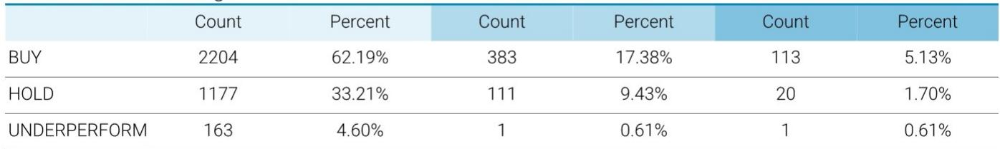

# 市场真正低估的不是需求，而是供给侧的再定价

某外资投行于6月初发布的中国基础材料行业调研纪要，在看似平淡的“需求仍弱”共识下，埋藏了一条被多数投资者忽略的主线：大宗商品的定价权正在从需求侧向供给侧转移。这不是一个短期交易逻辑，而是一个可能持续数年的结构性变化。

该行分析师在完成对中国铝、铜、锂、钢及地产的实地调研后，给出了明确的板块排序：铝和铜优先于锂，锂优先于钢铁。这个排序表面看是供需分析的产物，但深入阅读报告会发现，真正决定排序的变量，并非传统意义上的“需求增长有多快”，而是“供给约束有多硬”。

市场当前对基本材料的讨论，大多停留在“地产何时见底”“新能源能否对冲”的层面。但这份报告释放了一个更重要的信号：即便需求不再增长，供给侧的自我约束和政策性收紧，也足以改变部分商品的定价中枢。这恰恰是市场尚未充分定价的部分。

## 1. 铝的供给约束正在从“政策限制”转向“经济性自我约束”

铝是这份报告中最具结构性的品种。市场此前对铝价的担忧集中在社会库存高企——截至调研时，LME铝价年内上涨26%，而中国现货仅涨8%，价差背后是“软需求”的共识。但报告揭示了库存高企的三个非需求原因，每一个都指向供给侧的短期扭曲而非长期过剩。

第一个原因是下游对当前价格水平的消化需要时间，企业缺乏补库意愿。这不是需求消失，而是价格传导的节奏问题。第二个原因更具信息价值：中国税务部门加强了对贸易发票的检查，导致原本隐匿在贸易商手中的“隐形库存”浮出水面，成为显性社会库存。这意味着，实际可流通的库存可能远低于统计数字。第三个原因则最值得关注——在铝价持续坚挺的激励下，部分生产商通过提升电流强度等方式增加了实际产出，增幅通常在低个位数百分比。但这种“超产”是以牺牲电解槽寿命为代价的，不可持续，大规模超产并不现实。

真正改变市场格局的是两个后续信号。其一，铝材出口正在加速。主要铝材加工企业的订单增速显著，4月同比增长20-30%，这一趋势在5-6月得以延续。根据第三方机构数据，铝材出口有望达到每月65万吨以上，接近历史峰值68万吨。其二，调研结束后，部分省份的电解铝产能利用率出现了边际下降，原因是监管部门对超产行为进行了检查，特别是那些通过“产能置换”名义启动新产线但未完全关闭旧产线的违规行为。

出口吸收国内过剩、超产被查导致供给收缩——这两个方向的力量叠加，使得即将到来的传统消费淡季变得与众不同。报告明确判断：铝市场有望维持偏紧格局。这意味着，即便地产需求没有改善，供给侧的自我约束和出口通道的打开，已经足以支撑铝价中枢上移。

## 2. 铜的叙事重心正在从“供应中断”转向“资源稀缺的重新定价”

铜是市场共识最强的品种，但共识本身往往意味着定价不充分。报告指出，铜价自去年底以来的上涨，主要驱动力是供给侧的中断，而非需求的兑现。新能源和AI带来的需求增长仍是“共识”，但尚未在价格中得到充分体现。

值得注意的一个细节是，中东局势导致的硫磺供应风险，并未对大型矿企产生实质性影响——高铜价带来的高利润率，使得这些企业有能力支付更高的硫磺采购成本。只有刚果民主共和国的一些小型SX-EW铜生产商面临挑战，但贸易商的反馈显示，这部分产量影响相当有限，未来3-4个月内不会构成主要担忧。

真正重要的不是短期中断，而是长期稀缺。报告提到，供应端的老问题并未改善：矿山老化加剧了资源稀缺性，重大中断后的产能恢复需要时间。更关键的是，越来越多的国家开始强调关键矿产和供应链安全，这可能导致全球市场的“部分分割”——例如美国正在进行的战略储备。这种地缘政治因素，未来可能成为铜价定价中的新增变量。

铜的逻辑比铝更纯粹：需求端共识已经形成，但还没体现在价格里；供给端不仅没有改善，还在恶化。两者的合力指向一个方向——铜的定价中枢可能被系统性抬高。但报告也留下一个伏笔：当前价格已经包含了多少“需求预期”？如果AI和数据中心的铜需求落地节奏慢于预期，铜价是否会出现阶段性调整？这个问题，报告没有完全展开。

## 3. 锂的“短期稳态”掩盖了三个未被验证的关键假设

锂是这份报告中分歧最大的品种。调研显示，被访企业普遍对2026年的锂需求有信心，储能增速预期至少在60%以上。但一个被反复提及的担忧是：2027年尤其是下半年的需求可见度很低。

报告点出了三个尚未被市场充分讨论的不确定性。第一个是2026年储能需求的“前置”可能——如果企业抢装导致需求集中释放，2027年的增速可能会出现断崖式回落。第二个更为深刻：储能项目激增后，峰谷电价套利的空间可能收窄，从而影响储能的内部收益率。这意味着，储能的经济性并非线性外推，而是存在一个“自反性”问题——当所有人都涌入时，套利空间反而消失。

在供给端，报告确认了津巴布韦锂矿出口的恢复，相关企业维持全年产量目标不变，并重申“配额可以续期”。同时，企业正在积极重启此前暂停的矿山，并推进新项目和扩建项目。即便假设江西的供给中断持续，中期供给增量仍然可观。

关于锂价，报告给出的判断值得反复品味：当前多数企业认为锂价在每吨15万元人民币有支撑，下游可以接受；但市场需要测试每吨20万元的上限，而这一测试的关键在于——它对储能IRR的影响（从成本端看），以及对矿山重启和资本开支的刺激。钠离子电池也被提及，它正在成为现实，但短期体量有限。与锂电池的成本平价是钠电池大规模替代的关键，对应的长期锂价区间大约在每吨12-15万元。

报告对锂的结论是：由于供给恢复需要数月时间，近期虽有回调，但短期不会恶化；中期动态仍然充满变数。这个“充满变数”背后，是三个尚未被验证的关键假设：储能需求能否持续高强度增长、锂价上涨是否会触发新一轮供给释放、钠电池何时实现成本突破。

## 4. 钢铁的“供给侧改革”面临市场化瓶颈，政策工具接近极限

钢铁是报告中最悲观的品种。需求端没有争议：缓慢下滑。2026年地产仍将疲软，汽车和家电在2025年以旧换新补贴退坡后也缺乏亮点。基建在“十五五”开局之年有政府项目支撑，制造业如机械、造船等保持韧性，但不足以对冲其他领域的下滑。

出口端同样面临压力。1-4月直接钢材出口同比下降10%，贸易壁垒（反倾销调查、CBAM）、人民币升值和打击非法出口都是逆风。但报告援引第三方机构预测，今年钢材出口仍将达1.1亿吨左右，虽同比下降，但仍是历史高位。更值得关注的是间接出口——通过制成品出口的钢材量，2025年已估计达到1.5亿吨，2026年有望进一步增长，完全抵消直接出口的下降。这本身是中国制造业韧性的体现，但对钢铁企业而言，这意味着定价权正在从钢厂向下游制造端转移。

政策层面，中国刚更新了产能置换规则，将全国置换比例从1.25:1收紧至1.5:1，并鼓励行业整合——跨企业产能置换必须在2年内完成，之后只能在同一企业或集团内部进行，或者先进行并购。钢铁企业和行业协会对此表示欢迎，但也承认这是一个长期工程。而贸易商则普遍持怀疑态度，因为历史执行效果并不理想。

报告点出了一个更深层的问题：政府能做的已经接近极限。其影响力主要集中在国企，而中央和省级层面的大型国企整合已基本完成。非国企之间的并购整合，大概率只能依靠市场驱动，而这需要时间。钢铁行业的供给侧改革，正在从“政策驱动”转向“市场驱动”，这个转变过程可能漫长且充满不确定性。

## 5. 地产“止跌回稳”的结构性陷阱：一二线的改善无法掩盖三四线的塌陷

报告对地产的判断，与市场主流预期形成鲜明对比。调研对象——一家全国性地产中介——预计2026年住宅销售面积同比下降7%至6.8亿平方米，并认为底部可能在6亿平方米左右。这个数字意味着，即使经过连续4年下跌、累计跌幅超过50%，地产仍未触底。

近期一线和热门二线城市的住宅成交和价格确实有所企稳，但报告明确指出，这主要是放松限购驱动的，而非基本面的真正改善。由于目前只有北京、上海和深圳仍保留购房资格限制，全国其他城市已无限制可放，政策进一步放松的空间极为有限。更关键的是，一二线城市仅占中国新房销售的约20%，低线城市因人口外流、老龄化、就业和收入预期谨慎等原因，很难跟随一二线城市的回暖势头。整体市场仍然充满挑战。

库存方面，报告给出的数字令人警觉：截至去年底，新房库存去化周期已达到25-26个月。与此同时，报告认为大规模刺激的可能性很低。原因是：中国正在努力减少对地产的依赖，经济韧性（如出口表现良好）使得政府有底气容忍地产的温和调整；连续4年下跌后，地产的增量影响已在减弱；更重要的是，过去几年支持政策的效果都是暂时的，没有改变大趋势。从成本效益角度看，财政资金可能更适合投向其他蓬勃发展的行业。

当然，报告也留下了一个“尾部风险”的讨论空间：如果下滑显著加速，或引发系统性风险，政府可能会介入。但在可预见的未来，温和的调整是可以被容忍的。这意味着，地产对基本材料的拖累，短期内不会消失，也不会加剧——它只是“在那里”。

## 6. 重新审视基本材料投资框架：从“需求弹性”转向“供给刚性”

综合这份报告的五个核心判断，一个更宏观的框架正在浮现：基本材料投资的逻辑基础，正在从“需求增长弹性”转向“供给刚性”。

过去二十年，基本材料行业的核心叙事是“中国需求”。谁抓住了中国城镇化和工业化，谁就获得了超额回报。但当下，中国地产已经进入长期下行通道，即便新能源和制造业能够部分对冲，总需求增速放缓已是不争的事实。在这个背景下，供给侧的结构性变化——无论是政策驱动的产能约束、资源稀缺性的自然加剧、还是企业层面的经济性自我限制——将成为决定商品定价权的关键变量。

铝是供给刚性最强的品种：政策限制产能天花板，超产不可持续，出口通道打开。铜是稀缺性正在重新定价的品种：矿山老化是结构性趋势，地缘政治因素正在加入定价方程。锂处于中间地带：短期供给恢复需要时间，但中期供给释放的弹性仍然很大，价格能否维持取决于需求能否超预期。钢铁则是供给刚性最弱的品种：政策工具接近极限，市场化整合缓慢，需求持续下滑。

这个框架的启示是：投资者需要从“押注需求复苏”的思维，转向“评估供给约束强度”的思维。在需求增速放缓的环境下，供给约束越强的品种，其定价权越稳固，利润分配越有利于上游。反之，供给弹性大的品种，即便需求有所改善，利润也会被快速释放的产能侵蚀。

报告尚未完全回答的问题是：当供给约束成为定价核心，商品价格的中枢应该用什么样的估值框架来定价？传统的市盈率或市净率估值，在供给约束主导的环境中可能失效。这个问题，值得在更深入的讨论中继续推演。

欢迎来星球微信群里继续讨论，我们会在群内分享完整报告原文，并持续追踪铝、铜、锂、钢四个品种的供给端变化，探讨新的定价框架和交易策略。

Personal reading notes and learning share only. Not investment advice.

