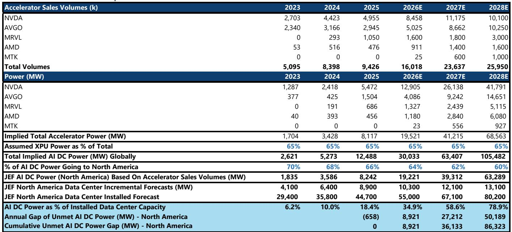
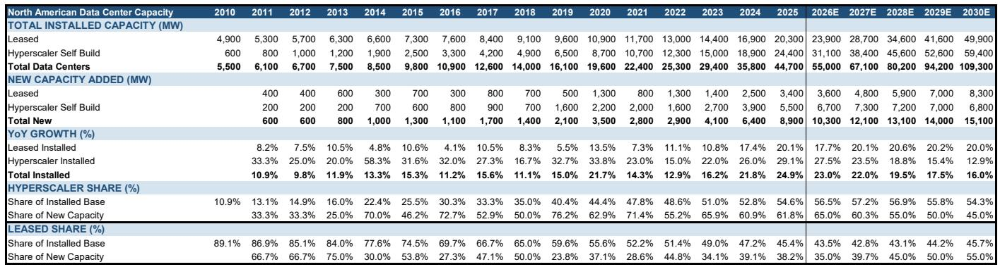
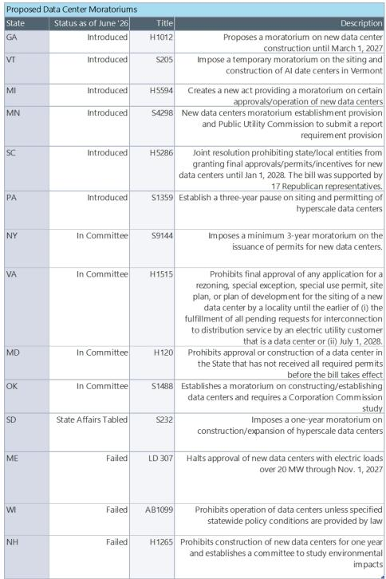

# The Data Center Supply Deficit Is Not a Demand Problem — It Is a Physical Ceiling That Will Reshape the Entire Infrastructure Ecosystem

The global data center market is exiting 2025 with a 12-gigawatt deficit between leases signed and capacity delivered. This is not a cyclical mismatch. It is a structural break between what the market demands and what the physical world can supply. Hyperscaler capital expenditure is on pace to reach $770 billion in calendar year 2026, a 74 percent year-over-year increase and nearly five times the $156 billion deployed in 2023. Combined cloud backlog has surged to $2 trillion in the first quarter of 2026, growing three times faster than capital expenditure since 2023. Bottom-up accelerator sales volumes imply roughly 30 gigawatts of global AI power demand in 2026 from GPU and XPU shipments alone, with 19 gigawatts destined for North America — nearly double the 10.3 gigawatts of new capacity expected to come online.

The demand signals could not be more unambiguous. Yet the market is fixated on whether demand will sustain. That is the wrong question. The right question is which parts of the supply chain will break first, and who benefits when they do.

The data center industry has entered a regime where supply constraints, not demand uncertainty, set the ceiling on growth. Every incremental dollar of hyperscaler capital expenditure will encounter the same six physical bottlenecks: engineering, procurement and construction labor, cooling systems, electrical infrastructure, power transformers, interconnection queues, and equipment lead times. The binding constraint in 2026 is EPC and labor, with a ceiling of 10.4 gigawatts. Cooling is nearly co-binding at 11.4 gigawatts and becomes the binding constraint from 2028 onward. This means that even if every lease signed today were fully funded, the industry cannot physically deliver more than the supply chain allows.

This is not a forecast of temporary tightness. It is a description of a multiyear structural undersupply that will reorder the competitive dynamics across the entire data center ecosystem — from real estate investment trusts and equipment suppliers to Bitcoin miners retrofitting their sites and utilities building generation for hyperscalers. The implications for investors are profound, but they require a framework that distinguishes between companies that benefit from the deficit and companies that are merely exposed to it.

## Hyperscaler Demand Is Growing Faster Than the Industry Can Build, and the Gap Is Widening by the Year

The data from 2025 tells a stark story. According to Aterio's comprehensive site database, only 3.4 gigawatts of lit colocation data center capacity came online in North America that were not hyperscaler self-builds. Against that, Data Center Hawk recorded 15.6 gigawatts of leases signed. The resulting 12.2-gigawatt deficit is nearly triple the 4.3-gigawatt gap in 2024 and more than four times the 2.9-gigawatt gap in 2023. From 2021 through 2025, the cumulative deficit has reached 20.4 gigawatts of undelivered data center capacity.

This deficit is not a measurement error. It reflects a fundamental reality: the data center construction cycle cannot compress fast enough to match the pace at which hyperscalers are committing capital. Currently, hyperscalers tend to commit to capacity deliverable within 12 to 18 months. Given the supply constraints visible across every category, that commitment window is likely to widen to 24 months or more. The implication is that forward leasing will become a form of capacity reservation, not a signal of near-term delivery. Investors who treat lease signings as a proxy for imminent revenue growth will be systematically disappointed.

The installed base data reinforces this point. North American data center capacity increased by 8.9 gigawatts in 2025 to reach 44.7 gigawatts total. The model projects 10.3 gigawatts of new capacity in 2026, growing to 15.1 gigawatts by 2030, which would bring the total installed base to 109.3 gigawatts. That represents a roughly 20 percent compound annual growth rate off the 2025 base. But even this aggressive buildout trajectory will not close the gap. The model assumes capacity additions accelerate every year through 2030, yet the demand-side indicators — hyperscaler capital expenditure, cloud backlog, and accelerator shipments — are growing at multiples of that pace.

The mix between hyperscaler self-builds and leased capacity is also shifting in ways that matter for different parts of the ecosystem. Hyperscalers accounted for 62 percent of the 8.9 gigawatts delivered in 2025, and their share of new builds is expected to increase to 65 percent in 2026 before moderating to 45 percent by 2030 as third-party colocation developers accelerate delivery. On an installed capacity basis, hyperscaler self-builds peaked near 55 percent of total capacity in 2025 and are expected to remain near 57 percent through 2027 before declining to roughly 54 percent by 2030. The leased share of new capacity additions dips from 38 percent in 2025 to 35 percent in 2026, then recovers to 55 percent by 2030. This implies that the colocation market will outgrow owner-occupied builds through the forecast period, but only after a period where hyperscalers are forced to build more themselves because third-party supply cannot keep pace.

The strategic implication is clear: the colocation developers that survive the next two years will emerge with pricing power and structural demand that far exceeds anything the industry has seen. But the path to that outcome requires navigating a period where supply constraints, not demand, determine who can deliver.

## Six Physical Supply Constraints Create a Ceiling That No Amount of Capital Can Remove

The proprietary data center capacity delivery model calibrates supply ceilings across six constraint categories. Each constraint operates independently, and the binding constraint shifts over time. In 2026, EPC and labor capacity sets the ceiling at 10.4 gigawatts. Cooling is nearly co-binding at 11.4 gigawatts. From 2028 onward, cooling becomes the binding constraint, which means that the industry's ability to deliver capacity will be limited by the availability of advanced liquid cooling and thermal management systems, not by the availability of land, power, or even construction labor.

This is a critical insight because it changes the investment calculus. Companies that provide cooling solutions, electrical equipment, and power transformers will see order growth outpace revenue delivery for the foreseeable future. Backlogs across these categories are expanding at two to four times the rate of revenue, which means that current revenue figures understate the true demand visibility. The equipment suppliers are not just benefiting from a cyclical upswing. They are operating in an environment where their production capacity is effectively the bottleneck for the entire data center industry.

The power transformer constraint deserves particular attention. Transformer lead times have extended to two years or more in many cases, and the manufacturing capacity for large power transformers is concentrated among a small number of global suppliers. This creates a situation where the interconnection queue — the process by which data centers connect to the grid — becomes a multiyear gating factor. Even if a developer has secured land, permits, and financing, the inability to get a transformer in a reasonable timeframe can delay a project by 18 to 24 months.

The model also captures the role of NIMBY opposition and regulatory permitting, though these factors are more difficult to quantify. The report notes that NIMBY resistance is becoming a meaningful constraint in several primary markets, particularly in Northern Virginia, which has historically been the dominant data center market in North America. As vacancy rates in primary markets fall to 1 to 3 percent, developers are being forced to consider secondary markets or international locations. This geographic dispersion creates opportunities for developers with diversified land banks and for utilities in regions with available power and supportive regulatory environments.

The binding constraint framework also explains why Bitcoin miners are finding a compelling opportunity in the data center market. Companies such as CORZ, CIFR, HUT, RIOT, and WULF are converting existing infrastructure to serve AI and high-performance computing workloads. These sites already have energized land, established grid connections, and in many cases, existing cooling and electrical infrastructure. The compressed timeline they can offer — months rather than years — is a direct response to the supply chain constraints that traditional developers face. The report initiates coverage on this thesis with the title "AI Data Center Developers: Fresh Faces, Same Math," and the math is indeed compelling. These companies can deliver capacity on timelines that hyperscalers and traditional colocation providers cannot match, and they are being rewarded with contracts that reflect the scarcity value of speed.

## The Deficit Creates Different Winners Across the Ecosystem, and the Market Is Not Yet Pricing the Full Extent of the Tightness

The demand-supply imbalance benefits three distinct groups: operators, suppliers, and new entrants. Each group faces a different risk-reward profile, and the market is pricing them with varying degrees of accuracy.

Data center REITs such as DLR and EQIX have realized meaningful growth in leasing volumes and pricing over the past several years. Rents and bookings are accelerating alongside AI-driven demand. DLR has seen enterprise colocation bookings accelerate from roughly $50 million per quarter to nearly $100 million per quarter, with AI now representing 33 to 50 percent of aggregate bookings and roughly 20 percent of enterprise colocation activity, up from low-teens levels last year. EQIX operates the most interconnected data center platform globally, and four of the top five neocloud providers and eight of the top ten AI labs are deployed across its network. These are structural advantages that compound as the ecosystem grows, but they are also partially priced into valuations.

The supplier side is where the market may be underestimating the duration of the opportunity. Equipment suppliers across cooling, electrical, and power transformer manufacturing are seeing order growth that consistently outpaces revenue delivery. Backlogs are expanding at two to four times the rate of revenue, which implies that current earnings understate the true demand visibility. Companies such as CAT, ETN, WCC, PRIM, and MTZ are positioned to benefit from the multiyear buildout of power generation and data center infrastructure. The report identifies CAT as a top pick despite upside from power generation already being largely baked into estimates, with additional upside expected from the gas cycle as data center demand drives new generation requirements.

The new entrants from the Bitcoin mining industry represent a different kind of opportunity. These companies are not building from scratch. They are repurposing existing infrastructure that was originally designed for energy-intensive computing. The transition from Bitcoin mining to AI and HPC workloads requires significant capital investment, but the sites themselves — with their power capacity, cooling systems, and grid connections — are assets that traditional data center developers would need years to replicate. The report identifies CORZ as the pioneer of this movement, with a 590-megawatt development for CoreWeave, and WULF as an AI data center developer that has repositioned its Bitcoin mining land sites. The key question for investors is whether these companies can execute at scale and whether their existing infrastructure can support the density and reliability requirements of AI workloads.

## What the Report Does Not Fully Answer: The Duration of the Constraint and the Risk of Demand Destruction

The report provides a detailed framework for understanding the supply constraints, but it leaves several meaningful questions unanswered. The most important is the duration of the constraint. The model projects capacity additions growing from 10.3 gigawatts in 2026 to 15.1 gigawatts by 2030, but this assumes that the supply chain can scale at a compound annual growth rate that has no historical precedent. If the binding constraints prove more persistent than modeled — if cooling systems cannot scale fast enough, if transformer manufacturing capacity cannot expand, if labor shortages worsen — then the actual delivery could fall short of even these aggressive projections.

The second unanswered question is the demand side. The report treats demand as exogenous and unconstrained, but demand is not independent of supply. If hyperscalers cannot get the capacity they need, they may shift their capital expenditure to other priorities, or they may accept lower utilization rates on existing capacity. The $2 trillion cloud backlog is a measure of committed demand, but it is also a measure of capacity that has not yet been delivered. If the supply constraints persist for three to five years, some of that backlog could be at risk of cancellation or renegotiation. The report does not model this scenario.

The third question is the geographic dimension. The report focuses on North America, but the international opportunity is significant. If the United States cannot build enough data center capacity, hyperscalers will accelerate their buildout in Europe, Asia, and Latin America. The report identifies opportunities in Iberia through Merlin Properties, in Australia through CDC and Infratil, and in China through VNET, but it does not fully explore the implications of a global supply constraint. If every region faces similar bottlenecks, the constraint becomes even more binding. If some regions can build faster, the geographic distribution of data center investment could shift dramatically.

## A Decision Framework for Investors: Distinguish Between Companies That Benefit from the Deficit and Companies That Are Exposed to It

The data center supply deficit creates a clear investment framework, but it requires discipline to apply correctly. The framework has three dimensions: exposure to the binding constraint, pricing power, and the ability to compress delivery timelines.

Companies that provide solutions to the binding constraint — cooling systems, electrical equipment, power transformers, and EPC services — have the most direct exposure to the deficit. Their order books are growing faster than their revenue, which means they have visibility into future earnings that is not fully reflected in current valuations. The risk is that the constraint eases faster than expected, but the model suggests that is unlikely given the physical nature of the bottlenecks.

Companies that operate data center capacity — REITs and colocation providers — benefit from the deficit through pricing power and low vacancy rates. The risk is that they cannot deliver the capacity they have leased, which would create a mismatch between revenue expectations and actual cash flows. The report notes that only 3.4 gigawatts of colocation capacity was lit in 2025 against 15.6 gigawatts of leases signed, which means that a significant portion of leased capacity has not yet been delivered. Investors need to distinguish between REITs that have the operational capability to deliver on their leases and those that are simply signing leases they cannot fulfill.

Companies that can compress delivery timelines — the Bitcoin miners retrofitting their sites — have a unique advantage in the current environment. Their ability to deliver capacity in months rather than years is a direct response to the supply chain constraints that traditional developers face. The question is whether this advantage is sustainable. If the supply chain constraints ease, the premium on speed will decline. If the constraints persist, these companies could become the preferred partners for hyperscalers seeking capacity on compressed timelines.

The framework also applies to the hyperscalers themselves. Companies such as AMZN, MSFT, and GOOGL are investing heavily in data center capacity, but their returns on that capital depend on their ability to actually deliver the capacity. The report identifies AMZN as a mispriced AI, cloud, and retail compounder, with AWS positioned to reaccelerate as AI capacity comes online. But the reacceleration depends on capacity delivery, which is subject to the same supply constraints that affect every other participant in the market.

## The Most Important Question May Be Which Constraints Will Bind First, and the Answer Is Changing

The report makes clear that the binding constraint shifts over time. In 2026, EPC and labor is the binding constraint. From 2028 onward, cooling becomes the binding constraint. This shift has significant implications for which companies benefit at which stage of the cycle.

In the near term, companies that provide EPC services and have access to skilled labor are best positioned. PRIM is identified as an EPC company that is well positioned to execute on simple cycle gas combustion turbine buildout, and the report notes that access to skilled labor is the single most significant constraint in the power and data center ecosystem. In the medium term, cooling companies become the critical bottleneck. GEV, as a provider of natural gas turbine and power generation infrastructure, is positioned to benefit from the long lead cycle generation, but the report notes that the long-term services value in the 2030s is not fully appreciated.

The shift in the binding constraint also creates opportunities for companies that can provide integrated solutions. NI, an Indiana-focused regulated utility, has an innovative GenCo structure that allows for premium returns on building generation for hyperscalers. Current customers include Amazon and Alphabet, with potential for more. This model — where a utility builds generation specifically for data center customers — is a direct response to the power constraint, and it could become more common as the constraint tightens.

Join the community to read the full report and review the original charts.

*This article is for learning and discussion only and does not constitute investment advice.*

Personal reading notes and learning share only. Not investment advice.

