# Investor Presentation | Asia Pacific

# Asia Summer School: HK/ASEAN Banks

The session will cover industry structure, individual banks under our coverage and stock price drivers. We also focus on key thematics including capital returns, wealth management, Singapore's EQDP and the emergence of digital assets.

MS ASIA (SINGAPORE) PTE.+

# Nick Lord

Equity Analyst

Nick.Lord@morganstanley.com +65 6834-6746

# Selvie Jusman, CFA

Equity Analyst

Selvie.Jusman@morganstanley.com +65 6834-6517

# Aitong Li

Research Associate

Aitong.Li@morganstanley.com +65 6834-6295

text_image

Asia Summer School 2026

# ASEAN FINANCIALS

Asia Pacific

Industry View In-Line

MS does and seeks to do business with companies covered in MS. As a result, investors should be aware that the firm may have a conflict of interest that could affect the objectivity of MS. Investors should consider MS as only a single factor in making their investment decision.

# For analyst certification and other important disclosures, refer to the Disclosure Section, located at the end of this report.

+= Analysts employed by non-U.S. affiliates are not registered with FINRA, may not be associated persons of the member and may not be subject to FINRA restrictions on communications with a subject company, public appearances and trading securities held by a research analyst account.

# Asia Summer School 2026

# I. MAPPING HK/ASEAN BANKS

Banking Markets in Context   
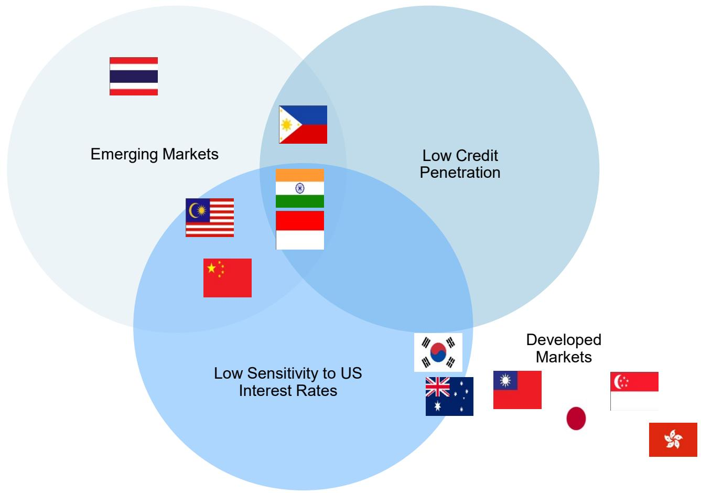

other

| Category               | Value |
| ---------------------- | ----- |
| Emerging Markets       | 1     |
| Low Credit Penetration | 2     |
| Developed Markets      | 0     |
| Low Sensitivity to US Interest Rates | 3   |

Source: MS

# ASEAN in a Glimpse

Credit Penetration   
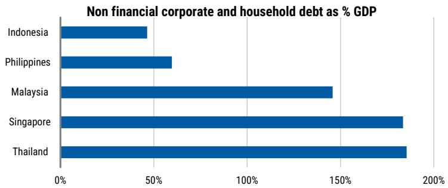

bar

Non financial corporate and household debt as % GDP
| Country | Non-financial corporate and household debt as % GDP (%) |
| :--- | :--- |
| Indonesia | 47 |
| Philippines | 59 |
| Malaysia | 146 |
| Singapore | 183 |
| Thailand | 185 |

Source: CEIC, Haver, MS. Data as of end of 2025.

Return Level   
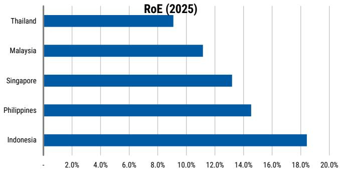

bar

RoE (2025)
| Country | RoE (%) |
| :--- | :--- |
| Thailand | 9.2 |
| Malaysia | 11.1 |
| Singapore | 13.4 |
| Philippines | 14.7 |
| Indonesia | 18.4 |

Source: Company Reports, MS

Capital Position   
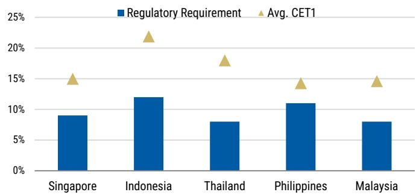

bar_line

| Country | Regulatory Requirement (%) | Avg. CET1 |
| :--- | :--- | :--- |
| Singapore | 9 | 15 |
| Indonesia | 12 | 22 |
| Thailand | 8 | 18 |
| Philippines | 11 | 14 |
| Malaysia | 8 | 15 |

Source: Company Reports, MS

# Themes

Capital Return   
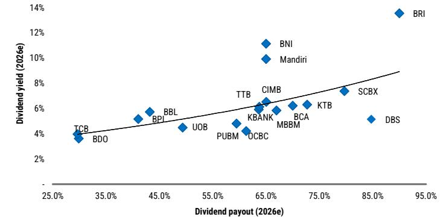

scatter

| Label | Dividend payout (2026e) | Dividend yield (2026e) |
|-------|--------------------------|-------------------------|
| BRI   | 90.0%                    | 13.5%                   |
| BNI   | 75.0%                    | 7.5%                    |
| Mandiri| 85.0%                    | 5.0%                    |
| SCBX  | 80.0%                    | 7.5%                    |
| KTB   | 75.0%                    | 6.5%                    |
| MBBM  | 70.0%                    | 6.0%                    |
| BCA   | 70.0%                    | 6.0%                    |
| CMB   | 65.0%                    | 6.5%                    |
| KBANK | 65.0%                    | 6.0%                    |
| OCBC  | 60.0%                    | 4.5%                    |
| PUBM  | 55.0%                    | 4.5%                    |
| UOB   | 50.0%                    | 4.5%                    |
| BPI   | 45.0%                    | 5.5%                    |
| TCB   | 35.0%                    | 4.0%                    |
| BDO   | 30.0%                    | 3.5%                    |

Source: MS estimates

# ASEN Banks Evolving Industry Landscape

# Indonesia

- Rebuilt in the wake of the 1998 Asia Financial Crisis, Indonesia's banks have grown loans at an $8\%$ CAGR (2014-25) This has been driven by the country's private debt to GDP ratio of less than $50\%$ , the lowest in the region, and strong economic growth in the recent past.   
- The industry's loan/deposit ratio (LDR), climbed from 44% in 2002 to 96% in May-19 as deposits lagged loan growth. In the past two years, softer loan growth and rising liquidity has driven a fall in LDR to 80% (Dec 2022), but has recovered to \~90% now.   
- Sector is dominated by four large banks, there is also a long tail of mid and small sized banks, potentially leading to more consolidation.

# Thailand

- A developing market with structural issues due to highly indebted economy, (household debt of GDP of \~87%) and ageing demographics.   
- Loan growth has slowed significantly since 2014 to 2-5%. Asset quality has been an issue since 2012 when the banks faced consumer/ auto credit quality issue, followed by SME credit issues in 2014 and more recently credit quality issues from Covid-19. After several years of loan book consolidation, the question is whether credit quality is now on a sounder footing.   
- Returns have been under pressure from lower fees and higher credit charges. Banks looking to develop higher margin businesses outside of traditional competencies e.g., digital unsecured lending, wealth   
- Relatively concentrated banking system leaving little room for further consolidation

# Philippines

• Banking sector predominantly caters to corporate customers; this is one of the drivers of low historic RoA. Loan growth slowed materially in 2019-21, before recovering to 8% loan growth in 2023 and 12% in 2024 and 10% in 2025.   
- Financial inclusion is on the central bank's agenda and there is a strong push towards cashless transactions, but banks have lagged in their digital transformation.   
- Cost to income ratio is one of the highest in the region driven by investment and the Philippines archipelagic geography. Asset quality has not been an issue since the GFC and the banks have managed credit risks from Covid-19 well, helped by low system leverage.   
- Historically, capital ratios tend to be at the lower end, and capital raising is common in each credit cycle but low loan growth over the past years has changed the dynamics.

# Evolving Industry Landscape

# Singapore

• A mature economy with a relatively low loan growth of 3-5%. Interest rate has been one of the largest drivers of returns. Market is relatively consolidated.   
- Most of the banks have regional presence with DBS and OCBC having a Greater China focus and UOB has more of a focus in ASEAN.   
- Singapore banks have built a respectable fee franchise, particularly wealth management. In recent years there has been a greater focus on capital returns. The banks are seen as global leaders in digitization, especially DBS. Singapore is a leader in the digital assets space.

# Malaysia

- A relatively mature market and loan growth has slowed to 5-6%, with mortgages as one of the largest drivers of loan growth. Asset quality in Malaysia has been relatively stable.   
• Some of the banks have regional ASEAN presence. CIMB has significant exposure to Indonesia and Maybank has significant exposure to Singapore.   
- There is a renewed focus on managing returns with rising shareholder payouts. In the past there has been discussions on banks' consolidation, even though the sector is already relatively consolidated.   
- Since Malaysia has a large Muslim population, the country has a dual banking system, conventional and Islamic.

# HK Banks Snapshot

Loan Book Split   
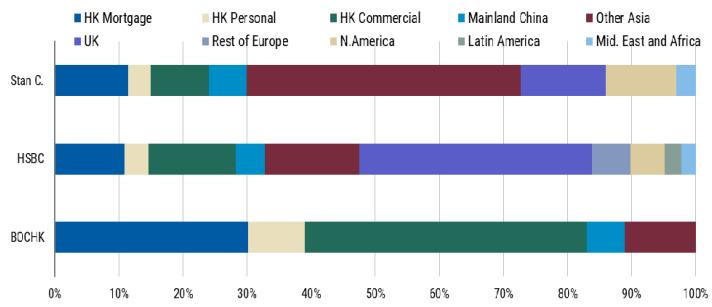

bar_stacked

| Category | HK Mortgage (%) | HK Personal (%) | HK Commercial (%) | Mainland China (%) | Other Asia (%) | UK (%) | Rest of Europe (%) | N.America (%) | Latin America (%) | Mid. East and Africa (%) |
| :--- | :--- | :--- | :--- | :--- | :--- | :--- | :--- | :--- | :--- | :--- |
| Stan C. | 10 | 5 | 10 | 5 | 45 | 20 | 0 | 0 | 0 | 5 |
| HSBC | 10 | 5 | 15 | 5 | 20 | 30 | 0 | 0 | 0 | 5 |
| BOCH-K | 30 | 10 | 40 | 5 | 15 | 0 | 0 | 0 | 0 | 0 |

Source: Company Reports, MS. Data as of FY25. Data based on legal location of guarantor; economic allocation of loans maybe different

Return Level   
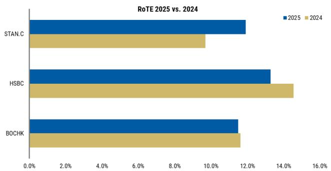

bar

RoTE 2025 vs. 2024
| Company | 2025 (%) | 2024 (%) |
| :--- | :--- | :--- |
| STAN.C | 11.8 | 9.7 |
| HSBC | 13.3 | 14.5 |
| BOCHK | 11.4 | 11.6 |

Source: Company Reports, MS

# Themes

Capital Position   
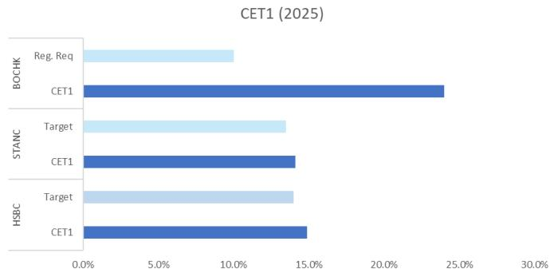

bar

CET1 (2025)
| Category | Value (%) |
| :--- | :--- |
| BOCHK | 10.0 |
| CET1 | 24.0 |
| STANC | 13.5 |
| CET1 | 14.0 |
| HSBC | 14.5 |
| Reg. Req | 10.0 |

Source: Company Reports, MS. Reg. req refers to   
Pillar 1. HK banks also have an undisclosed Pillar 2 requirement

Dividend Payout and Yield   
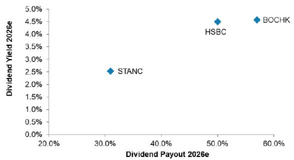

scatter

| Company | Dividend Payout 2026e | Dividend Yield 2026e |
|---------|------------------------|----------------------|
| STANC   | 30.0%                  | 2.5%                 |
| HSBC    | 50.0%                  | 4.5%                 |
| BOCHK  | 58.0%                  | 4.5%                 |

Source: Company data, MS

# Who are the HK Banks?

# HSBC (5.HK)

- A London-headquartered bank with a dominant market share in HK (33% group revenues) and a large presence in UK (20% group revenues). The rest of the group spread across the rest of Asia and Europe, the Middle East and the Americas.   
• A deposit-driven franchise with a strong CASA ratio, especially in HK. HSBC is rate sensitive.   
- The key differentiating factor is its global network, with a strong focus on leveraging that network to support trade and capital flows and to grow its wealth businesses.   
• RoE improving and the group targets 17% or better RoTE in each year from 2026 to 2028.   
• We expect increased IT investment as HSBC looks to transform its business.

# Standard Chartered (2888.HK)

• A London-headquartered, emerging markets-focused bank, with 60% of income from Asia, 6% from UAE and 14% from the UK and US. It has 81k employees across 54 markets.   
- It survived GFC well but was hit by credit problems in 2015-17. The turnaround and transformation are now complete. Management is focused on achieving leadership in four key areas, EM wholesale banking, mass retail, affluent client business (wealth) and sustainability.   
- RoTE is improving (11.9% in 2025), the key driver of share prices will be the extent to which RoTE can be lifted towards the >15% target by 2028e.

# BOCHK (2388.HK)

• 65.65% owned by Bank Of China (BOC).   
- HK-focused business, with 15%/20% deposit/loan market share in HK and a CASA ratio of 53.4%. Historically, it has grown loans and deposits ahead of the market.   
• CNY clearing bank, dominant market share in China-linked IPOs.   
- Mainland China presence is lower than other local HK banks (5% total loans). In 2016/17, it acquired most of BOC's ASEAN businesses.   
- Operates with a low cost/income ratio (\~24%), low credit costs (<50bps), and high capital ratios. \~50% dividend payout.

# II. THE FUNDAMENTALS

Returns Profile 

<table><tr><td>2025</td><td>Indonesia</td><td>Malaysia</td><td>Philippines</td><td>Singapore</td><td>Thailand</td><td>BOCHK</td><td>HSBC</td><td>Stan.C</td></tr><tr><td>Net int income</td><td>5.1%</td><td>2.1%</td><td>4.1%</td><td>1.6%</td><td>2.9%</td><td>1.2%</td><td>1.1%</td><td>1.3%</td></tr><tr><td>Interest income</td><td>7.3%</td><td>3.7%</td><td>5.9%</td><td>3.3%</td><td>4.0%</td><td>2.8%</td><td>3.1%</td><td>2.9%</td></tr><tr><td>Interest expense</td><td>-2.1%</td><td>-1.7%</td><td>-1.8%</td><td>-1.7%</td><td>-1.1%</td><td>1.6%</td><td>2.0%</td><td>1.6%</td></tr><tr><td>Non-int income</td><td>2.0%</td><td>0.8%</td><td>1.5%</td><td>0.9%</td><td>1.3%</td><td>0.6%</td><td>1.2%</td><td>1.1%</td></tr><tr><td>Net fee income</td><td>1.1%</td><td>0.3%</td><td>0.9%</td><td>0.1%</td><td>0.7%</td><td>0.3%</td><td>0.4%</td><td>0.5%</td></tr><tr><td>Non interest income</td><td>0.9%</td><td>0.5%</td><td>0.7%</td><td>0.9%</td><td>0.6%</td><td>0.3%</td><td>0.7%</td><td>0.6%</td></tr><tr><td>Operating income</td><td>7.1%</td><td>2.8%</td><td>5.6%</td><td>2.5%</td><td>4.1%</td><td>1.8%</td><td>2.3%</td><td>2.4%</td></tr><tr><td>Operating expense</td><td>-3.0%</td><td>-1.3%</td><td>-3.0%</td><td>-1.1%</td><td>-1.8%</td><td>0.4%</td><td>1.1%</td><td>1.5%</td></tr><tr><td>Pre-provision profit</td><td>4.1%</td><td>1.6%</td><td>2.6%</td><td>1.4%</td><td>2.3%</td><td>1.4%</td><td>1.2%</td><td>0.9%</td></tr><tr><td>Provision</td><td>-0.8%</td><td>-0.1%</td><td>-0.4%</td><td>-0.2%</td><td>-0.8%</td><td>0.2%</td><td>0.1%</td><td>0.1%</td></tr><tr><td>Loan Loss Provision</td><td>-0.9%</td><td>-0.1%</td><td>-0.4%</td><td>-0.2%</td><td>-0.8%</td><td>0.2%</td><td>0.1%</td><td>0.1%</td></tr><tr><td>Other provisions</td><td>0.2%</td><td>0.1%</td><td>0.0%</td><td>0.0%</td><td>0.0%</td><td>0.0%</td><td>0.0%</td><td>0.0%</td></tr><tr><td>Operating profits</td><td>3.3%</td><td>1.4%</td><td>2.2%</td><td>1.3%</td><td>1.4%</td><td>1.2%</td><td>1.2%</td><td>0.8%</td></tr><tr><td>Others</td><td>0.0%</td><td>0.0%</td><td>0.0%</td><td>0.1%</td><td>0.0%</td><td>0.0%</td><td>0.0%</td><td>0.0%</td></tr><tr><td>PBT</td><td>3.3%</td><td>1.4%</td><td>2.2%</td><td>1.3%</td><td>1.5%</td><td>1.1%</td><td>1.2%</td><td>0.8%</td></tr><tr><td>Tax</td><td>-0.7%</td><td>-0.3%</td><td>-0.4%</td><td>-0.2%</td><td>-0.3%</td><td>0.2%</td><td>0.2%</td><td>0.2%</td></tr><tr><td>PAT</td><td>2.6%</td><td>1.1%</td><td>1.8%</td><td>1.1%</td><td>1.2%</td><td>0.9%</td><td>0.7%</td><td>0.6%</td></tr><tr><td>Minorities</td><td>-0.1%</td><td>0.0%</td><td>0.0%</td><td>0.0%</td><td>-0.1%</td><td>0.0%</td><td>0.1%</td><td>0.1%</td></tr><tr><td>ROA</td><td>2.6%</td><td>1.1%</td><td>1.8%</td><td>1.1%</td><td>1.1%</td><td>0.9%</td><td>0.7%</td><td>0.5%</td></tr><tr><td>Leverage (x)</td><td>7.2</td><td>10.4</td><td>8.2</td><td>11.9</td><td>8.1</td><td>12.3</td><td>19.7</td><td>23.3</td></tr><tr><td>ROE</td><td>18.4%</td><td>11.2%</td><td>14.5%</td><td>13.2%</td><td>9.1%</td><td>11.4%</td><td>13.3%</td><td>12.0%</td></tr></table>

Source: Company Reports, MS

# Market Structure in ASEAN

Singapore   
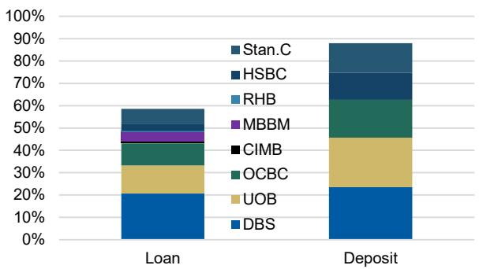

bar_stacked

| Category | DBS (%) | UOB (%) | OCBC (%) | CIMB (%) | MBBM (%) | RHB (%) | HSBC (%) | Stan.C (%) |
| :--- | :--- | :--- | :--- | :--- | :--- | :--- | :--- | :--- |
| Loan | 20 | 15 | 10 | 5 | 5 | 5 | 10 | 10 |
| Deposit | 23 | 24 | 18 | 0 | 0 | 0 | 15 | 15 |
Total: ~90%. The chart displays stacked bars representing the proportional allocation for each institution within a loan and deposit categories.

Malaysia   
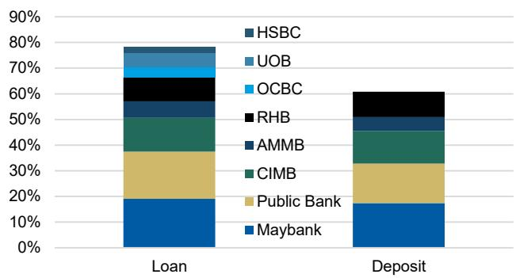

bar_stacked

| Category | HSBC (%) | UOB (%) | OCBC (%) | RHB (%) | AMMB (%) | CIMB (%) | Public Bank (%) | Maybank (%) |
| :--- | :--- | :--- | :--- | :--- | :--- | :--- | :--- | :--- |
| Loan | 20 | 5 | 10 | 10 | 5 | 10 | 15 | 5 |
| Deposit | 20 | 5 | 10 | 5 | 5 | 10 | 15 | 5 |

Philippines   
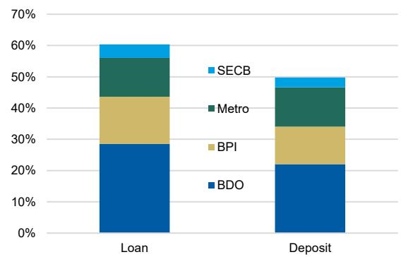

bar_stacked

| Category | SECB (%) | Metro (%) | BPI (%) | BDO (%) |
| :--- | :--- | :--- | :--- | :--- |
| Loan | 5 | 10 | 12 | 28 |
| Deposit | 3 | 10 | 10 | 22 |

Thailand   
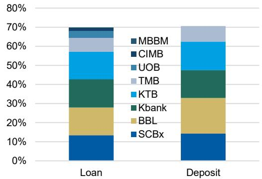

bar_stacked

| Category | MBBM (%) | CIMB (%) | UOB (%) | TMB (%) | KTB (%) | Kbank (%) | BBL (%) | SCBx (%) |
| :--- | :--- | :--- | :--- | :--- | :--- | :--- | :--- | :--- |
| Loan | 2 | 1 | 0 | 5 | 13 | 17 | 14 | 13 |
| Deposit | 0 | 0 | 0 | 0 | 12 | 14 | 20 | 14 |

Indonesia   
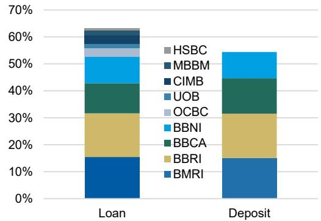

bar_stacked

| Category | HSBC (%) | MBBM (%) | CIMB (%) | UOB (%) | OCBC (%) | BBNI (%) | BBCA (%) | BBRI (%) | BMRI (%) |
| :--- | :--- | :--- | :--- | :--- | :--- | :--- | :--- | :--- | :--- |
| Loan | 2 | 1 | 0 | 5 | 3 | 10 | 10 | 15 | 2 |
| Deposit | 0 | 0 | 0 | 0 | 0 | 8 | 12 | 15 | 14 |

Source: Company Reports, Central Banks data, MS

# Market Shares in Hong Kong

Loan for use in HK market share   
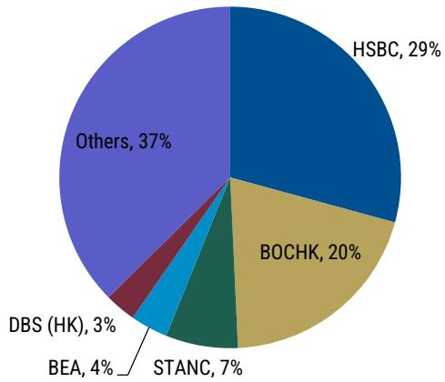

pie

| Entity | Percentage (%) |
| :--- | :--- |
| HSBC | 29 |
| BOCHK | 20 |
| STANC | 7 |
| BEA | 4 |
| DBS (HK) | 3 |
| Others | 37 |

Deposit market share   
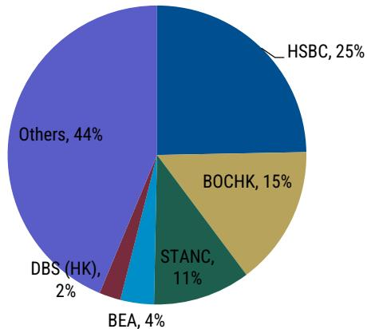

pie

| Entity | Percentage (%) |
| :--- | :--- |
| HSBC | 25 |
| BOCHK | 15 |
| STANC | 11 |
| BEA | 4 |
| DBS (HK) | 2 |
| Others | 44 |

Mortgage market share   
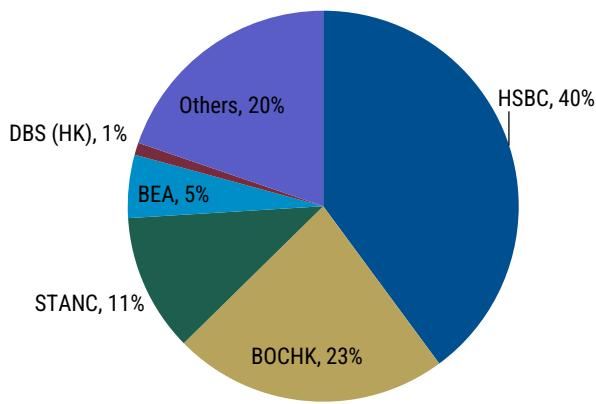

pie

| Category | Value (%) |
|---|---|
| HSBC | 40 |
| BOCHK | 23 |
| STANC | 11 |
| BEA | 5 |
| DBS (HK) | 1 |
| Others | 20 |

Credit card market share   
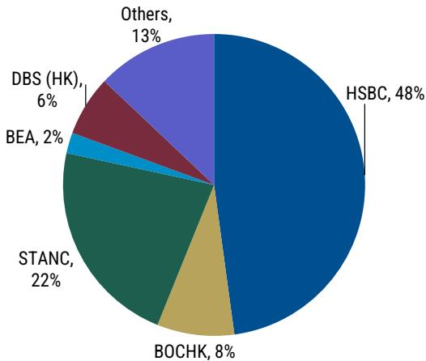

pie

| Entity | Percentage (%) |
| :--- | :--- |
| HSBC | 48 |
| STANC | 22 |
| BOCHK | 8 |
| BEA | 2 |
| DBS (HK) | 6 |
| Others | 13 |

Source: HKMA, Company Reports, MS; \* these are approximate market shares as company disclosure maybe inconsistent

# Bank Revenues are dominated by NII, except for HSBC and Standard Chartered

Revenue Split   
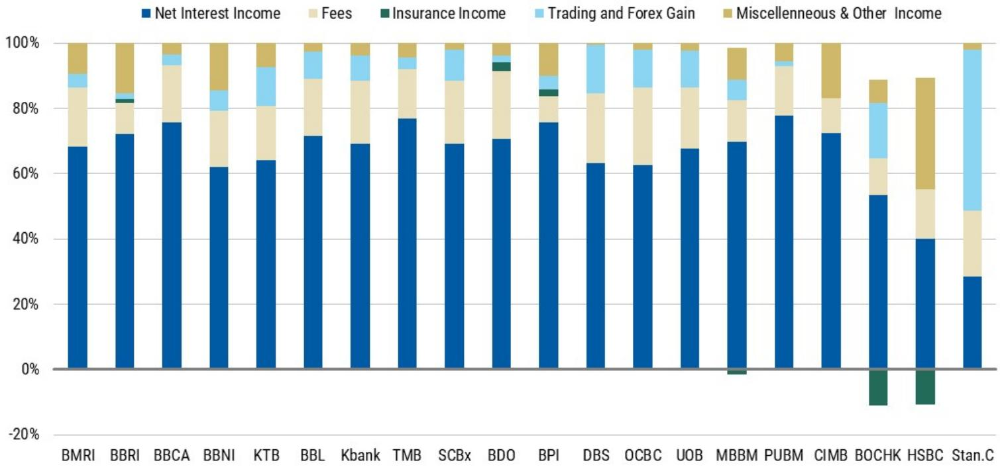

bar_stacked

| Entity | Net Interest Income (%) | Fees (%) | Insurance Income (%) | Trading and Forex Gain (%) | Miscellaneous & Other Income (%) |
| :--- | :--- | :--- | :--- | :--- | :--- |
| BMRI | 68 | 19 | 0 | 5 | 10 |
| BBRI | 72 | 13 | 2 | 1 | 14 |
| BBCA | 76 | 17 | 0 | 5 | 5 |
| BBNI | 62 | 17 | 0 | 8 | 13 |
| KTB | 64 | 17 | 0 | 13 | 10 |
| BBL | 71 | 17 | 0 | 8 | 5 |
| Kbank | 69 | 18 | 0 | 8 | 5 |
| TMB | 77 | 14 | 0 | 5 | 6 |
| SCBx | 69 | 17 | 0 | 10 | 5 |
| BDO | 70 | 18 | 3 | 2 | 5 |
| BPI | 76 | 7 | 3 | 4 | 12 |
| DBS | 63 | 22 | 0 | 14 | 1 |
| OCBC | 63 | 22 | 0 | 13 | 4 |
| UOB | 67 | 18 | 0 | 10 | 4 |
| MBBM | 69 | 13 | -2 | 8 | 12 |
| PUBM | 78 | 14 | 0 | 4 | 6 |
| CIMB | 72 | 9 | 0 | 0 | 15 |
| BOCHK | 53 | 10 | -12 | 15 | 8 |
| HSBC | 40 | 13 | -12 | 0 | 33 |
| Stan.C | 28 | 15 | 0 | 55 | 3 |

Source: Company Reports, MS

# Loan and Deposit Growth

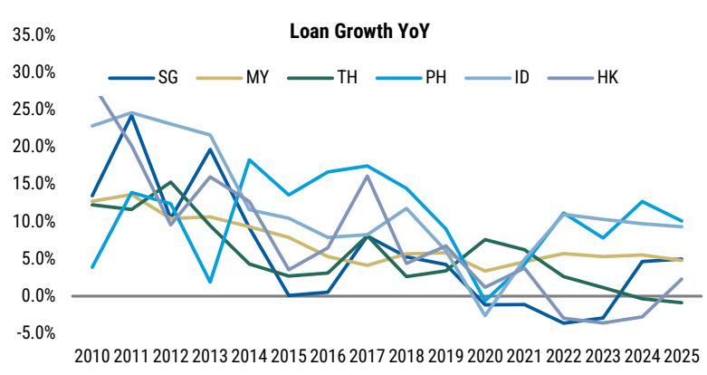

line

| Year | SG    | MY    | TH    | PH    | ID    | HK    |
|------|-------|-------|-------|-------|-------|-------|
| 2010 | 13.0% | 12.5% | 12.0% | 4.0%  | 23.0% | 27.0% |
| 2011 | 24.0% | 13.0% | 13.5% | 14.0% | 24.5% | 25.0% |
| 2012 | 11.0% | 11.5% | 14.0% | 10.0% | 23.0% | 10.5% |
| 2013 | 19.5% | 10.5% | 15.0% | 2.0%  | 22.0% | 15.5% |
| 2014 | 18.0% | 9.5%  | 4.0%  | 18.0% | 16.0% | 13.0% |
| 2015 | 0.0%  | 8.0%  | 3.0%  | 13.5% | 14.0% | 3.5%  |
| 2016 | 0.0%  | 7.5%  | 4.5%  | 16.5% | 12.5% | 6.0%  |
| 2017 | 8.0%  | 6.5%  | 7.5%  | 17.5% | 8.5%  | 16.0% |
| 2018 | 6.0%  | 5.5%  | 3.5%  | 14.5% | 6.5%  | 4.5%  |
| 2019 | -1.0% | 4.5%  | 3.0%  | 8.5%  | -3.0% | -1.5% |
| 2020 | -3.0% | -2.5% | -1.5% | -1.0% | -3.5% | -3.5% |
| 2021 | -2.5% | -2.0% | -1.0% | -1.5% | -2.5% | -3.0% |
| 2022 | -4.0% | -3.5% | -2.5% | -7.5% | -4.5% | -4.5% |
| 2023 | -3.5% | -3.0% | -3.0% | -6.5% | -3.5% | -4.0% |
| 2024 | -3.0% | -2.5% | -3.5% | -13.0%| -3.0% | -3.5% |
| 2025 | -2.5% | -2.0% | -4.0% | -9.5% | -2.5% | -2.0% |

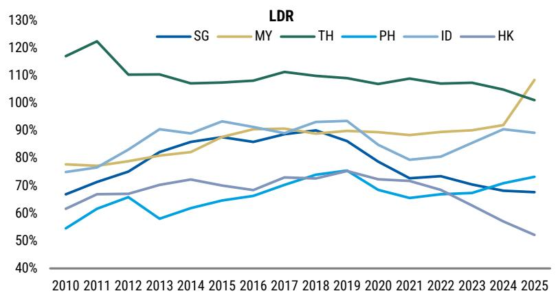

line

| Year | SG   | MY   | TH   | PH   | ID   | HK   |
|------|------|------|------|------|------|------|
| 2010 | 68%  | 78%  | 118% | 55%  | 75%  | 62%  |
| 2011 | 72%  | 79%  | 123% | 62%  | 76%  | 66%  |
| 2012 | 75%  | 80%  | 110% | 66%  | 85%  | 68%  |
| 2013 | 78%  | 82%  | 110% | 58%  | 90%  | 70%  |
| 2014 | 80%  | 83%  | 108% | 62%  | 88%  | 72%  |
| 2015 | 82%  | 85%  | 108% | 65%  | 93%  | 70%  |
| 2016 | 84%  | 87%  | 108% | 67%  | 90%  | 68%  |
| 2017 | 86%  | 89%  | 111% | 70%  | 92%  | 72%  |
| 2018 | 88%  | 90%  | 110% | 73%  | 93%  | 74%  |
| 2019 | 86%  | 89%  | 109% | 75%  | 94%  | 75%  |
| 2020 | 84%  | 88%  | 108% | 72%  | 85%  | 73%  |
| 2021 | 82%  | 89%  | 109% | 68%  | 79%  | 71%  |
| 2022 | 80%  | 89%  | 108% | 66%  | 80%  | 69%  |
| 2023 | 78%  | 90%  | 107% | 68%  | 85%  | 65%  |
| 2024 | 76%  | 91%  | 105% | 70%  | 90%  | 55%  |
| 2025 | 74%  | 109% | 101% | 73%  | 89%  | 52%  |

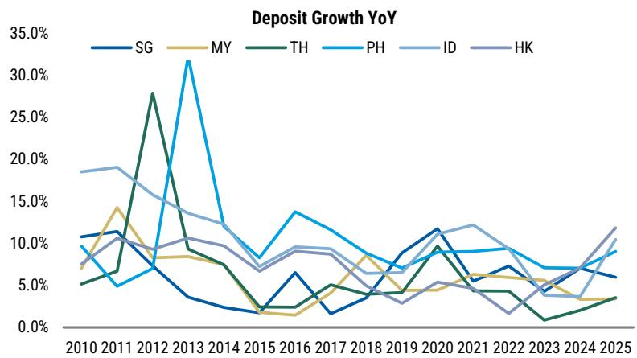

line

| Year | SG    | MY    | TH    | PH    | ID    | HK    |
|------|-------|-------|-------|-------|-------|-------|
| 2010 | 10.0% | 8.0%  | 5.0%  | 7.0%  | 18.0% | 9.0%  |
| 2011 | 11.0% | 14.0% | 6.0%  | 5.0%  | 19.0% | 10.0% |
| 2012 | 7.0%  | 8.0%  | 28.0% | 8.0%  | 16.0% | 9.0%  |
| 2013 | 3.0%  | 8.0%  | 9.0%  | 32.0% | 14.0% | 10.0% |
| 2014 | 2.0%  | 8.0%  | 7.0%  | 12.0% | 12.0% | 9.0%  |
| 2015 | 1.0%  | 8.0%  | 2.0%  | 8.0%  | 7.0%  | 6.0%  |
| 2016 | 6.0%  | 8.0%  | 2.0%  | 14.0% | 9.0%  | 9.0%  |
| 2017 | 2.0%  | 8.0%  | 5.0%  | 12.0% | 9.0%  | 9.0%  |
| 2018 | 4.0%  | 8.0%  | 4.0%  | 9.0%  | 6.0%  | 6.0%  |
| 2019 | 8.0%  | 8.0%  | 5.0%  | 7.0%  | 6.0%  | 3.0%  |
| 2020 | 12.0% | 8.0%  | 9.0%  | 9.0%  | 12.0% | 5.0%  |
| 2021 | 6.0%  | 8.0%  | 4.0%  | 9.0%  | 12.0% | 4.0%  |
| 2022 | 7.0%  | 8.0%  | 4.0%  | 9.0%  | 9.0%  | -1.0% |
| 2023 | -1.0% | -1.0% | -1.0% | -1.0% | -1.0% | -1.0% |
| 2024 | -1.0% | -1.0% | -1.0% | -1.0% | -1.0% | -1.0% |
| 2025 | -1.0% | -1.0% | -1.0% | -1.0% | -1.0% | -1.0% |

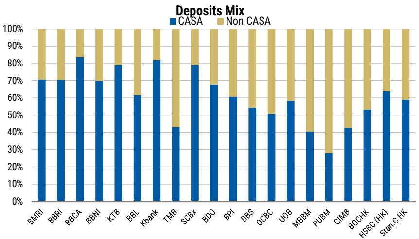

bar_stacked

| Bank | CASA | Non CASA |
|------|------|----------|
| BMRI | 70%  | 30%      |
| BBRI | 70%  | 30%      |
| BBCA | 83%  | 16%      |
| BBNI | 69%  | 39%      |
| KTB  | 78%  | 29%      |
| BBL  | 61%  | 49%      |
| Kbank| 82%  | 18%      |
| TMB  | 42%  | 68%      |
| SCBX | 78%  | 22%      |
| BDO  | 67%  | 33%      |
| BPI  | 60%  | 49%      |
| DBS  | 54%  | 65%      |
| OCBC | 50%  | 60%      |
| UOB  | 58%  | 42%      |
| MBBM | 40%  | 68%      |
| PUBM | 28%  | 82%      |
| CIMB | 42%  | 68%      |
| BOCHK| 53%  | 47%      |
| HSBC (HK) | 63% | 37%      |
| Stan.C.HK | 59% | 41%      |

Source: Company Reports, MS. Singapore LDR refers to S\$ LDR and there was a break in series in 2021 as MAS changed disclosure in July 2021.

# Fees Split

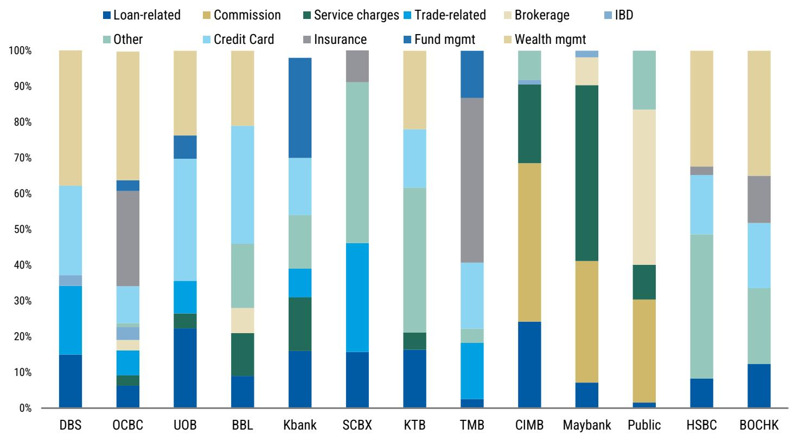  
Source: Company Reports, MS. Definition may vary across the banks mentioned.

Operating Expenses   
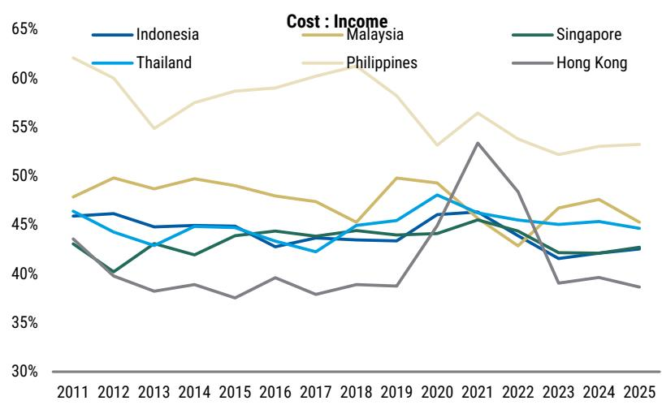

line

| Year | Indonesia | Malaysia | Singapore | Thailand | Philippines | Hong Kong |
|------|-----------|----------|-----------|----------|-------------|-----------|
| 2011 | 46%       | 48%      | 43%       | 46%      | 62%         | 43%       |
| 2012 | 46%       | 50%      | 40%       | 45%      | 60%         | 39%       |
| 2013 | 45%       | 49%      | 42%       | 44%      | 55%         | 38%       |
| 2014 | 45%       | 50%      | 43%       | 45%      | 57%         | 39%       |
| 2015 | 45%       | 49%      | 44%       | 45%      | 58%         | 38%       |
| 2016 | 43%       | 48%      | 44%       | 45%      | 59%         | 39%       |
| 2017 | 43%       | 47%      | 44%       | 43%      | 60%         | 38%       |
| 2018 | 43%       | 46%      | 45%       | 45%      | 61%         | 39%       |
| 2019 | 43%       | 50%      | 44%       | 46%      | 58%         | 39%       |
| 2020 | 46%       | 49%      | 45%       | 48%      | 53%         | 46%       |
| 2021 | 46%       | 47%      | 46%       | 47%      | 57%         | 53%       |
| 2022 | 43%       | 43%      | 45%       | 46%      | 54%         | 48%       |
| 2023 | 42%       | 47%      | 43%       | 45%      | 52%         | 39%       |
| 2024 | 42%       | 48%      | 43%       | 45%      | 53%         | 39%       |
| 2025 | 43%       | 46%      | 43%       | 45%      | 53%         | 38%       |

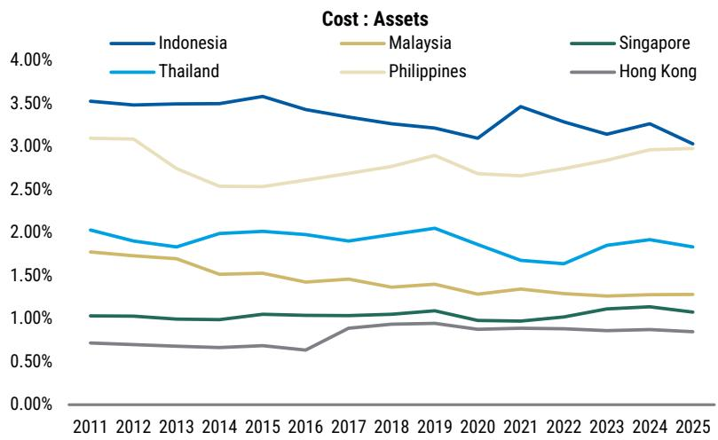

line

| Year | Indonesia | Malaysia | Singapore | Thailand | Philippines | Hong Kong |
|------|-----------|----------|-----------|----------|-------------|-----------|
| 2011 | 3.50%     | 1.80%    | 1.00%     | 2.00%    | 3.10%       | 0.70%     |
| 2012 | 3.45%     | 1.75%    | 1.00%     | 1.95%    | 3.10%       | 0.68%     |
| 2013 | 3.45%     | 1.70%    | 1.00%     | 1.85%    | 2.80%       | 0.65%     |
| 2014 | 3.45%     | 1.50%    | 1.00%     | 2.00%    | 2.50%       | 0.65%     |
| 2015 | 3.60%     | 1.50%    | 1.05%     | 2.00%    | 2.50%       | 0.65%     |
| 2016 | 3.45%     | 1.45%    | 1.05%     | 1.95%    | 2.60%       | 0.60%     |
| 2017 | 3.35%     | 1.45%    | 1.05%     | 1.90%    | 2.70%       | 0.85%     |
| 2018 | 3.30%     | 1.40%    | 1.05%     | 2.00%    | 2.80%       | 0.90%     |
| 2019 | 3.25%     | 1.40%    | 1.10%     | 2.10%    | 2.90%       | 0.95%     |
| 2020 | 3.15%     | 1.30%    | 1.05%     | 1.85%    | 2.70%       | 0.85%     |
| 2021 | 3.50%     | 1.35%    | 1.05%     | 1.70%    | 2.65%       | 0.85%     |
| 2022 | 3.35%     | 1.30%    | 1.05%     | 1.65%    | 2.75%       | 0.85%     |
| 2023 | 3.25%     | 1.25%    | 1.10%     | 1.85%    | 2.85%       | 0.85%     |
| 2024 | 3.30%     | 1.25%    | 1.15%     | 1.95%    | 2.95%       | 0.85%     |
| 2025 | 3.05%     | 1.25%    | 1.10%     | 1.85%    | 3.00%       | 0.85%     |

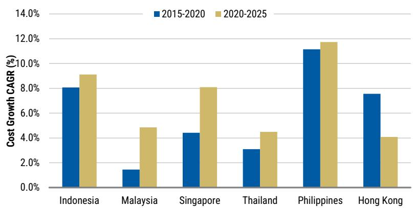

bar

| Country | 2015-2020 (%) | 2020-2025 (%) |
| :--- | :--- | :--- |
| Indonesia | 8.0 | 9.0 |
| Malaysia | 1.4 | 4.8 |
| Singapore | 4.3 | 8.0 |
| Thailand | 3.0 | 4.4 |
| Philippines | 11.1 | 11.7 |
| Hong Kong | 7.5 | 4.0 |

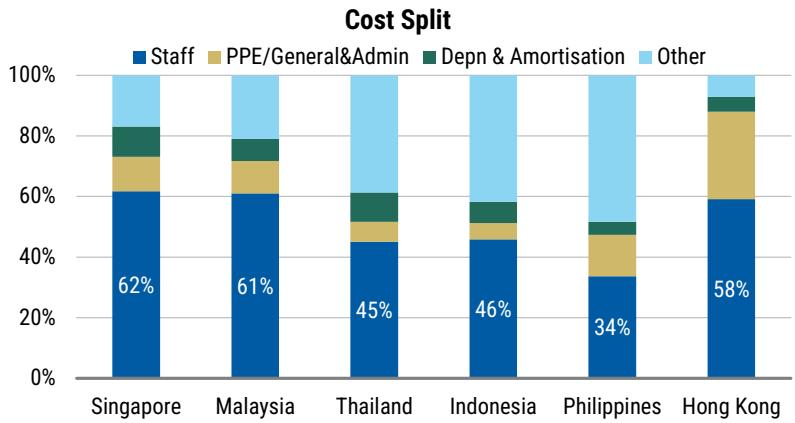

bar_stacked

| Country     | Staff | PPE/General&Admin | Depn & Amortisation | Other |
| ----------- | ----- | ----------------- | ------------------- | ----- |
| Singapore   | 62%   | 10%               | 10%                 | 15%   |
| Malaysia    | 61%   | 10%               | 5%                  | 20%   |
| Thailand    | 45%   | 5%                | 10%                 | 45%   |
| Indonesia   | 46%   | 5%                | 5%                  | 50%   |
| Philippines | 34%   | 15%               | 5%                  | 60%   |
| Hong Kong   | 58%   | 30%               | 5%                  | 10%   |

Source: Company Reports, MS. Hong Kong data include HSBC HK, Standard Chartered Hong Kong, and BOCHK

# Credit Quality and Provisions

Basic indicators of banks' asset quality: gross NPL ratio, special mentioned loans, restructured loans, provisioning coverage and cost of credit

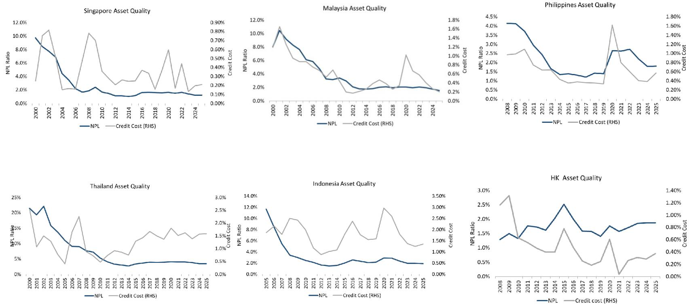  
Source: Company Reports, MS

# Capital & Dividend

CET1 Ratio   
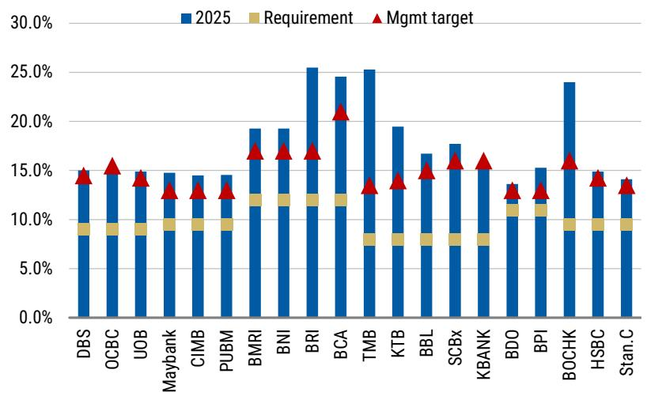

bar_stacked

| Bank | 2025 (%) | Requirement (%) | Mgmt target (%) |
| :--- | :--- | :--- | :--- |
| DBS | 8.5 | 1.0 | 14.5 |
| OCBC | 8.3 | 1.0 | 15.6 |
| UOB | 8.4 | 1.0 | 14.7 |
| Maybank | 8.9 | 1.0 | 13.3 |
| CIMB | 8.9 | 1.0 | 13.3 |
| PUBM | 8.9 | 1.0 | 13.3 |
| BMRI | 19.4 | 2.0 | 16.9 |
| BNI | 19.3 | 2.0 | 16.9 |
| BRI | 25.4 | 2.0 | 16.9 |
| BCA | 24.5 | 2.0 | 20.9 |
| TMB | 25.2 | 2.0 | 13.4 |
| KTB | 19.6 | 1.0 | 14.0 |
| BBL | 16.7 | 1.0 | 14.7 |
| SCBx | 17.8 | 1.0 | 15.7 |
| KBANK | 15.2 | 1.0 | 16.2 |
| BDO | 13.4 | 1.0 | 12.7 |
| BPI | 15.2 | 1.0 | 13.3 |
| BOCHK | 23.9 | 1.0 | 15.6 |
| HSBC | 14.9 | 1.0 | 14.4 |
| Stan.C | 13.7 | 1.0 | 13.9 |

Source: Company Reports, MS.   
Singapore banks CET1 refers to fully phased in CET1.

Capital return   
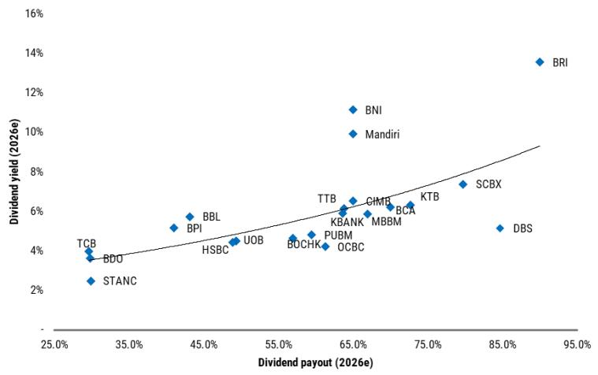

scatter

| Entity | Dividend payout (2026e) (%) | Dividend yield (2026e) (%) |
| :--- | :--- | :--- |
| BDI | 33.5 | 3.8 |
| STANC | 32.5 | 2.4 |
| TCB | 32.8 | 3.9 |
| BDO | 33.0 | 3.7 |
| BBI | 44.0 | 5.7 |
| HSBC | 46.5 | 4.4 |
| BBL | 44.5 | 5.1 |
| UOB | 47.0 | 4.5 |
| PUBM | 53.5 | 4.6 |
| OCBC | 53.8 | 4.1 |
| KTB | 73.5 | 7.3 |
| CHMR | 65.0 | 6.4 |
| MBBM | 66.0 | 6.0 |
| BCA | 73.5 | 6.1 |
| BNI | 65.0 | 11.0 |
| Mandiri | 87.0 | 10.0 |
| SCBX | 83.5 | 7.4 |
| DBS | 85.0 | 5.1 |
The chart plots dividend yield against dividend payout for various financial institutions. The x-axis represents dividend payout in percentage terms, and the y-axis represents dividend yield in percentage terms. The data points are labeled with the institution codes and corresponding dividend yields.

Source: Company Reports, MS

# III. KEY DEBATES?

# Total Shareholder Return and Valuation

Return on Equity   
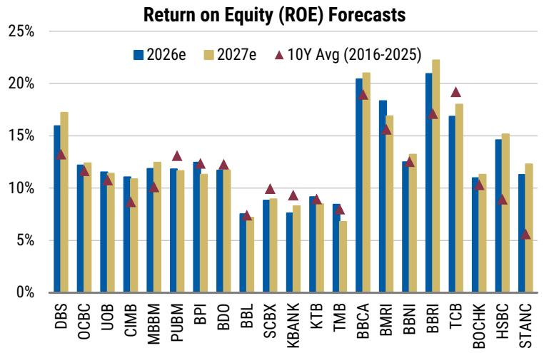

bar

|        | 2026e | 2027e | 10Y Avg (2016-2025) |
| ------ | ----- | ----- | ------------------- |
| DBS    | 15.8% | 17.2% | 13.0%               |
| OCBC   | 12.2% | 12.5% | 11.5%               |
| UOB    | 11.5% | 11.3% | 10.8%               |
| CIMB   | 11.0% | 10.8% | 8.5%                |
| MBBM   | 11.8% | 12.5% | 9.8%                |
| PUBM   | 11.8% | 11.8% | 13.2%               |
| BPI    | 12.5% | 11.5% | 12.8%               |
| BDO    | 11.8% | 11.8% | 12.5%               |
| BBL    | 7.5%  | 7.0%  | -                   |
| SCBX   | 9.0%  | -     | -                   |
| KBANK  | 7.5%  | -     | -                   |
| KTB    | 9.0%  | -     | -                   |
| TMB    | 8.5%  | -     | -                   |
| BBCA   | 20.5% | 21.0% | 19.0%               |
| BMRI   | 18.5% | 16.8% | 15.5%               |
| BBNI   | 12.5% | 13.2% | -                   |
| BBRI   | 21.0% | 22.5% | 17.0%               |
| TCB    | 16.8% | 17.8% | 19.5%               |
| BOCHK  | 10.8% | 11.2% | -                   |
| HSBC   | 14.5% | 15.0% | -                   |
| STANC  | 11.2% | 12.2% | -                   |

Total Shareholder Return   
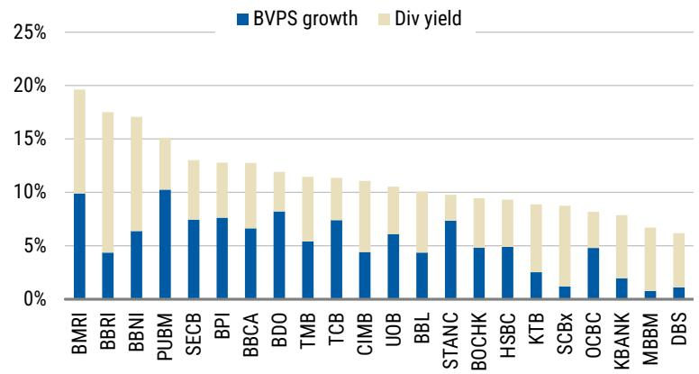

bar_stacked

| Entity | BVPS growth (%) | Div yield (%) |
| :--- | :--- | :--- |
| BMRI | 9.8 | 10.2 |
| BBRI | 4.3 | 15.6 |
| BBNI | 6.2 | 11.7 |
| PUBM | 10.1 | 5.3 |
| SECB | 7.3 | 5.6 |
| BPI | 7.4 | 5.3 |
| BBCA | 6.4 | 6.8 |
| BDO | 8.0 | 5.4 |
| TMB | 5.3 | 6.4 |
| TCB | 7.2 | 5.2 |
| CIMB | 4.4 | 7.0 |
| UOB | 6.0 | 4.8 |
| BBL | 4.3 | 6.1 |
| STANC | 7.2 | 4.9 |
| BOCHK | 4.8 | 5.6 |
| HSBC | 4.9 | 5.8 |
| KTB | 2.5 | 6.1 |
| SCBx | 1.0 | 6.7 |
| OCBC | 4.7 | 4.5 |
| KBANK | 1.8 | 5.9 |
| MBBM | 0.6 | 6.3 |
| DBS | 0.9 | 5.5 |
The chart displays two stacked bars per entity: blue for BVPS growth and beige for Div yield. The values are estimated based on the visual comparison of the stacked bars.

Source: Company Reports, e=MS estimates

# Wealth Management

Asia (Ex-China Onshore) AUM of the Top 15 Private Banks   
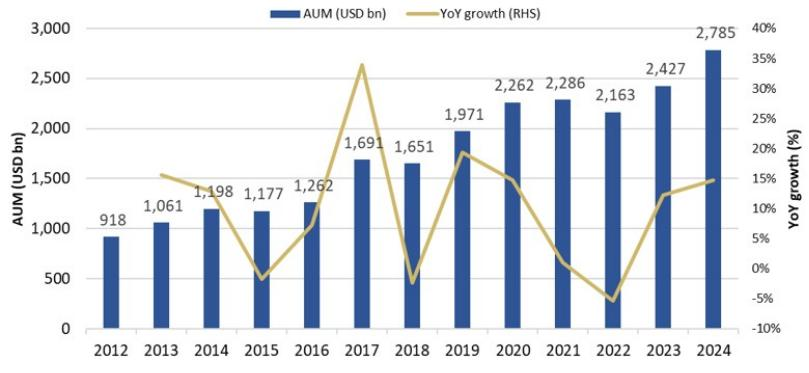

bar_line

| Year | AUM (USD bn) | YoY growth (%) |
|---|---|---|
| 2012 | 918 | - |
| 2013 | 1,061 | 15 |
| 2014 | 1,198 | 12 |
| 2015 | 1,177 | -3 |
| 2016 | 1,262 | 8 |
| 2017 | 1,691 | 35 |
| 2018 | 1,651 | -3 |
| 2019 | 1,971 | 20 |
| 2020 | 2,262 | 15 |
| 2021 | 2,286 | 0 |
| 2022 | 2,163 | -5 |
| 2023 | 2,427 | 13 |
| 2024 | 2,785 | 15 |

Total private banking AUM (Asia ex-China onshore)   
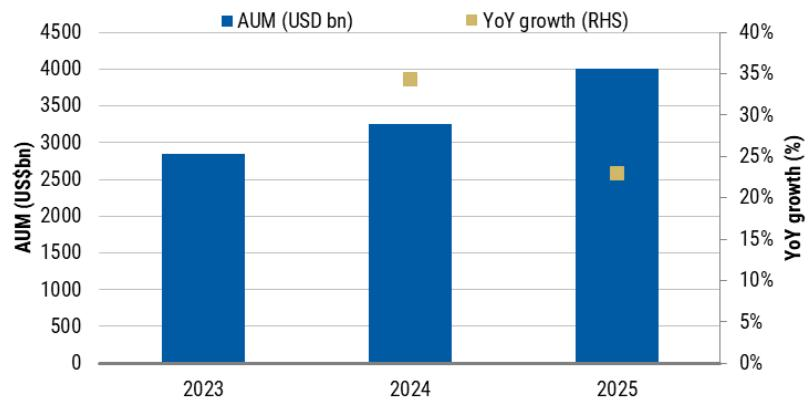

bar_line

| Year | AUM (USD bn) | YoY growth (%) |
|---|---|---|
| 2023 | 2850 | - |
| 2024 | 3250 | 35 |
| 2025 | 4000 | 23 |

Total Growth: Wealth AUM and Invested Assets – SG & HK banks   
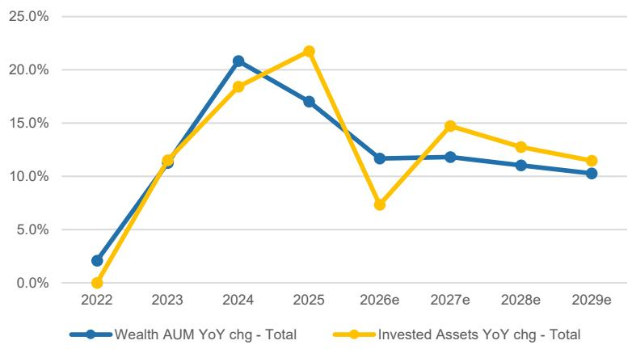

line

| Year | Wealth AUM YoY chg - Total (%) | Invested Assets YoY chg - Total (%) |
| :--- | :--- | :--- |
| 2022 | 2.0 | 0.0 |
| 2023 | 11.0 | 11.5 |
| 2024 | 20.8 | 18.5 |
| 2025 | 17.0 | 21.8 |
| 2026e | 11.5 | 7.3 |
| 2027e | 11.8 | 14.8 |
| 2028e | 11.0 | 12.9 |
| 2029e | 10.3 | 11.6 |

Net New Money and Invested Assets – SG & HK Banks   
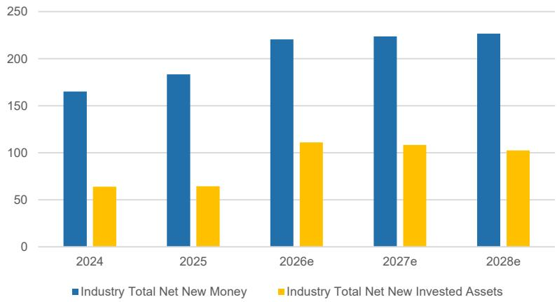

bar

| Year | Industry Total Net New Money | Industry Total Net New Invested Assets |
| :--- | :--- | :--- |
| 2024 | 165 | 63 |
| 2025 | 184 | 64 |
| 2026e | 220 | 111 |
| 2027e | 223 | 108 |
| 2028e | 226 | 102 |

Source: Asia Private Banker, Company Reports, e = MS estimates

# Singapore Equity Market Reform Timeline

# SGX ACTIONS

Strengthening Singapore's capital market • Enhancing access • Driving long-term value

# SGX – Nasdaq Dual Listing Bridge

Allows eligible companies to simultaneously raise capital and access liquidity in both Asia and the US using a single set of offering documents.

Consultation on the listing rule book was published in Jan 2026.

SGX RegCo announced new listing rules for GLB in April 2026.

Parliament has passed the Bill for Global Listing Board which is set to go live in the middle of 2026.

Who this targets

Quality growth companies with:

Market capitalisation of ≥ S\$2bn

An Asian nexus and global ambitions

At least 15% of the fundraising for the IPO or S\$75 million, whichever is higher, must be raised in Singapore.

# Value Unlock Programme

SGX is co-launching the S\$30m "Value Unlock" programme with MAS.

SGX's role focuses on:

• Helping listed companies improve investor communications   
• Supporting clearer articulation of strategy, capital allocation and value creation   
• Facilitating engagement platforms and peer learning with ecosystem partners

SGX RegCo proposes requiring disclosures for dividend, remuneration and IR policies.

What companies get

Grants (funded by MAS) to build capabilities in:

Corporate strategy

Capital optimisation

Investor relations

# Market Structure Enhancement

Modernise post-trade custody model: SGX will facilitate investor adoption of broker custody accounts. Retail investors will have the option of keeping their CDP direct accounts if they wish to do so. SGX published consultation paper in Jan 2026.

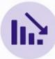

Lower board lot size to improve investor access – reducing the board lot size for securities above S\$10 per share from 100 to 10 units.

# Small and mid-cap Stocks

SGX Indices launched iEdge Singapore Next 50 Indices in Sep 2025 to track the top 50 mainboard companies by market capitalization, excluding the largest 30 constituents of the Straits Times Index (STI).

Institutions net-purchased small- and mid-cap stocks for a fourth consecutive month, as of end April, taking the 12-month tally to S\$700 million.

Collectively, these initiatives enhance market competitiveness, expand investor access and support sustainable value creation for Singapore-listed companies.

Equity Market Reform in Emerging ASEAN – Malaysia and Thailand   
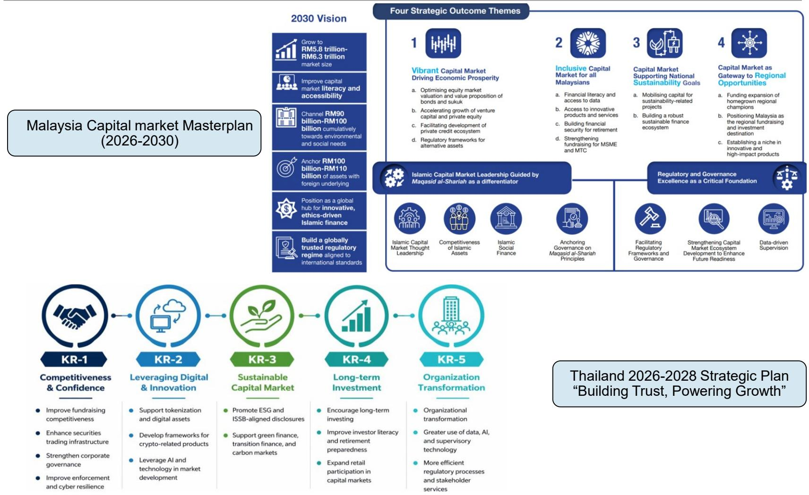

flowchart

```mermaid
graph TD
    A["2030 Vision"] --> B["Four Strategic Outcome Themes"]
    B --> C1["Vibrant Capital Market Driving Economic Prosperity"]
    B --> C2["Inclusive Capital Market for all Malaysians"]
    B --> C3["Capital Market Supporting National Sustainability Goals"]
    B --> C4["Capital Market as Gateway to Regional Opportunities"]
    A --> D1["Islamic Capital Market Leadership Guided by Maqasid al-Shariah as a differentiator"]
    B --> D2["Regulatory and Governance Excellence as a Critical Foundation"]
    A --> E1["KR-1: Competitiveness & Confidence"]
    A --> E2["KR-2: Leveraging Digital & Innovation"]
    A --> E3["KR-3: Sustainable Capital Market"]
    A --> E4["KR-4: Long-term Investment"]
    A --> E5["KR-5: Organization Transformation"]
    
    F["Thailand 2026-2028 Strategic Plan &quot;Building Trust, Powering Growth&quot;"] --> G1["● Improve fundraising competitiveness"]
    F --> G2["● Enhance securities trading infrastructure"]
    F --> G3["● Strengthen corporate governance"]
    F --> G4["● Improve enforcement and cyber resilience"]
    
    H["Malaysia Capital market Masterplan (2026-2030)"] --> I1["Grow to RM5.8 trillion-RM6.3 trillion market size"]
    H --> I2["Improve capital market literacy and accessibility"]
    H --> I3["Channel RM90 billion RM100 billion cumulatively towards environmental and social needs"]
    H --> I4["Anchor RM100 billion RM110 billion of assets with foreign underlying"]
    H --> I5["Position as a global hub for innovative, ethics-driven Islamic finance"]
    H --> I6["Build a globally trusted regulatory regime aligned to international standards"]
    
    J["Thailand 2026-2028 Strategic Plan &quot;Building Trust, Powering Growth&quot;"] --> K1["● Organizational transformation"]
    J --> K2["● Greater use of data, AI, and supervisory technology"]
    J --> K3["● More efficient regulatory processes and stakeholder services"]
    
    style A fill:#f9f9f9,stroke:#333
    style B fill:#e6f7ff,stroke:#333
    style C1 fill:#fff2cc,stroke:#333
    style C2 fill:#fff2cc,stroke:#333
    style C3 fill:#fff2cc,stroke:#333
    style C4 fill:#fff2cc,stroke:#333
```

Source: Securities Commission Malaysia, The Securities and Exchange Commission, Thailand, MS

Tokenization - Asian economies are in very different states of development and adoption 

<table><tr><td>Jurisdiction</td><td>Regulatory Posture</td><td>Wholesale CBDC</td><td>Retail CBDC</td><td>Tokenized Deposits</td><td>Tokenized Securities</td><td>Stablecoin Framework</td><td>Key Pilots/Live</td><td>Lead State Role</td></tr><tr><td>Hong Kong</td><td>Enabler</td><td>PILOT (Project Ensemble sandbox, Aug 2024)</td><td>PILOT: (eCNY cross-border; no plans for e-HKD)</td><td>LIVE: HSBC, Standard Chartered</td><td>LIVE (Govt digital green bonds, largest globally Nov 2025)</td><td>LIVE (Ordinance Aug 2025; HSBC/Anchorpoint licenses Apr 2026)</td><td>Ensemble+, mBridge</td><td>Moderate (HKMA infrastructure + private execution)</td></tr><tr><td>Singapore</td><td>Proactive Enabler</td><td>PILOT (SGD Testnet, Nov 2024)</td><td>Exploration through Project Orchid</td><td>LIVE (Project Guardian, DBS/OCBC/UOB/HSBC/Stan Chart)</td><td>LIVE (Guardian: fixed income, funds, FX)</td><td>Consultation 2024; finalization 2025</td><td>Guardian commercialization; GL1</td><td>Moderate (MAS as convener, private networks)</td></tr><tr><td>China</td><td>Cautious</td><td>Live (mBridge, cross-border and interbank)</td><td>Live (e-CNY App in 2022, Digital Deposit since Jan 1, 2026)</td><td>Outright Ban</td><td>Outright Ban</td><td>Outright Ban</td><td>mBridge</td><td>Low</td></tr><tr><td>Japan</td><td>Collaborative</td><td>PILOT (BoJ blockchain sandbox 2025-2026)</td><td>Under evaluation; no issuance decision made yet</td><td>Pilot stage led by individual banks</td><td>Framework established (STO regulations in place; ongoing incremental enhancements)</td><td>Yen stablecoin launched Oct 2025</td><td>Real Estate STOs, Tokenized Bond Trading, Tokenized Deposits DvP Pilot</td><td>Moderate (regulator-led framework with private-sector implementation)</td></tr><tr><td>Korea</td><td>Constructive but still pending comprehensive legislation</td><td>PILOT - Project Hangang: BoK-led wholesale CBDC infrastructure tested (currently in Phase-2)</td><td>No direct retail CBDC issuance; retail-facing tokenized deposit pilot through Project Hangang</td><td>Pilot through Project Hangang</td><td>Regulatory framework for tokenized securities passed in Jan 2026; detailed rules and KSD-led infrastructure under development</td><td>Proposed / under legislative debate: Digital Asset Basic Act / General Act proposals include KRW denominated stablecoins are under discussion but pending approval</td><td>Project Hangang (CBDC); KSD security-token platform</td><td>High: Public sector-led framework and infrastructure, but with active private-sector pre-positioning</td></tr><tr><td>Australia</td><td>Constructive</td><td>PILOT: (Project Acacia)</td><td>NO ISSUANCE: No clear public-interest case for retail CBDC at present</td><td>PILOT: Project Acacia</td><td>PILOT: Project Acacia</td><td>Developing: Stablecoins expected under stored-value / payment licensing reforms</td><td>Project Acacia; Project Atom.</td><td>Moderate: RBA, Treasury, ASIC and APRA</td></tr><tr><td>India</td><td>Calibrated developmental focus</td><td>PILOT (e₹ wholesale) - limited roll-out</td><td>PILOT stage (e₹ retail) - limited roll-out</td><td>Exploratory stage in certain products</td><td>Exploratory stage in certain products</td><td>Cautious approach (no private issuance)</td><td>1. e₹ cross-border - bilateral engagement with other countries, joined multilateral projects led by the BIS2. exploring welfare programmability</td><td>High (Regulator led)</td></tr><tr><td>Malaysia</td><td>Experimentation; Discussion paper on payments and sandbox (DAIH)</td><td>Participant in Project Mandala and Project Rialto. Experimenting integrating a CBDC into RENTAS</td><td>Not an area of focus</td><td>Pilots in DAIH by CIMB and Maybank</td><td>NA</td><td>Pilot of Ringitt stable coin for B2B settlement</td><td>Digitized deposits and Ringitt stablecoin</td><td>Moderate (BNM roadmap, private participation)</td></tr><tr><td>Thailand</td><td>Collaborative</td><td>LIVE PILOT (mBridge founding member, MVP 2024)</td><td>Retail CBDC has completed a real-value pilot, with no immediate issuance.</td><td>NA</td><td>NA</td><td>Proposed</td><td>mBridge cross-border</td><td>Moderate (BoT infrastructure + banks)</td></tr><tr><td>Indonesia</td><td>Early stage</td><td>Completed Proof of Concept in 2024</td><td>Exploration</td><td>NA</td><td>Pilot test and exploration (tokenised government bond)</td><td>Yes, stablecoins are classified as digital assets by OJK</td><td>Limited public activity</td><td>High (BI-led, capital control sensitivity)</td></tr><tr><td>Philippines</td><td>Exploratory</td><td>Completed Project Agila Proof of Concept</td><td>Not exploring</td><td>NA</td><td>Exploring governmeny bonds</td><td>Proposed</td><td>Limited pilots</td><td>Moderate (BSP frameworks in development)</td></tr></table>

Source: MS

# Hong Kong — A Hybrid Market Influenced by Key Global Trends and China Regulatory Influence

- As a regional financial center, it is important for HK to be at the forefront of developing digital assets. HK's digital asset development has been at least five years in the making, with the launch of project Evergreen alongside the Fintech 2025 strategy in 2021.   
- RWA and Tokenziation could provide opportunities for the HK capital market. However, the ban on tokenization of China-related assets could slow development.   
- Stablecoin usage remains crypto-focused, and penetration into key financial payment ecosystems hinges on progress of linking stablecoins from Hong Kong issuers to crypto trading.   
- On the positive side, we believe the development of stablecoin regulations will help certain financial firms from Hong Kong and mainland China to gain market share in the global crypto trading market. We see Futu as a key beneficiary of stablecoin development in the Hong Kong market.

# Project Ensemble

Focuses on wholesale CBDC infrastructure to support tokenized money interbank settlement. HKMA provides foundational rails, while banks commercialize.

# HKMA Stablecoin Ordinance

Granted the first stablecoin licenses to HSBC (planning HKD stablecoin 2H26) and a Standard Chartered-led consortium (Anchorpoint Financial) in April 2026.

# Singapore — Digital Assets an Important Component of Its Hub of Hubs Strategy

- Singapore probably represents the most advanced tokenization ecosystem in Asia, characterized by multi-participant networks, regulatory clarity, and a transition from pilot to commercialization.   
- MAS is keen to foster the development of digital currencies, but not speculation in cryptocurrencies. Project Dunbar involved the creation of central bank digital currencies and their use in settling international payments.

# Project Guardian

A collaborative initiative among policymakers — including international bodies such as the FCA (UK), FSA (JP) and IMF — associations and cooperatives such as SWIFT and ISDA, and the financial industry to enhance liquidity and market efficiency through asset tokenization

# Partior

Provides a ledger allowing banks and ultimately corporations to make secure, real-time, 24/7 transactions.

# Contour Network Hub

A digital treasury and trade platform hub that enables the digitalization of treasury and trade finance processes such as Letters of Credit (LCs) and bank guarantees.

# Project Dunbar

Involved the creation of central bank digital currencies and their use in settling international payments.

MAS has allowed regulated exchanges, including SGX, to set up cryptocurrency futures. DBS also has a digital asset exchange and provides digital asset storage to HNW customers.

# Emerging ASEAN — Slower Paced Adoption

# Malaysia

- Bank Negara Malaysia (BNM) launched the digital asset innovation hub (DAIH) in June 2025 and published a discussion paper "Asset Tokenisation in the Malaysian Financial Sector" in October 2025.   
- Three initiatives - Ringitt stablecoins for B2B settlement led by Standard Chartered and AirAsia; and two separate tokenized deposit initiatives from CIMB and Maybank.   
- The Securities Commission Malaysia (SCM) published the Capital Markets Masterplan 2026-2030 in 2026. It expects alternative assets will be increasingly important in Malaysia's capital markets and will look to expand and strengthen its regulation and surveillance in this space.

# Thailand

- The Bank of Thailand (BOT) has advanced tokenization across wholesale, retail, and cross-border domains through multiple initiatives over the past several years. Its wholesale CBDC journey started in 2018 with Project Inthanon, which engaged local participating banks to explore the feasibility of DLT to enhance Thailand's financial infrastructure.   
- Founding member for Project mBridge, a platform demonstrating enhanced efficiency of cross-border transactions using multi-currency CBDC compared to the current system by eliminating the correspondent banking network

# Indonesia

- Bank Indonesia pursued tokenization through Project Garuda in 2022, its CBDC initiative designed to explore the architecture of the Digital Rupiah. BI published a White Paper containing the high-level design of Digital Rupiah.   
• In December 2024, Bank Indonesia completed the proof of concept for Project Garuda.

# Philippines

- The Bangko Sentral ng Pilipinas (BSP) completed proof of concept of its wholesale central bank digital currency initiative, Project Agila, in 2024. The project engaged various FIs and tested the technology for large value payments.   
- BSP targets to issue its wholesale CBDC by 2029. BSP is also exploring the use of CBDC to settle government securities following the pilot of the tokenized treasury bonds.   
• The BSP has no immediate plans for retail CBDC.

# Disclosure Section

The information and opinions in MS were prepared or are disseminated by MS Asia Limited (which accepts the responsibility for its contents) and/or MS Asia (Singapore) Pte. (Registration number 199206298Z) and/or MS Asia (Singapore) Securities Pte Ltd (Registration number 200008434H), regulated by the Monetary Authority of Singapore (which accepts legal responsibility for its contents and should be contacted with respect to any matters arising from, or in connection with, MS), and/or MS Taiwan Limited and/or MS & Co International plc, Seoul Branch, and/or MS Australia Limited (A.B.N. 67 003 734 576, holder of Australian financial services license No. 233742, which accepts responsibility for its contents), and/or MS Wealth Management Australia Pty Ltd (A.B.N. 19 009 145 555, holder of Australian financial services license No. 240813, which accepts responsibility for its contents), and/or MS India Company Private Limited having Corporate Identification No (CIN) U22990MH1998PTC115305, regulated by the Securities and Exchange Board of India ("SEBI") and holder of licenses as a Research Analyst (SEBI Registration No. INH000001105); Stock Broker (SEBI Stock Broker Registration No. INZ000244438), Merchant Banker (SEBI Registration No. INM000011203), and depository participant with National Securities Depository Limited (SEBI Registration No. IN-DP-NSDL-567-2021) having registered office at Altimus, Level 39 & 40, Pandurang Budhkar Marg, Worli, Mumbai 400018, India; Telephone no. +91-22-61181000; Compliance Officer Details: Mr. Tejarshi Hardas, Tel. No.: +91-22-61181000 or Email: tejarshi.hardas@morganstanley.com; Grievance officer details: Mr. Tejarshi Hardas, Tel. No.: +91-22-61181000 or Email: msic-compliance@morganstanley.com which accepts the responsibility for its contents and should be contacted with respect to any matters arising from, or in connection with, MS, and their affiliates (collectively, "MS"). MS India Company Private Limited (MSICPL) may use AI tools in providing research services. All recommendations contained herein are made by the duly qualified research analysts.

For important disclosures, stock price charts and equity rating histories regarding companies that are the subject of this report, please see the MS Disclosure Website at www.morganstanley.com/eqr/disclosures/webapp/generalresearch, or contact your investment representative or MS at 1585 Broadway, (Attention: Research Management), New York, NY, 10036 USA.

For valuation methodology and risks associated with any recommendation, rating or price target referenced in this research report, please contact the Client Support Team as follows: US/Canada +1800 303-2495; Hong Kong +852 2848-5999; Latin America +1718 754-5444 (U.S.); London +44 (0)20-7425-8169; Singapore +65 6834-6860; Sydney +61(0)2-9770-1505; Tokyo +81(0)3-6836-9000. Alternatively you may contact your investment representative or MS at 1585 Broadway, (Attention: Research Management), New York, NY 10036 USA.

# Analyst Certification

The following analysts hereby certify that their views about the companies and their securities discussed in this report are accurately expressed and that they have not received and will not receive direct or indirect compensation in exchange for expressing specific recommendations or views in this report: Selvie Jusman, CFA; Nick Lord.

# Global Research Conflict Management Policy

MS has been published in accordance with our conflict management policy, which is available at www.morganstanley.com/institutional/research/conflictpolicies. A Portuguese version of the policy can be found at www.morganstanley.com.br

# Important Regulatory Disclosures on Subject Companies

As of April 30, 2026, MS beneficially owned 1% or more of a class of common equity securities of the following companies covered in MS: Vietnam Technological and Commercial JSB.

Within the last 12 months, MS managed or co-managed a public offering (or 144A offering) of securities of Bangkok Bank Public Company Limited.

Within the last 12 months, MS has received compensation for investment banking services from Bangkok Bank Public Company Limited.

In the next 3 months, MS expects to receive or intends to seek compensation for investment banking services from Bangkok Bank Public Company Limited, Bank Central Asia, Bank Jago Tbk PT, Bank Mandiri, Bank Negara Indonesia, Bank of the Philippine Islands, Bank Rakyat Indonesia, BDO Unibank, CIMB Group, DBS Group Holdings, Maybank, Oversea-Chinese Banking Corp, Public Bank, SCB X PCL, Security Bank Corporation, Singapore Exchange Ltd, United Overseas Bank, Vietnam Technological and Commercial JSB.

Within the last 12 months, MS has received compensation for products and services other than investment banking services from Bangkok Bank Public Company Limited, Bank Central Asia, Bank Mandiri, Bank of the Philippine Islands, Bank Rakyat Indonesia, BDO Unibank, CIMB Group, DBS Group Holdings, Kasikorn Bank Public Company, Krung Thai Bank Public Company, Maybank, Oversea-Chinese Banking Corp, Public Bank, SCB X PCL, Security Bank Corporation, United Overseas Bank.

Within the last 12 months, MS has provided or is providing investment banking services to, or has an investment banking client relationship with, the following company: Bangkok Bank Public Company Limited, Bank Central Asia, Bank Jago Tbk PT, Bank Mandiri, Bank Negara Indonesia, Bank of the Philippine Islands, Bank Rakyat Indonesia, BDO Unibank, CIMB Group, DBS Group Holdings, Maybank, Oversea-Chinese Banking Corp, Public Bank, SCB X PCL, Security Bank Corporation, Singapore Exchange Ltd, United Overseas Bank, Vietnam Technological and Commercial JSB.

Within the last 12 months, MS has either provided or is providing non-investment banking, securities-related services to and/or in the past has entered into an agreement to provide services or has a client relationship with the following company: Bangkok Bank Public Company Limited, Bank Central Asia, Bank Mandiri, Bank Negara Indonesia, Bank of the Philippine Islands, Bank Rakyat Indonesia, BDO Unibank, CIMB Group, DBS Group Holdings, Kasikorn Bank Public Company, Krung Thai Bank Public Company, Maybank, Oversea-Chinese Banking Corp, Public Bank, SCB X PCL, Security Bank Corporation, Singapore Exchange Ltd, United Overseas Bank.

An employee, director or consultant of MS is a director of Bangkok Bank Public Company Limited. This person is not a research analyst or a member of a research analyst's household.

The equity research analysts or strategists principally responsible for the preparation of MS have received compensation based upon various factors, including quality of research, investor client feedback, stock picking, competitive factors, firm revenues and overall investment banking revenues. Equity Research analysts' or strategists' compensation is not linked to investment banking or capital markets transactions performed by MS or the profitability or revenues of particular trading desks.

MS and its affiliates do business that relates to companies/instruments covered in MS, including market making, providing liquidity, fund management, commercial banking, extension of credit, investment services and investment banking. MS sells to and buys from customers the securities/instruments of companies covered in MS on a principal basis. MS may have a position in the debt of the Company or instruments discussed in this report. MS trades or may trade as principal in the debt securities (or in related derivatives) that are the subject of the debt research report.

Certain disclosures listed above are also for compliance with applicable regulations in non-US jurisdictions.

# STOCK RATINGS

MS uses a relative rating system using terms such as Overweight, Equal-weight, Not-Rated or Underweight (see definitions below). MS does not assign ratings of Buy, Hold or Sell to the stocks we cover. Overweight, Equal-weight, Not-Rated and Underweight are not the equivalent of buy, hold and sell. Investors should carefully read the definitions of all ratings used in MS. In addition, since MS contains more complete information concerning the analyst's views, investors should carefully read MS, in its entirety, and not infer the contents from the rating alone. In any case, ratings (or research) should not be used or relied upon as investment advice. An investor's decision to buy or sell a stock should depend on individual circumstances (such as the investor's existing holdings) and other considerations.

# Global Stock Ratings Distribution

(as of May 31, 2026)

The Stock Ratings described below apply to MS's Fundamental Equity Research and do not apply to Debt Research produced by the Firm.

For disclosure purposes only (in accordance with FINRA requirements), we include the category headings of Buy, Hold, and Sell alongside our ratings of Overweight, Equal-weight, Not-Rated and Underweight. MS does not assign ratings of Buy, Hold or Sell to the stocks we cover. Overweight, Equal-weight, Not-Rated and Underweight are not the equivalent of buy, hold, and sell but represent recommended relative weightings (see definitions below). To satisfy regulatory requirements, we correspond Overweight, our most positive stock rating, with a buy recommendation; we correspond Equal-weight and Not-Rated to hold and Underweight to sell recommendations, respectively.

<table><tr><td></td><td colspan="2">Coverage Universe</td><td colspan="3">Investment Banking Clients (IBC)</td><td colspan="2">Other Material Investment Services Clients (MISC)</td></tr><tr><td>Stock Rating Category</td><td>Count</td><td>% of Total</td><td>Count</td><td>% of Total IBC</td><td>% of Rating Category</td><td>Count</td><td>% of Total Other MISC</td></tr><tr><td>Overweight/Buy</td><td>1542</td><td>42%</td><td>465</td><td>51%</td><td>30%</td><td>707</td><td>43%</td></tr><tr><td>Equal-weight/Hold</td><td>1571</td><td>43%</td><td>369</td><td>40%</td><td>23%</td><td>723</td><td>44%</td></tr><tr><td>Not-Rated/Hold</td><td>3</td><td>0%</td><td>0</td><td>0%</td><td>0%</td><td>1</td><td>0%</td></tr><tr><td>Underweight/Sell</td><td>551</td><td>15%</td><td>86</td><td>9%</td><td>16%</td><td>201</td><td>12%</td></tr><tr><td>Total</td><td>3,667</td><td></td><td>920</td><td></td><td></td><td>1632</td><td></td></tr></table>

Data include common stock and ADRs currently assigned ratings. Investment Banking Clients are companies from whom MS received investment banking compensation in the last 12 months. Due to rounding off of decimals, the percentages provided in the "% of total" column may not add up to exactly 100 percent.

# Analyst Stock Ratings

Overweight (O). The stock's total return is expected to exceed the average total return of the analyst's industry (or industry team's) coverage universe, on a risk-adjusted basis, over the next 12-18 months.

Equal-weight (E). The stock's total return is expected to be in line with the average total return of the analyst's industry (or industry team's) coverage universe, on a risk-adjusted basis, over the next 12-18 months.

Not-Rated (NR). Currently the analyst does not have adequate conviction about the stock's total return relative to the average total return of the analyst's industry (or industry team's) coverage universe, on a risk-adjusted basis, over the next 12-18 months.

Underweight (U). The stock's total return is expected to be below the average total return of the analyst's industry (or industry team's) coverage universe, on a risk-adjusted basis, over the next 12-18 months.

Unless otherwise specified, the time frame for price targets included in MS is 12 to 18 months.

# Analyst Industry Views

Attractive (A): The analyst expects the performance of his or her industry coverage universe over the next 12-18 months to be attractive vs. the relevant broad market benchmark, as indicated below.

In-Line (I): The analyst expects the performance of his or her industry coverage universe over the next 12-18 months to be in line with the relevant broad market benchmark, as indicated below.

Cautious (C): The analyst views the performance of his or her industry coverage universe over the next 12-18 months with caution vs. the relevant broad market benchmark, as indicated below.

Benchmarks for each region are as follows: North America - S&P 500; Latin America - relevant MSCI country index or MSCI Latin America Index; Europe - MSCI Europe; Japan - TOPIX; Asia - relevant MSCI country index or MSCI sub-regional index or MSCI AC Asia Pacific ex Japan Index.

# Important Disclosures for MS Smith Barney LLC Customers

Important disclosures regarding any material conflict of interest that can reasonably be expected to have influenced MS Smith Barney LLC's choice of a third-party research provider or the subject company of a third-party research report, are available on the MS Wealth Management disclosure website at www.morganstanley.com/online/researchdisclosures. For MS specific disclosures, you may refer to https://www.morganstanley.com/eqr/disclosures/webapp/generalresearch.

Each MS report is reviewed and approved on behalf of MS Smith Barney LLC. This review and approval is conducted by the same person who reviews the research report on behalf of MS. This could create a conflict of interest.

# Other Important Disclosures

MS policy is to update research reports as and when the Research Analyst and Research Management deem appropriate, based on developments with the issuer, the sector, or the market that may have a material impact on the research views or opinions stated therein. In addition, certain Research publications are intended to be updated on a regular periodic basis (weekly/monthly/quarterly/annual) and will ordinarily be updated with that frequency, unless the Research Analyst and Research Management determine that a different publication schedule is appropriate based on current conditions.

MS is not acting as a municipal advisor and the opinions or views contained herein are not intended to be, and do not constitute, advice within the meaning of Section 975 of the Dodd-Frank Wall Street Reform and Consumer Protection Act. MS produces an equity research product called a "Tactical Idea." Views contained in a "Tactical Idea" on a particular stock may be contrary to the recommendations or views expressed in research on the same stock. This may be the result of differing time horizons, methodologies, market events, or other factors. For all research available on a particular stock, please contact your sales representative or go to Matrix at http://www.morganstanley.com/matrix.

MS is provided to our clients through our proprietary research portal on Matrix and also distributed electronically by MS to clients. Certain, but not all, MS products are also made available to clients through third-party vendors or redistributed to clients through alternate electronic means as a convenience. For access to all available MS, please contact your sales representative or go to Matrix at http://www.morganstanley.com/matrix.Any access and/or use of MS is subject to MS's Terms of Use (http://www.morganstanley.com/terms.html). By accessing and/or using MS, you are indicating that you have read and agree to be bound by our Terms of Use (http://www.morganstanley.com/terms.html). In addition you consent to MS processing your personal data and using cookies in accordance with our Privacy Policy and our Global Cookies Policy (http://www.morganstanley.com/privacy\_pledge.html), including for the purposes of setting your preferences and to collect readership data so that we can deliver better and more personalized service and products to you. To find out more information about how MS processes personal data, how we use cookies and how to reject cookies see our Privacy Policy and our Global Cookies Policy (http://www.morganstanley.com/privacy\_pledge.html). Please use the provided link to review the Terms and Conditions and Most Important Terms and Conditions for MS India Company Private Limited (https://www.morganstanley.com/assets/pdfs/about-us-global-offices/india/Terms\_and\_conditions.pdf) and the following link to review the audit report (https://ny.matrix.ms.com/eqr/research/webapp/researchdocs/MSICPL\_Morgan\_Stanley\_Research\_Audit\_Report.pdf).

If you do not agree to our Terms of Use and/or if you do not wish to provide your consent to MS processing your personal data or using cookies please do not access our research.

MS does not provide individually tailored investment advice. MS has been prepared without regard to the circumstances and objectives of those who receive it. MS recommends that investors independently evaluate particular investments and strategies, and encourages investors to seek the advice of a financial adviser. The appropriateness of an investment or strategy will depend on an investor's circumstances and objectives. The securities, instruments, or strategies discussed in MS may not be suitable for all investors, and certain investors may not be eligible to purchase or participate in some or all of them. MS is not an offer to buy or sell or the solicitation of an offer to buy or sell any security/instrument or to participate in any particular trading strategy. The value of and income from your investments may vary because of changes in interest rates, foreign exchange rates, default rates, prepayment rates, securities/instruments prices, market indexes, operational or financial conditions of companies or other factors. There may be time limitations on the exercise of options or other rights in securities/instruments transactions. Past performance is not necessarily a guide to future performance. Estimates of future performance are based on assumptions that may not be realized. If provided, and unless otherwise stated, the closing price on the cover page is that of the primary exchange for the subject company's securities/instruments.

The fixed income research analysts, strategists or economists principally responsible for the preparation of MS have received compensation based upon various factors, including quality, accuracy and value of research, firm profitability or revenues (which include fixed income trading and capital markets profitability or revenues), client feedback and competitive factors. Fixed Income Research analysts', strategists' or economists' compensation is not linked to investment banking or capital markets transactions performed by MS or the profitability or revenues of particular trading desks.

The "Important Regulatory Disclosures on Subject Companies" section in MS lists all companies mentioned where MS owns 1% or more of a class of common equity securities of the companies. For all other companies mentioned in MS, MS may have an investment of less than 1% in securities/instruments or derivatives of securities/instruments of companies and may trade them in ways different from those discussed in MS. Employees of MS not involved in the preparation of MS may have investments in securities/instruments or derivatives of securities/instruments of companies mentioned and may trade them in ways different from those discussed in MS. Derivatives may be issued by MS or associated persons.

With the exception of information regarding MS, MS is based on public information. MS makes every effort to use reliable, comprehensive information, but we make no representation that it is accurate or complete. We have no obligation to tell you when opinions or information in MS change apart from when we intend to discontinue equity research coverage of a subject company. Facts and views presented in MS have not been reviewed by, and may not reflect information known to, professionals in other MS business areas, including investment banking personnel.

MS personnel may participate in company events such as site visits and are generally prohibited from accepting payment by the company of associated expenses unless pre-approved by authorized members of Research management. MS may make investment decisions that are inconsistent with the recommendations or views in this report.

To our readers based in Taiwan or trading in Taiwan securities/instruments: Information on securities/instruments that trade in Taiwan is distributed by MS Taiwan Limited ("MSTL"). Such information is for your reference only. The reader should independently evaluate the investment risks and is solely responsible for their investment decisions. MS may not be distributed to the public media or quoted or used by the public media without the express written consent of MS. Any non-customer reader within the scope of Article 7-1 of the Taiwan Stock Exchange Recommendation Regulations accessing and/or receiving MS is not permitted to provide MS to any third party (including but not limited to related parties, affiliated companies and any other third parties) or engage in any activities regarding MS which may create or give the appearance of creating a conflict of interest. Information on securities/instruments that do not trade in Taiwan is for informational purposes only and is not to be construed as a recommendation or a solicitation to trade in such securities/instruments. MSTL may not execute transactions for clients in these securities/instruments.

Certain information in MS was sourced by employees of the Shanghai Representative Office of MS Asia Limited for the use of MS Asia Limited.

MS is not incorporated under PRC law and the research in relation to this report is conducted outside the PRC. MS does not constitute an offer to sell or the solicitation of an offer to buy any securities in the PRC. PRC investors shall have the relevant qualifications to invest in such securities and shall be responsible for obtaining all relevant approvals, licenses, verifications and/or registrations from the relevant governmental authorities themselves. Neither this report nor any part of it is intended as, or shall constitute, provision of any consultancy or advisory service of securities investment as defined under PRC law. Such information is provided for your reference only.

MS is disseminated in Brazil by MS C.T.V.M. S.A. located at Av. Brigadeiro Faria Lima, 3600, 6th floor, São Paulo - SP, Brazil; and is regulated by the Comissão de Valores Mobiliários; in Mexico by MS México, Casa de Bolsa, S.A. de C.V which is regulated by Comision Nacional Bancaria y de Valores. Paseo de los Tamarindos 90, Torre 1, Col. Bosques de las Lomas Floor 29, 05120 Mexico City; in Japan by MS MUFG Securities Co., Ltd. and, for Commodities related research reports only, MS Capital Group Japan Co., Ltd; in Hong Kong by MS Asia Limited (which accepts responsibility for its contents) and by MS Bank Asia Limited; in Singapore by MS Asia (Singapore) Pte. (Registration number 199206298Z) and/or MS Asia (Singapore) Securities Pte Ltd (Registration number 200008434H), regulated by the Monetary Authority of Singapore (which accepts legal responsibility for its contents and should be contacted with respect to any matters arising from, or in connection with, MS) and by MS Bank Asia Limited, Singapore Branch (Registration number T14FC0118); in Australia to "wholesale clients" within the meaning of the Australian Corporations Act by MS Australia Limited A.B.N. 67 003 734 576, holder of Australian financial services license No. 23374-2, which accepts responsibility for its contents; in Australia to "wholesale clients" and "retail clients" within the meaning of the Australian Corporations Act by MS Wealth Management Australia Pty Ltd (A.B.N. 19 009 145 555, holder of Australian financial services license No. 240813, which accepts responsibility for its contents; in Korea by MS & Co International plc, Seoul Branch; in India by MS India Company Private Limited having Corporate Identification No (CIN) U22990MH1998PTC115305, regulated by the Securities and Exchange Board of India ("SEBI") and holder of licenses as a Research Analyst (SEBI Registration No. INH000001105); Stock Broker (SEBI Stock Broker Registration No. INZ000244438), Merchant Banker (SEBI Registration No. INM000011203), and depository participant with National Securities Depository Limited (SEBI Registration No. IN-DP-NSDL-567-2021) having registered office at Altimus, Level 39 & 40, Pandurang Budhkar Marg, Worli, Mumbai 400018, India; Telephone no. +91-22-61181000; Compliance Officer Details: Mr. Tejarshi Hardas, Tel. No.: +91-22-61181000 or Email: tejarshi.hardas@morganstanley.com; Grievance officer details: Mr. Tejarshi Hardas, Tel. No.: +91-22-61181000 or Email: msic-compliance@morganstanley.com. MS India Company Private Limited (MSICPL) may use AI tools in providing research services. All recommendations contained herein are made by the duly qualified research analysts; in Canada by MS Canada Limited; in Germany and the European Economic Area where required by MS Europe S.E., authorised and regulated by Bundesanstalt fuer Finanzdienstleistungsaufsicht (BaFin) under the reference number 149169; in the US by MS & Co. LLC, which accepts responsibility for its contents. MS & Co. International plc, authorized by the Prudential Regulation Authority and regulated by the Financial Conduct Authority and the Prudential Regulation Authority, disseminates in the UK research that it has prepared, and research which has been prepared by any of its affiliates, only to persons who (i) are investment professionals falling within Article 19(5) of the Financial Services and Markets Act 2000 (Financial Promotion) Order 2005 (as amended, the "Order"); (ii) are persons who are high net worth entities falling within Article 49(2)(a) to (d) of the Order; or (iii) are persons to whom an invitation or inducement to engage in investment activity (within the meaning of section 21 of the Financial Services and Markets Act 2000, as amended) may otherwise lawfully be communicated or caused to be communicated. RMB MS Proprietary Limited is a member of the JSE Limited and A2X (Pty) Ltd. RMB MS Proprietary Limited is a joint venture owned equally by MS International Holdings Inc. and RMB Investment Advisory (Proprietary) Limited, which is wholly owned by FirstRand Limited. The information in MS is being disseminated by MS Saudi Arabia, regulated by the Capital Market Authority in the Kingdom of Saudi Arabia, and is directed at Sophisticated investors only.

The information in MS is being communicated by MS & Co. International plc (DIFC Branch), regulated by the Dubai Financial Services Authority (the DFSA) or by MS & Co. International plc (ADGM Branch), regulated by the Financial Services Regulatory Authority Abu Dhabi (the FSRA), and is directed at Professional Clients only, as defined by the DFSA or the FSRA, respectively. The financial products or financial services to which this research relates will only be made available to a customer who we are satisfied meets the regulatory criteria of a Professional Client. A distribution of the different MS Research ratings or recommendations, in percentage terms for Investments in each sector covered, is available upon request from your sales representative.

The information in MS is being communicated by MS & Co. International plc (QFC Branch), regulated by the Qatar Financial Centre Regulatory Authority (the QFCRA), and is directed at business customers and market counterparties only and is not intended for Retail Customers as defined by the QFCRA.

As required by the Capital Markets Board of Turkey, investment information, comments and recommendations stated here, are not within the scope of investment advisory activity. Investment advisory service is provided exclusively to persons based on their risk and income preferences by the authorized firms. Comments and recommendations stated here are general in nature. These opinions may not fit to your financial status, risk and return preferences. For this reason, to make an investment decision by relying solely to this information stated here may not bring about outcomes that fit your expectations.

The trademarks and service marks contained in MS are the property of their respective owners. Third-party data providers make no warranties or representations relating to the accuracy, completeness, or timeliness of the data they provide and shall not have liability for any damages relating to such data. The Global Industry Classification Standard (GICS) was developed by and is the exclusive property of MSCI and S&P.

MS, or any portion thereof may not be reprinted, sold or redistributed without the written consent of MS.

Indicators and trackers referenced in MS may not be used as, or treated as, a benchmark under Regulation EU 2016/1011, or any other similar framework.

The issuers and/or fixed income products recommended or discussed in certain fixed income research reports may not be continuously followed. Accordingly, investors should regard those fixed income research reports as providing stand-alone analysis and should not expect continuing analysis or additional reports relating to such issuers and/or individual fixed income products.

MS may hold, from time to time, material financial and commercial interests regarding the company subject to the Research report.

Registration granted by SEBI and certification from the National Institute of Securities Markets (NISM) in no way guarantee performance of the intermediary or provide any assurance of returns to investors. Investment in securities market are subject to market risks. Read all the related documents carefully before investing.

INDUSTRY COVERAGE: ASEAN Financials 

<table><tr><td>COMPANY (TICKER)</td><td>RATING (AS OF)</td><td>PRICE* (06/04/2026)</td></tr><tr><td colspan="3">Nick Lord</td></tr><tr><td>CIMB Group (CIMB.KL)</td><td>E (03/23/2020)</td><td>RM7.35</td></tr><tr><td>DBS Group Holdings (DBSM.SI)</td><td>E (10/17/2022)</td><td>S$64.14</td></tr><tr><td>Maybank (MBBM.KL)</td><td>E (01/08/2021)</td><td>RM10.60</td></tr><tr><td>Oversea-Chinese Banking Corp (OCBC.SI)</td><td>E (12/12/2023)</td><td>S$24.00</td></tr><tr><td>Public Bank (PUBM.KL)</td><td>E (02/05/2026)</td><td>RM4.78</td></tr><tr><td>Singapore Exchange Ltd (SGXL.SI)</td><td>O (11/18/2024)</td><td>S$21.88</td></tr><tr><td>United Overseas Bank (UOBH.SI)</td><td>O (12/12/2023)</td><td>S$38.31</td></tr><tr><td>Vietnam Technological and Commercial JSB (TCB.HM)</td><td>E (10/06/2023)</td><td>VND31,700.00</td></tr><tr><td colspan="3">Selvie Jusman, CFA</td></tr><tr><td>Bangkok Bank Public Company Limited (BBL.BK)</td><td>O (02/08/2024)</td><td>Bt174.50</td></tr><tr><td>Bank Central Asia (BBCA.JK)</td><td>O (12/05/2023)</td><td>Rp5,425</td></tr><tr><td>Bank Jago Tbk PT (ARTO.JK)</td><td>O (05/10/2023)</td><td>Rp1,035</td></tr><tr><td>Bank Mandiri (BMRI.JK)</td><td>U (05/07/2025)</td><td>Rp3,970</td></tr><tr><td>Bank Negara Indonesia (BBNI.JK)</td><td>E (03/12/2025)</td><td>Rp3,420</td></tr><tr><td>Bank of the Philippine Islands (BPI.PS)</td><td>E (05/14/2026)</td><td>PP94.75</td></tr><tr><td>Bank Rakyat Indonesia (BBRI.JK)</td><td>E (12/11/2025)</td><td>Rp2,810</td></tr><tr><td>BDO Unibank (BDO.PS)</td><td>E (05/14/2026)</td><td>PP118.00</td></tr><tr><td>Kasikorn Bank Public Company (KBANK.BK)</td><td>E (09/11/2025)</td><td>Bt203.00</td></tr><tr><td>Krung Thai Bank Public Company (KTB.BK)</td><td>E (04/04/2024)</td><td>Bt35.50</td></tr><tr><td>SCB X PCL (SCB.BK)</td><td>E (02/08/2024)</td><td>Bt141.00</td></tr><tr><td>Security Bank Corporation (SECB.PS)</td><td>E (01/08/2021)</td><td>PP62.70</td></tr><tr><td>TMBThanachart Bank PCL (TTB.BK)</td><td>U (12/21/2023)</td><td>Bt2.28</td></tr></table>

Stock Ratings are subject to change. Please see latest research for each company.   
\* Historical prices are not split adjusted.

© 2026 MS