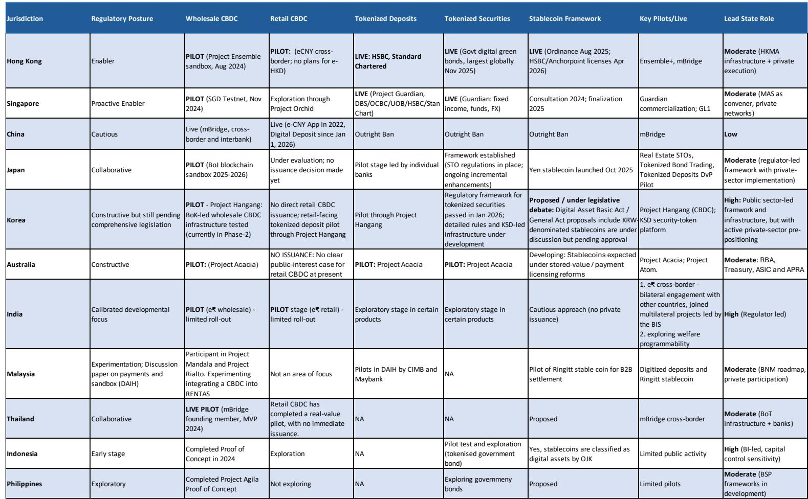
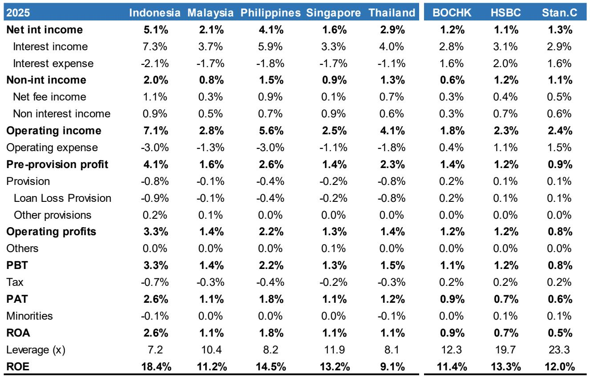

# Dividend Yield Is Not the Full Picture: Why ASEAN and Hong Kong Banks Demand a Strategy-Based Lens

Investors looking at ASEAN and Hong Kong banking stocks in mid-2026 face a deceptive landscape. On the surface, the region offers an attractive mix of high dividend yields, improving return on equity, and what appears to be a benign credit cycle. Indonesian banks alone project dividend yields ranging from 5% to 13.5%, while Singapore banks offer stable 4.5% yields backed by some of the strongest capital positions in the world. The temptation is to treat this as a simple income trade.

That would be a mistake. Beneath the headline numbers lies a far more complex story about structural divergence. The banking systems of Indonesia, Thailand, Malaysia, Singapore, the Philippines, and Hong Kong are not moving in the same direction. They operate at different stages of credit penetration, face distinct demographic pressures, and respond to interest rates in fundamentally different ways. An investor who treats them as a single "Asia ex-Japan financials" basket will miss the critical distinctions that determine which banks compound capital over the next cycle and which ones merely distribute it.

The core argument of this analysis is straightforward: the most important strategic question for ASEAN and Hong Kong bank investors is not which bank offers the highest yield today, but which banking system has the structural capacity to sustain or grow returns without taking on excessive risk. That question cannot be answered without understanding the interplay between credit penetration, capital buffers, fee income diversification, and the shifting role of digital assets and wealth management.

This article draws on a detailed investor presentation covering the industry structure, individual bank profiles, and key thematic drivers across the region. It does not summarize the report. It extends its logic into a decision-making framework for serious institutional investors.

## The Most Profitable Banking Systems Are Not the Most Penetrated Ones, and That Gap Signals Where the Next Cycle Will Be Won

A quick glance at the return-on-equity data for 2025 reveals a striking pattern. Indonesian banks delivered an average ROE of 18.4%, the highest in the region. Philippine banks followed at 14.7%, Singapore at 13.4%, Malaysia at 11.1%, and Thailand at 9.2%. The correlation between ROE and credit penetration is inverse. Indonesia, with the lowest private debt-to-GDP ratio in the region at under 50%, is the most profitable. Thailand, with a household debt-to-GDP ratio near 87%, is the least profitable.

This is not a coincidence. Low credit penetration creates a structural tailwind for loan growth and pricing power. When the economy is under-banked, lenders can grow volumes without compressing margins or relaxing underwriting standards. Indonesia's loan growth has compounded at approximately 8% annually from 2014 to 2025, and its loan-to-deposit ratio has climbed from 44% in 2002 to around 90% today. That trajectory reflects a banking system that is still funding the formalization and expansion of the economy.

Thailand tells the opposite story. After years of rapid credit expansion, the economy is now highly leveraged. Loan growth has slowed to 2-5% since 2014. Asset quality has been under pressure from sequential waves of consumer, SME, and pandemic-related credit issues. The banking system is now searching for growth in higher-margin but less familiar businesses such as digital unsecured lending and wealth management. That is a fundamentally different strategic challenge from the one facing Indonesian banks.

The implication for investors is clear. High ROE in a low-penetration market is a signal of structural advantage. High ROE in a mature, highly leveraged market requires careful scrutiny of how that return is achieved and whether it is sustainable. The same ROE number can mean completely different things depending on the credit cycle stage of the underlying economy.

## Capital Strength Creates Optionality, but Only for Banks That Have a Credible Reinvestment Story

The capital position data across the region shows a wide dispersion. Indonesian banks operate with an average CET1 ratio of 22%, well above the regulatory requirement of 12%. Thai banks run at 18% against an 8% requirement. Malaysian banks at 15% against 8%. Singapore banks at 15% against 9%. Philippine banks at 14% against 11%. Hong Kong banks show even wider variation, with one major institution operating at a CET1 ratio of 24%, far above its regulatory minimum.

Excess capital is, in theory, a source of shareholder value. It can be returned via dividends or buybacks, or it can be deployed into growth. But the strategic value of excess capital depends entirely on the quality of the reinvestment opportunities available to the bank. A bank with a 22% CET1 ratio in a low-penetration market like Indonesia has a credible argument for retaining capital to fund loan growth. A bank with a similarly high capital ratio in a mature market with single-digit loan growth faces a different calculus. Its excess capital is more likely to be returned to shareholders, which makes the dividend yield the primary source of total return.

This is where the scatter plot of dividend payout ratios and dividend yields becomes instructive. Indonesian banks such as Bank Rakyat Indonesia project a 90% payout ratio and a 13.5% dividend yield. Singapore banks such as OCBC project a 60% payout ratio and a 4.5% yield. The difference reflects not just profitability but also the perceived need to retain capital for growth. The question for investors is whether the market is correctly pricing the trade-off between current yield and future growth.

A bank that pays out 90% of earnings today is signaling that it does not see high-return reinvestment opportunities. That is fine if the yield compensates for the lack of growth. But if the economy accelerates and credit demand picks up, that same bank may find itself capital-constrained and unable to capture the opportunity. Conversely, a bank that retains 40% of earnings in a low-growth market may be destroying value if that retained capital earns returns below the cost of equity.

The strategic insight is that capital strength is not an unalloyed good. It must be evaluated in the context of the bank's growth runway and management's capital allocation discipline.

## Fee Income Diversification Is the Critical Differentiator in a Falling-Rate Environment

The returns profile data for 2025 reveals how dependent each banking system is on net interest income. For Indonesian banks, net interest income represents 5.1% of assets, while non-interest income adds only 2.0%. For Singapore banks, net interest income is just 1.6% of assets, but non-interest income contributes 0.9%. The absolute numbers are small, but the relative composition matters enormously when interest rates shift.

Singapore banks have built a respectable fee franchise, particularly in wealth management. This is not accidental. In a mature economy with loan growth of 3-5%, the ability to generate fee income from asset management, advisory, and transaction banking becomes the primary lever for improving returns. The report notes that Singapore banks are seen as global leaders in digitization, and DBS in particular has invested heavily in digital capabilities that support fee-based revenue streams.

Hong Kong banks present an even starker contrast. The three major Hong Kong banks show net interest income ranging from 1.1% to 1.3% of assets, with fee income adding only 0.3% to 0.5%. The non-interest income category, which includes trading and investment income, contributes 0.6% to 0.7%. For these banks, the earnings trajectory is heavily dependent on the direction of interest rates. A rate-cutting cycle would compress net interest margins and expose the relative weakness of fee income generation.

The strategic question for investors is whether the fee income trajectories are improving. The report highlights that Singapore banks have been investing in wealth management and that Hong Kong banks are increasing IT investment to transform their businesses. But transformation is not instantaneous. Investors need to assess whether the fee income growth rate is sufficient to offset the natural compression of net interest margins in a lower-rate environment.

## Digital Assets and Wealth Management Are the Unresolved Wildcards in the Regional Thesis

The report identifies digital assets as an emerging theme, particularly for Singapore, which is described as a leader in this space. It also highlights wealth management as a key focus for Singapore banks and for HSBC, which is leveraging its global network to grow wealth businesses across Asia. These are not niche topics. They represent potential structural shifts in how banks generate revenue and compete for client relationships.

The unresolved question is whether digital assets will be a meaningful profit pool for incumbent banks or whether they will remain a peripheral activity. The report does not provide a definitive answer, and that is appropriate. The regulatory environment is still evolving. The revenue models are unproven at scale. The competitive landscape includes both traditional banks and non-bank fintech players.

Wealth management is a more established theme, but it also carries unresolved questions. The fee income generated by Asian wealth management businesses has grown rapidly, but it is also highly sensitive to market conditions and client sentiment. The report notes that HSBC is targeting 17% or better return on tangible equity from 2026 to 2028, and that Standard Chartered is aiming for a RoTE above 15% by 2028. Both targets depend on wealth management delivering consistent growth.

For investors, the implication is that these themes are not yet fully priced into valuations. The banks that succeed in building scalable, recurring fee income from wealth and digital assets will likely trade at premium multiples. The banks that fail to diversify will remain dependent on interest rate cycles and credit quality. The next 12 to 24 months will be a proving ground.

## A Decision Framework for Allocating Across ASEAN and Hong Kong Banks

The report provides extensive data on market structure, returns profiles, and capital positions. But data alone does not make an investment decision. What investors need is a framework for translating that data into an allocation strategy.

The first dimension is credit cycle stage. Banks in low-penetration markets such as Indonesia and the Philippines have structural tailwinds for loan growth. Investors should prioritize these markets when the economic outlook is constructive and credit demand is accelerating. Banks in mature, highly leveraged markets such as Thailand and Singapore require a different approach. Here, the emphasis should be on fee income diversification, cost discipline, and capital return policies.

The second dimension is interest rate sensitivity. Banks with high net interest income relative to total income, such as those in Indonesia and the Hong Kong banks, are more exposed to rate cycles. Investors need to form a view on the direction of monetary policy in each jurisdiction. Banks with higher fee income, such as the Singapore banks, offer a partial hedge against rate compression.

The third dimension is capital return policy. Banks with high payout ratios and high dividend yields are effectively returning capital to shareholders. This is attractive in a low-growth environment but carries the risk of foregone reinvestment. Banks with lower payout ratios but higher retained earnings are implicitly betting on future growth. Investors need to assess whether that growth is realistic given the market structure and competitive dynamics.

The fourth dimension is digital and wealth transformation. This is the most difficult to quantify but potentially the most important. Banks that successfully build digital ecosystems and wealth management franchises will create compounding advantages in customer acquisition, cross-selling, and fee income generation. Banks that lag in this area will face margin compression and market share loss.

Applying this framework requires a granular understanding of each bank's specific position. The report covers individual banks such as DBS, OCBC, UOB, HSBC, Standard Chartered, BOCHK, and the major Indonesian, Thai, Malaysian, and Philippine lenders. Each has a unique combination of market share, capital strength, fee income profile, and strategic focus. The framework is designed to help investors ask the right questions, not to provide mechanical answers.

## What the Full Report Reveals That This Analysis Cannot Fully Capture

This article has focused on the strategic implications of the data and themes presented in the report. But a written summary, no matter how thorough, cannot replicate the visual power of the original charts and the granularity of the individual bank profiles.

The report includes detailed market share breakdowns for loans, deposits, mortgages, and credit cards in Hong Kong, as well as similar breakdowns for each ASEAN market. These charts reveal concentration risks and competitive dynamics that are difficult to capture in text. For example, the Hong Kong mortgage market is dominated by two players with a combined 63% market share. The credit card market is even more concentrated, with one bank holding 48% share. These numbers have direct implications for pricing power and regulatory risk.

The report also includes a comprehensive returns profile table that breaks down net interest income, non-interest income, operating expenses, provisions, and ROE for each market and for the three Hong Kong banks. This table allows investors to decompose the sources of return and identify which banks are generating profits from sustainable sources versus cyclical tailwinds.

The individual bank profiles for HSBC, Standard Chartered, and BOCHK provide context on strategic positioning, competitive advantages, and management targets that are essential for bottom-up stock selection. These profiles are not included in this article, but they are central to the full report.

## The Open Questions That Should Drive Further Inquiry

No single report can answer every question, and this analysis deliberately leaves several open issues for readers to explore.

How will the regulatory environment for digital assets evolve in Singapore and Hong Kong, and what will that mean for bank revenue models? The report flags digital assets as a theme but does not quantify the potential impact.

Can Thai banks successfully pivot to higher-margin businesses such as digital unsecured lending and wealth management without taking on excessive credit risk? The structural challenges of a highly indebted economy and ageing demographics are not easily solved.

Will the Hong Kong banks be able to grow fee income fast enough to offset the impact of a potential rate-cutting cycle? The current fee income contribution is low relative to global peers.

Is the Indonesian banking system's high ROE sustainable as credit penetration rises and competition intensifies? The historical trajectory of other emerging markets suggests that margins eventually compress.

These are not weaknesses of the report. They are the natural consequences of a complex and evolving landscape. The best research raises as many questions as it answers, and it equips readers with the tools to form their own judgments.

Join the community to read the full report and review the original charts. The data visualizations and individual bank profiles will deepen your understanding of the strategic dynamics at play in ASEAN and Hong Kong banking.

*This article is for learning and discussion only and does not constitute investment advice.*

Personal reading notes and learning share only. Not investment advice.

