# Investor Presentation | Asia Pacific

# China Autos & Shared Mobility: Autos Overview

MS ASIA LIMITED+

# Tim Hsiao

Equity Analyst

Tim.Hsiao@morganstanley.com +852 2848-1982

# Shelley Wang, CFA

Equity Analyst

Shelley.Wang@morganstanley.com +852 3963-0047

# Joey Xu, CFA

Equity Analyst

Joey.Xu@morganstanley.com +852 3963-0337

# Peggy Wang

Research Associate

Peggy.Pc.Wang@morganstanley.com +852 3963-3934

# Asia Summer School 2026

# CHINA AUTOS & SHARED MOBILITY

Asia Pacific

Industry View In-Line

MS does and seeks to do business with companies covered in MS. As a result, investors should be aware that the firm may have a conflict of interest that could affect the objectivity of MS. Investors should consider MS as only a single factor in making their investment decision.

# For analyst certification and other important disclosures, refer to the Disclosure Section, located at the end of this report.

+= Analysts employed by non-U.S. affiliates are not registered with FINRA, may not be associated persons of the member and may not be subject to FINRA restrictions on communications with a subject company, public appearances and trading securities held by a research analyst account.

# Greater China Autos & Shared Mobility

# Tim Hsiao / Shelley Wang / Joey Xu

# China Autos Overview

Stock Overview 

<table><tr><td rowspan="2">Company Name</td><td rowspan="2">Ticker</td><td rowspan="2">Rating</td><td rowspan="2">PT</td><td rowspan="2">Last Close</td><td rowspan="2">Mkt Cap (US$ mn)</td><td colspan="2">P/E</td><td colspan="2">P/S</td></tr><tr><td>&#x27;26E</td><td>&#x27;27E</td><td>&#x27;26E</td><td>&#x27;27E</td></tr><tr><td colspan="10">EV</td></tr><tr><td>NIO Inc.</td><td>NIO-US</td><td>OW</td><td>7.40</td><td>5.69</td><td>14,952</td><td>NA</td><td>61.8</td><td>0.75</td><td>0.63</td></tr><tr><td>XPeng, Inc.</td><td>XPEV-US</td><td>OW</td><td>25.00</td><td>16.81</td><td>16,679</td><td>NA</td><td>81.7</td><td>1.20</td><td>0.94</td></tr><tr><td>Li Auto,</td><td>LI-US</td><td>OW</td><td>21.50</td><td>14.57</td><td>18,619</td><td>140.0</td><td>19.6</td><td>1.00</td><td>0.82</td></tr><tr><td>BYD Company</td><td>1211-HK</td><td>OW</td><td>121.00</td><td>91.80</td><td>114,057</td><td>16.5</td><td>13.2</td><td>0.83</td><td>0.74</td></tr><tr><td>BYD Company</td><td>002594-CN</td><td>OW</td><td>120.00</td><td>93.44</td><td>114,057</td><td>20.9</td><td>16.7</td><td>0.84</td><td>0.74</td></tr><tr><td colspan="10">OEMs</td></tr><tr><td>Great Wall</td><td>2333-HK</td><td>EW</td><td>12.00</td><td>10.36</td><td>18,345</td><td>6.1</td><td>5.0</td><td>0.49</td><td>0.43</td></tr><tr><td>Great Wall</td><td>601633-CN</td><td>UW</td><td>14.00</td><td>16.66</td><td>18,345</td><td>12.0</td><td>10.0</td><td>0.48</td><td>0.42</td></tr><tr><td>Geely Automobile</td><td>175-HK</td><td>OW</td><td>28.00</td><td>18.58</td><td>25,724</td><td>7.5</td><td>6.2</td><td>0.41</td><td>0.35</td></tr><tr><td>Guangzhou Automobile</td><td>2238-HK</td><td>OW</td><td>3.90</td><td>2.51</td><td>7,473</td><td>NA</td><td>NA</td><td>0.46</td><td>0.41</td></tr><tr><td>Guangzhou Automobile</td><td>601238-CN</td><td>UW</td><td>4.00</td><td>6.07</td><td>7,473</td><td>NA</td><td>NA</td><td>0.46</td><td>0.41</td></tr><tr><td>SAIC Motor</td><td>600104-CN</td><td>OW</td><td>22.90</td><td>11.82</td><td>19,825</td><td>11.6</td><td>10.5</td><td>0.20</td><td>0.19</td></tr><tr><td>BAIC BluePark</td><td>600733-CN</td><td>UW</td><td>5.50</td><td>5.90</td><td>5,544</td><td>NA</td><td>214.4</td><td>0.73</td><td>0.50</td></tr><tr><td>Voyah Automotive</td><td>7489-HK</td><td>OW</td><td>8.10</td><td>5.33</td><td>2,503</td><td>9.2</td><td>6.3</td><td>0.31</td><td>0.24</td></tr><tr><td>Chongqing Changan</td><td>000625-CN</td><td>EW</td><td>10.80</td><td>8.00</td><td>10,482</td><td>16.8</td><td>13.2</td><td>0.38</td><td>0.35</td></tr><tr><td>Yutong Bus</td><td>600066-CN</td><td>EW</td><td>40.20</td><td>29.99</td><td>9,581</td><td>10.8</td><td>9.6</td><td>1.39</td><td>1.26</td></tr><tr><td>BAIC Motor</td><td>1958-HK</td><td>EW</td><td>2.16</td><td>1.15</td><td>1,176</td><td>NA</td><td>NA</td><td>0.05</td><td>0.05</td></tr><tr><td>Brilliance China</td><td>1114-HK</td><td>EW</td><td>2.90</td><td>2.58</td><td>1,661</td><td>4.9</td><td>4.8</td><td>8.46</td><td>7.68</td></tr><tr><td colspan="10">ADAS</td></tr><tr><td>Hesai Group</td><td>HSAI-US</td><td>OW</td><td>30.00</td><td>20.25</td><td>3,430</td><td>38.9</td><td>22.7</td><td>5.32</td><td>3.82</td></tr><tr><td>WeRide Inc.</td><td>WRD-US</td><td>OW</td><td>14.70</td><td>7.25</td><td>2,699</td><td>NA</td><td>NA</td><td>17.26</td><td>8.89</td></tr><tr><td>Horizon Robotics</td><td>9660-HK</td><td>OW</td><td>10.00</td><td>5.17</td><td>10,142</td><td>NA</td><td>NA</td><td>11.36</td><td>7.10</td></tr><tr><td colspan="10">EVTOL</td></tr><tr><td>EHang Holdings</td><td>EH-US</td><td>OW</td><td>26.00</td><td>9.23</td><td>700</td><td>NA</td><td>128.3</td><td>7.95</td><td>4.90</td></tr></table>

Source: FactSet, MS. E = FactSet consensus estimates. Note: Last close prices are as of June 4, 2026.

Stock Overview (cont'd) 

<table><tr><td rowspan="2">Company Name</td><td rowspan="2">Ticker</td><td rowspan="2">Rating</td><td rowspan="2">PT</td><td rowspan="2">Last Close</td><td rowspan="2">Mkt Cap (US$ mn)</td><td colspan="2">P/E</td><td colspan="2">P/S</td></tr><tr><td>&#x27;26E</td><td>&#x27;27E</td><td>&#x27;26E</td><td>&#x27;27E</td></tr><tr><td colspan="10">Auto parts</td></tr><tr><td>Fuyao Glass</td><td>3606-HK</td><td>EW</td><td>53.50</td><td>55.45</td><td>20,108</td><td>11.3</td><td>9.6</td><td>2.59</td><td>2.26</td></tr><tr><td>Minth Group</td><td>425-HK</td><td>OW</td><td>50.00</td><td>34.76</td><td>5,282</td><td>10.5</td><td>8.9</td><td>1.19</td><td>1.03</td></tr><tr><td>Nexteer Automotive</td><td>1316-HK</td><td>EW</td><td>6.30</td><td>5.01</td><td>1,612</td><td>11.2</td><td>9.1</td><td>0.33</td><td>0.32</td></tr><tr><td>Huizhou Desay</td><td>002920-CN</td><td>OW</td><td>151.00</td><td>97.93</td><td>8,625</td><td>19.9</td><td>16.8</td><td>1.52</td><td>1.32</td></tr><tr><td>Ningbo Joyson</td><td>600699-CN</td><td>EW</td><td>25.00</td><td>26.53</td><td>5,666</td><td>22.5</td><td>19.2</td><td>0.59</td><td>0.56</td></tr><tr><td>Foryou Corporation</td><td>002906-CN</td><td>OW</td><td>42.00</td><td>28.87</td><td>2,224</td><td>15.8</td><td>12.6</td><td>0.95</td><td>0.79</td></tr><tr><td>Zhejiang Sanhua</td><td>002050-CN</td><td>EW</td><td>40.00</td><td>47.01</td><td>25,648</td><td>42.9</td><td>37.1</td><td>5.00</td><td>4.36</td></tr><tr><td>Changzhou Xingyu</td><td>601799-CN</td><td>OW</td><td>176.00</td><td>127.95</td><td>5,394</td><td>18.9</td><td>15.3</td><td>2.02</td><td>1.70</td></tr><tr><td>SeeWay.ai</td><td>002405-CN</td><td>UW</td><td>5.50</td><td>7.89</td><td>2,761</td><td>NA</td><td>NA</td><td>3.94</td><td>NA</td></tr><tr><td>Keboda Technology</td><td>603786-CN</td><td>OW</td><td>78.00</td><td>48.05</td><td>2,864</td><td>20.4</td><td>15.7</td><td>2.34</td><td>1.91</td></tr><tr><td>Huayu Automotive</td><td>600741-CN</td><td>OW</td><td>24.10</td><td>16.83</td><td>7,830</td><td>7.2</td><td>6.7</td><td>0.28</td><td>0.26</td></tr><tr><td>Ningbo Tuopu</td><td>601689-CN</td><td>EW</td><td>62.00</td><td>67.60</td><td>17,336</td><td>36.0</td><td>30.1</td><td>3.41</td><td>2.94</td></tr><tr><td>Ningbo Xusheng</td><td>603305-CN</td><td>EW</td><td>12.00</td><td>14.67</td><td>2,502</td><td>32.4</td><td>26.5</td><td>3.19</td><td>2.73</td></tr><tr><td>Suzhou Recodeal</td><td>688800-CN</td><td>UW</td><td>59.00</td><td>135.00</td><td>4,430</td><td>60.5</td><td>43.3</td><td>6.71</td><td>5.21</td></tr><tr><td>Bethel Automotive</td><td>603596-CN</td><td>OW</td><td>41.00</td><td>31.51</td><td>4,160</td><td>18.2</td><td>14.7</td><td>1.86</td><td>1.55</td></tr><tr><td>Beijing Jingwei</td><td>688326-CN</td><td>UW</td><td>72.00</td><td>79.12</td><td>1,319</td><td>45.3</td><td>24.7</td><td>1.07</td><td>0.90</td></tr><tr><td colspan="10">Dealers</td></tr><tr><td>Zhongsheng Group</td><td>881-HK</td><td>OW</td><td>10.50</td><td>6.15</td><td>1,873</td><td>6.2</td><td>4.2</td><td>0.08</td><td>0.07</td></tr><tr><td>China MeiDong</td><td>1268-HK</td><td>EW</td><td>1.50</td><td>0.73</td><td>125</td><td>5.9</td><td>2.7</td><td>0.05</td><td>0.05</td></tr><tr><td>China Yongda</td><td>3669-HK</td><td>EW</td><td>1.20</td><td>0.81</td><td>194</td><td>30.6</td><td>6.3</td><td>0.03</td><td>0.02</td></tr><tr><td>TUHU Car</td><td>9690-HK</td><td>OW</td><td>16.00</td><td>12.97</td><td>1,464</td><td>16.0</td><td>12.9</td><td>0.54</td><td>0.49</td></tr></table>

Source: FactSet, MS. E = FactSet consensus estimates. Note: Last close prices are as of June 4, 2026.

# Key Topics

1. China's Passenger Car Industry – 2026   
2. EVs   
3. Autonomous Driving   
4. Policies   
5. Competition   
6. Global Expansion

# Key Forecasts for 2026

• Domestic passenger car sales to decline 11% YoY   
• Export sales to grow 33% YoY and reach 8.0mn units   
• NEV sales to grow 13% YoY, with sales penetration reaching 60%   
• L3 AD commercialized; L4/Robotaxi deployment to accelerate   
• Accelerating smart-driving/cockpit integration   
- Policies – Scrappage + replacement subsidies   
• Chinese brands to dominate with 70% market share

<table><tr><td rowspan="2">China PV wholesale(k units)</td><td>2025</td><td>4M26</td><td>2026E</td><td>2027E</td><td>2028E</td></tr><tr><td>30,059</td><td>8,065</td><td>29,412</td><td>30,550</td><td>31,280</td></tr><tr><td>YoY</td><td>9%</td><td>-7%</td><td>-2%</td><td>4%</td><td>2%</td></tr><tr><td>- Domestic</td><td>24,054</td><td>5,346</td><td>21,408</td><td>22,050</td><td>22,270</td></tr><tr><td>YoY</td><td>6%</td><td>-24%</td><td>-11%</td><td>3%</td><td>1%</td></tr><tr><td>- Export</td><td>6,005</td><td>2,719</td><td>8,005</td><td>8,500</td><td>9,009</td></tr><tr><td>YoY</td><td>22%</td><td>69%</td><td>33%</td><td>6%</td><td>6%</td></tr></table>

<table><tr><td rowspan="2">China EV wholesale(k units)</td><td>2025</td><td>4M26</td><td>2026E</td><td>2027E</td><td>2028E</td></tr><tr><td>15,498</td><td>3,998</td><td>17,538</td><td>19,237</td><td>21,443</td></tr><tr><td>YoY</td><td>26%</td><td>-1%</td><td>13%</td><td>10%</td><td>11%</td></tr><tr><td>- Domestic</td><td>13,114</td><td>2,644</td><td>13,059</td><td>13,891</td><td>15,003</td></tr><tr><td>YoY</td><td>18%</td><td>-23%</td><td>0%</td><td>6%</td><td>8%</td></tr><tr><td>- Export</td><td>2,385</td><td>1,354</td><td>4,480</td><td>5,346</td><td>6,440</td></tr><tr><td>YoY</td><td>100%</td><td>121%</td><td>88%</td><td>19%</td><td>20%</td></tr></table>

Source: China Association of Automobile Manufacturers (CAAM), MS (E) estimates.

# Market Size and Vehicle Structure

• 2026e: Wholesale 29.4mn units (-2% YoY) / Retail 21.4mn units (-11% YoY)

China - PV Wholesale Volume (mn units)   
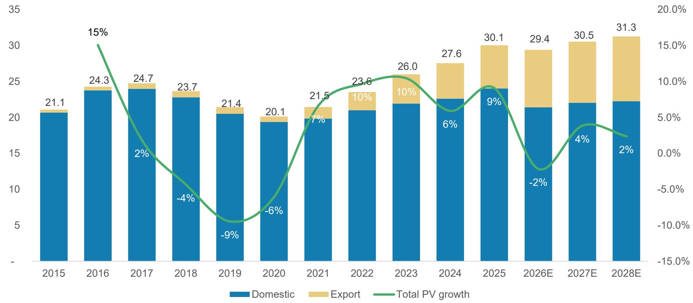

bar_line

| Year   | Domestic | Export | Total PV growth |
|--------|----------|--------|-----------------|
| 2015   | 21.1     | 0.5    | -               |
| 2016   | 24.3     | 0.5    | 15%             |
| 2017   | 24.7     | 0.5    | 2%              |
| 2018   | 23.7     | 0.5    | -4%             |
| 2019   | 21.4     | 0.5    | -9%             |
| 2020   | 20.1     | 0.5    | -6%             |
| 2021   | 21.5     | 0.5    | 7%              |
| 2022   | 23.6     | 10%    | -               |
| 2023   | 26.0     | 10%    | -               |
| 2024   | 27.6     | 15%    | 6%              |
| 2025   | 30.1     | 15%    | 9%              |
| 2026E  | 29.4     | 15%    | -2%             |
| 2027E  | 30.5     | 15%    | 4%              |
| 2028E  | 31.3     | 15%    | 2%              |

Source: China Association of Automobile Manufacturers (CAAM), MS (E) estimates. PV = passenger vehicle.

# Market Size and Vehicle Structure (cont'd)

PV Sales by Vehicle Type (2026E)   
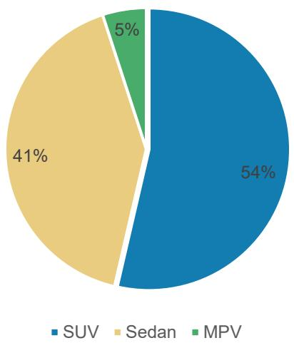

pie

| Category | Percentage (%) |
| :--- | :--- |
| SUV | 54 |
| Sedan | 41 |
| MPV | 5 |

PV Sales by Powertrain (2026E)   
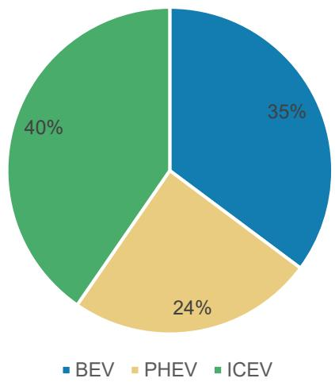

pie

| Category | Percentage (%) |
| :--- | :--- |
| BEV | 35 |
| PHEV | 24 |
| ICEV | 40 |

Source: China Association of Automobile Manufacturers (CAAM), MS (E) estimates. PV = passenger vehicle.

Stimulus Policies: National and Local Trade-in Subsidy Details 

<table><tr><td>National trade-in stimulus</td><td>Details</td></tr><tr><td>Trade-in vehicle eligibility</td><td>ICEV purchased before 6/30/2013 or NEV purchased before 12/31/2019</td></tr><tr><td>New vehicle subsidies (Rmb)</td><td>20k per NEV, up to 12% of car ASP15k per ICE, up to 10% of car ASP</td></tr><tr><td>Duration</td><td>Until Dec 31, 2026</td></tr><tr><td>Application method</td><td>Standardized nationwide</td></tr><tr><td colspan="2"></td></tr><tr><td>Local trade-in stimulus</td><td>Details</td></tr><tr><td>Trade-in vehicle eligibility</td><td>Any vehicles</td></tr><tr><td>New vehicle subsidies (Rmb)</td><td>15k per NEV, up to 8% of car ASP13k per ICE, up to 6% of car ASP</td></tr><tr><td>Duration</td><td>Until Dec 31, 2026</td></tr><tr><td>Application method</td><td>Lottery systems in several regions</td></tr></table>

Source: Ministry of Commerce, MS.

# Stimulus Policies: Nationwide NEV Purchase Tax Exemption

<table><tr><td>Period</td><td>Vehicle Purchase Tax</td><td>Purchase Tax Exemption Cap</td></tr><tr><td>Before Sep 2014</td><td>10%</td><td>No exemption</td></tr><tr><td>Sep 2014 - Dec 2023</td><td>10% -&gt; 0%</td><td>Full exemption</td></tr><tr><td>Jan 2024 - Dec 2025</td><td>0%</td><td>Rmb30k exemption cap</td></tr><tr><td>Jan 2026 - Dec 2027</td><td>0% -&gt; 5%</td><td>Rmb15k exemption cap</td></tr><tr><td>Jan 2028 +</td><td>5% -&gt; 10%</td><td>No exemption</td></tr></table>

Source: Ministry of Commerce, MS.

# Policy Impact

• 11.5mn new cars sold in 2025 applied for either national or local trade-in subsidies   
• 1.4mn new cars sold in 1Q26 applied for either national or local trade-in subsidies

National & Local Trade-in Subsidy Application since 2025 (K units)   
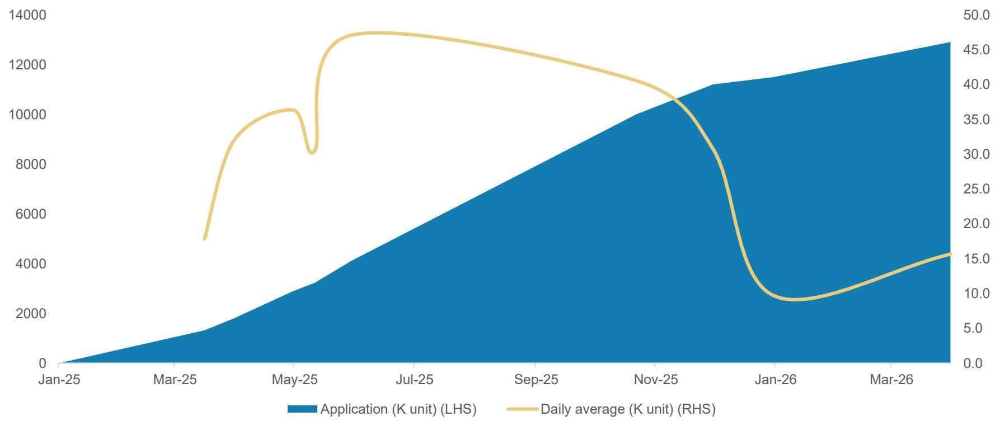

bar_line

| Date    | Application (K unit) (LHS) | Daily average (K unit) (RHS) |
|---------|----------------------------|------------------------------|
| Jan-25  | 0                          | 0.0                          |
| Mar-25  | 1000                       | 50.0                         |
| May-25  | 3000                       | 100.0                        |
| Jul-25  | 5000                       | 45.0                         |
| Sep-25  | 7000                       | 40.0                         |
| Nov-25  | 10000                      | 35.0                         |
| Jan-26  | 11000                      | 10.0                         |
| Mar-26  | 13000                      | 15.0                         |

Source: Ministry of Commerce, MS.

# NEV Wholesale Penetration and Volume

• 2026e: NEV wholesale 17.5mn units (+13% YoY) / Penetration 60%

NEV wholesale penetration and volume (mn units)   
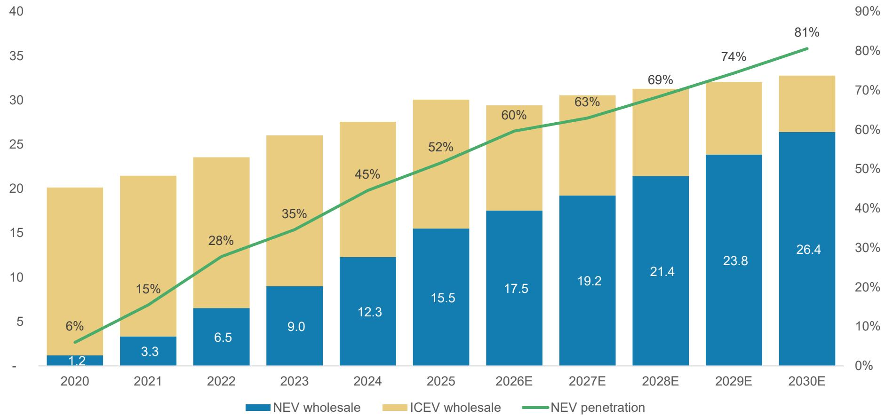

bar_line

| Year   | NEV wholesale | ICEV wholesale | NEV penetration |
|--------|---------------|----------------|-----------------|
| 2020   | 1.2           | 6              | 6%              |
| 2021   | 3.3           | 15%            | 15%             |
| 2022   | 6.5           | 28%            | 28%             |
| 2023   | 9.0           | 35%            | 35%             |
| 2024   | 12.3          | 45%            | 45%             |
| 2025   | 15.5          | 52%            | 52%             |
| 2026E  | 17.5          | 60%            | 60%             |
| 2027E  | 19.2          | 63%            | 63%             |
| 2028E  | 21.4          | 69%            | 69%             |
| 2029E  | 23.8          | 74%            | 74%             |
| 2030E  | 26.4          | 81%            | 81%             |

Source: China Association of Automobile Manufacturers (CAAM), MS (E) estimates.

BEV/PHEV Volume and Penetration   
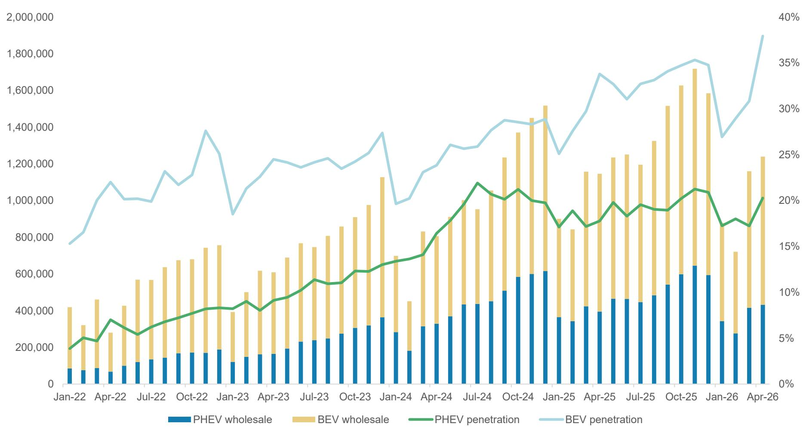

bar_line

| Month    | PHEV wholesale | BEV wholesale | PHEV penetration | BEV penetration |
|----------|----------------|---------------|------------------|-----------------|
| Jan-22   | 80,000         | 420,000       | 20%              | 75%             |
| Apr-22   | 80,000         | 460,000       | 25%              | 105%            |
| Jul-22   | 120,000        | 560,000       | 30%              | 115%            |
| Oct-22   | 170,000        | 680,000       | 35%              | 135%            |
| Jan-23   | 190,000        | 750,000       | 40%              | 125%            |
| Apr-23   | 160,000        | 610,000       | 45%              | 120%            |
| Jul-23   | 230,000        | 760,000       | 55%              | 115%            |
| Oct-23   | 310,000        | 910,000       | 60%              | 125%            |
| Jan-24   | 360,000        | 1130,000      | 65%              | 135%            |
| Apr-24   | 320,000        | 830,000       | 75%              | 125%            |
| Jul-24   | 430,000        | 940,000       | 115%             | 135%            |
| Oct-24   | 590,000        | 1380,000      | 115%             | 145%            |
| Jan-25   | 610,000        | 1520,000      | 115%             | 145%            |
| Apr-25   | 420,000        | 1150,000      | 17%              | 33%             |
| Jul-25   | 460,000        | 1240,000      | 19%              | 31%             |
| Oct-25   | 610,000        | 1630,000      | 21%              | 34%             |
| Jan-26   | 590,000        | 1590,000      | 21%              | 34%             |
| Apr-26   | 420,000        | 1240,000      | 21%              | 38%             |

Source: China Association of Automobile Manufacturers (CAAM), MS (E) estimates.

# Export Scale

• 2026e: Exports 8.0mn units (+33% YoY), 56% from NEVs

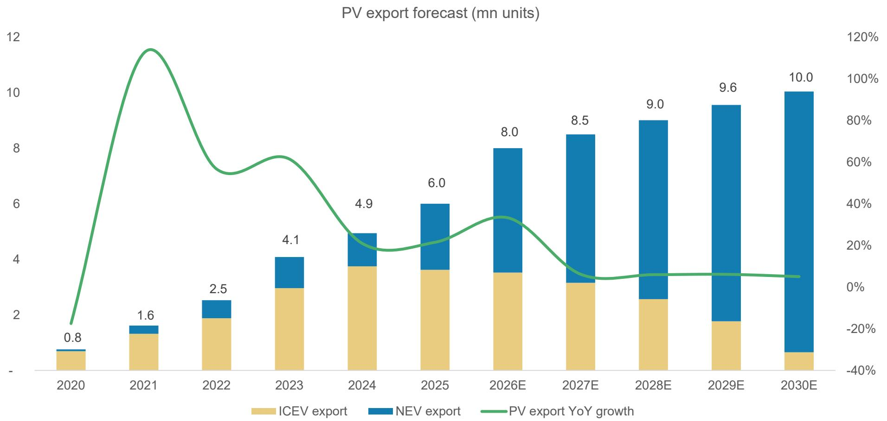

bar_line

PV export forecast (mn units)
| Year | ICEV export (mn units) | NEV export (mn units) | PV export YoY growth (%) |
| :--- | :--- | :--- | :--- |
| 2020 | 0.8 | 0.1 | -25.0 |
| 2021 | 1.6 | 0.4 | 115.0 |
| 2022 | 2.5 | 0.7 | 55.0 |
| 2023 | 4.1 | 1.1 | 75.0 |
| 2024 | 3.8 | 1.3 | 45.0 |
| 2025 | 3.6 | 2.3 | 25.0 |
| 2026E | 3.5 | 4.0 | 35.0 |
| 2027E | 3.1 | 5.3 | 15.0 |
| 2028E | 2.6 | 6.9 | 5.0 |
| 2029E | 1.8 | 8.6 | 5.0 |
| 2030E | 0.8 | 10.0 | 5.0 |

Source: China Association of Automobile Manufacturers (CAAM), MS (E) estimates. PV = passenger vehicle.

# Regional Layout

\- Asia and Europe Accounted for More Than $65\%$ of China's Vehicle Exports in 2025 and 4M26

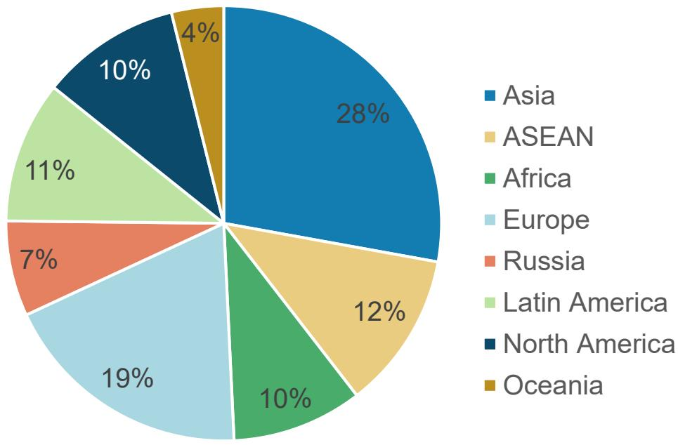

pie

| Region | Percentage (%) |
| :--- | :--- |
| Asia | 28 |
| ASEAN | 12 |
| Africa | 10 |
| Europe | 19 |
| Russia | 7 |
| Latin America | 11 |
| North America | 10 |
| Oceania | 4 |

Source: China Association of Automobile Manufacturers (CAAM), China Customs, MS (E) estimates.

Accelerating Offshore Expansion   
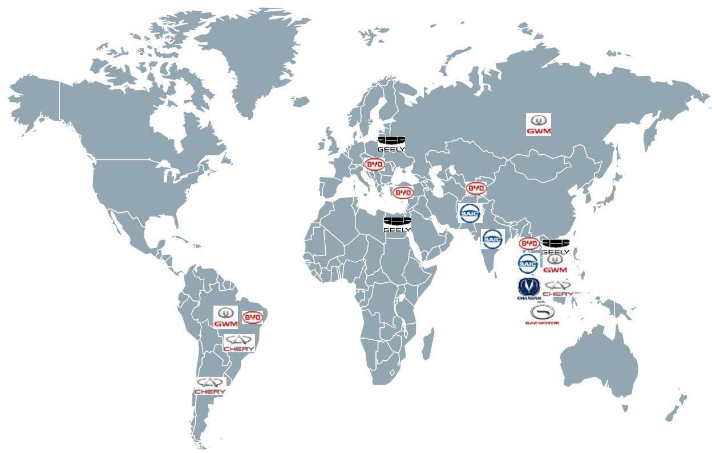

text_image

GWM
GEELY
BYD
BYD
SAIC
GEELY
SAIC
GWM
BYD
CHERY
CHERY
GACMOTOR

Source: Company data, MS.

<table><tr><td>OEM</td><td>Location</td><td>Launch</td><td>Planned Capacity (k units)</td></tr><tr><td rowspan="7">BYD</td><td>Thailand</td><td>2024</td><td>150</td></tr><tr><td>Uzbekistan</td><td>2024</td><td>50</td></tr><tr><td>Brazil</td><td>2025</td><td>150</td></tr><tr><td>Hungary</td><td>2026</td><td>150</td></tr><tr><td>Indonesia</td><td>2026</td><td>150</td></tr><tr><td>Turkey</td><td>2026</td><td>150</td></tr><tr><td>Cambodia</td><td>2026</td><td>10</td></tr><tr><td colspan="3">BYD total</td><td>810</td></tr><tr><td rowspan="3">GWM</td><td>Russia</td><td>2019</td><td>150</td></tr><tr><td>Thailand</td><td>2021</td><td>80-120</td></tr><tr><td>Brazil</td><td>2024</td><td>100</td></tr><tr><td colspan="3">GWM total</td><td>350</td></tr><tr><td rowspan="3">Geely</td><td>Egypt</td><td>2012</td><td>30</td></tr><tr><td>Belarus</td><td>2017</td><td>60</td></tr><tr><td>Malaysia</td><td>2017</td><td>250</td></tr><tr><td colspan="3">Geely total</td><td>340</td></tr><tr><td rowspan="5">SAIC</td><td>Indonesia</td><td>2017</td><td>150</td></tr><tr><td>India</td><td>2019</td><td>80</td></tr><tr><td>Pakistan</td><td>2021</td><td>100</td></tr><tr><td>Vietnam</td><td>2023</td><td>60</td></tr><tr><td>Thailand</td><td>2023</td><td>50</td></tr><tr><td colspan="3">SAIC total</td><td>440</td></tr><tr><td rowspan="5">Chery</td><td>Brazil</td><td>2014</td><td>150</td></tr><tr><td>Indonesia</td><td>2023</td><td>200</td></tr><tr><td>Malaysia</td><td>2024</td><td>30</td></tr><tr><td>Argentina</td><td>2025</td><td>100</td></tr><tr><td>Thailand</td><td>2025</td><td>80</td></tr><tr><td colspan="3">Chery total</td><td>560</td></tr><tr><td rowspan="2">GAC</td><td>Thailand</td><td>2024</td><td>50</td></tr><tr><td>Indonesia</td><td>2024</td><td>100</td></tr><tr><td colspan="3">GAC total</td><td>150</td></tr><tr><td>Chang&#x27;an</td><td>Thailand</td><td>2025</td><td>200</td></tr><tr><td colspan="3">Chang&#x27;an total</td><td>200</td></tr></table>

Autonomous Driving and Commercialization   
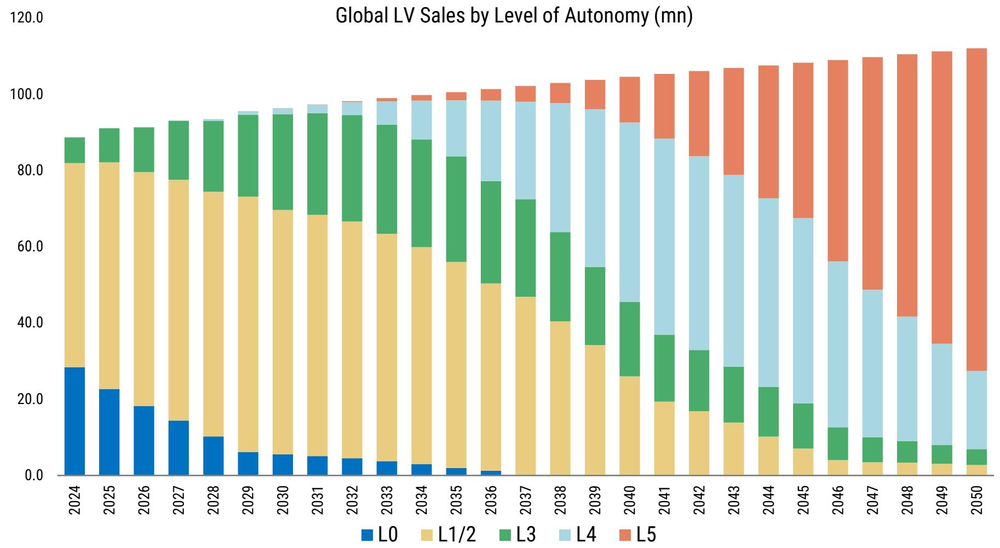

bar_stacked

| Year | L0   | L1/2 | L3   | L4   | L5   |
|------|------|------|------|------|------|
| 2024 | 28.0 | 42.0 | 5.0  | 0.0  | 0.0  |
| 2025 | 22.0 | 46.0 | 7.0  | 0.0  | 0.0  |
| 2026 | 18.0 | 44.0 | 9.0  | 0.0  | 0.0  |
| 2027 | 14.0 | 48.0 | 11.0 | 0.0  | 0.0  |
| 2028 | 10.0 | 46.0 | 13.0 | 0.0  | 0.0  |
| 2029 | 6.0  | 44.0 | 15.0 | 1.0  | 0.0  |
| 2030 | 5.0  | 42.0 | 17.0 | 1.0  | 0.0  |
| 2031 | 5.0  | 42.0 | 18.0 | 1.0  | 0.0  |
| 2032 | 4.0  | 42.0 | 19.0 | 1.0  | 0.0  |
| 2033 | 3.0  | 42.0 | 19.0 | 3.0  | 1.0  |
| 2034 | 3.0  | 42.0 | 19.0 | 6.0  | 1.0  |
| 2035 | 2.0  | 42.0 | 19.0 | 9.0  | 1.0  |
| 2036 | 1.0  | 42.0 | 19.0 | 11.0 | 2.0  |
| 2037 | 1.0  | 42.0 | 19.0 | 13.0 | 3.0  |
| 2038 | 1.0  | 42.0 | 19.0 | 15.0 | 4.0  |
| 2039 | 1.0  | 42.0 | 19.0 | 17.0 | 5.0  |
| 2040 | 1.0  | 42.0 | 19.0 | 19.0 | 6.0  |
| 2041 | 1.0  | 42.0 | 19.0 | 21.0 | 7.0  |
| 2042 | 1.0  | 42.0 | 19.0 | 23.0 | 8.0  |
| 2043 | 1.0  | 42.0 | 19.0 | 25.0 | 9.0  |
| 2044 | 1.0  | 42.0 | 19.0 | 27.0 | 10.0 |
| 2045 | 1.0  | 42.0 | 19.0 | 29.0 | 11.0 |
| 2046 | 1.0  | 42.0 | 19.0 | 31.0 | 12.0 |
| 2047 | 1.0  | 42.0 | 19.0 | 33.0 | 13.0 |
| 2048 | 1.0  | 42.0 | 19.0 | 35.0 | 14.0 |
| 2049 | 1.0  | 42.0 | 19.0 | 37.0 | 15.0 |
| 2050 | -    | -    | -    | -    | -    |

Source: MS (E) estimates.

# Autonomous Driving and Commercialization

China L2+ smart driving vehicles sales penetration (%)   
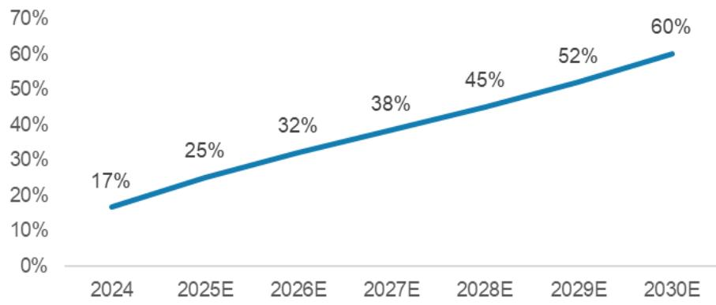

line

| Year | Value (%) |
|---|---|
| 2024 | 17 |
| 2025E | 25 |
| 2026E | 32 |
| 2027E | 38 |
| 2028E | 45 |
| 2029E | 52 |
| 2030E | 60 |

China – robotaxi forecasts   
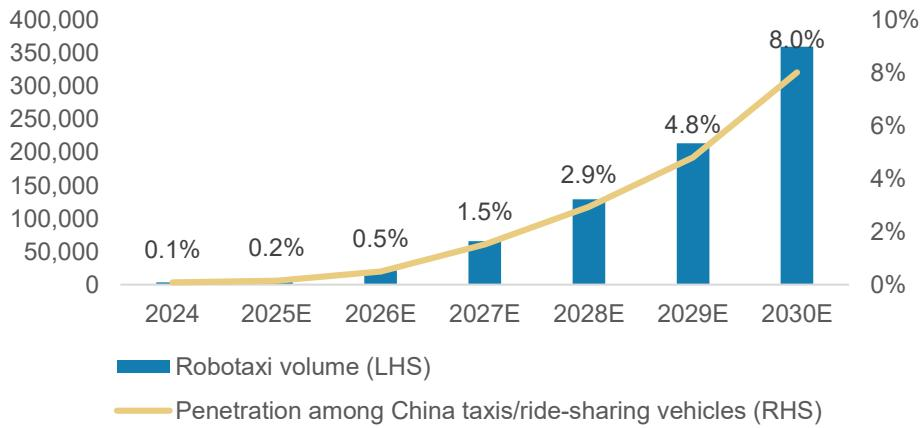

bar_line

| Year   | Robotaxi volume (LHS) | Penetration among China taxis/ride-sharing vehicles (RHS) |
| ------ | --------------------- | -------------------------------------------------------- |
| 2024   | ~10,000               | 0.1%                                                     |
| 2025E  | ~20,000               | 0.2%                                                     |
| 2026E  | ~40,000               | 0.5%                                                     |
| 2027E  | ~70,000               | 1.5%                                                     |
| 2028E  | ~120,000              | 2.9%                                                     |
| 2029E  | ~210,000              | 4.8%                                                     |
| 2030E  | ~350,000              | 8.0%                                                     |

Source: NE Times, MS (E) estimates.

# Autonomous Driving – Competitive Landscape

City

NoA

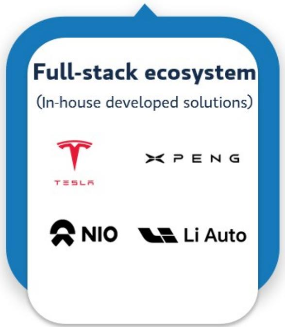

text_image

Full-stack ecosystem
(In-house developed solutions)
TESLA
PENG
NIO
Li Auto

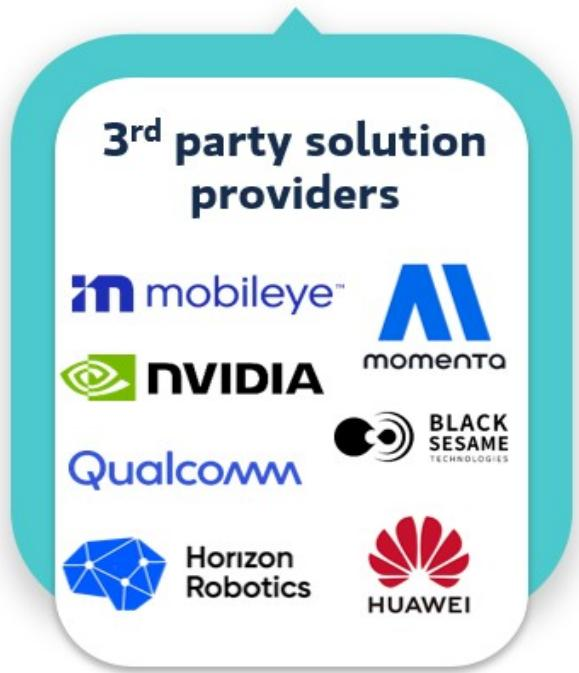

text_image

3rd party solution
providers
in mobileye™
momenta
NVIDIA
Qualcomm
BLACK
SESAME
TECHNOLOGIES
Horizon
Robotics
HUAWEI

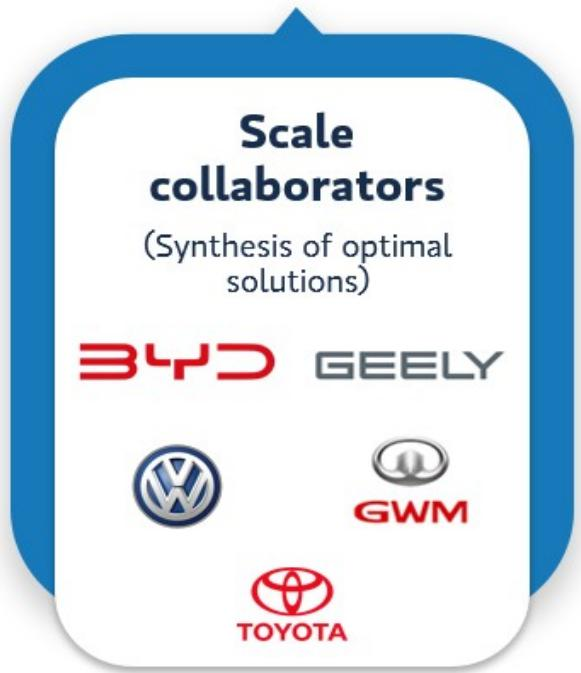

text_image

Scale
collaborators
(Synthesis of optimal
solutions)
BYD GEELY
VWOM GWM
TOYOTA

Source: MS.

# Autonomous Driving – Competitive Landscape

  
WeRide

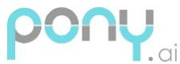

<table><tr><td colspan="2"></td><td>WeRide</td><td>Pony AI</td></tr><tr><td colspan="2">Scale of Fleet</td><td>1000+ robotaxis(1600+ including robovans,robobuses, robosweepers)</td><td>1100+ robotaxis(1300+ including robotrucks)</td></tr><tr><td colspan="2">Key Operation Areas in China</td><td>Beijing,Guangzhou</td><td>Beijing, Guangzhou,Shanghai, Shenzhen</td></tr><tr><td colspan="2">Unit Economics</td><td>Achieved breakeven in Abu Dhabiin 2025</td><td>Achieved breakeven inGuangzhou in 2025</td></tr><tr><td rowspan="5">Tech</td><td>AD Level</td><td>L4</td><td>L4</td></tr><tr><td>Chip</td><td>2 * NVIDIA Thor(2000 TOPS)</td><td>4 * NVIDIA Drive Orin(1,016 TOPS)</td></tr><tr><td>Camera</td><td>11</td><td>14</td></tr><tr><td>LiDAR</td><td>4</td><td>9</td></tr><tr><td>Radar</td><td>5 * Millimeter-wave</td><td>4 * Millimeter-wave</td></tr><tr><td colspan="2">Bill of Material (BOM)</td><td>USD 35 - 40k</td><td>USD 35 - 40k</td></tr><tr><td colspan="2">Key Progress Outside of China</td><td>Uber partnership in 15 citiesincluding the M. East(Abu Dhabi, Dubai, Riyadh)and the EU;Grab partnership in ASEAN</td><td>Uber partnership in the M. East;Dubai RTA partnership</td></tr></table>

Source: Company data, MS (E) estimates.

# Local Brands Continue to Gain Share From Foreign Brands, Though at a Slower Pace

PV market share by brand origin - TTM   
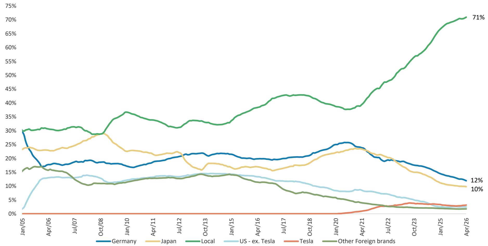

line

| Date   | Germany | Japan | Local | US - ex. Tesla | Tesla | Other Foreign brands |
|--------|---------|-------|-------|----------------|-------|----------------------|
| Apr/26 | 12%     | 10%   | 71%   | -              | -     | -                    |

Source: CPCA, MS.

# NEV Market Competition

2026 NEV Wholesale Volume Share   
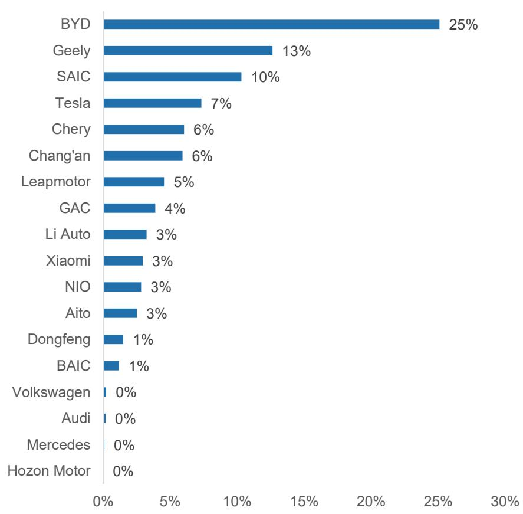

bar

| Company | Percentage (%) |
| :--- | :--- |
| BYD | 25 |
| Geely | 13 |
| SAIC | 10 |
| Tesla | 7 |
| Chery | 6 |
| Chang'an | 6 |
| Leapmotor | 5 |
| GAC | 4 |
| Li Auto | 3 |
| Xiaomi | 3 |
| NIO | 3 |
| Aito | 3 |
| Dongfeng | 1 |
| BAIC | 1 |
| Volkswagen | 0 |
| Audi | 0 |
| Mercedes | 0 |
| Hozon Motor | 0 |

2026 vs 2025 Volume Share Change   
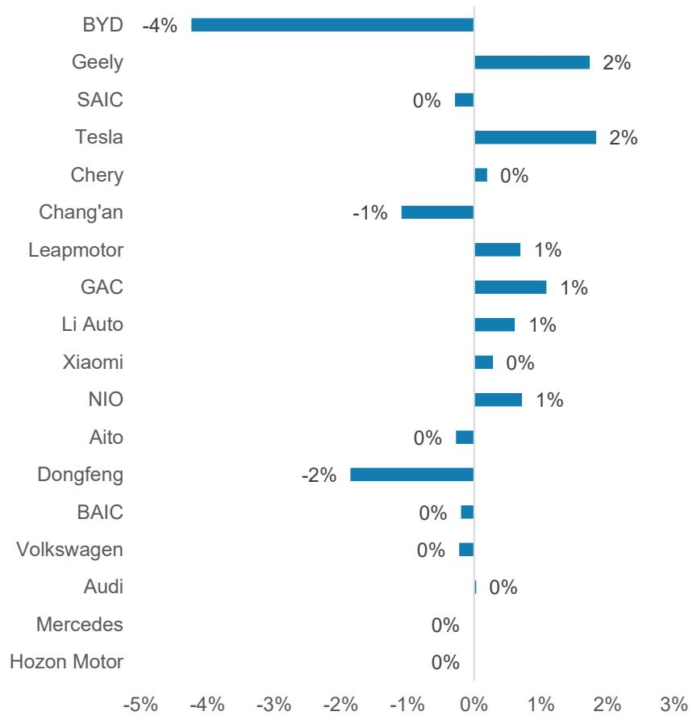

bar

| Company | Value (%) |
| :--- | :--- |
| BYD | -4 |
| Geely | 2 |
| SAIC | 0 |
| Tesla | 2 |
| Chery | 0 |
| Chang'an | -1 |
| Leapmotor | 1 |
| GAC | 1 |
| Li Auto | 1 |
| Xiaomi | 0 |
| NIO | 1 |
| Aito | 0 |
| Dongfeng | -2 |
| BAIC | 0 |
| Volkswagen | 0 |
| Audi | 0 |
| Mercedes | 0 |
| Hozon Motor | 0 |

Source: CPCA, MS.

# Key EV Players' YTD Sales

Key EV Players YTD sales (units)   
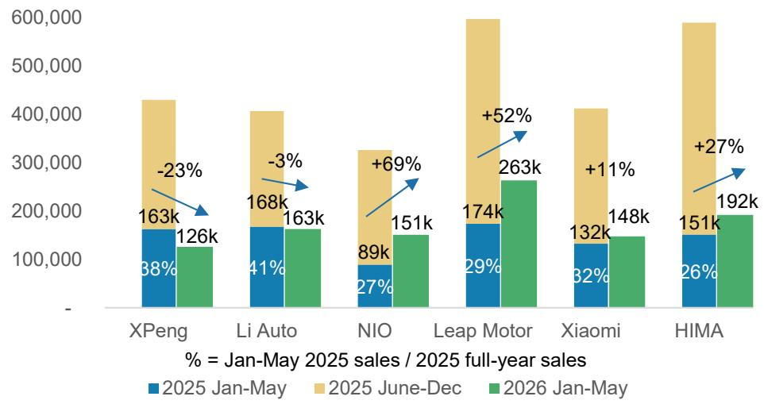

bar

| Brand | 2025 Jan-May Sales (k) | 2025 June-Dec Sales (k) | 2026 Jan-May Sales (k) | 2025 Jun-Dec Change (%) |
| :--- | :--- | :--- | :--- | :--- |
| XPeng | 163 | 126 | 38 | -23 |
| Li Auto | 168 | 163 | 41 | -3 |
| NIO | 89 | 151 | 27 | +69 |
| Leap Motor | 174 | 263 | 29 | +52 |
| Xiaomi | 132 | 148 | 32 | +11 |
| HIMA | 151 | 192 | 26 | +27 |
% = Jan-May 2025 sales / 2025 full-year sales

BYD and Geely YTD sales (units)   
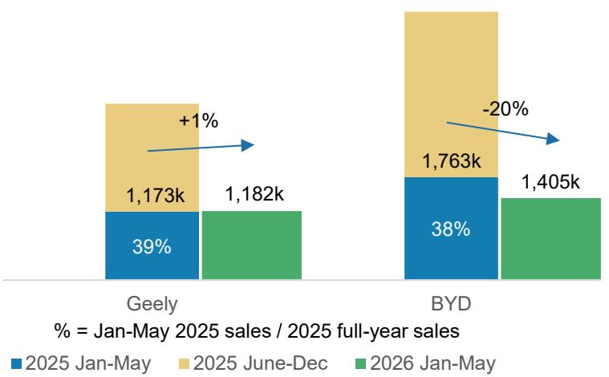

bar_stacked

| Company | 2025 Jan-May (%) | 2025 June-Dec (%) | 2026 Jan-May (%) |
| :--- | :--- | :--- | :--- |
| Geely | 39 | 1,173k | 1,182k |
| BYD | 38 | 1,763k | 1,405k |
% = Jan-May 2025 sales / 2025 full-year sales
+1%

Source: Company data, MS.

# Key Trends, Catalysts, Risks

# Key Trends

- Anti-involution – Shifting competitive landscape from price competition to value-driven differentiation   
• Tech – Advancements toward AI-enabled software-defined vehicles   
- Globalization – Chinese OEMs and their complete supply chain are accelerating overseas expansion

# Key Catalysts

• Falling YoY comparison base   
• New model cycle kicking in from mid-July   
- Implementation of L3/L4 autonomous driving regulations and licensing frameworks   
• Emerging upside risk to the overseas sales

# Key Risks

- Subdued domestic demand and intensifying industry price competition   
• Geopolitical uncertainties and potential disruptions to overseas sales   
• Autonomous driving regulatory challenges

New Models Launch Pipeline 

<table><tr><td>OEM</td><td>Brand</td><td>Model</td><td>Engine Type</td><td>Type</td><td>Est. Launch Date</td></tr><tr><td rowspan="4">SAIC</td><td rowspan="2">IM Motor</td><td>L5</td><td>BEV</td><td>Sedan</td><td>2026</td></tr><tr><td>LS5</td><td>BEV</td><td>SUV</td><td>2026</td></tr><tr><td rowspan="2">SAIC</td><td>H6</td><td>EREV</td><td>SUV</td><td>2Q26</td></tr><tr><td>H7</td><td>EREV</td><td>SUV</td><td>2H26</td></tr><tr><td rowspan="2">GAC</td><td>Aion</td><td>R2</td><td>BEV</td><td>SUV</td><td>2026</td></tr><tr><td>Hyper</td><td>S600</td><td>EREV/BEV</td><td>SUV</td><td>2Q26</td></tr><tr><td rowspan="4">BAIC</td><td rowspan="4">Stelato</td><td>MPV</td><td>TBD</td><td>MPV</td><td>2H26</td></tr><tr><td>Off-road</td><td>TBD</td><td>SUV</td><td>2H26</td></tr><tr><td>R8</td><td>TBD</td><td>SUV</td><td>2H26</td></tr><tr><td>S8</td><td>TBD</td><td>SUV</td><td>2H26</td></tr><tr><td rowspan="3">Changan</td><td rowspan="2">Avatar</td><td>G618</td><td>TBD</td><td>SUV</td><td>2026</td></tr><tr><td>07L</td><td>EREV/BEV</td><td>SUV</td><td>3Q26</td></tr><tr><td>Nevo</td><td>Q06</td><td>EREV/BEV</td><td>SUV</td><td>3Q26</td></tr><tr><td rowspan="3">Chery</td><td rowspan="2">Luxeed</td><td>R9</td><td>TBD</td><td>SUV</td><td>2H26</td></tr><tr><td>S7 GT</td><td>TBD</td><td>Sedan</td><td>2H26</td></tr><tr><td>Exeed</td><td>EX7</td><td>EREV/BEV</td><td>SUV</td><td>2Q26</td></tr><tr><td rowspan="3">Dongfeng</td><td rowspan="3">Voyah</td><td>Taishan X8</td><td>TBD</td><td>SUV</td><td>2026</td></tr><tr><td>FE</td><td>TBD</td><td>SUV</td><td>2026</td></tr><tr><td>Everest</td><td>TBD</td><td>MPV</td><td>2026</td></tr><tr><td rowspan="4">Seres</td><td rowspan="4">AITO</td><td>M9L</td><td>PHEV/BEV</td><td>SUV</td><td>2Q26</td></tr><tr><td>M5 facelift</td><td>PHEV/BEV</td><td>SUV</td><td>2H26</td></tr><tr><td>M7 facelift</td><td>PHEV/BEV</td><td>SUV</td><td>2H26</td></tr><tr><td>M9 facelift</td><td>PHEV/BEV</td><td>SUV</td><td>2H26</td></tr><tr><td rowspan="5">JAC</td><td rowspan="5">Maextro</td><td>R900</td><td>TBD</td><td>MPV</td><td>1H26</td></tr><tr><td>M900</td><td>TBD</td><td>SUV</td><td>2026</td></tr><tr><td>S800L</td><td>EREV/BEV</td><td>Sedan</td><td>2Q26</td></tr><tr><td>R800</td><td>TBD</td><td>SUV</td><td>2H26</td></tr><tr><td>Off-road</td><td>TBD</td><td>SUV</td><td>2H26</td></tr></table>

Source: Company data, CPCA, MS.

New Models Launch Pipeline (cont'd) 

<table><tr><td>OEM</td><td>Brand</td><td>Model</td><td>Engine Type</td><td>Type</td><td>Est. Launch Date</td></tr><tr><td rowspan="6">Geely</td><td rowspan="4">Galaxy</td><td>Starshine 8 EV</td><td>BEV</td><td>Sedan</td><td>2026</td></tr><tr><td>Starship 7 EV</td><td>BEV</td><td>SUV</td><td>2Q26</td></tr><tr><td>M7</td><td>PHEV</td><td>SUV</td><td>2Q26</td></tr><tr><td>Off-road</td><td>PHEV</td><td>SUV</td><td>2026</td></tr><tr><td rowspan="2">Lynk</td><td>07GT</td><td>PHEV</td><td>Sedan</td><td>2026</td></tr><tr><td>Lynk 20</td><td>BEV</td><td>SUV</td><td>2026</td></tr><tr><td rowspan="13">GWM</td><td>Haval</td><td>H7</td><td>ICEV/PHEV</td><td>SUV</td><td>2026</td></tr><tr><td rowspan="6">WEY</td><td>Gaoshan</td><td>PHEV</td><td>MPV</td><td>2Q26</td></tr><tr><td>TBD</td><td>PHEV</td><td>SUV</td><td>2026</td></tr><tr><td>TBD</td><td>PHEV</td><td>SUV</td><td>2026</td></tr><tr><td>TBD</td><td>PHEV</td><td>SUV</td><td>2026</td></tr><tr><td>TBD</td><td>PHEV</td><td>Sedan</td><td>2026</td></tr><tr><td>TBD</td><td>PHEV</td><td>Sedan</td><td>2026</td></tr><tr><td rowspan="4">ORA</td><td>TBD</td><td>BEV</td><td>Sedan</td><td>2026</td></tr><tr><td>TBD</td><td>BEV</td><td>SUV</td><td>2026</td></tr><tr><td>TBD</td><td>BEV</td><td>SUV</td><td>2026</td></tr><tr><td>TBD</td><td>BEV</td><td>Coupe</td><td>2026</td></tr><tr><td rowspan="2">Tank</td><td>Tank 700 Hi4 Z</td><td>PHEV</td><td>SUV</td><td>2026</td></tr><tr><td>Tank 800 Hi4 Z</td><td>PHEV</td><td>SUV</td><td>2026</td></tr><tr><td rowspan="6">BYD</td><td rowspan="3">BYD</td><td>Seal 08</td><td>PHEV/BEV</td><td>Sedan</td><td>2Q26</td></tr><tr><td>Great Han</td><td>BEV</td><td>Sedan</td><td>2Q26</td></tr><tr><td>Great Tang</td><td>BEV</td><td>SUV</td><td>2Q26</td></tr><tr><td>Denza</td><td>Z7</td><td>PHEV/BEV</td><td>Sedan</td><td>2026</td></tr><tr><td rowspan="2">Fangchengbao</td><td>Super 7 facelift</td><td>BEV</td><td>SUV</td><td>2Q26</td></tr><tr><td>Super 9</td><td>BEV</td><td>Sedan</td><td>2026</td></tr></table>

Source: Company data, CPCA, MS.

# New Models Launch Pipeline (cont'd)

<table><tr><td>OEM</td><td>Brand</td><td>Model</td><td>Engine Type</td><td>Type</td><td>Est. Launch Date</td></tr><tr><td rowspan="6">Li Auto</td><td rowspan="6">Li Auto</td><td>L8 facelift</td><td>EREV</td><td>SUV</td><td>2Q26</td></tr><tr><td>i7</td><td>BEV</td><td>SUV</td><td>2026</td></tr><tr><td>i9</td><td>BEV</td><td>SUV</td><td>2026</td></tr><tr><td>L6 facelift</td><td>EREV</td><td>SUV</td><td>2026</td></tr><tr><td>L7 facelift</td><td>EREV</td><td>SUV</td><td>2026</td></tr><tr><td>Mini MEGA</td><td>BEV</td><td>MPV</td><td>2026</td></tr><tr><td rowspan="2">NIO</td><td>NIO</td><td>ES8 five seater</td><td>BEV</td><td>SUV</td><td>3Q26</td></tr><tr><td>Onvo</td><td>L60 facelift</td><td>BEV</td><td>SUV</td><td>2Q26</td></tr><tr><td rowspan="3">XPeng</td><td>XPeng</td><td>G9L</td><td>EREV/BEV</td><td>SUV</td><td>2H26</td></tr><tr><td rowspan="2">MONA</td><td>L03</td><td>EREV/BEV</td><td>SUV</td><td>3Q26</td></tr><tr><td>L05</td><td>EREV/BEV</td><td>SUV</td><td>2H26</td></tr><tr><td rowspan="4">Leap Motor</td><td rowspan="4">Leap Motor</td><td>A05</td><td>BEV</td><td>Sedan</td><td>3Q26</td></tr><tr><td>C10</td><td>EREV/BEV</td><td>SUV</td><td>2Q26</td></tr><tr><td>C seires</td><td>EREV/BEV</td><td>MPV</td><td>2026</td></tr><tr><td>D99</td><td>EREV/BEV</td><td>MPV</td><td>2026</td></tr><tr><td rowspan="2">Xiaomi</td><td rowspan="2">Xiaomi</td><td>YU9</td><td>EREV</td><td>SUV</td><td>2H26</td></tr><tr><td>SU9</td><td>EREV</td><td>Sedan</td><td>2H26</td></tr></table>

Source: Company data, CPCA, MS.

# China Auto Parts & Dealers

Smart Features With Values to OEM and Consumer Will Enjoy Structural Growth   
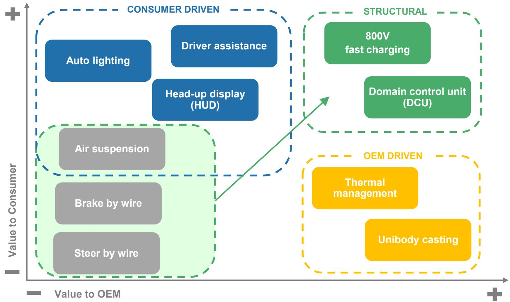

flowchart

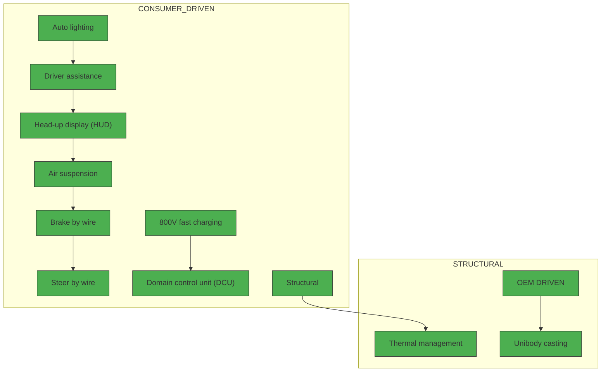
```mermaid
graph TD
    A["Auto lighting"] --> B["Driver assistance"]
    B --> C["Head-up display (HUD)"]
    C --> D["Air suspension"]
    D --> E["Brake by wire"]
    E --> F["Steer by wire"]
    G["800V fast charging"] --> H["Domain control unit (DCU)"]
    I["Structural"] --> J["Thermal management"]
    K["OEM DRIVEN"] --> L["Unibody casting"]
    style A fill:#4CAF50,stroke:#333
    style B fill:#4CAF50,stroke:#333
    style C fill:#4CAF50,stroke:#333
    style D fill:#4CAF50,stroke:#333
    style E fill:#4CAF50,stroke:#333
    style F fill:#4CAF50,stroke:#333
    style G fill:#4CAF50,stroke:#333
    style H fill:#4CAF50,stroke:#333
    style I fill:#4CAF50,stroke:#333
    style J fill:#4CAF50,stroke:#333
    style K fill:#4CAF50,stroke:#333
    style L fill:#4CAF50,stroke:#333
    subgraph CONSUMER_DRIVEN
        A
        B
        C
        D
        E
        F
        G
        H
        I
    end
    subgraph STRUCTURAL
        J
        K
        L
    end
```

Source: MS.

# China Auto Parts Revenue Exposure by Category

China auto parts revenue exposure (2025E)   
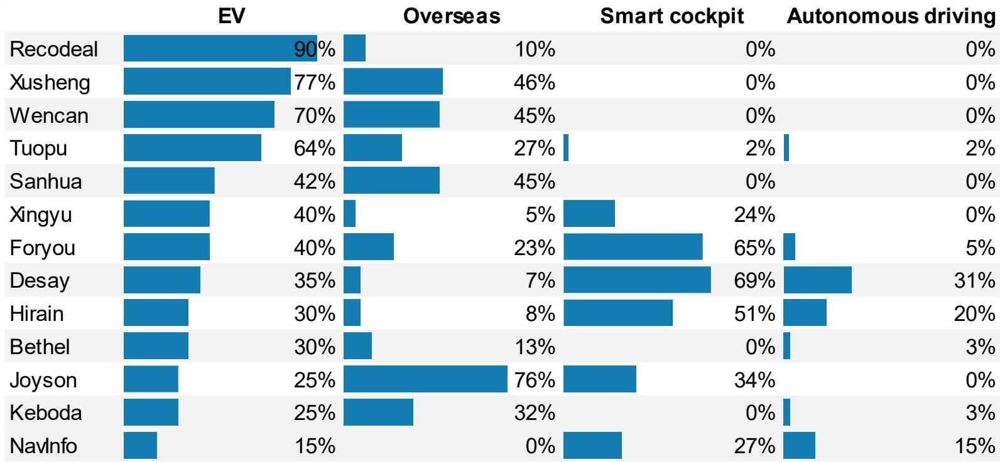

bar

| Company | EV (%) | Overseas (%) | Smart cockpit (%) | Autonomous driving (%) |
| :--- | :--- | :--- | :--- | :--- |
| Recodeal | 90 | 10 | 0 | 0 |
| Xusheng | 77 | 46 | 0 | 0 |
| Wencan | 70 | 45 | 0 | 0 |
| Tuopu | 64 | 27 | 2 | 2 |
| Sanhua | 42 | 45 | 0 | 0 |
| Xingyu | 40 | 5 | 24 | 0 |
| Foryou | 40 | 23 | 65 | 5 |
| Desay | 35 | 7 | 69 | 31 |
| Hirain | 30 | 8 | 51 | 20 |
| Bethel | 30 | 13 | 0 | 3 |
| Joyson | 25 | 76 | 34 | 0 |
| Keboda | 25 | 32 | 0 | 3 |
| NavInfo | 15 | 0 | 27 | 15 |

Source: MS (E) estimates.

China Auto Suppliers are Evolving From Exporting to Building Overseas Plants   
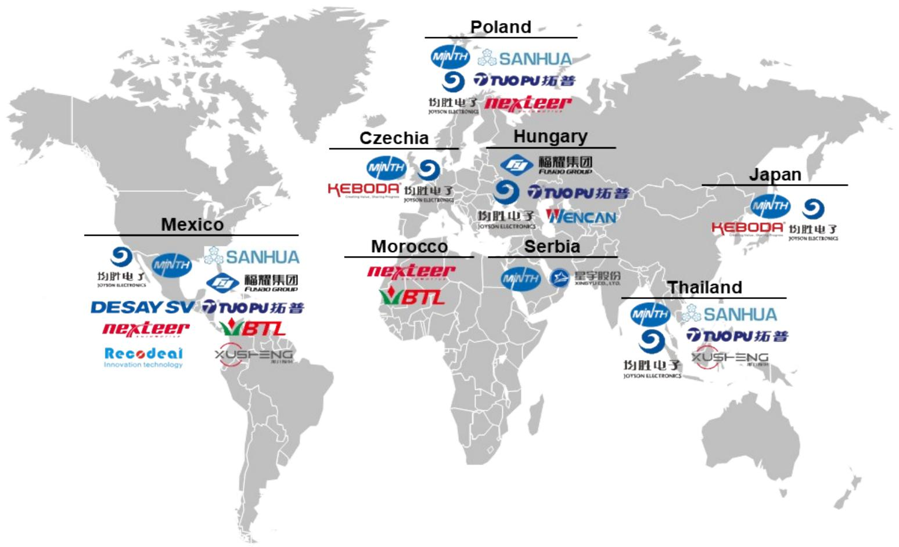

text_image

Poland
MINTH SANHUA
TUOPU拓普
均胜电子
nexteer
JOTSON ELECTRONICS
Czechia
MINTH KEBODA 均胜电子
Croning Value, Sharing Program
Hungary
福耀集团
FUADIO GROUP
TUOPU拓普
均胜电子
JOTSON ELECTRONICS
Japan
MINTH KEBODA 均胜电子
Croning Value, Sharing Program
Morocco
nexteer BTL
Serbia
MINTH 星宇股份
XINDYUEO, LTD.
Thailand
MINTH SANHUA TUOPU拓普
均胜电子
XUSHENG JOTSON ELECTRONICS
Mexico
均胜电子
JOTSON ELECTRONICS
SanHUA
福耀集团
FUADIO GROUP
DESAY SV TUOPU拓普
nexteer BTL
Recodeai Innovation technology XUSFENG BEIJING

Source: Company data, MS (E) estimates.

# Auto Companies are Becoming Humanoid Players

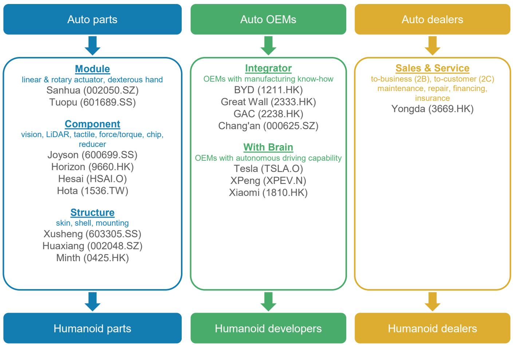

flowchart

```mermaid
graph TD
    A["Auto parts"] --> B["Module"]
    B --> C["Component"]
    C --> D["Structure"]
    D --> E["Humanoid parts"]
    
    F["Auto OEMs"] --> G["Integrator"]
    G --> H["With Brain"]
    
    I["Auto dealers"] --> J["Sales & Service"]
    J --> K["Humanoid dealers"]
    
    B --> L["Linear & rotary actuator, dexterous hand"]
    B --> M["Sanhua (002050.SZ)"]
    B --> N["Tuopu (601689.SS)"]
    C --> O["vision, LiDAR, tactile, force/torque, chip, reducer"]
    C --> P["Joyson (600699.SS)"]
    C --> Q["Horizon (9660.HK)"]
    C --> R["Hesai (HSAI.O)"]
    C --> S["Hota (1536.TW)"]
    D --> T["skin, shell, mounting"]
    D --> U["Xusheng (603305.SS)"]
    D --> V["Huaxiang (002048.SZ)"]
    D --> W["Minth (0425.HK)"]
    
    G --> X["OEMs with manufacturing know-how"]
    G --> Y["BYD (1211.HK)"]
    G --> Z["Great Wall (2333.HK)"]
    G --> AA["GAC (2238.HK)"]
    G --> AB["Chang'an (000625.SZ)"]
    
    H --> AC["OEMs with autonomous driving capability"]
    H --> AD["Tesla (TSLA.O)"]
    H --> AE["XPeng (XPEV.N)"]
    H --> AF["Xiaomi (1810.HK)"]
    
    J --> AG["to-business (2B), to-customer (2C)"]
    J --> AH["maintenance, repair, financing, insurance"]
    J --> AI["Yongda (3669.HK)"]
    
    K --> AJ["Humanoid developers"]
```

Source: MS.

# Auto Parts – Target High-value and Common Parts in Humanoids

Auto suppliers target high-value humanoid parts   
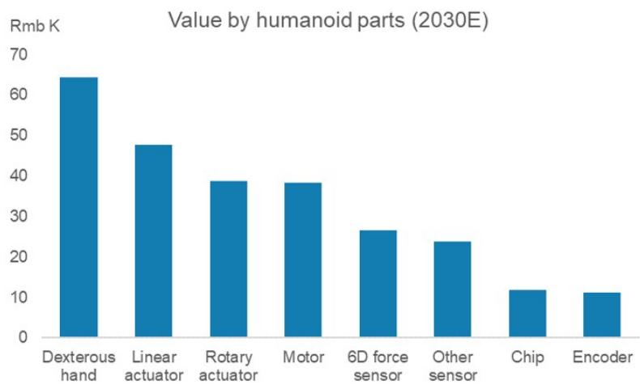

bar

Value by humanoid parts (2030E)
| Category | Value (Rmb K) |
|---|---|
| Dexterous hand | 64 |
| Linear actuator | 47 |
| Rotary actuator | 38 |
| Motor | 38 |
| 6D force sensor | 26 |
| Other sensor | 23 |
| Chip | 12 |
| Encoder | 11 |

Many sensors are common in autos and humanoids 

<table><tr><td>Sensors</td><td>Robotaxi</td><td>Humanoid</td></tr><tr><td>Camera</td><td>Y</td><td>Y</td></tr><tr><td>LiDAR</td><td>Y</td><td>Y</td></tr><tr><td>Radar</td><td>Y</td><td>Y</td></tr><tr><td>Auditory</td><td>Y</td><td>Y</td></tr><tr><td>Inertial measurement unit</td><td>Y</td><td>Y</td></tr><tr><td>Electronic stability program</td><td>Y</td><td>Y</td></tr><tr><td>Force/torque</td><td></td><td>Y</td></tr><tr><td>Tactile</td><td></td><td>Y</td></tr><tr><td>Steering angle</td><td>Y</td><td></td></tr><tr><td>Wheel speed</td><td>Y</td><td></td></tr></table>

Source: MS (E) estimates.

# Auto Dealer New Car Sales Remained Loss-making Due to Price Competition

Auto dealer new car margin   
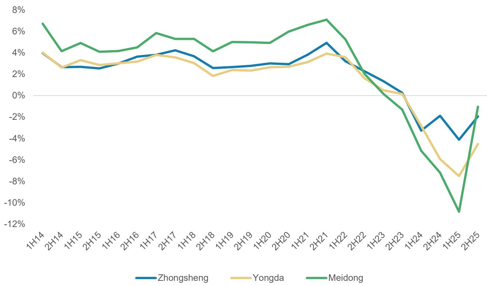

line

| Period | Zhongsheng | Yongda | Meidong |
|--------|------------|--------|---------|
| 1H14   | 4.0%       | 4.0%   | 7.0%    |
| 2H14   | 2.5%       | 2.5%   | 4.0%    |
| 1H15   | 2.5%       | 3.0%   | 5.0%    |
| 2H15   | 2.5%       | 2.5%   | 4.0%    |
| 1H16   | 3.0%       | 3.0%   | 4.0%    |
| 2H16   | 3.5%       | 3.0%   | 4.5%    |
| 1H17   | 4.0%       | 3.5%   | 6.0%    |
| 2H17   | 4.5%       | 3.5%   | 5.5%    |
| 1H18   | 3.5%       | 3.0%   | 5.5%    |
| 2H18   | 2.5%       | 2.0%   | 4.0%    |
| 1H19   | 2.5%       | 2.0%   | 5.0%    |
| 2H19   | 2.5%       | 2.0%   | 5.0%    |
| 1H20   | 3.0%       | 2.5%   | 5.0%    |
| 2H20   | 3.0%       | 2.5%   | 6.0%    |
| 1H21   | 4.0%       | 3.0%   | 7.0%    |
| 2H21   | 5.0%       | 4.0%   | 7.5%    |
| 1H22   | 3.5%       | 3.5%   | 5.0%    |
| 2H22   | 2.0%       | 2.0%   | 3.0%    |
| 1H23   | 1.0%       | 1.0%   | -1.0%   |
| 2H23   | -1.0%      | -1.0%  | -3.0%   |
| 1H24   | -3.0%      | -3.0%  | -6.0%   |
| 2H24   | -2.0%      | -6.0%  | -8.0%   |
| 1H25   | -4.0%      | -8.0%  | -11.0%  |
| 2H25   | -2.0%      | -4.0%  | -1.0%   |

Source: Company data, MS estimates.

# Auto Aftermarket is Fragmented With Various Service Providers

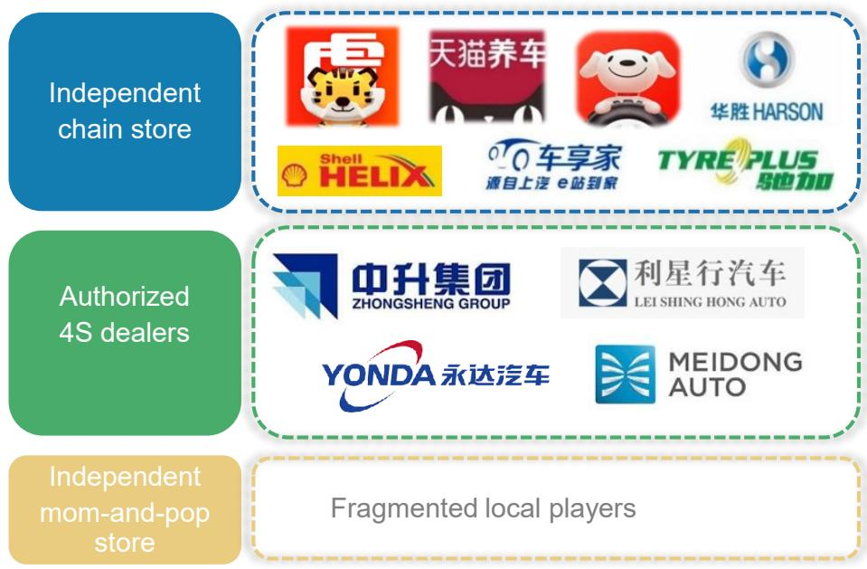

text_image

Independent chain store
天猫养车
华胜 HARSON
Shell HELIX
车享家
源自上汽 e站到家
TYRE PLUS 驰也加
Authorized 4S dealers
中升集团
ZHONGSHENG GROUP
利星行汽车
LEI SHING HONG AUTO
YONDA 永达汽车
MEIDONG AUTO
Independent mom-and-pop store
Fragmented local players

Market share shifts in China auto aftermarket   
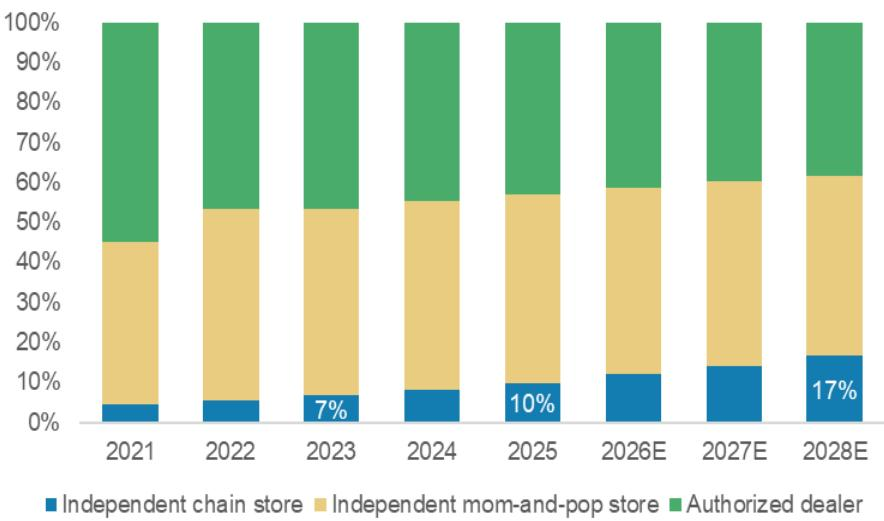

bar_stacked

| Year | Independent chain store (%) | Independent mom-and-pop store (%) | Authorized dealer (%) |
| :--- | :--- | :--- | :--- |
| 2021 | 4 | 43 | 57 |
| 2022 | 5 | 49 | 46 |
| 2023 | 7 | 52 | 46 |
| 2024 | 8 | 54 | 45 |
| 2025 | 10 | 56 | 43 |
| 2026E | 12 | 58 | 41 |
| 2027E | 14 | 60 | 39 |
| 2028E | 17 | 61 | 38 |

Source: Company data, MS (E) estimates.

# Authorized Dealers for Collision Repair, Independent Players for Maintenance & Detailing

Aftermarket revenue breakdown   
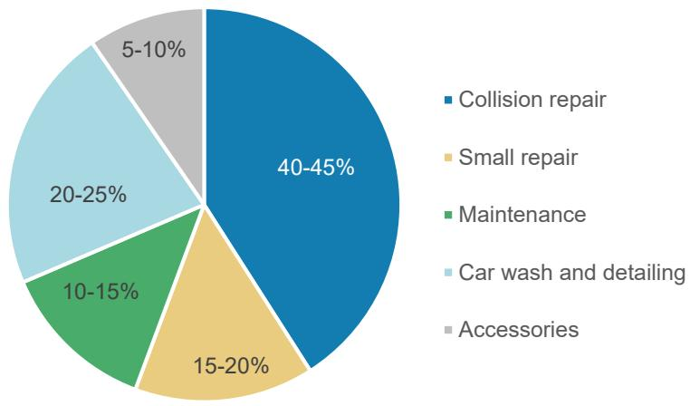

pie

| Category | Percentage (%) |
| :--- | :--- |
| Collision repair | 40-45 |
| Small repair | 15-20 |
| Maintenance | 10-15 |
| Car wash and detailing | 20-25 |
| Accessories | 5-10 |

<table><tr><td></td><td colspan="2">Within warranty</td><td>Beyond warranty</td></tr><tr><td>Collision repair</td><td colspan="2">4S</td><td>4S</td></tr><tr><td>Small repair</td><td colspan="2">4S</td><td>IAM</td></tr><tr><td>Maintenance</td><td>4S</td><td>IAM</td><td>IAM</td></tr><tr><td>Detailing</td><td>4S</td><td>IAM</td><td>IAM</td></tr><tr><td>Accessory</td><td>4S</td><td>IAM</td><td>IAM</td></tr><tr><td>Tire</td><td colspan="2">IAM</td><td>IAM</td></tr></table>

4S = authorized 4S dealers, IAM = independent aftermarket repair stores   
Source: Company data, MS.

This presentation references jurisdiction(s) or person(s) which may be the subject of economic sanctions. Readers are solely responsible for ensuring that their investment activities are carried out in compliance with applicable laws.

# Disclosure Section

The information and opinions in MS were prepared or are disseminated by MS Asia Limited (which accepts the responsibility for its contents) and/or MS Asia (Singapore) Pte. (Registration number 199206298Z) and/or MS Asia (Singapore) Securities Pte Ltd (Registration number 200008434H), regulated by the Monetary Authority of Singapore (which accepts legal responsibility for its contents and should be contacted with respect to any matters arising from, or in connection with, MS), and/or MS Taiwan Limited and/or MS & Co International plc, Seoul Branch, and/or MS Australia Limited (A.B.N. 67 003 734 576, holder of Australian financial services license No. 233742, which accepts responsibility for its contents), and/or MS Wealth Management Australia Pty Ltd (A.B.N. 19 009 145 555, holder of Australian financial services license No. 240813, which accepts responsibility for its contents), and/or MS India Company Private Limited having Corporate Identification No (CIN) U22990MH1998PTC115305, regulated by the Securities and Exchange Board of India ("SEBI") and holder of licenses as a Research Analyst (SEBI Registration No. INH000001105); Stock Broker (SEBI Stock Broker Registration No. INZ000244438), Merchant Banker (SEBI Registration No. INM000011203), and depository participant with National Securities Depository Limited (SEBI Registration No. IN-DP-NSDL-567-2021) having registered office at Altimus, Level 39 & 40, Pandurang Budhkar Marg, Worli, Mumbai 400018, India; Telephone no. +91-22-61181000; Compliance Officer Details: Mr. Tejarshi Hardas, Tel. No.: +91-22-61181000 or Email: tejarshi.hardas@morganstanley.com; Grievance officer details: Mr. Tejarshi Hardas, Tel. No.: +91-22-61181000 or Email: msic-compliance@morganstanley.com which accepts the responsibility for its contents and should be contacted with respect to any matters arising from, or in connection with, MS, and their affiliates (collectively, "MS"). MS India Company Private Limited (MSICPL) may use AI tools in providing research services. All recommendations contained herein are made by the duly qualified research analysts.

For important disclosures, stock price charts and equity rating histories regarding companies that are the subject of this report, please see the MS Disclosure Website at www.morganstanley.com/eqr/disclosures/webapp/generalresearch, or contact your investment representative or MS at 1585 Broadway, (Attention: Research Management), New York, NY, 10036 USA.

For valuation methodology and risks associated with any recommendation, rating or price target referenced in this research report, please contact the Client Support Team as follows: US/Canada +1800 303-2495; Hong Kong +852 2848-5999; Latin America +1718 754-5444 (U.S.); London +44 (0)20-7425-8169; Singapore +65 6834-6860; Sydney +61(0)2-9770-1505; Tokyo +81(0)3-6836-9000. Alternatively you may contact your investment representative or MS at 1585 Broadway, (Attention: Research Management), New York, NY 10036 USA.

# Analyst Certification

The following analysts hereby certify that their views about the companies and their securities discussed in this report are accurately expressed and that they have not received and will not receive direct or indirect compensation in exchange for expressing specific recommendations or views in this report: Tim Hsiao; Shelley Wang, CFA; Joey Xu, CFA.

# Global Research Conflict Management Policy

MS has been published in accordance with our conflict management policy, which is available at www.morganstanley.com/institutional/research/conflictpolicies. A Portuguese version of the policy can be found at www.morganstanley.com.br

# Important Regulatory Disclosures on Subject Companies

As of April 30, 2026, MS beneficially owned 1% or more of a class of common equity securities of the following companies covered in MS: Brilliance China Automotive, BYD Company Limited, EHang Holdings Ltd, Geely Automobile Holdings, Great Wall Motor Company Limited, Li Auto Inc., NIO Inc., Suzhou Recodeal Interconnect System, Voyah Automotive Technology Co. Ltd., WeRide Inc, XPeng Inc..

Within the last 12 months, MS managed or co-managed a public offering (or 144A offering) of securities of Horizon Robotics, NIO Inc., WeRide Inc, Zhongsheng Group Holdings.

Within the last 12 months, MS has received compensation for investment banking services from Huizhou Desay SV Automotive Co Ltd, NIO Inc., WeRide Inc.

In the next 3 months, MS expects to receive or intends to seek compensation for investment banking services from BYD Company Limited, Changzhou Xingyu Automotive Lighting Sys, Chongqing Changan Automobile, EHang Holdings Ltd, Fuyao Glass Industry Group, Geely Automobile Holdings, Great Wall Motor Company Limited, Hesai Group, Huayu Automotive, Huizhou Desay SV Automotive Co Ltd, Li Auto Inc., Minth Group Limited, Ningbo Joyson Electronic Corp, Ningbo Tuopu Group Co Ltd, NIO Inc., SAIC Motor Corp. Ltd., WeRide Inc, XPeng Inc., Zhongsheng Group Holdings.

Within the last 12 months, MS has received compensation for products and services other than investment banking services from BYD Company Limited, EHang Holdings Ltd, Geely Automobile Holdings, Hesai Group, Horizon Robotics, Minth Group Limited, Zhongsheng Group Holdings.

Within the last 12 months, MS has provided or is providing investment banking services to, or has an investment banking client relationship with, the following company: BYD Company Limited, Changzhou Xingyu Automotive Lighting Sys, Chongqing Changan Automobile, EHang Holdings Ltd, Fuyao Glass Industry Group, Geely Automobile Holdings, Great Wall Motor Company Limited, Hesai Group, Horizon Robotics, Huayu Automotive, Huizhou Desay SV Automotive Co Ltd, Li Auto Inc., Minth Group Limited, Ningbo Joyson Electronic Corp, Ningbo Tuopu Group Co Ltd, NIO Inc., SAIC Motor Corp. Ltd., WeRide Inc, XPeng Inc., Zhongsheng Group Holdings.

Within the last 12 months, MS has either provided or is providing non-investment banking, securities-related services to and/or in the past has entered into an agreement to provide services or has a client relationship with the following company: BYD Company Limited, China MeiDong Auto Holdings Ltd, EHang Holdings Ltd, Geely Automobile Holdings, Hesai Group, Horizon Robotics, Minth Group Limited, NIO Inc., Zhongsheng Group Holdings.

The equity research analysts or strategists principally responsible for the preparation of MS have received compensation based upon various factors, including quality of research, investor client feedback, stock picking, competitive factors, firm revenues and overall investment banking revenues. Equity Research analysts' or strategists' compensation is not linked to investment banking or capital markets transactions performed by MS or the profitability or revenues of particular trading desks.

MS and its affiliates do business that relates to companies/instruments covered in MS, including market making, providing liquidity, fund management, commercial banking, extension of credit, investment services and investment banking. MS sells to and buys from customers the securities/instruments of companies covered in MS on a principal basis. MS may have a position in the debt of the Company or instruments discussed in this report. MS trades or may trade as principal in the debt securities (or in related derivatives) that are the subject of the debt research report.

Certain disclosures listed above are also for compliance with applicable regulations in non-US jurisdictions.

# STOCK RATINGS

MS uses a relative rating system using terms such as Overweight, Equal-weight, Not-Rated or Underweight (see definitions below). MS does not assign ratings of Buy, Hold or Sell to the stocks we cover. Overweight, Equal-weight, Not-Rated and Underweight are not the equivalent of buy, hold and sell. Investors should carefully read the definitions of all ratings used in MS. In addition, since MS contains more complete information concerning the analyst's views, investors should carefully read MS, in its entirety, and not infer the contents from the rating alone. In any case, ratings (or research) should not be used or relied upon as investment advice. An investor's decision to buy or sell a stock should depend on individual circumstances (such as the investor's existing holdings) and other considerations.

# Global Stock Ratings Distribution

(as of May 31, 2026)

The Stock Ratings described below apply to MS's Fundamental Equity Research and do not apply to Debt Research produced by the Firm.

For disclosure purposes only (in accordance with FINRA requirements), we include the category headings of Buy, Hold, and Sell alongside our ratings of Overweight, Equal-weight, Not-Rated and Underweight. MS does not assign ratings of Buy, Hold or Sell to the stocks we cover. Overweight, Equal-weight, Not-Rated and Underweight are not the equivalent of buy, hold, and sell but represent recommended relative weightings (see definitions below). To satisfy regulatory requirements, we correspond Overweight, our most positive stock rating, with a buy recommendation; we correspond Equal-weight and Not-Rated to hold and Underweight to sell recommendations, respectively.

<table><tr><td></td><td colspan="2">Coverage Universe</td><td colspan="3">Investment Banking Clients (IBC)</td><td colspan="2">Other Material Investment Services Clients (MISC)</td></tr><tr><td>Stock Rating Category</td><td>Count</td><td>% of Total</td><td>Count</td><td>% of Total IBC</td><td>% of Rating Category</td><td>Count</td><td>% of Total Other MISC</td></tr><tr><td>Overweight/Buy</td><td>1542</td><td>42%</td><td>465</td><td>51%</td><td>30%</td><td>707</td><td>43%</td></tr><tr><td>Equal-weight/Hold</td><td>1571</td><td>43%</td><td>369</td><td>40%</td><td>23%</td><td>723</td><td>44%</td></tr><tr><td>Not-Rated/Hold</td><td>3</td><td>0%</td><td>0</td><td>0%</td><td>0%</td><td>1</td><td>0%</td></tr><tr><td>Underweight/Sell</td><td>551</td><td>15%</td><td>86</td><td>9%</td><td>16%</td><td>201</td><td>12%</td></tr><tr><td>Total</td><td>3,667</td><td></td><td>920</td><td></td><td></td><td>1632</td><td></td></tr></table>

Data include common stock and ADRs currently assigned ratings. Investment Banking Clients are companies from whom MS received investment banking compensation in the last 12 months. Due to rounding off of decimals, the percentages provided in the "% of total" column may not add up to exactly 100 percent.

# Analyst Stock Ratings

Overweight (O). The stock's total return is expected to exceed the average total return of the analyst's industry (or industry team's) coverage universe, on a risk-adjusted basis, over the next 12-18 months.

Equal-weight (E). The stock's total return is expected to be in line with the average total return of the analyst's industry (or industry team's) coverage universe, on a risk-adjusted basis, over the next 12-18 months.

Not-Rated (NR). Currently the analyst does not have adequate conviction about the stock's total return relative to the average total return of the analyst's industry (or industry team's) coverage universe, on a risk-adjusted basis, over the next 12-18 months.

Underweight (U). The stock's total return is expected to be below the average total return of the analyst's industry (or industry team's) coverage universe, on a risk-adjusted basis, over the next 12-18 months.

Unless otherwise specified, the time frame for price targets included in MS is 12 to 18 months.

# Analyst Industry Views

Attractive (A): The analyst expects the performance of his or her industry coverage universe over the next 12-18 months to be attractive vs. the relevant broad market benchmark, as indicated below.

In-Line (I): The analyst expects the performance of his or her industry coverage universe over the next 12-18 months to be in line with the relevant broad market benchmark, as indicated below.

Cautious (C): The analyst views the performance of his or her industry coverage universe over the next 12-18 months with caution vs. the relevant broad market benchmark, as indicated below.

Benchmarks for each region are as follows: North America - S&P 500; Latin America - relevant MSCI country index or MSCI Latin America Index; Europe - MSCI Europe; Japan - TOPIX; Asia - relevant MSCI country index or MSCI sub-regional index or MSCI AC Asia Pacific ex Japan Index.

# Important Disclosures for MS Smith Barney LLC Customers

Important disclosures regarding any material conflict of interest that can reasonably be expected to have influenced MS Smith Barney LLC's choice of a third-party research provider or the subject company of a third-party research report, are available on the MS Wealth Management disclosure website at www.morganstanley.com/online/researchdisclosures. For MS specific disclosures, you may refer to https://www.morganstanley.com/eqr/disclosures/webapp/generalre-

search.

Each MS report is reviewed and approved on behalf of MS Smith Barney LLC. This review and approval is conducted by the same person who reviews the research report on behalf of MS. This could create a conflict of interest.

# Other Important Disclosures

MS policy is to update research reports as and when the Research Analyst and Research Management deem appropriate, based on developments with the issuer, the sector, or the market that may have a material impact on the research views or opinions stated therein. In addition, certain Research publications are intended to be updated on a regular periodic basis (weekly/monthly/quarterly/annual) and will ordinarily be updated with that frequency, unless the Research Analyst and Research Management determine that a different publication schedule is appropriate based on current conditions.

MS is not acting as a municipal advisor and the opinions or views contained herein are not intended to be, and do not constitute, advice within the meaning of Section 975 of the Dodd-Frank Wall Street Reform and Consumer Protection Act. MS produces an equity research product called a "Tactical Idea." Views contained in a "Tactical Idea" on a particular stock may be contrary to the recommendations or views expressed in research on the same stock. This may be the result of differing time horizons, methodologies, market events, or other factors. For all research available on a particular stock, please contact your sales representative or go to Matrix at http://www.morganstanley.com/matrix.

MS is provided to our clients through our proprietary research portal on Matrix and also distributed electronically by MS to clients. Certain, but not all, MS products are also made available to clients through third-party vendors or redistributed to clients through alternate electronic means as a convenience. For access to all available MS, please contact your sales representative or go to Matrix at http://www.morganstanley.com/matrix.Any access and/or use of MS is subject to MS's Terms of Use (http://www.morganstanley.com/terms.html). By accessing and/or using MS, you are indicating that you have read and agree to be bound by our Terms of Use (http://www.morganstanley.com/terms.html). In addition you consent to MS processing your personal data and using cookies in accordance with our Privacy Policy and our Global Cookies Policy (http://www.morganstanley.com/privacy\_pledge.html), including for the purposes of setting your preferences and to collect readership data so that we can deliver better and more personalized service and products to you. To find out more information about how MS processes personal data, how we use cookies and how to reject cookies see our Privacy Policy and our Global Cookies Policy (http://www.morganstanley.com/privacy\_pledge.html). Please use the provided link to review the Terms and Conditions and Most Important Terms and Conditions for MS India Company Private Limited (https://www.morganstanley.com/assets/pdfs/about-us-global-offices/india/Terms\_and\_conditions.pdf) and the following link to review the audit report (https://ny.matrix.ms.com/eqr/research/webapp/researchdocs/MSICPL\_Morgan\_Stanley\_Research\_Audit\_Report.pdf).

If you do not agree to our Terms of Use and/or if you do not wish to provide your consent to MS processing your personal data or using cookies please do not access our research.

MS does not provide individually tailored investment advice. MS has been prepared without regard to the circumstances and objectives of those who receive it. MS recommends that investors independently evaluate particular investments and strategies, and encourages investors to seek the advice of a financial adviser. The appropriateness of an investment or strategy will depend on an investor's circumstances and objectives. The securities, instruments, or strategies discussed in MS may not be suitable for all investors, and certain investors may not be eligible to purchase or participate in some or all of them. MS is not an offer to buy or sell or the solicitation of an offer to buy or sell any security/instrument or to participate in any particular trading strategy. The value of and income from your investments may vary because of changes in interest rates, foreign exchange rates, default rates, prepayment rates, securities/instruments prices, market indexes, operational or financial conditions of companies or other factors. There may be time limitations on the exercise of options or other rights in securities/instruments transactions. Past performance is not necessarily a guide to future performance. Estimates of future performance are based on assumptions that may not be realized. If provided, and unless otherwise stated, the closing price on the cover page is that of the primary exchange for the subject company's securities/instruments.

The fixed income research analysts, strategists or economists principally responsible for the preparation of MS have received compensation based upon various factors, including quality, accuracy and value of research, firm profitability or revenues (which include fixed income trading and capital markets profitability or revenues), client feedback and competitive factors. Fixed Income Research analysts', strategists' or economists' compensation is not linked to investment banking or capital markets transactions performed by MS or the profitability or revenues of particular trading desks.

The "Important Regulatory Disclosures on Subject Companies" section in MS lists all companies mentioned where MS owns 1% or more of a class of common equity securities of the companies. For all other companies mentioned in MS, MS may have an investment of less than 1% in securities/instruments or derivatives of securities/instruments of companies and may trade them in ways different from those discussed in MS. Employees of MS not involved in the preparation of MS may have investments in securities/instruments or derivatives of securities/instruments of companies mentioned and may trade them in ways different from those discussed in MS. Derivatives may be issued by MS or associated persons.

With the exception of information regarding MS, MS is based on public information. MS makes every effort to use reliable, comprehensive information, but we make no representation that it is accurate or complete. We have no obligation to tell you when opinions or information in MS change apart from when we intend to discontinue equity research coverage of a subject company. Facts and views presented in MS have not been reviewed by, and may not reflect information known to, professionals in other MS business areas, including investment banking personnel.

MS personnel may participate in company events such as site visits and are generally prohibited from accepting payment by the company of associated expenses unless pre-approved by authorized members of Research management. MS may make investment decisions that are inconsistent with the recommendations or views in this report.

To our readers based in Taiwan or trading in Taiwan securities/instruments: Information on securities/instruments that trade in Taiwan is distributed by MS Taiwan Limited ("MSTL"). Such information is for your reference only. The reader should independently evaluate the investment risks and is solely responsible for their investment decisions. MS may not be distributed to the public media or quoted or used by the public media without the express written consent of MS. Any non-customer reader within the scope of Article 7-1 of the Taiwan Stock Exchange Recommendation Regulations accessing and/or receiving MS is not permitted to provide MS to any third party (including but not limited to related parties, affiliated companies and any other third parties) or engage in any activities regarding MS which may create or give the appearance of creating a conflict of interest. Information on securities/instruments that do not trade in Taiwan is for informational purposes only and is not to be construed as a recommendation or a solicitation to trade in such securities/instruments. MSTL may not execute transactions for clients in these securities/instruments.

Certain information in MS was sourced by employees of the Shanghai Representative Office of MS Asia Limited for the use of MS Asia Limited.

MS is not incorporated under PRC law and the research in relation to this report is conducted outside the PRC. MS does not constitute an offer to sell or the solicitation of an offer to buy any securities in the PRC. PRC investors shall have the relevant qualifications to invest in such securities and shall be responsible for obtaining all relevant approvals, licenses, verifications and/or registrations from the relevant governmental authorities themselves. Neither this report nor any part of it is intended as, or shall constitute, provision of any consultancy or advisory service of securities investment as defined under PRC law. Such information is provided for your reference only.

MS is disseminated in Brazil by MS C.T.V.M. S.A. located at Av. Brigadeiro Faria Lima, 3600, 6th floor, São Paulo - SP, Brazil; and is regulated by the Comissão de Valores Mobiliários; in Mexico by MS México, Casa de Bolsa, S.A. de C.V which is regulated by Comision Nacional Bancaria y de Valores. Paseo de los Tamarindos 90, Torre 1, Col. Bosques de las Lomas Floor 29, 05120 Mexico City; in Japan by MS MUFG Securities Co., Ltd. and, for Commodities related research reports only, MS Capital Group Japan Co., Ltd; in Hong Kong by MS Asia Limited (which accepts responsibility for its contents) and by MS Bank Asia Limited; in Singapore by MS Asia (Singapore) Pte. (Registration number 199206298Z) and/or MS Asia (Singapore) Securities Pte Ltd (Registration number 200008434H), regulated by the Monetary Authority of Singapore (which accepts legal responsibility for its contents and should be contacted with respect to any matters arising from, or in connection with, MS) and by MS Bank Asia Limited, Singapore Branch (Registration number T14FC0118); in Australia to "wholesale clients" within the meaning of the Australian Corporations Act by MS Australia Limited A.B.N. 67 003 734 576, holder of Australian financial services license No. 23374-2, which accepts responsibility for its contents; in Australia to "wholesale clients" and "retail clients" within the meaning of the Australian Corporations Act by MS Wealth Management Australia Pty Ltd (A.B.N. 19 009 145 555, holder of Australian financial services license No. 240813, which accepts responsibility for its contents; in Korea by MS & Co International plc, Seoul Branch; in India by MS India Company Private Limited having Corporate Identification No (CIN) U22990MH1998PTC115305, regulated by the Securities and Exchange Board of India ("SEBI") and holder of licenses as a Research Analyst (SEBI Registration No. INH000001105); Stock Broker (SEBI Stock Broker Registration No. INZ000244438), Merchant Banker (SEBI Registration No. INM000011203), and depository participant with National Securities Depository Limited (SEBI Registration No. IN-DP-NSDL-567-2021) having registered office at Altimus, Level 39 & 40, Pandurang Budhkar Marg, Worli, Mumbai 400018, India; Telephone no. +91-22-61181000; Compliance Officer Details: Mr. Tejarshi Hardas, Tel. No.: +91-22-61181000 or Email: tejarshi.hardas@morganstanley.com; Grievance officer details: Mr. Tejarshi Hardas, Tel. No.: +91-22-61181000 or Email: msic-compliance@morganstanley.com. MS India Company Private Limited (MSICPL) may use AI tools in providing research services. All recommendations contained herein are made by the duly qualified research analysts; in Canada by MS Canada Limited; in Germany and the European Economic Area where required by MS Europe S.E., authorised and regulated by Bundesanstalt fuer Finanzdienstleistungsaufsicht (BaFin) under the reference number 149169; in the US by MS & Co. LLC, which accepts responsibility for its contents. MS & Co. International plc, authorized by the Prudential Regulation Authority and regulated by the Financial Conduct Authority and the Prudential Regulation Authority, disseminates in the UK research that it has prepared, and research which has been prepared by any of its affiliates, only to persons who (i) are investment professionals falling within Article 19(5) of the Financial Services and Markets Act 2000 (Financial Promotion) Order 2005 (as amended, the "Order"); (ii) are persons who are high net worth entities falling within Article 49(2)(a) to (d) of the Order; or (iii) are persons to whom an invitation or inducement to engage in investment activity (within the meaning of section 21 of the Financial Services and Markets Act 2000, as amended) may otherwise lawfully be communicated or caused to be communicated. RMB MS Proprietary Limited is a member of the JSE Limited and A2X (Pty) Ltd. RMB MS Proprietary Limited is a joint venture owned equally by MS International Holdings Inc. and RMB Investment Advisory (Proprietary) Limited, which is wholly owned by FirstRand Limited. The information in MS is being disseminated by MS Saudi Arabia, regulated by the Capital Market Authority in the Kingdom of Saudi Arabia, and is directed at Sophisticated investors only.

MS Hong Kong Securities Limited is the liquidity provider/market maker for securities of Brilliance China Automotive, BYD Company Limited, Geely Automobile Holdings, Great Wall Motor Company Limited, Hesai Group, Horizon Robotics, Li Auto Inc., NIO Inc., XPeng Inc., Zhejiang Sanhua Intelligent Controls, Zhongsheng Group Holdings listed on the Stock Exchange of Hong Kong Limited. An updated list can be found on HKEx website: http://www.hkex.com.hk.

The information in MS is being communicated by MS & Co. International plc (DIFC Branch), regulated by the Dubai Financial Services Authority (the DFSA) or by MS & Co. International plc (ADGM Branch), regulated by the Financial Services Regulatory Authority Abu Dhabi (the FSRA), and is directed at Professional Clients only, as defined by the DFSA or the FSRA, respectively. The financial products or financial services to which this research relates will only be made available to a customer who we are satisfied meets the regulatory criteria of a Professional Client. A distribution of the different MS Research ratings or recommendations, in percentage terms for Investments in each sector covered, is available upon request from your sales representative.

The information in MS is being communicated by MS & Co. International plc (QFC Branch), regulated by the Qatar Financial Centre Regulatory Authority (the QFCRA), and is directed at business customers and market counterparties only and is not intended for Retail Customers as defined by the QFCRA.

As required by the Capital Markets Board of Turkey, investment information, comments and recommendations stated here, are not within the scope of investment advisory activity. Investment advisory service is provided exclusively to persons based on their risk and income preferences by the authorized firms. Comments and recommendations stated here are general in nature. These opinions may not fit to your financial status, risk and return preferences. For this reason, to make an investment decision by relying solely to this information stated here may not bring about outcomes that fit your expectations.

The trademarks and service marks contained in MS are the property of their respective owners. Third-party data providers make no warranties or representations relating to the accuracy, completeness, or timeliness of the data they provide and shall not have liability for any damages relating to such data. The Global Industry Classification Standard (GICS) was developed by and is the exclusive property of MSCI and S&P.

MS, or any portion thereof may not be reprinted, sold or redistributed without the written consent of MS.

Indicators and trackers referenced in MS may not be used as, or treated as, a benchmark under Regulation EU 2016/1011, or any other similar framework.

The issuers and/or fixed income products recommended or discussed in certain fixed income research reports may not be continuously followed. Accordingly, investors should regard those fixed income research reports as providing stand-alone analysis and should not expect continuing analysis or additional reports relating to such issuers and/or individual fixed income products.

MS may hold, from time to time, material financial and commercial interests regarding the company subject to the Research report.

Registration granted by SEBI and certification from the National Institute of Securities Markets (NISM) in no way guarantee performance of the intermediary or provide any assurance of returns to investors. Investment in securities market are subject to market risks. Read all the related documents carefully before investing.

INDUSTRY COVERAGE: China Autos & Shared Mobility 

<table><tr><td>COMPANY (TICKER)</td><td>RATING (AS OF)</td><td>PRICE* (06/04/2026)</td></tr><tr><td colspan="3">Joey Xu, CFA</td></tr><tr><td>Anhui Jianghuai Automobile (600418.SS)</td><td>E (08/19/2023)</td><td>Rmb34.25</td></tr><tr><td>BAIC Motor (1958.HK)</td><td>E (10/02/2025)</td><td>HK$1.15</td></tr><tr><td>Brilliance China Automotive (1114.HK)</td><td>E (03/31/2025)</td><td>HK$2.58</td></tr><tr><td>Chongqing Changan Automobile (000625.SZ)</td><td>E (03/03/2026)</td><td>Rmb8.00</td></tr><tr><td>Guangzhou Automobile Group (601238.SS)</td><td>U (10/23/2019)</td><td>Rmb6.07</td></tr><tr><td>Guangzhou Automobile Group (2238.HK)</td><td>O (05/05/2020)</td><td>HK$2.51</td></tr><tr><td>Huayu Automotive (600741.SS)</td><td>O (09/08/2020)</td><td>Rmb16.83</td></tr><tr><td>Jiangsu Changshu Automotive Trim Group (603035.SS)</td><td>E (08/14/2023)</td><td>Rmb12.10</td></tr><tr><td>Ningbo Huaxiang Electronic Co., Ltd. (002048.SZ)</td><td>E (05/05/2026)</td><td>Rmb25.30</td></tr><tr><td>SAIC Motor Corp. Ltd. (600104.SS)</td><td>O (11/25/2021)</td><td>Rmb11.82</td></tr><tr><td>Voyah Automotive Technology Co. Ltd, (7489.HK)</td><td>O (03/31/2026)</td><td>HK$5.33</td></tr><tr><td>Zhengzhou Yutong Bus Co (600066.SS)</td><td>E (09/22/2023)</td><td>Rmb29.99</td></tr><tr><td colspan="3">Shelley Wang, CFA</td></tr><tr><td>Beijing Jingwei Hirain Technologies (688326.SS)</td><td>U (09/27/2024)</td><td>Rmb79.12</td></tr><tr><td>Bethel Automotive Safety Systems Co Ltd (603596.SS)</td><td>O (12/11/2023)</td><td>Rmb31.51</td></tr><tr><td>Changzhou Xingyu Automotive Lighting Sys (601799.SS)</td><td>O (09/27/2024)</td><td>Rmb127.95</td></tr><tr><td>China MeiDong Auto Holdings Ltd (1268.HK)</td><td>E (01/08/2024)</td><td>HK$0.73</td></tr><tr><td>China Yongda Automobiles Services (3669.HK)</td><td>E (08/13/2024)</td><td>HK$0.81</td></tr><tr><td>Foryou Corporation (002906.SZ)</td><td>O (03/06/2024)</td><td>Rmb28.87</td></tr><tr><td>Fuyao Glass Industry Group (600660.SS)</td><td>E (12/01/2016)</td><td>Rmb53.50</td></tr><tr><td>Fuyao Glass Industry Group (3606.HK)</td><td>E (12/01/2016)</td><td>HK$55.45</td></tr><tr><td>Huizhou Desay SV Automotive Co Ltd (002920.SZ)</td><td>O (02/28/2025)</td><td>Rmb97.93</td></tr><tr><td>Keboda (603786.SS)</td><td>O (01/17/2024)</td><td>Rmb48.05</td></tr><tr><td>Minth Group Limited (0425.HK)</td><td>O (08/24/2015)</td><td>HK$34.76</td></tr><tr><td>NavInfo Co Ltd (002405.SZ)</td><td>U (03/06/2024)</td><td>Rmb7.89</td></tr><tr><td>Nexteer Automotive Group (1316.HK)</td><td>E (02/28/2025)</td><td>HK$5.01</td></tr><tr><td>Ningbo Joyson Electronic Corp (600699.SS)</td><td>E (03/11/2026)</td><td>Rmb26.53</td></tr><tr><td>Ningbo Tuopu Group Co Ltd (601689.SS)</td><td>E (11/12/2025)</td><td>Rmb67.60</td></tr><tr><td>Ningbo Xusheng Group Co Ltd (603305.SS)</td><td>E (06/18/2025)</td><td>Rmb14.67</td></tr><tr><td>Suzhou Recodeal Interconnect System (688800.SS)</td><td>U (09/27/2024)</td><td>Rmb135.00</td></tr><tr><td>TUHU Car Inc (9690.HK)</td><td>O (07/29/2024)</td><td>HK$12.97</td></tr><tr><td>Zhejiang Sanhua Intelligent Controls (002050.SZ)</td><td>E (11/12/2025)</td><td>Rmb47.01</td></tr><tr><td>Zhongsheng Group Holdings (0881.HK)</td><td>O (10/12/2021)</td><td>HK$6.15</td></tr><tr><td colspan="3">Tim Hsiao</td></tr><tr><td>BAIC BluePark New Energy (600733.SS)</td><td>U (08/07/2024)</td><td>Rmb5.90</td></tr><tr><td>BYD Company Limited (002594.SZ)</td><td>O (04/14/2025)</td><td>Rmb93.44</td></tr><tr><td>BYD Company Limited (1211.HK)</td><td>O (04/14/2025)</td><td>HK$91.80</td></tr><tr><td>EHang Holdings Ltd (EH.O)</td><td>O (03/13/2025)</td><td>US$9.23</td></tr><tr><td>Geely Automobile Holdings (0175.HK)</td><td>O (06/26/2024)</td><td>HK$18.58</td></tr><tr><td>Great Wall Motor Company Limited (601633.SS)</td><td>U (03/16/2022)</td><td>Rmb16.66</td></tr><tr><td>Great Wall Motor Company Limited (2333.HK)</td><td>E (01/08/2024)</td><td>HK$10.36</td></tr><tr><td>Hesai Group (HSAI.O)</td><td>O (07/28/2025)</td><td>US$20.25</td></tr><tr><td>Horizon Robotics (9660.HK)</td><td>O (12/02/2024)</td><td>HK$5.17</td></tr><tr><td>Li Auto Inc. (LI.O)</td><td>O (08/24/2020)</td><td>US$14.57</td></tr><tr><td>Li Auto Inc. (2015.HK)</td><td>O (11/16/2021)</td><td>HK$57.25</td></tr><tr><td>NIO Inc. (9866.HK)</td><td>O (10/03/2022)</td><td>HK$45.72</td></tr><tr><td>NIO Inc. (NIO.N)</td><td>O (08/26/2020)</td><td>US$5.69</td></tr><tr><td>WeRide Inc (WRD.O)</td><td>O (11/19/2024)</td><td>US$7.25</td></tr><tr><td>XPeng Inc. (9868.HK)</td><td>O (11/16/2021)</td><td>HK$66.45</td></tr><tr><td>XPeng Inc. (XPEV.N)</td><td>O (01/29/2021)</td><td>US$16.81</td></tr></table>

Stock Ratings are subject to change. Please see latest research for each company.   
\* Historical prices are not split adjusted.

© 2026 MS