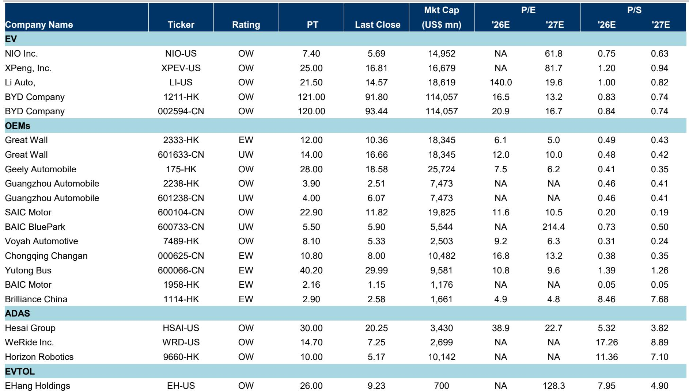
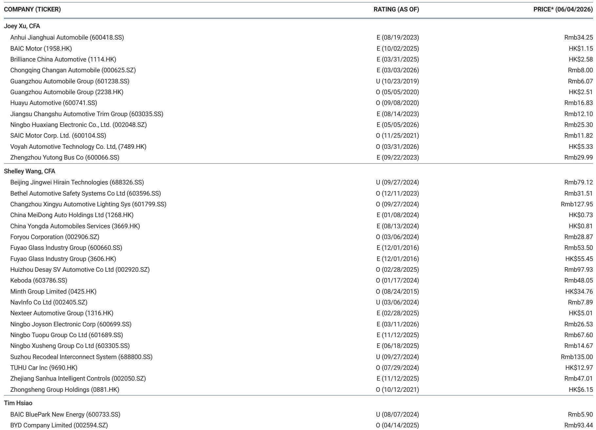
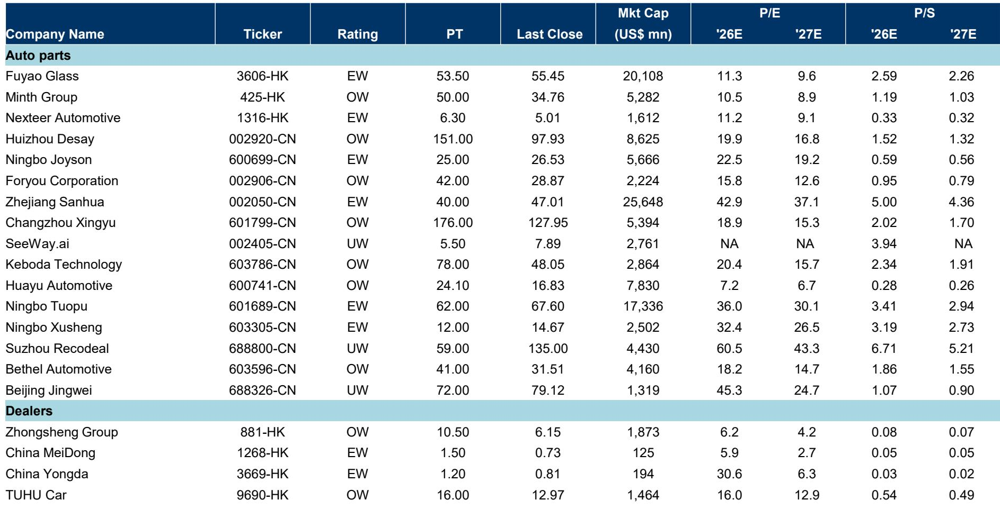

# 中国汽车市场真正被低估的不是需求，而是供给侧的再定价

当市场普遍将注意力集中在“国内乘用车销量下滑11%”这个数字上时，一份来自某外资投行的最新年度展望给出了一个值得深思的框架：真正决定未来三年中国汽车产业投资回报的核心变量，不是终端需求何时复苏，而是供给侧正在发生的结构性重塑——从出口增长、新能源渗透率突破临界点，到自主品牌市占率的不可逆提升，再到智能驾驶的商业化落地。这些因素叠加在一起，正在重新定义每一家车企的盈利曲线和估值锚点。

这份报告发布于2026年6月，覆盖了从整车厂到零部件、从ADAS到eVTOL的完整产业链，涉及超过40家上市公司。报告的核心判断是：尽管2026年国内零售市场面临短期压力，但中国汽车产业正处于一个“供给创造需求”的转折点。出口、新能源、智能化这三条主线，正在将行业从存量博弈拉入增量重构。

## 1. 国内零售的下滑并非系统性风险，而是政策退潮后的正常回摆

报告预测2026年中国乘用车批发销量为2940万辆，同比下滑2%；但更值得关注的是零售端——国内零售预计为2140万辆，同比下滑11%。这个数字看起来令人不安，但需要放在正确的参照系中理解。

2025年国内零售基数高达2400万辆，其中相当一部分是由国家及地方“以旧换新”补贴政策催化的。根据报告数据，2025年全年共有1150万辆新车申请了各类补贴，仅2026年第一季度就有140万辆。这意味着，2025年的高基数中包含了大量政策透支的需求。2026年的下滑，本质上是政策退潮后的正常回摆，而非内生需求的崩塌。

更重要的是，报告同时预测2027年国内零售将恢复至2205万辆，2028年进一步回升至2227万辆。这种“V型”修复的假设背后，是报告对中国汽车保有量更新周期的判断——大量2010-2015年间销售的车辆正进入自然替换窗口。补贴政策只是将这一替换需求的时间分布做了一次“前移”，并没有消灭需求本身。

对于投资者而言，这意味着：2026年的零售下滑不会在所有车企身上均匀分布。那些产品力强、品牌溢价高的企业，有能力在补贴退潮后依然维持份额；而那些依赖补贴生存的边缘品牌，才是真正的风险暴露方。

## 2. 出口正在成为利润的第二引擎，但结构性差异远大于总量增速

报告预测2026年中国乘用车出口将达到800万辆，同比增长33%，其中新能源汽车出口占比高达56%。这个增速是在2025年已经增长22%的基础上实现的，显示出中国汽车出口的动能远未衰竭。

但真正值得深挖的是出口的结构性变化。报告显示，2026年第一季度出口同比增长69%，增速远超全年预测的33%。这种“前高后低”的节奏可能反映了两个因素：一是部分车企在海外关税政策变化前加速抢运；二是新兴市场的需求爆发正在超预期。报告给出的2027-2028年出口增速预测分别为6%和6%，说明某外资投行认为出口的高增长阶段正在接近平台期。

然而，出口的利润贡献远非总量增速所能概括。一家车企如果只是以低端产品出口，哪怕销量翻倍，对利润的边际贡献也有限；但如果出口的是高附加值的新能源车型，尤其是在欧洲、东南亚等市场的定价能力，则可能带来利润率的显著提升。报告没有完全展开的是：不同车企的海外毛利率差异、本地化生产的进度、以及关税政策的不确定性，这些因素将导致出口对利润的贡献出现显著分化。

这意味着，投资者不能简单用“出口增速快”来线性外推利润增长，而需要逐一拆解每家车企的出口产品结构、目标市场和本地化策略。

## 3. 新能源渗透率突破60%之后，竞争逻辑从“替代燃油车”转向“新能源内部洗牌”

报告预测2026年新能源汽车批发销量为1754万辆，同比增长13%，渗透率达到60%。这是一个具有里程碑意义的数字——当新能源车在新车销售中占据六成份额时，行业竞争的底层逻辑将发生根本性转变。

过去五年，所有新能源车企的核心叙事都是“从燃油车手中抢份额”。但当市场渗透率超过60%，新能源车之间的内部竞争将取代“油电之争”成为主旋律。报告中的BEV/PHEV月度销量数据清晰地展示了这一趋势：PHEV（插电混动）的渗透率从2022年初的20%左右攀升至2025年底的21%，而BEV（纯电动）的渗透率则从75%左右缓慢提升至38%左右。这说明，新能源内部的技术路线之争远未结束，PHEV正在以更快的速度蚕食原本属于燃油车的份额，而BEV的增长则相对平稳。

这一变化对投资框架的含义是深远的。过去，市场对新能源车企的估值主要基于“销量增速”，因为大家都在跑马圈地。但当渗透率超过60%，盈利能力、现金流和品牌忠诚度将成为新的估值锚点。报告覆盖的整车企业中，BYD的2026年预测PE为16.5倍，理想汽车为140倍，小鹏和蔚来则仍处于亏损状态。这种估值分化的背后，反映的正是市场对不同企业在“新能源下半场”竞争力的预期差异。

报告没有完全回答的一个关键问题是：当渗透率从60%向80%迈进时，哪些企业能够维持定价权，哪些会被迫卷入价格战？这个问题的答案，将决定中国汽车行业未来五年的利润分配格局。

## 4. 智能驾驶的商业化不是概念，而是2026年最重要的利润变量

报告明确指出，2026年是L3级自动驾驶商业化的元年，同时L4级/Robotaxi的部署也将加速。这条判断的价值在于，它把智能驾驶从“技术路线讨论”拉入了“商业变现验证”的阶段。

从报告覆盖的产业链公司来看，智能驾驶的投资机会正在从“硬件供应商”向“解决方案提供商”扩散。Hesai Group（激光雷达）2026年预测PE为38.9倍，Horizon Robotics（芯片）仍处于亏损状态，WeRide（自动驾驶运营）同样尚未盈利。这些公司的估值中包含了显著的“期权价值”——市场在押注它们能够在智能驾驶的商业化浪潮中占据关键生态位。

但报告揭示了一个更微妙的信号：智能驾驶的商业化路径正在分化。一方面是面向消费者的L3功能，这直接决定了车企的产品溢价和品牌定位；另一方面是面向运营场景的L4/Robotaxi，这需要更长周期的资本投入和政策支持。报告将这两条路径放在一起讨论，但并未给出明确的“哪个路径更快兑现”的判断。这恰恰是投资者需要自己推演的关键问题。

对于整车企业而言，智能驾驶能力的强弱正在成为决定其终端定价能力和利润率的分水岭。那些能够通过软件订阅、功能升级等方式持续变现的车企，将在估值体系中获得“科技公司”的溢价。而那些只是将智能驾驶作为配置清单中一个选项的车企，则可能陷入硬件利润被压缩的困境。

## 5. 政策退潮后的真正考验：谁能把规模转化为议价权

报告详细梳理了2026年的政策环境：国家及地方“以旧换新”补贴将持续到2026年底，但新能源车的购置税减免将从2026年开始退坡——从之前的全额免征变为5%税率、1.5万元上限的优惠。这意味着，2026年是中国汽车产业在政策“软着陆”环境下的第一个完整财年。

政策退潮的冲击不会是均匀的。那些依赖补贴生存的低端新能源品牌，将面临最直接的利润压力；而那些已经建立起品牌溢价和规模优势的企业，则有机会通过成本下降和产品升级来对冲政策影响。报告预测，2026年中国品牌的市场份额将达到70%。这个数字本身并不令人惊讶，但它的含义是：中国品牌之间的内战将比中外品牌之间的竞争更加激烈。

这里有一个报告没有完全展开但值得深思的推论：当市场份额达到70%之后，中国品牌之间的竞争将从“抢份额”转向“抢利润”。这意味着，行业整合将加速，头部企业的规模优势将转化为更强的议价权——对上游供应商的压价能力、对下游渠道的掌控能力、以及对终端消费者的定价能力。而那些规模不足、品牌力弱的企业，将在这一轮洗牌中被边缘化。

## 6. 报告尚未完全回答的关键问题：海外利润的可持续性

尽管报告对出口给出了乐观的预测，但有一个关键问题并未得到充分解答：中国车企的海外利润能够持续多久？当前中国汽车出口的快速增长，部分得益于海外市场对中国品牌的认知红利和价格优势。但随着中国车企在海外市场的规模扩大，本地化生产、关税政策、品牌建设等成本将显著上升。

报告提到了2027-2028年出口增速将放缓至6%，但没有详细拆解这一放缓背后的结构性原因。是需求端见顶，还是供给端面临贸易壁垒？不同的原因对应着完全不同的投资含义。如果是因为需求饱和，那么出口利润的增长将主要依赖产品结构升级；如果是因为贸易壁垒，那么率先实现本地化生产的企业将获得结构性优势。

这个未解问题直接关系到投资者对“出海逻辑”的估值判断。如果海外利润被证明是可持续的，那么当前市场对中国车企的估值可能严重低估了其全球成长空间；如果海外利润只是短期红利，那么出口增速的放缓将导致估值回归。

## 7. 投资者的观察框架：从“量”到“利”的切换

基于以上分析，可以提炼出一个用于评估中国汽车产业投资机会的三层框架：

第一层：利润来源的结构。一家车企的利润是来自国内零售，还是出口？是来自燃油车，还是新能源车？是来自硬件销售，还是软件服务？利润来源越多元、越偏向高附加值领域，企业的抗风险能力越强。

第二层：规模与议价权的转化效率。在渗透率超过60%、中国品牌市占率达到70%的背景下，规模本身不再是护城河。关键在于，企业能否将规模转化为对上游供应商的压价能力、对下游渠道的掌控能力、以及对终端消费者的品牌溢价。那些规模增长但利润率持续下滑的企业，需要警惕。

第三层：智能驾驶的变现路径。智能驾驶的商业化是2026年最重要的利润变量。投资者需要关注的是：企业的智能驾驶功能是作为“免费配置”还是“付费订阅”？能否通过OTA升级持续创造收入？是否具备向第三方输出智能驾驶解决方案的能力？这些问题的答案，将决定企业能否获得“科技估值”的溢价。

这份报告提供了丰富的数据和清晰的框架，但真正有价值的投资判断，往往隐藏在那些“报告没有完全展开”的细节中。比如，出口利润的可持续性如何验证？智能驾驶的商业化路径何时能够体现在利润表中？政策退潮后，哪些企业会最先暴露风险？

这些问题，正是我们接下来在社群中持续追踪和讨论的方向。欢迎来星球微信群里继续讨论，我们将围绕这份报告的核心数据，逐一拆解每一家重点公司的利润结构和竞争壁垒，并持续跟踪关键假设的验证进度。

Personal reading notes and learning share only. Not investment advice.

