# EM Money Trail

# EM outflows broadening as well as deepening

EM equity fund outflows exacerbated this week to -\$7.5bn from -\$4.3bn last week. Outflows were equally across ETFs (-\$3.7bn, -\$3.1bn last week) and non-ETFs. The deceleration in non-ETF outflows we noted over the prior two weeks didn't hold this week, with redemptions widening to -\$\$3.8bn (-\$1.2bn last week). All regional funds were net-sold this week. GEMs funds saw a sharp rise in sell-off to -\$3.0bn from -\$363mn last week, while outflows from Asia ex-Japan also picked up to -\$4.4bn from -\$3.6bn last week. Redemptions eased in LatAm (-\$225mn, -\$268mn last week) and EMEA (-\$5mn, -\$75mn last week). EM ex-China funds saw marginal inflows (+\$50mn). YTD, EM equity funds are +\$66.8bn (from a peak of +\$83.3bn in April), of which ETFs are +\$78.2bn and non-ETFs are -\$11.5bn.

Market-level flows. Taiwan continued to attract subscriptions for the second week, albeit slower (+\$3.8bn, +\$8.7bn last week) while redemptions in Korea worsened again (-\$7.5bn) after easing to -\$1.3bn last week. Outflows in Korea have added up to -\$37.6bn in the past four weeks and -\$69.6bn YTD (see report for a detailed discussion). Outflows worsened sharply in India (-\$4.1bn, from -\$454mn last week) but continued to slow in Brazil (-\$394mn, from -\$473mn last week). Thailand (+\$147mn, +\$17mn last week) was the only market besides Taiwan that saw inflows. The rest of EM ASEAN saw large outflows: Malaysia (-\$625mn), Indonesia (-\$612mn), and the Philippines (-\$124mn). In EMEA, Qatar (-\$65mn), Dubai (-\$41mn) and Türkiye (-\$91mn, one-week lag) saw moderate outflows.

Table 1: Regional fund flows 

<table><tr><td rowspan="2">USD billion</td><td colspan="3">Flows</td><td></td><td></td></tr><tr><td>Current</td><td>YTD</td><td>vs 1w</td><td>Min</td><td>27-Ma</td></tr><tr><td>EM Equities</td><td>-7.5</td><td>66.8</td><td>▼</td><td>-7.5</td><td></td></tr><tr><td>GEMs</td><td>-3.0</td><td>58.3</td><td>▼</td><td>-3.0</td><td></td></tr><tr><td>GEMs ex-China</td><td>0.1</td><td>7.0</td><td>▲</td><td>-0.4</td><td></td></tr><tr><td>APAC</td><td>-4.4</td><td>-2.3</td><td>▼</td><td>-5.0</td><td></td></tr><tr><td>EMEA</td><td>0.0</td><td>1.4</td><td>▲</td><td>-0.1</td><td></td></tr><tr><td>LatAm</td><td>-0.2</td><td>9.4</td><td>▲</td><td>-0.4</td><td></td></tr><tr><td>Dev. Europe</td><td>-1.0</td><td>-4.0</td><td>▲</td><td>-4.7</td><td></td></tr><tr><td>US</td><td>20.7</td><td>196.1</td><td>▲</td><td>-40.5</td><td></td></tr><tr><td>International</td><td>17.6</td><td>260.2</td><td>▲</td><td>-7.3</td><td></td></tr><tr><td></td><td></td><td></td><td></td><td>Outflow</td><td>Zero Inflow</td></tr></table>

Source: EPFR Global. Note: Ex-onshore funds for EM. Total EM Equities include GEMs, LatAm, EMEA and Asia ex-Japan.

Figure 1: Weekly EM equity fund flows: ETF vs non-ETF   
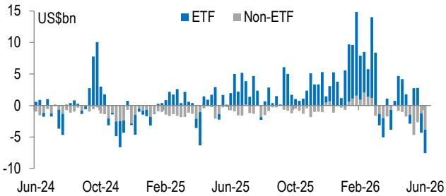

bar

| Date   | ETF  | Non-ETF |
|--------|------|---------|
| Jun-24 | -1   | 0       |
| Oct-24 | 10   | -1      |
| Feb-25 | -5   | 0       |
| Jun-25 | 5    | -1      |
| Oct-25 | 5    | -1      |
| Feb-26 | 15   | -1      |
| Jun-26 | -8   | 0       |

Source: EPFR Global, MSCI

Figure 2: Annual cumulative EM equity fund flows (US\$ bn)   
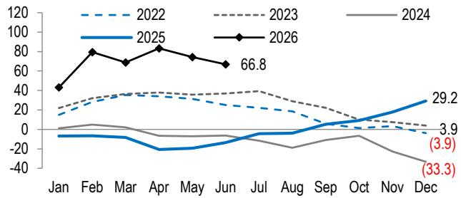

line

| Month | 2022 | 2023 | 2024 | 2025 | 2026 |
|-------|------|------|------|------|------|
| Jan   |      |      |      |      | 40.0 |
| Feb   |      |      |      |      | 80.0 |
| Mar   |      |      |      |      | 70.0 |
| Apr   |      |      |      |      | 85.0 |
| May   |      |      |      |      | 75.0 |
| Jun   |      |      |      |      | 66.8 |
| Jul   |      |      |      |      |      |
| Aug   |      |      |      |      |      |
| Sep   |      |      |      |      |      |
| Oct   |      |      |      |      |      |
| Nov   |      |      |      |      |      |
| Dec   |      | 3.9  | -33.3| 29.2 |      |

Source: EPFR Global. \*Excludes onshore funds.

# Emerging Markets Equity Strategy

# Rajiv Batra AC

(65) 6882-8151

rajiv.j.batra@JPM.com

JPM Securities Singapore Private Limited

# Emy Shayo Cherman AC

(55-11) 4950-6684

emy.shayo@JPM.com

Banco JPM S.A

# Anindita Gandhi AC

(91-22) 6157-3248

anindita.gandhi@JPM.com

JPM India Private Limited

# CEEMEA Equity Strategy

# David Aserkoff, CFA

(44-20) 7134-5887

david.aserkoff@JPM.com

JPM Securities plc

Table 2: Summary – Market data and net foreign investment, 28 May - 3 June 2026 

<table><tr><td rowspan="2"></td><td colspan="10">Net Flows ($mn)</td></tr><tr><td>Current</td><td>ETF</td><td>Non-ETF</td><td>Last Week</td><td>4W</td><td>8W</td><td>3M</td><td>12M</td><td>YTD</td><td>AUM</td></tr><tr><td>Total EM Equity Funds*</td><td>(7,543)</td><td>(3,726)</td><td>(3,817)</td><td>(4,322)</td><td>(13,645)</td><td>(9,531)</td><td>(21,445)</td><td>117,959</td><td>66,776</td><td>2,632,627</td></tr><tr><td>ETFs</td><td>(3,726)</td><td>(3,726)</td><td>--</td><td>(3,086)</td><td>(1,275)</td><td>7,882</td><td>1,750</td><td>157,703</td><td>78,232</td><td>1,046,585</td></tr><tr><td>Non-ETFs</td><td>(3,817)</td><td>--</td><td>(3,817)</td><td>(1,236)</td><td>(12,370)</td><td>(17,414)</td><td>(23,195)</td><td>(39,744)</td><td>(11,456)</td><td>1,586,042</td></tr><tr><td>GEMs Equity Funds*</td><td>(2,953)</td><td>(388)</td><td>(2,564)</td><td>(363)</td><td>(6,688)</td><td>(3,090)</td><td>(3,608)</td><td>96,071</td><td>58,294</td><td>1,871,288</td></tr><tr><td>GEMs ex-China Equity Funds*</td><td>50</td><td>6</td><td>44</td><td>5</td><td>32</td><td>1,043</td><td>3,854</td><td>7,111</td><td>6,959</td><td>47,083</td></tr><tr><td>Asia ex-Japan Equity Funds*</td><td>(4,360)</td><td>(3,151)</td><td>(1,209)</td><td>(3,616)</td><td>(5,793)</td><td>(8,108)</td><td>(19,665)</td><td>6,630</td><td>(2,317)</td><td>685,382</td></tr><tr><td>EMEA Equity Funds*</td><td>(5)</td><td>(2)</td><td>(3)</td><td>(75)</td><td>(261)</td><td>(234)</td><td>(642)</td><td>3,050</td><td>1,444</td><td>29,437</td></tr><tr><td>LatAm Equity Funds*</td><td>(225)</td><td>(185)</td><td>(40)</td><td>(268)</td><td>(903)</td><td>1,900</td><td>2,470</td><td>12,208</td><td>9,355</td><td>46,520</td></tr><tr><td>Developed Europe Equity Funds</td><td>(1,048)</td><td>(692)</td><td>(357)</td><td>(1,609)</td><td>(6,505)</td><td>(17,821)</td><td>(23,829)</td><td>7,266</td><td>(3,963)</td><td>2,274,063</td></tr><tr><td>US Equity Funds</td><td>20,714</td><td>31,522</td><td>(10,807)</td><td>8,459</td><td>60,558</td><td>124,554</td><td>181,788</td><td>450,496</td><td>196,068</td><td>27,197,029</td></tr><tr><td>International Equity Funds</td><td>17,599</td><td>19,206</td><td>(1,608)</td><td>8,443</td><td>57,159</td><td>103,197</td><td>144,647</td><td>444,379</td><td>260,190</td><td>11,600,869</td></tr><tr><td colspan="11">Stock Exchanges Investors Trading Data **</td></tr><tr><td>Japan (1 wk lag)***</td><td>(3,084)</td><td>-</td><td>-</td><td>6,787</td><td>18,860</td><td>63,697</td><td>30,070</td><td>114,673</td><td>70,541</td><td>-</td></tr><tr><td>Korea</td><td>(7,526)</td><td>-</td><td>-</td><td>(1,308)</td><td>(35,523)</td><td>(33,011)</td><td>(56,339)</td><td>(62,866)</td><td>(69,586)</td><td>-</td></tr><tr><td>Taiwan</td><td>3,768</td><td>-</td><td>-</td><td>8,662</td><td>6,596</td><td>15,901</td><td>(5,589)</td><td>5,978</td><td>650</td><td>-</td></tr><tr><td>India</td><td>(4,075)</td><td>-</td><td>-</td><td>(454)</td><td>(6,034)</td><td>(9,077)</td><td>(25,796)</td><td>(35,327)</td><td>(27,694)</td><td>-</td></tr><tr><td>Brazil (2 day lag)***</td><td>(394)</td><td>-</td><td>-</td><td>(473)</td><td>(2,886)</td><td>(2,887)</td><td>(339)</td><td>8,459</td><td>7,587</td><td>-</td></tr><tr><td>Thailand</td><td>147</td><td>-</td><td>-</td><td>17</td><td>297</td><td>80</td><td>(929)</td><td>(185)</td><td>933</td><td>-</td></tr><tr><td>Saudi Arabia (2 wk lag)***</td><td>267</td><td>-</td><td>-</td><td>(109)</td><td>(21)</td><td>971</td><td>696</td><td>7,849</td><td>2,946</td><td>-</td></tr><tr><td>Indonesia</td><td>(612)</td><td>-</td><td>-</td><td>(263)</td><td>(403)</td><td>(1,179)</td><td>(2,887)</td><td>(1,408)</td><td>(3,288)</td><td>-</td></tr><tr><td>Malaysia</td><td>(625)</td><td>-</td><td>-</td><td>(182)</td><td>(1,103)</td><td>(1,114)</td><td>(1,067)</td><td>(3,404)</td><td>(692)</td><td>-</td></tr><tr><td>Philippines</td><td>(124)</td><td>-</td><td>-</td><td>(23)</td><td>(166)</td><td>(308)</td><td>(614)</td><td>(601)</td><td>(230)</td><td>-</td></tr><tr><td>Qatar</td><td>(65)</td><td>-</td><td>-</td><td>(19)</td><td>(162)</td><td>(257)</td><td>(531)</td><td>538</td><td>20</td><td>-</td></tr><tr><td>Dubai</td><td>(41)</td><td>-</td><td>-</td><td>11</td><td>(244)</td><td>(476)</td><td>(1,900)</td><td>(784)</td><td>(1,311)</td><td>-</td></tr><tr><td>Türkiye (1 wk lag)***</td><td>(91)</td><td>-</td><td>-</td><td>(293)</td><td>(454)</td><td>426</td><td>(1,008)</td><td>3,627</td><td>1,407</td><td>-</td></tr><tr><td>Vietnam</td><td>(118)</td><td>-</td><td>-</td><td>(321)</td><td>(675)</td><td>(1,296)</td><td>(1,926)</td><td>(5,724)</td><td>(2,444)</td><td>-</td></tr><tr><td>Pakistan</td><td>(3)</td><td>-</td><td>-</td><td>(9)</td><td>(20)</td><td>(15)</td><td>(62)</td><td>(690)</td><td>(415)</td><td>-</td></tr><tr><td>Sri Lanka</td><td>(5)</td><td>-</td><td>-</td><td>(10)</td><td>(16)</td><td>(35)</td><td>(52)</td><td>(198)</td><td>(104)</td><td>-</td></tr><tr><td colspan="11">Monthly Tracking of Cross Border Funds****</td></tr><tr><td>Australia</td><td>829</td><td>-</td><td>-</td><td>-</td><td>-</td><td>-</td><td>2,251</td><td>6,029</td><td>2,985</td><td>-</td></tr><tr><td>Hong Kong</td><td>797</td><td>-</td><td>-</td><td>-</td><td>-</td><td>-</td><td>1,903</td><td>14,063</td><td>3,063</td><td>-</td></tr><tr><td>Singapore</td><td>489</td><td>-</td><td>-</td><td>-</td><td>-</td><td>-</td><td>1,171</td><td>3,769</td><td>1,993</td><td>-</td></tr><tr><td>China</td><td>2,744</td><td>-</td><td>-</td><td>-</td><td>-</td><td>-</td><td>6,721</td><td>35,749</td><td>17,065</td><td>-</td></tr><tr><td>Mexico</td><td>773</td><td>-</td><td>-</td><td>-</td><td>-</td><td>-</td><td>2,010</td><td>5,020</td><td>3,454</td><td>-</td></tr><tr><td>Chile</td><td>244</td><td>-</td><td>-</td><td>-</td><td>-</td><td>-</td><td>455</td><td>1,913</td><td>1,083</td><td>-</td></tr><tr><td>Poland</td><td>274</td><td>-</td><td>-</td><td>-</td><td>-</td><td>-</td><td>757</td><td>2,704</td><td>1,548</td><td>-</td></tr><tr><td>Peru</td><td>177</td><td>-</td><td>-</td><td>-</td><td>-</td><td>-</td><td>470</td><td>1,332</td><td>1,006</td><td>-</td></tr><tr><td>Colombia</td><td>87</td><td>-</td><td>-</td><td>-</td><td>-</td><td>-</td><td>171</td><td>515</td><td>321</td><td>-</td></tr></table>

Source: Bloomberg Finance L.P., JPM, EPFR Global data. \*Total EM Equity includes GEMs, LatAm, EMEA and Asia ex-Japan and excludes onshore funds (DM funds figures represent total inflows). \*\*Net foreign flows data from local stock exchanges. \*\*\*Data for Japan is for 23 - 29 May 2026. Data for Brazil is for 27 May - 1 June 2026. Data for Saudi Arabia is for 15 - 21 May 2026. Data for Türkiye is for 23 - 29 May 2026. \*\*\*\*Monthly tracking of cross-border fund (EPFR) flows – data is until April 2026.

For markets that do not publish official foreign transactions in their equity markets, we use monthly data from EPFR Global (they cover 12,000 international, EM and US funds with total net assets greater than US\$6.0trn).

During the month of April, funds were net buyers in Australia, Hong Kong, Singapore, China, Mexico, Poland, Chile, Peru and Colombia. Please see page 21 for consensus overweight and underweight markets.

# EM Equity Funds: Flows

Figure 3: EM equity fund flows vs performance   
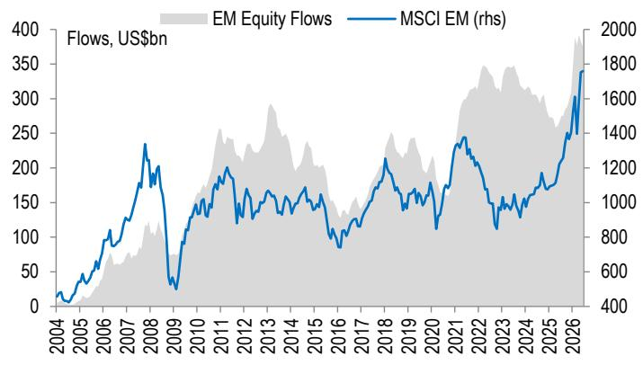

line

| Year | EM Equity Flows (US$bn) | MSCI EM (rhs) |
|------|--------------------------|---------------|
| 2004 | ~10                      | ~400          |
| 2005 | ~30                      | ~600          |
| 2006 | ~60                      | ~900          |
| 2007 | ~100                     | ~1300         |
| 2008 | ~150                     | ~1800         |
| 2009 | ~30                      | ~400          |
| 2010 | ~100                     | ~800          |
| 2011 | ~150                     | ~1100         |
| 2012 | ~200                     | ~1300         |
| 2013 | ~250                     | ~1500         |
| 2014 | ~200                     | ~1300         |
| 2015 | ~150                     | ~1100         |
| 2016 | ~100                     | ~800          |
| 2017 | ~150                     | ~1100         |
| 2018 | ~200                     | ~1300         |
| 2019 | ~150                     | ~1100         |
| 2020 | ~100                     | ~800          |
| 2021 | ~150                     | ~1100         |
| 2022 | ~250                     | ~1300         |
| 2023 | ~350                     | ~1500         |
| 2024 | ~300                     | ~1300         |
| 2025 | ~350                     | ~1500         |
| 2026 | ~400                     | ~1800         |

Source: EPFR Global, MSCI. \*Excludes onshore funds

Figure 5: Annual EM equity fund flows: Offshore vs onshore   
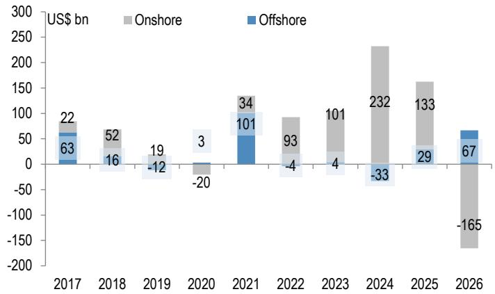

bar_stacked

| Year | Onshore (US$ bn) | Offshore (US$ bn) |
| :--- | :--- | :--- |
| 2017 | 80 | 63 |
| 2018 | 65 | 16 |
| 2019 | 15 | -12 |
| 2020 | -15 | -20 |
| 2021 | 100 | 101 |
| 2022 | 90 | -4 |
| 2023 | 70 | 4 |
| 2024 | 232 | -33 |
| 2025 | 160 | 29 |
| 2026 | -165 | 67 |

Source: EPFR Global

Figure 7: Weekly flows into EM equity funds: Global vs regional funds   
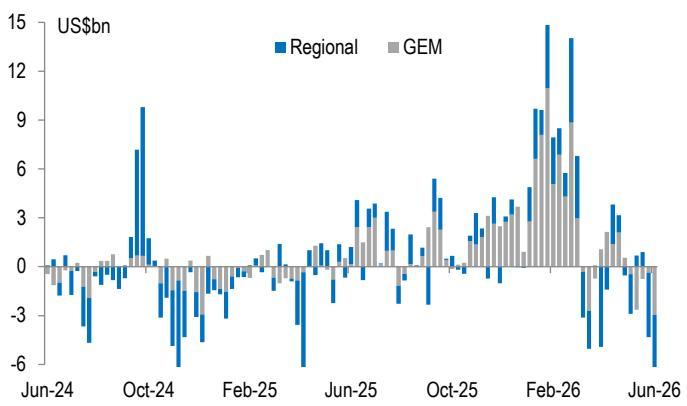

bar

| Month    | Regional | GEM  |
| -------- | -------- | ---- |
| Jun-24   | -1.5     | -0.5 |
| Oct-24   | 9.0      | 0.0  |
| Feb-25   | -3.0     | 0.5  |
| Jun-25   | 3.5      | 1.0  |
| Oct-25   | 5.0      | 2.0  |
| Feb-26   | 14.0     | 8.0  |
| Jun-26   | -6.0     | -1.0 |

Source: EPFR Global. \* Excludes onshore funds

Figure 4: Weekly flows into EM equity funds: By domicile   
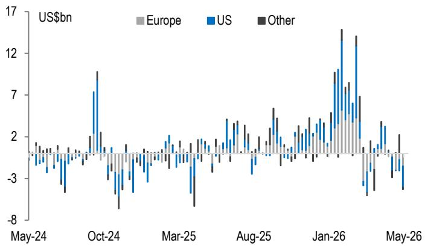

bar

| Month   | Europe | US  | Other |
|---------|--------|-----|-------|
| May-24  | -1.5   | -1.8| -1.7  |
| Oct-24  | -1.6   | 7.2 | 10.5  |
| Mar-25  | -1.7   | -3.5| -7.8  |
| Aug-25  | -1.8   | 2.5 | 3.0   |
| Jan-26  | 3.0    | 10.0| 13.5  |
| May-26  | -1.9   | -3.0| -6.5  |

Source: EPFR Global. \*Excludes onshore funds

Figure 6: Annual EM equity fund flows: ETF vs non-ETF   
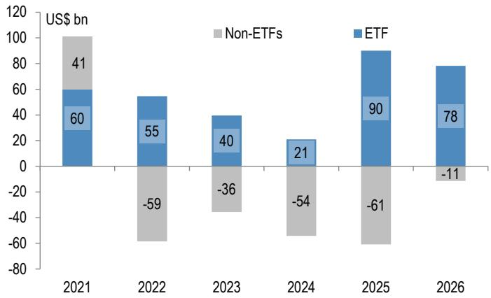

bar_stacked

| Year | Non-ETFs (US$ bn) | ETF (US$ bn) |
| :--- | :--- | :--- |
| 2021 | 41 | 60 |
| 2022 | -59 | 55 |
| 2023 | -36 | 40 |
| 2024 | -54 | 21 |
| 2025 | -61 | 90 |
| 2026 | -11 | 78 |

Source: EPFR Global

Figure 8: Weekly flows into EM equity funds: Breakdown of regional funds   
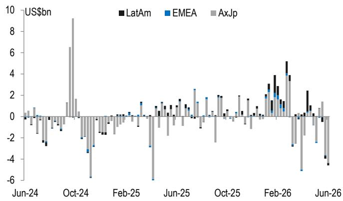

bar

| Month   | LatAm | EMEA | AxJp |
|---------|-------|------|------|
| Jun-24  |       |      | 0.5  |
| Jul-24  |       |      | -1.0 |
| Aug-24  |       |      | -2.5 |
| Sep-24  |       |      | -3.0 |
| Oct-24  |       |      | 9.0  |
| Nov-24  |       |      | 1.5  |
| Dec-24  |       |      | -6.0 |
| Jan-25  |       |      | -1.5 |
| Feb-25  |       |      | -0.5 |
| Mar-25  |       |      | 1.0  |
| Apr-25  |       |      | -3.0 |
| May-25  |       |      | -6.0 |
| Jun-25  |       |      | 1.0  |
| Jul-25  |       |      | 2.5  |
| Aug-25  |       |      | 1.5  |
| Sep-25  |       |      | -2.0 |
| Oct-25  |       |      | 1.5  |
| Nov-25  |       |      | 0.5  |
| Dec-25  |       |      | -1.0 |
| Jan-26  |       |      | 0.0  |
| Feb-26  |       |      | 3.0  |
| Mar-26  |       |      | 1.0  |
| Apr-26  |       |      | -3.0 |
| May-26  |       |      | -5.0 |
| Jun-26  |       |      | -4.0 |
| Jul-26  |       |      | -3.0 |
| Aug-26  |       |      | -1.0 |
| Sep-26  |       |      | 1.0  |
| Oct-26  |       |      | -1.0 |
| Nov-26  |       |      | -3.0 |
| Dec-26  |       |      | -4.0 |
The chart displays monthly values for LatAm, EMEA, and AxJp from June 2024 to June 2026. Values are estimated based on the provided code.

Source: EPFR Global. \* Excludes onshore funds

# EM Equity funds: AUM

Figure 9: EM equity funds AUM vs. MSCI EM performance   
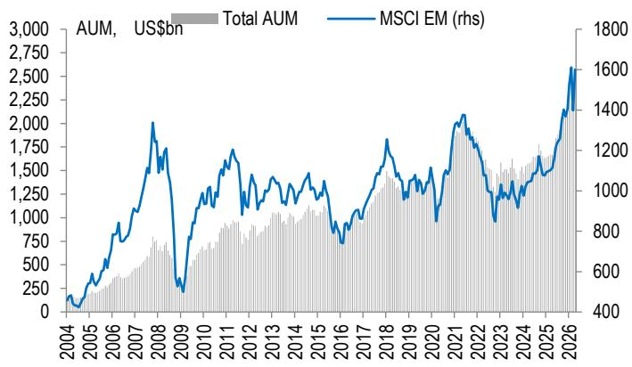

line

| Year | Total AUM (US$bn) | MSCI EM (rhs) |
|------|-------------------|---------------|
| 2004 | ~100              | ~400          |
| 2005 | ~300              | ~600          |
| 2006 | ~500              | ~800          |
| 2007 | ~700              | ~1000         |
| 2008 | ~900              | ~1200         |
| 2009 | ~1100             | ~1400         |
| 2010 | ~1300             | ~1600         |
| 2011 | ~1500             | ~1800         |
| 2012 | ~1700             | ~2000         |
| 2013 | ~1900             | ~2200         |
| 2014 | ~2100             | ~2400         |
| 2015 | ~2300             | ~2600         |
| 2016 | ~2500             | ~2800         |
| 2017 | ~2700             | ~3000         |
| 2018 | ~2900             | ~3200         |
| 2019 | ~3100             | ~3400         |
| 2020 | ~3300             | ~3600         |
| 2021 | ~3500             | ~3800         |
| 2022 | ~3700             | ~4000         |
| 2023 | ~3900             | ~4200         |
| 2024 | ~4100             | ~4400         |
| 2025 | ~4300             | ~4600         |
| 2026 | ~4500             | ~4800         |

Source: EPFR Global, MSCI. \*Excludes onshore funds

Figure 10: EM equity funds' (%) share in global equity AUM   
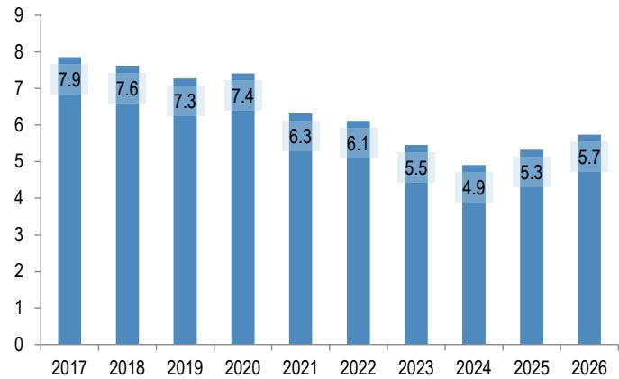

bar

| Year | Value |
|---|---|
| 2017 | 7.9 |
| 2018 | 7.6 |
| 2019 | 7.3 |
| 2020 | 7.4 |
| 2021 | 6.3 |
| 2022 | 6.1 |
| 2023 | 5.5 |
| 2024 | 4.9 |
| 2025 | 5.3 |
| 2026 | 5.7 |

Source: EPFR Global, MSCI. \*Excludes onshore funds

Figure 11: EM equity funds – offshore vs onshore   
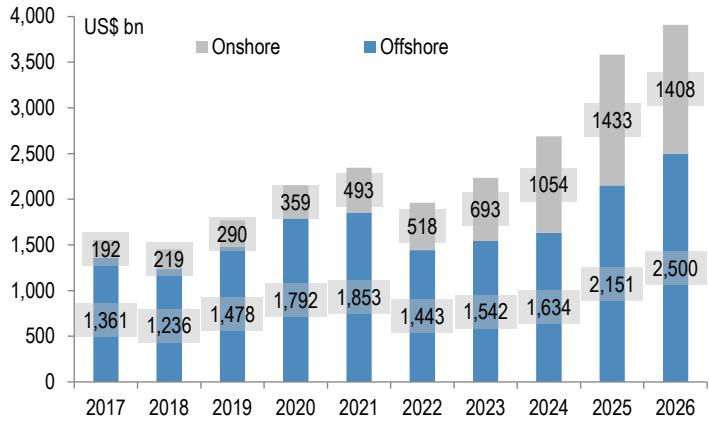

bar_stacked

| Year | Onshore (US$ bn) | Offshore (US$ bn) |
| :--- | :--- | :--- |
| 2017 | 1,361 | 192 |
| 2018 | 1,236 | 219 |
| 2019 | 1,478 | 290 |
| 2020 | 1,792 | 359 |
| 2021 | 1,853 | 493 |
| 2022 | 1,443 | 518 |
| 2023 | 1,542 | 693 |
| 2024 | 1,634 | 1054 |
| 2025 | 2,151 | 1433 |
| 2026 | 2,500 | 1408 |

Source: EPFR Global

Figure 12: EM equity funds AUM breakdown (US\$bn)   
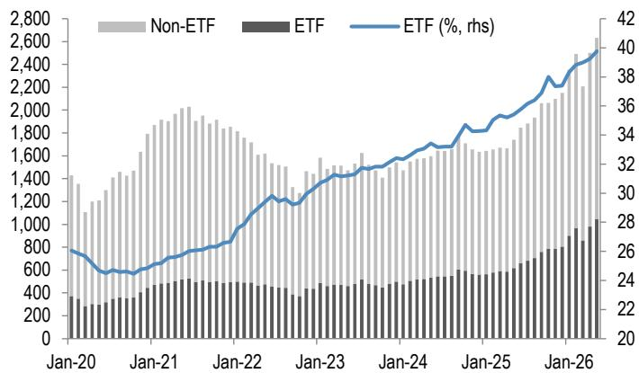

bar_line

| Date   | Non-ETF | ETF  | ETF (%, rhs) |
|--------|---------|------|--------------|
| Jan-20 | 1,400   | 300  | 26           |
| Jan-21 | 1,900   | 500  | 24           |
| Jan-22 | 1,800   | 500  | 28           |
| Jan-23 | 1,600   | 500  | 30           |
| Jan-24 | 1,700   | 550  | 32           |
| Jan-25 | 1,900   | 600  | 34           |
| Jan-26 | 2,600   | 1,000| 40           |

Source: EPFR Global

Figure 13: Global vs regional EM equity funds AUM   
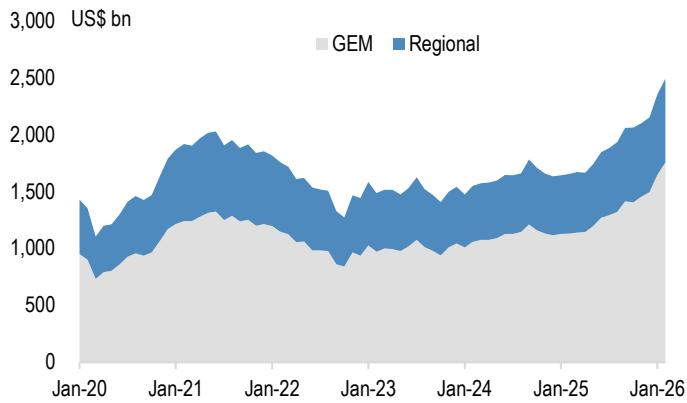

area

| Date   | GEM  | Regional |
|--------|------|----------|
| Jan-20 | 900  | 1400     |
| Jan-21 | 1200 | 1800     |
| Jan-22 | 1100 | 1700     |
| Jan-23 | 1000 | 1500     |
| Jan-24 | 1100 | 1600     |
| Jan-25 | 1200 | 1700     |
| Jan-26 | 1700 | 2500     |

Source: EPFR Global. \* Excludes onshore funds

Figure 14: Regional EM equity funds AUM   
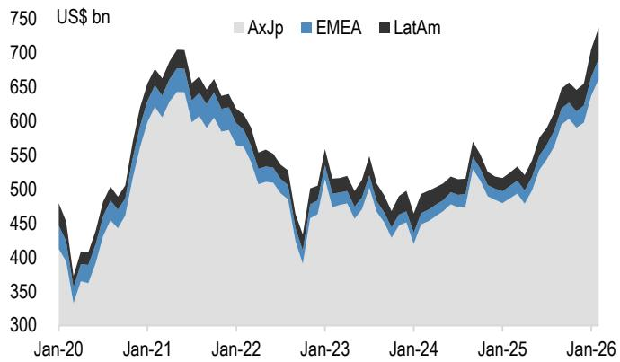

area

| Date   | AxJp  | EMEA  | LatAm |
|--------|-------|-------|-------|
| Jan-20 | 450   | 350   | 400   |
| Jan-21 | 700   | 650   | 700   |
| Jan-22 | 600   | 550   | 600   |
| Jan-23 | 400   | 350   | 400   |
| Jan-24 | 500   | 450   | 500   |
| Jan-25 | 600   | 550   | 600   |
| Jan-26 | 750   | 700   | 750   |

Source: EPFR Global. \* Excludes onshore funds

# EM ex-China funds: Flows and AUM

Figure 15: EM ex-China equity fund flows vs performance   
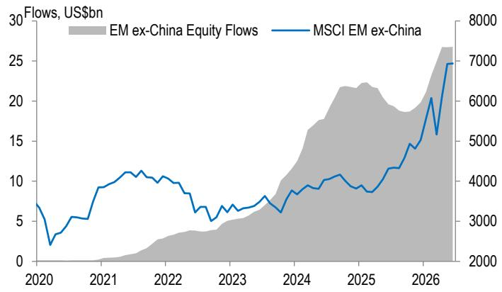

line

| Year | EM ex-China Equity Flows (US$bn) | MSCI EM ex-China (US$bn) |
|------|----------------------------------|--------------------------|
| 2020 | ~1                               | ~7                       |
| 2021 | ~3                               | ~10                      |
| 2022 | ~5                               | ~9                       |
| 2023 | ~7                               | ~6                       |
| 2024 | ~10                              | ~8                       |
| 2025 | ~15                              | ~10                      |
| 2026 | ~25                              | ~700                     |

Source: EPFR Global, MSCI

Figure 17: Weekly EM ex-China equity fund flows – ETF vs non-ETFs   
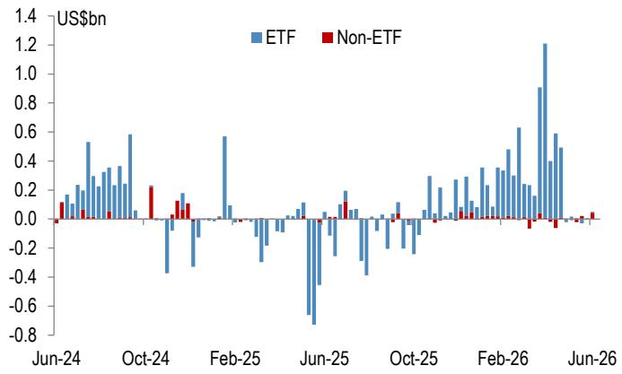

bar

| Date   | ETF    | Non-ETF |
|--------|--------|---------|
| Jun-24 | 0.1    | 0.0     |
| Oct-24 | 0.6    | 0.2     |
| Feb-25 | 0.6    | 0.0     |
| Jun-25 | -0.8   | 0.0     |
| Oct-25 | 0.3    | 0.0     |
| Feb-26 | 0.9    | 0.0     |
| Jun-26 | 1.2    | 0.0     |

Source: EPFR Global

Figure 19: EM ex-China vs EM funds AUM   
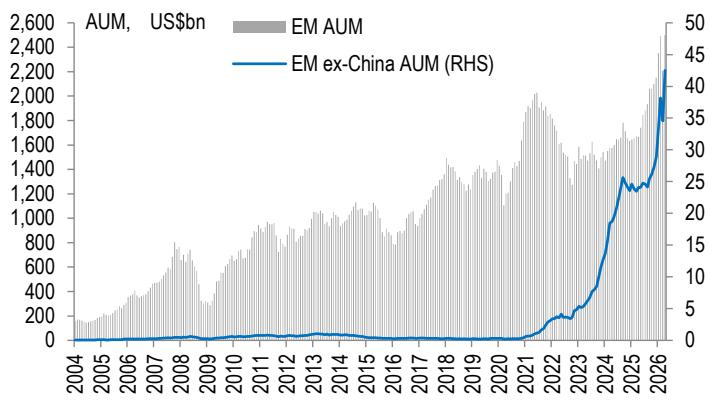

bar_line

| Year | EM AUM (US$bn) | EM ex-China AUM (RHS) |
|------|----------------|------------------------|
| 2004 | ~100           | ~0                     |
| 2005 | ~150           | ~0                     |
| 2006 | ~300           | ~0                     |
| 2007 | ~500           | ~0                     |
| 2008 | ~700           | ~0                     |
| 2009 | ~600           | ~0                     |
| 2010 | ~800           | ~0                     |
| 2011 | ~900           | ~0                     |
| 2012 | ~1,000         | ~0                     |
| 2013 | ~1,100         | ~0                     |
| 2014 | ~1,200         | ~0                     |
| 2015 | ~1,300         | ~0                     |
| 2016 | ~1,400         | ~0                     |
| 2017 | ~1,500         | ~0                     |
| 2018 | ~1,600         | ~0                     |
| 2019 | ~1,700         | ~0                     |
| 2020 | ~1,800         | ~0                     |
| 2021 | ~2,000         | ~5                     |
| 2022 | ~1,900         | ~15                    |
| 2023 | ~1,800         | ~25                    |
| 2024 | ~1,900         | ~35                    |
| 2025 | ~2,100         | ~45                    |
| 2026 | ~2,600         | ~55                    |

Source: EPFR Global

Figure 16: EM ex-China equity ETF flows vs MSCI EM ex-China   
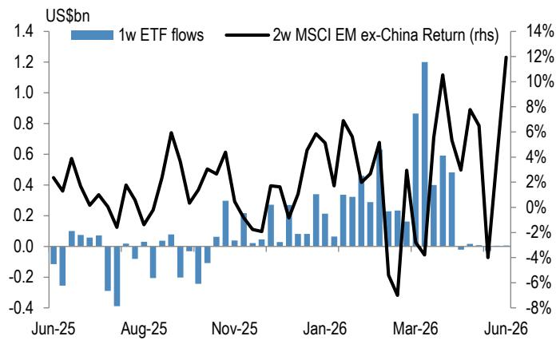

bar_line

| Date   | 1w ETF flows (US$bn) | 2w MSCI EM ex-China Return (rhs) |
|--------|----------------------|----------------------------------|
| Jun-25 | -0.2                 | 0.4                              |
| Aug-25 | -0.3                 | 0.7                              |
| Nov-25 | 0.3                  | 0.6                              |
| Jan-26 | 0.4                  | 0.8                              |
| Mar-26 | 1.2                  | -8%                              |
| Jun-26 | 1.3                  | 12%                              |

Source: EPFR Global, MSCI.

Figure 18: EM ex-China equity funds AUM breakdown   
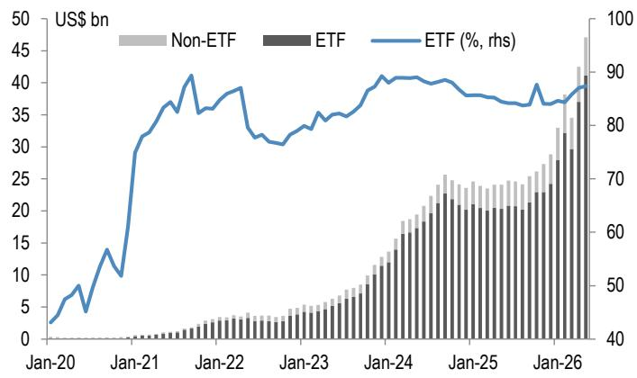

bar_line

| Date   | Non-ETF (US$ bn) | ETF (%) |
|--------|------------------|---------|
| Jan-20 | 0                | 40      |
| Jan-21 | 0                | 80      |
| Jan-22 | 0                | 90      |
| Jan-23 | 0                | 85      |
| Jan-24 | 0                | 90      |
| Jan-25 | 0                | 85      |
| Jan-26 | 0                | 90      |

Source: EPFR Global

Figure 20: EM ex-China funds share (%) in EM AUM   
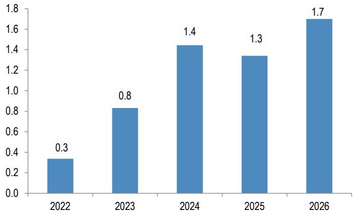

bar

| Year | Value |
|---|---|
| 2022 | 0.3 |
| 2023 | 0.8 |
| 2024 | 1.4 |
| 2025 | 1.3 |
| 2026 | 1.7 |

Source: EPFR Global

# Equities Regional Funds Net Flows

# Total EM - Strong outflows during the week

Figure 21: Total EM equity funds' weekly net flows   
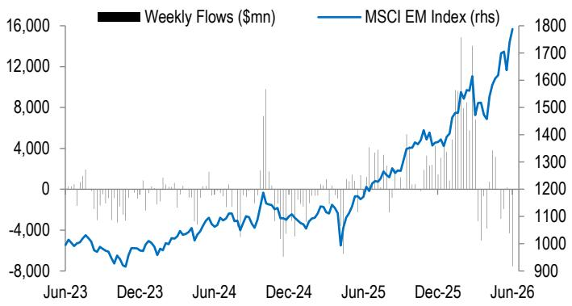

line

| Date    | Weekly Flows ($mn) | MSCI EM Index (rhs) |
|---------|---------------------|----------------------|
| Jun-23  | -8,000              | 1000                 |
| Dec-23  | -4,000              | 950                  |
| Jun-24  | -2,000              | 1100                 |
| Dec-24  | 0                   | 1200                 |
| Jun-25  | 2,000               | 1300                 |
| Dec-25  | 4,000               | 1500                 |
| Jun-26  | 6,000               | 1800                 |

Source: EPFR Global, MSCI

Figure 22: Total EM equity funds' monthly cumulative flows (US\$bn)   
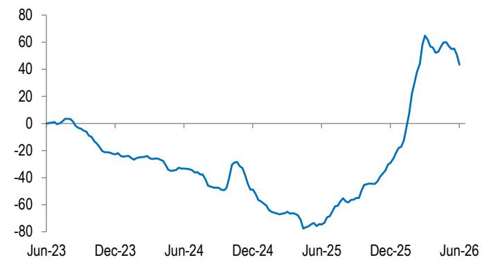

line

| Date   | Value |
|--------|-------|
| Jun-23 | 0     |
| Dec-23 | -20   |
| Jun-24 | -40   |
| Dec-24 | -30   |
| Jun-25 | -80   |
| Dec-25 | 0     |
| Jun-26 | 60    |

Source: EPFR Global

# GEM - Strong outflows during the week

Figure 23: GEM funds' weekly net flows   
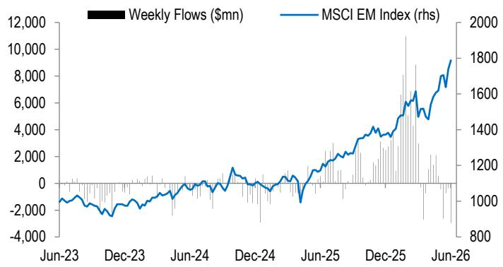

line

| Date    | Weekly Flows ($mn) | MSCI EM Index (rhs) |
|---------|---------------------|----------------------|
| Jun-23  | -1,000              | 1000                 |
| Dec-23  | -2,000              | 900                  |
| Jun-24  | -1,000              | 1100                 |
| Dec-24  | 1,000               | 1200                 |
| Jun-25  | 2,000               | 1400                 |
| Dec-25  | 4,000               | 1600                 |
| Jun-26  | 8,000               | 1800                 |

Source: EPFR Global, MSCI

Figure 24: GEM funds' monthly cumulative flows (US\$bn)   
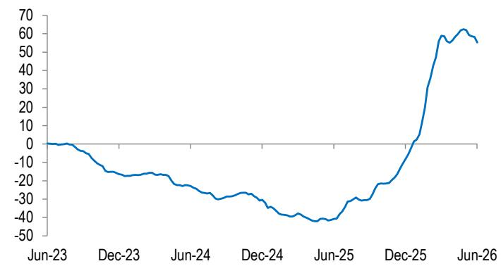

line

| Date    | Value |
|---------|-------|
| Jun-23  | 0     |
| Dec-23  | -10   |
| Jun-24  | -20   |
| Dec-24  | -30   |
| Jun-25  | -40   |
| Dec-25  | 0     |
| Jun-26  | 60    |

Source: EPFR Global

# GEM ex-China - Marginal inflows during the week

Figure 25: EM ex-China funds' weekly net flows   
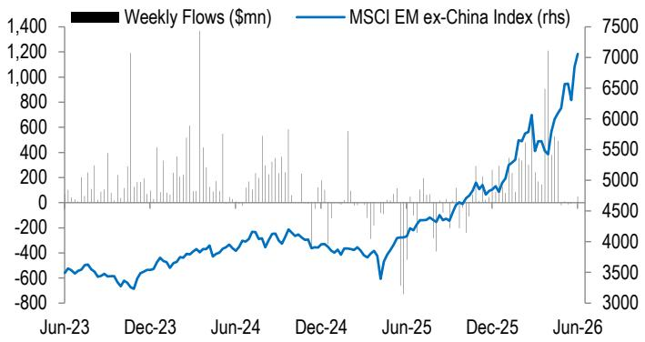

bar_line

| Date    | Weekly Flows ($mn) | MSCI EM ex-China Index (rhs) |
|---------|---------------------|------------------------------|
| Jun-23  | -800                | 3500                         |
| Dec-23  | -600                | 3700                         |
| Jun-24  | -400                | 4000                         |
| Dec-24  | -200                | 4200                         |
| Jun-25  | 0                   | 4500                         |
| Dec-25  | 200                 | 5000                         |
| Jun-26  | 400                 | 7000                         |

Source: EPFR Global, MSCI

Figure 26: EM ex-China funds' monthly cumulative flows (US\$bn)   
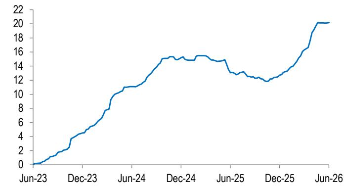

line

| Date    | Value |
|---------|-------|
| Jun-23  | 0     |
| Dec-23  | 4     |
| Jun-24  | 10    |
| Dec-24  | 15    |
| Jun-25  | 13    |
| Dec-25  | 12    |
| Jun-26  | 20    |

Source: EPFR Global

# Asia ex Japan - Strong outflows during the week

Figure 27: Asia ex-Japan funds' weekly net flows   
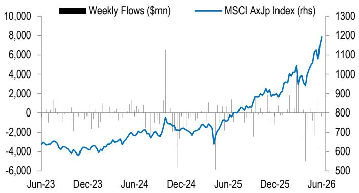

line

| Date    | Weekly Flows ($mn) | MSCI AxJp Index (rhs) |
|---------|---------------------|------------------------|
| Jun-23  | -4,000              | 600                    |
| Dec-23  | -3,000              | 700                    |
| Jun-24  | -2,000              | 800                    |
| Dec-24  | -1,000              | 900                    |
| Jun-25  | 0                   | 1000                   |
| Dec-25  | 2,000               | 1100                   |
| Jun-26  | 8,000               | 1200                   |

Source: EPFR Global, MSCI

Figure 28: Asia ex-Japan funds' monthly cumulative flows (US\$bn)   
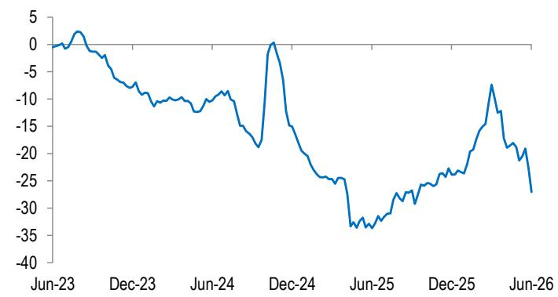

line

| Date   | Value |
|--------|-------|
| Jun-23 | 0     |
| Dec-23 | -10   |
| Jun-24 | -15   |
| Dec-24 | 0     |
| Jun-25 | -35   |
| Dec-25 | -25   |
| Jun-26 | -25   |

Source: EPFR Global

# EMEA - Marginal outflows during the week

Figure 29: EMEA funds' weekly net flows   
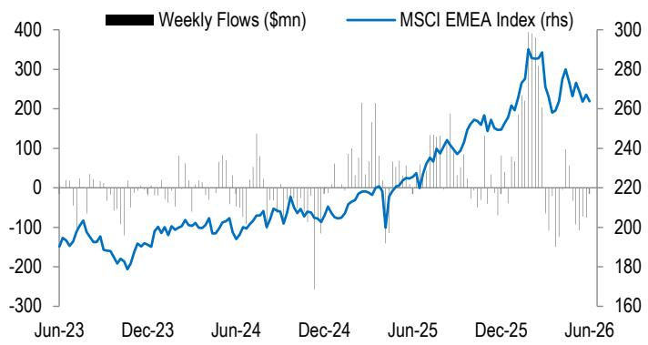

line

| Date   | Weekly Flows ($mn) | MSCI EMEA Index (rhs) |
|--------|---------------------|------------------------|
| Jun-23 | -150                | 180                    |
| Dec-23 | -100                | 160                    |
| Jun-24 | -50                 | 190                    |
| Dec-24 | 0                   | 210                    |
| Jun-25 | 50                  | 230                    |
| Dec-25 | 100                 | 270                    |
| Jun-26 | 150                 | 290                    |

Source: EPFR Global, MSCI

Figure 30: EMEA funds' monthly cumulative flows (US\$bn)   
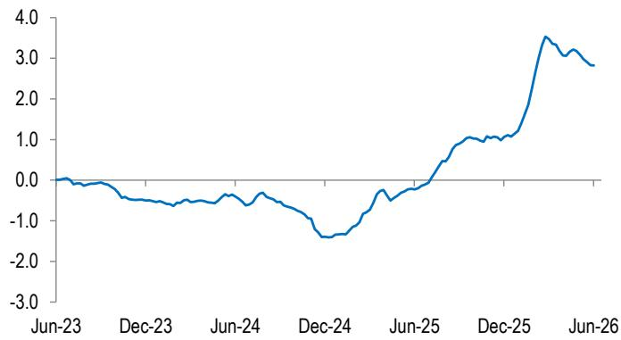

line

| Date   | Value |
|--------|-------|
| Jun-23 | 0.0   |
| Dec-23 | -0.5  |
| Jun-24 | -0.8  |
| Dec-24 | -1.5  |
| Jun-25 | 0.5   |
| Dec-25 | 1.0   |
| Jun-26 | 3.5   |

Source: EPFR Global

# Latin America - Strong outflows during the week

Figure 31: Latin America funds' weekly net flows   
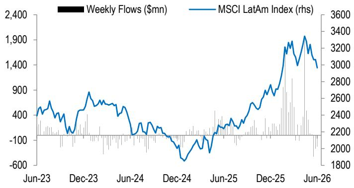

line

| Date    | Weekly Flows ($mn) | MSCI LatAm Index (rhs) |
|---------|---------------------|------------------------|
| Jun-23  | ~400                | ~2400                  |
| Dec-23  | ~900                | ~2800                  |
| Jun-24  | ~-100               | ~2000                  |
| Dec-24  | ~-600               | ~1800                  |
| Jun-25  | ~-100               | ~2400                  |
| Dec-25  | ~1,300              | ~3200                  |
| Jun-26  | ~1,900              | ~3400                  |

Source: EPFR Global, MSCI

Figure 32: Latin America funds' monthly cumulative flows (US\$bn)   
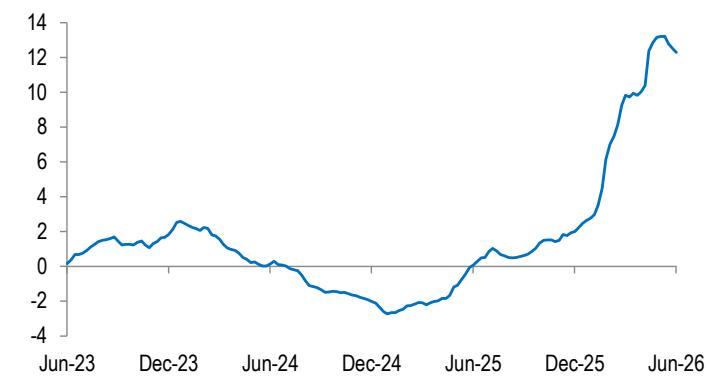

line

| Date    | Value |
|---------|-------|
| Jun-23  | 0     |
| Dec-23  | 2     |
| Jun-24  | 0     |
| Dec-24  | -3    |
| Jun-25  | 0     |
| Dec-25  | 3     |
| Jun-26  | 13    |

Source: EPFR Global

# Developed Europe - Net outflows during the week

Figure 33: Developed Europe funds' weekly net flows   
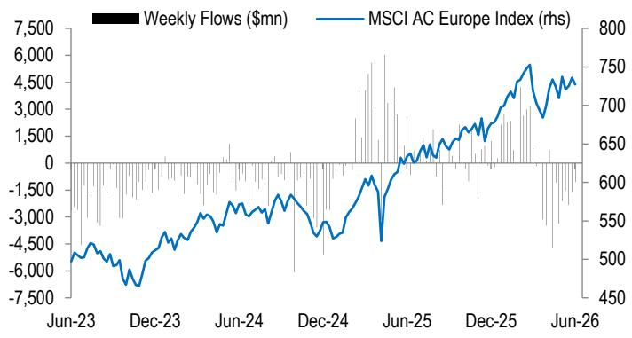

line

| Date    | Weekly Flows ($mn) | MSCI AC Europe Index (rhs) |
|---------|---------------------|----------------------------|
| Jun-23  | -7,500              | 500                        |
| Dec-23  | -5,000              | 450                        |
| Jun-24  | -3,000              | 550                        |
| Dec-24  | -1,500              | 600                        |
| Jun-25  | 0                   | 650                        |
| Dec-25  | 3,000               | 700                        |
| Jun-26  | 5,000               | 750                        |

Source: EPFR Global, MSCI

Figure 34: Developed Europe funds' monthly cumulative flows (US\$bn)   
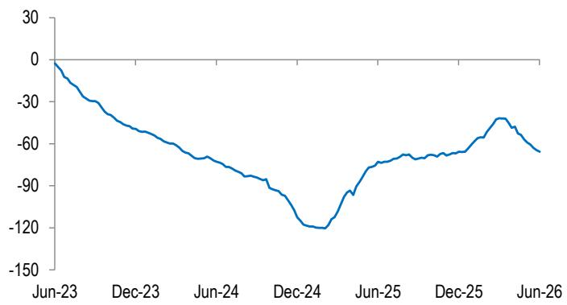

line

| Date   | Value |
|--------|-------|
| Jun-23 | 0     |
| Dec-23 | -30   |
| Jun-24 | -60   |
| Dec-24 | -120  |
| Jun-25 | -90   |
| Dec-25 | -60   |
| Jun-26 | -60   |

Source: EPFR Global

# United States - Strong inflows during the week

Figure 35: US weekly funds' net flows   
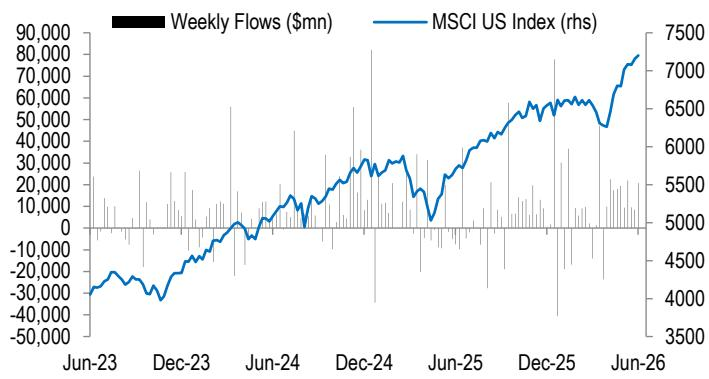

line

| Date    | Weekly Flows ($mn) | MSCI US Index (rhs) |
|---------|---------------------|----------------------|
| Jun-23  | -30,000             | 4,000                |
| Dec-23  | -10,000             | 4,500                |
| Jun-24  | 10,000              | 5,000                |
| Dec-24  | 30,000              | 5,500                |
| Jun-25  | 50,000              | 6,000                |
| Dec-25  | 60,000              | 6,500                |
| Jun-26  | 75,000              | 7,500                |

Source: EPFR Global, MSCI

Figure 36: US monthly funds' cumulative flows (US\$bn)   
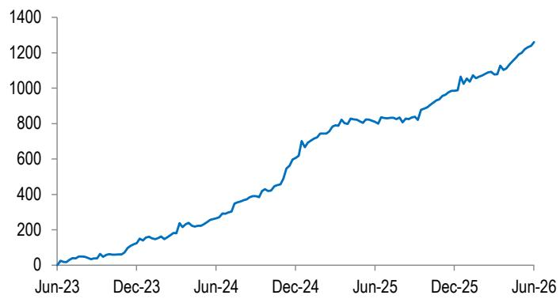

line

| Date   | Value |
|--------|-------|
| Jun-23 | 0     |
| Dec-23 | 100   |
| Jun-24 | 300   |
| Dec-24 | 700   |
| Jun-25 | 800   |
| Dec-25 | 1000  |
| Jun-26 | 1250  |

Source: EPFR Global

# International - Strong inflows during the week

Figure 37: International funds' weekly net flows   
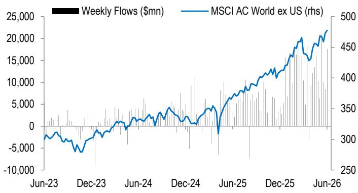

line

| Date    | Weekly Flows ($mn) | MSCI AC World ex US (rhs) |
|---------|---------------------|----------------------------|
| Jun-23  | -10,000             | 300                        |
| Dec-23  | -5,000              | 350                        |
| Jun-24  | 0                   | 400                        |
| Dec-24  | 5,000               | 450                        |
| Jun-25  | 10,000              | 500                        |
| Dec-25  | 15,000              | 475                        |
| Jun-26  | 20,000              | 490                        |

Source: EPFR Global, MSCI

Figure 38: International funds' monthly cumulative flows (US\$bn)   
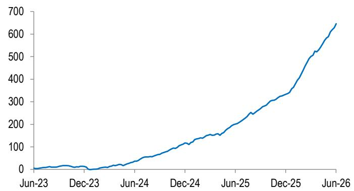

line

| Date   | Value |
|--------|-------|
| Jun-23 | 0     |
| Dec-23 | 10    |
| Jun-24 | 50    |
| Dec-24 | 100   |
| Jun-25 | 200   |
| Dec-25 | 350   |
| Jun-26 | 650   |

Source: EPFR Global

# Equities: Market Net Flows

# Japan - Marginal outflows from 23 - 29 May 2026

Figure 39: Weekly net foreign investment into the Japanese stock market (US\$mn)   
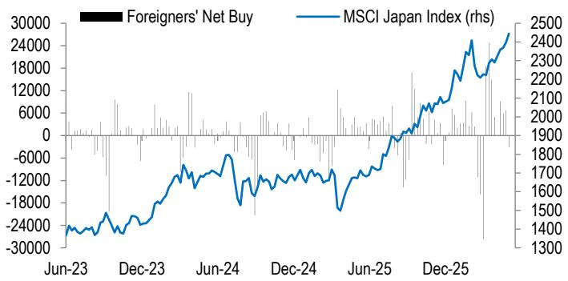

line

| Date    | Foreigners' Net Buy | MSCI Japan Index (rhs) |
|---------|---------------------|------------------------|
| Jun-23  | -24000              | 1300                   |
| Dec-23  | -20000              | 1600                   |
| Jun-24  | -18000              | 1700                   |
| Dec-24  | -16000              | 1800                   |
| Jun-25  | -14000              | 2000                   |
| Dec-25  | -12000              | 2400                   |

Source: Bloomberg Finance L.P., MSCI, Ministry of Finance, Japan

Figure 40: Monthly cumulative net foreign investment into the Japanese stock market (US\$bn)   
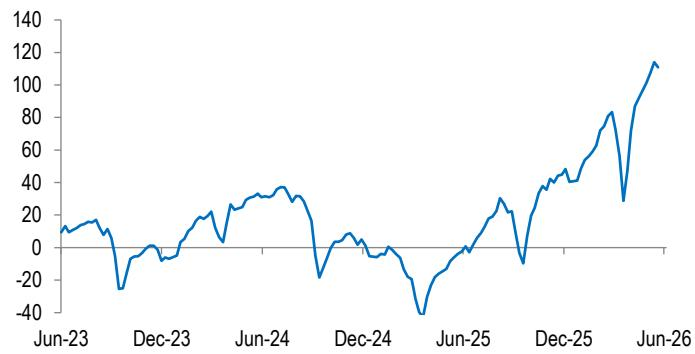

line

| Date   | Value |
|--------|-------|
| Jun-23 | 10    |
| Dec-23 | -20   |
| Jun-24 | 30    |
| Dec-24 | -10   |
| Jun-25 | -40   |
| Dec-25 | 40    |
| Jun-26 | 110   |

Source: Bloomberg Finance L.P., MSCI, Ministry of Finance, Japan

# Korea - Strong outflows during the week

Figure 41: Weekly net foreign investment into the Korean stock market (US\$mn)   
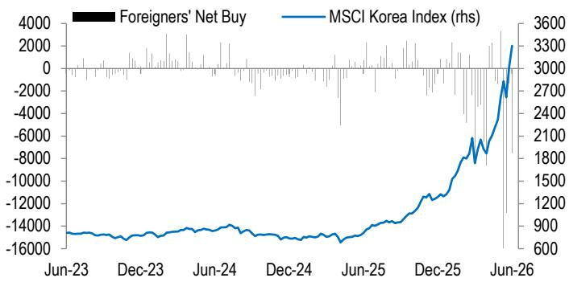

line

| Date    | Foreigners' Net Buy | MSCI Korea Index (rhs) |
|---------|---------------------|------------------------|
| Jun-23  | -14000              | 900                    |
| Dec-23  | -14000              | 900                    |
| Jun-24  | -14000              | 900                    |
| Dec-24  | -14000              | 900                    |
| Jun-25  | -14000              | 1200                   |
| Dec-25  | -8000               | 1800                   |
| Jun-26  | 3600                | 3600                   |

Source: Bloomberg Finance L.P., MSCI, KSE

Figure 42: Monthly cumulative net foreign investment into the Korean stock market (US\$bn)   
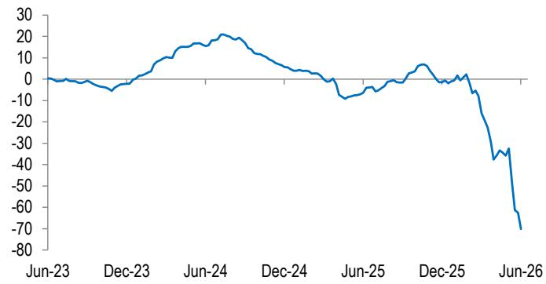

line

| Date   | Value |
|--------|-------|
| Jun-23 | 0     |
| Dec-23 | -10   |
| Jun-24 | 20    |
| Dec-24 | 5     |
| Jun-25 | -10   |
| Dec-25 | 5     |
| Jun-26 | -70   |

Source: Bloomberg Finance L.P., MSCI, KSE

# Taiwan - Strong inflows during the week

Figure 43: Weekly net foreign investment into the Taiwan stock market (US\$mn)   
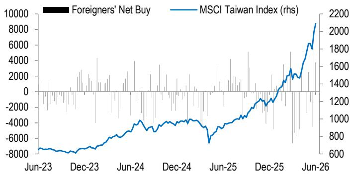

line

| Date    | Foreigners' Net Buy | MSCI Taiwan Index (rhs) |
|---------|---------------------|--------------------------|
| Jun-23  | -8000               | 600                      |
| Dec-23  | -7000               | 700                      |
| Jun-24  | -6000               | 900                      |
| Dec-24  | -5000               | 1100                     |
| Jun-25  | -4000               | 1300                     |
| Dec-25  | -3000               | 1600                     |
| Jun-26  | -2000               | 2200                     |

Source: Bloomberg Finance L.P., MSCI, TWSE, OTC

Figure 44: Monthly cumulative net foreign investment into the Taiwan stock market (US\$bn)   
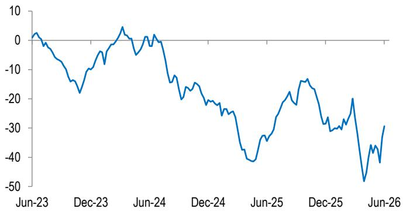

line

| Date   | Value |
|--------|-------|
| Jun-23 | 0     |
| Dec-23 | -15   |
| Jun-24 | 5     |
| Dec-24 | -20   |
| Jun-25 | -40   |
| Dec-25 | -30   |
| Jun-26 | -50   |

Source: Bloomberg Finance L.P., TWSE, OTC

# India - Strong outflows during the week

Figure 45: Weekly net foreign investment into the Indian stock market (US\$mn)   
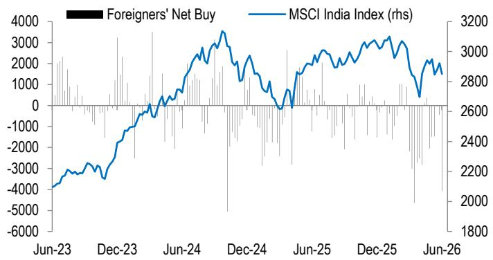

line

| Date    | Foreigners' Net Buy | MSCI India Index (rhs) |
|---------|---------------------|------------------------|
| Jun-23  | -4000               | 2000                   |
| Dec-23  | -1000               | 2400                   |
| Jun-24  | 1000                | 2800                   |
| Dec-24  | 3000                | 3200                   |
| Jun-25  | 1000                | 2800                   |
| Dec-25  | 3000                | 3000                   |
| Jun-26  | 1500                | 2600                   |

Source: Bloomberg Finance L.P., MSCI, BSE, NSE

Figure 46: Monthly cumulative net foreign investment into the Indian stock market (US\$bn)   
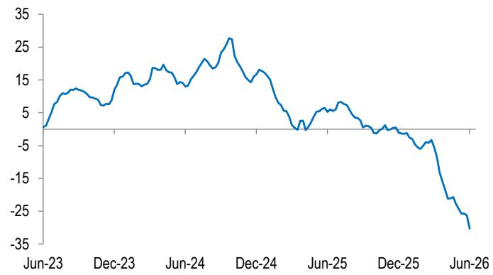

line

| Date   | Value |
|--------|-------|
| Jun-23 | 0     |
| Dec-23 | 10    |
| Jun-24 | 15    |
| Dec-24 | 25    |
| Jun-25 | 0     |
| Dec-25 | -10   |
| Jun-26 | -30   |

Source: Bloomberg Finance L.P., BSE, NSE

# Brazil - Net outflows from 27 May - 1 Jun 2026

Figure 47: Weekly net foreign investment into the Brazil stock market (US\$mn)   
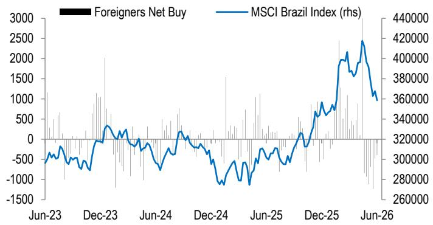

line

| Date   | Foreigners Net Buy | MSCI Brazil Index (rhs) |
|--------|--------------------|-------------------------|
| Jun-23 | -500               | 300000                  |
| Dec-23 | 100                | 320000                  |
| Jun-24 | -500               | 300000                  |
| Dec-24 | -1000              | 280000                  |
| Jun-25 | -500               | 340000                  |
| Dec-25 | 100                | 400000                  |
| Jun-26 | 250                | 360000                  |

Source: Bloomberg Finance L.P., MSCI, Bovespa

Figure 48: Monthly cumulative net foreign investment into the Brazil stock market (US\$bn)   
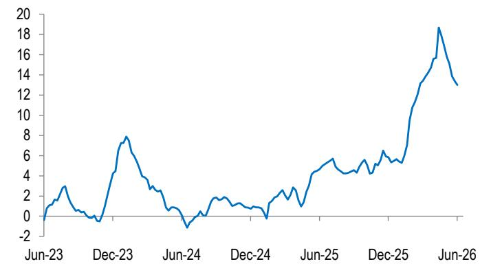

line

| Date    | Value |
|---------|-------|
| Jun-23  | 0     |
| Dec-23  | 8     |
| Jun-24  | -1    |
| Dec-24  | 1     |
| Jun-25  | 6     |
| Dec-25  | 10    |
| Jun-26  | 19    |

Source: Bloomberg Finance L.P., MSCI, Bovespa

# Saudi Arabia - Net inflows from 15 - 21 May 2026

Figure 49: Weekly net foreign investment into the Saudi stock market (US\$mn)   
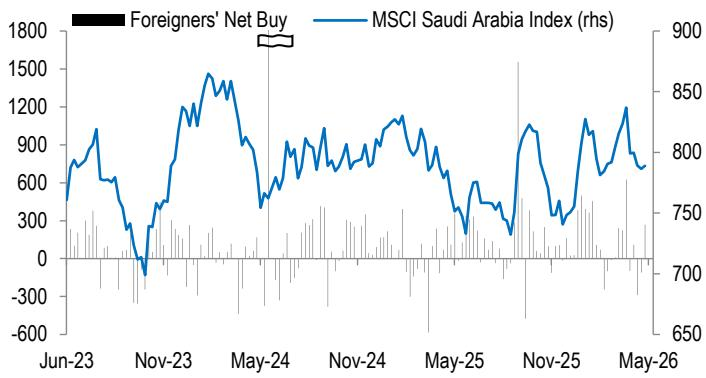

line

| Date   | Foreigners' Net Buy | MSCI Saudi Arabia Index (rhs) |
|--------|---------------------|-------------------------------|
| Jun-23 | ~700                | ~800                          |
| Nov-23 | ~1500               | ~750                          |
| May-24 | ~1500               | ~850                          |
| Nov-24 | ~900                | ~800                          |
| May-25 | ~600                | ~750                          |
| Nov-25 | ~1000               | ~850                          |
| May-26 | ~1200               | ~800                          |

Source: Bloomberg Finance L.P., MSCI, Saudi Stock Exchange

Figure 50: Monthly cumulative net foreign investment into the Saudi stock market (US\$bn)   
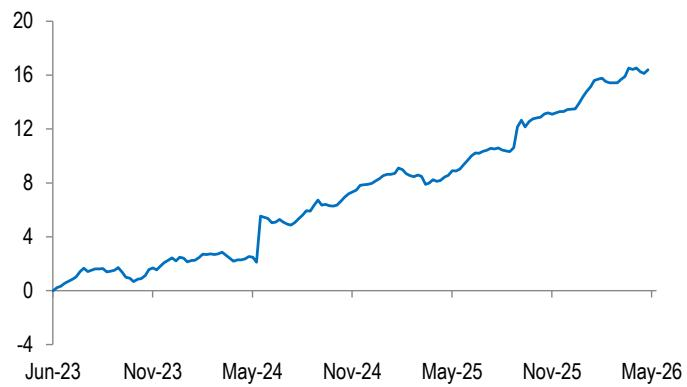

line

| Date    | Value |
|---------|-------|
| Jun-23  | 0     |
| Nov-23  | 2     |
| May-24  | 4     |
| Nov-24  | 8     |
| May-25  | 10    |
| Nov-25  | 14    |
| May-26  | 16    |

Source: Bloomberg Finance L.P., MSCI, Saudi Stock Exchange

# Thailand - Net inflows during the week

Figure 51: Weekly net foreign investment into the Thailand stock market (US\$mn)   
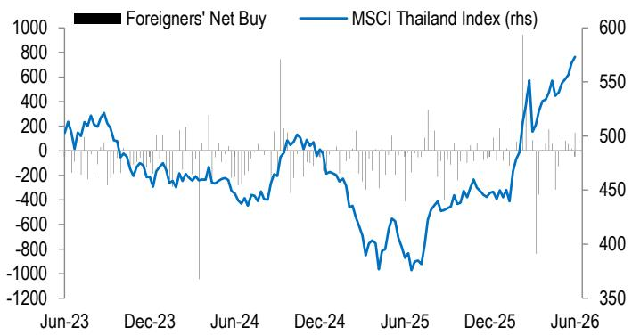

line

| Date    | Foreigners' Net Buy | MSCI Thailand Index (rhs) |
|---------|---------------------|---------------------------|
| Jun-23  | ~200                | ~500                      |
| Dec-23  | ~-200               | ~450                      |
| Jun-24  | ~-400               | ~400                      |
| Dec-24  | ~-800               | ~350                      |
| Jun-25  | ~-1000              | ~450                      |
| Dec-25  | ~-600               | ~550                      |
| Jun-26  | ~700                | ~600                      |

Source: Bloomberg Finance L.P., MSCI, TSE

Figure 52: Monthly cumulative net foreign investment into the Thailand stock market (US\$bn)   
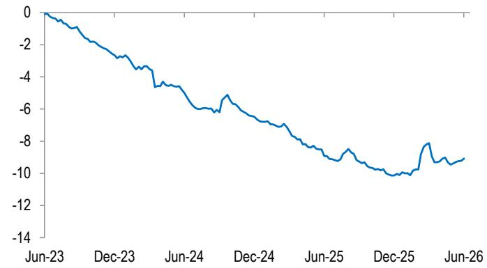

line

| Date   | Value |
|--------|-------|
| Jun-23 | 0     |
| Dec-23 | -2    |
| Jun-24 | -4    |
| Dec-24 | -6    |
| Jun-25 | -8    |
| Dec-25 | -10   |
| Jun-26 | -9    |

Source: Bloomberg Finance L.P., MSCI, TSE

# Indonesia - Strong outflows during the week

Figure 53: Weekly net foreign investment into the Indonesia stock market (US\$mn)   
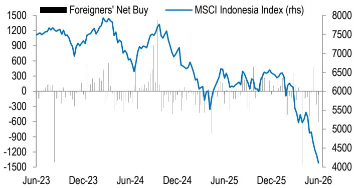

line

| Date    | Foreigners' Net Buy | MSCI Indonesia Index (rhs) |
|---------|---------------------|----------------------------|
| Jun-23  | ~1200               | ~7500                      |
| Dec-23  | ~900                | ~7000                      |
| Jun-24  | ~1400               | ~6500                      |
| Dec-24  | ~1200               | ~6000                      |
| Jun-25  | ~300                | ~5500                      |
| Dec-25  | ~500                | ~5000                      |
| Jun-26  | ~-1500              | ~4000                      |

Source: Bloomberg Finance L.P., MSCI, JSE

Figure 54: Monthly cumulative net foreign investment into the Indonesia stock market (US\$bn)   
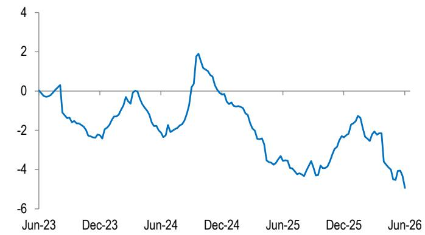

line

| Date   | Value |
|--------|-------|
| Jun-23 | 0     |
| Dec-23 | -2    |
| Jun-24 | -2    |
| Dec-24 | 2     |
| Jun-25 | -4    |
| Dec-25 | -2    |
| Jun-26 | -5    |

Source: Bloomberg Finance L.P., JSE

# Malaysia - Strong outflows during the week

Figure 55: Weekly net foreign investment into the Malaysia stock market (US\$mn)   
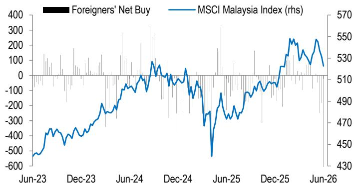

line

| Date   | Foreigners' Net Buy | MSCI Malaysia Index (rhs) |
|--------|---------------------|---------------------------|
| Jun-23 | -500                | 430                       |
| Dec-23 | -300                | 450                       |
| Jun-24 | -100                | 470                       |
| Dec-24 | 0                   | 490                       |
| Jun-25 | -500                | 510                       |
| Dec-25 | 100                 | 530                       |
| Jun-26 | 200                 | 550                       |

Source: Bloomberg Finance L.P., MSCI, Bursa Malaysia Berhad

Figure 56: Monthly cumulative net foreign investment into the Malaysia stock market (US\$bn)   
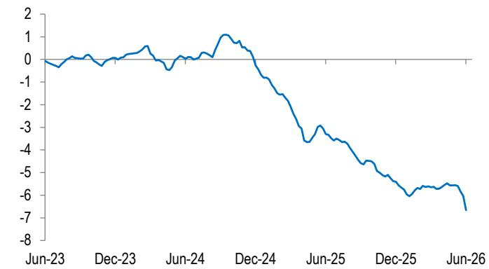

line

| Date   | Value |
|--------|-------|
| Jun-23 | 0.0   |
| Dec-23 | 0.0   |
| Jun-24 | 0.0   |
| Dec-24 | 1.0   |
| Jun-25 | -3.0  |
| Dec-25 | -6.0  |
| Jun-26 | -7.0  |

Source: Bloomberg Finance L.P., MSCI, Bursa Malaysia Berhad

# Philippines - Strong outflows during the week

Figure 57: Weekly net foreign investment into the Philippine stock market (US\$mn)   
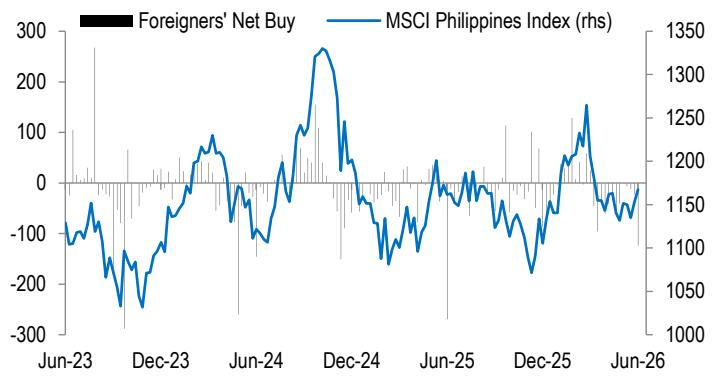

line

| Date   | Foreigners' Net Buy | MSCI Philippines Index (rhs) |
|--------|---------------------|------------------------------|
| Jun-23 | -100                | 1100                         |
| Dec-23 | -200                | 1050                         |
| Jun-24 | -50                 | 1150                         |
| Dec-24 | 250                 | 1350                         |
| Jun-25 | -100                | 1100                         |
| Dec-25 | -200                | 1050                         |
| Jun-26 | -50                 | 1150                         |

Source: Bloomberg Finance L.P., MSCI, PSE

Figure 58: Monthly cumulative net foreign investment into the Philippine stock market (US\$bn)   
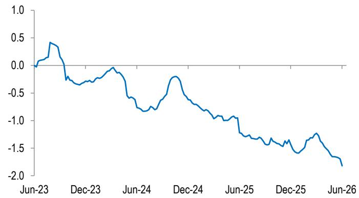

line

| Date   | Value |
|--------|-------|
| Jun-23 | 0.0   |
| Dec-23 | -0.5  |
| Jun-24 | -0.8  |
| Dec-24 | -0.3  |
| Jun-25 | -1.0  |
| Dec-25 | -1.5  |
| Jun-26 | -1.8  |

Source: Bloomberg Finance L.P., PSE

# Türkiye - Marginal outflows from 23 - 29 May 2026

Figure 59: Weekly net foreign investment into the Türkiye stock market (US\$mn)   
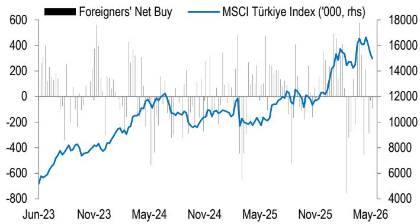

line

| Date   | Foreigners' Net Buy | MSCI Türkiye Index ('000, rhs) |
|--------|---------------------|--------------------------------|
| Jun-23 | -700                | 4000                           |
| Nov-23 | -400                | 8000                           |
| May-24 | -200                | 12000                          |
| Nov-24 | -100                | 10000                          |
| May-25 | 0                   | 14000                          |
| Nov-25 | 100                 | 16000                          |
| May-26 | 200                 | 14000                          |

Source: Bloomberg Finance L.P., MSCI, Central Bank of Turkey

Figure 60: Monthly cumulative net foreign investment into the Türkiye stock market (US\$bn)   
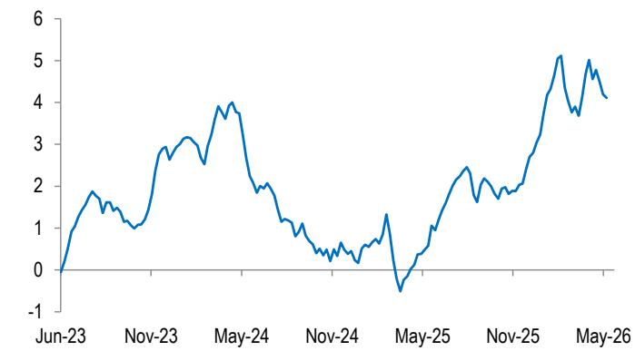

line

| Date    | Value |
|---------|-------|
| Jun-23  | 0     |
| Nov-23  | 1.8   |
| May-24  | 4.0   |
| Nov-24  | 0.5   |
| May-25  | -0.5  |
| Nov-25  | 2.5   |
| May-26  | 5.0   |

Source: Bloomberg Finance L.P., MSCI, Central Bank of Turkey

# Qatar - Strong outflows during the week

Figure 61: Weekly net foreign investment into the Qatar stock market (US\$mn)   
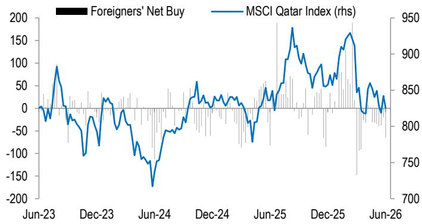

line

| Date   | Foreigners' Net Buy | MSCI Qatar Index (rhs) |
|--------|---------------------|------------------------|
| Jun-23 | -                   | 800                    |
| Dec-23 | -                   | 850                    |
| Jun-24 | -                   | 750                    |
| Dec-24 | -                   | 800                    |
| Jun-25 | -                   | 900                    |
| Dec-25 | -                   | 950                    |
| Jun-26 | -                   | 850                    |

Source: Bloomberg Finance L.P., MSCI, Qatar Exchange

Figure 62: Monthly cumulative net foreign investment into the Qatar stock market (US\$bn)   
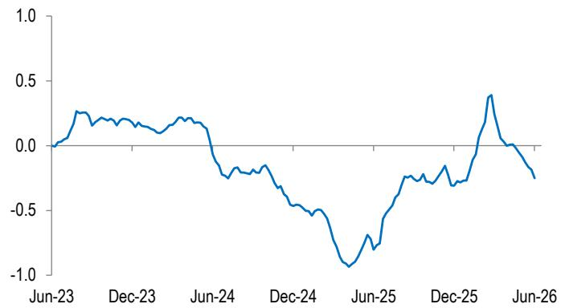

line

| Date   | Value |
|--------|-------|
| Jun-23 | 0.0   |
| Dec-23 | 0.2   |
| Jun-24 | -0.3  |
| Dec-24 | -0.6  |
| Jun-25 | -0.9  |
| Dec-25 | 0.4   |
| Jun-26 | -0.3  |

Source: Bloomberg Finance L.P., Qatar Exchange

# Dubai - Marginal outflows during the week

Figure 63: Weekly net foreign investment into the Dubai stock market (US\$mn)   
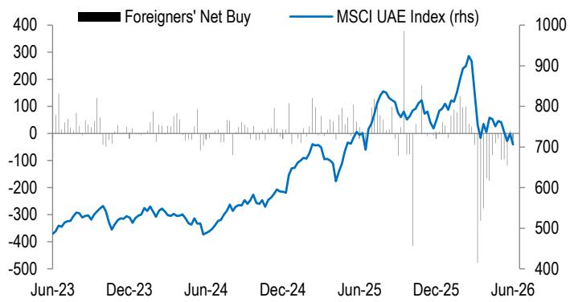

line

| Date   | Foreigners' Net Buy | MSCI UAE Index (rhs) |
|--------|---------------------|----------------------|
| Jun-23 | -400                | 500                  |
| Dec-23 | -300                | 600                  |
| Jun-24 | -200                | 700                  |
| Dec-24 | -100                | 800                  |
| Jun-25 | 0                   | 900                  |
| Dec-25 | 100                 | 800                  |
| Jun-26 | 0                   | 700                  |

Source: Bloomberg Finance L.P., MSCI, Dubai Financial Market.

Figure 64: Monthly cumulative net foreign investment into the Dubai stock market (US\$bn)   
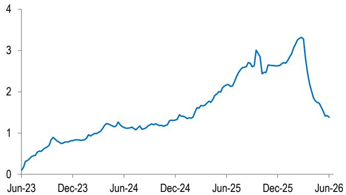

line

| Date   | Value |
|--------|-------|
| Jun-23 | 0.1   |
| Dec-23 | 0.8   |
| Jun-24 | 1.1   |
| Dec-24 | 1.3   |
| Jun-25 | 2.0   |
| Dec-25 | 2.7   |
| Jun-26 | 1.4   |

Source: Bloomberg Finance L.P., Dubai Financial Market.

# Vietnam - Net outflows during the week

Figure 65: Weekly net foreign investment into the Vietnam stock market (US\$mn)   
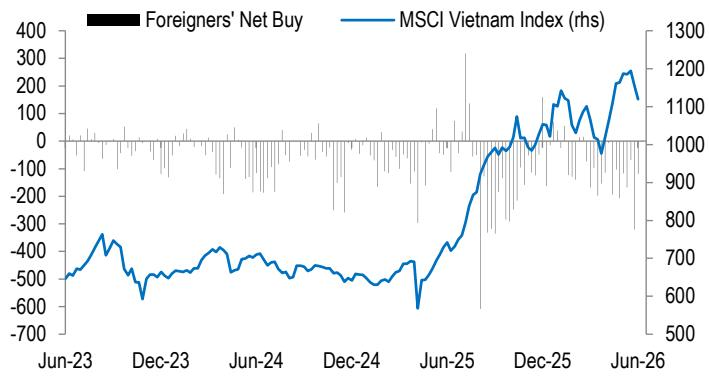

line

| Date   | Foreigners' Net Buy | MSCI Vietnam Index (rhs) |
|--------|---------------------|--------------------------|
| Jun-23 | ~0                  | ~600                     |
| Dec-23 | ~0                  | ~700                     |
| Jun-24 | ~0                  | ~650                     |
| Dec-24 | ~0                  | ~600                     |
| Jun-25 | ~0                  | ~900                     |
| Dec-25 | ~0                  | ~1100                    |
| Jun-26 | ~0                  | ~1200                    |

Source: Bloomberg Finance L.P., MSCI, Ho Chi Minh City Securities Trading Center

Figure 66: Monthly cumulative net foreign investment into the Vietnam stock market (US\$bn)   
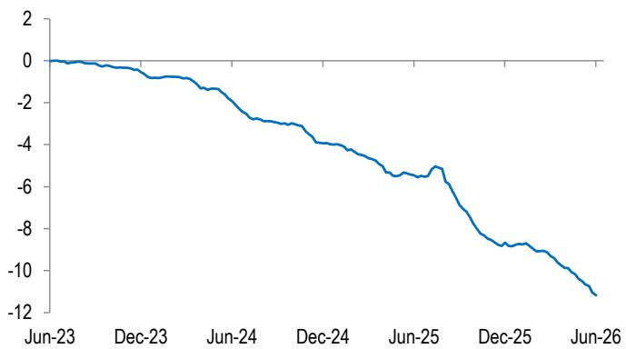

line

| Date   | Value |
|--------|-------|
| Jun-23 | 0     |
| Dec-23 | -1    |
| Jun-24 | -3    |
| Dec-24 | -5    |
| Jun-25 | -7    |
| Dec-25 | -9    |
| Jun-26 | -11   |

Source: Bloomberg Finance L.P., Ho Chi Minh City Securities Trading Center

# Pakistan - Marginal outflows during the week

Figure 67: Weekly net foreign investment into the Pakistan stock market (US\$mn)   
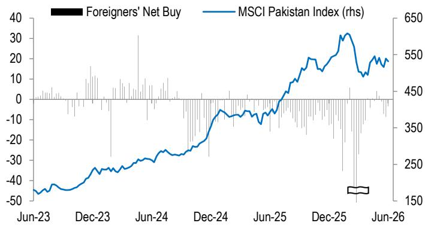

line

| Date    | MSCI Pakistan Index (rhs) | Foreigners' Net Buy |
|---------|---------------------------|---------------------|
| Jun-23  | ~150                      | ~-45                |
| Dec-23  | ~250                      | ~-35                |
| Jun-24  | ~350                      | ~-25                |
| Dec-24  | ~450                      | ~-10                |
| Jun-25  | ~550                      | ~-5                 |
| Dec-25  | ~600                      | ~-15                |
| Jun-26  | ~500                      | ~-150               |

Source: Bloomberg Finance L.P., MSCI, Pakistan Stock Exchange.

Figure 68: Monthly cumulative net foreign investment into the Pakistan stock market (US\$bn)   
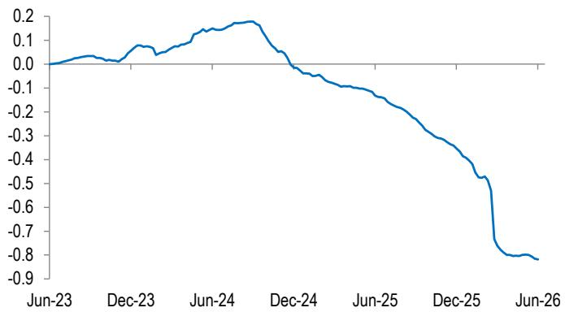

line

| Date   | Value |
|--------|-------|
| Jun-23 | 0.0   |
| Dec-23 | 0.05  |
| Jun-24 | 0.15  |
| Dec-24 | 0.18  |
| Jun-25 | -0.1  |
| Dec-25 | -0.4  |
| Jun-26 | -0.8  |

Source: Bloomberg Finance L.P., Pakistan Stock Exchange

# Sri Lanka - Net outflows during the week

Figure 69: Weekly net foreign investment into the Sri Lanka stock market (US\$mn)   
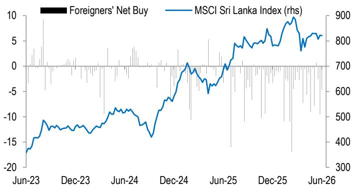

line

| Date    | Foreigners' Net Buy | MSCI Sri Lanka Index (rhs) |
|---------|---------------------|----------------------------|
| Jun-23  | -18                 | 300                        |
| Dec-23  | -12                 | 400                        |
| Jun-24  | -8                  | 500                        |
| Dec-24  | -15                 | 700                        |
| Jun-25  | -5                  | 800                        |
| Dec-25  | 5                   | 900                        |
| Jun-26  | 6                   | 850                        |

Source: Bloomberg Finance L.P., MSCI, Colombo Stock Exchange – Sri Lanka

Figure 70: Monthly cumulative net foreign investment into the Sri Lanka stock market (US\$bn)   
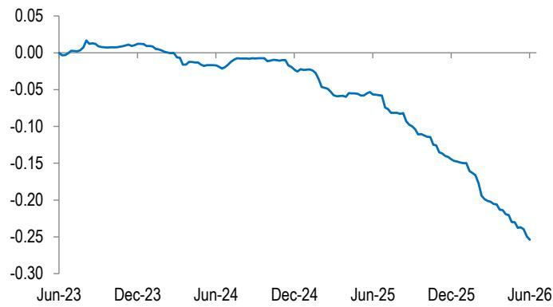

line

| Date   | Value  |
|--------|--------|
| Jun-23 | 0.00   |
| Dec-23 | 0.01   |
| Jun-24 | -0.01  |
| Dec-24 | -0.02  |
| Jun-25 | -0.05  |
| Dec-25 | -0.15  |
| Jun-26 | -0.25  |

Source: Bloomberg Finance L.P., MSCI, Colombo Stock Exchange – Sri Lanka

# Equities: Monthly Tracking of Cross-Border Funds

# China - Net inflows in April

Figure 71: Monthly net foreign investment into Chinese equities by funds monitored by EPFR Global (US\$mn)   
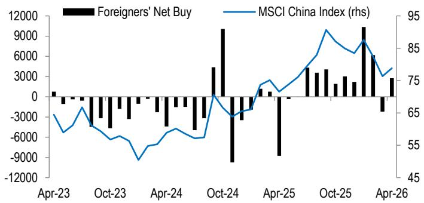

bar_line

| Date   | Foreigners' Net Buy | MSCI China Index (rhs) |
|--------|---------------------|------------------------|
| Apr-23 | 0                   | 65                     |
| Oct-23 | -3000               | 55                     |
| Apr-24 | -9000               | 65                     |
| Oct-24 | 12000               | 75                     |
| Apr-25 | -9000               | 85                     |
| Oct-25 | 12000               | 95                     |
| Apr-26 | 3000                | 75                     |

Source: EPFR Global, MSCI

Figure 72: Monthly cumulative net foreign investment into Chinese equities by funds monitored by EPFR Global (US\$bn)   
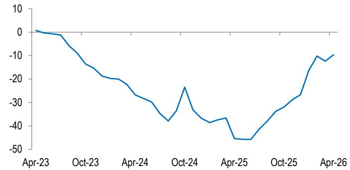

line

| Date   | Value |
|--------|-------|
| Apr-23 | 0     |
| Oct-23 | -10   |
| Apr-24 | -20   |
| Oct-24 | -30   |
| Apr-25 | -45   |
| Oct-25 | -30   |
| Apr-26 | -10   |

Source: EPFR Global

# Mexico - Strong inflows in April

Figure 73: Monthly net foreign investment into Mexican equities by funds monitored by EPFR Global (US\$mn)   
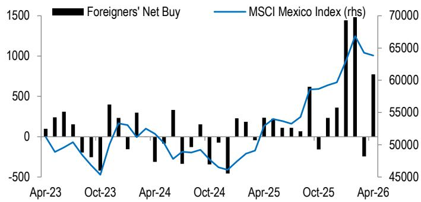

bar_line

| Date   | Foreigners' Net Buy | MSCI Mexico Index (rhs) |
|--------|---------------------|-------------------------|
| Apr-23 | 100                 | 50000                   |
| Oct-23 | -400                | 45000                   |
| Apr-24 | 300                 | 55000                   |
| Oct-24 | -400                | 45000                   |
| Apr-25 | 200                 | 55000                   |
| Oct-25 | 600                 | 60000                   |
| Apr-26 | 800                 | 65000                   |

Source: EPFR Global, MSCI

Figure 74: Monthly cumulative net foreign investment into Mexican equities by funds monitored by EPFR Global (US\$bn)   
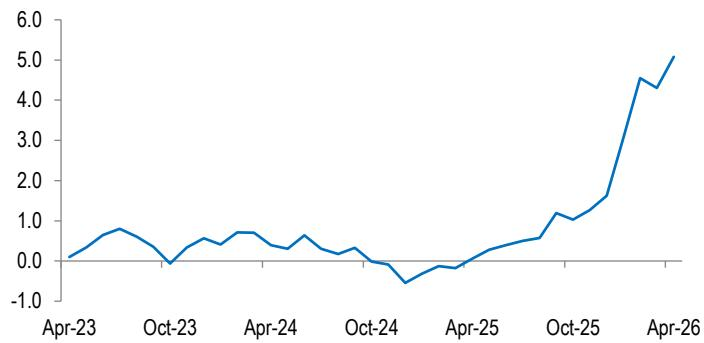

line

| Date   | Value |
|--------|-------|
| Apr-23 | 0.0   |
| Oct-23 | 0.8   |
| Apr-24 | 0.6   |
| Oct-24 | -0.5  |
| Apr-25 | 0.0   |
| Oct-25 | 1.2   |
| Apr-26 | 5.0   |

Source: EPFR Global

# Chile - Strong inflows in April

Figure 75: Monthly net foreign investment into Chile equities by funds monitored by EPFR Global (US\$mn)   
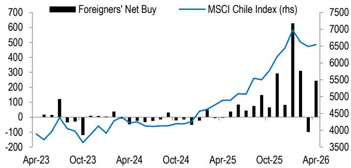

bar_line

| Date   | Foreigners' Net Buy | MSCI Chile Index (rhs) |
|--------|---------------------|------------------------|
| Apr-23 | 0                   | 4000                   |
| Oct-23 | 100                 | 4500                   |
| Apr-24 | 0                   | 4500                   |
| Oct-24 | 0                   | 4500                   |
| Apr-25 | 100                 | 5000                   |
| Oct-25 | 300                 | 6500                   |
| Apr-26 | 250                 | 6500                   |

Source: EPFR Global, MSCI

Figure 76: Monthly cumulative net foreign investment into Chile equities by funds monitored by EPFR Global (US\$bn)   
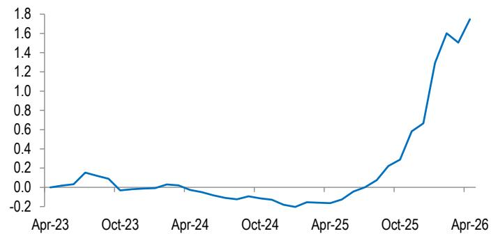

line

| Date   | Value |
|--------|-------|
| Apr-23 | 0.0   |
| Oct-23 | 0.1   |
| Apr-24 | 0.0   |
| Oct-24 | -0.1  |
| Apr-25 | -0.2  |
| Oct-25 | 0.3   |
| Apr-26 | 1.7   |

Source: EPFR Global

# Poland - Net inflows in April

Figure 77: Monthly net foreign investment into Poland equities by funds monitored by EPFR Global (US\$mn)   
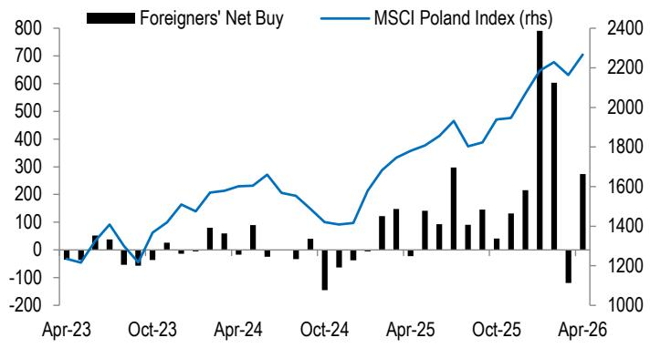

bar_line

| Date   | Foreigners' Net Buy | MSCI Poland Index (rhs) |
|--------|---------------------|-------------------------|
| Apr-23 | -100                | 1200                    |
| Oct-23 | -50                 | 1400                    |
| Apr-24 | 100                 | 1800                    |
| Oct-24 | -150                | 1600                    |
| Apr-25 | 150                 | 2000                    |
| Oct-25 | 300                 | 2400                    |
| Apr-26 | -150                | 2200                    |

Source: EPFR Global, MSCI

Figure 78: Monthly cumulative net foreign investment into Poland equities by funds monitored by EPFR Global (US\$bn)   
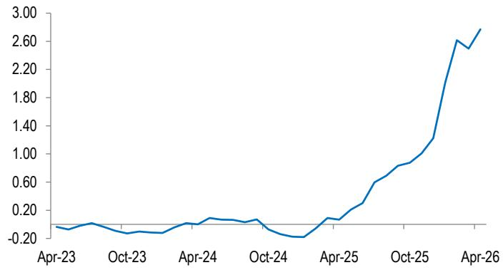

line

| Date   | Value |
|--------|-------|
| Apr-23 | -0.10 |
| Oct-23 | -0.15 |
| Apr-24 | -0.10 |
| Oct-24 | -0.15 |
| Apr-25 | -0.20 |
| Oct-25 | 0.80  |
| Apr-26 | 2.70  |

Source: EPFR Global

# Peru - Strong inflows in April

Figure 79: Monthly net foreign investment into Peru equities by funds monitored by EPFR Global (US\$mn)   
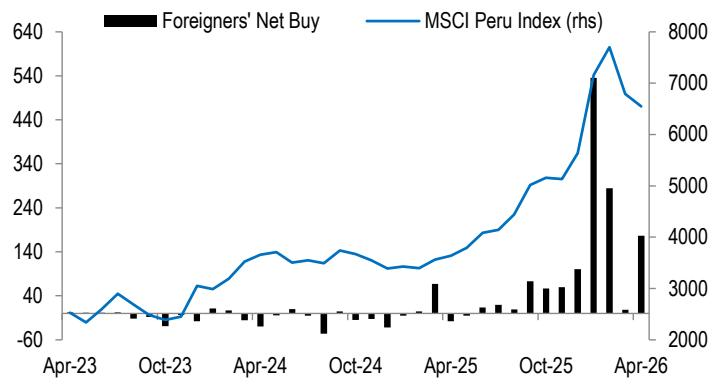

bar_line

| Date    | Foreigners' Net Buy | MSCI Peru Index (rhs) |
|---------|---------------------|------------------------|
| Apr-23  | -60                 | 2000                   |
| Oct-23  | -60                 | 2500                   |
| Apr-24  | -60                 | 3500                   |
| Oct-24  | -60                 | 4000                   |
| Apr-25  | 40                  | 5000                   |
| Oct-25  | 100                 | 6000                   |
| Apr-26  | 150                 | 7000                   |

Source: EPFR Global, MSCI

Figure 80: Monthly cumulative net foreign investment into Peru equities by funds monitored by EPFR Global (US\$bn)   
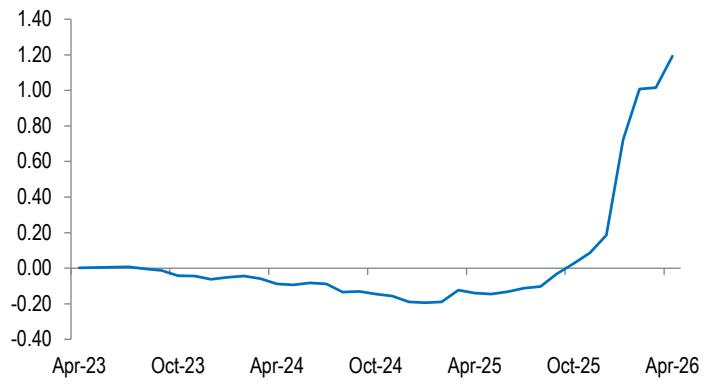

line

| Date   | Value |
|--------|-------|
| Apr-23 | 0.00  |
| Oct-23 | -0.05 |
| Apr-24 | -0.10 |
| Oct-24 | -0.15 |
| Apr-25 | -0.20 |
| Oct-25 | 0.10  |
| Apr-26 | 1.20  |

Source: EPFR Global

# Colombia - Strong inflows in April

Figure 81: Monthly net foreign investment into Colombia equities by funds monitored by EPFR Global (US\$mn)   
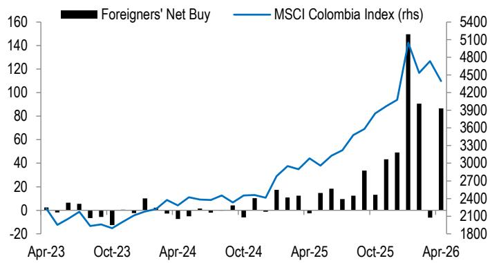

bar_line

| Date   | Foreigners' Net Buy | MSCI Colombia Index (rhs) |
|--------|---------------------|---------------------------|
| Apr-23 | 0                   | 2100                      |
| Oct-23 | -10                 | 1800                      |
| Apr-24 | 10                  | 2400                      |
| Oct-24 | 15                  | 3000                      |
| Apr-25 | 20                  | 3600                      |
| Oct-25 | 45                  | 4800                      |
| Apr-26 | 90                  | 5100                      |

Source: EPFR Global, MSCI.

Figure 82: Monthly cumulative net foreign investment into Colombia equities by funds monitored by EPFR Global (US\$bn)   
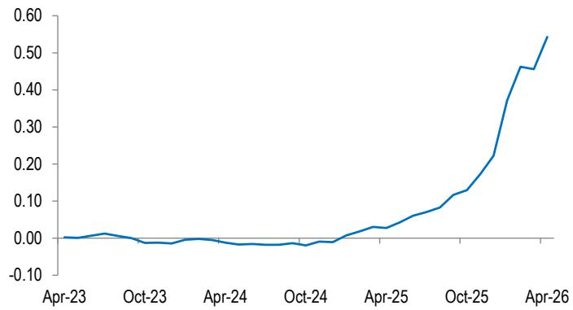

line

| Date   | Value |
|--------|-------|
| Apr-23 | 0.00  |
| Oct-23 | 0.01  |
| Apr-24 | 0.00  |
| Oct-24 | 0.00  |
| Apr-25 | 0.03  |
| Oct-25 | 0.12  |
| Apr-26 | 0.55  |

Source: EPFR Global.

# Australia - Strong inflows in April

Figure 83: Monthly net foreign investment into Australian equities by funds monitored by EPFR Global (US\$mn)   
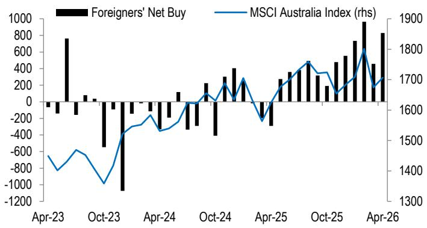

bar_line

| Date   | Foreigners' Net Buy | MSCI Australia Index (rhs) |
|--------|---------------------|----------------------------|
| Apr-23 | -100                | 1400                       |
| Oct-23 | -1000               | 1300                       |
| Apr-24 | -400                | 1500                       |
| Oct-24 | 400                 | 1700                       |
| Apr-25 | -200                | 1600                       |
| Oct-25 | 600                 | 1800                       |
| Apr-26 | 900                 | 1700                       |

Source: EPFR Global, MSCI

Figure 84: Monthly cumulative net foreign investment into Australian equities by funds monitored by EPFR Global (US\$bn)   
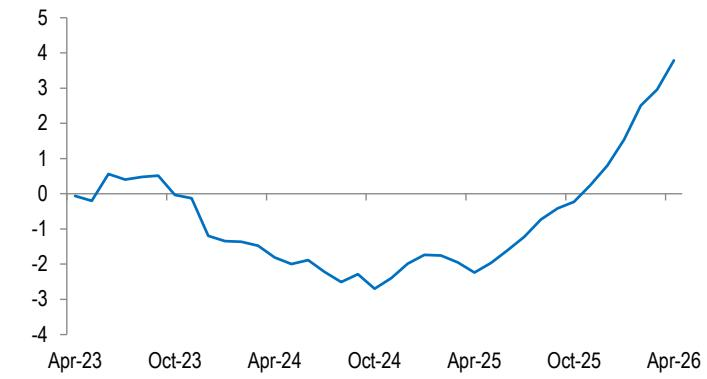

line

| Date   | Value |
|--------|-------|
| Apr-23 | -0.1  |
| Oct-23 | 0.5   |
| Apr-24 | -1.5  |
| Oct-24 | -2.8  |
| Apr-25 | -2.2  |
| Oct-25 | 0.0   |
| Apr-26 | 3.8   |

Source: EPFR Global

# Singapore - Strong inflows in April

Figure 85: Monthly net foreign investment into Singapore equities by funds monitored by EPFR Global (US\$mn)   
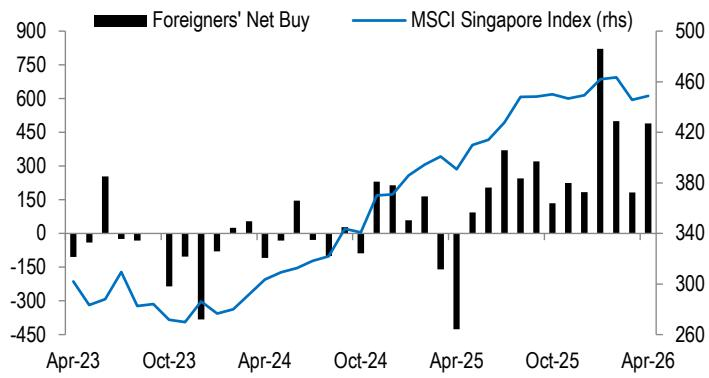

bar_line

| Date   | Foreigners' Net Buy | MSCI Singapore Index (rhs) |
|--------|---------------------|----------------------------|
| Apr-23 | -100                | 300                        |
| Oct-23 | -300                | 260                        |
| Apr-24 | 100                 | 340                        |
| Oct-24 | 150                 | 380                        |
| Apr-25 | -450                | 420                        |
| Oct-25 | 750                 | 460                        |
| Apr-26 | 500                 | 440                        |

Source: EPFR Global, MSCI

Figure 86: Monthly cumulative net foreign investment into Singapore equities by funds monitored by EPFR Global (US\$bn)   
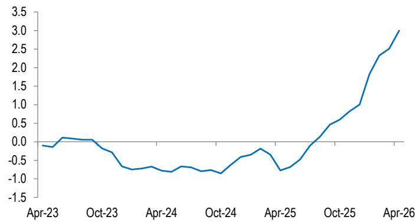

line

| Date   | Value |
|--------|-------|
| Apr-23 | -0.1  |
| Oct-23 | 0.1   |
| Apr-24 | -0.8  |
| Oct-24 | -0.9  |
| Apr-25 | -0.7  |
| Oct-25 | 0.5   |
| Apr-26 | 3.0   |

Source: EPFR Global

# Hong Kong - Net inflows in April

Figure 87: Monthly net foreign investment into Hong Kong equities by funds monitored by EPFR Global (US\$mn)   
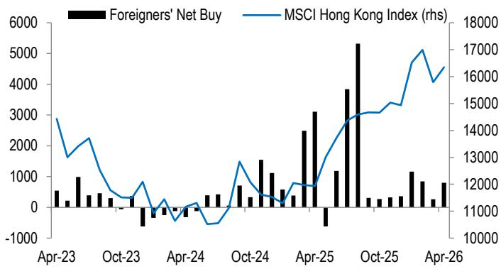

bar_line

| Date   | Foreigners' Net Buy | MSCI Hong Kong Index (rhs) |
|--------|---------------------|----------------------------|
| Apr-23 | 500                 | 18000                      |
| Oct-23 | -500                | 11000                      |
| Apr-24 | -1000               | 11500                      |
| Oct-24 | 1500                | 13000                      |
| Apr-25 | 3000                | 15000                      |
| Oct-25 | 5500                | 17000                      |
| Apr-26 | 800                 | 16000                      |

Source: EPFR Global, MSCI

Figure 88: Monthly cumulative net foreign investment into Hong Kong equities by funds monitored by EPFR Global (US\$bn)   
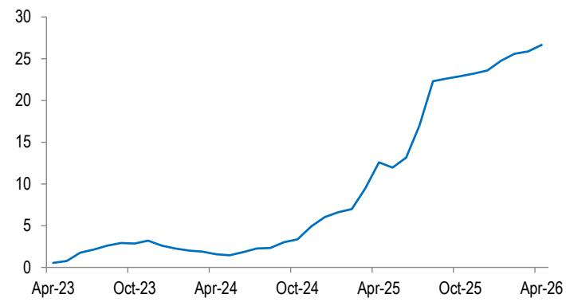

line

| Date   | Value |
|--------|-------|
| Apr-23 | 0     |
| Oct-23 | 3     |
| Apr-24 | 1     |
| Oct-24 | 3     |
| Apr-25 | 12    |
| Oct-25 | 22    |
| Apr-26 | 27    |

Source: EPFR Global

Table 3: EM equity performance during weeks of positive flows to EM funds 

<table><tr><td></td><td>Start</td><td>End</td><td>Length Weeks</td><td>Inflows USD mm</td><td>Inflows % AUM</td><td>MSCI EM P. Chg</td></tr><tr><td>Last</td><td>13-May-26</td><td>20-May-26</td><td>1</td><td>165</td><td>0.0%</td><td>-4.0%</td></tr><tr><td>Average</td><td></td><td></td><td>4</td><td>6,198</td><td>1.0%</td><td>3.2%</td></tr><tr><td>Median</td><td></td><td></td><td>2</td><td>1,207</td><td>0.3%</td><td>1.9%</td></tr><tr><td>Longest</td><td>23-Sep-20</td><td>5-May-21</td><td>32</td><td>126,091</td><td>8.2%</td><td>23.7%</td></tr><tr><td>Shortest</td><td>Various</td><td>NM</td><td>1</td><td>NM</td><td>NM</td><td>NM</td></tr><tr><td>Largest USD</td><td>23-Sep-20</td><td>5-May-21</td><td>32</td><td>126,091</td><td>8.2%</td><td>23.7%</td></tr><tr><td>Smallest USD</td><td>20-Oct-04</td><td>27-Oct-04</td><td>1</td><td>0.94</td><td>0.0%</td><td>1.4%</td></tr><tr><td>Largest % AUM</td><td>2-Nov-05</td><td>8-Mar-06</td><td>18</td><td>28,154</td><td>11.4%</td><td>18.1%</td></tr><tr><td>Smallest % AUM</td><td>20-Oct-04</td><td>27-Oct-04</td><td>1</td><td>0.94</td><td>0.0%</td><td>1.4%</td></tr><tr><td>Largest % MSCI</td><td>4-Mar-09</td><td>17-Jun-09</td><td>15</td><td>31,199</td><td>9.1%</td><td>51.8%</td></tr><tr><td>Smallest % MSCI</td><td>14-Nov-07</td><td>21-Nov-07</td><td>1</td><td>915.84</td><td>0.2%</td><td>-7.1%</td></tr></table>

Source: EPFR Global, JPM calculations. Note: Total EM flows exclude onshore funds. Past performance is not an indicator of future results

Table 4: EM equity performance during weeks of negative flows to EM funds 

<table><tr><td></td><td>Start</td><td>End</td><td>Length Weeks</td><td>Outflows USD mm</td><td>Outflows % AUM</td><td>MSCI EM P. Chg</td></tr><tr><td>Last</td><td>20-May-26</td><td>3-Jun-26</td><td>2</td><td>-11,866</td><td>-0.5%</td><td>9.2%</td></tr><tr><td>Average</td><td></td><td></td><td>3</td><td>-4,248</td><td>-0.8%</td><td>-1.9%</td></tr><tr><td>Median</td><td></td><td></td><td>2</td><td>-1,410</td><td>-0.3%</td><td>-0.7%</td></tr><tr><td>Longest</td><td>1-May-19</td><td>11-Sep-19</td><td>19</td><td>-45,884</td><td>-4.4%</td><td>-5.9%</td></tr><tr><td>Shortest</td><td>Various</td><td>NM</td><td>1</td><td>NM</td><td>NM</td><td>NM</td></tr><tr><td>Largest USD</td><td>3-Jun-15</td><td>16-Sep-15</td><td>15</td><td>-46,291</td><td>-6.6%</td><td>-17.4%</td></tr><tr><td>Smallest USD</td><td>14-Nov-01</td><td>21-Nov-01</td><td>1</td><td>-1</td><td>0.0%</td><td>1.8%</td></tr><tr><td>Largest % AUM</td><td>3-Jun-15</td><td>16-Sep-15</td><td>15</td><td>-46,291</td><td>-6.6%</td><td>-17.4%</td></tr><tr><td>Smallest % AUM</td><td>31-May-23</td><td>7-Jun-23</td><td>1</td><td>-19</td><td>0.0%</td><td>3.8%</td></tr><tr><td>Largest % MSCI</td><td>1-Oct-08</td><td>29-Oct-08</td><td>4</td><td>-6,947</td><td>-3.4%</td><td>-35.4%</td></tr><tr><td>Smallest % MSCI</td><td>15-Apr-20</td><td>3-Jun-20</td><td>7</td><td>-15,253</td><td>-1.5%</td><td>11.2%</td></tr></table>

Source: EPFR Global, JPM calculations. Note: Total EM flows exclude onshore funds. Past performance is not an indicator of future results

# Long-term Evolution of Net Flows

Table 5: Evolution of net flows (\$mn) 

<table><tr><td></td><td>All EM</td><td>GEM</td><td>EM ex-China</td><td>AxJp</td><td>EMEA</td><td>LatAm</td><td>International</td><td>US</td><td>Dev. Europe</td></tr><tr><td colspan="10">ANNUAL DATA (USD Mn)</td></tr><tr><td>2001</td><td>-3,643</td><td>-392</td><td>0</td><td>-1,159</td><td>-740</td><td>-1,352</td><td>-8,489</td><td>6,512</td><td>NA</td></tr><tr><td>2002</td><td>-117</td><td>-800</td><td>-1</td><td>1,880</td><td>-75</td><td>-1,123</td><td>2,052</td><td>1,748</td><td>-3,273</td></tr><tr><td>2003</td><td>15,236</td><td>6,588</td><td>2</td><td>7,347</td><td>786</td><td>515</td><td>22,126</td><td>33,355</td><td>-5,967</td></tr><tr><td>2004</td><td>7,737</td><td>-771</td><td>7</td><td>5,482</td><td>2,714</td><td>312</td><td>55,925</td><td>29,421</td><td>1,429</td></tr><tr><td>2005</td><td>32,033</td><td>8,627</td><td>69</td><td>10,619</td><td>8,475</td><td>4,312</td><td>68,850</td><td>-29,013</td><td>-1,788</td></tr><tr><td>2006</td><td>32,368</td><td>11,926</td><td>1</td><td>18,950</td><td>-2,494</td><td>3,986</td><td>93,969</td><td>-18,376</td><td>9,673</td></tr><tr><td>2007</td><td>50,995</td><td>24,000</td><td>84</td><td>17,391</td><td>-1,231</td><td>10,836</td><td>81,722</td><td>-48,125</td><td>-42,232</td></tr><tr><td>2008</td><td>-48,081</td><td>-11,087</td><td>100</td><td>-24,051</td><td>-6,196</td><td>-6,747</td><td>-83,310</td><td>-47,391</td><td>-60,271</td></tr><tr><td>2009</td><td>84,429</td><td>44,241</td><td>81</td><td>27,081</td><td>1,588</td><td>11,518</td><td>4,846</td><td>-74,758</td><td>1,163</td></tr><tr><td>2010</td><td>97,347</td><td>63,630</td><td>66</td><td>22,345</td><td>7,355</td><td>4,017</td><td>8,626</td><td>-48,658</td><td>-22,777</td></tr><tr><td>2011</td><td>-48,518</td><td>-4,636</td><td>-1</td><td>-26,108</td><td>-6,932</td><td>-10,841</td><td>-37,210</td><td>-86,517</td><td>-17,220</td></tr><tr><td>2012</td><td>51,211</td><td>50,322</td><td>154</td><td>5,022</td><td>-2,169</td><td>-1,964</td><td>-35,284</td><td>-71,831</td><td>-20,680</td></tr><tr><td>2013</td><td>-24,848</td><td>10,038</td><td>114</td><td>-16,436</td><td>-7,684</td><td>-10,765</td><td>105,673</td><td>181,134</td><td>54,259</td></tr><tr><td>2014</td><td>-27,434</td><td>-8,931</td><td>-322</td><td>-7,736</td><td>-5,414</td><td>-5,354</td><td>76,201</td><td>80,029</td><td>-415</td></tr><tr><td>2015</td><td>-65,542</td><td>-24,687</td><td>-122</td><td>-32,141</td><td>-3,258</td><td>-5,456</td><td>121,760</td><td>-173,780</td><td>134,594</td></tr><tr><td>2016</td><td>-828</td><td>23,625</td><td>-13</td><td>-26,871</td><td>166</td><td>2,252</td><td>3,338</td><td>-80,522</td><td>-112,296</td></tr><tr><td>2017</td><td>62,688</td><td>59,690</td><td>-106</td><td>3,719</td><td>-3,386</td><td>2,666</td><td>164,146</td><td>-34,824</td><td>33,218</td></tr><tr><td>2018</td><td>16,366</td><td>14,622</td><td>-41</td><td>4,789</td><td>-2,969</td><td>-76</td><td>59,861</td><td>-118,665</td><td>-89,091</td></tr><tr><td>2019</td><td>-11,678</td><td>15,676</td><td>71</td><td>-21,963</td><td>-4,319</td><td>-1,071</td><td>-7,726</td><td>-135,295</td><td>-108,146</td></tr><tr><td>2020</td><td>3,246</td><td>-12,740</td><td>72</td><td>20,481</td><td>-3,181</td><td>-1,315</td><td>94,920</td><td>-250,502</td><td>-56,628</td></tr><tr><td>2021</td><td>101,159</td><td>65,531</td><td>2,658</td><td>42,700</td><td>-2,603</td><td>-4,469</td><td>497,799</td><td>243,226</td><td>-2,246</td></tr><tr><td>2022</td><td>-3,857</td><td>-10,595</td><td>2,189</td><td>6,724</td><td>-1,006</td><td>1,019</td><td>7,347</td><td>26,579</td><td>-112,557</td></tr><tr><td>2023</td><td>3,899</td><td>2,999</td><td>6,525</td><td>2,089</td><td>-3,754</td><td>2,565</td><td>5,920</td><td>-52,053</td><td>-72,383</td></tr><tr><td>2024</td><td>-33,284</td><td>-8,232</td><td>10,039</td><td>-18,910</td><td>-443</td><td>-5,699</td><td>130,098</td><td>417,656</td><td>-75,861</td></tr><tr><td>2025</td><td>29,223</td><td>29,476</td><td>-1,807</td><td>-8,270</td><td>2,505</td><td>5,512</td><td>170,892</td><td>51,270</td><td>52,937</td></tr><tr><td>2026</td><td>66,776</td><td>58,294</td><td>6,959</td><td>-2,317</td><td>1,444</td><td>9,355</td><td>260,190</td><td>196,068</td><td>-3,963</td></tr><tr><td>Avg Since 2001</td><td>14,880</td><td>15,631</td><td>1,030</td><td>410</td><td>-1,262</td><td>101</td><td>71,702</td><td>-127</td><td>-20,821</td></tr><tr><td>Avg Pos. Since 2001</td><td>43,647</td><td>30,580</td><td>1,717</td><td>13,108</td><td>3,129</td><td>4,528</td><td>96,965</td><td>115,182</td><td>41,039</td></tr><tr><td>Best Since 2001</td><td>101,159</td><td>65,531</td><td>10,039</td><td>42,700</td><td>8,475</td><td>11,518</td><td>497,799</td><td>417,656</td><td>134,594</td></tr><tr><td>Cur. Year Gap to Avg</td><td>-23,128</td><td>-27,714</td><td>-5,241</td><td>15,425</td><td>1,685</td><td>-4,827</td><td>-163,225</td><td>-80,886</td><td>45,002</td></tr><tr><td>Cur. Year Gap to Best</td><td>34,384</td><td>7,237</td><td>3,080</td><td>45,018</td><td>7,031</td><td>2,163</td><td>237,609</td><td>221,588</td><td>138,557</td></tr><tr><td>Avg Neg Since 2001</td><td>-24,348</td><td>-8,287</td><td>-302</td><td>-16,906</td><td>-3,214</td><td>-4,326</td><td>-34,404</td><td>-84,687</td><td>-44,877</td></tr><tr><td>Worst Since 2001</td><td>-65,542</td><td>-24,687</td><td>-1,807</td><td>-32,141</td><td>-7,684</td><td>-10,841</td><td>-83,310</td><td>-250,502</td><td>-112,557</td></tr><tr><td>Cur. Year Gap to Avg.</td><td>-91,124</td><td>-66,581</td><td>-7,260</td><td>-14,588</td><td>-4,658</td><td>-13,680</td><td>-294,593</td><td>-280,755</td><td>-40,915</td></tr><tr><td>Cur. Year Gap to Worst</td><td>-132,317</td><td>-82,981</td><td>-8,765</td><td>-29,824</td><td>-9,128</td><td>-20,195</td><td>-343,500</td><td>-446,570</td><td>-108,594</td></tr></table>

Source: EPFR Global, JPM calculations. Note: All EM and EM regional fund flows exclude onshore funds

Table 6: Evolution of net flows (% of avg. AUM) 

<table><tr><td></td><td>All EM</td><td>GEM</td><td>EM ex-China</td><td>AxJp</td><td>EMEA</td><td>LatAm</td><td>International</td><td>US</td><td>Dev. Europe</td></tr><tr><td colspan="10">ANNUAL DATA (% of average AUM)</td></tr><tr><td>2001</td><td>-4.4%</td><td>-0.8%</td><td>NA</td><td>-5.1%</td><td>-15.3%</td><td>-21.1%</td><td>-3.4%</td><td>3.5%</td><td>NA</td></tr><tr><td>2002</td><td>-0.1%</td><td>-1.6%</td><td>-9.7%</td><td>7.6%</td><td>-1.3%</td><td>-25.1%</td><td>0.8%</td><td>1.0%</td><td>-4.8%</td></tr><tr><td>2003</td><td>15.3%</td><td>11.3%</td><td>4.2%</td><td>25.2%</td><td>9.9%</td><td>12.2%</td><td>7.5%</td><td>4.5%</td><td>-8.1%</td></tr><tr><td>2004</td><td>4.7%</td><td>-0.9%</td><td>9.3%</td><td>10.1%</td><td>16.6%</td><td>4.8%</td><td>9.7%</td><td>1.6%</td><td>1.0%</td></tr><tr><td>2005</td><td>13.3%</td><td>7.1%</td><td>57.0%</td><td>14.1%</td><td>26.3%</td><td>35.8%</td><td>8.4%</td><td>-1.3%</td><td>-0.8%</td></tr><tr><td>2006</td><td>8.4%</td><td>6.4%</td><td>0.5%</td><td>15.6%</td><td>-4.8%</td><td>16.2%</td><td>8.2%</td><td>-0.7%</td><td>2.6%</td></tr><tr><td>2007</td><td>8.5%</td><td>8.7%</td><td>21.7%</td><td>8.0%</td><td>-2.1%</td><td>24.0%</td><td>5.2%</td><td>-1.4%</td><td>-7.5%</td></tr><tr><td>2008</td><td>-8.6%</td><td>-4.3%</td><td>22.7%</td><td>-12.5%</td><td>-11.1%</td><td>-13.6%</td><td>-5.9%</td><td>-1.6%</td><td>-13.8%</td></tr><tr><td>2009</td><td>16.9%</td><td>18.7%</td><td>20.8%</td><td>14.3%</td><td>5.3%</td><td>27.6%</td><td>0.4%</td><td>-3.1%</td><td>0.3%</td></tr><tr><td>2010</td><td>12.7%</td><td>16.8%</td><td>10.4%</td><td>8.2%</td><td>14.8%</td><td>6.2%</td><td>0.5%</td><td>-1.6%</td><td>-4.8%</td></tr><tr><td>2011</td><td>-5.5%</td><td>-1.0%</td><td>-0.1%</td><td>-8.7%</td><td>-12.1%</td><td>-16.4%</td><td>-1.9%</td><td>-2.3%</td><td>-2.8%</td></tr><tr><td>2012</td><td>5.7%</td><td>10.2%</td><td>20.4%</td><td>1.7%</td><td>-4.4%</td><td>-3.6%</td><td>-1.7%</td><td>-1.7%</td><td>-3.0%</td></tr><tr><td>2013</td><td>-2.4%</td><td>1.8%</td><td>12.0%</td><td>-4.8%</td><td>-14.0%</td><td>-22.6%</td><td>4.2%</td><td>3.4%</td><td>6.2%</td></tr><tr><td>2014</td><td>-2.7%</td><td>-1.5%</td><td>-43.6%</td><td>-2.2%</td><td>-11.1%</td><td>-14.7%</td><td>2.5%</td><td>1.2%</td><td>-0.0%</td></tr><tr><td>2015</td><td>-6.6%</td><td>-4.5%</td><td>-33.1%</td><td>-8.5%</td><td>-8.0%</td><td>-25.4%</td><td>3.9%</td><td>-2.4%</td><td>11.0%</td></tr><tr><td>2016</td><td>-0.1%</td><td>4.3%</td><td>-3.9%</td><td>-8.4%</td><td>0.4%</td><td>10.6%</td><td>0.1%</td><td>-1.1%</td><td>-9.6%</td></tr><tr><td>2017</td><td>5.3%</td><td>8.1%</td><td>-33.9%</td><td>1.0%</td><td>-7.6%</td><td>9.3%</td><td>4.3%</td><td>-0.4%</td><td>2.3%</td></tr><tr><td>2018</td><td>1.2%</td><td>1.7%</td><td>-15.8%</td><td>1.1%</td><td>-7.3%</td><td>-0.2%</td><td>1.4%</td><td>-1.2%</td><td>-5.8%</td></tr><tr><td>2019</td><td>-0.8%</td><td>1.7%</td><td>26.5%</td><td>-5.4%</td><td>-14.6%</td><td>-3.3%</td><td>-0.2%</td><td>-1.3%</td><td>-7.6%</td></tr><tr><td>2020</td><td>0.2%</td><td>-1.4%</td><td>26.0%</td><td>4.8%</td><td>-11.3%</td><td>-5.9%</td><td>1.9%</td><td>-2.2%</td><td>-4.0%</td></tr><tr><td>2021</td><td>5.3%</td><td>5.2%</td><td>176.6%</td><td>7.0%</td><td>-7.8%</td><td>-18.7%</td><td>7.3%</td><td>1.5%</td><td>-0.1%</td></tr><tr><td>2022</td><td>-0.2%</td><td>-1.0%</td><td>57.5%</td><td>1.4%</td><td>-4.5%</td><td>4.5%</td><td>0.1%</td><td>0.2%</td><td>-7.5%</td></tr><tr><td>2023</td><td>0.3%</td><td>0.3%</td><td>84.0%</td><td>0.4%</td><td>-21.7%</td><td>10.3%</td><td>0.1%</td><td>-0.3%</td><td>-4.7%</td></tr><tr><td>2024</td><td>-2.0%</td><td>-0.7%</td><td>47.9%</td><td>-4.0%</td><td>-2.6%</td><td>-24.1%</td><td>1.7%</td><td>2.1%</td><td>-4.6%</td></tr><tr><td>2025</td><td>1.6%</td><td>2.3%</td><td>-7.2%</td><td>-1.5%</td><td>11.7%</td><td>21.5%</td><td>1.9%</td><td>0.2%</td><td>2.8%</td></tr><tr><td>2026</td><td>2.7%</td><td>3.4%</td><td>17.8%</td><td>-0.4%</td><td>5.0%</td><td>20.7%</td><td>2.4%</td><td>0.8%</td><td>-0.2%</td></tr><tr><td>Avg Since 2001</td><td>2.6%</td><td>3.5%</td><td>18.7%</td><td>2.3%</td><td>-2.7%</td><td>0.3%</td><td>2.3%</td><td>-0.1%</td><td>-2.5%</td></tr><tr><td>Avg Pos. Since 2001</td><td>6.8%</td><td>6.7%</td><td>36.2%</td><td>8.0%</td><td>11.3%</td><td>15.7%</td><td>3.4%</td><td>1.8%</td><td>3.7%</td></tr><tr><td>Best Since 2001</td><td>16.9%</td><td>18.7%</td><td>176.6%</td><td>25.2%</td><td>26.3%</td><td>35.8%</td><td>9.7%</td><td>4.5%</td><td>11.0%</td></tr><tr><td>Cur. Year Gap to Avg</td><td>4.1%</td><td>3.4%</td><td>18.4%</td><td>8.4%</td><td>6.2%</td><td>-5.1%</td><td>1.1%</td><td>1.1%</td><td>3.9%</td></tr><tr><td>Cur. Year Gap to Best</td><td>14.2%</td><td>15.3%</td><td>158.8%</td><td>25.6%</td><td>21.2%</td><td>15.1%</td><td>7.4%</td><td>3.8%</td><td>11.2%</td></tr><tr><td>Avg Neg Since 2001</td><td>-3.1%</td><td>-1.8%</td><td>-18.4%</td><td>-5.6%</td><td>-9.0%</td><td>-15.0%</td><td>-2.6%</td><td>-1.5%</td><td>-5.0%</td></tr><tr><td>Worst Since 2001</td><td>-8.6%</td><td>-4.5%</td><td>-43.6%</td><td>-12.5%</td><td>-21.7%</td><td>-25.4%</td><td>-5.9%</td><td>-3.1%</td><td>-13.8%</td></tr><tr><td>Cur. Year Gap to Avg.</td><td>-5.8%</td><td>-5.2%</td><td>-36.2%</td><td>-5.2%</td><td>-14.0%</td><td>-35.7%</td><td>-5.0%</td><td>-2.3%</td><td>-4.8%</td></tr><tr><td>Cur. Year Gap to Worst</td><td>-11.4%</td><td>-7.9%</td><td>-61.5%</td><td>-12.2%</td><td>-26.7%</td><td>-46.2%</td><td>-8.2%</td><td>-3.9%</td><td>-13.6%</td></tr></table>

Source: EPFR Global, JPM calculations. Note: All EM and EM regional fund flows exclude onshore funds

# Consensus Asset Allocation

We publish a Consensus Asset Allocation report every month, where we review the asset allocation of major emerging market fund managers relative to the MSCI EM index as at the end of the reporting month. We use two approaches. Our preferred approach is to count the number of managers that are meaningfully OW or UW a market, defined as greater than 2% deviation from the benchmark. The results are displayed in the tables. The other is a simple average of the managers' country allocation compared with the benchmark. Extreme positions of a few managers distort this analysis. This report reviews the allocation of emerging market funds for 56 managers surveyed by EPFR Global as of end-April 2026.

Consensus overweight markets: Brazil, Korea, Mexico

Consensus underweight markets: China, South Africa, Taiwan, India, Indonesia, Malaysia, Thailand, Saudi Arabia, Philippines, Türkiye, Czech, Egypt, Hungary, Peru, Poland, Chile, Greece, Colombia, UAE, Qatar, Kuwait.

EM funds increased allocation to China, Taiwan, and Thailand in April. Net underweights in China+HK, Thailand and Taiwan decreased to 2 (from7), 17 (from 19) and 24 (from 26), respectively. EM funds decreased exposure in Brazil, Korea and smaller markets. Net overweights in Brazil and Korea decreased to 24 (from 27) and 2 (from 5) respectively. Net underweights in Indonesia, Turkey, Greece and Peru increased to 17 (from 15), 19 (from 18), 23 (from 21) and 28 (from 26), respectively. India remains the biggest underweight amongst the big EM countries.

The median fund outperformed the benchmark by 2.2%. The sectors and markets that significantly outperformed in the past month were Korea IT, Korea Consumer Discretionary, Taiwan IT, China IT, Mexico Materials, Korea, Taiwan and Peru. Price Momentum, Earnings Momentum and Size are outperforming quant factors. Volatility, Reversion and Beta were key underperformers. For more, please see Consensus Asset Allocation, Rajiv Batra et al.

Table 7: Survey of key EM managers' positioning relative to MSCI EM – for major EMs 

<table><tr><td rowspan="2">Market</td><td rowspan="2">&gt;2% OW</td><td rowspan="2">&lt; 2% UW</td><td rowspan="2">OW-UW</td><td rowspan="2">&lt; 0.1%</td><td rowspan="2">MSCI EM Wts (%)</td><td colspan="5">Funds asset allocation relative to MSCI EM Benchmark</td></tr><tr><td>Minimum</td><td>Bottom quartile</td><td>Median</td><td>Top quartile</td><td>Maximum</td></tr><tr><td>Brazil</td><td>25 (28)</td><td>1 (1)</td><td>24 (27)</td><td>1 (1)</td><td>4.7</td><td>(4.7)</td><td>0.8</td><td>1.7</td><td>5.3</td><td>15.0</td></tr><tr><td>Korea</td><td>15 (17)</td><td>13 (12)</td><td>2 (5)</td><td>2 (2)</td><td>18.7</td><td>(18.7)</td><td>(1.1)</td><td>0.4</td><td>2.2</td><td>13.9</td></tr><tr><td>China+HK</td><td>13 (14)</td><td>15 (21)</td><td>-2 (-7)</td><td>2 (2)</td><td>23.0</td><td>(23.0)</td><td>(2.4)</td><td>(0.4)</td><td>1.8</td><td>11.3</td></tr><tr><td>South Africa</td><td>5 (6)</td><td>14 (15)</td><td>-9 (-9)</td><td>6 (5)</td><td>3.3</td><td>(3.3)</td><td>(2.0)</td><td>(0.9)</td><td>0.6</td><td>6.7</td></tr><tr><td>China</td><td>6 (8)</td><td>22 (34)</td><td>-16 (-26)</td><td>2 (2)</td><td>23.0</td><td>(23.0)</td><td>(3.8)</td><td>(1.3)</td><td>0.2</td><td>11.3</td></tr><tr><td>Taiwan</td><td>8 (7)</td><td>32 (33)</td><td>-24 (-26)</td><td>2 (2)</td><td>24.8</td><td>(24.8)</td><td>(5.7)</td><td>(3.1)</td><td>(0.3)</td><td>4.3</td></tr><tr><td>Saudi Arabia</td><td>1 (1)</td><td>30 (35)</td><td>-29 (-34)</td><td>22 (25)</td><td>2.6</td><td>(2.6)</td><td>(2.6)</td><td>(2.2)</td><td>(0.8)</td><td>2.7</td></tr><tr><td>India</td><td>4 (4)</td><td>34 (34)</td><td>-30 (-30)</td><td>1 (1)</td><td>11.9</td><td>(11.9)</td><td>(4.8)</td><td>(2.6)</td><td>(0.9)</td><td>23.5</td></tr></table>

Source: EPFR Global, MSCI, JPM calculations

Table 8: Survey of key EM managers' positioning relative to MSCI EM – for EMs that are less than 2% of the benchmark 

<table><tr><td rowspan="2">Market</td><td rowspan="2">&gt;2% OW</td><td rowspan="2">&lt; 0.1%</td><td rowspan="2">OW-Zero</td><td rowspan="2">MSCI EM Wts (%)</td><td rowspan="2">Minimum</td><td colspan="4">Funds asset allocation relative to MSCI EM Benchmark</td></tr><tr><td>Bottom quartile</td><td>Median</td><td>Top quartile</td><td>Maximum</td></tr><tr><td>Mexico</td><td>7 (7)</td><td>6 (6)</td><td>1 (1)</td><td>1.9</td><td>(1.9)</td><td>(0.5)</td><td>0.1</td><td>1.2</td><td>8.1</td></tr><tr><td>Poland</td><td>1 (2)</td><td>12 (14)</td><td>-11 (-12)</td><td>1.1</td><td>(1.1)</td><td>(0.6)</td><td>(0.1)</td><td>0.4</td><td>4.1</td></tr><tr><td>Indonesia</td><td>6 (7)</td><td>23 (22)</td><td>-17 (-15)</td><td>0.7</td><td>(0.7)</td><td>(0.7)</td><td>(0.4)</td><td>0.4</td><td>5.6</td></tr><tr><td>Thailand</td><td>5 (4)</td><td>22 (23)</td><td>-17 (-19)</td><td>1.0</td><td>(1.0)</td><td>(1.0)</td><td>(0.5)</td><td>0.2</td><td>6.0</td></tr><tr><td>Turkey</td><td>2 (4)</td><td>21 (22)</td><td>-19 (-18)</td><td>0.5</td><td>(0.5)</td><td>(0.5)</td><td>(0.1)</td><td>0.7</td><td>4.0</td></tr><tr><td>Hungary</td><td>4 (5)</td><td>23 (29)</td><td>-19 (-24)</td><td>0.4</td><td>(0.4)</td><td>(0.4)</td><td>0.1</td><td>0.7</td><td>3.5</td></tr><tr><td>Greece</td><td>3 (3)</td><td>26 (24)</td><td>-23 (-21)</td><td>0.5</td><td>(0.5)</td><td>(0.5)</td><td>(0.2)</td><td>0.8</td><td>4.6</td></tr><tr><td>Chile</td><td>2 (4)</td><td>25 (27)</td><td>-23 (-23)</td><td>0.5</td><td>(0.5)</td><td>(0.5)</td><td>(0.3)</td><td>0.4</td><td>2.7</td></tr><tr><td>UAE</td><td>1 (1)</td><td>24 (26)</td><td>-23 (-25)</td><td>1.2</td><td>(1.2)</td><td>(1.2)</td><td>(0.7)</td><td>0.2</td><td>2.1</td></tr><tr><td>Peru</td><td>2 (3)</td><td>30 (29)</td><td>-28 (-26)</td><td>0.4</td><td>(0.4)</td><td>(0.4)</td><td>(0.4)</td><td>0.4</td><td>3.7</td></tr><tr><td>Philippines</td><td>1 (2)</td><td>32 (33)</td><td>-31 (-31)</td><td>0.3</td><td>(0.3)</td><td>(0.3)</td><td>(0.3)</td><td>0.3</td><td>2.1</td></tr><tr><td>Malaysia</td><td>0 (0)</td><td>38 (38)</td><td>-38 (-38)</td><td>1.1</td><td>(1.1)</td><td>(1.1)</td><td>(1.1)</td><td>(0.8)</td><td>1.7</td></tr><tr><td>Qatar</td><td>0 (0)</td><td>45 (47)</td><td>-45 (-47)</td><td>0.5</td><td>(0.5)</td><td>(0.5)</td><td>(0.5)</td><td>(0.5)</td><td>0.2</td></tr><tr><td>Czech Republic</td><td>0 (0)</td><td>47 (46)</td><td>-47 (-46)</td><td>0.1</td><td>(0.1)</td><td>(0.1)</td><td>(0.1)</td><td>(0.1)</td><td>0.8</td></tr><tr><td>Colombia</td><td>0 (0)</td><td>49 (51)</td><td>-49 (-51)</td><td>0.1</td><td>(0.1)</td><td>(0.1)</td><td>(0.1)</td><td>(0.1)</td><td>0.8</td></tr><tr><td>Egypt</td><td>0 (0)</td><td>50 (51)</td><td>-50 (-51)</td><td>0.1</td><td>(0.1)</td><td>(0.1)</td><td>(0.1)</td><td>(0.1)</td><td>1.0</td></tr><tr><td>Kuwait</td><td>0 (0)</td><td>52 (53)</td><td>-52 (-53)</td><td>0.6</td><td>(0.6)</td><td>(0.6)</td><td>(0.6)</td><td>(0.6)</td><td>(0.2)</td></tr></table>

Source: EPFR Global, MSCI, JPM calculations. Note: (1) <0.1% = zero weighting or bearish view. (2) The fund weightings are simple averages of global emerging market funds country weights tracked by EPFR. The survey covers 56 fund managers. (3) OW is greater than 2% overweight versus the MSCI benchmark. UW is less than -2% of benchmark weighting (4) Fund weightings are as of 30 April 2026 and MSCI weightings as of 1 May 2026. Numbers in brackets are the previous month's values. Potentially, Chinese stocks have been misclassified as Hong Kong, hence we show the combined weight for Hong Kong and China. Hong Kong investment may be providing non-China exposure.

Analyst Certification: The Research Analyst(s) denoted by an “AC” on the cover of this report certifies (or, where multiple Research Analysts are primarily responsible for this report, the Research Analyst denoted by an “AC” on the cover or within the document individually certifies, with respect to each security or issuer that the Research Analyst covers in this research) that: (1) all of the views expressed in this report accurately reflect the Research Analyst’s personal views about any and all of the subject securities or issuers; and (2) no part of any of the Research Analyst's compensation was, is, or will be directly or indirectly related to the specific recommendations or views expressed by the Research Analyst(s) in this report. For all Korea-based Research Analysts listed on the front cover, if applicable, they also certify, as per KOFIA requirements, that the Research Analyst’s analysis was made in good faith and that the views reflect the Research Analyst’s own opinion, without undue influence or intervention.

All authors named within this report are Research Analysts who produce independent research unless otherwise specified. In Europe, Sector Specialists (Sales and Trading) may be shown on this report as contacts but are not authors of the report or part of the Research Department.

Pursuant to Brazilian regulation, the primary research analyst signing this report certifies that (1) all recommendations expressed herein by the research analyst reflect the analyst's sole and exclusive personal views and have been independently produced, including from the JPM entity in which the research analyst is an employee; and (2) the research analyst responsible for or any research analyst involved in the preparation of this report will disclose herein any situation that impacts or that could impact the impartiality of the recommendations contained in this report or that constitutes or may constitute a conflict of interest.

# Important Disclosures

Company-Specific Disclosures: JPM does and seeks to do business with companies covered in its research reports. As a result, investors should be aware that the firm may have a conflict of interest that could affect the objectivity of this report. Investors should consider this report as only a single factor in making their investment decision. Important disclosures, including price charts and credit opinion history tables (if applicable), are available for compendium reports and all JPM-covered companies, and certain non-covered companies, by visiting https://www.jpmm.com/research/disclosures, calling 1-800-477-0406, or e-mailing research.disclosure.inquiries@JPM.com with your request.

# Explanation of Equity Research Ratings, Designations and Analyst(s) Coverage Universe:

JPM uses the following rating system: Overweight (over the duration of the price target indicated in this report, we expect this stock will outperform the average total return of the stocks in the Research Analyst's, or the Research Analyst's team's, coverage universe); Neutral (over the duration of the price target indicated in this report, we expect this stock will perform in line with the average total return of the stocks in the Research Analyst's, or the Research Analyst's team's, coverage universe); and Underweight (over the duration of the price target indicated in this report, we expect this stock will underperform the average total return of the stocks in the Research Analyst's, or the Research Analyst's team's, coverage universe. NR is Not Rated. In this case, JPM has removed the rating and, if applicable, the price target, for this stock because of either a lack of a sufficient fundamental basis or for legal, regulatory or policy reasons. The previous rating and, if applicable, the price target, no longer should be relied upon. An NR designation is not a recommendation or a rating. Some stocks under coverage have a rating but no price target; in these cases, we expect the stock will outperform/perform in line/underperform the average total return of the stocks in the Research Analyst's, or the Research Analyst's team's, coverage universe of the relevant duration of the region. In our Asia (ex-Australia and ex-India) and U.K. small- and mid-cap Equity Research, each stock's expected total return is compared to the expected total return of a benchmark country market index, not to those Research Analysts' coverage universe. If it does not appear in the Important Disclosures section of this report, the certifying Research Analyst's coverage universe can be found on JPM's Research website, https://www.JPMmarkets.com.

JPM Equity Research Ratings Distribution, as of April 04, 2026 

<table><tr><td></td><td>Overweight (buy)</td><td>Neutral (hold)</td><td>Underweight (sell)</td></tr><tr><td>JPM Global Equity Research Coverage*</td><td>51%</td><td>37%</td><td>12%</td></tr><tr><td>IB clients**</td><td>83%</td><td>79%</td><td>74%</td></tr><tr><td>JPMS Equity Research Coverage*</td><td>49%</td><td>39%</td><td>13%</td></tr><tr><td>IB clients**</td><td>94%</td><td>93%</td><td>85%</td></tr></table>

\*Please note that the percentages may not add to 100% because of rounding.   
\*\*Percentage of subject companies within each of the "buy," "hold" and "sell" categories for which JPM has provided investment banking services within the previous 12 months.   
For purposes of FINRA ratings distribution rules only, our Overweight rating falls into a buy rating category; our Neutral rating falls into a hold rating category; and our Underweight rating falls into a sell rating category. Please note that stocks with an NR designation are not included in the table above. This information is current as of the end of the most recent calendar quarter.

Equity Valuation and Risks: For valuation methodology and risks associated with covered companies or price targets for covered companies, please see the most recent company-specific research report at http://www.JPMmarkets.com, contact the primary analyst or your JPM representative, or email research.disclosure.inquiries@JPM.com. For material information about the proprietary models used, please see the Summary of Financials in company-specific research reports and the Company Tearsheets, which are available to download on the company pages of our client website, http://www.JPMmarkets.com. This report also sets out within it the material underlying

assumptions used.

# History of Investment Recommendations:

A history of JPM investment recommendations disseminated during the preceding 12 months can be accessed on the Research & Commentary page of http://www.JPMmarkets.com where you can also search by analyst name, sector or financial instrument.

Analysts' Compensation: The research analysts responsible for the preparation of this report receive compensation based upon various factors, including the quality and accuracy of research, client feedback, competitive factors, and overall firm revenues.

Registration of non-US Analysts: Unless otherwise noted, the non-US analysts listed on the front of this report are employees of non-US affiliates of JPM Securities LLC, may not be registered as research analysts under FINRA rules, may not be associated persons of JPM Securities LLC, and may not be subject to FINRA Rule 2241 or 2242 restrictions on communications with covered companies, public appearances, and trading securities held by a research analyst account.

# Other Disclosures

JPM is a marketing name for investment banking businesses of JPM Chase & Co. and its subsidiaries and affiliates worldwide.

UK MIFID FICC research unbundling exemption: UK clients should refer to UK MIFID Research Unbundling exemption for details of JPM's implementation of the FICC research exemption and guidance on relevant FICC research categorisation.

All research material made available to clients are simultaneously available on our client website, JPM Markets, unless specifically permitted by relevant laws. Not all research content is redistributed, e-mailed or made available to third-party aggregators. For all research material available on a particular stock, please contact your sales representative.

Any long form nomenclature for references to China; Hong Kong; Taiwan; and Macau within this research material are Mainland China; Hong Kong SAR (China); Taiwan (China); and Macau SAR (China).

JPM may, from time to time, write on issuers or securities targeted by economic or financial sanctions imposed or administered by the governmental authorities of the U.S., EU, UK or other relevant jurisdictions (Sanctioned Securities). Nothing in this report is intended to be read or construed as encouraging, facilitating, promoting or otherwise approving investment or dealing in such Sanctioned Securities. Clients should be aware of their own legal and compliance obligations when making investment decisions.

Any digital or crypto assets discussed in this research report are subject to a rapidly changing regulatory landscape. For relevant regulatory advisories on crypto assets, including bitcoin and ether, please see https://www.JPM.com/disclosures/cryptoasset-disclosure.

The author(s) of this research report may not be licensed to carry on regulated activities in your jurisdiction and, if not licensed, do not hold themselves out as being able to do so.

Exchange-Traded Funds (ETFs): JPM Securities LLC (“JPMS”) acts as authorized participant for substantially all U.S.-listed ETFs. To the extent that any ETFs are mentioned in this report, JPMS may earn commissions and transaction-based compensation in connection with the distribution of those ETF shares and may earn fees for performing other trade-related services, such as securities lending to short sellers of the ETF shares. JPMS may also perform services for the ETFs themselves, including acting as a broker or dealer to the ETFs. In addition, affiliates of JPMS may perform services for the ETFs, including trust, custodial, administration, lending, index calculation and/or maintenance and other services.

Options and Futures related research: If the information contained herein regards options- or futures-related research, such information is available only to persons who have received the proper options or futures risk disclosure documents. Please contact your JPM Representative or visit https://www.theocc.com/components/docs/riskstoc.pdf for a copy of the Option Clearing Corporation's Characteristics and Risks of Standardized Options or https://www.finra.org/sites/default/files/2020-08/Security\_Futures\_Risk\_Disclosure\_Statement\_2020.pdf for a copy of the Security Futures Risk Disclosure Statement.

Changes to Interbank Offered Rates (IBORs) and other benchmark rates: Certain interest rate benchmarks are, or may in the future become, subject to ongoing international, national and other regulatory guidance, reform and proposals for reform. For more information, please consult: https://www.JPM.com/global/disclosures/interbank\_offered\_rates

Private Bank Clients: Where you are receiving research as a client of the private banking businesses offered by JPM Chase & Co. and its subsidiaries (“JPM Private Bank”), research is provided to you by JPM Private Bank and not by any other division of JPM, including, but not limited to, the JPM Corporate and Investment Bank and its Global Research division.

Legal entity responsible for the production and distribution of research: The legal entity identified below the name of the Reg AC Research Analyst who authored this material is the legal entity responsible for the production of this research. Where multiple Reg AC Research Analysts authored this material with different legal entities identified below their names, these legal entities are jointly responsible for the production of this research. Where more than one legal entity is listed under an analyst's name, the first legal entity is responsible for the production unless stated otherwise. Research Analysts from various JPM affiliates may have contributed to the production of this material but may not be licensed to carry out regulated activities in your jurisdiction (and do not hold themselves out as being able to do so). Unless otherwise stated below in the legal entity disclosures, this material has been distributed by the legal entity responsible for production, or where more than one legal entity is listed under the analyst's name, the first legal entity will be responsible for distribution. If you have any queries, please contact the relevant Research Analyst in your jurisdiction or the entity in your jurisdiction that has distributed this research material.

# Legal Entities Disclosures and Country-/Region-Specific Disclosures:

Argentina: JPM Chase Bank N.A Sucursal Buenos Aires is regulated by Banco Central de la República Argentina (“BCRA”- Central Bank of Argentina) and Comisión Nacional de Valores (“CNV”- Argentinian Securities Commission - ALYC y AN Integral N°51).

Australia: JPM Securities Australia Limited (“JPMSAL”) (ABN 61 003 245 234/AFS Licence No: 238066) is regulated by the Australian Securities and Investments Commission and is a Market Participant of ASX Limited, a Clearing and Settlement Participant of ASX Clear Pty Limited and a Clearing Participant of ASX Clear (Futures) Pty Limited. This material is issued and distributed in Australia by or on behalf of JPMSAL only to "wholesale clients" (as defined in section 761G of the Corporations Act 2001). A list of all financial products covered can be found by visiting https://www.jpmm.com/research/disclosures. JPM seeks to cover companies of relevance to the domestic and international investor base across all Global Industry Classification Standard (GICS) sectors, as well as across a range of market capitalisation sizes. If applicable, in the course of conducting public side due diligence on the subject company(ies), the Research Analyst team may at times perform such diligence through corporate engagements such as site visits, discussions with company representatives, management presentations, etc. Research issued by JPMSAL has been prepared in accordance with JPM Australia’s Research Independence Policy which can be found at the following link: JPM Australia - Research Independence Policy.

Brazil: Banco JPM S.A. is regulated by the Comissao de Valores Mobiliarios (CVM) and by the Central Bank of Brazil. Ombudsman JPM: 0800-7700847 / 0800-7700810 (For Hearing Impaired) / ouvidoria.jp.morgan@jpmchase.com.

Canada: JPM Securities Canada Inc. is a registered investment dealer, regulated by the Canadian Investment Regulatory Organization and the Ontario Securities Commission and is the participating member on Canadian exchanges. This material is distributed in Canada by or on behalf of JPM Securities Canada Inc.

Chile: Inversiones JPM Limitada is an unregulated entity incorporated in Chile.

China: JPM Securities (China) Company Limited has been approved by CSRC to conduct the securities investment consultancy business.

Colombia: Banco JPM Colombia S.A. is supervised by the Superintendencia Financiera de Colombia (SFC). Any reference in this material to products or services offered abroad by entities other than the Bank in Colombia is included exclusively for descriptive purposes. Such references do not constitute, and should not be construed as, promotional activity or the provision of financial products or services within Colombian territory, as defined under applicable Colombian regulation.

Dubai International Financial Centre (DIFC): JPM Chase Bank, N.A., Dubai Branch is regulated by the Dubai Financial Services Authority (DFSA) and its registered address is Dubai International Financial Centre - The Gate, West Wing, Level 3 and 9 PO Box 506551, Dubai, UAE. This material has been distributed by JPM Chase Bank, N.A., Dubai Branch to persons regarded as professional clients or market counterparties as defined under the DFSA rules.

European Economic Area (EEA): Unless specified to the contrary, research is distributed in the EEA by JPM SE (“JPM SE”), which is authorised as a credit institution by the Federal Financial Supervisory Authority (Bundesanstalt für Finanzdienstleistungsaufsicht, BaFin) and jointly supervised by the BaFin, the German Central Bank (Deutsche Bundesbank) and the European Central Bank (ECB). JPM SE is a company headquartered in Frankfurt with registered address at TaunusTurm, Taunustor 1, Frankfurt am Main, 60310, Germany. The material has been distributed in the EEA to persons regarded as professional investors (or equivalent) pursuant to Art. 4 para. 1 no. 10 and Annex II of MiFID II and its respective implementation in their home jurisdictions (“EEA professional investors”). This material must not be acted on or relied on by persons who are not EEA professional investors. Any investment or investment activity to which this material relates is only available to EEA relevant persons and will be engaged in only with EEA relevant persons.

Hong Kong: JPM Securities (Asia Pacific) Limited (CE number AAJ321) is regulated by the Hong Kong Monetary Authority and the Securities and Futures Commission in Hong Kong, and JPM Broking (Hong Kong) Limited (CE number AAB027) is regulated by the Securities and Futures Commission in Hong Kong. JPM Chase Bank, N.A., Hong Kong Branch (CE Number AAL996) is regulated by the Hong Kong Monetary Authority and the Securities and Futures Commission, is organized under the laws of the United States with limited liability. Where the distribution of this material is a regulated activity in Hong Kong, the material is distributed in Hong Kong by or through JPM Securities (Asia Pacific) Limited and/or JPM Broking (Hong Kong) Limited.

India: JPM India Private Limited (Corporate Identity Number - U67120MH1992FTC068724), having its registered office at JPM Tower, Off. C.S.T. Road, Kalina, Santacruz - East, Mumbai – 400098, is registered with the Securities and Exchange Board of India (SEBI) as a 'Research Analyst' having registration number INH000001873. JPM India Private Limited is also registered with SEBI as a member of the National Stock Exchange of India Limited and the Bombay Stock Exchange Limited (SEBI Registration Number – INZ000239730) and as a Merchant Banker (SEBI Registration Number - MB/INM000002970). Telephone: 91-22-6157 3000, Facsimile: 91-22-6157 3990 and Website: http://www.jpmipl.com. JPM Chase Bank, N.A. - Mumbai Branch is licensed by the Reserve Bank of India (RBI) (Licence No. 53/Licence No. BY.4/94; SEBI - IN/CUS/014/ CDSL : IN-DP-CDSL-444-2008/ IN-DP-NSDL-285-2008/ INBI00000984/ INE231311239) as a Scheduled Commercial Bank in India, which is its primary license allowing it to carry on Banking business in India and other activities, which a

Bank branch in India are permitted to undertake. For non-local research material, this material is not distributed in India by JPM India Private Limited. Compliance Officer: Ashutosh Sharma; ashutosh.j.sharma@jpmchase.com; +912261575002. Grievance Officer: Ramprasadh K, jpmipl.research.feedback@JPM.com; +912261573000. Registration granted by SEBI and certification from NISM in no way guarantee performance of the intermediary or provide any assurance of returns to investors. Please visit Terms and Conditions and Most Important Terms and Conditions (MITC). The annual Compliance audit report is available at http://www.jpmipl.com/#research.

Indonesia: PT JPM Sekuritas Indonesia is a member of the Indonesia Stock Exchange and is registered and supervised by the Otoritas Jasa Keuangan (OJK).

Korea: JPM Securities (Far East) Limited, Seoul Branch, is a member of the Korea Exchange (KRX). JPM Chase Bank, N.A., Seoul Branch, is licensed as a branch office of foreign bank (JPM Chase Bank, N.A.) in Korea. Both entities are regulated by the Financial Services Commission (FSC) and the Financial Supervisory Service (FSS). For non-macro research material, the material is distributed in Korea by or through JPM Securities (Far East) Limited, Seoul Branch.

Japan: JPM Securities Japan Co., Ltd. and JPM Chase Bank, N.A., Tokyo Branch are regulated by the Financial Services Agency in Japan.

Malaysia: This material is issued and distributed in Malaysia by JPM Securities (Malaysia) Sdn Bhd (18146-X), which is a Participating Organization of Bursa Malaysia Berhad and holds a Capital Markets Services License issued by the Securities Commission in Malaysia.

Mexico: JPM Casa de Bolsa, S.A. de C.V., JPM Grupo Financiero is member of the Mexican Stock Exchange (“Bolsa Mexicana de Valores”) and the Institutional Stock Exchange (“Bolsa Institucional de Valores”), and it is authorized to act as a broker dealer by the National Banking and Securities Exchange Commission (“Comisión Nacional Bancaria y de Valores”).

New Zealand: This material is issued and distributed by JPMSAL in New Zealand only to "wholesale clients" (as defined in the Financial Markets Conduct Act 2013). JPMSAL is registered as a Financial Service Provider under the Financial Service providers (Registration and Dispute Resolution) Act of 2008.

Philippines: JPM Securities Philippines Inc. is a Trading Participant of the Philippine Stock Exchange and a member of the Securities Clearing Corporation of the Philippines and the Securities Investor Protection Fund. It is regulated by the Securities and Exchange Commission.

Singapore: This material is issued and distributed in Singapore by or through JPM Securities Singapore Private Limited (JPMSS) [MDDI (P) 057/08/2025 and Co. Reg. No.: 199405335R], which is a member of the Singapore Exchange Securities Trading Limited, and/or JPM Chase Bank, N.A., Singapore branch (JPMCB Singapore), both of which are regulated by the Monetary Authority of Singapore. This material is issued and distributed in Singapore only to accredited investors, expert investors and institutional investors, as defined in Section 4A of the Securities and Futures Act, Cap. 289 (SFA). This material is not intended to be issued or distributed to any retail investors or any other investors that do not fall into the classes of “accredited investors,” “expert investors” or “institutional investors,” as defined under Section 4A of the SFA. Recipients of this material in Singapore are to contact JPMSS or JPMCB Singapore in respect of any matters arising from, or in connection with, the material.

South Africa: JPM Equities South Africa Proprietary Limited and JPM Chase Bank, N.A., Johannesburg Branch are members of the Johannesburg Securities Exchange and are regulated by the Financial Services Conduct Authority (FSCA).

Taiwan: JPM Securities (Taiwan) Limited is a participant of the Taiwan Stock Exchange (company-type) and regulated by the Taiwan Securities and Futures Bureau. Material relating to equity securities is issued and distributed in Taiwan by JPM Securities (Taiwan) Limited, subject to the license scope and the applicable laws and the regulations in Taiwan. To the extent that JPM Securities (Taiwan) Limited produces research materials on securities not listed on the Taiwan Stock Exchange or Taipei Exchange (“Non-Taiwan Listed Securities”), these materials shall not constitute securities recommendations for the purpose of applicable Taiwan regulations, and, for the avoidance of doubt, JPM Securities (Taiwan) Limited does not act as broker for Non-Taiwan Listed Securities. According to Paragraph 2, Article 7-1 of Operational Regulations Governing Securities Firms Recommending Trades in Securities to Customers (as amended or supplemented) and/or other applicable laws or regulations, please note that the recipient of this material is not permitted to engage in any activities in connection with the material that may give rise to conflicts of interests, unless otherwise disclosed in the “Important Disclosures” in this material.

Thailand: This material is issued and distributed in Thailand by JPM Securities (Thailand) Ltd., which is a member of the Stock Exchange of Thailand and is regulated by the Ministry of Finance and the Securities and Exchange Commission. The registered address is 548 One City Center Building, 50th Floor, Ploenchit Road, Lymphini, Pathum Wan, Bangkok 10330.

UK: Research is produced in the UK by JPM Securities plc (“JPMS plc”) which is a member of the London Stock Exchange and is authorised by the Prudential Regulation Authority and regulated by the Financial Conduct Authority and the Prudential Regulation Authority or JPM Markets Limited (“JPMML Ltd”) which is authorised and regulated by the Financial Conduct Authority. Unless specified to the contrary, this material is distributed in the UK by JPMS plc and is directed in the UK only to: (a) persons having professional experience in matters relating to investments falling within article 19(5) of the Financial Services and Markets Act 2000 (Financial Promotion) (Order) 2005 (“the FPO”); (b) persons outlined in article 49 of the FPO (high net worth companies, unincorporated associations or partnerships, the trustees of high value trusts, etc.); or (c) any persons to whom this communication may otherwise lawfully be made; all such persons being referred to as "UK relevant persons". This material must not be acted on or relied on by persons who are not UK relevant persons. Any investment or investment activity to which this material relates is only available to UK relevant persons and will be engaged in only with UK relevant persons.

A description of JPM EMEA's policy for prevention and avoidance of conflicts of interest related to the production of Research can be found at the following link: JPM EMEA - Research Independence Policy.

U.S.: JPM Securities LLC (“JPMS”) is a member of the NYSE, FINRA, SIPC, and the NFA. JPM Chase Bank, N.A. is a member of the FDIC. Material published by non-U.S. affiliates is distributed in the U.S. by JPMS who accepts responsibility for its content.

General: Additional information is available upon request. The information in this material has been obtained from sources believed to be reliable. While all reasonable care has been taken to ensure that the facts stated in this material are accurate and that the forecasts, opinions and expectations contained herein are fair and reasonable, JPM Chase & Co. or its affiliates and/or subsidiaries (collectively JPM) make no representations or warranties whatsoever to the completeness or accuracy of the material provided, except with respect to any disclosures relative to JPM and the Research Analyst's involvement with the issuer that is the subject of the material. Accordingly, no reliance should be placed on the accuracy, fairness or completeness of the information contained in this material. There may be certain discrepancies with data and/or limited content in this material as a result of calculations, adjustments, translations to different languages, and/or local regulatory restrictions, as applicable. These discrepancies should not impact the overall investment analysis, views and/or recommendations of the subject company(ies) that may be discussed in the material. Artificial intelligence tools may have been used in the preparation of this material, including assisting in data analysis, pattern recognition, and content drafting for research material. JPM accepts no liability whatsoever for any loss arising from any use of this material or its contents, and neither JPM nor any of its respective directors, officers or employees, shall be in any way responsible for the contents hereof, apart from the liabilities and responsibilities that may be imposed on them by the relevant regulatory authority in the jurisdiction in question, or the regulatory regime thereunder. Opinions, forecasts or projections contained in this material represent JPM's current opinions or judgment as of the date of the material only and are therefore subject to change without notice. Periodic updates may be provided on companies/industries based on company-specific developments or announcements, market conditions or any other publicly available information. There can be no assurance that future results or events will be consistent with any such opinions, forecasts or projections, which represent only one possible outcome. Furthermore, such opinions, forecasts or projections are subject to certain risks, uncertainties and assumptions that have not been verified, and future actual results or events could differ materially. The value of, or income from, any investments referred to in this material may fluctuate and/or be affected by changes in exchange rates. All pricing is indicative as of the close of market for the securities discussed, unless otherwise stated. Past performance is not indicative of future results. Accordingly, investors may receive back less than originally invested. This material is not intended as an offer or solicitation for the purchase or sale of any financial instrument. The opinions and recommendations herein do not take into account individual client circumstances, objectives, or needs and are not intended as recommendations of particular securities, financial instruments or strategies to particular clients. This material may include views on structured securities, options, futures and other derivatives. These are complex instruments, may involve a high degree of risk and may be appropriate investments only for sophisticated investors who are capable of understanding and assuming the risks involved. The recipients of this material must make their own independent decisions regarding any securities or financial instruments mentioned herein and should seek advice from such independent financial, legal, tax or other adviser as they deem necessary. JPM may trade as a principal on the basis of the Research Analysts' views and research, and it may also engage in transactions for its own account or for its clients' accounts in a manner inconsistent with the views taken in this material, and JPM is under no obligation to ensure that such other communication is brought to the attention of any recipient of this material. Others within JPM, including Strategists, Sales staff and other Research Analysts, may take views that are inconsistent with those taken in this material. Employees of JPM not involved in the preparation of this material may have investments in the securities (or derivatives of such securities) mentioned in this material and may trade them in ways different from those discussed in this material. This material is not an advertisement for or marketing of any issuer, its products or services, or its securities in any jurisdiction.

Confidentiality and Security Notice: This transmission may contain information that is privileged, confidential, legally privileged, and/or exempt from disclosure under applicable law. If you are not the intended recipient, you are hereby notified that any disclosure, copying, distribution, or use of the information contained herein (including any reliance thereon) is STRICTLY PROHIBITED. Although this transmission and any attachments are believed to be free of any virus or other defect that might affect any computer system into which it is received and opened, it is the responsibility of the recipient to ensure that it is virus free and no responsibility is accepted by JPM Chase & Co., its subsidiaries and affiliates, as applicable, for any loss or damage arising in any way from its use. If you received this transmission in error, please immediately contact the sender and destroy the material in its entirety, whether in electronic or hard copy format. This message is subject to electronic monitoring: https://www.JPM.com/disclosures/email

MSCI: Certain information herein (“Information”) is reproduced by permission of MSCI Inc., its affiliates and information providers (“MSCI”) ©2026. No reproduction or dissemination of the Information is permitted without an appropriate license. MSCI MAKES NO EXPRESS OR IMPLIED WARRANTIES (INCLUDING MERCHANTABILITY OR FITNESS) AS TO THE INFORMATION AND DISCLAIMS ALL LIABILITY TO THE EXTENT PERMITTED BY LAW. No Information constitutes investment advice, except for any applicable Information from MSCI ESG Research. Subject also to msci.com/disclaimer

Sustainalytics: Certain information, data, analyses and opinions contained herein are reproduced by permission of Sustainalytics and: (1) includes the proprietary information of Sustainalytics; (2) may not be copied or redistributed except as specifically authorized; (3) do not constitute investment advice nor an endorsement of any product or project; (4) are provided solely for informational purposes; and (5) are not warranted to be complete, accurate or timely. Sustainalytics is not responsible for any trading decisions, damages or other losses related to it or its use. The use of the data is subject to conditions available at https://www.sustainalytics.com/legal-disclaimers. ©2026 Sustainalytics. All Rights Reserved.

"Other Disclosures" last revised May 16, 2026.

Copyright 2026 JPM Chase & Co. All rights reserved. This material or any portion hereof may not be reprinted, sold or redistributed without the written consent of JPM. It is strictly prohibited to use or share without prior written consent from JPM any research material received from JPM or an authorized third-party (“JPM Data”) in any third-party artificial intelligence (“AI”) systems or models when such JPM Data is accessible by a third-party.

Completed 05 Jun 2026 01:42 PM HKT

Disseminated 05 Jun 2026 01:43 PM HKT