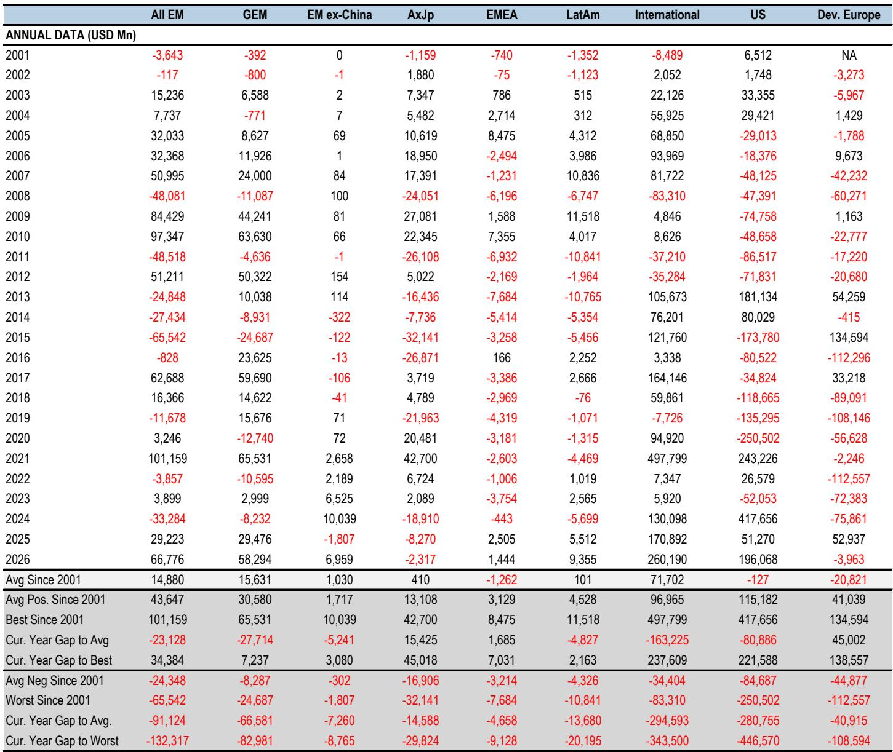
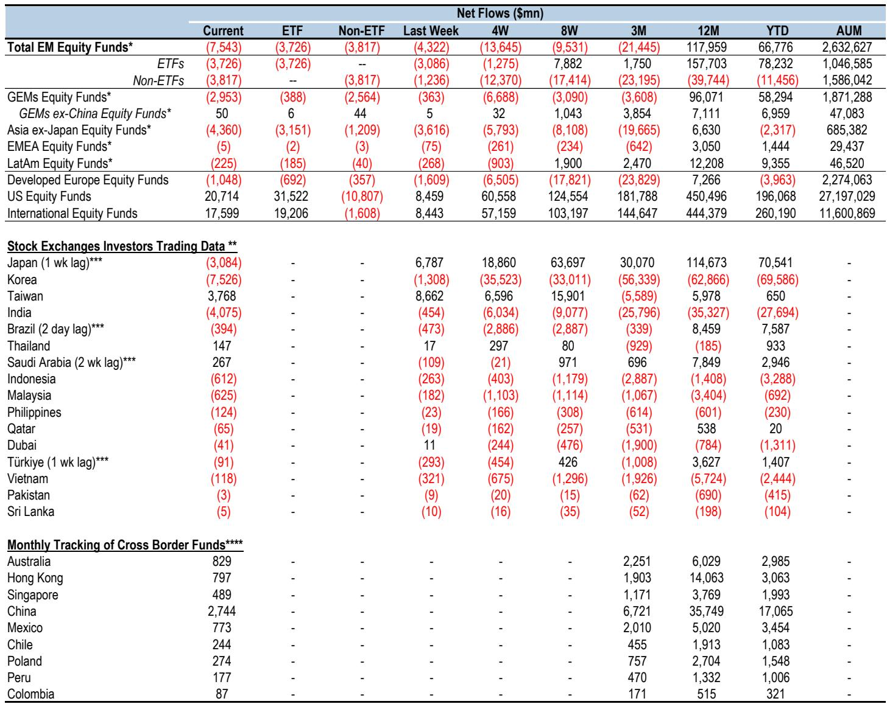
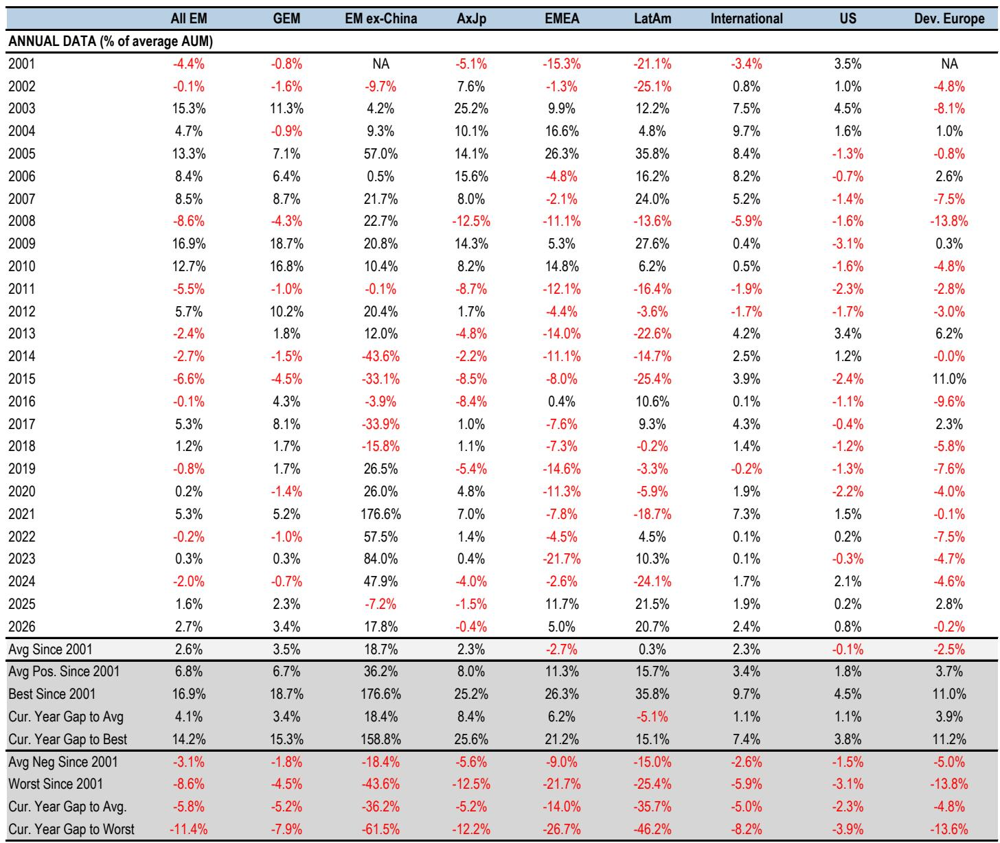

# 新兴市场资金外流正在从“局部撤退”演变为“全面撤离”

一周之内，新兴市场股票基金的资金外流从43亿美元骤升至75亿美元。这个数字本身已经足够引人注目，但真正值得关注的不是外流的规模，而是它的结构：此前几周还相对稳定的非ETF赎回，本周突然加速至38亿美元，而ETF的流出也同步扩大至37亿美元。这意味着什么？意味着此前市场普遍认为的“被动资金暂时离场、主动资金仍在观望”的格局正在被打破。两类资金正在形成共振，而共振的方向是出逃。

这份由某外资投行发布的资金流周报，提供了截至2026年6月3日的最新数据。报告的核心信号并不复杂：新兴市场的资金外流不仅在加深，而且在扩大。但如果我们只停留在“流出很多”这个层面，就错过了真正重要的判断——这一轮外流的结构性特征，正在改写我们对新兴市场资产定价的底层假设。

## 1. 主动与被动资金同步出逃，意味着“观望”阶段已经结束

此前几周，市场一度出现了一个看似积极的信号：非ETF（主动管理基金）的赎回速度在放缓。部分投资者将其解读为“聪明钱”正在逢低布局。但本周的数据彻底推翻了这个假设。非ETF赎回从上周的12亿美元猛增至38亿美元，创下近期新高。与此同时，ETF的流出也从31亿美元扩大到37亿美元。

这两类资金的同步放大，在逻辑上指向一个更值得警惕的判断：此前非ETF赎回的放缓并非主动管理人在“抄底”，而更可能是赎回指令的执行延迟或投资者在重新评估仓位。当新的负面信号出现后，这些延迟的赎回指令集中释放，造成了本周的加速。

从更长的周期来看，非ETF资金已经连续多年呈现净流出。2024年全年非ETF净流出54亿美元，2025年进一步扩大至61亿美元，而2026年至今虽然有所收窄至11亿美元，但本周的数据表明这一改善趋势可能逆转。这意味着，主动管理资金对新兴市场的配置意愿正在系统性下降，而非周期性的波动。

对于资产管理者而言，这个信号的实操含义是：不要将非ETF赎回放缓视为买入信号，除非你能确认其背后的原因是基本面改善，而非技术性因素。

## 2. 韩国和印度成为资金外流的两大“震中”，但驱动逻辑截然不同

本周数据中，有两个市场的外流数字格外刺眼：韩国流出75亿美元，印度流出41亿美元。但这两个市场的流出逻辑完全不同，对其后续走势的判断也需要区分对待。

韩国的流出已经持续了四周，累计达到376亿美元，年初至今的流出更是高达696亿美元。这已经不是短期情绪波动，而是系统性减配。报告没有完全展开讨论的是，韩国市场面临的不仅是全球资金避险情绪的影响，还有其自身产业结构调整的不确定性——半导体周期的位置、与中国供应链竞争的加剧、以及国内政治环境的波动，都在削弱其作为“全球科技供应链核心节点”的吸引力。

相比之下，印度本周41亿美元的流出更像是一个“累积效应”的爆发。印度市场在过去12个月累计流出353亿美元，但此前几周的单周流出量并不大（上周仅为4.5亿美元）。本周的急剧恶化，可能反映了两个因素：一是印度大选后政策预期的重新定价，二是估值过高后的获利了结压力。印度市场的估值溢价在很长一段时间内被“人口红利”和“改革预期”支撑，但当全球资本开始收缩风险敞口时，高估值市场往往首当其冲。

对投资者而言，区分这两个市场的流出性质很重要：韩国的流出可能更接近结构性，而印度的流出则可能更偏向周期性。但无论是哪种，短期内都不宜将其视为“抄底机会”。

## 3. 台湾是少数逆势流入的市场，但流入速度正在放缓

在几乎所有新兴市场都在失血的背景下，台湾连续第二周获得净流入，本周为38亿美元。但这个数字相比上周的87亿美元已经大幅缩水。报告没有明确解释放缓的原因，但我们可以从逻辑上做合理推断：台湾的吸引力主要来自其在全球AI和半导体供应链中的不可替代性。当全球科技股在2026年上半年经历了一轮估值扩张后，部分资金开始获利了结，这是流入放缓的合理解释。

但更值得关注的是，台湾的流入是否具有持续性。从更长周期来看，台湾过去12个月的累计流入仅为60亿美元，而年初至今的累计流入更是只有6.5亿美元。这意味着，台湾的吸引力并非来自“长期配置价值”，而更多是短期交易性资金的流入。一旦全球科技股出现调整，台湾市场可能从“避风港”迅速转变为“重灾区”。

这个判断对于持有台湾资产的投资者来说是一个重要的风险提示：不要将短期资金流入等同于长期基本面支撑。

## 4. 东盟市场全面失血，但报告尚未回答“谁是下一个”

本周另一个值得关注的现象是东盟市场的全面流出：马来西亚流出6.25亿美元，印尼流出6.12亿美元，菲律宾流出1.24亿美元。只有泰国获得了1.47亿美元的净流入，但规模太小，不足以改变整体格局。

东盟市场的流出逻辑相对清晰：这些经济体高度依赖外资，且出口结构与中国重叠度较高。在全球贸易格局重构的背景下，东盟国家面临着“两头挤压”——一方面是中国制造业升级带来的竞争压力，另一方面是发达国家“近岸外包”趋势下的订单分流。但报告没有完全展开的是，哪些东盟国家可能率先出现资金回流。

这里有一个值得投资者自行跟踪的观察框架：关注各国的经常账户余额和外汇储备变动。在资金外流的环境下，经常账户赤字且外汇储备薄弱的国家（如印尼）面临更大的汇率和资本流动压力，而经常账户盈余的国家（如泰国、马来西亚）则可能具备更强的缓冲能力。报告的数据显示，印尼和马来西亚的流出量接近，但两国的基本面差异较大，后续走势可能出现分化。

## 5. 全球资金仍在涌向美国，但“唯一选项”的格局正在形成

与新兴市场的全面流出形成鲜明对比的是，美国股票基金本周获得了207亿美元的净流入，年初至今累计流入已达1961亿美元。这个数字几乎等于全球所有其他市场的资金净流入之和。

这种“美国独大”的格局，对新兴市场意味着什么？报告没有直接回答，但我们可以从逻辑上推导出两个判断。第一，只要美国资产继续提供相对更高的回报和更低的风险，新兴市场就很难吸引到足够的增量资金。第二，当全球投资者将美国视为“唯一选项”时，新兴市场的估值折价可能会持续扩大，直到出现一个足够大的催化剂——比如美国经济衰退、或者新兴市场自身出现超预期的增长拐点。

对于配置新兴市场的投资者来说，当前最需要关注的不是“新兴市场什么时候反弹”，而是“什么条件才能让资金重新回流”。报告提供的数据表明，仅仅依靠估值便宜是不够的——新兴市场相对于发达市场的估值折价已经处于历史高位，但资金仍在流出。真正的拐点可能需要等待美国利率环境的明确转向，或者新兴市场内部出现一个足够有说服力的增长故事。

## 6. 报告尚未完全回答的关键问题：中国资金的“缺席”意味着什么

报告中最引人注目的一个数字，是“GEMs ex-China”基金的净流入仅为5000万美元，几乎可以忽略不计。与此同时，月度跨境资金追踪数据显示，中国在4月获得了27.44亿美元的净流入。

这两个数据放在一起，揭示了一个有趣的现象：全球资金对中国市场的态度正在出现分化。一方面，专注于全球新兴市场的基金（GEMs）在减配中国；另一方面，通过跨境渠道流入中国的资金却在增加。这种分化可能反映了不同投资者群体的不同逻辑：GEMs基金在整体减配新兴市场，中国作为新兴市场中权重最大的部分自然首当其冲；而跨境资金可能更多来自对中国资产有独立判断的长期投资者。

但报告没有回答的一个关键问题是：这种分化能否持续？如果全球资金继续从新兴市场整体撤离，中国能否依靠“独立资金”维持稳定？这个问题的答案，可能需要结合中国的经济基本面、政策走向以及中美关系的变化来综合判断。对于关注中国资产的投资者来说，这可能是当前最重要的未解问题。

---

以上讨论的每一个判断，都可以在原始报告中找到对应的数据支撑。但报告的价值远不止于此——它还提供了更细分的资金流向表格、更长时间的累计数据曲线，以及分析师对各个市场的深入解读。这些内容因为篇幅限制无法在这里一一展开。

如果你对这些未解问题感兴趣——比如韩国流出的结构性因素是否已经充分定价、印度估值调整的空间还有多大、东盟国家中谁最有可能率先出现资金回流——欢迎在我们的星球微信群里继续讨论。那里有完整的报告原文、更详细的数据表格，以及一群同样关注新兴市场的投资者，可以一起拆解这些复杂的问题。

Personal reading notes and learning share only. Not investment advice.

