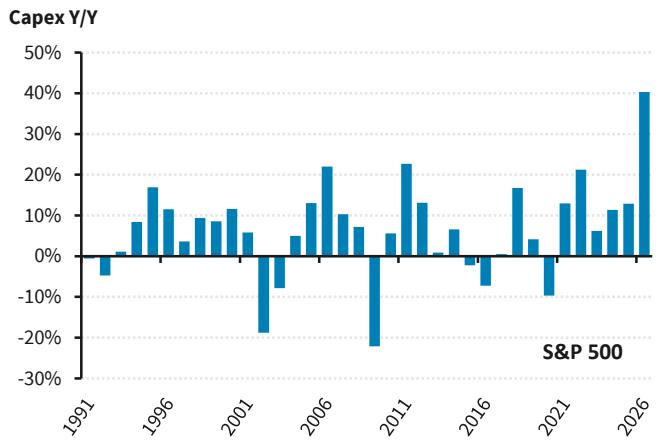
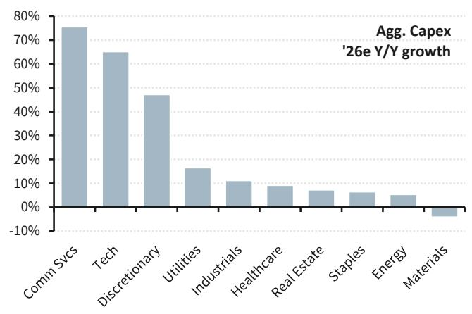
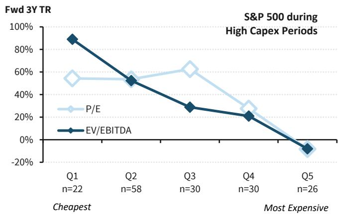
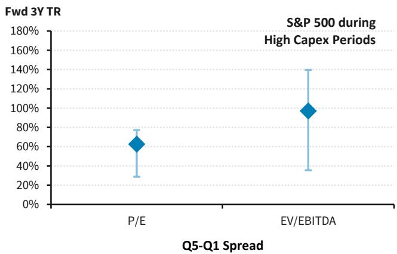
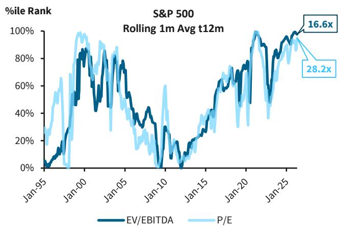
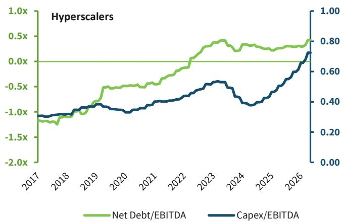

# U.S. Equity Insights

# Pricing a capex supercycle

As AI investment scales to levels rivaling the capex supercycles of the 1990s and 2000s, we highlight EV/EBITDA as a valuation metric that gains signal strength over P/E, when evaluating medium-term investment horizons that coincide with elevated capex.

THE 2026 EXTEL SURVEY IS NOW OPEN

# Support our industry-leading analysts with 5-Star votes in this year's Extel All-America Research Survey

Vote Now

View Analysts

The Extel survey is important to our team and to BARC! We would greatly appreciate your ★★★★★★ 5-star vote in the Equity-Linked Strategies and Portfolio Strategy categories.

# Key Points & Highlights

\- Capex finds another gear. Aggregate S&P 500 capex is projected to grow 40% Y/Y in 2026 and is on track to absorb roughly 50% of operating cash flows, levels that recall the supercycles of the 1990s and 2000s. Tech is dead center with TMT capex as a share of total S&P 500 capex projected to approach 50% this year, a step change even relative to the late-2010s public cloud buildout. History suggests that when capex intensity reaches these levels, even good investment can overshoot, raising the question of how much to pay for marginal return on invested capital.

# • EV/EBITDA gains signal strength over medium-term horizons when capex is elevated.

Over the last 30 years, EV/EBITDA exhibited a stronger linear relationship with S&P 500 forward 3Y total return (based on quintile sorting of the metric and cheap-expensive spread) when compared to P/E, during periods of high capex. This supports the intuitive framing that EV/EBITDA more closely reflects what investors are paying for the operating asset base, over an investment horizon that better aligns with a typical capex cycle.

BARC Capital Inc. and/or one of its affiliates does and seeks to do business with companies covered in its research reports. As a result, investors should be aware that the firm may have a conflict of interest that could affect the objectivity of this report. Investors should consider this report as only a single factor in making their investment decision.

# U.S. Equity Strategy

Venu Krishna, CFA

+1 212 526 7328

venu.krishna@BARC.com

BCI, US

# Rex Feng

+1 212 526 6114

rex.feng@BARC.com

BCI, US

# Riddhiman Dass

+1 212 526 0850

riddhiman.dass@BARC.com

BCI, US

Tianqi Feng

+1 212 526 9179

tianqi.feng@BARC.com

BCI, US

\- We remain constructive near-term. This valuation signal has limited timing power over shorter periods, and it's worth noting that currently-elevated EV/EBITDA is being shaped as much by the beneficiaries of AI capex as by the companies undertaking the spending itself. Meanwhile, the NTM earnings backdrop remains supportive, particularly within the broader Tech complex. Taken together, elevated capex and EV/EBITDA argue for investors with a multi-year horizon to look at entry points with greater selectivity, while the combination of rising EPS estimates and strong secular growth leaves the near-term setup constructive.

FIGURE 1. BARC 2026 Year-End Estimates for S&P 500 

<table><tr><td colspan="6">BARC S&amp;P 500 FY 2026 Estimates</td></tr><tr><td>Scenario</td><td>EPS</td><td>Growth (yoy)</td><td>PE Multiple</td><td>YE Value</td><td>Upside/Downside</td></tr><tr><td>Bull Case</td><td>$327</td><td>17.6%</td><td>25.1x</td><td>8,200</td><td>7.8%</td></tr><tr><td>Base Case</td><td>$321</td><td>15.5%</td><td>23.8x</td><td>7,650</td><td>0.5%</td></tr><tr><td>Bear Case</td><td>$311</td><td>11.9%</td><td>18.5x</td><td>5,900</td><td>-22.5%</td></tr><tr><td>Current S&amp;P 500 Price</td><td></td><td></td><td></td><td>7,610</td><td></td></tr></table>

As of 3 June 2026.   
Source: Bloomberg, BARC

# S&P 500 capex outlook vs. history

S&P 500 capex is on track to absorb roughly 50% of operating cash flows in 2026, a level that places this cycle squarely alongside prior capex supercycles like the mid-to-late 1990s telecom/internet buildout and the mid-2000s energy and housing investment boom. While the 1990s featured record equipment spending by telecom carriers and OEMs, and the mid-2000s cycle was broader and more industrial in nature, in both cases capex ultimately proved both productivity-enhancing and value-destructive, with long-dated payoffs that followed a period of painful consolidation.

FIGURE 2. S&P 500 capex is on track to absorb 50% of operating cash flow in 2026   

bar

Capex/OCF
| Year | Capex/OCF (%) |
| :--- | :--- |
| 1990 | 70 |
| 1991 | 75 |
| 1992 | 65 |
| 1993 | 64 |
| 1994 | 56 |
| 1995 | 57 |
| 1996 | 59 |
| 1997 | 57 |
| 1998 | 56 |
| 1999 | 51 |
| 2000 | 58 |
| 2001 | 60 |
| 2002 | 46 |
| 2003 | 34 |
| 2004 | 38 |
| 2005 | 44 |
| 2006 | 56 |
| 2007 | 63 |
| 2008 | 42 |
| 2009 | 34 |
| 2010 | 33 |
| 2011 | 34 |
| 2012 | 42 |
| 2013 | 35 |
| 2014 | 41 |
| 2015 | 39 |
| 2016 | 38 |
| 2017 | 36 |
| 2018 | 37 |
| 2019 | 38 |
| 2020 | 31 |
| 2021 | 36 |
| 2022 | 38 |
| 2023 | 41 |
| 2024 | 43 |
| 2025 | 51 |
S&P 500

Source: Bloomberg, BARC

FIGURE 3. Aggregate capex is projected to increase 40% Y/Y, the fastest pace in at least 35 years   

bar

| Year | Capex Y/Y |
|------|-----------|
| 1991 | -5%       |
| 1992 | 0%        |
| 1993 | 5%        |
| 1994 | 10%       |
| 1995 | 15%       |
| 1996 | 10%       |
| 1997 | 5%        |
| 1998 | 10%       |
| 1999 | 15%       |
| 2000 | 10%       |
| 2001 | 5%        |
| 2002 | -20%      |
| 2003 | -10%      |
| 2004 | -5%       |
| 2005 | 5%        |
| 2006 | 15%       |
| 2007 | 25%       |
| 2008 | 10%       |
| 2009 | 5%        |
| 2010 | -25%      |
| 2011 | -15%      |
| 2012 | 5%        |
| 2013 | 25%       |
| 2014 | 15%       |
| 2015 | 5%        |
| 2016 | -5%       |
| 2017 | -10%      |
| 2018 | -5%       |
| 2019 | 5%        |
| 2020 | 15%       |
| 2021 | -10%      |
| 2022 | 15%       |
| 2023 | 25%       |
| 2024 | 10%       |
| 2025 | 15%       |
| 2026 | 40%       |

Source: Bloomberg, BARC

What distinguishes the current cycle is not simply its scale, but its concentration. Aggregate S&P 500 capex is expected to grow roughly 40% Y/Y, the fastest pace in at least 35 years, yet the bulk of that growth is coming from Communication Services, Tech and Discretionary; effectively the AI hyperscalers, chipmakers, and their immediate supply chains. TMT capex as a share of total S&P 500 capex is projected to approach 50% this year, a step change even relative to the late-2010s public cloud buildout. History suggests that when capex intensity reaches these levels, even good investment can overshoot, raising the question of how much to pay for marginal return on invested capital.

FIGURE 4. Most of the Y/Y capex growth is coming from hyperscaler sectors   

bar

| Sector         | Growth Rate |
| -------------- | ----------- |
| Comm Svcs      | 75%         |
| Tech           | 65%         |
| Discretionary  | 48%         |
| Utilities      | 16%         |
| Industrials    | 11%         |
| Healthcare     | 9%          |
| Real Estate    | 7%          |
| Staples        | 6%          |
| Energy         | 5%          |
| Materials      | -3%         |

Source: Bloomberg, BARC

FIGURE 5. TMT capex as a share of total S&P 500 capex is projected to approach $50\%$ this year, an ATH   

bar

TMT capex/
Total S&P 500 capex
| Year | TMT capex (%) |
| :--- | :--- |
| 2007 | 12.5 |
| 2008 | 14.0 |
| 2009 | 16.0 |
| 2010 | 16.0 |
| 2011 | 16.0 |
| 2012 | 15.0 |
| 2013 | 15.0 |
| 2014 | 17.0 |
| 2015 | 18.0 |
| 2016 | 20.0 |
| 2017 | 21.0 |
| 2018 | 27.5 |
| 2019 | 28.5 |
| 2020 | 30.5 |
| 2021 | 30.0 |
| 2022 | 30.5 |
| 2023 | 28.0 |
| 2024 | 30.5 |
| 2025 | 39.0 |
| 2026 | 48.0 |

Source: Bloomberg, BARC

# EV/EBITDA as a check against P/E during elevated capex

When capex intensity rises, valuation signals can migrate up the income statement as P/E becomes vulnerable to nonlinear distortions from leverage, tax shields, and depreciation policies. EV/EBITDA has its own limitations but can be useful as a check against P/E, as it more directly reflects what investors are paying for the operating asset base. Given the multi-year timeline typical of a capex supercycle, EV/EBITDA can also align better with returns at a comparable horizon by focusing on enterprise-level metrics (including financing of the capex).

We find some empirical evidence to support this. During capex-heavy regimes since the mid-1990s, EV/EBITDA sorting exhibits a stronger relationship with medium-term returns, with forward 3Y S&P 500 total returns declining monotonically from the cheapest to the richest quintile. The same monotonicity breaks down for P/E, where mid-quintiles tend to outperform the tails, suggesting that P/E embeds cycle-specific convexities to a greater degree. Consistent with this, the cheap-expensive return spread delivered by EV/EBITDA sorting appears wider than P/E during these periods, which we believe supports EV/EBITDA as a more linear check on expected medium-term returns.

FIGURE 6. During high capex periods, EV/EBITDA exhibits a stronger linear relationship with forward 3Y total return compared to P/E   

line

| Quarter | P/E   | EV/EBITDA |
|---------|-------|-----------|
| Q1      | 55%   | 90%       |
| Q2      | 55%   | 50%       |
| Q3      | 65%   | 25%       |
| Q4      | 30%   | 20%       |
| Q5      | -5%   | -5%       |

"High capex" defined as t12m Capex/EBITDA above the 50th percentile of monthly observations (n) since 1995.   
Source: Bloomberg, BARC

FIGURE 7. EV/EBITDA sorting delivers larger cheap-expensive 3Y return spread than P/E during high capex periods   

scatter

| Metric     | Value |
|------------|-------|
| P/E        | 60%   |
| EV/EBITDA  | 100%  |

"High capex" defined as t12m Capex/EBITDA above the 50th percentile of monthly observations since 1995. Error bars = 95% CI.   
Source: Bloomberg, BARC

This framing matters for today because S&P 500 EV/EBITDA is currently more elevated than P/E, when compared to its own long-run history. As with past capex booms, today's massive spending on compute coincides with optimistic narratives about long-run growth, which can sustain high headline multiples even as worries about over-investment begin to rise. And while consensus estimates call for a deceleration in spending growth sometime in 2027 or 2028, elevated enterprise values leave less scope for multiple expansion once capex normalizes, placing the burden on future earnings to drive additional upside.

FIGURE 8. T12M EV/EBITDA is more elevated than P/E when compared to its own history   

line

| Date   | EV/EBITDA | P/E    |
|--------|-----------|--------|
| Jan-25 | 16.6x     | 28.2x  |

Data as of 31 May 2026.   
Source: Bloomberg, BARC

FIGURE 9. Hyperscalers are redeploying balance sheets as capex commitments rise   

line

| Year | Net Debt/EBITDA | Capex/EBITDA |
|------|-----------------|--------------|
| 2017 | -1.2x           | -1.0x        |
| 2018 | -1.0x           | -0.9x        |
| 2019 | -0.5x           | -0.8x        |
| 2020 | -0.3x           | -0.9x        |
| 2021 | -0.1x           | -0.7x        |
| 2022 | 0.1x            | -0.5x        |
| 2023 | 0.4x            | -0.3x        |
| 2024 | 0.3x            | -0.5x        |
| 2025 | 0.4x            | -0.3x        |
| 2026 | 0.5x            | 0.1x         |

Data as of 31 May 2026.   
Source: Bloomberg, BARC

# Matching valuation to investment horizon

This is not to say that we are taking a negative view on US equities over the next 12 months. We found the EV/EBITDA signal to be inherently medium-term in nature with limited timing power over shorter horizons, including one year or less, where the relationship with forward

returns was much less significant. Moreover, capex peaks tended to coincide with late-cycle dynamics historically, which are more consequential at multi-year horizons. Finally, we'd point out that currently elevated valuations are being shaped as much by the beneficiaries of AI capex (such as Tech Hardware, Capital Goods and Semis) as by the companies undertaking the spending itself.

The NTM earnings backdrop remains supportive, particularly within the broader Tech complex, and valuations have yet to retake recent median levels. Taken together, elevated capex and EV/EBITDA argue for investors with a multi-year horizon to look at entry points with greater selectivity, while the combination of rising EPS expectations, recent valuation trends and strong secular growth leaves the near-term setup constructive.

FIGURE 10. 10Y percentile rank of current EV/EBITDA, P/E and Capex/EBITDA by Industry Group   

bar

| Industry Group       | EV/EBITDA | P/E  | Capex/EBITDA |
|----------------------|-----------|------|--------------|
| Tech Hardware        | 100       | 100  | 10           |
| Cap Goods            | 98        | 98   | 20           |
| Autos                | 96        | 96   | 75           |
| Staples Dist.        | 90        | 92   | 90           |
| Media                | 86        | 72   | 75           |
| Semis                | 80        | 75   | 10           |
| Transport            | 76        | 77   | 10           |
| Utilities            | 63        | 28   | 55           |
| Materials            | 53        | 49   | 88           |
| Durables/Apparel     | 44        | 41   | 22           |
| Energy               | 44        | 32   | 45           |
| Software/Svcs        | 33        | 40   | 100          |
| Cons Svcs            | 35        | 14   | 12           |
| Prof Svcs            | 30        | 19   | 12           |
| Retail               | 20        | 5    | 78           |
| Telecom              | 13        | 20   | 12           |
| Food & Bev           | 20        | 29   | 88           |
| HCES                 | 17        | 5    | 12           |
| CHPC                 | 6         | 3    | 12           |

Source: Bloomberg, BARC

# Analyst(s) Certification(s):

We, Rex Feng, Venu Krishna, CFA and Riddhiman Dass, hereby certify (1) that the views expressed in this research report accurately reflect our personal views about any or all of the subject securities or issuers referred to in this research report and (2) no part of our compensation was, is or will be directly or indirectly related to the specific recommendations or views expressed in this research report.

# Important Disclosures:

BARC is produced by the Investment Bank of BARC Bank PLC and its affiliates (collectively and each individually, "BARC"). All authors contributing to this research report are Research Analysts unless otherwise indicated. The publication date at the top of the report reflects the local time where the report was produced and may differ from the release date provided in GMT.

# Availability of Disclosures:

Where any companies are the subject of this research report, for current important disclosures regarding those companies please refer to https://publicresearch.BARC.com or alternatively send a written request to: BARC Compliance, 745 Seventh Avenue, 13th Floor, New York, NY 10019 or call +1-212-526-1072.

The analysts responsible for preparing this research report have received compensation based upon various factors including the firm's total revenues, a portion of which is generated by investment banking activities, the profitability and revenues of the Markets business and the potential interest of the firm's investing clients in research with respect to the asset class covered by the analyst.

Research analysts employed outside the US by affiliates of BARC Capital Inc. are not registered/qualified as research analysts with FINRA. Such non-US research analysts may not be associated persons of BARC Capital Inc., which is a FINRA member, and therefore may not be subject to FINRA Rule 2241 restrictions on communications with a subject company, public appearances and trading securities held by a research analyst's account.

Analysts regularly conduct site visits to view the material operations of covered companies, but BARC policy prohibits them from accepting payment or reimbursement by any covered company of their travel expenses for such visits.

BARC Department produces various types of research including, but not limited to, fundamental analysis, equity-linked analysis, quantitative analysis, and trade ideas. Recommendations contained in one type of BARC may differ from those contained in other types of BARC, whether as a result of differing time horizons, methodologies, or otherwise.

In order to access BARC Statement regarding Research Dissemination Policies and Procedures, please refer to https://

publicresearch.BARC.com/S/RD.htm. In order to access BARC Conflict Management Policy Statement, please refer to: https://publicresearch.BARC.com/S/CM.htm.

# Other Material Conflicts

One or more of the authoring research analysts (and/or a member of the analyst's household) has long positions in index funds and/or ETFs that are designed to passively track the performance of the S&P 500, Euro Stoxx, FTSE 100, and/or Stoxx 600 Indices.

Unless otherwise indicated, prices are sourced from Bloomberg and reflect the closing price in the relevant trading market, which may not be the last available closing price at the time of publication.

# Risk Disclosure(s)

Master limited partnerships (MLPs) are pass-through entities structured as publicly listed partnerships. For tax purposes, distributions to MLP unit holders may be treated as a return of principal. Investors should consult their own tax advisors before investing in MLP units.

# Disclosure(s) regarding Information Sources

Bloomberg® is a trademark and service mark of Bloomberg Finance L.P. and its affiliates (collectively “Bloomberg”) and the Bloomberg Indices are trademarks of Bloomberg. Bloomberg or Bloomberg’s licensors own all proprietary rights in the Bloomberg Indices. Bloomberg does not approve or endorse this material, or guarantee the accuracy or completeness of any information herein, or make any warranty, express or implied, as to the results to be obtained therefrom and, to the maximum extent allowed by law, Bloomberg shall have no liability or responsibility for injury or damages arising in connection therewith.

# Explanation of the U.S. Equity Strategy sector rating system:

Positive Outlook: We recommend clients increase their level of portfolio exposure to the sector (as defined below)

Neutral Outlook: We recommend clients maintain their current level of portfolio exposure to the sector (as defined below)

Negative Outlook: We recommend clients decrease their level of portfolio exposure to the sector (as defined below)

# Sector Definitions:

Our custom sector definitions are derived from GICS sectors as follows:

No changes to GICS Level 1 for Energy, Consumer Staples, Industrials, Real Estate, Healthcare, Utilities, Materials, and Financials.

"Big Tech": Seven stocks - AAPL, AMZN, GOOG, GOOGL, META, MSFT, NVDA - have been removed from their corresponding GICS Level 1 sectors.

“Rest of Tech” is GICS Level 1 Information Technology with AAPL, MSFT, and NVDA excluded.

“Communication Services” is GICS Level 1 Communication Services with GOOG, GOOGL, and META excluded.

“Discretionary” is GICS Level 1 Consumer Discretionary with AMZN excluded.

# Guide to the BARC Fundamental Equity Research Rating System:

Our coverage analysts use a relative rating system in which they rate stocks as Overweight, Equal Weight or Underweight (see definitions below) relative to other companies covered by the analyst or a team of analysts that are deemed to be in the same industry (the "industry coverage universe").

In addition to the stock rating, we provide industry views which rate the outlook for the industry coverage universe as Positive, Neutral or Negative (see definitions below). A rating system using terms such as buy, hold and sell is not the equivalent of our rating system. Investors should carefully read the entire research report including the definitions of all ratings and not infer its contents from ratings alone.

# Stock Rating

Overweight - The stock is expected to outperform the unweighted expected total return of the industry coverage universe over a 12-month investment horizon.

Equal Weight - The stock is expected to perform in line with the unweighted expected total return of the industry coverage universe over a 12-month investment horizon.

Underweight - The stock is expected to underperform the unweighted expected total return of the industry coverage universe over a 12-month investment horizon.

Rating Suspended - The rating and target price have been suspended temporarily due to market events that made coverage impracticable or to comply with applicable regulations and/or firm policies in certain circumstances including where the Investment Bank of BARC Bank PLC is acting in an advisory capacity in a merger or strategic transaction involving the company.

# Industry View

Positive - industry coverage universe fundamentals/valuations are improving.

Neutral - industry coverage universe fundamentals/valuations are steady, neither improving nor deteriorating.

Negative - industry coverage universe fundamentals/valuations are deteriorating.

# Types of investment recommendations produced by BARC Equity Research:

In addition to any ratings assigned under BARC' formal rating systems, this publication may contain investment recommendations in the form of trade ideas, thematic screens, scorecards or portfolio recommendations that have been produced by analysts within Equity Research. Any such investment recommendations shall remain open until they are subsequently amended, rebalanced or closed in a future research report.

BARC may also re-distribute equity research reports produced by third-party research providers that contain recommendations that differ from and/or conflict with those published by BARC' Equity Research Department.

# Disclosure of other investment recommendations produced by BARC Equity Research:

BARC Equity Research may have published other investment recommendations in respect of the same securities/instruments recommended in this research report during the preceding 12 months. To view all investment recommendations published by BARC Equity Research in the preceding 12 months please refer to https://live.barcap.com/go/research/Recommendations.

# Legal entities involved in producing BARC:

BARC Bank PLC (BARC, UK)

BARC Capital Inc. (BCI, US)

BARC Bank Ireland PLC, Frankfurt Branch (BBI, Frankfurt)

BARC Bank Ireland PLC, Paris Branch (BBI, Paris)

BARC Bank Ireland PLC, Milan Branch (BBI, Milan)

BARC Securities Japan Limited (BSJL, Japan)

BARC Bank PLC, Hong Kong Branch (BARC Bank, Hong Kong)

BARC Bank Mexico, S.A. (BBMX, Mexico)

BARC Capital Casa de Bolsa, S.A. de C.V. (BCCB, Mexico)

BARC Securities (India) Private Limited (BSIPL, India)

BARC Bank PLC, Singapore Branch (BARC Bank, Singapore)

BARC Bank PLC, DIFC Branch (BARC Bank, DIFC)

# Disclaimer:

This publication has been produced by BARC Department in the Investment Bank of BARC Bank PLC and/or one or more of its affiliates (collectively and each individually, "BARC").

It has been prepared for institutional investors and not for retail investors. It has been distributed by one or more BARC affiliated legal entities listed below or by an independent and non-affiliated third-party entity (as may be communicated to you by such third-party entity in its communications with you). It is provided for information purposes only, and BARC makes no express or implied warranties, and expressly disclaims all warranties of merchantability or fitness for a particular purpose or use with respect to any data included in this publication. To the extent that this publication states on the front page that it is intended for institutional investors and is not subject to all of the independence and disclosure standards applicable to debt research reports prepared for retail investors under U.S. FINRA Rule 2242, it is an “institutional debt research report” and distribution to retail investors is strictly prohibited. BARC also distributes such institutional debt research reports to various issuers, media, regulatory and academic organisations for their own internal informational news gathering, regulatory or academic purposes and not for the purpose of making investment decisions regarding any debt securities. Media organisations are prohibited from re-publishing any opinion or recommendation concerning a debt issuer or debt security contained in any BARC institutional debt research report. Any such recipients that do not want to continue receiving BARC institutional debt research reports should contact debtresearch@BARC.com. Unless clients have agreed to receive “institutional debt research reports” as required by US FINRA Rule 2242, they will not receive any such reports that may be co-authored by non-debt research analysts. Eligible clients may get access to such cross asset reports by contacting debtresearch@BARC.com. BARC will not treat unauthorized recipients of this

report as its clients and accepts no liability for use by them of the contents which may not be suitable for their personal use. Prices shown are indicative and BARC is not offering to buy or sell or soliciting offers to buy or sell any financial instrument.

Without limiting any of the foregoing and to the extent permitted by law, in no event shall BARC, nor any affiliate, nor any of their respective officers, directors, partners, or employees have any liability for (a) any special, punitive, indirect, or consequential damages; or (b) any lost profits, lost revenue, loss of anticipated savings or loss of opportunity or other financial loss, even if notified of the possibility of such damages, arising from any use of this publication or its contents.

Other than disclosures relating to BARC, the information contained in this publication (including third-party data) has been obtained from sources that BARC believes to be reliable, but BARC does not represent or warrant that it is accurate or complete. Third-party data, including third-party forecasts and predictions, is provided for information purposes only, has not been adopted or endorsed by BARC, and does not represent the views or opinions of BARC. Presentations by Third-Party Speakers: Any views or opinions expressed by third-party speakers during a BARC-hosted event are solely those of the speaker and do not represent the views or opinions of BARC. BARC is not responsible for, and makes no warranties whatsoever as to, the information or opinions contained in any written, electronic, audio or video presentations by any third-party speakers, and such presentations have not been adopted or endorsed by BARC and do not represent the views or opinions of BARC. Content from third-party presentations is provided for information purposes only and has not been independently verified by BARC for its accuracy or completeness.

The views in this publication are solely and exclusively those of the authoring analyst(s) and are subject to change, and BARC has no obligation to update its opinions or the information in this publication. Unless otherwise disclosed herein, the analysts who authored this report have not received any compensation from the subject companies in the past 12 months. If this publication contains recommendations, they are general recommendations that were prepared independently of any other interests, including those of BARC and/or its affiliates, and/or the subject companies. This publication does not contain personal investment recommendations or investment advice or take into account the individual financial circumstances or investment objectives of the clients who receive it. BARC is not a fiduciary to any recipient of this publication. The securities and other investments discussed herein may not be suitable for all investors and may not be available for purchase in all jurisdictions. The United States imposed sanctions on certain Chinese companies (https://ofac.treasury.gov/sanctions-programs-and-country-information/chinese-military-companies-sanctions), which may restrict U.S. persons from purchasing securities issued by those companies. Investors must independently evaluate the merits and risks of the investments discussed herein, including any sanctions restrictions that may apply, consult any independent advisors they believe necessary, and exercise independent judgment with regard to any investment decision. The value of and income from any investment may fluctuate from day to day as a result of changes in relevant economic markets (including changes in market liquidity). The information herein is not intended to predict actual results, which may differ substantially from those reflected. Past performance is not necessarily indicative of future results. The information provided does not constitute a financial benchmark and should not be used as a submission or contribution of input data for the purposes of determining a financial benchmark.

This publication is not investment company sales literature as defined by Section 270.24(b) of the US Investment Company Act of 1940, nor is it intended to constitute an offer, promotion or recommendation of, and should not be viewed as marketing (including, without limitation, for the purposes of the UK Alternative Investment Fund Managers Regulations 2013 (SI 2013/1773) or AIFMD (Directive 2011/61)) or pre-marketing (including, without limitation, for the purposes of Directive (EU) 2019/1160) of the securities, products or issuers that are the subject of this report.

Third Party Distribution: Any views expressed in this communication are solely those of BARC and have not been adopted or endorsed by any third party distributor.

United Kingdom: This document is being distributed (1) only by or with the approval of an authorised person (BARC Bank PLC) or (2) to, and is directed at (a) persons in the United Kingdom having professional experience in matters relating to investments and who fall within the definition of "investment professionals" in Article 19(5) of the Financial Services and Markets Act 2000 (Financial Promotion) Order 2005 (the "Order"); or (b) high net worth companies, unincorporated associations and partnerships and trustees of high value trusts as described in Article 49(2) of the Order; or (c) other persons to whom it may otherwise lawfully be communicated (all such persons being "Relevant Persons"). Any investment or investment activity to which this communication relates is only available to and will only be engaged in with Relevant Persons. Any other persons who receive this communication should not rely on or act upon it. BARC Bank PLC is authorised by the Prudential Regulation Authority and regulated by the Financial Conduct Authority and the Prudential Regulation Authority and is a member of the London Stock Exchange.

European Economic Area (“EEA”): This material is being distributed to any “Authorised User” located in a Restricted EEA Country by BARC Bank Ireland PLC. The Restricted EEA Countries are Austria, Bulgaria, Estonia, Finland, Hungary, Iceland, Liechtenstein, Lithuania, Luxembourg, Malta, Portugal, Romania, Slovakia and Slovenia. For any other “Authorised User” located in a country of the European Economic Area, this material is being distributed by BARC Bank PLC. BARC Bank Ireland PLC is a bank authorised by the Central Bank of Ireland whose registered office is at 1 Molesworth Street, Dublin 2, Ireland. BARC Bank PLC is not registered in France with the Autorité des marchés financiers or the Autorité de contrôle prudentiel. Authorised User means each individual associated with the Client who is notified by the Client to BARC and authorised to use the Research Services. The Restricted EEA Countries will be amended if required.

Finland: Notwithstanding Finland's status as a Restricted EEA Country, Research Services may also be provided by BARC Bank PLC where permitted by the terms of its cross-border license.

Americas: The Investment Bank of BARC Bank PLC undertakes U.S. securities business in the name of its wholly owned subsidiary BARC Capital Inc., a FINRA and SIPC member. BARC Capital Inc., a U.S. registered broker/dealer, is distributing this material in the United States and, in connection therewith accepts responsibility for its contents. Any U.S. person wishing to effect a transaction in any security discussed herein should do so only by contacting a representative of BARC Capital Inc. in the U.S. at 745 Seventh Avenue, New York, New York 10019.

Non-U.S. persons should contact and execute transactions through a BARC Bank PLC branch or affiliate in their home jurisdiction unless local regulations permit otherwise.

This material is distributed in Canada by BARC Capital Canada Inc., a registered investment dealer, a Dealer Member of Canadian Investment Regulatory Organization (www.ciro.ca), and a Member of the Canadian Investor Protection Fund (CIPF).

This material is distributed in Mexico by BARC Bank Mexico, S.A. and/or BARC Capital Casa de Bolsa, S.A. de C.V. This material is distributed in the Cayman Islands and in the Bahamas by BARC Capital Inc., which it is not licensed or registered to conduct and does not conduct business in, from or within those jurisdictions and has not filed this material with any regulatory body in those jurisdictions.

Japan: This material is being distributed to institutional investors in Japan by BARC Securities Japan Limited. BARC Securities Japan Limited is a joint-stock company incorporated in Japan with registered office of 6-10-1 Roppongi, Minato-ku, Tokyo 106-6131, Japan. It is a subsidiary of BARC Bank PLC and a registered financial instruments firm regulated by the Financial Services Agency of Japan. Registered Number: Kanto Zaimukyokucho (kinsho) No. 143.

Asia Pacific (excluding Japan): BARC Bank PLC, Hong Kong Branch is distributing this material in Hong Kong as an authorised institution regulated by the Hong Kong Monetary Authority. Registered Office: 41/F, Cheung Kong Center, 2 Queen's Road Central, Hong Kong.

All Indian securities-related research and other equity research produced by BARC' Investment Bank are distributed in India by BARC Securities (India) Private Limited (BSIPL). BSIPL is a company incorporated under the Companies Act, 1956 having CIN U67120MH2006PTC161063. BSIPL is registered and regulated by the Securities and Exchange Board of India (SEBI) as a Research Analyst: INH000001519; Portfolio Manager INP000002585; Stock Broker INZ000269539 (member of NSE and BSE); Depository Participant with the National Securities & Depositories Limited (NSDL): DP ID: IN-DP-NSDL-478-2020; Investment Adviser: INA000000391. BSIPL is also registered as a Mutual Fund Advisor having AMFI ARN No. 53308. The registered office of BSIPL is at Nirlon Knowledge Park, 9th floor, Block B-6, Off. Western Express Highway, Goregaon (East), Mumbai – 400063, India. Telephone No: +91 22 61754000 Fax number: +91 22 61754099. Any other reports produced by BARC' Investment Bank are distributed in India by BARC Bank PLC, India Branch, an associate of BSIPL in India that is registered with Reserve Bank of India (RBI) as a Banking Company under the provisions of The Banking Regulation Act, 1949 (Regn No BOM43) and registered with SEBI as Merchant Banker (Regn No INM000002129) and also as Banker to the Issue (Regn No INBI00000950). BARC Investments and Loans (India) Limited, registered with RBI as Non Banking Financial Company (Regn No RBI CoR-07-00258), and BARC Wealth Trustees (India) Private Limited, registered with Registrar of Companies (CIN U93000MH2008PTC188438), are associates of BSIPL in India that are not authorised to distribute any reports produced by BARC' Investment Bank.

This material is distributed in Singapore by the Singapore Branch of BARC Bank PLC, a bank licensed in Singapore by the Monetary Authority of Singapore. For matters in connection with this material, recipients in Singapore may contact the Singapore branch of BARC Bank PLC, whose registered address is 10 Marina Boulevard, #23-01 Marina Bay Financial Centre Tower 2, Singapore 018983.

This material, where distributed to persons in Australia, is produced or provided by BARC Bank PLC.

This communication is directed at persons who are a “Wholesale Client” as defined by the Australian Corporations Act 2001.

Please note that the Australian Securities and Investments Commission (ASIC) has provided certain exemptions to BARC Bank PLC (BBPLC) under paragraph 911A(2)(I) of the Corporations Act 2001 from the requirement to hold an Australian financial services licence (AFSL) in respect of financial services provided to Australian Wholesale Clients, on the basis that BBPLC is authorised by the Prudential Regulation Authority of the United Kingdom (PRA) and regulated by the Financial Conduct Authority (FCA) of the United Kingdom and the PRA under United Kingdom laws. The United Kingdom has laws which differ from Australian laws. To the extent that this communication involves the provision of financial services by BBPLC to Australian Wholesale Clients, BBPLC relies on the relevant exemption from the requirement to hold an AFSL. Accordingly, BBPLC does not hold an AFSL.

This communication may be distributed to you by either: (i) BARC Bank PLC directly, (ii) Barrenjoey Markets Pty Limited (ACN 636 976 059, "Barrenjoey"), the holder of Australian Financial Services Licence (AFSL) 521800, a non-affiliated third party distributor, where clearly identified to you by Barrenjoey. Barrenjoey is not an agent of BARC Bank PLC or (iii) such other non-affiliated third-party distributor(s) as may be clearly identified to you. Such non-affiliated third-party distributor(s) are not agents of BARC Bank PLC.

This material, where distributed in New Zealand, is produced or provided by BARC Bank PLC. BARC Bank PLC is not registered, filed with or approved by any New Zealand regulatory authority. This material is not provided under or in accordance with the Financial Markets Conduct Act of 2013 (“FMCA”), and is not a disclosure document or “financial advice” under the FMCA. This material is distributed to you by either: (i) BARC Bank PLC directly or (ii) Barrenjoey Markets Pty Limited (“Barrenjoey”), a non-affiliated third party distributor, where clearly identified to you by Barrenjoey. Barrenjoey is not an agent of BARC Bank PLC. This material may only be distributed to “wholesale investors” that meet the “investment business”, “investment activity”, “large”, or “government agency” criteria specified in Schedule 1 of the FMCA.

Middle East: Nothing herein should be considered investment advice as defined in the Israeli Regulation of Investment Advisory, Investment Marketing and Portfolio Management Law, 1995 (“Advisory Law”). This document is being made to eligible clients (as defined under the Advisory Law) only. BARC Israeli branch previously held an investment marketing license with the Israel Securities Authority but it cancelled such license on 30/11/2014 as it solely provides its services to eligible clients pursuant to available exemptions under the Advisory Law, therefore a license with the Israel Securities Authority is not required. Accordingly, BARC does not maintain an insurance coverage pursuant to the Advisory Law.

This material is distributed in the United Arab Emirates (including the Dubai International Financial Centre) and Qatar by BARC Bank PLC. BARC Bank PLC in the Dubai International Financial Centre (Registered No. 0060) is regulated by the Dubai Financial Services Authority (DFSA). Principal place of business in the Dubai International Financial Centre: The Gate Village, Building 4, Level 4, PO Box 506504, Dubai, United Arab Emirates. BARC Bank PLC-DIFC Branch, may only undertake the financial services activities that fall within the scope of its existing DFSA licence. Related financial products or services are only available to Professional Clients, as defined by the Dubai Financial Services Authority. BARC Bank PLC in the UAE is regulated by the Central Bank of the UAE and is licensed to conduct business activities as a branch of a commercial bank incorporated outside the UAE in Dubai (Licence No.: 13/1844/2008, Registered Office: Building No. 6, Burj Dubai Business Hub, Sheikh Zayed Road, Dubai City) and Abu Dhabi (Licence No.: 13/952/2008, Registered Office: Al Jazira Towers, Hamdan Street, PO Box 2734, Abu Dhabi). This material does not constitute or form part of any offer to issue or sell, or any solicitation of any offer to subscribe for or purchase, any securities or investment products in the UAE (including the Dubai International Financial Centre) and accordingly should not be construed as such. Furthermore, this information is being made available on the basis that the recipient acknowledges and understands that the entities and securities to which it may relate have not been approved, licensed by or registered with the UAE Central Bank, the Dubai Financial Services Authority or any other relevant licensing authority or governmental agency in the UAE. The content of this report has not been approved by or filed with the UAE Central Bank or Dubai Financial Services Authority. BARC Bank PLC in the Qatar Financial Centre (Registered No. 00018) is authorised by the Qatar Financial Centre Regulatory Authority (QFCRA). BARC Bank PLC-QFC Branch may only undertake the regulated activities that fall within the scope of its existing QFCRA licence. Principal place of business in Qatar: Qatar Financial Centre, Office 1002, 10th Floor, QFC Tower, Diplomatic Area, West Bay, PO Box 15891, Doha, Qatar. Related financial products or services are only available to Business Customers as defined by the Qatar Financial Centre Regulatory Authority.

Russia: This material is not intended for investors who are not Qualified Investors according to the laws of the Russian Federation as it might contain information about or description of the features of financial instruments not admitted for public offering and/or circulation in the Russian Federation and thus not eligible for non-Qualified Investors. If you are not a Qualified Investor according to the laws of the Russian Federation, please dispose of any copy of this material in your possession.

Sustainable Investing Related Research: There is currently no globally accepted framework or definition (legal, regulatory or otherwise) of, nor market consensus as to what constitutes a ‘sustainable’, ‘ESG’, ‘green’, ‘climate-friendly’ or an equivalent company, investment, strategy or consideration or what precise attributes are required to be eligible to be categorised by such terms. This means there are different ways to evaluate a company or an investment and so different values may be placed on certain sustainability credentials as well as adverse ESG-related impacts of companies and ESG controversies. The evolving nature of sustainable investing considerations, models and methodologies means it can be challenging to definitively and universally classify a company or investment under a sustainable investing label and there may be areas where such companies and investments could improve or where adverse ESG-related impacts or ESG controversies exist. The evolving nature of sustainable finance related regulations and the development of jurisdiction-specific regulatory criteria also means that there is likely to be a degree of divergence as to the interpretation of such terms in the market. We expect industry guidance, market practice, and regulations in this field to continue to evolve.

Any information, data, image, or other content including from a third party source contained, referred to herein or used for whatsoever purpose by BARC or a third party (“Information”), in relation to any actual or potential ‘ESG’, ‘sustainable’ or equivalent objective, issue, factor or consideration is not intended to be relied upon for ESG or sustainability classification, regulatory regime or industry initiative purposes (“ESG Regimes”), unless otherwise stated. Nothing in these materials, including any images included therein, is intended to convey, suggest or indicate that BARC considers or represents any product, service, person or body mentioned in these materials as meeting or qualifying for any ESG or sustainability classification, label or similar standards that may exist under ESG Regimes. BARC has not conducted any assessment of compliance with ESG Regimes. Parties are reminded to make their own assessments for these purposes.

IRS Circular 230 Prepared Materials Disclaimer: BARC does not provide tax advice and nothing contained herein should be construed to be tax advice. Please be advised that any discussion of U.S. tax matters contained herein (including any attachments) (i) is not intended or written to be used, and cannot be used, by you for the purpose of avoiding U.S. tax-related penalties; and (ii) was written to support the promotion or marketing of the transactions or other matters addressed herein. Accordingly, you should seek advice based on your particular circumstances from an independent tax advisor.

© Copyright BARC Bank PLC (2026). All rights reserved. No part of this publication may be reproduced or redistributed in any manner without the prior written permission of BARC. BARC Bank PLC is registered in England No. 1026167. Registered office 1 Churchill Place, London, E14 5HP. Additional information regarding this publication will be furnished upon request.