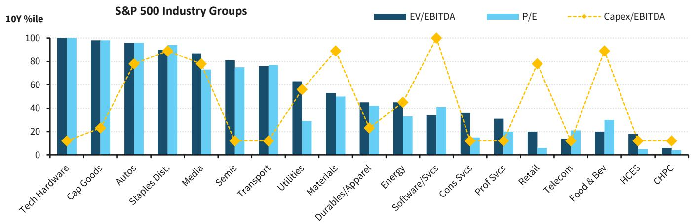
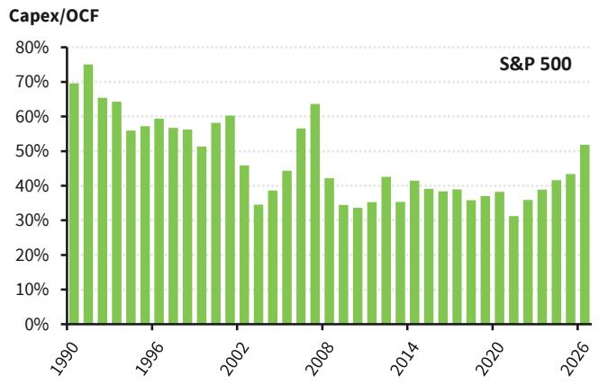
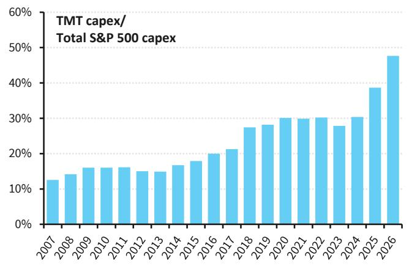

# 市场真正低估的不是AI需求，而是资本开支周期对估值框架的重构

当S&P 500的资本开支预计在2026年同比增长40%，并消耗约50%的经营现金流时，投资者面临的核心问题已经不是“AI是否真实”，而是“我们正在用什么尺子来定价这个周期”。某外资投行最新发布的美国权益策略研报提出了一个在当下极具操作意义的判断：在资本开支超级周期中，EV/EBITDA比P/E更能揭示未来三年的回报信号。这一结论的深意在于，它挑战了市场当前对科技巨头估值的主流叙事，并指向一个被大多数人忽略的结构性变化——资本开支的集中度和持续性，正在重塑估值框架的有效性。

这份研报并非简单地看多或看空美国股市。它在近12个月内维持建设性立场，但明确提出，对于持有期超过三年的投资者，当前需要更高的选股门槛。这不是一个短期择时信号，而是一个关于估值工具选择与投资期限匹配的框架性建议。理解这一框架，比猜测下一季度的EPS更为重要。

## 1. 资本开支超级周期已经启动，但它的集中度前所未有

研报数据显示，S&P 500总体资本开支在2026年预计同比增长40%，这是至少35年来的最快增速。这一水平，在历史上仅能与1990年代中后期的电信/互联网建设周期以及2000年代中期的能源和房地产投资热潮相提并论。但当前周期有一个关键区别：增长的来源极度集中。

通信服务、科技和非必需消费品——本质上就是AI超大规模企业、芯片制造商及其直接供应链——贡献了绝大部分增量。TMT行业的资本开支占S&P 500总资本开支的比例，预计2026年将接近50%。这是一个历史性的跳跃，甚至相对于2010年代末的公有云建设时期而言，都是质的飞跃。

这意味着什么？历史上，当资本开支强度达到这一水平时，即使是好的投资也可能过度。1990年代的电信设备投资最终被证明既提升了生产力，也造成了价值毁灭，其后是痛苦的行业整合。当前周期的集中度更高，意味着一旦需求预期发生变化，调整的冲击也将更加集中。对于投资者而言，这提出了一个根本性问题：我们愿意为边际投入资本回报率支付多高的价格？

## 2. EV/EBITDA在资本开支高峰期为何比P/E更有效——一个基于30年数据的实证

研报的核心贡献之一，是提供了过去30年间EV/EBITDA与P/E在不同资本开支环境下的表现对比。结论清晰且具有操作意义：在资本开支密集期，EV/EBITDA的排序与未来三年S&P 500总回报之间，呈现出更强的线性关系。而P/E的单调性则被打破，中间分位数组的表现往往优于两端，表明P/E在此类周期中嵌入了更多的非线性扭曲。

这一发现并不反直觉。当企业大规模投资时，折旧、税收盾牌和杠杆结构会对净利润产生非线性影响，从而扭曲P/E的信号。EV/EBITDA则更直接地反映投资者为经营性资产基础支付的价格，且其企业价值口径天然包含了为资本开支融资的成本。因此，在一个典型周期长度为3-5年的资本开支超级周期中，EV/EBITDA提供了一个更干净的估值锚。

研报的实证显示，在资本开支密集期，基于EV/EBITDA分组的“便宜-昂贵”回报价差，比P/E分组宽出约40个百分点。这一差异在统计上是显著的，并且对于任何以中期为投资期限的决策者而言，都构成了一个不可忽视的警示信号。

## 3. 当前估值水平下，EV/EBITDA与P/E的背离正在发出警告

研报指出，S&P 500当前的EV/EBITDA相对于其自身历史，比P/E更为“昂贵”。这一背离本身就是一个信号。当企业价值被推高到历史高位，而净利润倍数尚未达到极端水平时，往往意味着市场正在为未来的增长和资产回报支付溢价，但尚未充分定价当前资本开支对自由现金流的消耗。

值得注意的是，当前高企的EV/EBITDA并非由资本开支的承担者单独驱动。研报的数据显示，技术硬件、资本品和半导体等AI资本开支的受益者，其EV/EBITDA和P/E均处于历史高位。这意味着，估值泡沫的风险不仅存在于“烧钱”的一方，也存在于“卖铲子”的一方。如果资本开支周期出现预期外的放缓，受益者的估值回调可能同样剧烈。

对于持有期较短的投资者来说，这一信号的实际意义有限。研报明确承认，EV/EBITDA的信号在一年以内的短周期中并不显著。但对于那些以3-5年为期配置资产的管理人而言，当前EV/EBITDA的高位意味着，未来回报的驱动力必须更多地依赖盈利增长，而非估值扩张。一旦资本开支正常化，企业价值面临的下行压力将大于净利润。

## 4. 报告尚未完全回答的关键问题：资本开支的回报拐点何时到来

尽管研报提供了有力的分析框架，但它也留下了一个关键问题：如何判断资本开支的边际回报何时开始恶化？历史经验表明，资本开支超级周期往往以投资过度和随后的回报率下降告终。但当前周期的特殊性在于，AI基础设施的投资回报可能具有更长的滞后性，且回报的分布高度不均。

研报并未给出一个明确的“拐点”指标。它提到了共识预期认为资本开支增速将在2027或2028年放缓，但并未深入探讨这一放缓是否会导致ROIC的修复，还是进一步暴露过度投资。对于读者而言，这是一个值得持续跟踪的变量。如果未来几个季度，超大规模企业的资本开支效率（如每单位资本开支带来的收入或利润增量）开始下降，那么当前EV/EBITDA的高估将面临更直接的挑战。

此外，研报对于EV/EBITDA信号在行业层面的应用着墨不多。虽然它提供了行业组的估值百分位排名，但并未详细拆解，在不同行业内部，这一信号的有效性是否存在差异。例如，对于资本开支强度本身较低的行业，EV/EBITDA的参考意义可能有限。这些未解之处，恰恰是深入阅读完整报告、并与分析师进行讨论的价值所在。

## 5. 投资者的观察框架：用EV/EBITDA作为中期估值锚，但不要忽视期限匹配

基于上述分析，我们可以提炼出一个可供直接使用的观察框架。首先，对于任何持有期超过两年的投资决策，应将EV/EBITDA作为与P/E并列的核心估值工具，甚至在当前环境下，赋予前者更高的权重。其次，应关注资本开支强度（Capex/EBITDA或Capex/OCF）的变化趋势，而非仅仅看绝对金额。当这一比率从高位开始回落时，才是EV/EBITDA回归均值的有力信号。

第三，需要区分“资本开支的承担者”和“资本开支的受益者”。两者的估值逻辑不同，前者面临回报率的不确定性，后者则面临需求预期的变化。研报的数据显示，当前两者的估值均处于高位，这意味着系统性风险并未被充分定价。

最后，也是最重要的一点：不要用短期择时的思维来理解这一框架。EV/EBITDA的信号是中期性的，它不会告诉你下个月市场是涨是跌，但它会告诉你，在当前的估值水平下，未来三年的预期回报率可能低于历史均值。对于资产配置者而言，这意味著需要调整风险预算，而非清仓离场。

---

以上分析基于某外资投行的研报核心逻辑。报告中还包含了更多关于行业组估值百分位的详细图表，以及对于不同情景下S&P 500目标价的测算。这些数据对于理解当前市场的分化程度至关重要。如果你希望进一步探讨AI资本开支周期的回报拐点，或者想看到完整报告中关于行业层面EV/EBITDA信号的详细拆解，欢迎来星球微信群里继续讨论。

Personal reading notes and learning share only. Not investment advice.

