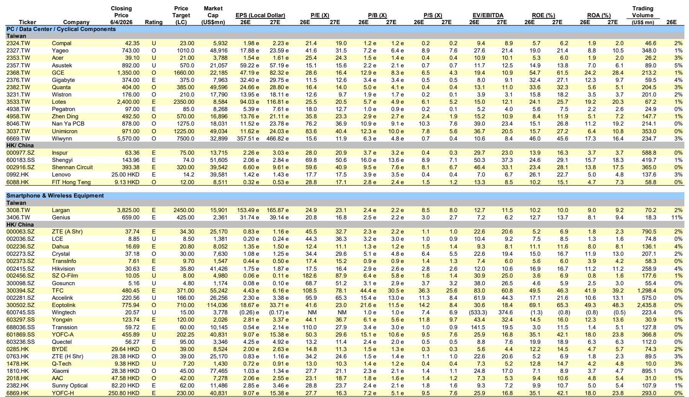
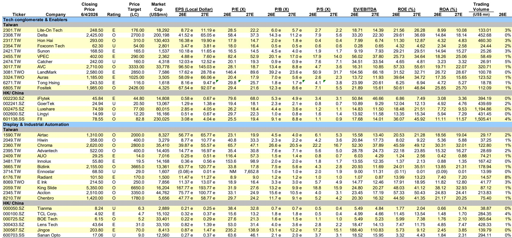
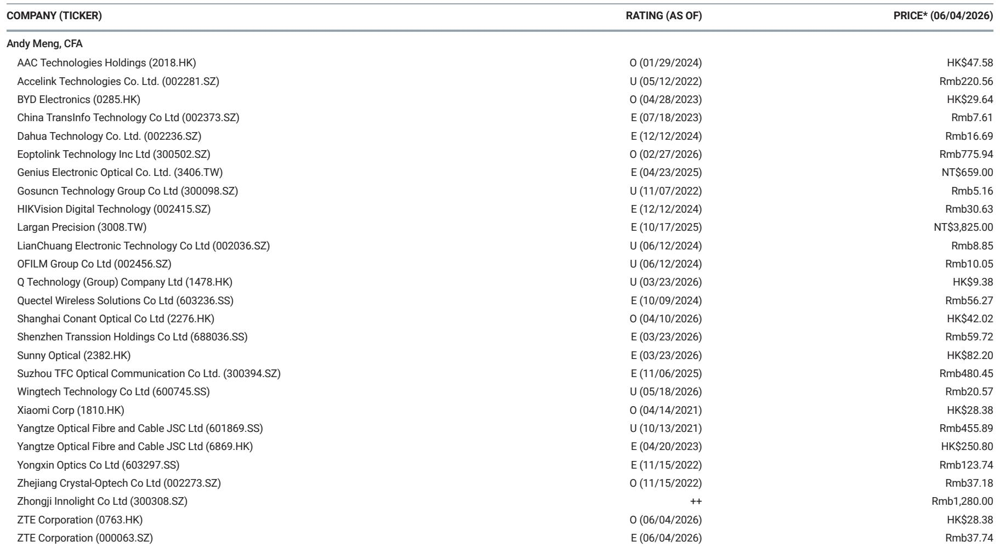

# AI投资叙事尚未到顶，真正稀缺的是“从GPU到机柜”的全栈受益者

市场对AI硬件投资的讨论已经从“需求会不会放缓”演变为“哪些环节还能超预期”。某外资投行最新发布的亚太科技硬件投资者报告给出了一个值得认真对待的判断：AI依然是核心主线，但投资逻辑正在从“谁拿到了GPU”转向“谁在数据中心的物理重构中不可替代”。这份报告覆盖了从网络交换机、散热、电源测试到精密机械的完整供应链，其核心信号是——AI资本开支的结构性受益者正在扩散，而市场对这一扩散的定价仍不充分。

为什么现在需要重新审视这个判断？2026年第二季度，市场对AI硬件股的估值分歧明显加大。部分投资者认为算力投资已进入平台期，供应链订单增速将自然回落。但该投行通过对比2026年和2027年的盈利预测发现，多家核心供应商的远期市盈率仍低于其历史中枢，而盈利上修的趋势尚未被完全计入。换句话说，市场低估的不是AI本身，而是AI对硬件产业链的渗透深度。

报告提供了几个值得关注的新信号：网络交换机正在成为AI加速器的收入驱动力，光学解决方案的贡献时间点开始明确，电源测试设备因机柜功率密度提升而进入新周期，就连导轨、散热模组这类“不起眼”的零部件，也因为AI服务器机柜的标准化需求而获得了结构性增长动能。这些信号叠加在一起，指向一个更重要的结论——AI投资的下半场，考验的不是谁能造出更强的芯片，而是谁能把芯片变成可靠、高效、可规模化的物理系统。

## 1. AI资本开支的受益者正在从GPU向“机柜内所有组件”扩散

过去两年，市场对AI硬件投资的关注高度集中在GPU和AI加速器本身。只要英伟达的出货量增长，整个供应链就跟着涨。但这种“一荣俱荣”的逻辑正在被打破。该投行的报告清晰地展示了，AI资本开支的受益面正在从单一芯片扩展到整个机柜系统。

以网络交换机为例。报告指出，网络交换机将成为某供应商2026年的主要收入驱动力，而AI加速器的收入要到下半年才开始爬坡。这意味着，即使GPU出货节奏出现季度波动，网络基础设施的升级需求依然能支撑相关公司的业绩。同样，散热模组、电源分配、导轨套件等组件的需求，正在从“可选”变为“标配”。

这对投资者的含义是：不能再简单用“AI概念股”来概括整个供应链。那些在机柜内部提供关键基础设施的公司，其业绩与AI资本开支的相关性可能比GPU代工厂更稳定，因为它们的订单周期更长、技术壁垒更高、客户粘性更强。报告覆盖的King Slide就是一个典型——它在GPU和ASIC服务器市场都占据主导地位，凭借专利组合和客户关系成为AI资本开支周期的“纯正代理变量”。

## 2. 光学连接方案正在从概念走向收入确认，但时间窗口仍有不确定性

报告中最值得深挖的信号之一，是光学解决方案的进展。多家供应商被提及正在或即将推出光学互联产品，但时间表并不一致。一家供应商的光学解决方案收入预计在2027年出现，因为其正在与潜在客户接洽，但更实质性的贡献可能要等到2028年。另一家供应商则通过收购增强了光学能力，预计在2027年获得更多 traction。

这里有一个关键判断：光学互联不是短期催化，而是2027-2028年的结构性故事。市场目前对光学方案的定价更多基于“实验性”预期，而非可预测的收入模型。报告没有完全展开的是，光学方案的大规模采用取决于几个尚未验证的条件：第一，数据中心内部互联距离是否真的需要从铜缆切换到光纤；第二，共封装光学（CPO）技术的良率和成本能否达到商用门槛；第三，客户是否愿意为降低功耗而接受新的连接架构。

这些不确定性意味着，当前对光学概念股的估值可能已经包含了较高的乐观预期。真正的投资机会，可能出现在那些既能提供铜缆解决方案（当前需求强劲）又能平滑过渡到光学方案的供应商身上。报告提到的Bizlink就是一个观察样本——其铜缆数据互联因客户采用增加和规格升级而持续增长，同时光学产品也在储备中。

## 3. 功率密度提升正在创造新的测试与电源基础设施需求

AI服务器机柜的功率密度正在以超出预期的速度上升。这一趋势的直接受益者，是那些提供电源测试设备、电源分配组件和散热解决方案的公司。报告特别提到，某电源测试企业的业务将受益于“服务器机柜功率密度提升和主要客户的产能扩张”。

这个逻辑值得进一步拆解。更高的功率密度意味着：第一，每个机柜需要更多的电源模块，单价上升；第二，电源分配和转换的效率要求更高，淘汰老旧方案；第三，散热系统必须升级，从风冷到液冷甚至浸没式冷却。这三个层次的需求叠加，为电源基础设施供应链创造了比AI芯片本身更长的增长曲线。

报告没有完全展开的是，功率密度提升对不同环节的利润弹性并不相同。电源测试设备属于资本品，受益于客户的产能扩张周期，但可能面临订单波动。散热解决方案的利润更多取决于技术壁垒和客户关系——能够提供完整液冷系统的供应商，其议价能力远高于只卖风扇的厂商。投资者需要区分“一次性设备采购”和“持续性耗材/服务”两种不同的商业模式。

## 4. 工业自动化正在经历一个“由技术投资驱动”的早期复苏

报告中最容易被忽视但可能最具前瞻性的部分，是工业自动化板块的观点。某投行对气动元件和线性导轨供应商给出了明确的买入评级，判断依据是“广泛的上行周期正处于早期阶段”。这一判断与全球制造业PMI数据、行业月度销售和季度盈利数据一致。

但更值得关注的是需求结构的变化。报告指出，技术行业（包括半导体、组件和组装）是需求的主要支撑，而中国的电池订单也表现强劲。这意味着，这一轮工业自动化复苏不是传统意义上的“周期反弹”，而是由技术投资（AI基础设施、半导体设备、新能源制造）驱动的结构性增长。如果这一判断成立，那么工业自动化公司的估值中枢应该高于历史平均，因为其盈利与AI资本开支的相关性在增强。

报告提到的Airtac和Hiwin是两个观察窗口。Airtac除了享受行业复苏，还有市场份额提升和线性导轨增量贡献的逻辑；Hiwin则有望通过产能利用率提升和提价实现利润率扩张。但报告没有完全回答的问题是：这一轮复苏的可持续性如何？如果AI资本开支在2027年后放缓，工业自动化是否会失去增长动力？这个问题的答案，取决于技术投资能否转化为更广泛的制造业升级。

## 5. 报告尚未完全回答的关键问题：估值扩张的边界在哪里？

该投行对多家核心供应商给出了基于2027年盈利预测的目标价，这意味着他们认为当前估值仍有上行空间。以Bizlink为例，其当前市盈率约为2027年预测盈利的19倍，而目标价对应的市盈率为30倍。Accton当前26倍，目标价对应33倍。King Slide当前28倍，目标价对应34倍。

这些估值水平在历史范围内并不便宜，但报告的逻辑是：如果这些公司能够证明其盈利增长具有结构性（而非周期性），那么更高的估值倍数就是合理的。关键问题在于，市场何时会接受这一“结构性溢价”的叙事？这取决于几个尚未验证的假设：AI资本开支的增速能否在2027年后保持两位数增长；光学方案能否如期转化为收入；地缘政治风险是否会打断供应链升级。

报告没有完全展开的是，如果AI资本开支的增速在2027年出现边际放缓，这些公司的盈利预期是否会同步下修？目前市场对2027年的盈利预测可能已经包含了较高的增长假设，一旦实际数据不及预期，估值收缩的风险不容忽视。这可能是当前最需要持续跟踪的核心变量。

## 6. 一个更实用的观察框架：从“AI概念”转向“机柜渗透率”

对于希望独立验证报告判断的读者，我建议建立一个更具体的观察框架。不要再用“AI相关收入占比”来筛选公司，而是关注以下三个维度：

第一，机柜内价值量占比。一家公司在单个AI服务器机柜中的产品价值量是多少？这个价值量是否随着功率密度提升而自然增长？例如，导轨套件虽然单价不高，但每个机柜都需要，且随着机柜标准化，用量在增加。

第二，技术迭代的护城河。公司的产品是否面临被新技术替代的风险？例如，铜缆互联当前需求强劲，但光学方案一旦成熟，纯铜缆供应商可能面临压力。拥有“铜缆+光学”双轨能力的公司更具韧性。

第三，客户关系的深度。AI供应链的客户集中度极高，能够与主要云服务商建立长期合作关系的公司，其订单可见性远高于同行。报告反复强调的“客户关系”“专利组合”“执行能力”，本质上都是在评估这个维度。

将这些维度与报告中的估值数据结合，可以帮助投资者分辨哪些公司的估值扩张有基本面支撑，哪些只是市场情绪的被动反映。

---

这份报告的价值不在于给出了具体的买卖建议，而在于提供了一套完整的分析框架：从AI资本开支的扩散效应，到光学方案的时间窗口，再到工业自动化的结构性复苏。但正如报告本身所暗示的，这些判断的成立需要持续验证——尤其是光学方案的商业化时间表、功率密度提升的速度、以及工业自动化复苏的广度。

欢迎来星球微信群里继续讨论这些未解问题。我们将持续跟踪报告所覆盖公司的季度业绩、订单变化和技术进展，并分享更详细的估值模型和情景分析。如果你对某个具体环节（如光学互联、电源测试、工业自动化）有更深入的兴趣，也可以在群里提出，我们会组织专题讨论。

Personal reading notes and learning share only. Not investment advice.

