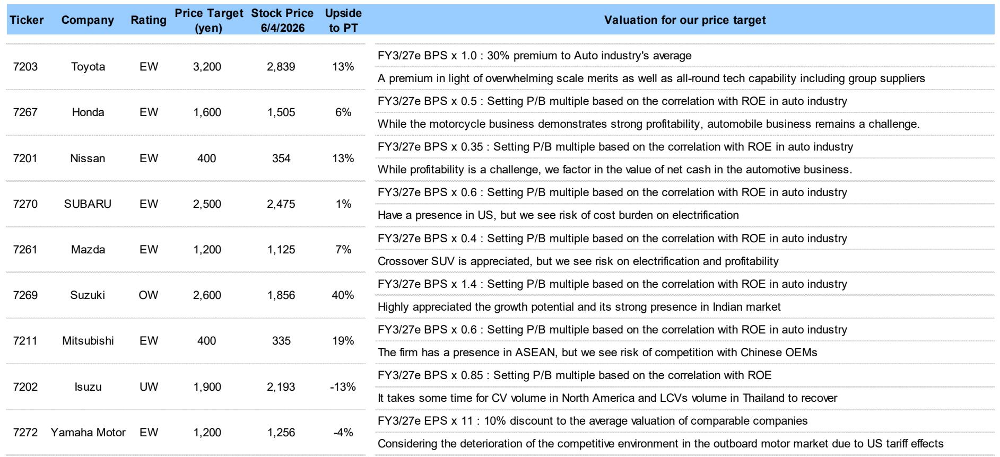
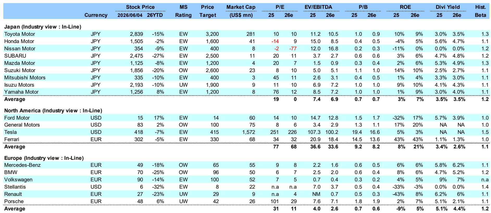
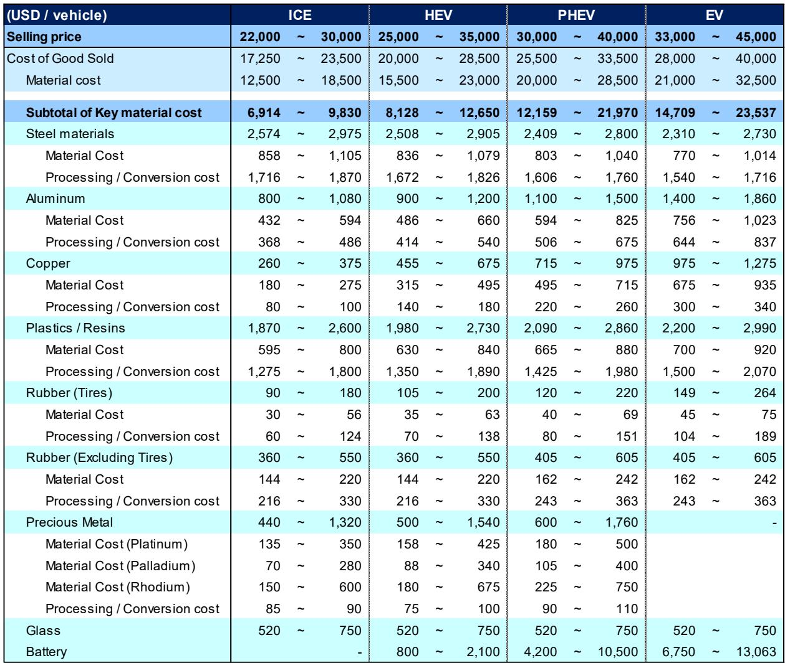

# 日本汽车股的核心矛盾：风险已被定价，但结构性优势尚未被充分重估

市场正在为一个“什么都对”的叙事买单：中东地缘风险、供应链中断、原材料成本飙升、中国竞争对手的挤压、电动化与软件化的投资黑洞。这些风险每一个都真实存在，每一个都足以让投资者对日本汽车板块望而却步。但某外资投行在2026年6月初发布的这份日本汽车行业研报，却给出了一个值得深思的信号——在所有这些负面因素都被充分讨论之后，部分个股的估值已跌至历史低位，而市场可能低估了其中一些公司通过结构性优势穿越周期的能力。

这不是一个简单的“抄底”建议。报告的核心判断是：行业整体面临多重逆风，但个股之间的分化将比以往任何时候都更加剧烈。真正值得关注的，不是谁能躲过所有风险，而是谁能在风险中展现出定价权、区域优势和盈利韧性。这份报告的价值，在于它提供了一套在不确定性中筛选“相对强者”的框架。

## 1. 市场定价的“完美风暴”已经包含，但结构性变量才是分水岭

研报开篇即点明了日本汽车厂商当前面临的五重逆风：中东局势引发的供应链中断风险、原材料价格上涨、汽车需求放缓、来自中国OEM的竞争压力，以及电动化与软件化的投资负担。这五重压力叠加，构成了一个几乎“完美”的看空叙事。

S&P Global预测全球汽车产量将同比下降2%，这并非一个灾难性的数字，但足以让市场对行业前景保持谨慎。某外资投行将行业评级定为“In-Line”，既不乐观也不悲观，这本身就是一个信号：他们认为市场已经消化了大部分坏消息。

关键在于，这些逆风对不同公司的影响程度截然不同。以原材料成本为例，报告假设每辆C-D级乘用车的成本将增加约8万日元（约500美元），其中约4万日元来自原油相关材料，另外4万日元来自钢铁、铝、铜、贵金属和半导体等其他材料。对于年销量数百万辆的丰田来说，这是一个数十亿美元级别的成本冲击；但对于销量规模较小的铃木或马自达，其绝对影响则小得多。

更重要的结构性变量是区域敞口。不同日本汽车厂商在全球各地的销售比例差异巨大，这意味着同一股逆风对不同公司的冲击路径完全不同。例如，中东地缘风险对依赖霍尔木兹海峡运输的供应链影响更大，而美国市场的需求变化则对斯巴鲁（其70%的销量在美国）的影响远超其他厂商。

这里需要指出的是，报告并未完全展开的一个关键问题是：这些结构性变量的二阶效应是什么？例如，原材料成本上升是否会加速某些厂商退出低利润市场？供应链风险是否会促使日本汽车厂商加速区域化生产布局？这些问题的答案，可能才是真正决定个股长期命运的因素。

## 2. 铃木的“印度故事”为何能成为估值洼地中的亮点

在所有日本汽车厂商中，某外资投行唯一给予“增持”评级的是铃木。这一判断的逻辑并不复杂，但值得深入拆解。

铃木当前的股价约为1,856日元，目标价2,600日元，潜在上行空间约40%。报告明确指出，其估值已接近历史低点的P/B水平。但低估值本身不是买入理由，关键在于铃木的盈利基本面相对稳健。

核心支撑来自印度市场。铃木在印度的汽车零售销量占比高达56%，这是其与其他日本汽车厂商最大的结构性差异。印度市场当前正处于燃油价格上升导致需求放缓的阶段，但报告认为，铃木通过提价已经部分吸收了原材料成本的上涨，盈利基调“相对稳固”。这意味着铃木在印度市场拥有一定的定价权——这在新兴市场汽车厂商中并不常见。

更深层的逻辑是：印度市场的汽车渗透率仍处于早期阶段，长期增长空间远大于成熟市场。如果印度经济持续增长，铃木作为市场领导者的地位将使其成为最直接的受益者。而当前的地缘风险和原材料成本压力，更多是周期性而非结构性的挑战。

但这里有一个尚未被完全回答的问题：铃木在电动化转型中的位置如何？报告没有详细展开，但印度市场的电动化进程相对缓慢，这反而给了铃木更多时间调整战略。然而，如果印度政府加速推动电动化，或者中国OEM大举进入印度市场，铃木的竞争优势可能面临考验。这是投资者在关注铃木时需要持续跟踪的关键变量。

## 3. 丰田的“保守指引”可能成为上行催化剂，但规模优势的边界在哪里

对于丰田，某外资投行给予“等权重”评级，但带有积极倾向。报告的核心逻辑是：丰田很可能逐步上调其保守的盈利指引，并且混合动力车型（HEV）的盈利增长前景值得期待。

丰田当前的股价为2,839日元，目标价3,200日元，上行空间约13%。估值方面，目标价对应FY3/27e BPS的1.0倍，相对于汽车行业平均溢价30%。报告认为，这一溢价是合理的，因为丰田拥有“压倒性的规模优势”以及包括集团供应商在内的全方位技术能力。

丰田的规模优势体现在多个维度：全球最大的汽车制造商地位使其在供应链谈判中拥有更强的议价权；混合动力技术的领先地位使其能够在燃油车向电动车过渡的中间阶段持续获取利润；而集团内部的供应商网络则提供了成本和技术协同效应。

但规模优势的边界在哪里？这是一个值得追问的问题。随着电动化转型的深入，传统内燃机相关的规模效应可能逐渐减弱，而电池、软件等新领域的规模效应尚未完全建立。丰田在固态电池等领域的布局值得关注，但这些技术从实验室到大规模量产仍有不确定性。

另一个需要关注的政策变量是USMCA（美墨加协定）的审查。该协定将于2026年7月进行审议，如果美国要求提高在美生产的零部件比例，将对丰田、本田、日产和马自达产生负面影响。丰田虽然在美国拥有大规模产能，但供应链的调整仍需时间和成本。

## 4. 本田的储能业务和斯巴鲁的美国依赖：两个被市场低估的风险与机会

报告对本田和斯巴鲁的评级均为“等权重”，但关注点截然不同。

本田当前股价1,505日元，目标价1,600日元，上行空间仅6%。报告认为，本田的摩托车业务盈利能力强劲，但汽车业务仍面临挑战。值得关注的是，报告特别提到了本田在“储能系统”相关业务上的前景。这可能是本田未来转型的一个关键方向——利用其在电池和能源管理领域的技术积累，拓展汽车以外的增长空间。但这一业务目前仍处于早期阶段，对盈利的贡献尚不明确。

斯巴鲁的情况则更加集中。其70%的销量来自美国市场，这一极端的区域依赖既是优势也是风险。优势在于，美国市场相对成熟，消费者对斯巴鲁的全轮驱动SUV有稳定的需求；风险在于，一旦美国经济放缓或贸易政策发生变化，斯巴鲁几乎没有其他市场可以缓冲。报告还指出，斯巴鲁面临电动化成本负担的风险，这对于一家销量规模相对较小的厂商来说，压力尤为显著。

这里有一个值得深入思考的问题：斯巴鲁的美国依赖是否真的是一种风险，还是说，在美国市场深耕多年建立的品牌忠诚度本身就是一种护城河？报告没有给出明确答案，但这恰恰是投资者需要自行判断的关键点。

## 5. 五十铃的下行风险揭示了一个被忽视的周期：商用车与新兴市场的双重重压

在所有日本汽车厂商中，五十铃是唯一被给予“减持”评级的公司。当前股价2,193日元，目标价1,900日元，潜在下行空间约13%。

报告给出的理由是：五十铃在北美市场的商用车（CV）复苏和泰国市场的轻型商用车（LCV）复苏均面临较高不确定性。这意味着，公司实现其盈利指引的难度较大。

这一判断揭示了一个被市场忽视的周期：商用车市场与乘用车市场的需求驱动因素完全不同。商用车需求与经济活动、基建投资、物流运输等宏观变量高度相关，其复苏节奏往往滞后于宏观经济。泰国作为五十铃的重要市场，其经济复苏进程和皮卡需求的变化将直接影响公司业绩。

更值得注意的是，报告对五十铃的FY26e和FY27e盈利预测均低于市场共识，差异分别为-13%和-13%。这表明，某外资投行认为市场对五十铃的预期可能过于乐观。对于投资者来说，这提醒了一个重要的分析原则：当一家公司的盈利预测与市场共识存在显著差异时，往往意味着存在未被充分定价的风险或机会。

## 6. 市场尚未完全回答的问题：USMCA审查、美国中期选举与电动化路径的分化

报告提到了两个重要的政策变量：美国中期选举和USMCA审查。这两个变量可能对日本汽车板块产生深远影响，但报告并未给出明确的预测或分析框架。

美国中期选举的结果可能影响贸易政策、企业税制和电动车补贴的方向。如果主张保护主义贸易政策的势力增强，日本汽车厂商在美国市场的运营环境可能面临更多不确定性。反之，如果政策环境相对友好，则可能为这些公司提供喘息空间。

USMCA审查则更加具体。该协定要求汽车在北美地区的零部件采购比例达到一定门槛才能享受零关税待遇。如果美国要求提高这一比例，日本汽车厂商将面临要么增加在美投资、要么支付关税的两难选择。这对于那些在北美生产比例较低的公司（如马自达）影响更大。

另一个未被完全回答的问题是电动化路径的分化。不同日本汽车厂商在电动化转型上的策略和进度差异巨大。丰田押注混合动力和氢燃料电池，本田和日产在纯电动车领域有所布局，而铃木和斯巴鲁则相对保守。这些不同的路径选择，将在未来3-5年产生截然不同的竞争结果。但报告并未对这些路径进行系统性比较和评估。

这些未解问题，恰恰是投资者在阅读这份研报后需要进一步思考和讨论的方向。估值洼地提供了安全边际，但真正的超额收益，来自于对这些结构性变量的前瞻性判断。

---

上述分析基于某外资投行2026年6月5日发布的日本汽车行业研报，内容仅作为学习与讨论之用。我们对报告中提到的公司、数据和判断进行了逻辑梳理和适度发散，但所有核心事实均源自原始报告。如果您希望获取完整的原始研报图表、更详细的数据表格以及我们对这些未解问题的持续跟踪讨论，欢迎来星球微信群里继续交流。

Personal reading notes and learning share only. Not investment advice.

