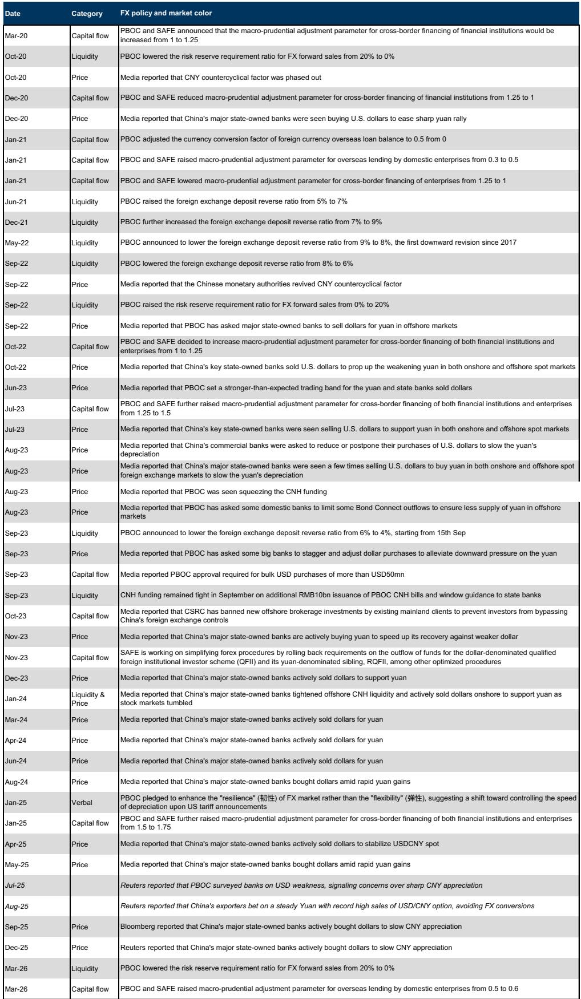
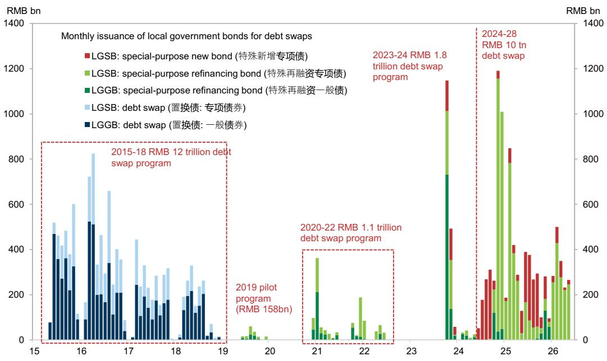
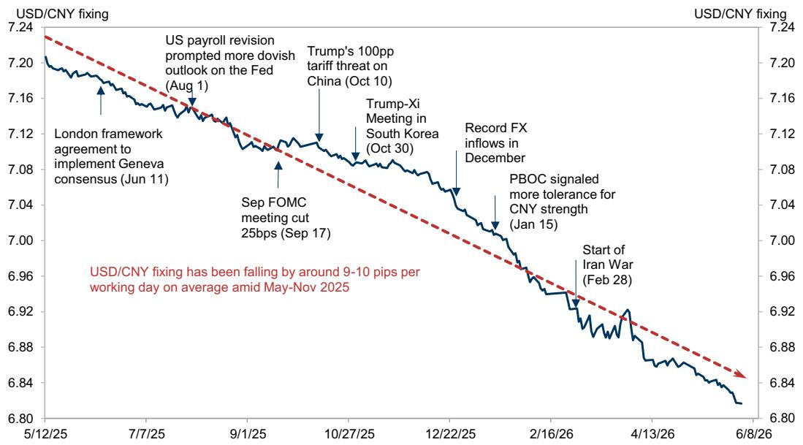

# 市场真正低估的不是增长放缓，而是政策锚的切换

过去一个月，中国外汇和利率市场同时出现了两个让不少投资者感到困惑的走势：人民币在美元走强时依然保持升值趋势，10年期国债收益率在通胀预期上升的背景下反而跌破1.70%。这两个现象看似矛盾，但某外资投行最新发布的China FX/Rates Monitor提供了一条清晰的解释线索——问题的关键不在于增长数据本身，而在于政策锚的定位正在发生实质性变化。

这份报告的核心判断值得认真对待：人民币升值和利率下行并非由单一的宏观故事驱动，而是分别由两个不同的政策锚在支撑。汇率端的锚是人民银行对人民币有序升值的容忍度，利率端的锚则是信贷需求疲弱背景下的资产配置压力。理解这两个锚，比盯着月度GDP数据更能把握下半年中国金融市场的方向。

以下是基于该报告的深度解读与延伸思考。

## 1. 四月的增长走弱并未触发政策宽松，因为决策者看到的不是趋势性恶化

四月经济数据低于预期后，市场对政策宽松的预期一度升温。但报告明确指出，全面宽松的门槛仍然很高。这不是说决策者对增长放缓无动于衷，而是他们判断当前走弱更多是技术性和政策性因素的叠加，而非底层增长趋势的突然恶化。

报告列出了几个关键拖累因素：残存的季节性效应、年初财政支出强劲后的放缓、消费品以旧换新补贴效应的消退、以及电动汽车购置税上调的影响。这些因素中，部分会自然消退，而财政支持则可能在下半年随着政府债券发行加速和政策性金融工具的推出而跟进。

更关键的是，油价驱动的再通胀正在复杂化全面宽松的逻辑。报告指出，如果油价稳定，PPI通胀可能在二季度末见顶，但霍尔木兹海峡的不确定性使得输入性通胀风险依然高企。在这种背景下，降息看起来并不现实。

这意味着什么：政策层面对增长的容忍度可能比市场想象的要高。他们更倾向于通过低调宽松——比如保持银行间流动性充裕、通过再贷款进行定向信用宽松——来配合财政执行，而不是出台大规模刺激。对于投资者而言，这意味着不应该因为一两个月的经济数据走弱就押注政策大幅转向。

## 2. 人民币升值背后并非单纯的美元走弱，而是央行对升值节奏的主动管理

今年以来人民币对美元升值超过3%，即便在美元因中东能源冲击而走强时，美元/人民币也只是部分回吐了此前的涨幅，随后在5月下旬重新跌破6.80。报告揭示了一个关键信号：央行的逆周期因子在5月仍然维持在超过400个基点的水平，这表明决策者并不反对升值本身，而是在控制升值的节奏。

报告估算，央行对人民币升值的容忍速度大约在年化4%左右——这个速度足以抵消外资的carry成本，但又不至于对出口竞争力和通胀造成过大压力。然而，升值预期已经变得相对单边，并触发了更强的出口商结汇意愿。报告测算，自去年12月以来，出口商已经比正常水平多结汇了约1500亿美元，而此前的超额美元囤积高峰曾达到约5000亿美元。

这意味着什么：人民币升值正在变得更加“choppy and event-driven”，每一次中间价的调整都可能被市场解读为政策信号。报告预计12个月内美元/人民币将触及6.50，但短期存在超调风险。对于有外汇敞口的企业和投资者而言，当前的关键问题不是方向，而是节奏和波动率——美元走强的时期可能会暂时减缓人民币升值的速度，但趋势并未改变。

## 3. 债券收益率的下行不能用传统的通胀-利率框架解释，真正的驱动力是资产配置压力

这是报告中一个特别值得注意的洞察。10年期国债收益率已经跌至约1.70%，而模型隐含的公允价值却因为通胀预期上升而升至2%以上。1年期国债收益率更是低至1.15%，与OMO政策利率1.4%之间的利差极小。按照传统框架，这些信号通常意味着收益率已经没有太多下行空间。

但报告指出，市场遗漏了一个关键因素：资产配置压力。信贷需求疲弱导致银行减少了贷款投放，释放出的资产负债表空间被用于债券投资。与此同时，境内机构增加海外投资的渠道有限，使得需求集中在境内固定收益资产上。报告特别提到，人民银行在最新的一季度货币政策执行报告中明确表示，银行的债券投资和信贷投放一样，都是服务实体经济的重要渠道——这与过往监管层对“资金空转”的警告形成了鲜明对比。

这意味着什么：在没有政策利率下调的情况下，债券收益率仍然可能因为配置压力而低于模型公允价值。对于利率投资者而言，传统的“通胀预期高-债券收益率应该上行”框架在当前阶段可能失效。关键变量不是通胀本身，而是信贷需求的恢复速度——如果信贷需求持续疲弱，配置压力将继续支撑债市。

## 4. 利率的持续上行需要满足一个高门槛：回购利率显著高于OMO目标

报告对利率修正风险的分析同样值得关注。虽然中期来看利率仍有下行空间，但季度末的流动性需求和市场对近期OMO操作的敏感性可能导致短期的修正风险。人民银行此前进行了一次零7天逆回购操作，被市场解读为流动性收紧的信号，但随后又恢复了操作。

报告的核心判断是：利率持续上行的空间有限，除非人民银行愿意重复2020年或2022年的情景——将回购利率推高至OMO目标利率之上。但当前的条件与当时不同：回购利率目前离OMO利率并不远（当时并非如此），国内需求和信贷需求依然疲弱，中东能源冲击的不确定性仍然较高。这意味着推动回购利率大幅上行的门槛相当高。

这意味着什么：债券市场的核心矛盾已经从“利率会不会上行”转变为“在什么条件下利率会上行”。报告给出的条件清晰——需要看到回购利率的持续走高，而这又需要央行主动收紧流动性。对于投资者而言，这意味着短期修正风险是存在的，但中期趋势仍然由配置压力主导，除非基本面出现显著变化。

## 5. 报告尚未完全回答的两个关键问题：升值的可持续性与配置压力的边界

尽管报告提供了相当完整的分析框架，但有两个问题值得进一步思考。

第一个问题是人民币升值的可持续性。报告指出出口商结汇意愿已经显著增强，但同时也提到此前的超额美元囤积规模高达5000亿美元。如果升值预期出现逆转，这些已经结汇的美元是否可能重新流出？此外，报告对12个月内美元/人民币触及6.50的预测，是否充分考虑了中美利差变化和全球资本流动格局的潜在调整？这些问题需要更细致的压力测试。

第二个问题是资产配置压力的边界。银行债券投资受到信贷需求疲弱的驱动，但如果信贷需求开始恢复——比如因为财政支出加速或房地产政策见效——配置压力就会减弱。报告指出财政支持可能在下半年发力，但未详细分析这种发力对债券市场供求关系的具体影响。同样重要的是，如果债券收益率持续低于公允价值，银行是否会因为利润压力而开始减少债券配置？这些二阶效应尚未被充分讨论。

## 6. 重新构建观察框架：三个信号比一个数据更重要

基于报告的框架，以下是投资者可以持续跟踪的三个关键信号，它们比单月的经济数据更能反映市场的真实走向。

第一个信号是回购利率与OMO利率之间的利差。如果回购利率持续高于OMO利率，意味着央行在主动收紧流动性，这将改变利率市场的整体格局。如果回购利率保持在OMO利率下方，则配置压力将继续主导市场。

第二个信号是央行中间价的调整速度和逆周期因子的变化。如果逆周期因子开始下降，意味着央行对升值速度的容忍度在提高，这可能加速人民币的升值进程。反之，如果逆周期因子重新上升，则表明央行希望在短期内放缓升值节奏。

第三个信号是信贷数据的结构和持续性。不是看总量，而是看居民中长期贷款和企业中长期贷款的变化方向。如果信贷需求出现可持续的恢复，债券市场的配置压力将自然减轻，收益率下行的逻辑也会随之改变。

这三个信号共同构成了一个比GDP或PMI更直接的市场观测框架。它们帮助投资者区分什么是趋势，什么是噪音。

---

报告的完整内容还包含了对估值、技术面、资金流和基本面四个维度的详细图表分析，以及对冲基金持仓变化、期权市场定价、离岸人民币流动性等更细颗粒度的讨论。限于篇幅，以上仅提炼了最核心的分析框架和判断逻辑。

这些未解问题——升值可持续性的边界、配置压力的拐点、以及央行在关键节点上的行为选择——正是需要在更深入的讨论中持续跟踪的课题。欢迎来星球微信群里继续讨论，我们会在群内分享完整的图表数据和后续的市场更新。

Personal reading notes and learning share only. Not investment advice.

