## China's 3D Journey

# The Hefei Paradox: Why Smart Industrial Policy Can't Fix Macro Imbalances

Defying optimism that better industrial policy and stronger exports can resolve overcapacity, our Hefei study reveals a hard truth: they can build world-class industries and buy time—but cannot fix the supply-demand imbalance rooted in local government incentives. The real cure: rebalancing reforms.

Why now: With a global capex super-cycle unfolding, there is an increasingly popular debate: productivity-focused, ecosystem-driven industrial policies may be sufficient to sustain growth, by cultivating competitive new industries, capturing structurally stronger external demand, and avoiding the excess capacity traps of the past—even without meaningful economic rebalancing. The 15th Five-Yea Plan's "national unified market" initiative and top leadership's latest pledge to reduce wasteful investment in developing future industries have lent weight to that view.

What Hefei's model tells us: Hefei—the city that rescued NIO, backed CXMT, and seeded China's rise in advanced display manufacturing—is a key showcase for the school of thought that smarter industrial policies can serve as an ecosystem planner, solve bottlenecks of emerging industries, and foster global champions. But even this city has not escaped overcapacity and deflation. Its recipe for success—which counts on timing and bold bets—is not easy to replicate either. Applying the same playbook nationwide risks compounding overcapacity problems.

Why smarter industrial policy and stronger exports are not enough: Better industrial policy can improve investment allocation towards more productive sectors—but cannot, by itself, change the supply-heavy incentives that cause China to invest too much. Stronger exports may offer some relief but have limits: weaker job multipliers, growing economic exposure to the global cycle, and higher risks of protectionism.

What this means for China's economy: We expect China's real GDP growth to reach 4.8% in 2026 and 4.7% in 2027, led by strong exports and related capex amid the global AI and energy transition super-cycle, but domestic consumption would lag – a typical K-shaped economy. The tech-driven new economy continues to strengthen but remains too narrow and capital-intensive to generate broad income gains. The inflation uptick is narrow and largely imported, not demand-driven, and will likely soften again in 2027 as energy effects fade.

The way out: Decisive economic rebalancing reforms to cadre evaluation, fiscal structure, and social safety nets—shifting resources from investment toward household income and consumption.

MS ASIA LIMITED+

Jenny Zheng, CFA

Economist

Jenny.L.Zheng@morganstanley.com +852 3963-4015

Robin Xing

Chief China Economist

Robin.Xing@morganstanley.com +852 2848-6511

Zhipeng Cai

Economist

Zhipeng.Cai@morganstanley.com +852 2239-7820

Harry Zhao

Economist

Harry.Zhao@morganstanley.com +852 2239-7229

Asia Summer School 2026

中国思考

查看同系列内容>

## A Closer Look

Hefei's growth model—often cited as a showcase of China's industrial success—reinforces a core investment message: China has the ability to foster globally competitive supply chains and champions, but overcapacity and deflationary pressures would persist without structural reforms to fix the supply-centric local government incentives. We expect real GDP growth of 4.8% in 2026 and 4.7% in 2027, driven by exports amid the global AI and energy capex super-cycle, while domestic consumption lags—a K-shaped economy that persists. Reflation is narrow and largely imported, and will likely soften again following the oil shocks. The capex super-cycle is real—but so is the risk that it deepens structural imbalances unless accompanied by economic rebalancing reforms.

## Why now

The region's capex is projected to nearly triple in pace, reaching US\$16trn by 2030—driven by AI, energy transition, and defense. China's dominant position in global supply chains places it as a primary beneficiary. This has reignited a macro debate: with the help of structurally stronger external demand, would productivity-focused, ecosystem-driven industrial policy be sufficient to cultivate competitive new industries, and avoid the overcapacity traps of the past—even without meaningful economic rebalancing? The 15th FYP's "unified national market" initiative and top leadership's latest pledge against wasteful investment have lent weight to that view. Meanwhile, CXMT's forthcoming IPO has put its mother city—Hefei—under the spotlight as a key showcase of how good industrial policy can generate national and global champions.

## A case study of the "Hefei Model"

Hefei's recipe for success—the government acted as an ecosystem planner, not a blanket subsidy provider: The approach included:

- Mobilizing fiscal resources as patient capital to anchor lead firms,  
- Promoting public-private co-investment,  
• Building supplier networks around them,  
• Conducting market-based exit, and  
• Recycling gains into the next strategic sector.

This approach has helped reduced subsidy-induced market distortion and solved funding bottlenecks at the early stage of emerging sector development—when private capital was still hesitant.

The city has cultivated various national/global champions: It supported BOE in launching China's first sixth-generation TFT-LCD display-panel line, turned the rescue of NIO into the development of an NEV hub in the city, and backed CXMT as a “chain leader” to develop DRAM supply chain when private capital was still in doubt. Today, the city is a major production base across NEVs, displays, and appliances, and hosts globally

competitive players in PV inverters, energy storage, and DRAM.

But Hefei's recipe is hard to replicate—and even this city has not escaped overcapacity and deflation: Its success relied on a rare alignment of timing, bold early bets, local industrial fit, and favorable demand cycles that only materialized with a lag. If many regions imitate the same surface tools (large upfront government seed capital, anchor-firm recruitment, industrial park buildout), and focus on the same frontier sectors, this may result in redundant investment nationwide, compounding the overcapacity problem. Importantly, while Hefei has outperformed in industrial output and exports over the past five years, consumer goods sales lagged and price deflation was more severe than the national average.

\- This is a microcosm of China's broader challenge: even with improved industrial policy, the shift is in what China invests in, not how much—leaving the supply-demand gap unresolved.

Exhibit 1: Hefei has cultivated national and global champions in advanced manufacturing  
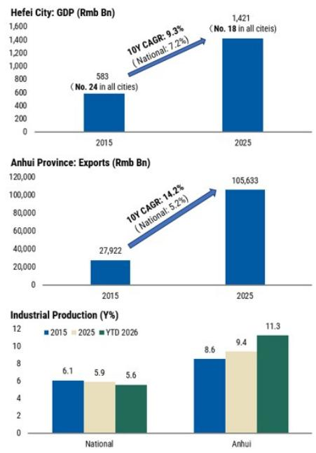

## NATIONAL & GLOBAL CHAMPION

## #1&2 in China's Key Industries

  
NEV

  
Flat Panel Display

  
Smart Home Appliance

  
Quantum Information

## Global leadership

  
PV Inverter Shipments

  
Color-sorting Machines

  
Energy Storage Shipments

  
DRAM Chip Production

  
Note: Ranking is based on local major companies  
Source: CEIC, MS

Exhibit 2: But the city is not immune to overcapacity and deflation problems  
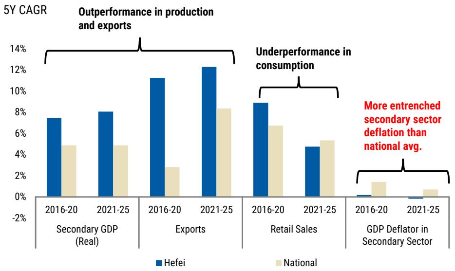

bar chart

5Y CAGR
| Category | Period | Hefei (%) | National (%) |
| :--- | :--- | :--- | :--- |
| Secondary GDP (Real) | 2016-20 | 7.5 | 4.8 |
| Secondary GDP (Real) | 2021-25 | 8.0 | 4.8 |
| Exports | 2016-20 | 11.3 | 2.8 |
| Exports | 2021-25 | 12.3 | 8.3 |
| Retail Sales | 2016-20 | 8.9 | 6.7 |
| Retail Sales | 2021-25 | 4.7 | 5.3 |
| GDP Deflator in Secondary Sector | 2016-20 | 0.2 | 1.4 |
| GDP Deflator in Secondary Sector | 2021-25 | 0.05 | 0.6 |
The chart highlights that underperformance in consumption is more entrenched in secondary sector deflation than national average.

Source: CEIC, MS

## Why smarter industrial policy and stronger exports are still not enough

Beijing is increasingly promoting better industrial policy to curb excess capacity in its 15th FYP: Since July 2025, the anti-involution campaign has increasingly targeted disorderly price competition and the flow of investment and credit into sectors with overcapacity. The 15th FYP takes another step ahead by promoting "a unified national market" to address redundant construction and zero-sum competition among local governments. The need to pursue differentiated development across regions and prevent "money-burning" investment has been re-emphasized by the top leadership in recent discussion of developing future industries.

The "unified national market" initiative and anti-involution campaign are directionally right—but implementation faces high obstacles: Cross-provincial capacity coordination cannot revert to a top-down model, yet market-based mechanisms for local specialization remain underdeveloped. Cadre evaluation—i.e., performance appraisal system for government officials —still prioritizes output and investment growth. China's VAT-heavy tax system inherently rewards production over consumption. Without changes to these incentives, overcapacity curbs will only reallocate investment across sectors—away from more oversupplied industries toward less saturated ones—rather than toward consumption or social welfare. The supply-demand gap remains wide.

Stronger exports offer some relief...We expect China's export growth to be sustained at 10% this year (vs. 2.2% on average in 2023-25), and see room for its global export share to expand towards 16.5% by 2030 (vs. 15% now), aided by the AI and energy transition-driven global capex super-cycle. The stronger external demand should help mitigate China's excess capacity problem in select sectors.

...but have limits: The transmission from exports to domestic income is weaker than in previous cycles, given a more capital-intensive product mix with lower employment

multipliers. Meanwhile, a growth model that depends on foreign demand to absorb domestic oversupply is inherently vulnerable to global cycle turns and trade tensions.

## What this means for China's economy

The K-shaped economy is here to stay: We expect China's real GDP growth to be sustained at 4.8% in 2026 and 4.7% in 2027. The key driver would be strength in the "new economy"—exports and manufacturing capex related to AI, energy transition, and emerging tech sectors. The "old economy" stands in contrast—household consumption would be constrained by a soft labor market and ongoing property adjustment. The new economy is still too narrow and biased towards capital and skills, and rapid AI diffusion risk is widening the gap by raising labor productivity while displacing routine workers in the near term.

The result is strong output but weak transmission to broad income gains, which keeps consumption soft and prevents the new economy from becoming a self-sustaining domestic-demand engine.

Reflation is narrow and largely imported, not demand-driven: Energy costs and AI/green transition demand may push PPI to 1.5% in 2026—its first positive reading in four years. But the improvement has been concentrated in upstream (materials, energy) and AI-related sectors, with limited pass-through to downstream and consumption-linked sectors given weak final demand.

We don't think supply-side consolidation and better exports alone can drive broad reflation. The 2015–17 precedent—often cited as supply-driven success in reflation – was triggered by a massive concurrent demand stimulus (shantytown renovation to fuel household leveraging), yet comparable demand stimulus is not in sight in this cycle.

We thus expect PPI to turn negative again in 2027 (−0.4%) as the energy impulse fades, with CPI (0.8% in 2026, 0.6% in 2027) and GDP deflator (0.5% n 2026, 0.3% in 2027) remaining lukewarm.

Exhibit 3: A two-speed economy, stable in aggregate  
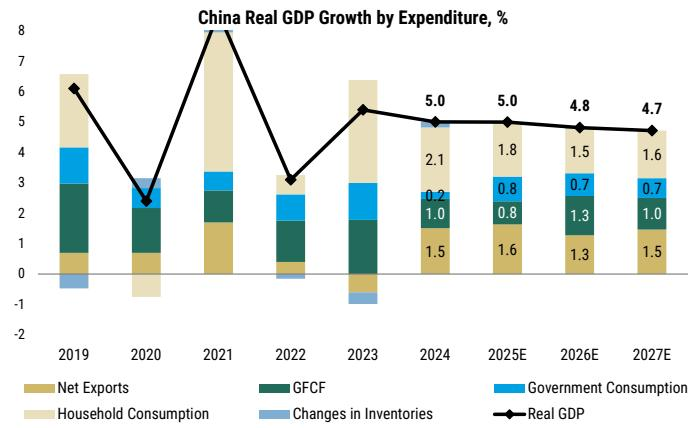

bar-line hybrid

China Real GDP Growth by Expenditure, %
| Year | Net Exports (%) | GFCF (%) | Government Consumption (%) | Household Consumption (%) | Changes in Inventories (%) | Real GDP (%) |
| :--- | :--- | :--- | :--- | :--- | :--- | :--- |
| 2019 | 0.8 | 2.3 | 1.4 | 1.6 | -0.5 | 6.1 |
| 2020 | 0.8 | 1.4 | 0.5 | -0.8 | -0.6 | 2.4 |
| 2021 | 1.7 | 1.1 | 0.7 | 4.3 | -0.1 | 8.1 |
| 2022 | 0.3 | 1.4 | 0.9 | 0.1 | -0.3 | 3.1 |
| 2023 | -0.7 | 1.7 | 1.3 | 2.3 | -0.6 | 5.4 |
| 2024 | 1.5 | 1.0 | 0.2 | 2.1 | 0.1 | 5.0 |
| 2025E | 1.6 | 0.8 | 0.8 | 1.8 | 0.1 | 5.0 |
| 2026E | 1.3 | 1.3 | 0.7 | 1.5 | 0.1 | 4.8 |
| 2027E | 1.5 | 1.0 | 0.7 | 1.6 | 0.1 | 4.7 |

Source: CEIC, MS estimates.

Exhibit 4: Surge in PPI likely a one-off level shock; broader prices (deflator) remain lukewarm  
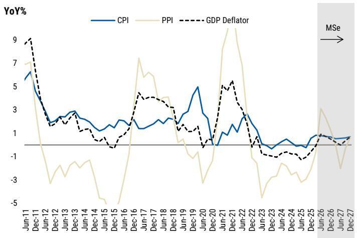

line chart

| Date    | CPI  | PPI  | GDP Deflator |
|---------|------|------|--------------|
| Jun-11  | 6.0  | 7.0  | 9.0          |
| Dec-11  | 5.0  | 8.0  | 8.0          |
| Jun-12  | 3.0  | -3.0 | 3.0          |
| Dec-12  | 2.0  | -4.0 | 2.0          |
| Jun-13  | 2.5  | -3.5 | 2.5          |
| Dec-13  | 2.0  | -3.0 | 2.0          |
| Jun-14  | 1.5  | -2.5 | 1.5          |
| Dec-14  | 1.0  | -2.0 | 1.0          |
| Jun-15  | 1.5  | -1.5 | 1.5          |
| Dec-15  | 2.0  | -1.0 | 2.0          |
| Jun-16  | 2.5  | -0.5 | 2.5          |
| Dec-16  | 3.0  | 0.0  | 3.0          |
| Jun-17  | 3.5  | 0.5  | 3.5          |
| Dec-17  | 4.0  | 1.0  | 4.0          |
| Jun-18  | 4.5  | 1.5  | 4.5          |
| Dec-18  | 5.0  | 2.0  | 5.0          |
| Jun-19  | 5.5  | 2.5  | 5.5          |
| Dec-19  | 6.0  | 3.0  | 6.0          |
| Jun-20  | 6.5  | 3.5  | 6.5          |
| Dec-20  | 7.0  | 4.0  | 7.0          |
| Jun-21  | 7.5  | 4.5  | 7.5          |
| Dec-21  | 8.0  | 5.0  | 8.0          |
| Jun-22  | 8.5  | 5.5  | 8.5          |
| Dec-22  | 9.0  | 6.0  | 9.0          |
| Jun-23  | 9.5  | 6.5  | 9.5          |
| Dec-23  | 10.0 | 7.0  | 10.0         |
| Jun-24  | 10.5 | 7.5  | 10.5         |
| Dec-24  | 11.0 | 8.0  | 11.0         |
| Jun-25  | 11.5 | 8.5  | 11.5         |
| Dec-25  | 12.0 | 9.0  | 12.0         |
| Jun-26  | 12.5 | 9.5  | 12.5         |
| Dec-26  | 13.0 | 10.0 | 13.0         |
| Jun-27  | 13.5 | 10.5 | 13.5         |
| Dec-27  | 14.0 | 11.0 | 14.0         |

Source: CEIC, MS estimates.

## The way out

Decisive economic rebalancing—not better industrial policy—is the core solution: This requires:

- Shifting cadre evaluation from output volume toward household income and consumption,  
- Reducing fiscal revenue reliance on VAT in favor of direct taxes that reward efficiency over scale, and  
- Strengthening social safety nets to unwind the elevated precautionary savings for consumption.

Progress to date has been incremental: the 15th FYP's consumption push remains qualitative and non-binding, and geopolitical tensions may further entrench Beijing's supply-centric approach.

Without these reforms, improved industrial policy and stronger exports may lift the composition and cyclical trajectory of growth—but cannot resolve the structural surplus that keeps deflationary pressure alive.

## #1: What is Hefei's recipe for success?

## Hefei's model works better than traditional local industrial policies because the government acts less like a blanket subsidy provider and more like an ecosystem planner and VC investor: The approach included:

- Mobilizing fiscal resources as patient capital to anchor lead firms,  
- Promoting public-private co-investment,  
• Building supplier networks around them,  
• Conducting market-based exit, and  
• Recycling gains into the next strategic sector.

This approach has helped reduce subsidy-induced market distortion and solved funding bottlenecks at the early stage of emerging sector development – when private capital was still hesitant.

## The model has produced visible winners:

- Displays: Hefei backed BOE's 6th-generation TFT-LCD line in 2008, filling a key gap in domestic 32-inch panel production and reducing import dependence. It subsequently attracted BOE's 8.5-gen and the world's first 10.5-gen lines, and built a supplier ecosystem spanning materials, glass substrates, equipment, and modules. The cluster underpins Anhui's \~10% share of global display capacity.  
- DRAM: Hefei funded three-quarters of the initial capital to launch CXMT in 2016—a bet few other cities were willing to make—and built a full supply-chain ecosystem spanning design, equipment, materials, and packaging around it. CXMT is now China's sole DRAM mass producer and the world's fourth-largest. Its forthcoming IPO could deliver multi-fold returns on Hefei's original investment.  
- NEVs: Hefei invested RMB7bn to rescue NIO from near-bankruptcy in 2020. In return, NIO relocated its Chinese headquarters, core R&D, and supply chain to the city. The bet catalyzed a broader ecosystem: BYD, Volkswagen, and Chang'an subsequently established local manufacturing bases in the city, drawing 500+ component suppliers. This has turned Hefei into a key NEV hub in the nation.

Today, Hefei has emerged as a leading production hub in NEVs, flat-panel displays, and home appliances, and hosts roughly one-third of China's quantum enterprises. Globally, the city is home to firms with leading positions in PV inverters and DRAM, and competitive players in energy storage systems.

At the macro level, Hefei's real GDP size nearly doubled over the past decade, to Rmb1.4trn in 2025, and its national ranking climbed into the top 18 (from #24 in 2015). The city has now become the primary growth engine of Anhui province, with spillover through vertically integrated supply chains anchored by local champions, extending upstream and downstream production networks across the province, helping sustain Anhui's industrial production and exports to expand at CAGRs of 8.1% CAGR (national average: 5.7%) and 14.2% (national average: 5.2%), respectively, over the past decade.

Exhibit 5: Hefei's model: an ecosystem planner, not blanket subsidy provider  

flowchart

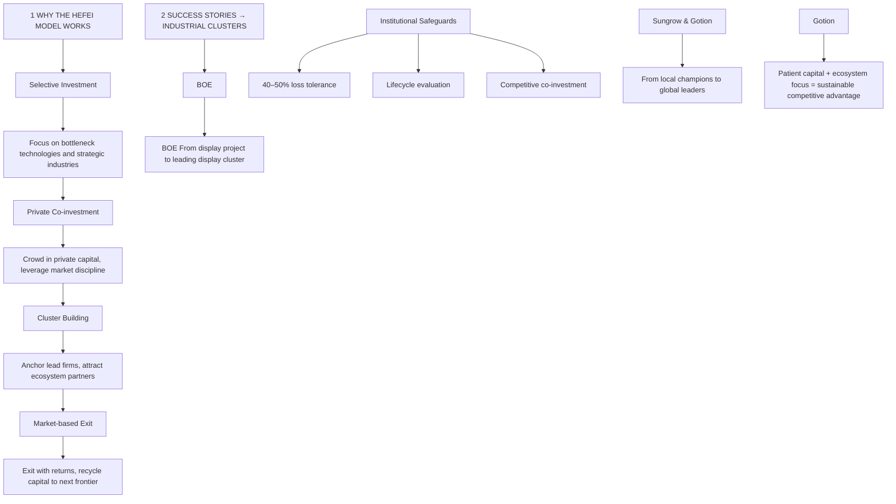

Source: Government website, MS

Exhibit 6: Hefei has cultivated national and global champions in advanced manufacturing  

bar chart

| City/Region | Year | GDP (Rmb Bn) | Exports (Rmb Bn) | Industrial Production (%) |
|---|---|---|---|---|
| Hefei City: National | 2015 | 583 (No. 24 in all cities) | 27,922 | 6.1 |
| Hefei City: National | 2025 | 1,421 (No. 18 in all cites) | 105,633 | 8.6 |
| Anhui Province: National | 2015 | 583 (No. 24 in all cities) | 27,922 | 5.9 |
| Anhui Province: National | 2025 | 1,421 (No. 18 in all cites) | 105,633 | 9.4 |
| Industrial Production (%) | 2015 | 583 (No. 24 in all cities) | 27,922 | 5.6 |
| Industrial Production (%) | 2025 | 1,421 (No. 18 in all cites) | 105,633 | 11.3 |
The chart includes a 10Y CAGR of -9.3% for National and -14.2% for National. The data is presented for each city and region in the table.

Source: CEIC, MS

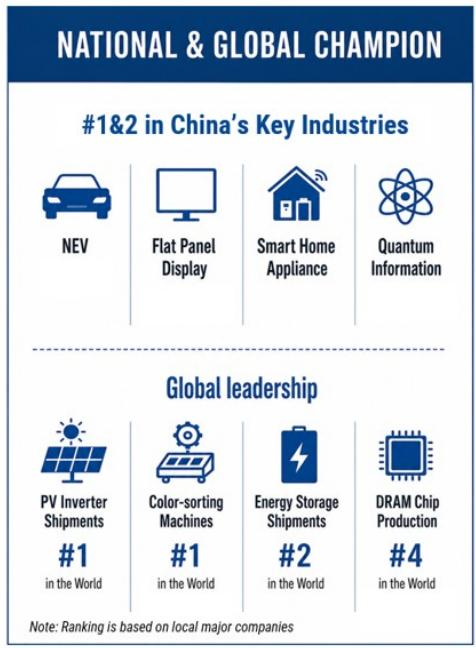

text_image

NATIONAL & GLOBAL CHAMPION
#1&2 in China's Key Industries
NEV	Flat Panel Display	Smart Home Appliance	Quantum Information
Global leadership
PV Inverter Shipments	Color-sorting Machines	Energy Storage Shipments	DRAM Chip Production
#1
in the World	#1
in the World	#2
in the World	#4
Note: Ranking is based on local major companies

## #2. Can Hefei's model be replicated by other regions?

We view this as challenging... Hefei's success came from a rare alignment of timing, bold early state capital commitment, local industrial fit, and favorable demand cycles that only materialized with a lag. Its major bets were made when strategic sectors were still less mature and more fragmented; for example, Hefei invested RMB7bn in NIO in 2020, before China's NEV market entered a far more competitive, shakeout-driven phase. Later followers may face higher entry barriers, less room to attract anchor firms, and more crowded end markets—not to mention that different cities have different local resource endowments.

...and prone to fueling redundant investment across regions: The bigger macro risk is that if many regions imitate the same surface tools—large upfront government seed capital, anchor-firm recruitment, industrial park buildout, and they focus on the same frontier sectors, the result could be redundant investment nationwide, worsening the overcapacity problems Beijing is already trying to curb.

Indeed, even Hefei is not immune to overcapacity and deflation: While Hefei outperformed in industrial production and exports over the past five years, consumer goods sales lagged and price deflation was more severe than the national average—a reflection of overcapacity and constrained corporate earnings despite market share gains. Hefei's case is essentially a microcosm of China's broader industrial challenge: globally competitive supply chains coexisting with compressed profitability and persistent deflation.

\- Even with smarter industrial policy, the shift is in what China invests in, not how much it invests—leaving the supply-demand gap unresolved.

Exhibit 7: Hefei is not immune to overcapacity and deflation problems  

bar chart

5Y CAGR
| Category | Period | Hefei (%) | National (%) |
| :--- | :--- | :--- | :--- |
| Secondary GDP (Real) | 2016-20 | 7.5 | 4.8 |
| Secondary GDP (Real) | 2021-25 | 8.0 | 4.8 |
| Exports | 2016-20 | 11.3 | 2.8 |
| Exports | 2021-25 | 12.3 | 8.3 |
| Retail Sales | 2016-20 | 8.9 | 6.7 |
| Retail Sales | 2021-25 | 4.7 | 5.3 |
| GDP Deflator in Secondary Sector | 2016-20 | 0.2 | 1.4 |
| GDP Deflator in Secondary Sector | 2021-25 | 0.1 | 0.7 |
The chart highlights that underperformance in consumption is more entrenched in secondary sector deflation than national average.

Source: CEIC, MS

## #3. Can smarter industrial policy reduce excess investment?

Beijing is increasing promoting better industrial policy to curb excess capacity in its 15th FYP: Since July 2025, the anti-involution campaign has increasingly targeted disorderly price competition and the flow of investment and credit into sectors with overcapacity. The 15th FYP takes another step ahead by promoting "a unified national market" to address redundant construction and zero-sum competition among local governments. The need to pursue differentiated development across regions and prevent "money-burning" investment has been re-emphasized by the top leadership in recent talk on developing future industries.

## We view the "national unified market" and anti-involution campaign as directionally right, but implementation could be challenging:

- Cross-provincial capacity coordination cannot revert to a top-down, planned-economy model, yet the market-based mechanisms needed to guide local specialization are still underdeveloped;  
- Local government performance metrics continue to prioritize output and investment growth, discouraging officials from ceding industries or pursuing narrower development paths;  
- China's tax system, heavily reliant on VAT, inherently favors production over consumption. Aligning local incentives would require a shift toward direct taxes and redesigned central-local fiscal transfers—reforms that are technically complex and likely to proceed only gradually given entrenched local interests.

Without changes to local government incentives, smarter industrial policy will only reallocate investment, not narrow supply-demand imbalances: As it is, a key reason for the pervasive excess capacity today is the strong industrial sector capex expansion in 2021-23 to partly substitute for the slump in housing investment, keeping overall investment growth strong. Similarly, as local cadre evaluation and tax incentives remain unchanged, the way for local authorities to reduce misallocation and improve "productivity" is to redirect investment support across industrial sectors—away from more oversupplied industries toward less saturated ones—rather than re-allocation of fiscal resources from supporting investment to consumption/social welfare spending.

As a result, while overall investment growth has slowed modestly over the past two years, the supply–demand gap remains wide.

Exhibit 8: Investment ex-property growth slowed from 2021-23's spike, but only at a modest pace  
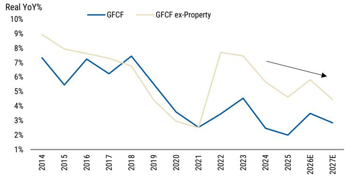

line chart

| Year   | GFCF  | GFCF ex-Property |
| ------ | ----- | ---------------- |
| 2014   | 7.5%  | 9.0%             |
| 2015   | 5.5%  | 8.0%             |
| 2016   | 7.5%  | 7.5%             |
| 2017   | 6.5%  | 7.0%             |
| 2018   | 7.5%  | 6.5%             |
| 2019   | 5.0%  | 4.5%             |
| 2020   | 3.5%  | 3.0%             |
| 2021   | 2.5%  | 2.5%             |
| 2022   | 3.5%  | 7.5%             |
| 2023   | 4.5%  | 7.0%             |
| 2024   | 2.5%  | 5.5%             |
| 2025   | 2.0%  | 4.5%             |
| 2026E  | 3.5%  | 6.0%             |
| 2027E  | 3.0%  | 4.5%             |

Source: NBS, Moragn Stanley Research estimates

Exhibit 9: The "baton" of investment has been passed from sectors with overcapacity to those with less oversupply, for now  
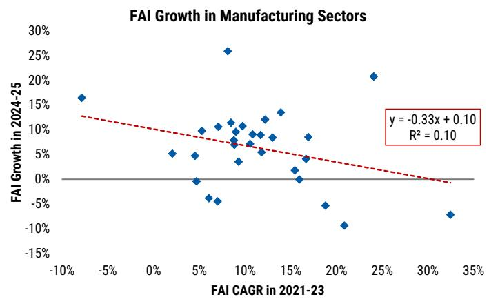

scatter plot

| FAI CAGR in 2021-23 | FAI Growth in 2024-25 |
| ------------------- | --------------------- |
| -10%                | 16%                   |
| -5%                 | 10%                   |
| 0%                  | 5%                    |
| 5%                  | 0%                    |
| 10%                 | 25%                   |
| 15%                 | 10%                   |
| 20%                 | -10%                  |
| 25%                 | 20%                   |
| 30%                 | -10%                  |
| 35%                 | -15%                  |

Source: NBS, MS

## #4: Would stronger exports help?

Our chief economist for Asia, Chetan Ahya, believes that the region is entering its strongest industrial cycle since the mid-2000s: The key drivers would be AI and AI-related infrastructure, energy transition, and defence; their second-order demand through the supply chain will likely broaden the cycle further. The team thus expects a 7% CAGR in Asia's capex through 2030, \~3x the pace of the past three years.

This could provide some relief to China's overcapacity problems: China is set to be one of the primary beneficiaries, given its global leading position across most manufacturing segments. In particular, China commands shares of 70-90% in global production capacity of the "new trio" (EVs, batteries, and solar), which could benefit from the rising global energy-transition demand fueled by the prevailing oil shock.

We thus expect China's export growth to be sustained at 10% this year (vs. 2.2% on average in 2023-25). We see room for its global export share to expand towards 16.5% by 2030 (vs. 15% now). The structurally stronger external demand should help mitigate China's excess capacity problem in select sectors.

## However, relying on external demand has limits:

\- Pass-through of export strength to domestic demand is weaker than past cycles: Our empirical study shows that each incremental dollar of export growth generates fewer jobs than it used to, given that:

• Manufacturers tend to utilize the existing production lines better, rather than build up factories and hiring, in view of the prevailing excess capacity issues.  
• As export mix has shifted decisively up the value chain towards capital- and technology-intensive industries, its employment multipliers have declined.

\- High reliance on external demand would expose the economy to global cycle...While gross exports account for only \~20% of nominal GDP, net exports contributed \~30% of real GDP growth in 2024-25 (vs. merely 5% in the previous decade). This would make the economy more sensitive to global cycle swings.

\- ...and trade tensions: A persistently large trade surplus risks renewed protectionism from key trading partners, with the EU's warning against a potential trade war with China being the latest evidence. While China may partly mitigate shocks via market diversification and trade rerouting, trade barrier re-escalation may weigh on business sentiment and disrupt manufacturing activities.

Exhibit 10: Asia is likely to enter its strongest industrial cycle since the mid-2000s  
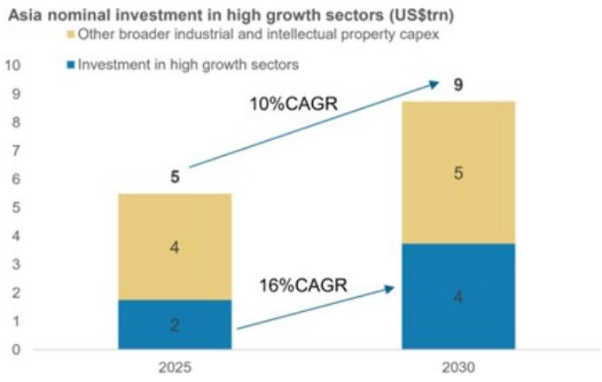

stacked bar chart

Asia nominal investment in high growth sectors (US$trn)
| Year | Investment in high growth sectors (US$trn) | Other broader industrial and intellectual property capex (US$trn) | CAGR (%) |
| :--- | :--- | :--- | :--- |
| 2025 | 2 | 4 | 16 |
| 2030 | 4 | 5 | 10 |

Source: : CEIC, MS estimates.

Exhibit 12: Weaker job multiplier of corporate earnings, given overcapacity and a more capital-intensive export mix  
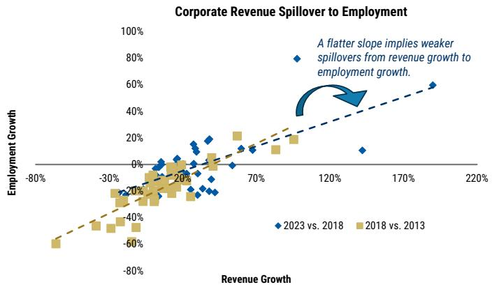

scatter plot

| Revenue Growth | Employment Growth | Comparison        |
| -------------- | ----------------- | ----------------- |
| -80%           | -60%              | 2018 vs. 2013     |
| -30%           | -40%              | 2018 vs. 2013     |
| 0%             | 0%                | 2018 vs. 2013     |
| 70%            | 20%               | 2018 vs. 2013     |
| 120%           | 40%               | 2018 vs. 2013     |
| 170%           | 60%               | 2018 vs. 2013     |
| 220%           | 80%               | 2018 vs. 2013     |

Source: NBS, Economic Census, MS

Exhibit 11: China is set to be one of the primary beneficiaries, given its leading position in global supply chains  
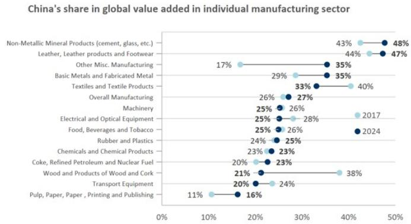

bar chart

China's share in global value added in individual manufacturing sector
| Category | Value (%) |
|---|---|
| Non-Metallic Mineral Products (cement, glass, etc.) | 48 |
| Leather, Leather products and Footwear | 47 |
| Other Misc. Manufacturing | 35 |
| Basic Metals and Fabricated Metal | 35 |
| Textiles and Textile Products | 40 |
| Overall Manufacturing | 27 |
| Machinery | 26 |
| Electrical and Optical Equipment | 28 |
| Food, Beverages and Tobacco | 26 |
| Rubber and Plastics | 25 |
| Chemicals and Chemical Products | 23 |
| Coke, Refined Petroleum and Nuclear Fuel | 23 |
| Wood and Products of Wood and Cork | 38 |
| Transport Equipment | 24 |
| Pulp, Paper, Paper, Printing and Publishing | 16 |
| Non-Metallic Mineral Products (cement, glass, etc.) | 43 |
| Leather, Leather products and Footwear | 44 |
| Other Misc. Manufacturing | 17 |
| Basic Metals and Fabricated Metal | 29 |
| Textiles and Textile Products | 33 |
| Overall Manufacturing | 26 |
| Machinery | 25 |
| Electrical and Optical Equipment | 25 |
| Food, Beverages and Tobacco | 26 |
| Rubber and Plastics | 24 |
| Chemicals and Chemical Products | 23 |
| Coke, Refined Petroleum and Nuclear Fuel | 20 |
| Wood and Products of Wood and Cork | 21 |
| Transport Equipment | 20 |
| Pulp, Paper, Paper, Printing and Publishing | 11 |

Source: ADB WIOT, MS

Exhibit 13: Increased external demand reliance would increase China's vulnerability to global cycle changes  
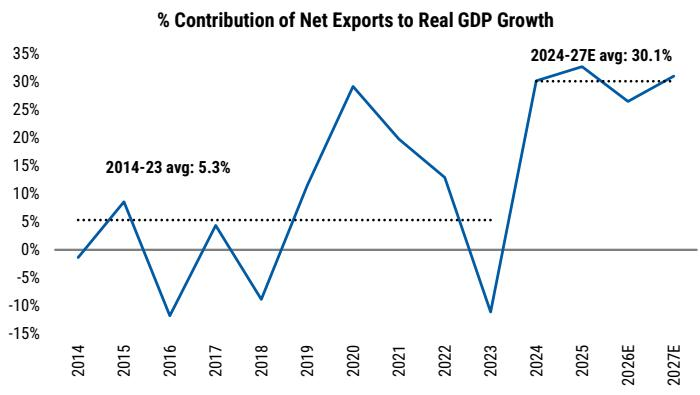

line chart

| Year   | % Contribution of Net Exports to Real GDP Growth |
| ------ | ----------------------------------------------- |
| 2014   | -2.5%                                           |
| 2015   | 8.5%                                            |
| 2016   | -10.5%                                          |
| 2017   | 4.5%                                            |
| 2018   | -8.5%                                           |
| 2019   | 15.5%                                           |
| 2020   | 29.5%                                           |
| 2021   | 18.5%                                           |
| 2022   | 12.5%                                           |
| 2023   | -10.5%                                          |
| 2024   | 30.5%                                           |
| 2025E  | 32.5%                                           |
| 2026E  | 26.5%                                           |
| 2027E  | 30.1%                                           |

Source: CEIC, MS

## #5. What is the way out?

The case of Hefei shows that smarter industrial policy can reduce sectoral misallocation and foster winners in emerging sectors, but cannot correct the structural incentives that channel local government resources toward investment over consumption. Stronger external demand may absorb existing inventory, but its transmission to jobs and spending is weaker than before given a more capital-intensive product mix.

## In this sense, the core solution lies in rebalancing toward domestic consumption, which requires system-level reforms:

- Cadre evaluation reform: Shift verifiable performance metrics away from output volume toward household income, consumption, and environmental quality.  
- Fiscal system reform: Reduce reliance on indirect taxes (e.g., VAT) that reward scale expansion, and transition toward direct taxes linked to efficiency and profitability. Reorient central-local transfers from project-based allocation to public service provision.  
- Social welfare reform: Strengthen the safety net to lower precautionary savings (currently \~33% of disposable income). This requires reallocating fiscal resources from investment, increasing SOE equity transfers, and building a multi-tier social security system.

Nonetheless, progress to date has been incremental: The consumption push in the 15th Five-Year Plan remains qualitative and non-binding, and recent geopolitical tensions may lead Beijing to double down on its supply-centric approach to ensure energy security and tech self-sufficiency. Without these reforms, improved industrial policy and stronger exports may lift the composition and cyclical trajectory of growth—but they cannot resolve the structural surplus that keeps deflationary pressure alive.

Exhibit 14: Local government incentives should be reoriented towards consumption  
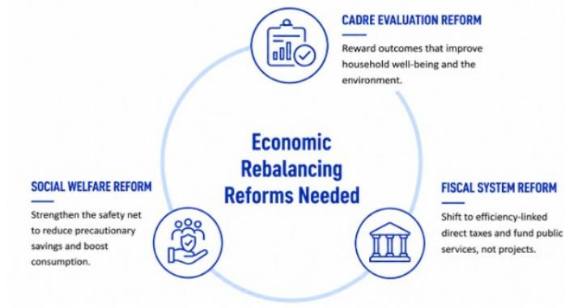

flowchart

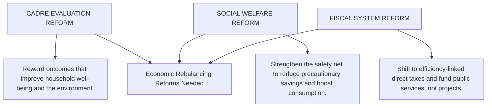

Source: MS

Exhibit 15: Five-year plan remains supply-centric  
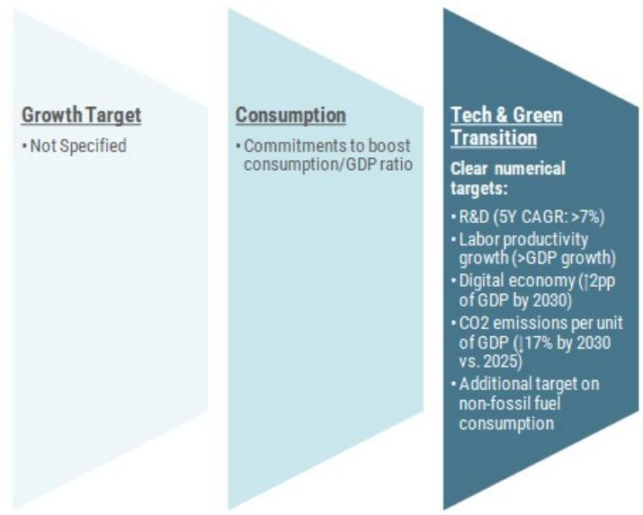

flowchart

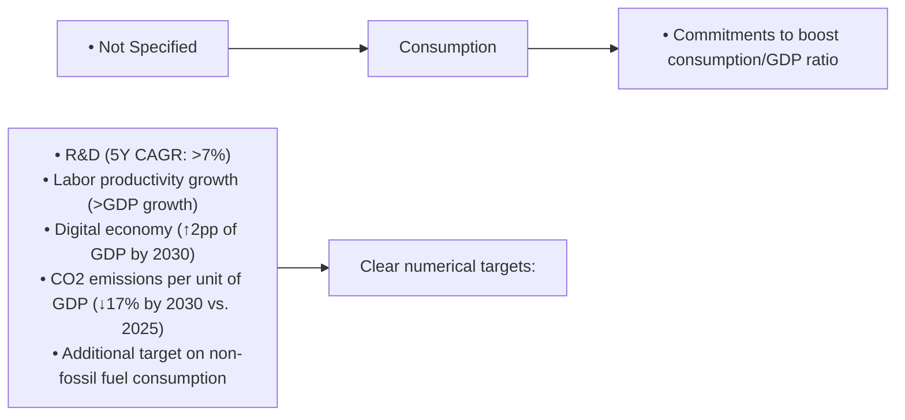

Source: Government website, MS

## Disclosure Section

Information and opinions in MS were prepared or are disseminated by one or more of the following, which accept responsibility for its contents: MS Asia Limited, and/or MS Asia (Singapore) Pte. (Registration number 199206298Z) and/or MS Asia (Singapore) Securities Pte Ltd (Registration number 200008434H), regulated by the Monetary Authority of Singapore (which accepts legal responsibility for its contents and should be contacted with respect to any matters arising from, or in connection with, MS), and/or MS Taiwan Limited and/or MS & Co International plc, Seoul Branch, and/or MS Australia Limited (A.B.N. 67 003 734 576, holder of Australian financial services license No. 233742), and/or MS Wealth Management Australia Pty Ltd (A.B.N. 19 009 145 555, holder of Australian financial services license No. 240813, and/or MS India Company Private Limited having Corporate Identification No (CIN) U22990MH1998PTC115305, regulated by the Securities and Exchange Board of India ("SEBI") and holder of licenses as a Research Analyst (SEBI Registration No. INH000001105), Stock Broker (SEBI Stock Broker Registration No. INZ000244438), Merchant Banker (SEBI Registration No. INM000011203), and depository participant with National Securities Depository Limited (SEBI Registration No. IN-DP-NSDL-567-2021) having registered office at Altimus, Level 39 & 40, Pandurang Budhkar Marg, Worli, Mumbai 400018, India; Telephone no. +91-22-61181000; Compliance Officer Details: Mr. Tejarshi Hardas, Tel. No.: +91-22-61181000 or Email: tejarshi.hardas@morganstanley.com; Grievance officer details: Mr. Tejarshi Hardas, Tel. No.: +91-22-61181000 or Email: msic-compliance@morganstanley.com which accepts the responsibility for its contents and should be contacted with respect to any matters arising from, or in connection with, MS and their affiliates (collectively, "MS"). MS India Company Private Limited (MSICPL) may use AI tools in providing research services. All recommendations contained herein are made by the duly qualified research analysts; For important disclosures, stock price charts and equity rating histories regarding companies that are the subject of this report, please see the MS Disclosure Website at www.morganstanley.com/eqr/disclosures/webapp/generalresearch, or contact your investment representative or MS at 1585 Broadway, (Attention: Research Management), New York, NY, 10036 USA.

For valuation methodology and risks associated with any recommendation, rating or price target referenced in this research report, please contact the Client Support Team as follows: US/Canada +1 800 303-2495; Hong Kong +852 2848-5999; Latin America +1 718 754-5444 (U.S.); London +44 (0)20-7425-8169; Singapore +65 6834-6860; Sydney +61 (0)2-9770-1505; Tokyo +81 (0)3-6836-9000. Alternatively you may contact your investment representative or MS at 1585 Broadway, (Attention: Research Management), New York, NY 10036 USA.

## Global Research Conflict Management Policy

MS has been published in accordance with our conflict management policy, which is available at www.morganstanley.com/institutional/research/conflictpolicies. A Portuguese version of the policy can be found at www.morganstanley.com.br

## Important Disclosures

MS is not acting as a municipal advisor and the opinions or views contained herein are not intended to be, and do not constitute, advice within the meaning of Section 975 of the Dodd-Frank Wall Street Reform and Consumer Protection Act.

MS does not provide individually tailored investment advice. MS has been prepared without regard to the circumstances and objectives of those who receive it. MS recommends that investors independently evaluate particular investments and strategies, and encourages investors to seek the advice of a financial adviser. The appropriateness of an investment or strategy will depend on an investor's circumstances and objectives. The securities, instruments, or strategies discussed in MS may not be suitable for all investors, and certain investors may not be eligible to purchase or participate in some or all of them. MS is not an offer to buy or sell or the solicitation of an offer to buy or sell any security/instrument or to participate in any particular trading strategy. The value of and income from your investments may vary because of changes in interest rates, foreign exchange rates, default rates, prepayment rates, securities/instruments prices, market indexes, operational or financial conditions of companies or other factors. There may be time limitations on the exercise of options or other rights in securities/instruments transactions. Past performance is not necessarily a guide to future performance. Estimates of future performance are based on assumptions that may not be realized. If provided, and unless otherwise stated, the closing price on the cover page is that of the primary exchange for the subject company's securities/instruments.

The fixed income research analysts, strategists or economists principally responsible for the preparation of MS have received compensation based upon various factors, including quality, accuracy and value of research, firm profitability or revenues (which include fixed income trading and capital markets profitability or revenues), client feedback and competitive factors. Fixed Income Research analysts', strategists' or economists' compensation is not linked to investment banking or capital markets transactions performed by MS or the profitability or revenues of particular trading desks.

With the exception of information regarding MS, MS is based on public information. MS makes every effort to use reliable, comprehensive information, but we make no representation that it is accurate or complete. We have no obligation to tell you when opinions or information in MS change apart from when we intend to discontinue equity research coverage of a subject company. Facts and views presented in MS have not been reviewed by, and may not reflect information known to, professionals in other MS business areas, including investment banking personnel.

MS may make investment decisions that are inconsistent with the recommendations or views in this report.

To our readers based in Taiwan or trading in Taiwan securities/instruments: Information on securities/instruments that trade in Taiwan is distributed by MS Taiwan Limited ("MSTL"). Such information is for your reference only. The reader should independently evaluate the investment risks and is solely responsible for their investment decisions. MS may not be distributed to the public media or quoted or used by the public media without the express written consent of MS. Any non-customer reader within the scope of Article 7-1 of the Taiwan Stock Exchange Recommendation Regulations accessing and/or receiving MS is not permitted to provide MS to any third party (including but not limited to related parties, affiliated companies and any other third parties) or engage in any activities regarding MS which may create or give the appearance of creating a conflict of interest. Information on securities/instruments that do not trade in Taiwan is for informational purposes only and is not to be construed as a recommendation or a solicitation to trade in such securities/instruments. MSTL may not execute transactions for clients in these securities/instruments.

MS is not incorporated under PRC law and the research in relation to this report is conducted outside the PRC. MS does not constitute an offer to sell or the solicitation of an offer to buy any securities in the PRC. PRC investors shall have the relevant qualifications to invest in such securities and shall be responsible for obtaining all relevant approvals, licenses, verifications and/or registrations from the relevant governmental authorities themselves. Neither this report nor any part of it is intended as, or shall constitute, provision of any consultancy or advisory service of securities investment as defined under PRC law. Such information is provided for your reference only.

MS is disseminated in Brazil by MS C.T.V.M. S.A. located at Av. Brigadeiro Faria Lima, 3600, 6th floor, São Paulo - SP, Brazil; and is regulated by the Comissão de Valores Mobiliários; in Mexico by MS México, Casa de Bolsa, S.A. de C.V which is regulated by Comision Nacional Bancaria y de Valores. Paseo de los Tamarindos 90, Torre 1, Col. Bosques de las Lomas Floor 29, 05120 Mexico City; in Japan by MS MUFG Securities Co., Ltd. and, for Commodities related research reports only, MS Capital Group Japan Co., Ltd; in Hong Kong by MS Asia Limited (which accepts responsibility for its contents) and by MS Bank Asia Limited; in Singapore by MS Asia (Singapore) Pte. (Registration number 199206298Z) and/or MS Asia (Singapore) Securities Pte Ltd (Registration number 200008434H), regulated by the Monetary Authority of

Singapore (which accepts legal responsibility for its contents and should be contacted with respect to any matters arising from, or in connection with, MS) and by MS Bank Asia Limited, Singapore Branch (Registration number T14FC0118); in Australia to "wholesale clients" within the meaning of the Australian Corporations Act by MS Australia Limited A.B.N. 67 003 734 576, holder of Australian financial services license No. 233742, which accepts responsibility for its contents; in Australia to "wholesale clients" and "retail clients" within the meaning of the Australian Corporations Act by MS Wealth Management Australia Pty Ltd (A.B.N. 19 009 145 555, holder of Australian financial services license No. 240813, which accepts responsibility for its contents; in Korea by MS & Co International plc, Seoul Branch; in India by MS India Company Private Limited having Corporate Identification No (CIN) U22990MH1998PTC115305, regulated by the Securities and Exchange Board of India ("SEBI") and holder of licenses as a Research Analyst (SEBI Registration No. INH000001105); Stock Broker (SEBI Stock Broker Registration No. INZ000244438), Merchant Banker (SEBI Registration No. INM000011203), and depository participant with National Securities Depository Limited (SEBI Registration No. IN-DP-NSDL-567-2021) having registered office at Altimus, Level 39 & 40, Pandurang Budhkar Marg, Worli, Mumbai 400018, India; Telephone no. +91-22-61181000; Compliance Officer Details: Mr. Tejarshi Hardas, Tel. No.: +91-22-61181000 or Email: tejarshi.hardas@morganstanley.com; Grievance officer details: Mr. Tejarshi Hardas, Tel. No.: +91-22-61181000 or Email: msic-compliance@morganstanley.com. MS India Company Private Limited (MSICPL) may use AI tools in providing research services. All recommendations contained herein are made by the duly qualified research analysts; in Canada by MS Canada Limited; in Germany and the European Economic Area where required by MS Europe S.E., regulated by Bundesanstalt fuer Finanzdienstleistungsaufsicht (BaFin) under the reference number 149169; in the United States by MS & Co. LLC, which accepts responsibility for its contents. MS & Co. International plc, authorized by the Prudential Regulation Authority and regulated by the Financial Conduct Authority and the Prudential Regulation Authority, disseminates in the UK research that it has prepared, and research which has been prepared by any of its affiliates, only to persons who (i) are investment professionals falling within Article 19(5) of the Financial Services and Markets Act 2000 (Financial Promotion) Order 2005 (as amended, the "Order"); (ii) are persons who are high net worth entities falling within Article 49(2)(a) to (d) of the Order; or (iii) are persons to whom an invitation or inducement to engage in investment activity (within the meaning of section 21 of the Financial Services and Markets Act 2000, as amended) may otherwise lawfully be communicated or caused to be communicated. RMB MS Proprietary Limited is a member of the JSE Limited and A2X (Pty) Ltd. RMB MS Proprietary Limited is a joint venture owned equally by MS International Holdings Inc. and RMB Investment Advisory (Proprietary) Limited, which is wholly owned by FirstRand Limited. The information in MS is being disseminated by MS Saudi Arabia, regulated by the Capital Market Authority in the Kingdom of Saudi Arabia, and is directed at Sophisticated investors only.

The trademarks and service marks contained in MS are the property of their respective owners. Third-party data providers make no warranties or representations relating to the accuracy, completeness, or timeliness of the data they provide and shall not have liability for any damages relating to such data. The Global Industry Classification Standard (GICS) was developed by and is the exclusive property of MSCI and S&P.

MS, or any portion thereof may not be reprinted, sold or redistributed without the written consent of MS.

Indicators and trackers referenced in MS may not be used as, or treated as, a benchmark under Regulation EU 2016/1011, or any other similar framework.

The information in MS is being communicated by MS & Co. International plc (DIFC Branch), regulated by the Dubai Financial Services Authority (the DFSA) or by MS & Co. International plc (ADGM Branch), regulated by the Financial Services Regulatory Authority Abu Dhabi (the FSRA), and is directed at Professional Clients only, as defined by the DFSA or the FSRA, respectively. The financial products or financial services to which this research relates will only be made available to a customer who we are satisfied meets the regulatory criteria of a Professional Client. A distribution of the different MS Research ratings or recommendations, in percentage terms for Investments in each sector covered, is available upon request from your sales representative.

The information in MS is being communicated by MS & Co. International plc (QFC Branch), regulated by the Qatar Financial Centre Regulatory Authority (the QFCRA), and is directed at business customers and market counterparties only and is not intended for Retail Customers as defined by the QFCRA.

As required by the Capital Markets Board of Turkey, investment information, comments and recommendations stated here, are not within the scope of investment advisory activity. Investment advisory service is provided exclusively to persons based on their risk and income preferences by the authorized firms. Comments and recommendations stated here are general in nature. These opinions may not fit to your financial status, risk and return preferences. For this reason, to make an investment decision by relying solely to this information stated here may not bring about outcomes that fit your expectations.

Registration granted by SEBI and certification from the National Institute of Securities Markets (NISM) in no way guarantee performance of the intermediary or provide any assurance of returns to investors. Investment in securities market are subject to market risks. Read all the related documents carefully before investing.

© 2026 MS