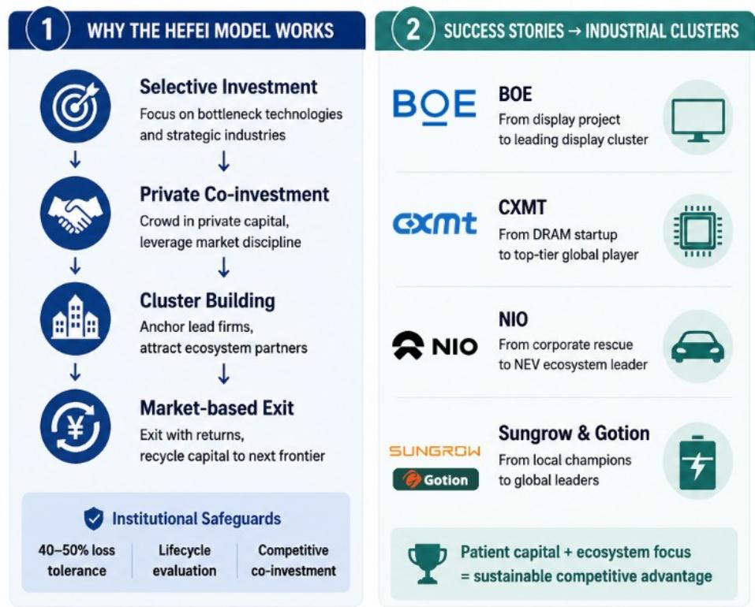
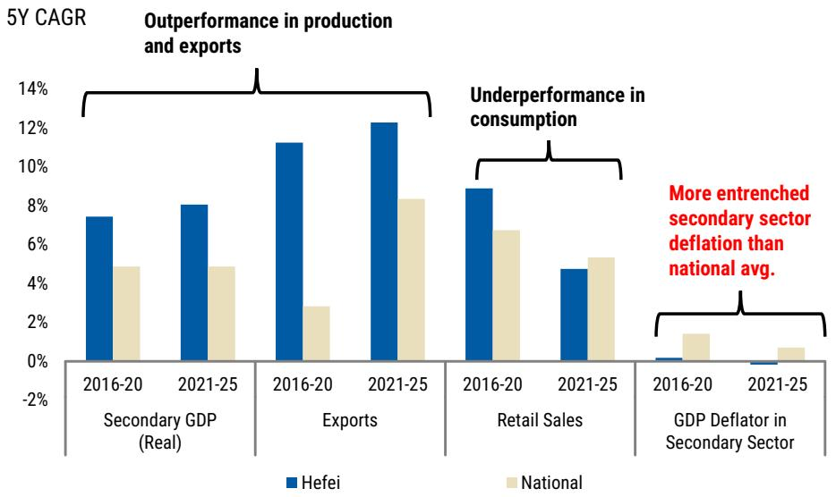

# The Hefei Paradox: Why Smarter Industrial Policy Cannot Substitute for Economic Rebalancing

The debate over China's economic trajectory has reached a critical inflection point. A global capital expenditure super-cycle, driven by artificial intelligence, energy transition, and defense spending, is projected to nearly triple investment pace across the region, reaching $16 trillion by 2030. Against this backdrop, an increasingly influential school of thought argues that China has found a better way forward: productivity-focused, ecosystem-driven industrial policy can cultivate globally competitive new industries, capture structurally stronger external demand, and avoid the excess capacity traps of the past—all without painful economic rebalancing. This view has gained credibility from the 15th Five-Year Plan's "unified national market" initiative and top leadership pledges to reduce wasteful investment in future industries.

The city of Hefei has become the primary exhibit for this argument. It rescued NIO from near-bankruptcy, backed CXMT to become China's sole DRAM mass producer, and seeded the nation's rise in advanced display manufacturing. If any place demonstrates that smarter industrial policy can work, it is Hefei.

But a careful examination of Hefei's actual economic outcomes reveals a troubling paradox. Despite producing national and global champions across new energy vehicles, flat-panel displays, and semiconductors, Hefei has not escaped the deflationary pressures that plague China's broader economy. Its consumer goods sales have lagged the national average, and its price deflation has been more severe. This is not a failure of execution—it is a structural reality that no amount of improved industrial policy can fix.

The hard truth is this: better industrial policy can improve what China invests in, but it cannot change how much China invests. The supply-demand imbalance is rooted in local government incentives that reward production volume over household income and consumption. Stronger exports can buy time, but they cannot resolve the structural surplus that keeps deflationary pressure alive. The real cure remains what it has always been: decisive economic rebalancing reforms.

## The Hefei Model Works Better Than Traditional Industrial Policy, But Even It Cannot Escape the Supply-Demand Trap

Hefei's approach represents a genuine improvement over the blanket subsidy model that characterized earlier rounds of Chinese industrial policy. The city government acted as an ecosystem planner and patient capital investor, not a simple subsidy provider. It mobilized fiscal resources to anchor lead firms, promoted public-private co-investment, built supplier networks around anchor firms, conducted market-based exits, and recycled gains into the next strategic sector. This approach reduced subsidy-induced market distortion and solved funding bottlenecks at the early stage of emerging sector development, when private capital remained hesitant.

The results are impressive by any standard. Hefei backed BOE's sixth-generation TFT-LCD line in 2008, filling a critical gap in domestic 32-inch panel production and reducing import dependence. It subsequently attracted BOE's 8.5-generation and the world's first 10.5-generation lines, building a supplier ecosystem that now underpins roughly 10 percent of global display capacity. In DRAM, Hefei funded three-quarters of the initial capital to launch CXMT in 2016, a bet few other cities were willing to make. CXMT is now China's sole DRAM mass producer and the world's fourth-largest. In new energy vehicles, Hefei invested 7 billion RMB to rescue NIO from near-bankruptcy in 2020, catalyzing a broader ecosystem that now includes BYD, Volkswagen, and Chang'an, with over 500 component suppliers.

Yet the macroeconomic outcomes tell a different story. Over the past five years, Hefei's secondary sector GDP grew at an 8 percent compound annual rate, far exceeding the national average of 4.8 percent. Its exports grew at 12.3 percent annually, versus 8.3 percent nationally. But retail sales grew at only 4.7 percent, below the national average of 5.3 percent. And critically, the GDP deflator in the secondary sector was essentially zero, compared to 0.6 percent nationally. Hefei produced more, exported more, but consumed less in relative terms and experienced more severe deflation.

This is a microcosm of China's broader challenge. Even with improved industrial policy, the fundamental shift is in what China invests in, not how much it invests. The supply-demand gap remains wide because the incentives that drive overinvestment have not changed.

## The Unified National Market Initiative Is Directionally Correct but Faces Structural Implementation Obstacles

Beijing is increasingly aware of the overcapacity problem. Since July 2025, the anti-involution campaign has targeted disorderly price competition and the flow of investment and credit into sectors with excess capacity. The 15th Five-Year Plan takes a further step by promoting a unified national market to address redundant construction and zero-sum competition among local governments. Top leadership has re-emphasized the need for differentiated development across regions and prevention of money-burning investment in future industries.

These initiatives are directionally correct, but their implementation faces high structural obstacles. Cross-provincial capacity coordination cannot revert to a top-down model, yet market-based mechanisms for local specialization remain underdeveloped. The cadre evaluation system—the performance appraisal system for government officials—still prioritizes output and investment growth. China's value-added tax-heavy tax system inherently rewards production over consumption. Without changes to these fundamental incentives, overcapacity curbs will only reallocate investment across sectors, moving it away from more oversupplied industries toward less saturated ones, rather than shifting resources toward consumption or social welfare.

The supply-demand gap remains wide because the incentive structure remains unchanged. Improved industrial policy can make the supply side more efficient, but it cannot make the demand side larger. That requires a fundamentally different approach.

## Stronger Exports Offer Temporary Relief but Cannot Resolve Structural Imbalances

The global capex super-cycle provides genuine support for China's export machine. We expect China's export growth to be sustained at 10 percent this year, with room for its global export share to expand toward 16.5 percent by 2030, up from 15 percent currently. The AI and energy transition-driven global capex super-cycle should help mitigate China's excess capacity problem in select sectors.

But this relief has clear limits. The transmission from exports to domestic income is weaker than in previous cycles, given a more capital-intensive product mix with lower employment multipliers. The new economy is still too narrow and biased toward capital and skills. Rapid AI diffusion is widening the gap by raising labor productivity while displacing routine workers in the near term. The result is strong output but weak transmission to broad income gains, which keeps consumption soft and prevents the new economy from becoming a self-sustaining domestic-demand engine.

Moreover, a growth model that depends on foreign demand to absorb domestic oversupply is inherently vulnerable to global cycle turns and trade tensions. The stronger external demand may buy time, but it cannot resolve the structural surplus that keeps deflationary pressure alive.

## The K-Shaped Economy Is Here to Stay, and Reflation Remains Narrow and Imported

We expect China's real GDP growth to reach 4.8 percent in 2026 and 4.7 percent in 2027. The key driver would be strength in the new economy—exports and manufacturing capex related to AI, energy transition, and emerging tech sectors. The old economy stands in contrast: household consumption would be constrained by a soft labor market and ongoing property adjustment.

The result is a K-shaped economy that persists. The new economy continues to strengthen but remains too narrow and capital-intensive to generate broad income gains. The old economy struggles with insufficient demand. The two-speed economy is stable in aggregate but deeply unbalanced beneath the surface.

Reflation is narrow and largely imported, not demand-driven. Energy costs and AI and green transition demand may push producer price inflation to 1.5 percent in 2026, its first positive reading in four years. But the improvement has been concentrated in upstream sectors such as materials and energy, and AI-related sectors, with limited pass-through to downstream and consumption-linked sectors given weak final demand.

We do not think supply-side consolidation and better exports alone can drive broad reflation. The 2015 to 2017 precedent, often cited as a supply-driven success in reflation, was triggered by a massive concurrent demand stimulus—shantytown renovation to fuel household leveraging. Comparable demand stimulus is not in sight in this cycle. We thus expect producer price inflation to turn negative again in 2027 as the energy impulse fades, with consumer price inflation and the GDP deflator remaining lukewarm.

## What the Report Does Not Fully Answer: Can the Political Economy of Reform Shift in Time?

The report makes a compelling case that decisive economic rebalancing is the core solution. This requires shifting cadre evaluation from output volume toward household income and consumption, reducing fiscal revenue reliance on value-added tax in favor of direct taxes that reward efficiency over scale, and strengthening social safety nets to unwind elevated precautionary savings for consumption.

But the report leaves several meaningful open questions. First, what is the political economy trigger for these reforms? Progress to date has been incremental. The 15th Five-Year Plan's consumption push remains qualitative and non-binding. Geopolitical tensions may further entrench Beijing's supply-centric approach. The report does not fully address what would create sufficient urgency for the fundamental incentive restructuring that rebalancing requires.

Second, how would the transition be managed? Shifting from investment-driven to consumption-driven growth would involve significant adjustment costs. Employment in capital-intensive new economy sectors would need to be complemented by labor-intensive service sector growth. The tax system restructuring would create winners and losers across provinces and industries. The report does not fully explore the transition path and its associated risks.

Third, what is the role of the global environment? The report acknowledges that stronger exports offer temporary relief, but it does not fully explore how different global scenarios—trade war escalation, technology decoupling, or a synchronized global downturn—would affect the feasibility of the reform path. The external environment is not just a source of demand; it is also a constraint on policy space.

These questions do not invalidate the report's core argument. They simply highlight that the path from diagnosis to cure is not straightforward, and the timing and sequencing of reforms matter enormously.

## A Decision Framework for Investors: How to Navigate the Hefei Paradox

For investors trying to make sense of this landscape, we offer a simple decision framework organized around three questions.

First, what is the quality of industrial policy in a given sector? The Hefei model demonstrates that ecosystem-based industrial policy can produce genuine winners. Investors should favor sectors where the government acts as a patient capital investor and ecosystem planner, rather than a blanket subsidy provider. Sectors with strong anchor firms, developed supplier networks, and market-based exit mechanisms are more likely to produce sustainable competitive advantages.

Second, what is the sector's exposure to the supply-demand imbalance? Even the best industrial policy cannot escape the structural surplus. Investors should be wary of sectors where capacity expansion is racing ahead of demand growth, regardless of the quality of industrial policy. The deflationary pressure is real and will eventually compress margins across the board. Sectors with strong export demand may offer temporary relief, but this is a cyclical cushion, not a structural solution.

Third, what is the probability of rebalancing reforms? The report makes clear that without fundamental changes to cadre evaluation, fiscal structure, and social safety nets, the supply-demand gap will persist. Investors should monitor progress on these three dimensions as leading indicators of structural improvement. Incremental progress suggests the K-shaped economy will persist. Decisive action would signal a genuine shift in the growth model.

The framework suggests that the most attractive opportunities lie at the intersection of high-quality industrial policy and strong end-market demand, with limited exposure to the structural surplus. The least attractive opportunities are in sectors where poor industrial policy meets excess capacity and weak demand.

## The Unresolved Analytical Question That Should Drive Your Research

The Hefei paradox raises a fundamental question that the report does not fully answer: If improved industrial policy and stronger exports cannot resolve the structural imbalance, what combination of external pressure and internal recognition would be sufficient to trigger the rebalancing reforms that the report identifies as necessary?

This is not an academic question. The answer determines whether the current growth model is sustainable for another five years or whether a more disruptive adjustment is inevitable. It determines whether the K-shaped economy is a transitional phase or a permanent state. It determines whether the deflationary pressure is a cyclical phenomenon that will resolve with time or a structural condition that requires fundamental reform.

The report provides the diagnosis and the prescription. What it does not provide is the catalyst. That is the question that should drive your own research and analysis.

Join the community to read the full report and review the original charts.

*This article is for learning and discussion only and does not constitute investment advice.*

Personal reading notes and learning share only. Not investment advice.

