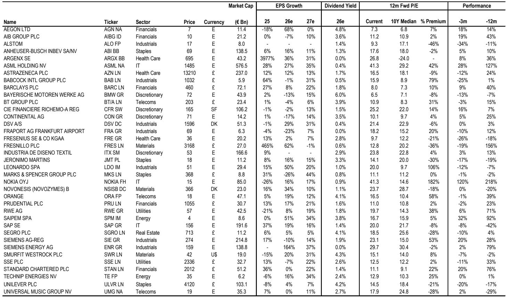
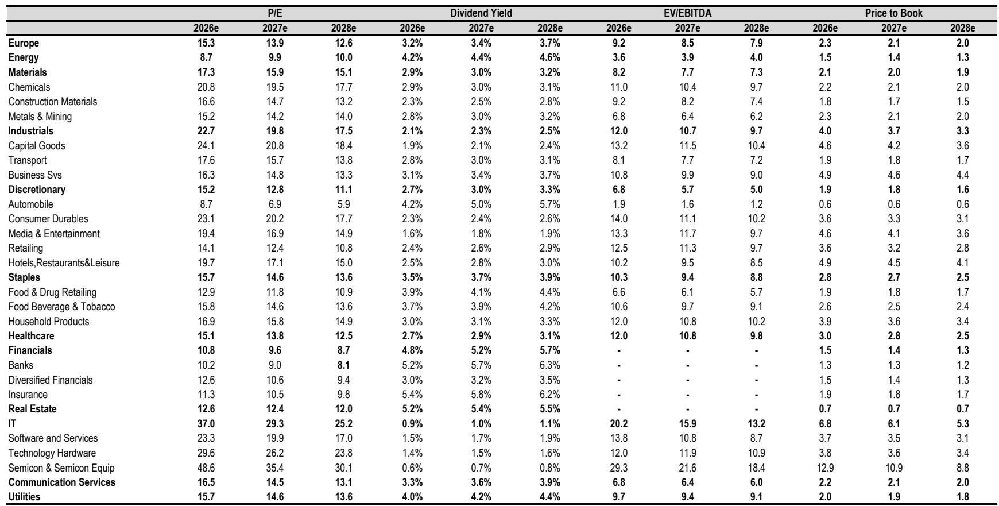
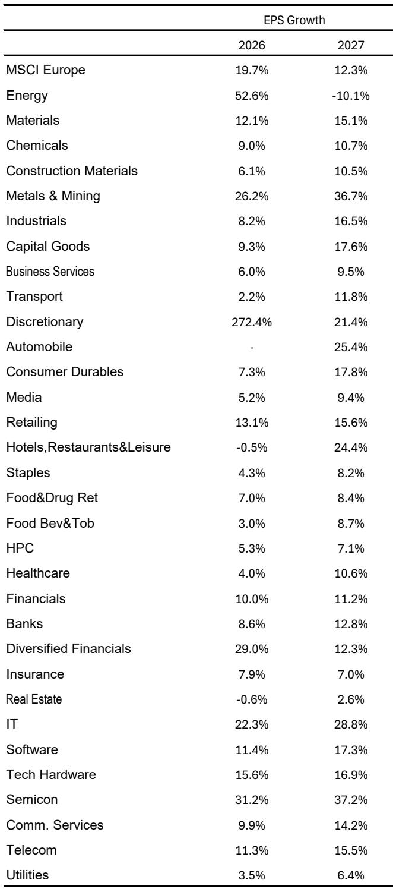

# The Case for a European Equity Breakout in the Second Half

European equities have staged a remarkable recovery from their geopolitical trough, with the Euro Stoxx 50 now trading near its year highs. Yet the region still lags the United States by roughly 11 percent in dollar terms since late February. The central question for institutional investors is not whether Europe can rally, but what specific conditions would trigger a sustained breakout and relative outperformance. The answer lies in a convergence of three factors that are currently underappreciated by the market: the limited nature of ECB tightening, an imminent inflection in Eurozone earnings momentum, and the eventual dissipation of geopolitical overhang from the Iran conflict.

The conventional narrative holds that Europe is structurally disadvantaged—burdened by energy sensitivity, weaker growth, and a lack of technology exposure. This view is not wrong, but it is incomplete. What the market is missing is that the very factors driving Europe's underperformance are approaching an inflection point. The divergence between Eurozone and US activity is near its widest levels, investor positioning is at the 36th percentile, and forward price-to-earnings ratios at 15x are far from demanding. These conditions historically precede periods of mean reversion, not continued underperformance.

The strategic implication is clear: investors who wait for confirmation of a European breakout will miss the entry point. The current window offers a compelling risk-reward for adding exposure, particularly in sectors and stocks that benefit from a normalisation of geopolitical risk and a stabilisation of interest rate expectations. This is not a call for a new secular bull market in Europe, but rather a tactical opportunity within a broader global equity allocation.

## The Iran Conflict Has Created a Valuation Dislocation That Will Reverse

Since the escalation of the Iran conflict in late February, Eurozone equities have underperformed not only the United States but also emerging markets and other developed market peers. This is not coincidental. Europe's geographic proximity to the conflict zone, its energy dependence, and its exposure to trade disruptions have made it the most vulnerable major equity market to geopolitical shocks in the region.

The data is stark. From March 1st through the current period, the MSCI Eurozone has delivered negative returns in dollar terms, while the MSCI US has gained nearly 11 percent. Even MSCI Emerging Markets has outperformed, rising over 11 percent during the same period. This divergence reflects a genuine economic impact—the conflict has weighed on Eurozone business confidence and PMI data—but the magnitude of the underperformance now exceeds what the fundamental damage justifies.

What makes this dislocation particularly interesting from a strategic standpoint is the asymmetry of outcomes. If the Iran situation escalates further, European equities would likely underperform more, but the potential downside is limited by the fact that both parties have strong incentives to reach a resolution. If the situation improves, however, the relief rally could be substantial, as the current discount already prices in a significant risk premium. The market is effectively offering investors a free option on geopolitical normalisation, with the current price reflecting a worst-case scenario that is unlikely to materialise.

## ECB Tightening Will Be Shallow, Removing a Key Headwind for European Equities

The European Central Bank is widely expected to hike rates this week, but the more important question is what happens after that. The consensus view assumes a series of rate increases that would tighten financial conditions and weigh on equity valuations. This assumption is likely wrong.

The current environment is fundamentally different from 2022, when European real yields were at record lows and the ECB had to play catch-up. Today, real yields are already at elevated levels, and the economic backdrop is softer. Eurozone activity data has been weak, and the impact of oil prices on inflation is mechanical and likely to drop out quickly. Wage growth, meanwhile, continues to trend lower, reducing the risk of a wage-price spiral that would force aggressive tightening.

The market-implied path for ECB rates already prices in a significant amount of tightening, but this is likely to be scaled back as the data softens. If the ECB delivers a hike this week but signals a cautious approach going forward, that would be a positive for European equities. The key insight is that the direction of rates is less important than the path relative to expectations. If the market begins to price out some of the tightening that is already discounted, European equities could rally meaningfully.

This matters because European equities are more sensitive to interest rate expectations than their US counterparts, given the region's higher proportion of financials, utilities, and other rate-sensitive sectors. A stabilisation of rate expectations would remove a key headwind and allow the earnings story to take centre stage.

## Eurozone Earnings Are Poised for an Inflection After Three Years of Stagnation

Eurozone earnings have not grown at the headline level for three years. This stagnation has been a major source of investor frustration and a key reason for the region's valuation discount relative to the United States. But this is about to change.

The leading indicators are compelling. Taiwan export orders, which have historically led global earnings revisions by approximately six months, are running at elevated levels. This suggests that the acceleration in global earnings that has already benefited US and Asian markets is about to reach Europe. The relative Eurozone-US activity spread is near its widest levels, with a CESI differential of over 100 points. While the drivers of this divergence are real and well-documented, the gap is likely to narrow from here.

On the positive side, regional credit growth is improving, and car sales have been up for three consecutive months. These are early but meaningful signals that the Eurozone economy is stabilising. If the Iran situation improves, the recent step-back in Eurozone PMIs should recover quickly, providing a catalyst for earnings revisions to turn positive.

The earnings inflection is critical because it addresses the fundamental reason for Europe's underperformance. Europe has been a market where earnings go nowhere while valuations compress. If earnings finally start to grow, the combination of improving fundamentals and undemanding valuations could drive a powerful rally.

## Investor Positioning Is Extremely Light, Creating a Setup for a Surprise Rally

Investor positioning in European equities is subdued, much like it was in January of last year just ahead of a significant rally driven by German stimulus news. Our prime brokerage data shows that investor positioning in the region is at the 36th percentile, and Europe ETF flows have been negative on a rolling one-month basis.

This light positioning is a contrarian indicator. When everyone is underweight, there is limited selling pressure and significant potential for forced buying if the market starts to move higher. The current positioning suggests that the market has already priced in a significant amount of bad news, and any positive surprise could trigger a rapid repricing.

The comparison to January of last year is instructive. At that time, European equities were deeply out of favour, positioning was light, and the market was focused on the negatives. The announcement of German fiscal stimulus caught investors off guard and triggered a sharp rally. While the specific catalyst this time may be different—perhaps a resolution of the Iran conflict, better-than-expected economic data, or a dovish ECB—the setup is similar.

## What the Report Does Not Fully Answer: The Timing and Magnitude of the Catalyst

The report makes a compelling case for why European equities could perform better in the second half, but it leaves several important questions unanswered. The most critical is the timing of the catalyst. The analysis identifies the conditions for a breakout—geopolitical normalisation, limited ECB tightening, and an earnings inflection—but does not provide a clear framework for when these conditions are likely to materialise.

The Iran conflict is the most unpredictable variable. While the report argues that both parties have incentives to reach a resolution, the timing of any agreement is uncertain. The conflict could escalate further before it de-escalates, and the market could price in additional risk premium before the eventual resolution.

Similarly, the earnings inflection is a forecast, not a certainty. While the leading indicators are positive, the actual data could disappoint. Eurozone PMIs have been weak, and if the economic softness persists, earnings could remain under pressure.

The report also does not fully address the structural headwinds facing Europe, including demographic challenges, energy transition costs, and the lack of a dominant technology sector. These factors could limit the magnitude of any outperformance, even if the cyclical conditions are favourable.

## A Decision Framework for Allocating to European Equities

For investors considering whether to increase exposure to European equities, the decision should be based on a framework that weighs the cyclical opportunity against the structural risks. The following considerations can help guide the allocation decision.

First, assess the geopolitical risk premium. If the Iran conflict de-escalates, European equities should benefit disproportionately. Investors who believe a resolution is likely in the next three to six months should consider adding exposure now, while the discount is still in place.

Second, monitor ECB communication. The market is pricing in a series of rate hikes, but the ECB could surprise on the dovish side. A shift in language or a downward revision to the rate path would be a positive catalyst for European equities.

Third, watch the earnings data. The leading indicators suggest an inflection is coming, but investors should wait for confirmation in the form of positive earnings revisions and improving PMI data. The risk of being early is lower than the risk of missing the move entirely, given the light positioning.

Fourth, consider the sector implications. A European rally would likely be led by cyclicals, financials, and industrials, which are more sensitive to the economic cycle and interest rate expectations. Technology and defensives would likely lag.

Finally, manage the currency risk. A European rally in local currency terms could be offset by euro depreciation against the dollar. Investors should consider hedging currency exposure if they are concerned about the euro weakening further.

Join the community to read the full report and review the original charts.

*This article is for learning and discussion only and does not constitute investment advice.*

Personal reading notes and learning share only. Not investment advice.

