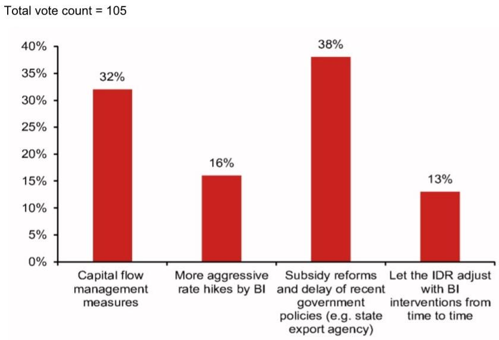
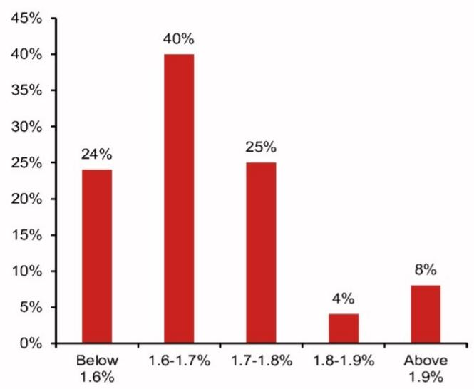

# The Global Economy Is No Longer Cyclical: It Is Structural Fracture, and Investors Must Rethink Every Assumption

The world economy is not experiencing a synchronized cycle. It is experiencing a structural divergence that is redefining the rules of growth, inflation, and policy response. The old framework of a single global business cycle, with central banks moving in concert and asset correlations holding steady, has collapsed. What has replaced it is a multi-speed, multi-shock system where the United States outperforms, Europe stagflates, Japan normalizes, and China fractures internally. The cause is not one war or one commodity spike. It is a trio of supply shocks—energy, chips, and food—that are hitting economies at different angles and with different intensities. Meanwhile, the AI revolution is concentrating gains in a handful of economies and sectors, while leaving others behind. The result is a world where the same data release can mean opposite things for different markets. For investors, the critical task is no longer forecasting the next rate move. It is understanding which structural forces are permanent and which are cyclical, and positioning for a world where divergence, not convergence, is the only reliable pattern.

This is not a moment for tactical adjustment. It is a moment for strategic recalibration. The evidence from a major investment forum's global economic panel, combined with live audience polling of institutional investors, reveals a deep tension between what markets expect and what the underlying data imply. Investors overwhelmingly expect central banks to fall behind the curve, yet they also expect only modest policy moves. They see AI as a source of risk, but not imminent risk. They believe China's bond yields will fall further, even as its AI boom accelerates. These are not contradictions to be resolved by better forecasting. They are signals that the analytical frameworks themselves are breaking down. The following sections unpack the key structural forces at work, identify what the conventional wisdom is missing, and offer a decision framework for navigating a world of permanent divergence.

## The United States Is Running a Different Economic Engine, and the Fed Cannot Be Judged by Historical Rules

The US economy is not just outperforming other developed markets. It is operating on a fundamentally different structural basis. AI-related capital expenditure is adding roughly a full percentage point to GDP growth, a magnitude that is without modern precedent for a single technology investment cycle. This is not a cyclical boost. It is a structural shift in the composition of investment, productivity, and pricing power. The US is capturing the overwhelming share of global AI infrastructure spending, and this is creating a self-reinforcing dynamic: more investment drives more productivity, which drives more pricing power, which gives firms the confidence to pass through costs. After five years of inflation above target, the muscle memory of price setting has changed. Firms no longer automatically absorb cost increases. They pass them through. This is a structural change in pricing behavior that will not reverse simply because supply chains normalize.

The implications for monetary policy are profound. The Fed is not behind the curve in the traditional sense of being too slow to raise rates. It is behind the curve in the sense that the economic structure it is trying to manage has changed. Core inflation is rising in part due to "software goods" linked to AI capex, a category that may be misweighted in the Fed's preferred PCE measure. The trimmed-mean PCE, which the current Fed Chair favors, historically lags core PCE in responding to inflation trends. This means the Fed's own preferred gauge may be giving a delayed signal at exactly the moment when inflation is becoming more entrenched. The audience poll captured this unease: 79 percent of respondents expect the Fed to fall behind the curve this year. Yet the same respondents overwhelmingly expect the Fed to stay on hold through end-2026. This is a logical tension. If the Fed is behind the curve, it should be hiking. But the market is pricing no action. The resolution may be that the Fed is not behind the curve relative to its own framework, but that framework itself is no longer fit for purpose. The Fed may keep rates steady through 2027, as the report suggests, but that is not a sign of stability. It is a sign that the central bank is effectively abdicating its role as an active stabilizer, constrained by a divided committee and a Chair whose dovish instincts may limit his influence.

## Europe and Japan Are Living in Different Stagflationary Realities, and Their Central Banks Face Opposite Risks

The euro area is experiencing the most severe stagflationary revision among developed economies since the Iran war began. Growth forecasts have been cut, inflation forecasts have been raised, and the policy response is caught in the middle. But this shock is fundamentally different from the post-Ukraine inflation surge of 2022. Monetary and fiscal policy are tighter now. Labor markets are looser. There is more economic slack. And inflation was better behaved before the Iran war than before the Russia-Ukraine conflict. This justifies a recalibration of policy rather than a full hiking cycle. The audience poll confirms this: nearly 70 percent of respondents believe European central banks should be more worried about downside growth risk than upside inflation risk. This is a dovish mandate that supports only modest tightening. The report expects two ECB rate hikes and one Bank of England hike this year, with the BoE likely to reverse that hike with cuts in the second half of 2027. The key insight is that Europe's inflation is oil-driven and therefore self-limiting. If oil prices stabilize or fall, the inflation impulse fades. The policy risk is not overtightening. It is tightening at all when growth is already fragile.

Japan is the mirror image. The Bank of Japan is normalizing from an exceptionally loose policy stance, and it faces the opposite risk: falling behind the curve as inflation accelerates. The report expects core CPI inflation to peak at 3.6 percent year-on-year in the first quarter of 2027, driven by upstream energy costs with a six-month lag. Meanwhile, the spring wage negotiations are confirming that wage hikes are becoming more harmonized and sustainable. This is a structural shift in Japan's labor market, supported by companies investing in labor-saving technology to reduce dependence on a shrinking workforce. The BOJ is expected to hike in June and December 2026 and June 2027, bringing the policy rate to 1.5 percent, within the estimated range of the neutral rate. Yet the audience poll shows that 69 percent of respondents expect the BOJ to fall behind the curve, and 52 percent expect only one hike through end-2026. This is a significant underestimation of the BOJ's tightening trajectory. Japan is not experiencing a temporary inflation spike. It is experiencing a structural reflation driven by wage growth, labor scarcity, and a shift in corporate pricing behavior. The BOJ's normalization is likely to be more sustained and more impactful than markets currently price.

## China's AI Boom and Property Bust Are Creating Two Interlocking K-Shapes That Could Destabilize the Entire Economy

China is the most misunderstood major economy today. The narrative of an AI-driven recovery is real but dangerously incomplete. The AI boom is contributing roughly 0.3 percentage points to GDP growth through fixed asset investment, and Beijing is pushing an ambitious "AI+" strategy to integrate AI into 90 percent of the economy. This is a genuine structural shift. But the property bust, which is still ongoing with new home sales of the top 100 developers falling 72.7 percent from 2021 to 2025 and another 19.7 percent decline in the first four months of 2026, is a far larger force. At its peak in 2021, the property sector contributed roughly 25 percent of GDP, 38 percent of fiscal revenue, and 60 percent of household wealth. The collapse has destroyed demand, damaged balance sheets across all sectors, and created a massive overhang of bad debt.

The critical analytical contribution is the concept of two interlocking K-shapes. The first K-shape is between those who benefit from the AI boom—highly skilled workers in top-tier cities with protected jobs and rising wealth—and those who are displaced by it, including the 14 million migrant workers who lost construction jobs since 2021. The second K-shape is geographic: the AI supercycle is a centralizing event that concentrates gains in a handful of "smart" cities with massive compute density, data pools, and top talent, while siphoning resources from the rest of the country. These two K-shapes reinforce each other. As top talent and financial resources flow to a few cities, displaced workers are crowded out and forced into the gig economy or low-end services, driving down wages in legacy cities and worsening service sector deflation. The demographic shift of an aging and falling population, a surge in college education, and a highly unequal social welfare system further amplify these dynamics.

The implication is stark: the AI boom cannot cure the property bust. Beijing cannot assume that the new economy will simply outgrow the old economy's problems. The divergence between the upper and lower arms of the two K-shapes is likely to become excessive, forcing the government to eventually step in with more aggressive policy measures to clean up the property sector and support left-behind cities. The audience poll captured this pessimism: 64 percent of respondents expect China's 10-year government bond yield to fall below its already-low 1.72 percent by end-2026. This is not a vote of confidence in the AI boom. It is a vote for continued deflationary pressure and policy accommodation. The bond market is telling a very different story from the equity market, and that divergence is itself a warning.

## The Report Reveals a Critical Analytical Gap: No One Knows How the AI Boom and the Supply-Shock Inflation Will Interact Over a Multi-Year Horizon

The report provides an exceptionally detailed diagnosis of the current state of the global economy. But it leaves one critical question unresolved: how will the AI boom and the supply-shock inflation interact over a multi-year horizon, and what does that mean for the structural relationship between growth and inflation? The AI boom is deflationary in the long run because it raises productivity. But in the short run, it is inflationary because it drives massive capital expenditure, raises demand for chips and energy, and gives firms pricing power. The supply shocks from energy, chips, and food are also inflationary in the short run, but they are stagflationary because they reduce output. The net effect is a regime where growth and inflation can both rise simultaneously, which is the worst possible outcome for traditional asset allocation.

The report does not fully explore what happens when the AI capex cycle matures. If AI investment peaks in two to three years, the inflationary impulse from capex will fade, but the productivity gains will take years to materialize. Meanwhile, the supply shocks from energy and chips may persist or recur, especially if geopolitical tensions remain elevated. The world could be entering a period where inflation is structurally higher not because of demand overheating, but because of a series of supply-side constraints that are compounded by the resource demands of the AI transition. This is a regime that central banks have no playbook for. It is not the 1970s, because productivity growth is higher. But it is not the 2010s, because inflation is not dead. It is something new, and the report's most valuable contribution is to force readers to confront that uncertainty.

## A Decision Framework for Navigating Structural Divergence: Three Questions Every Investor Must Answer

The report's findings can be distilled into a decision framework based on three questions. First, which economies are experiencing structural growth shifts versus cyclical adjustments? The US and Japan are in structural shifts driven by AI and wage normalization, respectively. Europe is in a cyclical stagflation that will likely resolve as oil prices stabilize. China is in a structural fracture where the AI boom and property bust are pulling in opposite directions. The answer to this question determines whether you should be positioning for trend growth or mean reversion.

Second, which inflation pressures are self-limiting and which are self-reinforcing? Oil-driven inflation in Europe is self-limiting because it depends on a commodity price that can fall. Wage-driven inflation in Japan is self-reinforcing because it is supported by labor scarcity and structural changes in corporate pricing behavior. AI-driven inflation in the US is ambiguous: it is self-reinforcing in the short run as capex drives demand, but self-limiting in the long run as productivity gains arrive. The answer to this question determines whether you should be betting on rate cuts or rate hikes.

Third, which asset price divergences are signaling real economic fractures versus temporary mispricings? The gap between China's falling bond yields and rising AI-related equity valuations is a real fracture. The gap between the US equity market's AI optimism and the bond market's stagflation fears is a real tension. The gap between Japan's expected rate path and the market's pricing of only one hike is a potential mispricing. The answer to this question determines where the biggest opportunities and risks lie.

## The Full Report Contains the Charts and Data That Make These Arguments Actionable

The analysis above is based on the summary of a major investment forum's global economic panel and live audience polling. But the full report contains the detailed charts, data series, and country-specific breakdowns that turn these strategic insights into actionable investment decisions. The bond yield snapshots over four critical time periods, the audience polling results broken down by question, and the detailed country forecasts for GDP, inflation, and policy rates are all essential for building conviction around the divergence thesis. The original charts show exactly how China's yield curve has inverted relative to the rest of the world, how Japan's curve has steepened, and how the US bond market is pricing in a fragility that equity markets are ignoring.

Join the community to read the full report and review the original charts. The structural divergence of the global economy is not a short-term theme. It is the defining investment framework for the next several years. The data and analysis in the full report provide the foundation for building a portfolio that can survive and thrive in a world where the old rules no longer apply.

*This article is for learning and discussion only and does not constitute investment advice.*

Personal reading notes and learning share only. Not investment advice.

