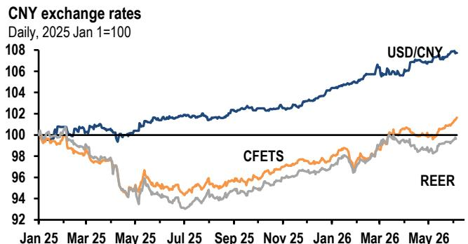

# 市场真正低估的不是外汇储备，而是政策信号的重定价

5月外汇储备数据再次超出预期，上升317亿美元至3.442万亿美元，显著高于市场预期的3.400万亿。这个数字本身并不令人意外——过去几个月，外储的超预期表现已经成为常态。真正值得关注的，是这组数据背后隐藏的三个结构性信号：出口韧性的真实来源正在发生变化，央行储备管理的战略转向正在加速，以及近期一系列跨境监管政策并非资本管制的收紧，而是一场系统性“渠道清理”。

市场习惯性地将这些信号解读为短期扰动，但某外资投行最新研报的框架提示我们：这些现象合在一起，指向的是一个更深刻的叙事——中国正在从被动管理资本流动，转向主动构建一套覆盖人才、技术、数据、资本的全域跨境治理体系。这一转变对资产定价、产业布局和地缘博弈的含义，远未被充分定价。

## 1. 外储超预期背后，出口的“价格效应”正在取代“数量效应”

5月外储超预期上升317亿美元，某外资投行的测算显示，经常账户顺差估计为640亿美元，估值损失约123亿美元（美元指数从98.1升至98.9），隐含资本外流仅200亿美元，连续第二个月处于低位。

关键判断在于：外储超预期的主要驱动力正在从出口数量转向出口价格。研报明确指出，AI存储芯片/模组价格飙升、“新三样”（电动车、光伏、电池）价格回升、以及PPI压力向其他制成品传导，使得价格效应从拖累转为支撑。换句话说，中国出口的“量稳价升”正在发生。

这意味着什么？如果价格效应持续，即使出口数量增速放缓，贸易顺差仍可能维持在高位。这对于人民币汇率的支撑逻辑是一个重要修正——市场此前普遍认为人民币升值需要依赖资本流入，但经常账户顺差的韧性本身就能提供基础支撑。同时，这也意味着出口企业的利润空间正在改善，这对制造业投资和就业的传导值得跟踪。

## 2. 央行加速购金与减持美债：储备结构正在经历一次“无声的再平衡”

5月的数据显示，中国人民银行进一步加速了黄金购买，增持32万盎司，远高于2025年下半年的月均3万盎司。与此同时，中国持有的美国国债在3月下降410亿美元至6523亿美元。

将这两条线放在一起看，趋势非常清晰：中国正在以2015年以来最快的速度进行储备资产的结构性再平衡。黄金占比持续上升，美债占比持续下降。这不仅是地缘政治风险的应对，更是一种主动的资产负债表优化——黄金不产生信用风险，且在当前全球央行购金潮中具有更好的流动性溢价。

但报告没有完全展开的一个问题是：这种再平衡的可持续性和节奏。中国目前的黄金储备仍远低于发达经济体央行的平均水平，增持空间巨大。但快速增持黄金也会推高价格，增加成本。这里是需要持续跟踪的关键变量——央行是否会调整购金节奏，以及是否会在其他资产类别（如其他主权债券、国际机构债券）上寻找替代配置。

## 3. 跨境政策收紧的真实意图：不是关门，是修路

近期证监会主导的一系列跨境证券、期货、基金活动监管，以及6月1日国务院发布的《对外投资条例》，引发了市场对资本外流管控收紧的担忧。但某外资投行的判断非常明确：我们不这么认为。

核心逻辑是：这些措施是针对非法/灰色地带的“渠道清理”，而非对境外投资的全面打压。证监会的行动目标是打击跨境营销、开户、交易执行和资金转移的非法活动，同时引导投资者转向合规渠道（如股票通、QDII、理财通）。在香港，这体现为对新开内地客户账户的更严格KYC和资金来源审查。

而《对外投资条例》的真正意义，是建立一个覆盖事前审批/备案、事中报告、事后监管的全链条治理框架，同时包含对海外歧视性壁垒的应对机制（包括可能的反制措施）。这不是新的资本管制，而是对现有规则的标准化和执法强化。

这里有一个容易被忽视的洞察：条例明确适用于香港、澳门和台湾地区，且将于2026年7月1日生效，但实施细则尚未发布。这意味着未来12-18个月，企业对外投资的合规成本将显著上升，但合规路径也将更加清晰。对于有真实海外业务需求的企业，这反而是确定性增强；对于利用灰色通道进行资本转移的行为，则是明确的挤压。

## 4. 人民币篮子走强：一个被误读的信号

5月CFETS人民币汇率指数上升约1.5%，实际有效汇率（REER）上升约1%，回到2025年初的水平。与此同时，银行代客结汇比率从3月的58.2%下降至4月的50.2%，购汇比率也从55.0%下降至49.8%，净结汇比率从3.1个百分点收窄至0.4个百分点。

这两个现象看似矛盾——汇率篮子走强，但企业和居民的结汇意愿却在下降。某外资投行的解释是：客户外汇行为趋于软化，但净结汇收窄更多是双向意愿同时下降的结果，而非单向的资本外流压力。

更深层的含义是：人民币篮子走强并非因为市场主动买入人民币，而是因为央行通过定价机制和贸易加权篮子管理，主动引导了名义有效汇率的回升。这背后的政策考量包括：缓解贸易伙伴对“竞争性贬值”的指责（中国贸易顺差创纪录后，非美贸易伙伴的反弹已经出现），以及支持人民币国际化目标（在第十五五规划中明确列为重点）。

但报告没有完全回答的问题是：这种“主动引导的升值”能持续多久？如果美元重新走强，央行是否会允许人民币篮子跟随调整？这里的关键观察变量是CFETS指数是否会在当前水平附近形成新的均衡区间。

## 5. 一个尚未完全回答的问题：资本外流压力是否真的已经消退？

报告推算5月隐含资本外流仅200亿美元，连续第二个月处于低位。这与2015-2016年动辄500-800亿美元的月度外流形成鲜明对比。但这里需要谨慎：隐含资本外流的推算依赖于经常账户顺差的估算，而5月贸易数据尚未公布，顺差估算本身存在不确定性。

更重要的是，资本外流压力的缓解是否可持续？当前的环境有其特殊性：人民币汇率走强、中美利差收窄、地缘政治风险阶段性缓和。如果这些条件发生逆转，资本外流压力是否会重新上升？报告提到了这一点，但没有展开。

另一个值得关注的问题是：监管渠道清理在短期内可能抑制部分合规需求，造成“假性平静”。随着2026年7月《对外投资条例》生效，合规路径明确后，是否会出现一波“补偿性”的对外投资增长？这将对资本流动和国际收支产生什么影响？这些问题的答案，可能需要更长时间的数据积累才能判断。

---

以上讨论中，有几个关键假设尚未得到验证：出口价格效应的持续性、央行黄金购买的节奏、以及监管框架落地后的实际执行效果。这些正是完整研报中更详细的图表和情景分析所覆盖的内容。欢迎来星球微信群里继续讨论，我们可以一起拆解这些未解问题的逻辑链条，并分享原始报告中的关键图表和数据。

Personal reading notes and learning share only. Not investment advice.

