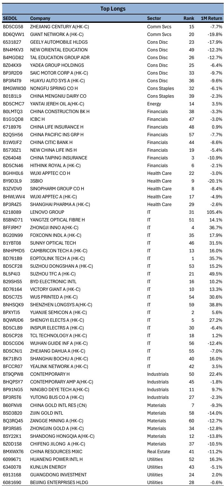
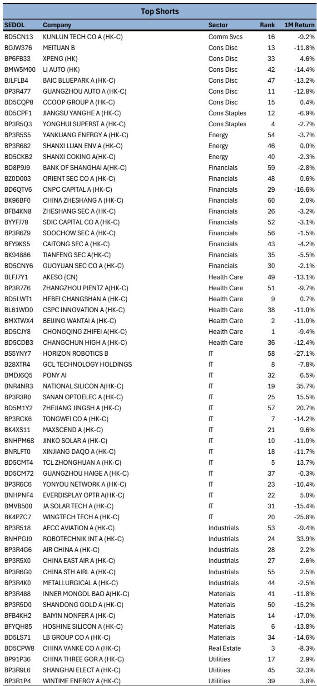
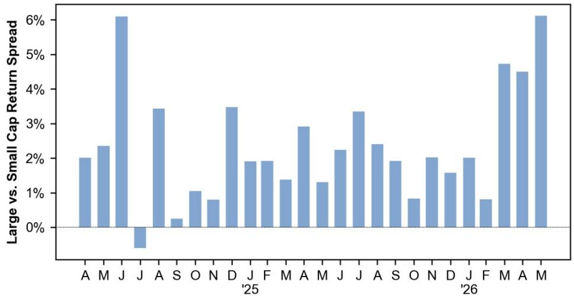

# 市场真正低估的不是波动，而是个股之间正在发生的“结构性撕裂”

如果你只看MSCI中国指数的表面波动率，你会觉得5月的市场很平静。年化波动率17%，处于过去十年29%的分位数，低于22%的历史均值。指数本身几乎没怎么动。

但如果你把视线从指数挪开，去看个股之间的分歧程度，你会看到一个完全不同的画面。个股截面波动率已经飙升至16%，处于过去十年98%的分位数，几乎是历史均值10%的1.6倍。换句话说，指数不动，不是因为市场没有方向，而是因为个股涨跌互相抵消——有些股票在经历十年一遇的上涨，另一些在经历同等幅度的下跌。

这不是一个关于“市场涨跌”的判断，而是一个关于“市场结构”的判断。某外资投行最新发布的量化策略报告，用一组看似矛盾的数据揭示了当前中国权益市场最核心的特征：指数平静的表象下，个股之间的撕裂正在接近历史极值。对于以选股为核心的投资者，这不是噪音，是信号。

这份报告的价值不在于预测方向，而在于它量化了一个正在发生的结构性变化。以下是我们从中提炼出的五个关键判断，以及一个尚未被充分讨论的问题。

## 1. 指数低波动不等于低风险，它恰恰掩盖了极端的个股分化

理解当前市场，首先要理解一个看似反直觉的现象：为什么指数波动率这么低，但很多投资者感觉操作难度极大？

答案在于“相关性”的崩塌。当个股之间的相关性下降，涨跌互相抵消，指数就会显得平静。但这不是市场的“休整期”，而是资金在重新定价资产时形成的剧烈分歧。报告的数据显示，5月MSCI中国成分股中，中位数个股下跌3.6%，但受少数几只大涨股票的拉动，指数均值仅下跌0.6%。这是一个极度右偏的分布——偏度高达2.56。大多数股票在跌，但少数赢家赢得很夸张。

这意味着什么？如果你只是被动持有指数，你感受到的是-0.6%的温和下跌。但如果你是一个主动选股者，你的感受取决于你是否恰好选中了那几只“赢家”。这种分化不是随机波动，而是市场在重新定义“谁值得被定价”。

对于机构投资者而言，这种环境恰恰是alpha的来源。报告显示，某多因子组合在5月实现了+7.2%的多空收益，而同期指数下跌3.0%。但关键在于，这个收益高度集中在少数股票上：多头端的两只个股——大唐发电（+109%）和联想集团（+105%）——贡献了绝大部分超额收益。这不是一个“系统性地战胜市场”的故事，而是一个“在极端分化中精准下注”的故事。

## 2. 市场正在用“市值”投票：大盘股赢，小盘股输，而且输得很彻底

分化不是均匀分布的。报告用“大盘股 vs 小盘股”的收益差量化了这一现象：5月，大盘股相对小盘股的超额收益达到+6.1%，接近过去两年最高水平。

这不是一个短期现象。从过去26个月的数据来看，大盘股相对小盘股的收益优势在绝大多数月份都是正的，但5月的幅度显著放大。这意味着资金正在从两个方向同时行动：一方面，向大市值、高流动性、确定性强的资产集中；另一方面，从小市值、低流动性、需要更长叙事验证的资产中撤出。

这种“大胜小”的格局，在当前宏观环境下有其逻辑基础。当宏观增长路径不清晰、政策信号复杂、外部不确定性仍存时，资金天然偏好那些“即使看错了也不会亏太多”的大盘股。而对于小盘股，每一笔投资都需要更具体的公司层面逻辑来支撑。在个股波动率处于历史极值的环境下，这种逻辑验证的成本变得极高。

这带来的一个隐含判断是：如果大盘股相对小盘股的溢价继续维持甚至扩大，那么市场整体的赚钱效应将会持续分化。对于大多数投资者而言，这意味着“选对赛道”比“选对方向”重要得多。

## 3. 5月赢家的共同特征：不是行业，而是“叙事被市场重新定价”

哪些股票在涨？报告的多头组合提供了清晰的样本。5月表现最强的个股集中在两个方向：一是与AI算力、半导体相关的A股科技股（如兆易创新+51%、苏州天孚+49%、澜起科技+47%）；二是与电力、基础设施相关的传统行业龙头（如大唐发电+109%）。

这两个方向看似矛盾，但背后有一个共同逻辑：市场正在为“确定性”和“稀缺性”支付溢价。AI算力股的逻辑是“需求确定、供给稀缺”，电力股的逻辑是“资产确定、估值稀缺”。两者都不依赖于宏观经济的全面复苏，而是依赖于某个细分领域的结构性供需失衡。

值得注意的是，报告的多因子组合在6月调整了持仓结构：增加了国有大行H股（建设银行、工商银行）以及区域性银行、IT供应链公司；减少了消费互联网（京东、美团、泡泡玛特）以及部分商品/周期股（陕西煤业、中国宏桥、盐湖股份、中远海控等）。

这一调整传递了两个信号：第一，报告认为银行股在当前的估值和股息率下具有防御价值；第二，消费互联网和周期股的“重估叙事”可能已经充分定价，需要更多催化剂才能进一步上涨。

## 4. 多空策略的有效性正在被极端分化验证，但集中度风险不可忽视

报告披露的多因子组合表现，是理解当前市场获利机制的最佳案例。5月，多头端收益+3.0%，空头端收益-4.2%，多空组合收益+7.2%。但正如前文所述，这个收益高度集中在少数股票上。

这引出一个关键问题：这种多空策略的可持续性如何？从逻辑上看，当个股截面波动率处于历史极值时，多空策略的潜在收益空间确实最大。但同时，策略的脆弱性也最大——因为收益来源过于集中，一旦那几只核心持仓的逻辑被证伪，回撤也会同样剧烈。

报告没有直接讨论这一点，但我们可以从数据中推导出一个判断：当前的多空策略，与其说是一个“系统性的因子暴露”，不如说是一个“高度集中的事件驱动型押注”。这意味着，对于复制这种策略的投资者而言，真正重要的不是因子模型本身，而是对那几只核心持仓的基本面判断是否准确。

报告尚未回答的问题是：当截面波动率从98%分位数回落时，这些集中度带来的超额收益会如何消退？是缓慢回归均值，还是迅速反转？这个问题可能决定了未来几个月的策略选择。

## 5. 报告没有完全展开的一个问题：低相关性能持续多久？

当前指数低波动、个股高波动的状态，本质上是由低相关性驱动的。报告显示，5月只有67%的个股与市场方向一致，这意味着有三分之一左右的个股在“逆势”运动。

这种低相关性状态能持续多久，是一个关键的变量。从历史经验看，低相关性往往与“市场缺乏主线”相伴而生。当所有股票都围绕同一个主题（比如AI、新能源）运动时，相关性会迅速上升，指数波动率也会随之放大。反之，当市场没有明确共识，资金各自为战时，相关性就会下降。

当前的低相关性，部分反映了市场对宏观前景的分歧。如果未来出现一个被广泛认可的主线（无论是政策驱动还是产业驱动），相关性可能迅速回升。届时，指数波动率会放大，但个股分化的机会也会减少。

对于投资者而言，这意味着：当前是“选股”的黄金窗口，但窗口期可能不会太长。一旦市场形成新的共识，结构性机会将让位于系统性机会。

## 顺着这些未解问题，可以继续深入

这份报告的价值，不在于它给出了一个“买什么”的答案，而在于它提供了一个“如何思考当前市场”的框架。它量化了指数平静表象下的结构性撕裂，揭示了多空策略在极端分化环境中的收益来源，也留下了一些值得继续追问的问题：低相关性还能持续多久？大盘股溢价是否会进一步扩大？多空策略的集中度风险如何管理？

这些问题，在原始报告中还有更详细的数据拆解和情景分析。如果你对这些未解问题感兴趣，欢迎来星球微信群里继续讨论。我们会基于原始报告的数据和逻辑，进一步推演这些变量的演变路径，并探讨它们对具体投资策略的含义。

---

Personal reading notes and learning share only. Not investment advice.

