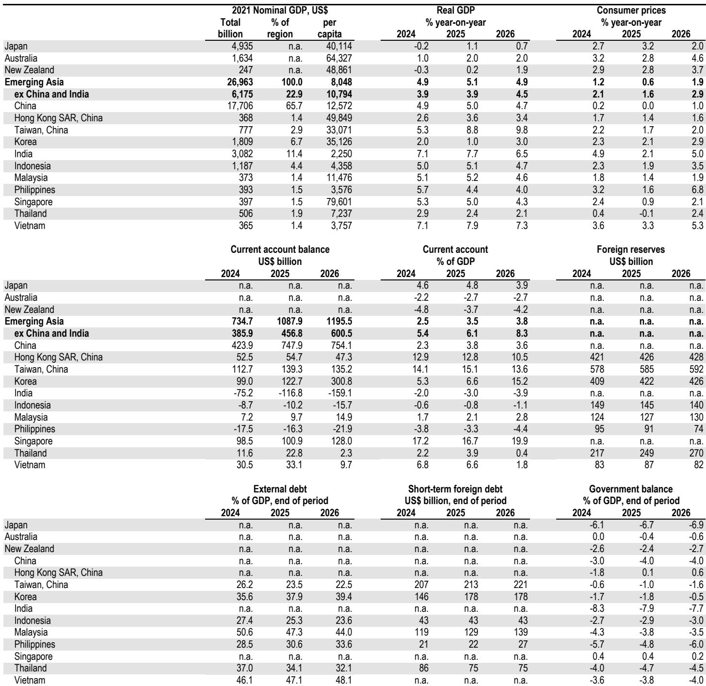
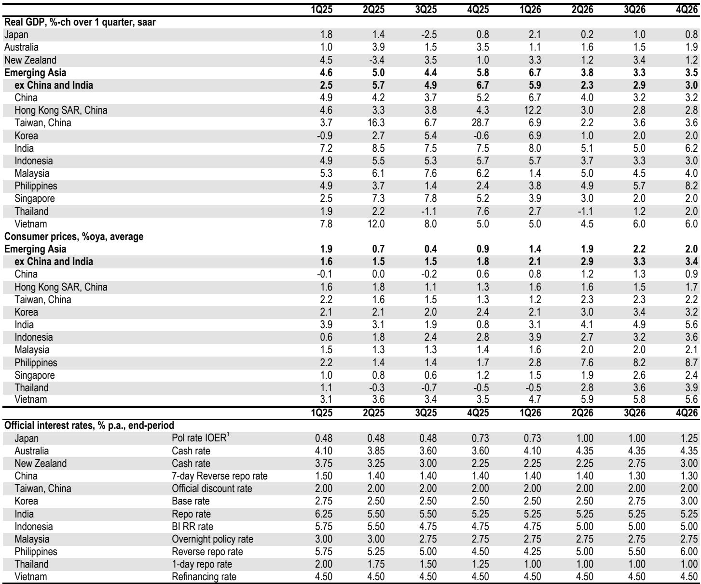

# EMAX Resilience Is Not a Mirage: Three Structural Pillars Are Outperforming China's Slowdown

The most important macroeconomic story in Asia today is not China's deceleration. It is the quiet, structural resilience of Emerging Asia ex-China, or EMAX. While global attention remains fixed on downside risks in the world's second-largest economy, a distinct growth narrative is playing out across the rest of the region. EMAX is not merely holding up; it is being actively reinforced by three independent and mutually reinforcing forces: an aggressive and successful adaptation to the energy shock, a structural tech boom that is broadening beyond semiconductors, and a fiscal policy response that is both timely and targeted. The implication for investors is clear: the Asia growth story has become a two-track story, and the more compelling track may be the one that does not begin with the letter C.

This matters now because the divergence is not a temporary blip. The energy shock that threatened to derail EMAX growth earlier this year has been met with a level of resourcefulness that many observers underestimated. Daily tanker volumes of energy imports have rebounded to near-normal levels as the region has aggressively diversified its sourcing. The feared non-linearities in growth, the kind that force central banks into emergency tightening or trigger sharp current account adjustments, have been avoided. This is not luck. It is the result of deliberate policy choices and private-sector adaptation that together constitute a structural buffer.

The tech upswing, meanwhile, is showing signs of broadening beyond the semiconductor cycle. April industrial production prints across EMAX were strong, and May export data from Korea, a bellwether for regional tech demand, reinforced the pattern. Price effects are adding to nominal strength, but the volume story is real. This has implications not just for growth but for fiscal space, as stronger tech activity generates tax revenues that governments can redeploy to cushion other parts of the economy.

Fiscal policy is the third pillar that is often overlooked. Across Korea, India, Thailand, and the Philippines, governments have deployed substantial fiscal packages to offset the energy shock. Korea's supplementary budget, India's absorption of the terms-of-trade shock through retail price moderation, Thailand's 2.1 percent of GDP package, and the Philippines' expected supplementary budget all point to a region that is willing and able to use fiscal tools proactively. This is a departure from past cycles when fiscal policy in emerging Asia was often pro-cyclical or constrained by debt concerns. The current approach is counter-cyclical and strategic.

The result is visible in the May PMI data. The EMAX output index rebounded after slipping in March and April. It has not yet returned to pre-conflict levels, but the direction of travel is encouraging. For investors who have been conditioned to view Asia through the lens of China's property sector and consumer sentiment, the EMAX resilience story offers a fundamentally different risk-reward profile.

## The Region's Monetary Policy Divergence Is More Strategic Than It Appears

The hawkish tilt across most of EMAX central banks is well understood. The Bangko Sentral ng Pilipinas and Bank Indonesia have already hiked. The Bank of Korea has turned hawkish, and the consensus now expects four rate hikes over the next year. This is the standard playbook: growth holds up, inflation becomes the primary concern, and central banks tighten. But one central bank is breaking the pattern, and its approach is more instructive than the consensus acknowledges.

The Reserve Bank of India held policy rates when the market had priced in a 60 percent probability of a 25-basis-point hike. This was not dovishness. It was a deliberate demonstration of what the RBI calls the principle of separability under India's inflation-targeting framework. The idea is that interest rates and liquidity should address inflation, while other instruments, including sterilized foreign exchange intervention and regulatory policy, should address external sector pressures. By holding rates and instead deploying regulatory measures to attract capital inflows and shore up the balance of payments, the RBI signaled that it sees the current inflation pressure as supply-driven and transitory, not demand-driven and structural.

This distinction matters for investors. If the RBI is correct, then India's growth trajectory can be preserved without the drag of aggressive rate hikes. The central bank is effectively buying time, betting that the energy shock is temporary and that the tech upswing will provide enough external buffer to manage the currency pressure. The risk, of course, is that inflation proves more persistent than anticipated, forcing a belated and more aggressive tightening cycle. But for now, the RBI's strategy is a calculated bet on the structural resilience of the Indian economy.

The broader lesson for EMAX is that monetary policy divergence within the region is not random. It reflects different inflation transmission mechanisms, different fiscal buffers, and different external sector vulnerabilities. Investors who treat all EMAX central banks as a monolith will miss the nuances that drive relative returns. The RBI's approach is a reminder that in a region where growth is holding up, the policy response can be more creative than simple rate hikes.

## China's Downside Risks Are Real but Carry a Second-Half Counter-Narrative

The China story is more nuanced than the headline weakness suggests. There are genuine downside risks to second-quarter GDP growth. April activity data was weak, and the May PMI readings from both the National Bureau of Statistics and the private sector were mixed. Headline PMIs weakened, even if output and new orders remained in expansionary territory. Secondary home sales in May showed some improvement, which could support consumer sentiment, but hard data in May and June would need to bounce back significantly to keep second-quarter forecasts on track.

But the caveats are important. First, the second-quarter weakness comes on the back of a very strong first quarter, such that first-half growth would still average 5 percent or more. The headline deceleration is not a collapse. Second, some of the second-quarter softness can be attributed to fiscal policy being less front-loaded than originally planned. This is not a structural problem. It is a timing issue. The implication is that there will be less payback in the second half, and if weakness extends into May, it would likely prompt firmer fiscal actions in June and beyond, especially if second-quarter GDP prints below the full-year growth target range.

Third, Chinese exports stand to benefit from the same global tech upswing that is boosting EMAX. Rising global PMIs and a strong tech cycle are supportive of export demand. This would be a tailwind for second-half growth. Domestic consumption remains tepid, but its drag is not expected to become more significant. The risk is not that consumption collapses further; it is that it remains subdued.

For investors, the China narrative is not one of unrelenting gloom. It is a story of a temporary deceleration that is partly self-inflicted by fiscal timing, set against a structural backdrop of strong first-half growth and a supportive external environment. The key question is whether the policy response will be sufficient to close the gap. Upcoming trade and activity data will be critical in assessing whether the second-half rebound materializes as the consensus expects.

## What the Report Does Not Fully Answer: The Sustainability of the Tech Upcycle and the Limits of Fiscal Space

The report makes a compelling case for EMAX resilience, but it leaves two critical questions unresolved. First, the tech upcycle is clearly boosting exports and industrial production, but how much of this is cyclical and how much is structural? The semiconductor cycle has historically been volatile, and a global demand slowdown would hit EMAX hard. The report notes that price effects are boosting nominal prints, which raises the question of whether volume growth is as strong as the headline numbers suggest. If the tech upcycle is largely a price story, then the fiscal space it creates is more fragile than it appears.

Second, the fiscal packages across the region are impressive in size, but they come at a cost. Thailand's package is 2.1 percent of GDP. The Philippines' supplementary budget is 0.7 percent of GDP. Korea has already used a large supplementary budget. India is absorbing the terms-of-trade shock through fiscal means. The question is how much fiscal space remains if the energy shock persists or if growth disappoints. The region's debt levels are manageable, but they are not zero. The risk is that fiscal policy becomes constrained just when it is needed most.

These are not reasons to dismiss the EMAX resilience story. They are reasons to monitor it actively. The full report provides detailed country-level data and forecasts that allow investors to stress-test these assumptions. The charts on energy import volumes, tech export trends, and fiscal trajectories are essential tools for anyone trying to assess the durability of the current growth dynamic.

## A Decision Framework for Investors: How to Position Across the Asia Growth Divergence

For investors trying to navigate the two-track Asia story, a structured decision framework is more useful than a static view. The framework should answer three questions. First, what is the exposure to the EMAX resilience trifecta? This means assessing which markets benefit most from energy adaptation, the tech upcycle, and active fiscal policy. Korea and Taiwan are the clearest tech beneficiaries. India and Thailand have the most active fiscal responses. The Philippines and Indonesia are more exposed to energy costs but are also taking policy action.

Second, what is the exposure to China's downside risks? This is not just about direct China exposure. It is about supply chain linkages. EMAX economies that are deeply integrated into China's manufacturing ecosystem, such as Korea and Taiwan, face a more complex risk profile than those with less direct exposure. The tech upcycle may offset some of this, but the correlation is not perfect.

Third, what is the central bank reaction function? The RBI's separability approach is one model. The BSP and Bank Indonesia's hawkish tightening is another. The Bank of Korea's expected rate hikes are a third. Each has different implications for currency, bond yields, and equity valuations. Investors need to map their portfolio exposure against the expected policy path in each market.

The framework is not a recommendation to overweight or underweight any particular market. It is a tool for identifying where the consensus is likely to be wrong. If the consensus is too pessimistic on EMAX resilience, then markets that are priced for a slowdown may offer upside. If the consensus is too optimistic on the tech upcycle sustainability, then markets that are priced for continued strong exports may be vulnerable.

## The Full Report Holds the Data That Makes This Framework Actionable

The analysis above is based on a detailed global investment bank report that provides country-level forecasts, PMI breakdowns, trade data, and fiscal projections. The charts on energy import volumes, tech export trends, and fiscal trajectories are essential for anyone trying to assess the durability of the current growth dynamic. The full report also includes a comprehensive data calendar and a regional economic outlook table that allows for direct cross-country comparisons.

For serious investors, the difference between a good macro view and an actionable investment strategy lies in the granularity of the data. The report provides that granularity. It shows not just that EMAX is resilient, but which countries are leading, which sectors are driving the growth, and where the risks are concentrated. It also raises the unresolved questions about the tech cycle and fiscal space that will determine whether the current resilience is sustainable.

Join the community to read the full report and review the original charts.

*This article is for learning and discussion only and does not constitute investment advice.*

Personal reading notes and learning share only. Not investment advice.

