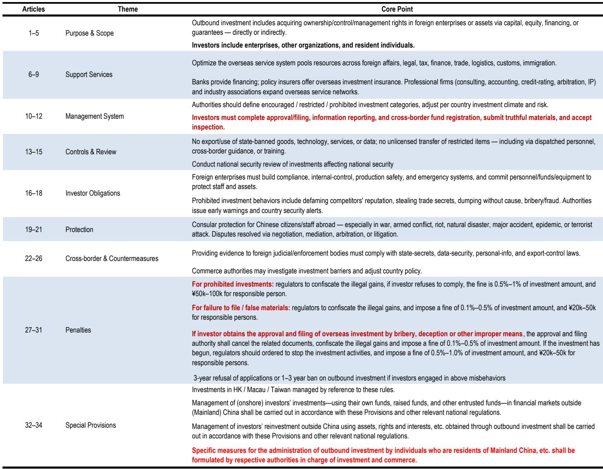
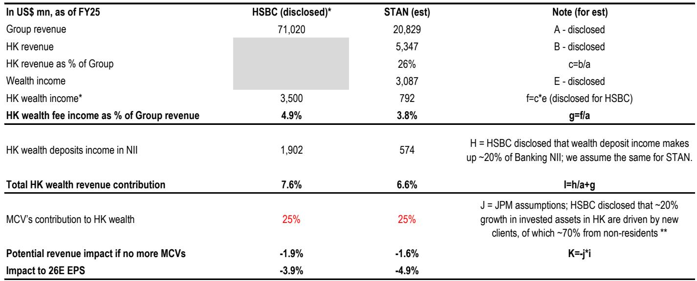
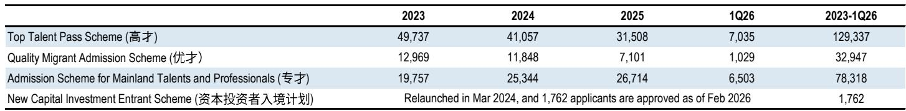

# 市场真正低估的不是监管冲击，而是财富管理渠道的结构性重置

过去一周，几家亚洲业务敞口最大的国际银行股价出现分化：HSBC控股下跌约3%，渣打集团下跌约6%，而UBS和宝盛银行则分别上涨2%和3%。表面上看，这是中国监管收紧对跨境财富流动的冲击在定价，但某外资投行的最新研报揭示了一个更深层的信号——市场正在用短期风险情绪掩盖一个结构性变化：中国居民财富出海的渠道正在从灰色地带向官方管道迁移，而这一迁移的赢家和输家，可能和当前股价所反映的完全不同。

这份报告的核心判断并不在于监管本身有多严厉，而在于它暴露了一个此前被市场低估的假设——香港财富管理业务中来自内地访客的收入贡献，远比大多数投资者想象的要集中。报告估算，在极端情景下，HSBC和渣打分别有约4%和5%的每股收益面临风险。但更重要的是，这一轮监管的不确定性，正在重塑整个亚洲财富管理行业的竞争格局。

市场目前的定价逻辑是：监管收紧意味着业务收缩，因此敞口大的银行应该跌。但这个逻辑有一个隐含前提——当前的增长模式是不可持续的，而替代渠道尚未形成。这份报告恰恰暗示，替代渠道正在成型，而真正的问题是谁能抓住这一轮结构性的渠道重置。

## 1. 监管的双重逻辑：对存量客户影响有限，但对增量客户的获取方式构成实质性改变

理解这一轮监管，需要区分两个完全不同的政策动作，它们的传导机制和影响范围截然不同。

第一个是香港金管局5月22日发布的关于投资账户的通函。这份通函的核心要求是银行对投资账户进行认证和关闭休眠账户。报告通过实地调研发现，所谓“认证服务”——即香港银行允许内地居民通过其在内地分支机构开立香港银行账户——实际上从未适用于投资账户，即使在此次监管收紧之前也是如此。这意味着，对于已经持有香港投资账户的存量客户，监管的直接冲击非常有限。报告明确假设，新的执法建议主要适用于新增流量，而非存量。

但第二个政策动作的影响要深远得多。中国国务院6月1日发布的《对外投资条例》首次将个人居民明确纳入对外直接投资框架。虽然条例主要针对企业对外直接投资，但第33条明确指出，境内居民个人对外投资的管理办法将由相关部门另行制定。这意味着，过去主要依靠外汇管理局第16条和第37号文构建的跨境资金流动监管框架，现在有了一个更上位、更系统的法律基础。

关键在于，实施细则尚未出台。报告指出，这可能是商务部、发改委或国家金融监管总局的职责范围。在细则明确之前，银行和客户都处于一个“合规不确定”的状态。这种不确定性本身就会抑制新增业务，直到监管边界清晰。

从结构上看，这两个政策形成了一个“存量不动、增量受限”的组合：存量客户可以继续交易，但新增客户的获取成本和时间周期显著上升。报告实地调研显示，内地访客仍然可以在亲临香港的情况下开立银行账户和投资账户，但审批流程变长，无法在一天内完成。同时，开立投资账户需要签署投资者声明，确认投资资金来自境外收入来源。这增加了摩擦成本，但并未完全关闭通道。

## 2. 收入敞口被低估：内地访客对香港财富业务的贡献远超表面数据

市场对HSBC和渣打的担忧并非没有依据，但报告提供了一个更精确的量化框架，揭示了风险的真实量级。

首先，香港财富业务对HSBC和渣打的集团收入贡献分别为约7.6%和约6.6%。这个数字本身并不惊人，但关键在于内地访客在其中所占的份额。报告基于HSBC管理层的披露——2023年至2025年香港投资资产增长中约20%来自新客户，其中约70%来自非居民——假设内地访客贡献了香港财富收入的约25%。这意味着，内地访客对HSBC和渣打集团收入的贡献分别为约1.9%和约1.6%。

在极端情景下——即完全无法获得新的内地访客——对2026年每股收益的影响分别为HSBC约4%和渣打约5%。这个量级足以解释股价的短期反应，但更重要的是，它暴露了一个结构性问题：这些银行对单一客户群体的依赖程度，可能高于管理层此前公开承认的水平。

报告特别指出，渣打约三分之一的净新增资金来自“全球华人”，其中约10%来自跨境流动。这意味着，如果监管收紧导致这部分跨境流动放缓，渣打的新增资金增速将面临显著压力。

但这里有一个关键区分：影响的是增量而非存量。报告假设新规主要适用于前端的增量资金，而非后端的存量资产。这意味着，对现有客户的资产管理规模和收入贡献的冲击相对有限，但对增长动能的影响是实质性的。

## 3. 瑞士银行的差异化处境：透明度低反而成为短期缓冲

与英国银行相比，UBS和宝盛银行在过去一周的股价表现明显更稳定。报告揭示了这一差异背后的两个关键因素。

第一，瑞士银行不披露中国内地相关敞口。UBS约50%的一季度净新增资产来自亚太地区，亚太地区占其财富管理投资资产的约18%。宝盛银行亚太地区资产管理规模约占集团总规模的27%。但两家银行均未披露其中有多少来自中国内地客户或内地资金流出。这种信息不透明，反而在短期内为股价提供了缓冲——市场无法精确量化风险，因此只能给予较低的负面定价。

第二，瑞士银行在亚太地区的多元化程度更高。报告指出，UBS的中期增长优先事项包括东南亚、台湾、日本和澳大利亚，而宝盛银行则将印度（包括在岸和全球非居民印度人）作为重点市场。这种地域多元化意味着，即使中国内地相关的跨境流动受到抑制，它们在其他市场的增长可以部分对冲。

但这里有一个尚未被市场充分定价的风险：亚太地区是UBS财富管理业务利润率最高的区域，2025年税前利润率高于集团平均水平。如果中国内地相关业务受到实质性冲击，对UBS整体利润率的影响可能超过对收入的影响。宝盛银行未按区域披露利润表，但报告假设其情况类似。

报告对瑞士银行的判断是：新规不溯及既往，因此关注焦点应该是资金流量而非存量。瑞士银行在亚太地区的多元化布局提供了缓冲，但具体影响仍取决于尚待发布的实施细则。

## 4. 被忽视的正面信号：香港人才计划正在创造新的合规渠道

在市场对监管收紧的担忧中，报告提供了一个容易被忽视的正面数据点。从2023年到2026年第一季度，香港通过各类人才和投资计划批准了约24.2万份签证。其中，高端人才通行证计划批准约12.9万份，输入内地人才计划批准约7.8万份，优秀人才入境计划批准约3.3万份，新资本投资者入境计划批准约1,762份。

这些数字意味着什么？它们代表着一批已经或正在获得香港合法居留身份的内地居民。对于这些人而言，他们在香港的银行账户和投资账户并不受新的内地对外投资监管限制——因为他们的资金已经在境外，或者他们本身已经成为香港的税务居民。

这构成了一个结构性的替代渠道：通过官方人才和投资计划获得香港身份，然后通过合规渠道进行资产配置。报告虽然没有明确展开，但这个逻辑暗示了一个重要的二阶效应——监管收紧可能加速高净值人群通过人才计划获取香港身份的需求，从而间接推动香港财富管理行业的客户结构升级。

从竞争格局的角度看，能够有效服务于这一客户群体的银行将获得结构性优势。这包括那些在香港拥有强大私人银行和财富管理能力的机构，以及那些能够提供从身份规划到资产配置一站式服务的机构。

## 5. 报告尚未完全回答的关键问题：实施细则将如何界定“个人对外投资”

报告中最值得关注的未解问题，恰恰是市场讨论最少的：国务院《对外投资条例》第33条所提到的“个人对外投资管理细则”将如何界定。

目前的不确定性集中在三个层面：

第一，定义范围。条例将“对外投资”定义为通过资本、股权、融资或担保等方式取得境外企业所有权、控制权或管理权。对于高净值个人而言，这通常涉及设立境外家族信托、购买境外私募基金或直接持有境外公司股权。但条例是否涵盖个人在境外银行开立的证券投资账户？如果涵盖，是否需要逐笔申报？如果不涵盖，那么对香港财富管理业务的实际影响将非常有限。

第二，执行机制。细则将由哪个部门制定？如果是商务部或发改委，可能会侧重于实体投资；如果是国家金融监管总局，可能会侧重于金融投资。不同的执行主体意味着完全不同的监管逻辑和合规要求。

第三，存量与增量。报告假设新规主要影响增量，但这个假设需要验证。如果实施细则对存量资金也提出合规要求，那么对银行的影响将显著放大。特别是对于已经通过非正式渠道出海的资金，如果需要在规定时间内完成合规化，可能引发短期的资金回流或账户调整。

报告坦承，对于瑞士银行而言，由于它们不披露中国内地相关敞口，目前难以评估影响。这本身就是市场定价的一个盲点——投资者无法判断哪家银行的敞口更大，因此只能对全行业进行折价。

## 6. 投资者的观察框架：从“监管风险”转向“渠道竞争力”

基于报告的框架，投资者需要建立一个新的观察维度：不是简单地计算监管收紧会减少多少收入，而是评估哪些银行能在渠道重置中赢得结构性优势。

第一个观察点：银行对内地访客的依赖程度与客户获取模式的可持续性。报告已经给出了HSBC和渣打的量化估算，但关键在于，这些银行是否已经在调整客户获取策略，从依赖“认证服务”和“亲临香港开户”转向服务通过人才计划获得香港身份的客户。那些能够快速建立服务新移民客户能力的银行，将在增长动能上优于依赖传统模式的银行。

第二个观察点：官方管道的渗透率。报告提到了“互联互通”计划作为官方渠道的深化方向。股票通、债券通、跨境理财通等官方管道不受新的对外投资条例限制，因为它们是在现有的监管框架内运行的。如果这些官方管道的使用率和渗透率上升，将部分对冲个人直接对外投资的限制。那些在这些官方管道中占据领先地位的银行，将受益于渠道迁移。

第三个观察点：瑞士银行在亚太地区的多元化程度是否足以对冲中国内地的潜在减速。报告指出，UBS和宝盛银行在东南亚、印度、台湾等市场有明确的增长计划。但关键在于，这些市场的利润率是否与香港业务相当。如果替代市场的利润率显著低于香港，那么即使收入增长可以维持，利润增长也会受到拖累。

第四个观察点：估值中的风险溢价是否合理。报告给出的当前估值水平——HSBC9.2倍、渣打8.1倍、UBS10.7倍、宝盛10.4倍2028年预期市盈率——在历史区间内处于较低水平。但报告认为，在监管不确定性消除之前，隐含的股权成本可能保持高位。这意味着，即使基本面没有显著恶化，估值也可能持续承压，直到实施细则明确或银行主动披露敞口。

---

以上讨论触及了报告中最关键的结构性问题，但仍有大量未解细节需要回到原始报告中寻找答案。例如，报告对HSBC和渣打收入贡献的估算基于哪些具体假设？香港金管局通函中对“投资账户”的定义是否覆盖所有类型的财富管理产品？人才计划获批者的资金入境渠道是否完全不受新规约束？这些问题的答案，直接影响对每只股票的风险定价。

欢迎来星球微信群里继续讨论这些未解问题，我们会在群内分享完整的原始报告图表和我们的逐项分析。

Personal reading notes and learning share only. Not investment advice.

