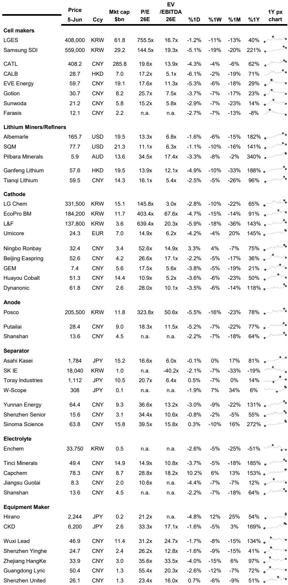
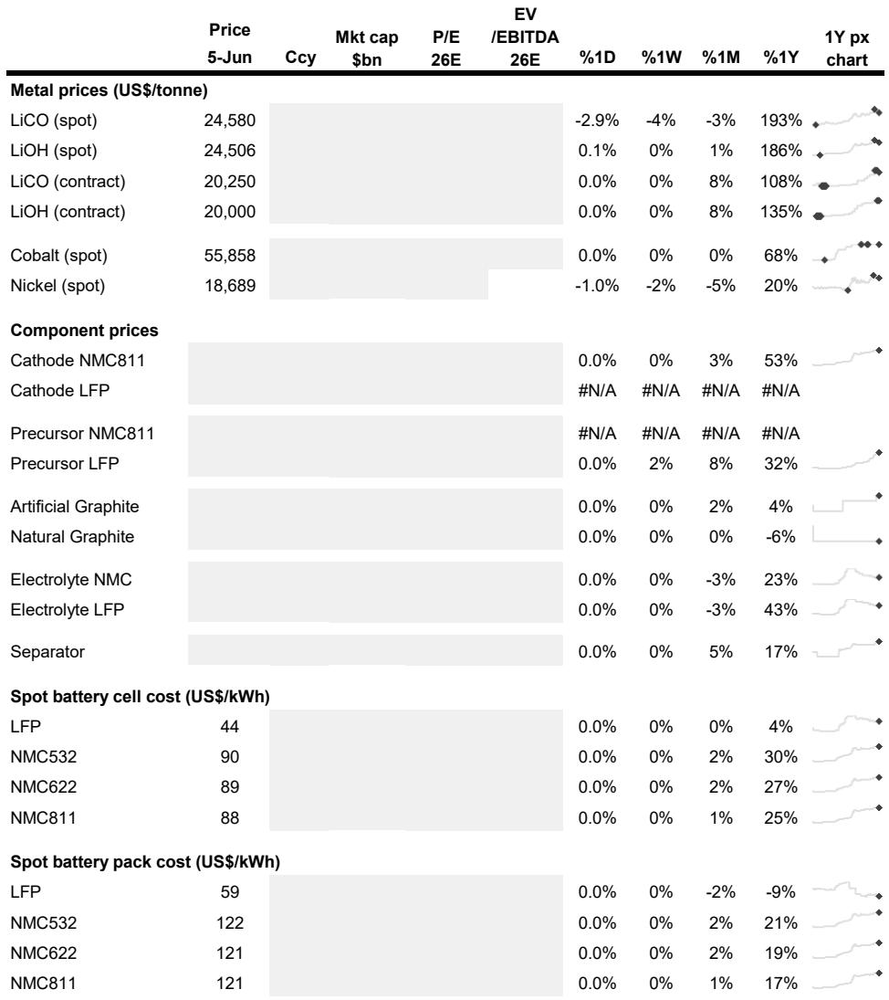
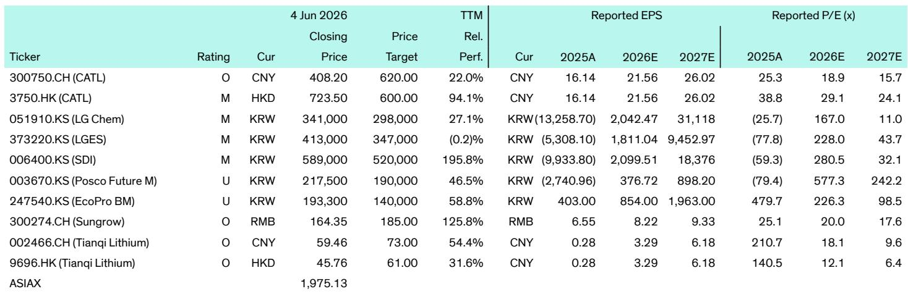

# 储能行业的真正拐点：不是电池价格，而是商业模式的“可融资性”正在被重新定义

过去两年，市场对储能行业的关注点集中在两个数字上：电池成本跌了多少，以及装机量翻了多少倍。这两个指标当然重要，但它们讲述的只是一个线性增长的故事。真正决定行业下一个五年格局的，不是成本曲线，也不是规模曲线，而是一个更根本的问题：储能项目能否像风电、光伏一样，成为金融机构愿意大规模、标准化放贷的资产类别。

这份来自某外资投行的电池周报，表面上是每周新闻汇编，但如果我们把这些看似分散的动态放在一起，一个清晰的信号正在浮现：储能行业的竞争，正在从“谁能做出更便宜的电池”，转向“谁能构建出更可融资的项目架构”。这个转变，将重新定义哪些公司能在下一阶段胜出，哪些资产会被市场重新定价。

## 1. 电池成本已不是核心壁垒，供应链的“区域化合规能力”正在成为新的准入门槛

报告中最容易被忽视的一条新闻，是Wasion Energy Storage成为全球首家获得欧盟新电池法规NB认证的集装箱式储能系统制造商。这条新闻的价值不在于认证本身，而在于它揭示了一个趋势：当电池成本趋同、技术路线趋近之后，合规成本正在成为新的差异化来源。

欧盟电池法规（EU 2023/1542）覆盖了从碳足迹声明、再生材料比例、供应链尽职调查到电池护照的全生命周期管理。这意味着，任何想要进入欧洲市场的储能系统，都必须从电芯级开始就建立一套可追溯、可审计的数据体系。这不是一个简单的认证流程，而是一个需要提前2-3年投入的系统工程。

再看另一条新闻：Syrah Resources与Tesla的石墨供应协议虽然解决了交付纠纷，但最终合同批准仍取决于资质测试。这条新闻看似是单个公司的个案，但背后映射的是更广泛的现实——非中国电池材料供应链的每一个环节，从石墨到正极材料，都在经历“从可用到合规”的艰难爬坡。

合在一起看，结论很清楚：未来两年，谁能率先完成“区域化合规供应链”的搭建，谁就能在欧美市场获得定价权。这不是一个技术问题，而是一个供应链管理和合规投入的问题。对于投资者而言，单纯比较电芯成本已经没有意义，真正值得关注的是各家公司在地化合规的进度条。

## 2. 第二生命电池的规模化应用，正在改写储能的资产折旧逻辑

Waymo与B2U Storage Solutions的合作，以及Moment Energy在温哥华启动的第二生命电池设施，这两条新闻放在一起，指向了一个被市场低估的结构性变化。

传统上，储能项目的经济模型建立在电池的“第一生命”周期上——通常假设8-10年寿命，然后计入更换成本或残值。但如果第二生命电池能够以低于新电池30%-50%的成本进入市场，并且通过梯次利用将总寿命延长至15-20年，那么整个项目的IRR模型将被重塑。

更关键的是，Waymo的项目规模是“数百兆瓦”，Moment Energy的设施年产能是1 GWh。这些数字不再是实验室或试点项目级别，而是已经进入商业化规模。报告没有展开的一个问题是：第二生命电池的衰减曲线、一致性、以及并网认证标准，目前仍缺乏统一的行业规范。这意味着，率先建立第二生命电池检测、分选、认证体系的公司，将有机会定义这个新兴市场的标准。

对于储能项目开发商而言，第二生命电池的出现意味着资产价值评估需要引入新的维度。过去，储能电站的残值几乎可以忽略不计；未来，残值可能成为项目融资的重要增信项。

## 3. 长时储能正在从“技术概念”走向“项目可融资”，但关键在于集成而非电化学

欧洲最大的液流电池项目——瑞士的800 MW/1.6 GWh项目——已经开始建设。这条新闻的意义不在于技术路线选择（液流电池vs锂离子），而在于项目的商业模式设计：它将长时储能、AI数据中心和区域供热整合成一个“零碳能源系统”。

这是一个重要的信号。过去，长时储能项目之所以难以落地，根本原因不在于技术不成熟，而在于商业模式不清晰——单纯靠峰谷套利，很难支撑长时储能的资本开支。但一旦将储能与数据中心的热管理、电网的调频服务、以及区域供热的需求耦合起来，项目的收入流就变得多元化和可预测。

报告还提到，中国的AI算力需求增长正在超过可再生能源部署速度，导致24/7绿色电力匹配变得困难。这恰恰是长时储能的天然应用场景。AI数据中心的电力需求是刚性的、持续增长的，而且对电力质量要求极高。如果储能系统能够为数据中心提供“绿电+稳定+备用”的一揽子服务，其定价能力将远超单纯参与电力市场交易。

对于行业观察者而言，真正值得关注的不是液流电池的技术参数，而是Flexbase这个项目能否在2028年如期投产并实现预期的多收入流模型。如果成功，它将为长时储能项目提供第一个可复制的商业范本。

## 4. 固态电池的商业化叙事正在被资本市场的“时间偏好”重新定价

ProLogium计划通过SPAC合并上市，目标融资2.5亿美元，用于建设法国敦刻尔克的固态电池工厂。这条新闻本身并不令人意外——固态电池公司通过SPAC融资已经是常见路径。但值得深挖的是其中的时间线：工厂预计2028年开始生产，初始产能仅0.8 GWh，到2032年才扩展到12 GWh。

这意味着，即使是最激进的固态电池公司，其大规模商业化也要到2028年以后。而在2026-2028年这个窗口期，液态锂离子电池的成本仍在下降，能量密度仍在提升。报告中的数据也印证了这一点：LFP电芯的现货成本已经降至44美元/kWh，NMC811也仅88美元/kWh。固态电池的成本优势在短期内并不存在。

那么，资本市场为什么还要为固态电池买单？答案在于“时间套利”：投资者押注的不是2026年的固态电池，而是2030年以后的技术路线切换。但这里有一个尚未被充分讨论的风险——如果液态电池在2028年之前通过材料创新（如硅负极、高镍正极）将能量密度提升到300 Wh/kg以上，同时成本继续下降，固态电池的替换窗口期可能会被压缩。

报告没有完全展开的一个问题是：固态电池的“真正价值”可能不在电动汽车领域，而在那些对安全性有极端要求的场景——比如航空航天、国防、以及大型储能电站的消防合规。这些场景的单价高、对成本的敏感度低，但市场规模有限。对于投资者而言，区分固态电池的“技术叙事”和“商业现实”将变得越来越重要。

## 5. 报告尚未完全回答的关键问题：当储能资产变成“金融产品”，谁在承担流动性风险？

这是整份报告最引人深思的未解问题。我们看到了一系列积极的信号：SK On获得了20 GWh的订单储备，HyperStrong在东南欧拿下了超过1 GWh的订单，Xingchen和Chuneng签订了10 GWh的战略合作。订单规模在快速增长，但一个根本性的问题始终存在——这些订单的融资方是谁？

储能项目的资本结构通常由30%-40%的股权和60%-70%的债务组成。在利率高企的环境下，债务成本直接决定了项目的可行性。报告提到了IBK（韩国产业银行）计划推出2500亿韩元的基金支持本土可再生能源设备，但相比储能行业的融资需求，这只是杯水车薪。

更关键的是，储能项目的收益高度依赖电力市场的价格波动，而电力市场本身具有高度政策敏感性。当金融机构在为储能项目提供贷款时，他们需要评估的不只是技术和成本，还有电力市场设计、辅助服务定价、以及政策延续性。这些因素目前在全球范围都缺乏统一标准。

这意味着，未来2-3年，储能行业的竞争可能从“谁能拿下更多订单”转向“谁能帮助客户完成项目融资”。那些能够提供“技术+融资”一体化方案的企业，将获得显著的竞争优势。而那些只卖设备的公司，可能会发现自己的订单虽然多，但交付和回款周期越来越长。

## 顺着这些未解问题继续读完整报告

这份周报的价值，不在于它告诉我们电池价格跌了多少，而在于它揭示了储能行业正在经历的结构性转变——从产品竞争转向系统竞争，从技术驱动转向合规驱动，从设备销售转向资产服务。每一个转变背后，都对应着一组新的赢家和输家。

但报告也留下了一些尚未完全回答的问题：第二生命电池的衰减模型如何标准化？长时储能的收入流在真实市场环境下是否可预测？固态电池在2028年之前能否找到足以支撑其估值的杀手级应用？这些问题的答案，将决定我们如何给储能资产定价，以及如何构建投资组合。

如果你对这些未解问题感兴趣，欢迎来星球微信群里继续讨论。我们会在社群中分享更完整的原始图表、估值模型对比，以及关于每个关键假设的深度推演。

Personal reading notes and learning share only. Not investment advice.

