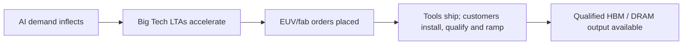

你是知乎商业/行业研究作者，擅长把英文/中文研报改写成适合知乎发布的长文。

【目标】
- 基于下面研报解析内容，生成一篇中文知乎文章。
- 风格接近微信公众号文章，但更适合知乎：论证更完整、语气更克制、有问题意识、有推理链条。
- 文章不需要把研报所有内容讲完，要留下继续阅读完整报告或加入社群讨论的空间。
- 目标长度：约 2200 字，允许上下浮动 20%。

【结构要求】
1. 第一行：知乎标题，直接讲观点，不要标题党，不要夸张极限词。
2. 开头 2-3 段：用一个真实问题或市场分歧切入，说明为什么这份报告值得看。
3. 正文按金字塔原则组织：先给核心判断，再展开 3-5 个支撑逻辑。
4. 每个小标题都要像观点句，不要写“核心判断”“支撑逻辑一”“对读者的启发”这种模板名。
5. 内容要比小红书更理性，比微信更像问答式分析，可以适度提出反问。
6. 结尾自然留下讨论空间，可使用这类表达：`完整报告里还有不少细节，适合放在社群里继续拆。`

【平台发布合规要求】
- 不要出现“投资建议”“买入”“卖出”“强烈推荐”“稳赚”“保本”“必涨”“抄底”“上车”“内幕”“翻倍”等金融操作或收益承诺表达。
- 不要写“非投资建议”“仅做学习交流”这种免责声明，也不要出现包含“投资”的免责声明。
- “投资”相关词尽量改成“投研”“研究”“观察”“学习参考”。
- 不要写“关注”“点赞”“求关注”“评论区留言”等直接互动诱导。
- 不要使用“爆款”“震惊”“必看”“必读”“最强”“最全”“唯一”“全网首发”等极限词。

【内容要求】
- 只能基于研报原文和解析内容推导，不要编造数据、页数、作者、结论或引用。
- 可以基于报告内容做适度发散，但必须明确哪些是报告内容，哪些是你的延展观察。
- 默认避免具体投行品牌名，比如“GS”“GS”，统一写作“投行研报”或使用 GS/JPM/MS 等缩写。
- 不要输出解释说明，只输出知乎文章正文。

【研报解析内容】
"""
June 8, 2026 03:23 AM GMT

## Investor Presentation: Global Technology | Asia Pacific

## Chipflation

MS & CO. INTERNATIONAL PLC+

## Shawn Kim

Equity Analyst

Shawn.Kim@morganstanley.com

+44 20 7677-1018

text_image

Asia Summer School 2026

MS does and seeks to do business with companies covered in MS. As a result, investors should be aware that the firm may have a conflict of interest that could affect the objectivity of MS. Investors should consider MS as only a single factor in making their investment decision.

## For analyst certification and other important disclosures, refer to the Disclosure Section, located at the end of this report.

+= Analysts employed by non-U.S. affiliates are not registered with FINRA, may not be associated persons of the member and may not be subject to FINRA restrictions on communications with a subject company, public appearances and trading securities held by a research analyst account.

## Chipflation – The Story in Numbers

## SURGING MEMORY TAM

## DRAM DEMAND SHIFTS TO SERVERS

Server share of DRAM demand rises

## ENTERPRISE SSDS RAPIDLY GAIN SHARE

Enterprise SSDs Jump from

## SUPPLY IS CONCENTRATED AND SHIFTING

3 firms control \~90% of DRAM output worldwide

SAMSUNG  
  
micron

25%

China's share of industry capacity rises from 18% to >23% by 2028E, representing \~30% of net wafer additions – second only to South Korea

## HBM USAGE SURGES ACROSS HIERARCHY LEVELS

AI Chip

7x Surge in HBM usage

  
AI System

65x Surge in HBM usage

  
AI Cluster

1800x Surge in HBM usage

## HBM & AI CROWD OUT CONVENTIONAL MEMORY

## HBM SHARE OF LEADING-EDGE WAFERS

HBM rises from $\sim 6\%$ of leading-edge memory wafers in 2023 to $\sim 34\%$ by 2028E

## INCREASING AI PRIORITIZATION

leads to \~15% PC DRAM shortfall and \~12% smartphone DRAM shortfall in 2027, equivalent to \~58mn PCs and \~134mn smartphones

## PRICING IMPACT

Electronics

component PPI +30% y/y

  
Direct

US CPI exposure $< 1\%$

  
Incremental global memory

market equivalent to \~45% of traditional hardware revenue

## AI is turning memory into a structural bottleneck

• AI servers are becoming memory systems  

pyramid chart

| Component | Capacity per Rack (TB per rack) |
| --------- | ------------------------------- |
| HBM       | 20.7                            |
| DRAM      | 54                              |
| NAND      | 100+                            |

Source: WSTS, TrendForce, MS.

- Prices for memory have risen more than 6-fold over the last year  

line chart

| Date    | DRAM Contract YoY (RHS) |
|---------|--------------------------|
| Jan-16  | -50%                     |
| May-16  | -50%                     |
| Sep-16  | 0%                       |
| Jan-17  | 100%                     |
| May-17  | 150%                     |
| Sep-17  | 100%                     |
| Jan-18  | 50%                      |
| May-18  | 0%                       |
| Sep-18  | -50%                     |
| Jan-19  | -100%                    |
| May-19  | -100%                    |
| Sep-19  | -100%                    |
| Jan-20  | -50%                     |
| May-20  | 0%                       |
| Sep-20  | 0%                       |
| Jan-21  | 0%                       |
| May-21  | 0%                       |
| Sep-21  | 0%                       |
| Jan-22  | 0%                       |
| May-22  | -50%                     |
| Sep-22  | -50%                     |
| Jan-23  | -50%                     |
| May-23  | -50%                     |
| Sep-23  | -50%                     |
| Jan-24  | 0%                       |
| May-24  | 50%                      |
| Sep-24  | 0%                       |
| Jan-25  | -50%                     |
| May-25  | -50%                     |
| Sep-25  | 0%                       |
| Jan-26  | 400%                     |
| May-26  | 650%                     |
| Sep-26  | 700%                     |

line chart

| Year | Blended DRAM ASP (US$) |
|------|------------------------|
| 01   | ~100.0                 |
| 02   | ~50.0                  |
| 03   | ~30.0                  |
| 04   | ~25.0                  |
| 05   | ~20.0                  |
| 06   | ~15.0                  |
| 07   | ~10.0                  |
| 08   | ~5.0                   |
| 09   | ~3.0                   |
| 10   | ~2.5                   |
| 11   | ~2.0                   |
| 12   | ~1.5                   |
| 13   | ~1.2                   |
| 14   | ~1.0                   |
| 15   | ~0.8                   |
| 16   | ~0.7                   |
| 17   | ~0.6                   |
| 18   | ~0.5                   |
| 19   | ~0.4                   |
| 20   | ~0.3                   |
| 21   | ~0.2                   |
| 22   | ~0.15                  |
| 23   | ~0.1                   |
| 24   | ~0.15                  |
| 25   | ~0.2                   |
| 26   | ~0.3                   |

## Demand is shifting from consumer electronics to AI/server infrastructure

\- Memory demand is overwhelmingly shifting towards data center technologies and away from more consumer-facing Smartphone and PC markets

NAND Bit Demand Mix  

stacked bar chart

| Year | Enterprise SSD (%) | Smartphones (%) | PC SSD (%) | Other (%) |
|---|---|---|---|---|
| 2021 | 20 | 35 | 29 | 17 |
| 2025 | 29 | 32 | 21 | 18 |
| 2028E | 65 | 17 | 7 | 10 |

DRAM Bit Demand Mix  

stacked bar chart

| Year | Servers (%) | Smartphones (%) | PCs (%) | Other (%) |
|---|---|---|---|---|
| 2021 | 34 | 39 | 13 | 14 |
| 2025 | 38 | 36 | 10 | 17 |
| 2028E | 59 | 19 | 5 | 17 |

Source: TrendForce, MS.

## There is a clear divide between memory suppliers and customers

\- Buyer Hierarchy: Large cloud buyers can secure supply and capitalize higher costs, while non-AI buyers face higher COGS and weaker allocation, price increases, spec cuts and delayed launches

## Allocation stack

Tier 1 | Hyperscalers / AI accelerator ecosystem | HBM, server DRAM, eSSD | LTAs / prepay

Tier 2 | Server OEMs / cloud infrastructure | server DRAM, eSSD | strategic contracts

Tier 3 | Premium PC / smartphone OEMs | DDR, LPDDR, NAND | annual contracts

Tier 4 | Autos / networking / industrial / medical | DDR, NAND, specialty | qualified supply

Tier 5 | Small OEMs / startups / low-end devices | commodity DRAM/NAND | spot/distribution

Higher allocation priority ↑ | Higher spot-price exposure ↓

Source: MS.

## AI prioritization turns 2027 supply growth into a consumer memory shortfall

• Our memory sufficiency framework suggests PC and smartphone in aggregate could see 13% memory shortfall

PC: AI priority creates residual DRAM shortfall  

bar chart

| Category | Value (bn Gb) |
| :--- | :--- |
| 2026 DRAM+HBM supply | 418 |
| 2027 supply additions | 573 |
| 2027 total supply | 576 |
| Less HBM allocation | 529 |
| Less Server/AI ex-HBM DRAM allocation | 518 |
| Residual non-server supply | 174 |
| Less other non-server | 166 |
| PC & Smartphone allocation | 130 |
| PC & Smartphone demand | 140 |
Shortfall: 19bn Gb (13% of demand)

Source: MS.

## Low-end smartphones and PCs are more exposed to demand destruction

Demand Elasticity by Hardware Product  

bar chart

| Category | Value |
|---|---|
| Traditional Servers | 0.3 |
| High-End PCs | 0.5 |
| High-End Smartphones | 0.5 |
| Storage | 0.6 |
| Mid-Range PCs | 1.2 |
| Mid-Range Smartphones | 1.4 |
| Total PCs | 1.4 |
| Low-End Smartphones | 1.6 |
| Low-End PCs | 1.7 |
Least at Risk; Most at Risk

Source: IDC, Company data, AlphaWise, MS. Demand elasticity takes the absolute value. PC data goes back to 1995, for storage it starts in 2008, servers in 2003 and smartphones in 2007.

## Chipflation is translating into higher producer price inflation

line chart

| Date    | Value |
|---------|-------|
| Apr-26  | 27.6  |

<table><tr><td>CPI component</td><td>Memory costs effect on CPI in 2026 (pp)</td><td>CPI weight</td></tr><tr><td>PCs</td><td>15</td><td>0.30%</td></tr><tr><td>Smartphones</td><td>15</td><td>0.20%</td></tr><tr><td>TVs</td><td>10</td><td>0.10%</td></tr><tr><td>Cars</td><td>0</td><td>3.80%</td></tr><tr><td>Major household appliances</td><td>5</td><td>0.06%</td></tr><tr><td>Game consoles</td><td>125</td><td>0.01%</td></tr><tr><td>Impact on headline CPI: PCs and smartphones only</td><td>0.08</td><td></td></tr><tr><td>Total impact on headline CPI</td><td>0.10</td><td></td></tr></table>

Source: BLS, MS forecasts. Note: Smartphones and game consoles weights are estimates.

## Policy could ease pressure, but would take years

• Federal support is possible ...

<table><tr><td>Memory Category</td><td>Policy Objective</td><td>Policy Tools</td></tr><tr><td>HBM/Advanced DRAM</td><td>Protect strategic AI inputs &amp; frontier capabilities; delay adversary access</td><td>Maintain de-risking (export controls) strategy; expand supply-side efforts to expand trusted capacity</td></tr><tr><td>Commodity/legacy memory</td><td>Avoid overly restrictive policy; facilitate trusted supply &amp; alleviate cost pressures</td><td>Differentiated licensing regimes; targeted domestic/allied capacity support vis-à-vis supply-side initiatives; procurement for critical sectors</td></tr></table>

• ... but key constraints exist: procedure, timing & public perception

## From Tool Capacity to Qualified Memory Output

ASML capacity is expanding; memory relief depends on install, qualification, yield ramp and product allocation

flowchart

Orders placed → tools delivered → qualified → production: 1–2-year lag

Source: MS.

## Could China be the swing factor?

- Mainland China accounts for \~30% of net wafer additions over 2023-28E, second only to South Korea  
- However, not all capacity is equally advanced, accessible, or trusted.  
- On NAND, the potential uplift is considerable: combining YMTC capacity and yield expansion with node migration at Samsung's Xi'an and Solidigm's Dalian facilities, China-based incremental output could reach 17-33% of 2028E global NAND supply.  
- This acceleration scenario assumes a meaningful relaxation of US export controls and is not our base case, as we do not assume the EUV ban on exports to China is lifted.  
- The key gating factor is not Chinese ambition or investment appetite, but access to leading-edge equipment.

bar chart

| Country | Total NAND output (8Gb mn) |
| :--- | :--- |
| Korea | 710 |
| China | 405 |
| U.S. | 120 |
| Taiwan | 70 |
| Japan | -10 |
The chart displays a single bar for each year's total NAND output, with a note stating that 17% of global supply is projected to be up to 33%. Below it, a green segment labeled 'Upside from YMTC' appears in the final bar for 2028, while a beige segment labeled 'Upside from Samsung Xi'an fab & Solidigm Dalian fab' appears in the same year.

Source: MS.

## How to play the theme?

## Global Exposure Across the Stack ? Names by exposure

## CPU

• NVDA • Intel  
- AMD - Arm

## DRAM

• Samsung  
• Hynix  
- Micron

## NAND

• Kioxia  
- SanDisk

## HDD

- Seagate  
• WDC  
• TDK

## FOUNDRY

• TSMC

## IC-design

• GUC
• Egis

## PCB/Substrate/CCL & Materials

- SEMCO · Unimicron · NYPCB  
• Ibiden • Nittobo • MEC

## BMC, CPU & Memory interface

• Aspeed • Renesas • Montage  
- WPG · AP Memory

## MLCC & CPU socket

• Murata • TDK • Yageo  
• FIT Hon Teng • Lotes

## ODM

• Wiwynn  
• Hon Hai

## SPE

• ASML • ASMi • AMAT • Besi • KLAC  
• Tokyo Electron • Ulvac • Wonik

## Disclosure Section

The information and opinions in MS were prepared or are disseminated by MS Asia Limited (which accepts the responsibility for its contents) and/or MS Asia (Singapore) Pte. (Registration number 199206298Z) and/or MS Asia (Singapore) Securities Pte Ltd (Registration number 200008434H), regulated by the Monetary Authority of Singapore (which accepts legal responsibility for its contents and should be contacted with respect to any matters arising from, or in connection with, MS), and/or MS Taiwan Limited and/or MS & Co International plc, Seoul Branch, and/or MS Australia Limited (A.B.N. 67 003 734 576, holder of Australian financial services license No. 233742, which accepts responsibility for its contents), and/or MS Wealth Management Australia Pty Ltd (A.B.N. 19 009 145 555, holder of Australian financial services license No. 240813, which accepts responsibility for its contents), and/or MS India Company Private Limited having Corporate Identification No (CIN) U22990MH1998PTC115305, regulated by the Securities and Exchange Board of India ("SEBI") and holder of licenses as a Research Analyst (SEBI Registration No. INH000001105); Stock Broker (SEBI Stock Broker Registration No. INZ000244438), Merchant Banker (SEBI Registration No. INM000011203), and depository participant with National Securities Depository Limited (SEBI Registration No. IN-DP-NSDL-567-2021) having registered office at Altimus, Level 39 & 40, Pandurang Budhkar Marg, Worli, Mumbai 400018, India; Telephone no. +91-22-61181000; Compliance Officer Details: Mr. Tejarshi Hardas, Tel. No.: +91-22-61181000 or Email: tejarshi.hardas@morganstanley.com; Grievance officer details: Mr. Tejarshi Hardas, Tel. No.: +91-22-61181000 or Email: msic-compliance@morganstanley.com which accepts the responsibility for its contents and should be contacted with respect to any matters arising from, or in connection with, MS, and their affiliates (collectively, "MS"). MS India Company Private Limited (MSICPL) may use AI tools in providing research services. All recommendations contained herein are made by the duly qualified research analysts.

For important disclosures, stock price charts and equity rating histories regarding companies that are the subject of this report, please see the MS Disclosure Website at www.morganstanley.com/eqr/disclosures/webapp/generalresearch, or contact your investment representative or MS at 1585 Broadway, (Attention: Research Management), New York, NY, 10036 USA.

For valuation methodology and risks associated with any recommendation, rating or price target referenced in this research report, please contact the Client Support Team as follows: US/Canada +1 800 303-2495; Hong Kong +852 2848-5999; Latin America +1 718 754-5444 (U.S.); London +44 (0)20-7425-8169; Singapore +65 6834-6860; Sydney +61 (0)2-9770-1505; Tokyo +81 (0)3-6836-9000. Alternatively you may contact your investment representative or MS at 1585 Broadway, (Attention: Research Management), New York, NY 10036 USA.

## Analyst Certification

The following analysts hereby certify that their views about the companies and their securities discussed in this report are accurately expressed and that they have not received and will not receive direct or indirect compensation in exchange for expressing specific recommendations or views in this report: Shawn Kim.

## Global Research Conflict Management Policy

MS has been published in accordance with our conflict management policy, which is available at www.morganstanley.com/institutional/research/conflictpolicies. A Portuguese version of the policy can be found at www.morganstanley.com.br

## Important Regulatory Disclosures on Subject Companies

The equity research analysts or strategists principally responsible for the preparation of MS have received compensation based upon various factors, including quality of research, investor client feedback, stock picking, competitive factors, firm revenues and overall investment banking revenues. Equity Research analysts' or strategists' compensation is not linked to investment banking or capital markets transactions performed by MS or the profitability or revenues of particular trading desks.

MS and its affiliates do business that relates to companies/instruments covered in MS, including market making, providing liquidity, fund management, commercial banking, extension of credit, investment services and investment banking. MS sells

[中间内容因长度限制已省略]

5305, regulated by the Securities and Exchange Board of India ("SEBI") and holder of licenses as a Research Analyst (SEBI Registration No. INH000001105); Stock Broker (SEBI Stock Broker Registration No. INZ000244438), Merchant Banker (SEBI Registration No. INM000011203), and depository participant with National Securities Depository Limited (SEBI Registration No. IN-DP-NSDL-567-2021) having registered office at Altimus, Level 39 & 40, Pandurang Budhkar Marg, Worli, Mumbai 400018, India; Telephone no. +91-22-61181000; Compliance Officer Details: Mr. Tejarshi Hardas, Tel. No.: +91-22-61181000 or Email: tejarshi.hardas@morganstanley.com; Grievance officer details: Mr. Tejarshi Hardas, Tel. No.: +91-22-61181000 or Email: msic-compliance@morganstanley.com. MS India Company Private Limited (MSICPL) may use AI tools in providing research services. All recommendations contained herein are made by the duly qualified research analysts; in Canada by MS Canada Limited; in Germany and the European Economic Area where required by MS Europe S.E., authorised and regulated by Bundesanstalt fuer Finanzdienstleistungsaufsicht (BaFin) under the reference number 149169; in the US by MS & Co. LLC, which accepts responsibility for its contents. MS & Co. International plc, authorized by the Prudential Regulation Authority and regulated by the Financial Conduct Authority and the Prudential Regulation Authority, disseminates in the UK research that it has prepared, and research which has been prepared by any of its affiliates, only to persons who (i) are investment professionals falling within Article 19(5) of the Financial Services and Markets Act 2000 (Financial Promotion) Order 2005 (as amended, the "Order"); (ii) are persons who are high net worth entities falling within Article 49(2)(a) to (d) of the Order; or (iii) are persons to whom an invitation or inducement to engage in investment activity (within the meaning of section 21 of the Financial Services and Markets Act 2000, as amended) may otherwise lawfully be communicated or caused to be communicated. RMB MS Proprietary Limited is a member of the JSE Limited and A2X (Pty) Ltd. RMB MS Proprietary Limited is a joint venture owned equally by MS International Holdings Inc. and RMB Investment Advisory (Proprietary) Limited, which is wholly owned by FirstRand Limited. The information in MS is being disseminated by MS Saudi Arabia, regulated by the Capital

Market Authority in the Kingdom of Saudi Arabia, and is directed at Sophisticated investors only.

The information in MS is being communicated by MS & Co. International plc (DIFC Branch), regulated by the Dubai Financial Services Authority (the DFSA) or by MS & Co. International plc (ADGM Branch), regulated by the Financial Services Regulatory Authority Abu Dhabi (the FSRA), and is directed at Professional Clients only, as defined by the DFSA or the FSRA, respectively. The financial products or financial services to which this research relates will only be made available to a customer who we are satisfied meets the regulatory criteria of a Professional Client. A distribution of the different MS Research ratings or recommendations, in percentage terms for Investments in each sector covered, is available upon request from your sales representative.

The information in MS is being communicated by MS & Co. International plc (QFC Branch), regulated by the Qatar Financial Centre Regulatory Authority (the QFCRA), and is directed at business customers and market counterparties only and is not intended for Retail Customers as defined by the QFCRA.

As required by the Capital Markets Board of Turkey, investment information, comments and recommendations stated here, are not within the scope of investment advisory activity. Investment advisory service is provided exclusively to persons based on their risk and income preferences by the authorized firms. Comments and recommendations stated here are general in nature. These opinions may not fit to your financial status, risk and return preferences. For this reason, to make an investment decision by relying solely to this information stated here may not bring about outcomes that fit your expectations.

The trademarks and service marks contained in MS are the property of their respective owners. Third-party data providers make no warranties or representations relating to the accuracy, completeness, or timeliness of the data they provide and shall not have liability for any damages relating to such data. The Global Industry Classification Standard (GICS) was developed by and is the exclusive property of MSCI and S&P.

MS, or any portion thereof may not be reprinted, sold or redistributed without the written consent of MS.

Indicators and trackers referenced in MS may not be used as, or treated as, a benchmark under Regulation EU 2016/1011, or any other similar framework.

The issuers and/or fixed income products recommended or discussed in certain fixed income research reports may not be continuously followed. Accordingly, investors should regard those fixed income research reports as providing stand-alone analysis and should not expect continuing analysis or additional reports relating to such issuers and/or individual fixed income products. MS may hold, from time to time, material financial and commercial interests regarding the company subject to the Research report.

Registration granted by SEBI and certification from the National Institute of Securities Markets (NISM) in no way guarantee performance of the intermediary or provide any assurance of returns to investors. Investment in securities market are subject to market risks. Read all the related documents carefully before investing.

© 2026 MS
"""
