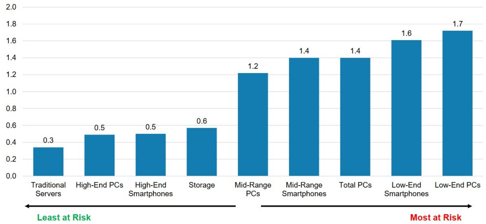
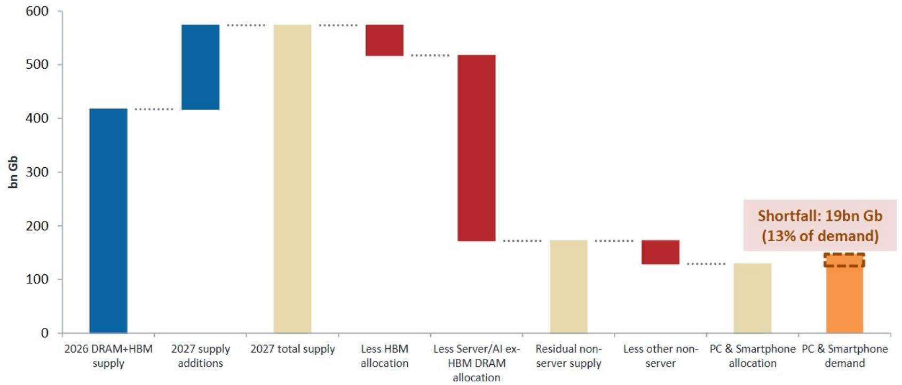

# 市场真正低估的不是AI芯片，而是存储器正在变成新的定价权

过去十二个月，存储器价格上涨超过六倍。DRAM合约价格同比飙升超过650%。这个数字本身已经足够震撼，但真正重要的不是幅度，而是结构。

某外资投行最新发布的研报提出了一个核心判断：AI需求正在将存储器从“周期性大宗商品”转变为“战略性瓶颈资产”。这个转变的后果，远不止是存储器厂商的利润表变漂亮。它正在重塑从芯片设计、设备采购到终端产品定价的整条产业链权力结构。

报告用了一个词来概括这种现象——Chipflation。芯片通胀。但这不是普通的成本推动型通胀，而是一种由需求结构突变和供给集中共同制造的“分配型通胀”。谁能在新的分配秩序中占据有利位置，谁就能在未来的产业博弈中掌握主动权。

## 1. 存储器TAM的扩张不是线性增长，而是结构性的量级跳跃

报告预测，到2028年，全球存储器市场规模将从当前水平大幅跃升。但真正值得关注的不只是数字，而是增长来源的彻底切换。

过去二十年，存储器需求的主要驱动力是智能手机和PC。每一代新iPhone、每一轮Windows升级，都会拉动一轮存储器周期。但那个时代已经过去了。报告提供的数据显示，到2028年，服务器在DRAM需求中的占比将从2021年的34%升至59%，而智能手机和PC的合计占比将从52%骤降至24%。NAND领域的趋势更加极端：企业级SSD的占比将从2021年的20%飙升至2028年的65%，智能手机和PC SSD的份额则被压缩到不足四分之一。

这意味着什么？意味着存储器需求的增长引擎已经从“人人手中有一台设备”变成了“每个数据中心里堆叠越来越多的服务器”。前者的增长受制于消费者换机周期和购买力，后者的增长则取决于AI训练和推理的算力需求——而后者目前看不到任何天花板。

这一转变的直接后果是，存储器不再是一个跟随宏观经济的滞后指标，而是变成了AI基础设施投资的先行指标。当企业决策者还在讨论AI应用何时落地时，存储器出货量和价格已经在用最直接的方式宣告：AI基础设施建设正在以超出大多数人预期的速度推进。

## 2. 供给端的三重集中让买方议价权急剧萎缩

需求端的结构性跃升只是故事的一半。供给端的变化才是真正让存储器从“买方市场”转向“卖方市场”的关键。

报告指出，全球DRAM市场由三家厂商控制约90%的产出——三星、SK海力士和美光。NAND市场的集中度同样极高。这种供给集中的格局并非新鲜事，但真正的新变量是：AI需求正在将最先进的产能优先分配给HBM（高带宽存储器）和服务器DRAM，而普通消费级存储器的供给正在被系统性挤压。

报告用了一个非常直观的框架来说明这一点：存储器供应存在一个清晰的“分配层级”。最顶层的超大规模云厂商和AI加速器生态可以签长期协议、预付定金，确保拿到HBM和服务器DRAM。第二层的服务器OEM和云基础设施厂商也能通过战略合同获得相对稳定的供应。但从第三层开始——也就是高端PC和智能手机OEM——只能签年度合同，而到了第四层和第五层（汽车、工业、中小企业、初创公司），则只能依赖现货市场，承受更高的价格波动和更不确定的供应。

这不是一个临时的供需错配，而是一个由AI需求优先级驱动的、系统性的资源再分配。报告预测，到2027年，这种AI优先分配将导致PC DRAM出现约15%的供应缺口，智能手机DRAM出现约12%的缺口。换算成终端设备，相当于约5800万台PC和1.34亿部智能手机将因为存储器短缺而无法生产。

这个数字意味着什么？意味着在AI时代，存储器厂商实际上拥有了“决定谁先拿到货”的权力。这种权力在过去二十年里从未出现过。过去，存储器是买方市场，终端厂商可以轻松切换供应商、压价、囤货。现在，情况完全反了过来。

## 3. 低端设备是这场通胀中最脆弱的环节

如果把上述逻辑再推进一步，就会发现一个更残酷的现实：这场存储器通胀对不同价格段的终端设备影响极不均衡。

报告提供了一个需求弹性分析框架。传统服务器的需求弹性仅为0.3，高端PC和高端智能手机为0.5。这意味着即使价格上涨，这些产品的需求也不会大幅下降。但低端智能手机的需求弹性高达1.6，低端PC高达1.7。换句话说，当存储器价格上涨时，低端设备的生产和需求将首先被压缩。

这个结论的产业含义非常清晰：存储器通胀正在加速消费电子市场的两极分化。高端产品可以通过提价来消化成本上涨，甚至因为供应有限而获得更高的溢价。低端产品则面临两难——提价会丢失市场份额，不提价则利润被吞噬。最终的结果可能是，低端市场的产品规格被迫削减（减少内存容量、使用更慢的存储器），或者直接推迟发布。

这对投资者意味着什么？意味着在存储器上行周期中，拥有高端产品线和强定价能力的终端厂商反而可能受益，而那些依赖低端走量的厂商则将面临利润和份额的双重压力。这不仅仅是存储器厂商的故事，更是整个消费电子产业链的重新洗牌。

## 4. 政策干预的空间存在，但远水不解近渴

面对存储器价格飙升，一个自然的问题是：政策能否介入？

报告讨论了两种可能的政策路径。对于HBM和先进DRAM，政策目标可能是保护战略性AI输入、延缓竞争对手的获取。对于普通存储器，政策目标则可能是避免过度限制、缓解成本压力。

但报告也明确指出，政策干预面临三个关键约束：程序、时机和公众认知。即使政策制定者决定行动，从政策设计到实际效果落地，也需要数年时间。而在AI需求持续爆发的当下，这个时间差足以让存储器厂商完成一轮利润积累和产能扩张的完整周期。

更值得关注的是，报告提出了一个关于中国产能的假设性情景。中国大陆目前占全球存储器产能的约18%，预计到2028年将升至23%以上，是仅次于韩国的第二大产能增量来源。在NAND领域，如果结合长江存储的产能扩张和良率提升，以及三星西安厂和Solidigm大连厂的节点迁移，中国大陆的增量产出可能达到2028年全球NAND供应的17%至33%。

但报告明确表示，这并非其基准情景。关键制约因素不是中国的投资意愿，而是能否获得领先的制造设备——特别是EUV光刻机。只要对中国的设备出口管制不解除，中国的产能扩张就会受到实质性限制。这意味着，至少在可预见的未来，全球存储器供给的增量将主要来自韩国和现有头部厂商，供给集中的格局很难被打破。

## 5. 报告尚未完全回答的三个关键问题

这份报告提供了极其扎实的数据框架和逻辑推演，但作为读者，有几个问题仍然悬而未决。

第一个问题是：HBM对先进产能的挤占效应何时会达到极限？报告显示，HBM在领先级存储器晶圆中的占比将从2023年的约6%升至2028年的约34%。但这个占比是否有一个自然的上限？如果AI需求继续超预期增长，HBM是否会进一步挤占服务器DRAM甚至自身？这个动态平衡点在哪里，报告没有给出明确的判断。

第二个问题是：存储器厂商的定价权能持续多久？历史上，存储器是一个高度周期性的行业，每次价格上涨都会引发大规模的产能扩张，然后供过于求、价格暴跌。但这一次，AI需求的持续性和供给集中的结构性变化，是否意味着“这次不一样”？报告倾向于认为结构性因素已经改变，但并没有给出一个清晰的框架来判断定价权何时会边际减弱。

第三个问题是：终端设备厂商有没有替代方案？如果存储器价格持续高企，终端厂商是否会加速研发新的存储架构、采用更少的存储器、或者转向其他类型的存储技术？这些替代路径的技术可行性和时间表，报告没有深入展开。

这些问题的答案，将决定我们如何理解这场“芯片通胀”的持续时间和最终影响。它们也是继续深入阅读这份完整报告的最大动力。

## 6. 投资者的观察框架：从供需总量转向分配结构

基于报告的框架，我们认为投资者需要调整自己的分析范式。过去，判断存储器周期的核心变量是供需总量——全球产能增长多少、需求增长多少。但在AI时代，更重要的变量是“分配结构”——谁拿到了多少、以什么价格、通过什么合同形式。

具体来说，有三个维度值得持续跟踪。

第一，关注头部存储器厂商的合同结构和客户构成。长期协议占比越高、预付款越多，说明其定价权越强，收入的可预见性越高。相反，如果一家存储器厂商的客户以低层级终端厂商为主，其收入和利润的波动性就会更大。

第二，关注终端设备厂商的库存管理和供应商关系。能够与存储器厂商签订长期协议、建立战略合作的终端厂商，将在供应紧张期获得明显的竞争优势。而那些依赖现货市场采购的厂商，将面临成本和供应的双重不确定性。

第三，关注存储器设备和材料供应商的订单趋势。报告指出，从设备订单下达到合格的存储器产出，存在1到2年的滞后。因此，ASML、AMAT、东京电子等设备厂商的订单数据，是预测未来存储器产能释放节奏的领先指标。

这些观察框架可以帮助投资者在宏观叙事中找到具体可追踪的信号，而不是被价格的短期波动牵着走。

---

以上分析基于某外资投行最新发布的存储器行业深度报告。报告还详细讨论了HBM的技术演进路径、各区域产能扩张的具体节奏、以及不同终端市场对存储器涨价的承受能力等更细颗粒度的内容。这些内容因篇幅限制无法在此一一展开。

如果你对以下问题感兴趣：HBM对先进产能的挤占何时会达到极限、中国产能扩张的真实进度、以及终端厂商是否有可行的替代方案——欢迎来我们的星球微信群里继续讨论。我们将围绕这份报告的核心图表和数据，组织一次专题讨论，逐一拆解那些报告没有完全回答的关键问题。

Personal reading notes and learning share only. Not investment advice.

