# Global Technology

# Computex 2026 Takeaways

A full suite of racks in a Nvidia Vera Rubin POD was on full display at Computex, including the Vera rack, Storage rack, Groq 3 LPX rack, Spectrum-X CPO Switch, and Vera Rubin NVL72. Nvidia also introduced its Agentic PC chip RTX Spark chip, which is scheduled to launch in the fall.

# Key Takeaways

We don't think Kyber will be ready for mass deployment in Rubin Ultra.   
- Our checks suggest the 800V DC power rack is on track to ship in 4Q26.   
■ Networking and power/data interconnects will play a bigger role in AI cluster.   
■ Mechanical components should also benefit from AI device growth.

The number of people attending Computex continues to surprise on the upside, which we view as a positive indicator for AI demand as a whole, as investors from around the world are flying in to look at the supply chain's latest breakthroughs on AI servers, from components to rack-level designs. NVIDIA's Vera CPUs were on display in different form factors, such as the MGX board used in a Vera rack, or in the HGX board. For the standalone Vera CPU rack, it comes with 125/256 CPUs per air/liquid-cooled rack and MP is scheduled for 4Q26. Hon Hai also showcased the Groq 3 LPX compute tray, which is expected to enter production in 3Q26, while Wistron/Wiwynn's BlueField-4 STX storage rack highlights growing storage/networking attach. Based on Nvidia's Vera Rubin POD, every 8 Vera Rubin NVL72 will be accompanied by 1 Vera CPU standalone rack, 1 STX storage rack, and 5 Groq 3 LPX racks. See our Compute quick takes here, and Rubin Rack BOM Analysis here.

Power and cooling continue to be a key highlight at COMPUTEX this year as well, as rack density and chip TDP continue to rise. NVIDIA's 800V DC roadmap points to 800V DC standalone power rack readiness in 3Q26, a 1.6MW power center, and 4.8MW power blocks from 1Q28, while Delta highlighted SST and fuel-cell solutions. On cooling, vendors showcased liquid-to-air, liquid-to-liquid and in-row CDUs, including Delta's 3MW in-row CDU and planned 6.8MW version by year-end. FIT's busbars and QDs, Vera Rubin liquid-cooling readiness for 3Q26 mass production, and longer-term microchannel lids all point to a faster thermal-content upgrade cycle, though yield, leakage and reliability qualification remain key hurdles.

AI PC will take time to bear fruit: NVIDIA introduced RTX Spark, an Arm-based SoC combining Grace CPU, Blackwell GPU, AI acceleration and unified memory, with shipments to start from fall 2026. The highest-end spec notebook will likely exceed US\$3K, but it also comes in a desktop form factor. However, we expect limited near-term demand impact. AI power users will be the first to buy, but many have already bought Mac Minis earlier in the year. That said, we believe the DT form factor makes more sense as Jensen's vision is to have this running 24/7 in your home.

MS TAIWAN LIMITED+

# Howard Kao

Equity Analyst

Howard.Kao@morganstanley.com +886 2 2730-2989

# Sharon Shih

Equity Analyst

Sharon.Shih@morganstanley.com +886 2 2730-2865

# Derrick Yang

Equity Analyst

Derrick.Yang@morganstanley.com +886 2 2730-2862

# Samantha Chen

Research Associate

Samantha.Chen@morganstanley.com +886 2 2730-2876

# Irene Yen

Research Associate

Irene.Yen@morganstanley.com +886 2 2730-2869

# Vivi Huang

Research Associate

Vivi.Huang@morganstanley.com +886 2 2730-2860

# GREATER CHINA TECHNOLOGY HARDWARE

# Asia Pacific

Industry View

In-Line

MS does and seeks to do business with companies covered in MS. As a result, investors should be aware that the firm may have a conflict of interest that could affect the objectivity of MS. Investors should consider MS as only a single factor in making their investment decision.

# For analyst certification and other important disclosures, refer to the Disclosure Section, located at the end of this report.

+= Analysts employed by non-U.S. affiliates are not registered with FINRA, may not be associated persons of the member and may not be subject to FINRA restrictions on communications with a subject company, public appearances and trading securities held by a research analyst account.

# Servers and PCs

# Vera CPU Compute Tray / Rack

There are 2 Vera CPUs on a NVIDIA MGX Vera CPU board (Exhibit 2), 4 Vera CPU board in a Vera CPU compute tray (Exhibit 1) and 16/32 Vera CPU compute trays in a Vera CPU rack (Exhibit 4), so 128/256 Vera CPUs per rack (air-cooled/liquid-cooled). Each Vera CPU has "up to" 1.5TB SOCAMM LPDDR5X memory. During our Spotlight on Computex 2026 meeting (report link), Brand Cheng, the chairman of Foxconn Industrial Internet, said he expects to kick off mass production of the Vera CPU rack (L11) in 4Q26. Based on Nvidia's Vera Rubin POD, there is 1 Vera CPU rack per 8 Vera Rubin NVL72 racks.

Exhibit 1: Vera CPU compute tray   
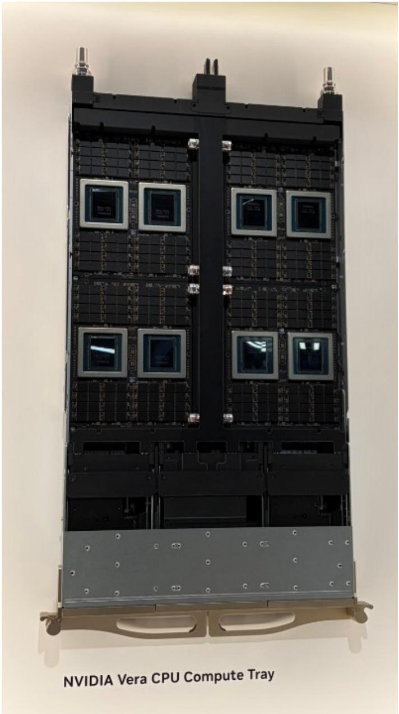

natural_image

Interior view of a NVIDIA Vera CPU Compute Tray module showing internal components and mounting hardware (no text or symbols on the device itself)

Source: NVIDIA, MS.

Exhibit 2: MGX Vera CPU board   
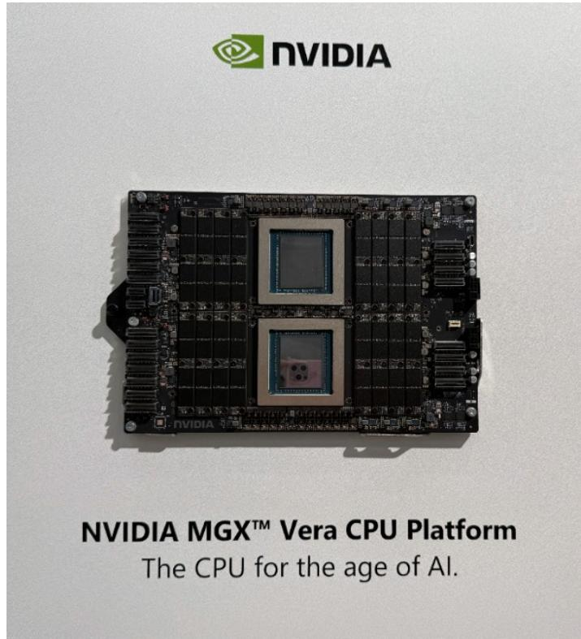

text_image

NVIDIA
NVIDIA MGX™ Vera CPU Platform
The CPU for the age of AI.

Source: Compal, MS.

Exhibit 3: HGX Vera CPU board   
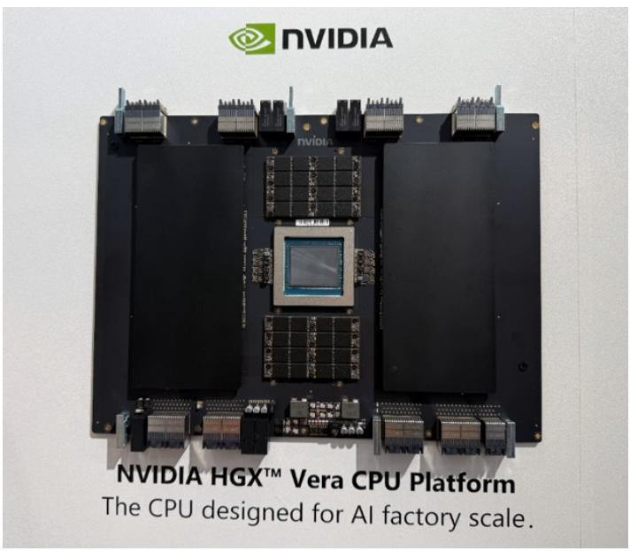

text_image

NVIDIA
NVIDIA HGXTM Vera CPU Platform
The CPU designed for AI factory scale.

Source: Compal, MS.

Exhibit 4: Air-cooled Vera CPU rack with 2U compute trays (right)   
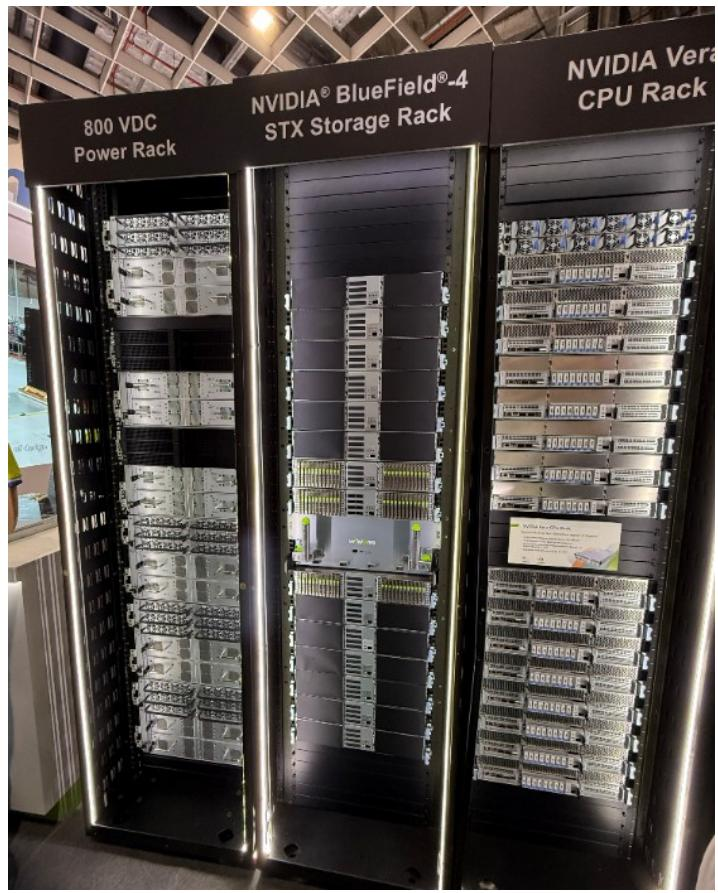

text_image

800 VDC
Power Rack
NVIDIA® BlueField®-4
STX Storage Rack
NVIDIA Vera
CPU Rack

Source: Wistron/Wiwynn, MS.

# Groq 3 LPX Compute Tray

Hon Hai showcased a Groq 3 LPX compute tray at its booth (but this one below was taken at NVIDIA GTC Taipei, not at Hon Hai's booth). Per our checks, each LPX compute tray houses 1 Intel CPU, 2 Altera FPGAs, 1 BF-4 module, 16 LPXs and 28 QDs (20 MQD04 + 4 MQDB + 4 UQD08), with a 52L (26+26) PCB. During our Spotlight on Computex 2026 meeting (report link), Brand Cheng, the chairman of Foxconn Industrial Internet, said he expects to kick off mass production of the LPX CPU rack (in L10 and L11) in 3Q26. Based on Nvidia's Vera Rubin POD, there are 5 Groq 3 LPX racks per 8 Vera Rubin NVL72 racks.

Exhibit 5: LPX compute tray   
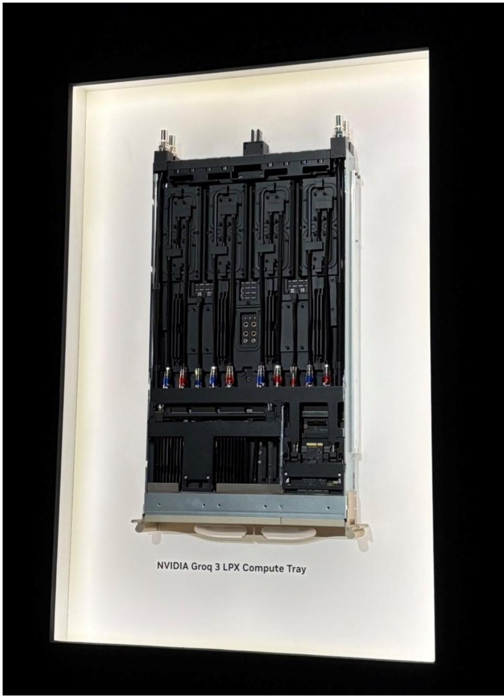

text_image

NVIDIA Groq 3 LPX Compute Tray

Source: NVIDIA, MS.

# NVIDIA BlueField $^{®}$ -4 Storage Processor / STX Storage Rack

Wistron/Wiwynn showcased a NVIDIA BlueField $^{®}$ -4 storage processor (Exhibit 6) and a NVIDIA BlueField $^{®}$ -4 STX storage rack (Exhibit 7) at their booth. Each 2U tray containing 2 Vera CPUs, 4 ConnectX-9 NICs and 24 SSDs consumes 1.2-1.3kW, and 16 such trays make a STX rack. Based on Nvidia's Vera Rubin POD, there is 1 STX rack per 8 Vera Rubin NVL72 racks.

Exhibit 6: BlueField®-4 storage processor   
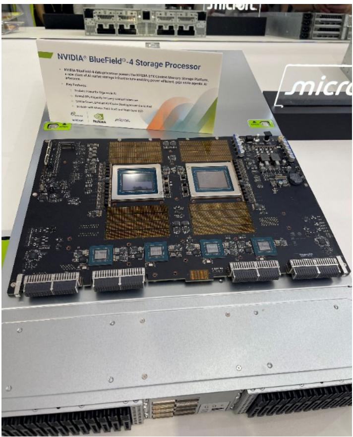

text_image

NVIDIA® BlueField®-4 Storage Processor
• NVIDIA BlueField®-4 data processor powers the NVIDIA ETC Control Memory Storage Platform, a row (less of AI-market stocks blueberries enabling power efficient, go into generic AI)
• Key Features:
• Stabilized hardware for memory tools
• Fixed GPU efficiency in low-concentive hardware
• Single Power, 25GHz and 100V DC drive power (in FiND)
• Switch with Micro-TM3.3 drives and Quad Drive SSD

Source: Wistron/Wiwynn, MS.

Exhibit 7: BlueField®-4 STX storage rack (middle)   
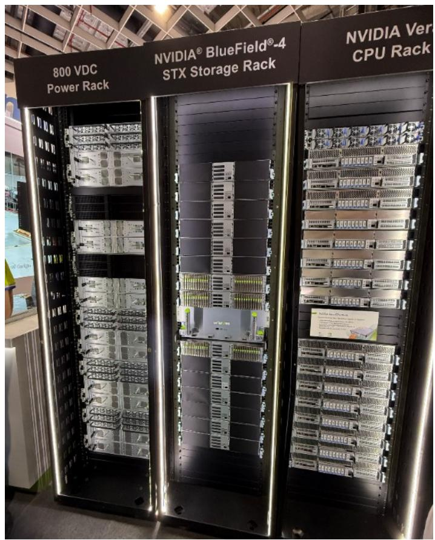

text_image

800 VDC
Power Rack
NVIDIA® BlueField®-4
STX Storage Rack
NVIDIA Ver
CPU Rack

Source: Wistron/Wiwynn, MS.

# FIT's Interconnect and Power Supply Solutions

At Hon Hai's booth, we got to see FIT's interconnect and power solutions for VR200 NVL racks as well. For the 44L midplane PCB (Exhibit 8), we believe primary suppliers are VGT, WUS and Kinwong, while Zhen Ding is trying for qualifications as well. For the Paladin HD2 connectors for VR200 NVL72 midplanes and cable cartridges (Exhibit 9), our latest checks indicate ASP could reach US\$70-90+ per set, which is much higher than our previous estimate. For the next-generation Kyber racks, our checks have indicated that a new midplane connector called "Voronoi" will be introduced (report link), and FIT is the key design partner for this new board-to-board connector. The Voronoi connector was not out for display at the booth, though, as the designs have yet to be finalized; we believe FIT is currently working on yield improvement and cost optimization with its supply chain partners for Voronoi, particularly around the pogo pin designs.

FIT also showcased its power solutions (primarily in-tray busbars, liquid-cooled rack busbars and power whips) for VR200 NVL72 at the booth (Exhibit 11). This is an area where we believe FIT will be able to gain meaningful shares, starting with the Rubin platform. For the VR200 liquid-cooled busbar show in Exhibit 12, our checks indicate FIT's ASP could be in the range of US\$3,000-4,000; pricing of the next-gen rack busbar will likely be finalized by EoY 2026.

Exhibit 14 shows FIT's quick disconnects (QDs) products. For the 2" FFQD used in CDUs, we believe there are only two primary suppliers – Danfoss and FIT, and the ASP is roughly

US\$400-700 per piece, though FIT's prices could be slightly lower than this. Additionally, our checks indicate that NVIDIA is looking to introduce a new QD design for Rubin Ultra server racks, in order to achieve higher water flow per area per second, as cooling requirements increase with the TDPs of chips. We believe FIT is the primary designer of this "new QD", which implies potential disruption to the competitive landscape of the QD market.

Last but not least, FIT's external laser small form-factor pluggable (ELSFP) was another key focus at the booth (Exhibit 13). Our checks indicate that the ASP of a 20dBm (decibel-milliwatts)/100mW (milliwatts) ELSFP could reach US\$400-500, primarily driven by the high cost of lasers in the module; the 23dBm/200mW ELSFP was still a prototype, so its price has not been determined. We believe ELSFP will be more of a growth driver to FIT from 2H27 onwards.

Exhibit 8: FIT's VR200 NVL72 midplane   
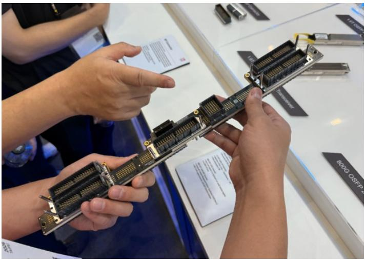

natural_image

Close-up of hands assembling electronic circuit boards with visible components and connectors (no text or symbols)

Source: FIT, MS.

Exhibit 10: FIT's backplane connector   
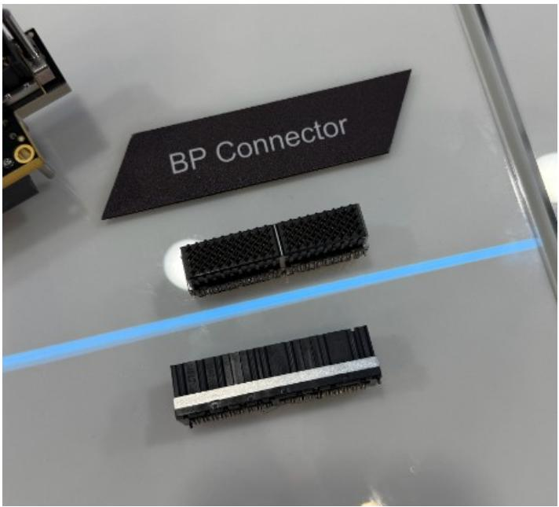

text_image

BP Connector

Source: FIT, MS.

Exhibit 9: FIT's VR200 NVL72 midplane   
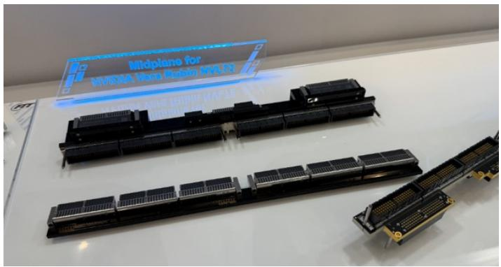

text_image

Midplane for
MVRDA Vortex Modbus MVL72

Source: FIT, MS.

Exhibit 11: FIT's power solutions for Vera Rubin NVL72 and Rubin NVL8 (HGX)   
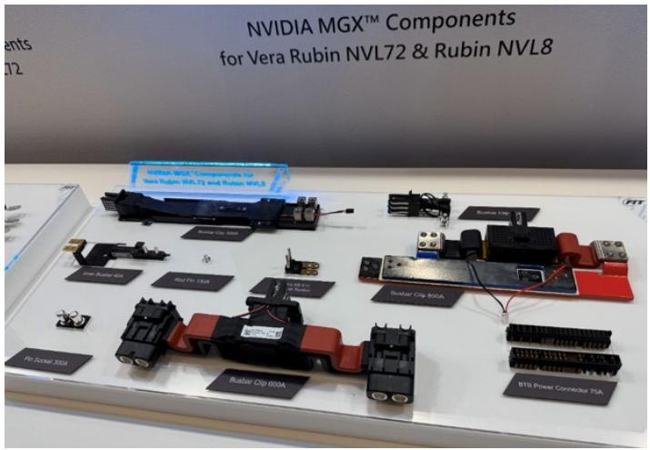

text_image

NVIDIA MGXTM Components
for Vera Rubin NVL72 & Rubin NVL8
WISA MGX™ Components for
Vera Rubin NVL72 and Rubin NVL8
Bustar Clip 600A
Bustar Clip 600A
Bustar Clip 600A
Bustar Clip 600A
Bustar Clip 600A
Bustar Clip 600A
Bustar Clip 600A
Bustar Clip 600A
Bustar Clip 600A
Bustar Clip 600A
Bustar Clip 600C
Bustar Clip 600A
Bustar Clip 600A
Bustar Clip 600A
Bustar Clip 600A
Bustar Clip 600A
Bustar Clip 600A
Bustar Clip 600A
Bustar Clip 600A
Bustar Clip 600A
Bustar Clip 600

Source: FIT, MS.

Exhibit 12: FIT's liquid-cooled busbar   
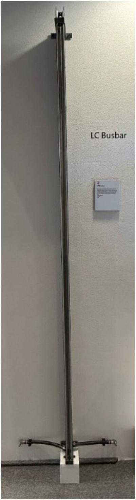

text_image

LC Busbar

Source: FIT, MS.

Exhibit 13: FIT's external laser small form-factor pluggables (ELSFP)   
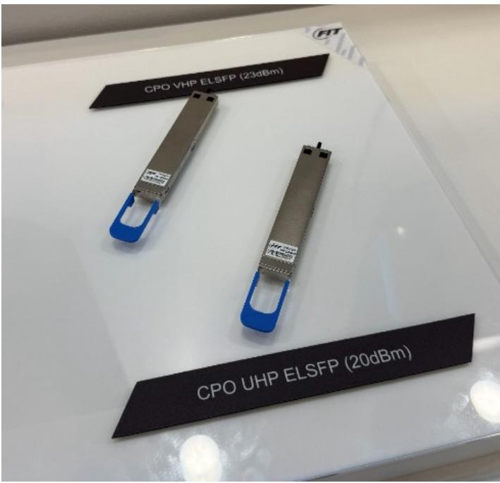

text_image

CPO VHP ELSFP (23dBm)
CPO UHP ELSFP (20dBm)

Source: FIT, MS.

Exhibit 14: FIT's quick disconnect (QDs)   
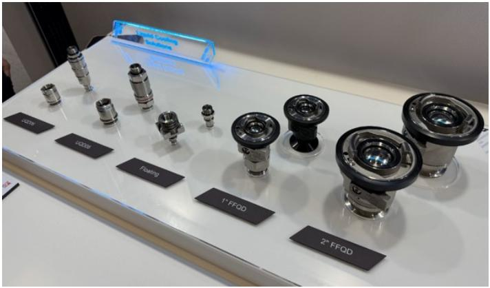

text_image

L278
L288W
Fainting
1" FFQD
2" FFQD

Source: FIT, MS.

# RTX Spark – redefining PC?

Another highlight is NVIDIA x MediaTek's RTX Spark for PCs: The Arm-based SoC, which combines a Grace CPU, Blackwell GPU, AI acceleration, and unified memory, was officially announced by NVIDIA CEO Jensen Huang at his 2026 Computex keynote speech. We got to see the RTX Spark notebooks from Lenovo, Asustek, MSI, Dell, HP and Microsoft at MediaTek's booth (Exhibit 15 and Exhibit 16); Asustek also showcased their RTX Spark PCs at its own booths (Exhibit 17 and Exhibit 18). During the financial analyst Q&A session, NVIDIA Jensen Huang also shared his vision on the future of PCs, where PCs don't simply work as "typewriters" but real agents that can complete tasks on the user's behalf, even when the user is not physically around.

While we don't argue against Jensen's vision on agentic PCs, we believe it's unlikely that RTX Spark will have a meaningful impact on PC end demand in the next 12 months. Our checks suggest the RTX Spark NBs target to ship from fall 2026 onwards, with price points likely reaching US\$3,000+ (on 128GB of DRAM) and combined shipments of only 5-10mn for the two variants (N1X, followed by N1) in the first 12 months. Our checks suggest a quarterly run rate of 200-250k units/quarter for the N1X chip, implying only \~1M units for the first 12 months. The higher prices will likely prevent the RTX Spark PCs from becoming mainstream, which implies that these PCs will hardly offset a "PC market rolling over", as we head into 2H with continued PC price hikes.

Initially, these "Agentic PCs" will only be bought by the real AI power users, but we have also seen a lot of these power users buying Mac Minis earlier in the same to run their AI workloads. As a result, we think volumes will likely come in below expectations. That said, between a laptop and a desktop form factor, we are of the view that the desktop form factor would make more sense as a PC that you keep at home running 24/7.

See also our report: Global PCs: Will RTX Spark Reinvigorate the PC Market? (3 Jun 2026)

# RTX Spark specs:

- Up to 128 GB unified memory   
- Up to 1 petaflop FP4 AI performance   
- Up to 20 core ultra-efficient CPU   
- Up to 6,144 core RTX GPU

- "All-day" battery life   
• Built for agents and AI

Exhibit 15: MSI, Dell and Lenovo's RTX Spark NBs   
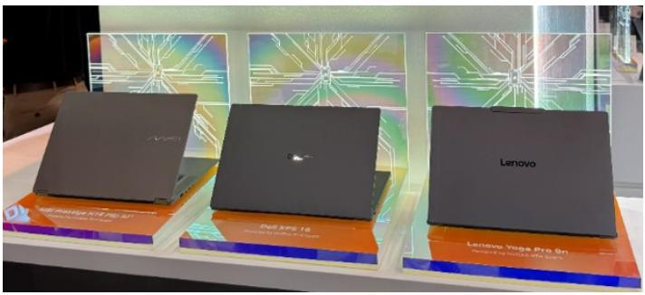

text_image

Duo XPS 10
Lenovo
Lenovo Yoga Pro 9n

Source: MediaTek, MSI, Dell, Lenovo and MS.

Exhibit 16: Microsoft, ASUS and HP's RTX Spark NBs   
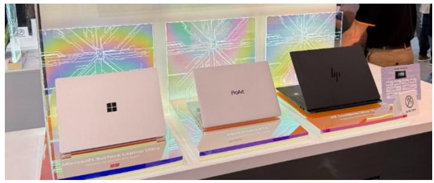

natural_image

Display of three laptops on a white shelf with colorful abstract graphics in the background (no visible text or symbols on main objects)

Source: MediaTek, Microsoft, ASUS, HP and MS.

Exhibit 17: ASUS ProArt Mini PC powered by NVIDIA RTX Spark   
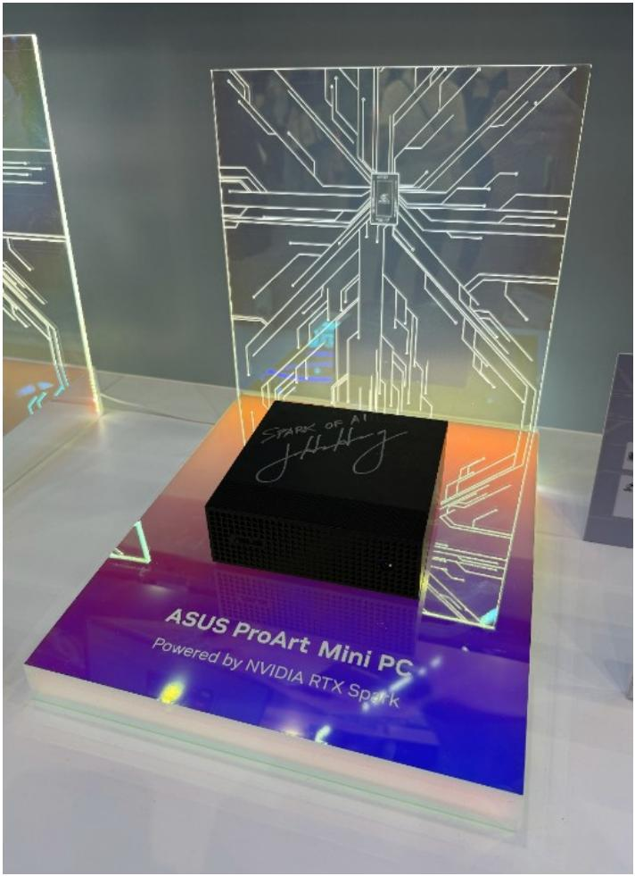

text_image

STARK OF AI
ASUS ProArt Mini PC
Powered by NVIDIA RTX Spark

Source: ASUS, MS.

Exhibit 18: ASUS ProArt P16 powered by NVIDIA RTX Spark   
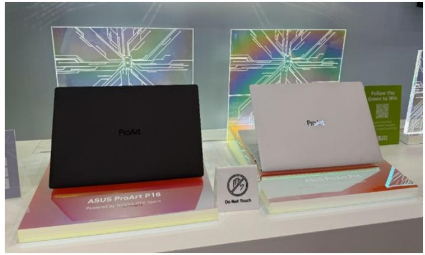

text_image

ProArt
ASUS ProArt P16
Powered by NVIDIA ProArt Spark
ProArt
Do Not Touch
Asus ProArt P16
Follow the Green to Win

Source: ASUS, MS.

# Power and Cooling

# 800 VDC Power Rack Aims for Mass Production in 3Q26

800 VDC deployment path throughout 2028: While 800V HVDC power solution remains in development, Nvidia at its GTC Taipei indicates the development will be separated in stages:

• 800 VDC power rack is ready for deployment in 3Q26   
• 800 VDC power center of 1.6MW will be ready in 2Q27   
- 800 VDC power block featured 4.8MW aims for ready for deployment In 1Q28

Exhibit 19: 800 VDC equipment readiness   
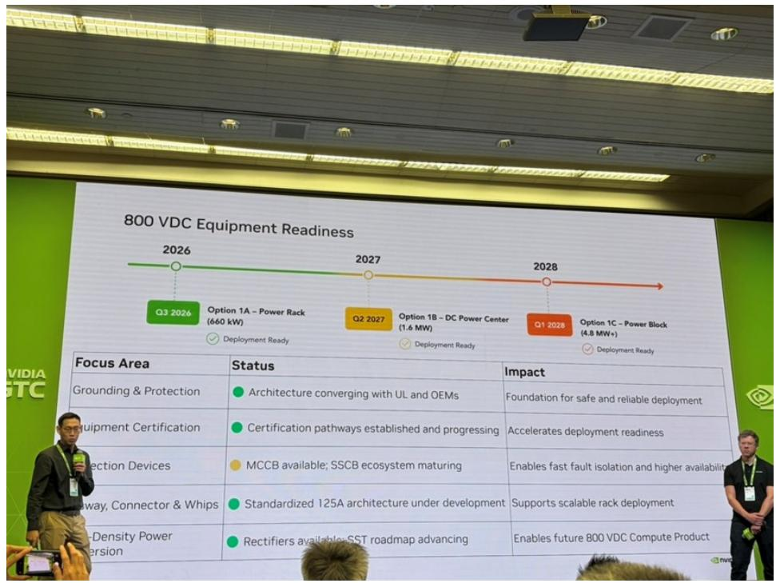

text_image

800 VDC Equipment Readiness
2026
Q3 2026 Option 1A – Power Rack
(660 kW) Q2 2027 Option 1B – DC Power Center
(1.6 MW) Q1 2028 Option 1C – Power Block
(4.8 MW+)
✓ Deployment Ready ✓ Deployment Ready ✓ Deployment Ready
Focus Area Status Impact
Grounding & Protection ● Architecture converging with UL and OEMs Foundation for safe and reliable deployment
Equipment Certification ● Certification pathways established and progressing Accelerates deployment readiness
Collection Devices ● MCCB available; SSCB ecosystem maturing Enables fast fault isolation and higher availability
Highway, Connector & Whips ● Standardized 125A architecture under development Supports scalable rack deployment
Density Power
version ● Rectifiers available SST roadmap advancing Enables future 800 VDC Compute Product

Source: Nvidia, MS.

At Computex, we have seen quite a few power solution vendors showcase 800 VDC standalone power racks, such as Delta Electronics, Lite-On Tech, Vertiv, Schneider, FLEX, etc. Our check suggests there will be two design specs for 800 VDC standalone power racks in 2H26 – one is featured 660kW (without BBU) and the other is 900kW (with BBU). Nvidia is collaborating with Microsoft and Google on OCP power distribution standards, meaning no +-400V transitional solution. The supply chain is currently working with UL, IEEE and NFPA for new DC regulatory standards to AI data centers. It is also important to work on grounding and protection system alignment across the industry.

The development of solid-state transformer (SST) technology will also continue for higher power density applications. Our checks suggest Delta also showcased models for SST and fuel cell. Our checks suggest Delta's fuel cell pilot run production is on track to start from 2H26 and targeted for mass production in Taoyuan plant with targeted capacity of 300MW. SST comes in the size of 10' container and features 98.5% conversion efficiency

with output power of 1-2MW.

Exhibit 20: Solid Oxide Fuel Cell   
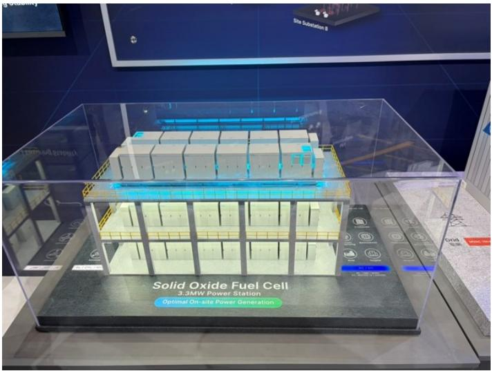

text_image

Solid Oxide Fuel Cell
3.3MW Power Station
Optimal On-site Power Generation

Source: Delta, MS.

Exhibit 21: Solid State Transformer   
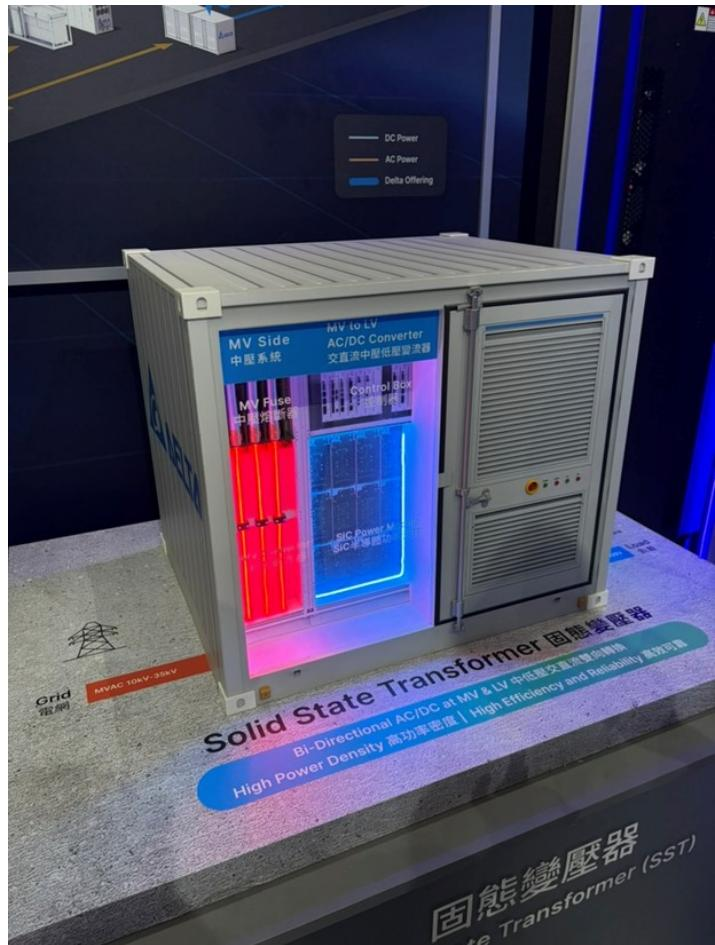

text_image

DC Power
AC Power
Delta Offering
MV Side
中壓系統
MV to LV
AC/DC Converter
交直流中壓低壓變流器
MV Rise
中壓波動器
Control Box
SiC Power M
SiC準等圖像
Solid State Transformer 固態變壓器
Bi-Directional AC/DC at MV & LV 中低壓交換高溫向轉停
High Power Density 高功率密度 | High Efficiency and Reliability 要效可靠
Grid
電網 MVAC 10kV-35kV
固態變壓器
State Transformer (SST)

Source: Delta, MS.

# TDP increases boost liquid cooling design upgrade

Various related vendors showcased liquid-to-air, liquid-to-liquid CDU and in-row CDU, signaling that future adoption will grow fast along with the Vera Rubin rack shipment ramp. General commentary suggests that a total solution offering and product reliability are key to winning. Delta showcased new 3MW liquid-to-liquid In-ROW CDU and targets to launch 6.8MW liquid-to-liquid In-ROW CDU by end of this year.

Exhibit 22: Delta's 3MW LTL In-ROW CDU   
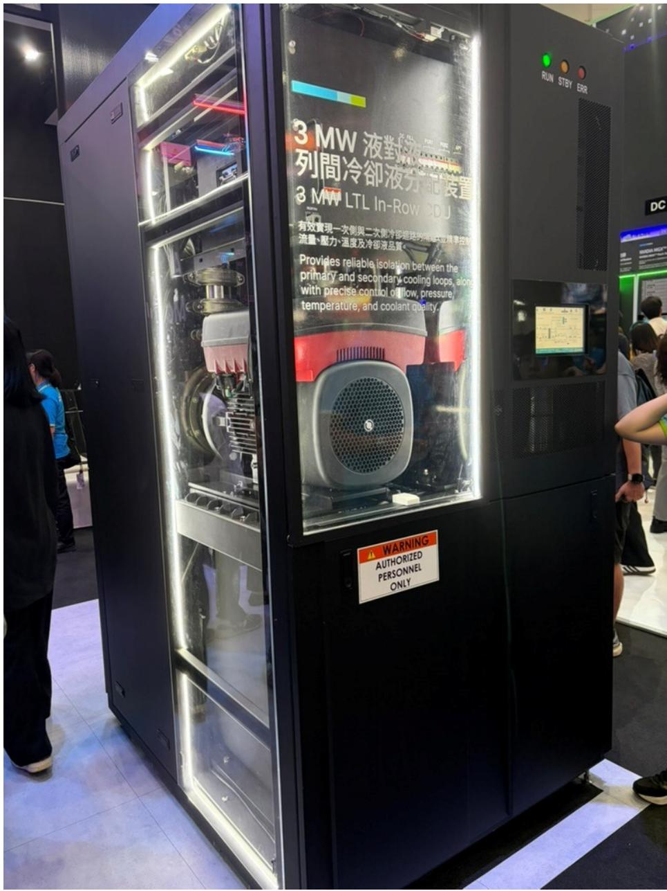

text_image

3 MW 液對液
列間冷卻液分配裝置
3 MW LTL In-Row CPU
有效實現一次側與二次側冷卻避難時常溫性控制準控制
流量、壓力、溫度及冷卻液品質。
Provides reliable isolation between the primary and secondary cooling loops, along with precise control offlow, pressure, temperature, and coolant quality.
WARNING
AUTHORIZED
PERSONNEL
ONLY

Source: Delta, MS.

# Liquid cooling design for Vera Rubin

Vera Rubin liquid cooling with Bianca board design is indicated to be ready for mass production in 3Q26. Our checks suggest the content value of cold plate modules, inner manifold and NVQD per GPU tray is \~ US\$2,500. As mentioned in our takeaways, our checks suggest NVIDIA is looking to introduce a new design for QDs used in the Rubin Ultra rack systems.

Exhibit 23: Nvidia Vera Rubin NVL72 GPU Tray and Switch Tray   
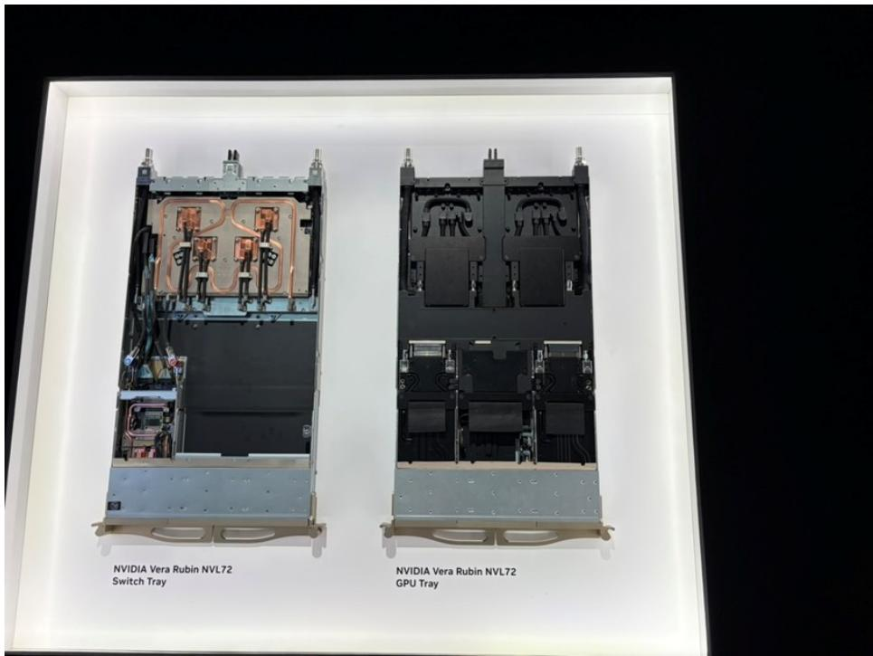

text_image

NVIDIA Vera Rubin NVL72
Switch Tray
NVIDIA Vera Rubin NVL72
GPU Tray

Source: Nvidia, MS.

# Microchannel lid the next to come

A microchannel lid is an advanced thermal lid in which a network of micro-scale channels is fabricated within a metal cap and coolant is actively circulated through these channels. Comparing to the traditional multi-layer structure of liquid cooling (die, TIM1, lid, TIM2, and cold plate), MCL eliminates multiple thermal interfaces, directly attached to TIM 1, and significantly increasing heat transfer efficiency. Thus, its thermal capabilities surpasses that of existing cold-plate solutions. We believe microchannel lids could be a potential thermal design for upcoming chip platforms because TDP for chips continues to increase and exceed the thermal capabilities of existing solutions.

However, our checks suggest the adoption of MCL will take time – manufacturing yield, leakage detection and long-term reliability requirements remain challenges. OSATs will need to introduce additional process steps and upgrade equipment to enable coolant-injection testing, pressure validation, and post-test cleaning prior to shipment to customers and downstream module assemblers. As MCL becomes an integral component of the silicon packaging flow, its qualification cycle is extended and demands extensive reliability testing to meet datacenter deployment standards

Exhibit 24: Jentech's Microchannel lid   
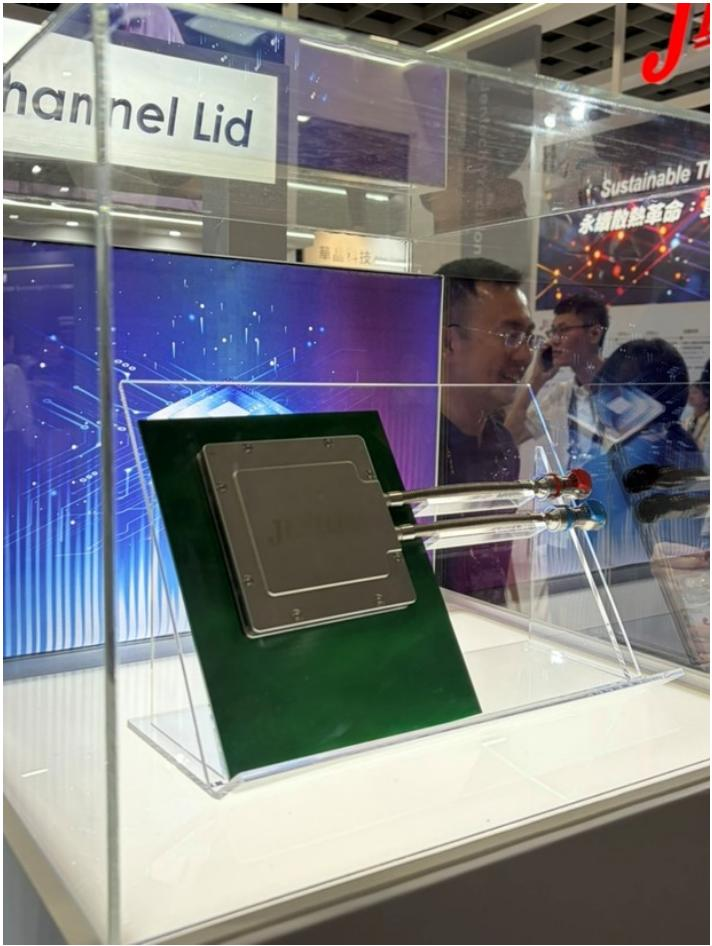

text_image

channel Lid
Sustainable T
永續散熱革命

Source: Jentech, MS

Exhibit 25: Delta's Micro Channel Lid   
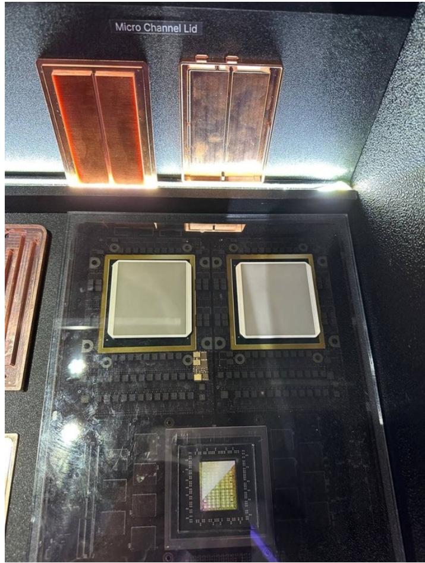

text_image

Micro Channel Lid

Source: Delta, MS.

# Networking, Interconnects and Mechanical Components

# Accton

Accton showcased an optical wavelength selection (OWS) switch, based on the optical engine from its subsidiary InLC. OWS can be used in the scale up and scale across network for the AI cluster. Moreover, it has another CPO based switch in its booth. We believe that these demonstrate that Accton has the capability design and manufacture network switches based on different technologies and protocols. Our checks indicate that Accton has been engaging with potential customers for the optical switches and there might be some revenue contribution from 2027.

Besides the network switches, Accton also showcased its rack level solution, Edgecore Open Fabric, which is designed as an open platform that can integrate compute, networking, storage, and other complementary sub modules. We believe that end customers are increasingly request their supply chain partners to provide the rack level solutions, instead of individual components and modules, so Accton is also moving toward this direction. That said, it's understandable that there are some concerns regarding the margin-dilutive rack business, but we believe that Accton will try to mitigate that through more internally developed content, including the network switch, compute tray/server module assembly, optical transceivers, liquid cooling system, etc. Through more valued added in the process, instead of just assembly the rack, Accton should have the chance to generate margins comparable to its corporate average from this rack level business. We believe there might be some revenue contribution from 2027.

Exhibit 26: Accton - OWS Switch   
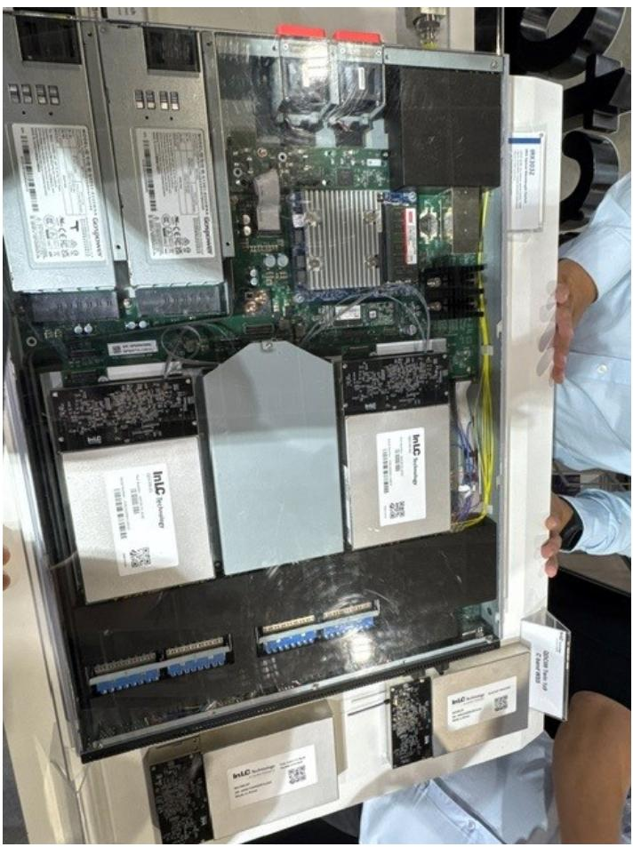

natural_image

Interior view of an electronic equipment cabinet with multiple InLC modules and a person interacting (no visible text or symbols on main components)

Source: Accton, MS.

Exhibit 27: Accton - Open Platform Rack Solution   
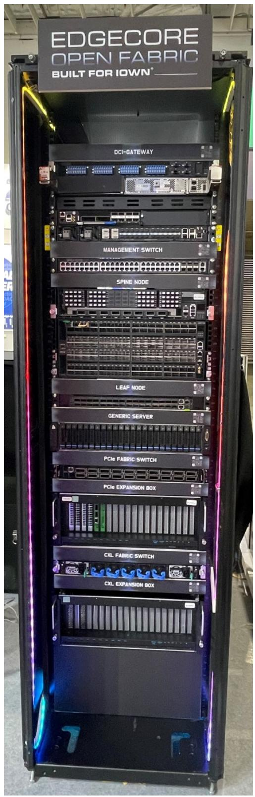

text_image

EDGECORE
OPEN FABRIC
BUILT FOR IOWN®
DCI-GATEWAY
MANAGEMENT SWITCH
SPINE NODE
LEAF NODE
GENERIC SERVER
PCIe FABRIC SWITCH
PCIe EXPANSION BOX
CXL FABRIC SWITCH
CXL EXPANSION BOX

Source: Accton, MS.

# Micro LED in optical communications

MediaTek (2454.TW, covered by Charlie Chan) showcased a prototype of micro LED based active optical cable during Computex this year. The basic concept is to replace the mainstream laser diode with micro LED chips as the light source in the optical communication modules.

Compared to the current laser-diode based optical modules, micro LED based ones can offer power savings (30-50%), copper level reliability, scalability, monolithic CMOS integration, etc.

This new optical module could be used in optical transceivers first and could also be adopted by the CPO architecture in the longer term.

We note that Credo (CRDO.US, not covered) have been talking about its active LED cables (ALC) for several quarters, which are based on the similar technology as mentioned above. Bizlink will be the assembly partner for Credo, which expects the revenue contribution from start from its GY2028 (starting May 2027)

Other supply chain players include Ennostar (3714.TW) for micro LED chips, Tyntek (2426.TW) for photodiodes and AUO (2409.TW) for glass based packaging.

Exhibit 28: Mediatek - Micro LED Optical Engine Prototype   
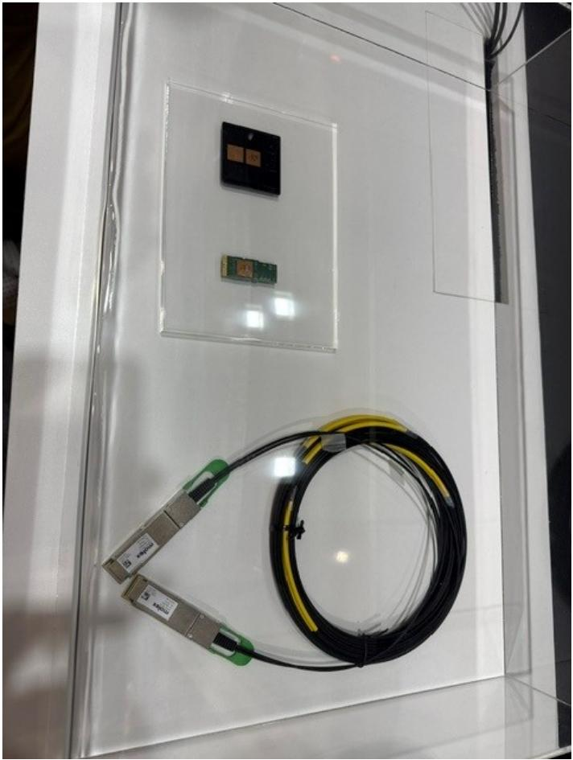

natural_image

Exterior view of a transparent lab enclosure with black fiber optic cables and small electronic components (no visible text or symbols)

Source: MediaTek, MS

Exhibit 29: Mediatek - Micro LED Optical Engine Prototype Spec   
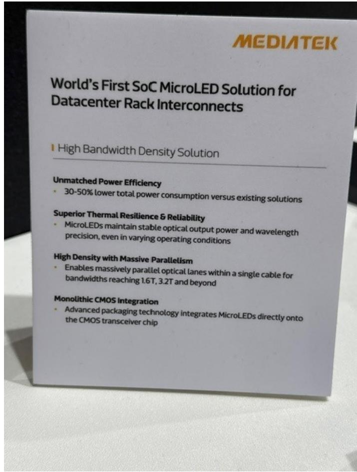

text_image

MEDIATEK
World's First SoC MicroLED Solution for
Datacenter Rack Interconnects
High Bandwidth Density Solution
Unmatched Power Efficiency
• 30-50% lower total power consumption versus existing solutions
Superior Thermal Resilience & Reliability
• MicroLEDs maintain stable optical output power and wavelength
precision, even in varying operating conditions
High Density with Massive Parallelism
• Enables massively parallel optical lanes within a single cable for
bandwidths reaching 1.6T, 3.2T and beyond
Monolithic CMOS Integration
• Advanced packaging technology integrates MicroLEDs directly onto
the CMOS transceiver chip

Source: MediaTek, MS

# Bizlink

# Power interconnects

Power whips and busbars are one of the major offerings at Bizlink. it showcased a variety of products with different specs that can fit into different customer demand. It has been one of the major suppliers in both the AI server and general server space, and we believe that it will stay competitive and even gain shares in some projects.

Exhibit 30: Power whips   
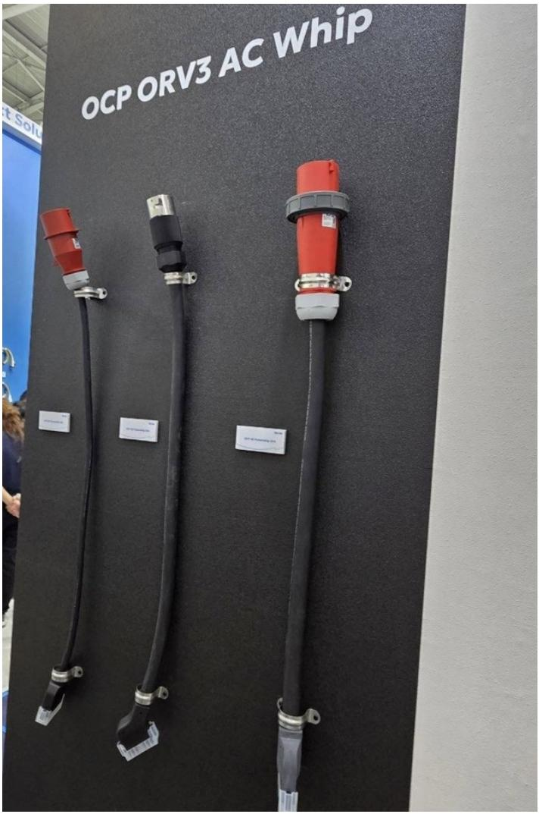

text_image

OCP ORV3 AC Whip

Source: Bizlink, MS

Exhibit 31: Busbars   
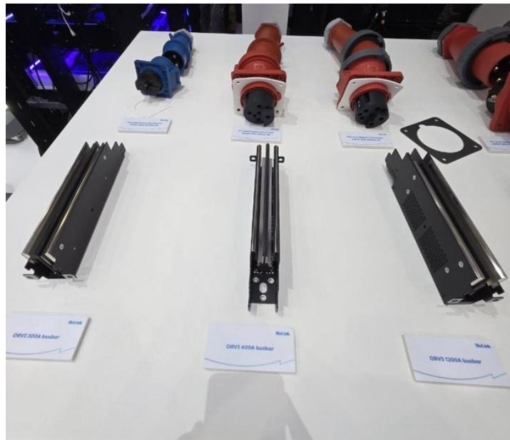

natural_image

Display of various industrial electrical connectors and heat sinks on a white table, no visible text or symbols on the devices themselves.

Source: Bizlink, MS

Exhibit 32: Busbar connectors   
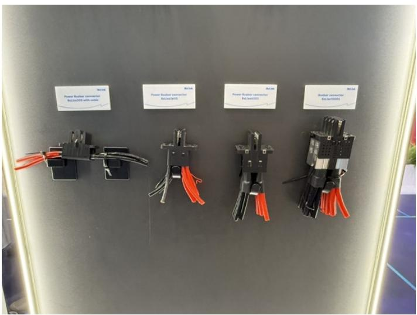

text_image

Reclim
Power Huber connector
Reclim/300 with 6x24
Reclim
Power Huber connector
Reclim/3015
Reclim
Power Huber connector
Reclim/3025
Reclim
Reclim
Reclim
Reclim/3035

Source: Bizlink, MS

Exhibit 33: Powerwhips and busbar cables   
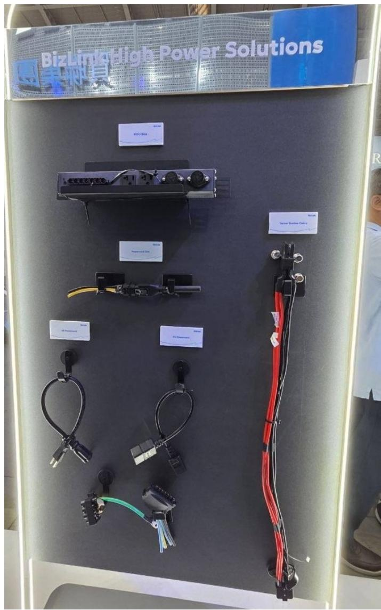

text_image

BizLink High Power Solutions
FBJ Box
Power cord cable
Power cord cable
Power cord cable
Power cord cable
Power cord cable
Power cord cable
Power cord cable
Power cord cable
Power cord cable
Power cord cable
Power cord cable
Power cord cable
Power cord cable
Power cord cable
Power cord cable
Power cord cable
Power cord cable
Power cord cable
Power cord cable
Power cord cable
Power cord cable
Power cord cable
Power cord cable
Power cord cable
Power cord cable
Power cord wire

Source: Bizlink, MS

# Data interconnect

Bizlink has a comprehensive portfolio of data interconnects, including DAC, AEC, AOC, etc. Those cables can support up to 1.6T of data rate now and could further evolve along with the industry spec upgrades

Through the acquisition of XFS, it also strengthened its capability in the optical fiber assembly and shuffle box. We expect the shuffle box shipment for CPO switch should start from 2027 and more meaningful shipment from 2028.

Exhibit 34: Bizlink - Shuffle Box   
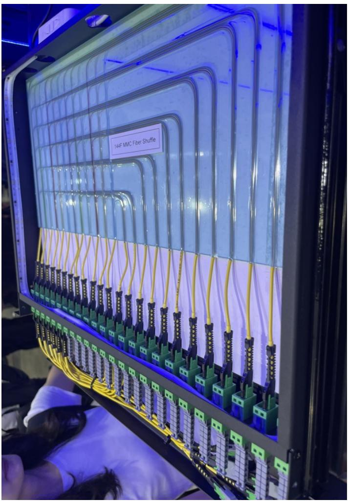

text_image

14F MMC Fiber Shuffle

Source: Bizlink, MS

Exhibit 35: Bizlink - High Speed Data Cables   
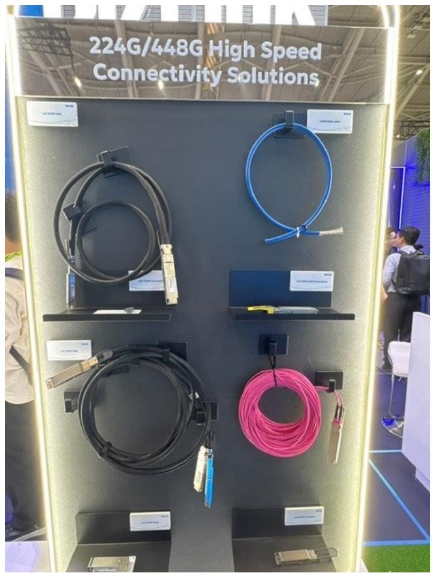

text_image

224G/448G High Speed
Connectivity Solutions
LTD GIFT NETS
LTD GIFT NETS
LTD GIFT NETS
LTD GIFT NETS
LTD GIFT NETS
LTD GIFT NETS
LTD GIFT NETS
LTD GIFT NETS
LTD GIFT NETS
LTD GIFT NETS
LTD GIFT NETS
LTD GIFT NETS
LTD GIFT NETS
LTD GIFT NETS
LTD GIFT NETS
NATI
NATI
NATI
NATI
NATI
NATI
NATI
NATI
NATI
NATI
NATI
NATI
NATI
NATI
NATI
NATI
NATI
NATI
NATI
NATI
NATI
NATI
NATI
NATI
NATI
NAT1

Source: Bizlink, MS

# Emerging businesses

Bizink have their data interconnect and power interconnect offerings designed for the low earth orbit (LEO), drone, autonomous driving and robotic dog applications. There offerings need special design and materials to meet the specific requirement in their stringent operating environments.

The revenue contribution from these applications are not significant yet, but it could represent good opportunities in the longer term

Exhibit 36: Bizlink - Offerings for LEO Satellite   
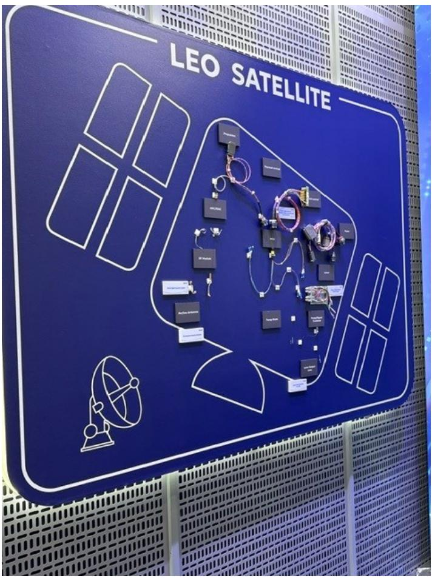

text_image

LEO SATELLITE

Source: Bizlink, MS

Exhibit 37: Bizlink - Offerings for Drone   
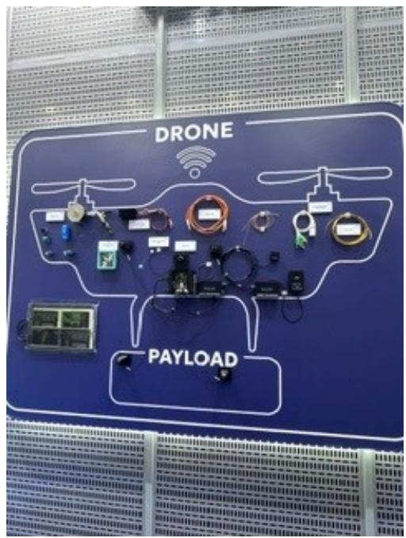

text_image

DRONE
PAYLOAD

Source: Bizlink, MS

Exhibit 38: Bizlink - Offerings for Autonomous Driving   
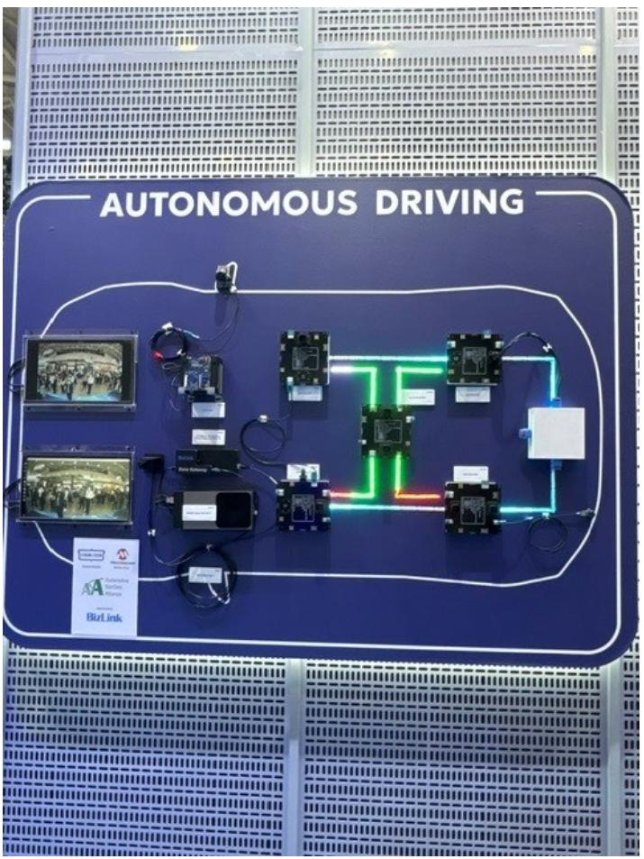

text_image

AUTONOMOUS DRIVING
BizLink

Source: Bizlink, MS

Exhibit 39: Bizlink - Offerings for Robotic Dog   
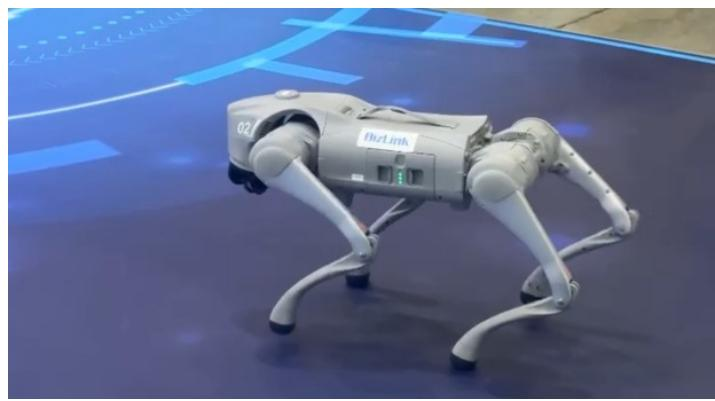

natural_image

Exterior view of a quadruped robot on a blue-tinted floor (no signage or text visible)

Source: Bizlink, MS

# Mechanical Components

# Chenbro

Chenbro showcased its 1U NVIDIA MGX Vera Rubin server chassis solution, along with a full series of AI chassis products—including 1U, 2U, 4U, and 6U models—developed based on NVIDIA MGX architecture, as well as the AMD Helios compute tray chassis.

The company also unveiled several full rack solutions compatible with Nvidia's VR NVL72. Chenbro has turned more aggressive on tapping into the rack business, as it has been engaging with multiple new projects. We believe the development of more AI-related racks, including IT racks, CPU racks, switch racks, power racks, CDU racks, etc should be a positive trend for Chenbro on more project opportunities

Additionally, Chenbro exhibited a model blueprint of its Malaysia factory, showing their diversified global footprint to stay resilient amid geopolitical risks and be more responsive to customer demand. The new capacity will start mass production in Malaysia in 3Q26, with more to come in the US in 4Q27.

# King Slide

For King slide (2059.TW), it has no booth in the Computex exhibition this time, but its rail kits are widely integrated into various racks showcased by different supply chain players. We are seeing the trend of more AI related devices adopting rail kits for the ease of maintenance and repair, which presents a bigger addressable market for King Slide.

Exhibit 40: Nvidia MGX chassis for Vera CPU   
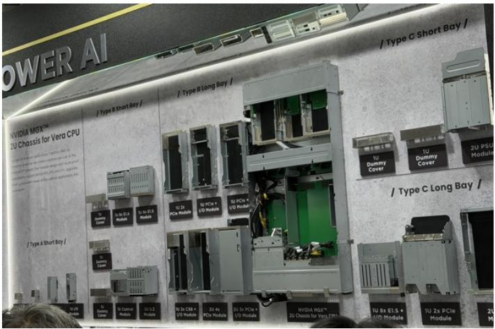

text_image

POWER AI
NVIDIA MGX™
2U Chassis for Vera CPU
/ Type A Short Bay /
/ Type B Short Bay /
/ Type C Long Bay /
10.1x 0.3 Module
10.2x 0.3 Module
10.2x PCM Module
10.3x 0.4 Module
10.3x PCM + I/O Module
10.3x PCM + I/O Module
10.3x Primary Cover
10.3x Primary Module
10.3x Primary Module
10.3x Primary Module
10.3x Primary Module
10.3x Primary Module
10.3x Primary Module
10.3x Primary Module
10.3x Primary Module
10.3x Primary Module
10.3x Primary Module
10.3x Primary Module
10.3x Primary Module
10.3x Primary Module
10,2x ELS + I/O Module
10,2x PCIe Module
10,2x PCIe Module

Source: Chenbro, MS

Exhibit 41: Nvidia MGX 2U chassis for Vera CPU - a closer look   
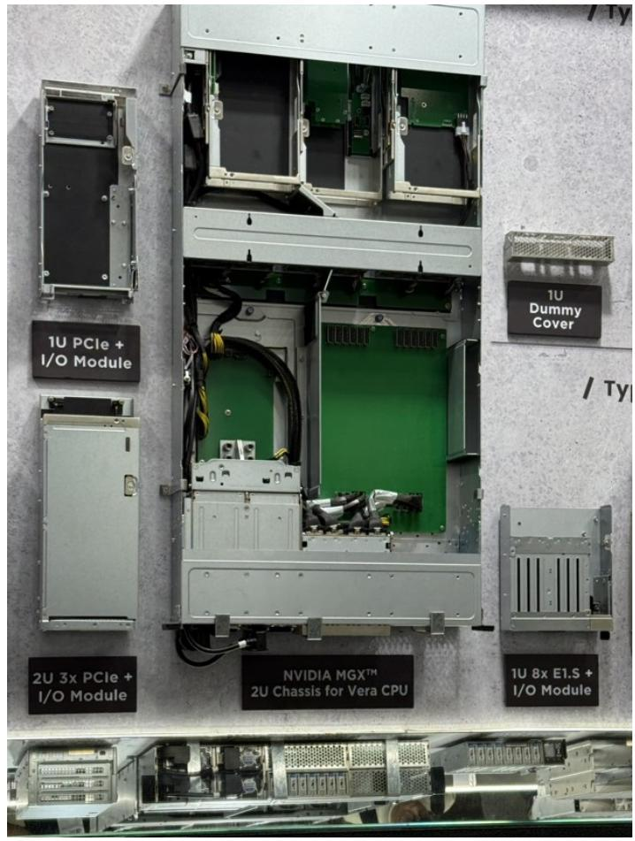

text_image

1U PCIe +
I/O Module
2U 3x PCIe +
I/O Module
NVIDIA MGXTM
2U Chassis for Vera CPU
1U 8x E1.S +
I/O Module
1U Dummy Cover
/ Ty

Source: Chenbro, MS

# Disclosure Section

The information and opinions in MS were prepared or are disseminated by MS & Co. LLC and/or MS C.T.V.M. S.A. and/or MS México, Casa de Bolsa, S.A. de C.V. and/or MS Canada Limited and/or MS & Co. International plc and/or MS Europe S.E. and/or RMB MS Proprietary Limited and/or MS MUFG Securities Co., Ltd. and/or MS Capital Group Japan Co., Ltd. and/or MS Asia Limited and/or MS Asia (Singapore) Pte. (Registration number 199206298Z) and/or MS Asia (Singapore) Securities Pte Ltd (Registration number 200008434H), regulated by the Monetary Authority of Singapore (which accepts legal responsibility for its contents and should be contacted with respect to any matters arising from, or in connection with, MS) and/or MS Taiwan Limited and/or MS & Co International plc, Seoul Branch, and/or MS Australia Limited (A.B.N. 67 003 734 576, holder of Australian financial services license No. 233742, which accepts responsibility for its contents), and/or MS Wealth Management Australia Pty Ltd (A.B.N. 19 009 145 555, holder of Australian financial services license No. 24-0813, which accepts responsibility for its contents), and/or MS India Company Private Limited having Corporate Identification No (CIN) U22990MH1998PTC115305, regulated by the Securities and Exchange Board of India ("SEBI") and holder of licenses as a Research Analyst (SEBI Registration No. INH000001105), Stock Broker (SEBI Stock Broker Registration No. INZ000244438), Merchant Banker (SEBI Registration No. INM000011203), and depository participant with National Securities Depository Limited (SEBI Registration No. IN-DP-NSDL-567-2021) having registered office at Altimus, Level 39 & 40, Pandurang Budhkar Marg, Worli, Mumbai 400018, India; Telephone no. +91-22-61181000; Compliance Officer Details: Mr. Tejarshi Hardas, Tel. No.: +91-22-61181000 or Email: tejarshi.hardas@morganstanley.com; Grievance officer details: Mr. Tejarshi Hardas, Tel. No.: +91-22-61181000 or Email: msic-compliance@morganstanley.com which accepts the responsibility for its contents and should be contacted with respect to any matters arising from, or in connection with, MS, and their affiliates (collectively, "MS"). MS India Company Private Limited (MSICPL) may use AI tools in providing research services. All recommendations contained herein are made by the duly qualified research analysts.

For important disclosures, stock price charts and equity rating histories regarding companies that are the subject of this report, please see the MS Disclosure Website at www.morganstanley.com/eqr/disclosures/webapp/generalresearch, or contact your investment representative or MS at 1585 Broadway, (Attention: Research Management), New York, NY, 10036 USA.

For valuation methodology and risks associated with any recommendation, rating or price target referenced in this research report, please contact the Client Support Team as follows: US/Canada +1 800 303-2495; Hong Kong +852 2848-5999; Latin America +1 718 754-5444 (U.S.); London +44 (0)20-7425-8169; Singapore +65 6834-6860; Sydney +61 (0)2-9770-1505; Tokyo +81 (0)3-6836-9000. Alternatively you may contact your investment representative or MS at 1585 Broadway, (Attention: Research Management), New York, NY 10036 USA.

# Analyst Certification

The following analysts hereby certify that their views about the companies and their securities discussed in this report are accurately expressed and that they have not received and will not receive direct or indirect compensation in exchange for expressing specific recommendations or views in this report: Howard Kao; Sharon Shih; Derrick Yang.

# Global Research Conflict Management Policy

MS has been published in accordance with our conflict management policy, which is available at www.morganstanley.com/institutional/research/conflictpolicies. A Portuguese version of the policy can be found at www.morganstanley.com.br

# Important Regulatory Disclosures on Subject Companies

As of April 30, 2026, MS beneficially owned 1% or more of a class of common equity securities of the following companies covered in MS: AAC Technologies Holdings, Accelink Technologies Co. Ltd., Accton Technology Corporation, AirTAC International, Asia Vital Components Co. Ltd., Auras Technology Co Ltd, Bizlink, Catcher Technology, Chenbro, Chroma Ate Inc., Delta Electronics Inc., E Ink Holdings Inc., Eoptolink Technology Inc Ltd, Fositek Corp, Genius Electronic Optical Co. Ltd., Giga-Byte Technology Co. Ltd., Gold Circuit Electronics Ltd., Hiwin Technologies Corp., Inspur Electronic Information, LandMark Optoelectronics Corporation, Lens Technology, Luxshare Precision Industry Co., Ltd., Nan Ya PCB, Pegatron Corporation, Radiant Opto-Electronics Corporation, Sunny Optical, Sunonwealth Electric Machine Industry Co, Suzhou TFC Optical Communication Co Ltd., Tong Hsing, Unimicron, Visual Photonics Epitaxy Co Ltd, Wistron Corporation, Wiwynn Corp, Xiaomi Corp, Yageo Corp., Zhejiang Crystal-Optech Co Ltd, Zhen Ding, Zhongji Innolight Co Ltd, ZTE Corporation.

Within the last 12 months, MS managed or co-managed a public offering (or 144A offering) of securities of Wistron Corporation, Wiwynn Corp, Zhen Ding.

Within the last 12 months, MS has received compensation for investment banking services from Lenovo, Wistron Corporation, Wiwynn Corp, Xiaomi Corp, Yageo Corp., Zhen Ding. In the next 3 months, MS expects to receive or intends to seek compensation for investment banking services from AAC Technologies Holdings, Accton Technology Corporation, Acer Inc., Advantech, AirTAC International, Asia Vital Components Co. Ltd., Asustek Computer Inc., AU Optronics, Bizlink, Catcher Technology, Chenbro, Compal Electronics, Delta Electronics Inc., E Ink Holdings Inc., Ennostar Inc, Eoptolink Technology Inc Ltd, FIT Hon Teng Ltd, Giga-Byte Technology Co. Ltd., GoerTek Inc, Gold Circuit Electronics Ltd., Hon Hai Precision, Innolux, Lenovo, Lens Technology, Lingyi Itech Guangdong Co, Lite-On Technology, Luxshare Precision Industry Co., Ltd., Pegatron Corporation, Q Technology (Group) Company Ltd, Quanta Computer Inc., Sanan Optoelectronics, Shenzhen Transsion Holdings Co Ltd, Suzhou TFC Optical Communication Co Ltd., TCL Corp., Unimicron, Wistron Corporation, Wiwynn Corp, Xiaomi Corp, Yageo Corp., Yangtze Optical Fibre and Cable JSC Ltd, Zhen Ding, Zhongji Innolight Co Ltd.

Within the last 12 months, MS has received compensation for products and services other than investment banking services from AAC Technologies Holdings, Accton Technology Corporation, Acer Inc., Asustek Computer Inc., AU Optronics, BYD Electronics, Compal Electronics, E Ink Holdings Inc., Eoptolink Technology Inc Ltd, Foxconn Technology, Giga-Byte Technology Co. Ltd., GoerTek Inc, Hon Hai Precision, Innolux, Lenovo, Lingyi Itech Guangdong Co, Quanta Computer Inc., Xiaomi Corp, Yageo Corp..

Within the last 12 months, MS has provided or is providing investment banking services to, or has an investment banking client relationship with, the following company: AAC Technologies Holdings, Accton Technology Corporation, Acer Inc., Advantech, AirTAC International, Asia Vital Components Co. Ltd., Asustek Computer Inc., AU Optronics, Bizlink, Catcher Technology, Chenbro, Compal Electronics, Delta Electronics Inc., E Ink Holdings Inc., Ennostar Inc, Eoptolink Technology Inc Ltd, FIT Hon Teng Ltd, Giga-Byte Technology Co. Ltd., GoerTek Inc, Gold Circuit Electronics Ltd., Hon Hai Precision, Innolux, Lenovo, Lens Technology, Lingyi Itech Guangdong Co, Lite-On Technology, Luxshare Precision Industry Co., Ltd., Pegatron Corporation, Q Technology (Group) Company Ltd, Quanta Computer Inc., Sanan Optoelectronics, Shenzhen Transsion Holdings Co Ltd, Suzhou TFC Optical Communication Co Ltd., TCL Corp., Unimicron, Wistron Corporation, Wiwynn Corp, Xiaomi Corp, Yageo Corp., Yangtze Optical Fibre and Cable JSC Ltd, Zhen Ding, Zhongji Innolight Co Ltd.

Within the last 12 months, MS has either provided or is providing non-investment banking, securities-related services to and/or in the past has entered into an agreement to provide services or has a client relationship with the following company: AAC Technologies Holdings, Accton Technology Corporation, Acer Inc., Asustek Computer Inc., AU Optronics, BYD Electronics, Compal Electronics, E Ink Holdings Inc., Eoptolink Technology Inc Ltd, Foxconn Technology, Giga-Byte Technology Co. Ltd., GoerTek Inc, Hon Hai Precision, Innolux, Lenovo, Lingyi Itech Guangdong Co, Quanta Computer Inc., Xiaomi Corp, Yageo Corp., Zhen Ding.

The equity research analysts or strategists principally responsible for the preparation of MS have received compensation based upon various factors, including quality of research, investor client feedback, stock picking, competitive factors, firm revenues and overall investment banking revenues. Equity Research analysts' or strategists' compensation is not linked to investment banking or capital markets transactions performed by MS or the profitability or revenues of particular trading desks.

MS and its affiliates do business that relates to companies/instruments covered in MS, including market making, providing liquidity, fund management, commercial banking, extension of credit, investment services and investment banking. MS sells to and buys from customers the securities/instruments of companies covered in MS on a principal basis. MS may have a position in the debt of the Company or instruments discussed in this report. MS trades or may trade as principal in the debt securities (or in related derivatives) that are the subject of the debt research report.

Certain disclosures listed above are also for compliance with applicable regulations in non-US jurisdictions.

# STOCK RATINGS

MS uses a relative rating system using terms such as Overweight, Equal-weight, Not-Rated or Underweight (see definitions below). MS does not assign ratings of Buy, Hold or Sell to the stocks we cover. Overweight, Equal-weight, Not-Rated and Underweight are not the equivalent of buy, hold and sell. Investors should carefully read the definitions of all ratings used in MS. In addition, since MS contains more complete information concerning the analyst's views, investors should carefully read MS, in its entirety, and not infer the contents from the rating alone. In any case, ratings (or research) should not be used or relied upon as investment advice. An investor's decision to buy or sell a stock should depend on individual circumstances (such as the investor's existing holdings) and other considerations.

# Global Stock Ratings Distribution

(as of May 31, 2026)

The Stock Ratings described below apply to MS's Fundamental Equity Research and do not apply to Debt Research produced by the Firm.

For disclosure purposes only (in accordance with FINRA requirements), we include the category headings of Buy, Hold, and Sell alongside our ratings of Overweight, Equal-weight, Not-Rated and Underweight. MS does not assign ratings of Buy, Hold or Sell to the stocks we cover. Overweight, Equal-weight, Not-Rated and Underweight are not the equivalent of buy, hold, and sell but represent recommended relative weightings (see definitions below). To satisfy regulatory requirements, we correspond Overweight, our most positive stock rating, with a buy recommendation; we correspond Equal-weight and Not-Rated to hold and Underweight to sell recommendations, respectively.

<table><tr><td></td><td colspan="2">Coverage Universe</td><td colspan="3">Investment Banking Clients (IBC)</td><td colspan="2">Other Material Investment ServicesClients (MISC)</td></tr><tr><td>Stock RatingCategory</td><td>Count</td><td>% of Total</td><td>Count</td><td>% of Total IBC</td><td>% of RatingCategory</td><td>Count</td><td>% of Total OtherMISC</td></tr><tr><td>Overweight/Buy</td><td>1542</td><td>42%</td><td>465</td><td>51%</td><td>30%</td><td>707</td><td>43%</td></tr><tr><td>Equal-weight/Hold</td><td>1571</td><td>43%</td><td>369</td><td>40%</td><td>23%</td><td>723</td><td>44%</td></tr><tr><td>Not-Rated/Hold</td><td>3</td><td>0%</td><td>0</td><td>0%</td><td>0%</td><td>1</td><td>0%</td></tr><tr><td>Underweight/Sell</td><td>551</td><td>15%</td><td>86</td><td>9%</td><td>16%</td><td>201</td><td>12%</td></tr><tr><td>Total</td><td>3,667</td><td></td><td>920</td><td></td><td></td><td>1632</td><td></td></tr></table>

Data include common stock and ADRs currently assigned ratings. Investment Banking Clients are companies from whom MS received investment banking compensation in the last 12 months. Due to rounding off of decimals, the percentages provided in the "% of total" column may not add up to exactly 100 percent.

# Analyst Stock Ratings

Overweight (O or Over) - The stock's total return is expected to exceed the total return of the relevant country MSCI Index or the average total return of the analyst's industry (or industry team's) coverage universe, on a risk-adjusted basis over the next 12-18 months.

Equal-weight (E or Equal) - The stock's total return is expected to be in line with the total return of the relevant country MSCI Index or the average total return of the analyst's industry (or industry team's) coverage universe, on a risk-adjusted basis over the next 12-18 months.

Not-Rated (NR) - Currently the analyst does not have adequate conviction about the stock's total return relative to the relevant country MSCI Index or the average total return of the analyst's industry (or industry team's) coverage universe, on a risk-adjusted basis, over the next 12-18 months.

Underweight (U or Under) - The stock's total return is expected to be below the total return of the relevant country MSCI Index or the average total return of the analyst's industry (or industry team's) coverage universe, on a risk-adjusted basis, over the next 12-18 months.

Unless otherwise specified, the time frame for price targets included in MS is 12 to 18 months.

# Analyst Industry Views

Attractive (A): The analyst expects the performance of his or her industry coverage universe over the next 12-18 months to be attractive vs. the relevant broad market benchmark, as indicated below.

In-Line (I): The analyst expects the performance of his or her industry coverage universe over the next 12-18 months to be in line with the relevant broad market benchmark, as indicated below. Cautious (C): The analyst views the performance of his or her industry coverage universe over the next 12-18 months with caution vs. the relevant broad market benchmark, as indicated below. Benchmarks for each region are as follows: North America - S&P 500; Latin America - relevant MSCI country index or MSCI Latin America Index; Europe - MSCI Europe; Japan - TOPIX; Asia - relevant MSCI country index or MSCI sub-regional index or MSCI AC Asia Pacific ex Japan Index.

# Important Disclosures for MS Smith Barney LLC Customers

Important disclosures regarding any material conflict of interest that can reasonably be expected to have influenced MS Smith Barney LLC's choice of a third-party research provider or the subject company of a third-party research report, are available on the MS Wealth Management disclosure website at www.morganstanley.com/online/researchdisclosures. For MS specific disclosures, you may refer to https://www.morganstanley.com/eqr/disclosures/webapp/generalresearch.

Each MS report is reviewed and approved on behalf of MS Smith Barney LLC. This review and approval is conducted by the same person who reviews the research report on behalf of MS. This could create a conflict of interest.

# Other Important Disclosures

MS policy is to update research reports as and when the Research Analyst and Research Management deem appropriate, based on developments with the issuer, the sector, or the market that may have a material impact on the research views or opinions stated therein. In addition, certain Research publications are intended to be updated on a regular periodic basis (weekly/monthly/quarterly/annual) and will ordinarily be updated with that frequency, unless the Research Analyst and Research Management determine that a different publication schedule is appropriate based on current conditions.

MS is not acting as a municipal advisor and the opinions or views contained herein are not intended to be, and do not constitute, advice within the meaning of Section 975 of the Dodd-Frank Wall Street Reform and Consumer Protection Act.

MS produces an equity research product called a "Tactical Idea." Views contained in a "Tactical Idea" on a particular stock may be contrary to the recommendations or views expressed in research on the same stock. This may be the result of differing time horizons, methodologies, market events, or other factors. For all research available on a particular stock, please contact your sales representative or go to Matrix at http://www.morganstanley.com/matrix.

MS is provided to our clients through our proprietary research portal on Matrix and also distributed electronically by MS to clients. Certain, but not all, MS products are also made available to clients through third-party vendors or redistributed to clients through alternate electronic means as a convenience. For access to all available MS, please contact your sales representative or go to Matrix at http://www.morganstanley.com/matrix.

Any access and/or use of MS is subject to MS's Terms of Use (http://www.morganstanley.com/terms.html). By accessing and/or using MS, you are indicating that you have read and agree to be bound by our Terms of Use (http://www.morganstanley.com/terms.html). In addition you consent to MS processing your personal data and using cookies in accordance with our Privacy Policy and our Global Cookies Policy (http://www.morganstanley.com/privacy\_pledge.html), including for the purposes of setting your preferences and to collect readership data so that we can deliver better and more personalized service and products to you. To find out more information about how MS processes personal data, how we use cookies and how to reject cookies see our Privacy Policy and our Global Cookies Policy (http://www.morganstanley.com/privacy\_pledge.html). Please use the provided link to review the Terms and Conditions and Most Important Terms and Conditions for MS India Company Private Limited (https://www.morganstanley.com/assets/pdfs/about-us-global-offices/india/Terms\_and\_conditions.pdf) and the following link to review the audit report (https://ny.matrix.ms.com/eqr/research/webapp/researchdocs/MSICPL\_Morgan\_Stanley\_Research\_Audit\_Report.pdf).

If you do not agree to our Terms of Use and/or if you do not wish to provide your consent to MS processing your personal data or using cookies please do not access our research. MS does not provide individually tailored investment advice. MS has been prepared without regard to the circumstances and objectives of those who receive it. MS recommends that investors independently evaluate particular investments and strategies, and encourages investors to seek the advice of a financial adviser. The appropriateness of an investment or strategy will depend on an investor's circumstances and objectives. The securities, instruments, or strategies discussed in MS may not be suitable for all investors, and certain investors may not be eligible to purchase or participate in some or all of them. MS is not an offer to buy or sell or the solicitation of an offer to buy or sell any security/instrument or to participate in any particular trading strategy. The value of and income from your investments may vary because of changes in interest rates, foreign exchange rates, default rates, prepayment rates, securities/instruments prices, market indexes, operational or financial conditions of companies or other factors. There may be time limitations on the exercise of options or other rights in securities/instruments transactions. Past performance is not necessarily a guide to future performance. Estimates of future performance are based on assumptions that may not be realized. If provided, and unless otherwise stated, the closing price on the cover page is that of the primary exchange for the subject company's securities/instruments.

The fixed income research analysts, strategists or economists principally responsible for the preparation of MS have received compensation based upon various factors, including quality, accuracy and value of research, firm profitability or revenues (which include fixed income trading and capital markets profitability or revenues), client feedback and competitive factors. Fixed Income Research analysts', strategists' or economists' compensation is not linked to investment banking or capital markets transactions performed by MS or the profitability or revenues of particular trading desks.

The "Important Regulatory Disclosures on Subject Companies" section in MS lists all companies mentioned where MS owns 1% or more of a class of common equity securities of the companies. For all other companies mentioned in MS, MS may have an investment of less than 1% in securities/instruments or derivatives of securities/instruments of companies and may trade them in ways different from those discussed in MS. Employees of MS not involved in the preparation of MS may have investments in securities/instruments or derivatives of securities/instruments of companies mentioned and may trade them in ways different from those discussed in MS. Derivatives may be issued by MS or associated persons.

With the exception of information regarding MS, MS is based on public information. MS makes every effort to use reliable, comprehensive information, but we make no representation that it is accurate or complete. We have no obligation to tell you when opinions or information in MS change apart from when we intend to discontinue equity research coverage of a subject company. Facts and views presented in MS have not been reviewed by, and may not reflect information known to, professionals in other MS business areas, including investment banking personnel.

MS personnel may participate in company events such as site visits and are generally prohibited from accepting payment by the company of associated expenses unless pre-approved by authorized members of Research management.

MS may make investment decisions that are inconsistent with the recommendations or views in this report.

To our readers based in Taiwan or trading in Taiwan securities/instruments: Information on securities/instruments that trade in Taiwan is distributed by MS Taiwan Limited ("MSTL"). Such information is for your reference only. The reader should independently evaluate the investment risks and is solely responsible for their investment decisions. MS may not be distributed to the public media or quoted or used by the public media without the express written consent of MS. Any non-customer reader within the scope of Article 7-1 of the Taiwan Stock Exchange Recommendation Regulations accessing and/or receiving MS is not permitted to provide MS to any third party (including but not limited to related parties, affiliated companies and any other third parties) or engage in any activities regarding MS which may create or give the appearance of creating a conflict of interest. Information on securities/instruments that do not trade in Taiwan is for informational purposes only and is not to be construed as a recommendation or a solicitation to trade in such securities/instruments. MSTL may not execute transactions for clients in these securities/instruments.

Certain information in MS was sourced by employees of the Shanghai Representative Office of MS Asia Limited for the use of MS Asia Limited. MS is not incorporated under PRC law and the research in relation to this report is conducted outside the PRC. MS does not constitute an offer to sell or the solicitation of an offer to buy any securities in the PRC. PRC investors shall have the relevant qualifications to invest in such securities and shall be responsible for obtaining all relevant approvals, licenses, verifications and/or registrations from the relevant governmental authorities themselves. Neither this report nor any part of it is intended as, or shall constitute, provision of any consultancy or advisory service of securities investment as defined under PRC law. Such information is provided for your reference only.

MS is disseminated in Brazil by MS C.T.V.M. S.A. located at Av. Brigadeiro Faria Lima, 3600, 6th floor, São Paulo - SP, Brazil; and is regulated by the Comissão de Valores Mobiliários; in Mexico by MS México, Casa de Bolsa, S.A. de C.V which is regulated by Comision Nacional Bancaria y de Valores. Paseo de los Tamarindos 90, Torre 1, Col. Bosques de las Lomas Floor 29, 05120 Mexico City; in Japan by MS MUFG Securities Co., Ltd. and, for Commodities related research reports only, MS Capital Group

Japan Co., Ltd; in Hong Kong by MS Asia Limited (which accepts responsibility for its contents) and by MS Bank Asia Limited; in Singapore by MS Asia (Singapore) Pte. (Registration number 199206298Z) and/or MS Asia (Singapore) Securities Pte Ltd (Registration number 200008434H), regulated by the Monetary Authority of Singapore (which accepts legal responsibility for its contents and should be contacted with respect to any matters arising from, or in connection with, MS) and by MS Bank Asia Limited, Singapore Branch (Registration number T14FC0118); in Australia to "wholesale clients" within the meaning of the Australian Corporations Act by MS Australia Limited A.B.N. 67 003 734 576, holder of Australian financial services license No. 233742, which accepts responsibility for its contents; in Australia to "wholesale clients" and "retail clients" within the meaning of the Australian Corporations Act by MS Wealth Management Australia Pty Ltd (A.B.N. 19 009 14-5 555, holder of Australian financial services license No. 240813, which accepts responsibility for its contents; in Korea by MS & Co International plc, Seoul Branch; in India by MS India Company Private Limited having Corporate Identification No (CIN) U22990MH1998PTC115305, regulated by the Securities and Exchange Board of India ("SEBI") and holder of licenses as a Research Analyst (SEBI Registration No. INH000001105); Stock Broker (SEBI Stock Broker Registration No. INZ000244438), Merchant Banker (SEBI Registration No. INM000011203), and depository participant with National Securities Depository Limited (SEBI Registration No. IN-DP-NSDL-567-2021) having registered office at Altimus, Level 39 & 40, Pandurang Budhkar Marg, Worli, Mumbai 400018, India; Telephone no. +91-22-61181000; Compliance Officer Details: Mr. Tejarshi Hardas, Tel. No.: +91-22-61181000 or Email: tejarshi.hardas@morganstanley.com; Grievance officer details: Mr. Tejarshi Hardas, Tel. No.: +91-22-61181000 or Email: msic-compliance@morganstanley.com. MS India Company Private Limited (MSICPL) may use AI tools in providing research services. All recommendations contained herein are made by the duly qualified research analysts; in Canada by MS Canada Limited; in Germany and the European Economic Area where required by MS Europe S.E., authorised and regulated by Bundesanstalt fuer Finanzdienstleistungsaufsicht (BaFin) under the reference number 149169; in the US by MS & Co. LLC, which accepts responsibility for its contents. MS & Co. International plc, authorized by the Prudential Regulation Authority and regulated by the Financial Conduct Authority and the Prudential Regulation Authority, disseminates in the UK research that it has prepared, and research which has been prepared by any of its affiliates, only to persons who (i) are investment professionals falling within Article 19(5) of the Financial Services and Markets Act 2000 (Financial Promotion) Order 2005 (as amended, the "Order"); (ii) are persons who are high net worth entities falling within Article 49(2)(a) to (d) of the Order; or (iii) are persons to whom an invitation or inducement to engage in investment activity (within the meaning of section 21 of the Financial Services and Markets Act 2000, as amended) may otherwise lawfully be communicated or caused to be communicated. RMB MS Proprietary Limited is a member of the JSE Limited and A2X (Pty) Ltd. RMB MS Proprietary Limited is a joint venture owned equally by MS International Holdings Inc. and RMB Investment Advisory (Proprietary) Limited, which is wholly owned by FirstRand Limited. The information in MS is being disseminated by MS Saudi Arabia, regulated by the Capital Market Authority in the Kingdom of Saudi Arabia, and is directed at Sophisticated investors only.

MS Hong Kong Securities Limited is the liquidity provider/market maker for securities of AAC Technologies Holdings, BYD Electronics, FIT Hon Teng Ltd, Hon Hai Precision, Lenovo, Lens Technology, Sunny Optical, Xiaomi Corp, Yangtze Optical Fibre and Cable JSC Ltd, ZTE Corporation listed on the Stock Exchange of Hong Kong Limited. An updated list can be found on HKEx website: http://www.hkex.com.hk.

The information in MS is being communicated by MS & Co. International plc (DIFC Branch), regulated by the Dubai Financial Services Authority (the DFSA) or by MS & Co. International plc (ADGM Branch), regulated by the Financial Services Regulatory Authority Abu Dhabi (the FSRA), and is directed at Professional Clients only, as defined by the DFSA or the FSRA, respectively. The financial products or financial services to which this research relates will only be made available to a customer who we are satisfied meets the regulatory criteria of a Professional Client. A distribution of the different MS Research ratings or recommendations, in percentage terms for Investments in each sector covered, is available upon request from your sales representative.

The information in MS is being communicated by MS & Co. International plc (QFC Branch), regulated by the Qatar Financial Centre Regulatory Authority (the QFCRA), and is directed at business customers and market counterparties only and is not intended for Retail Customers as defined by the QFCRA.

As required by the Capital Markets Board of Turkey, investment information, comments and recommendations stated here, are not within the scope of investment advisory activity. Investment advisory service is provided exclusively to persons based on their risk and income preferences by the authorized firms. Comments and recommendations stated here are general in nature. These opinions may not fit to your financial status, risk and return preferences. For this reason, to make an investment decision by relying solely to this information stated here may not bring about outcomes that fit your expectations.

The trademarks and service marks contained in MS are the property of their respective owners. Third-party data providers make no warranties or representations relating to the accuracy, completeness, or timeliness of the data they provide and shall not have liability for any damages relating to such data. The Global Industry Classification Standard (GICS) was developed by and is the exclusive property of MSCI and S&P.

MS, or any portion thereof may not be reprinted, sold or redistributed without the written consent of MS.

Indicators and trackers referenced in MS may not be used as, or treated as, a benchmark under Regulation EU 2016/1011, or any other similar framework.

The issuers and/or fixed income products recommended or discussed in certain fixed income research reports may not be continuously followed. Accordingly, investors should regard those fixed income research reports as providing stand-alone analysis and should not expect continuing analysis or additional reports relating to such issuers and/or individual fixed income products. MS may hold, from time to time, material financial and commercial interests regarding the company subject to the Research report.

A family member of one of the authors of this research report serves as a representative of a corporate director of Visual Photonics Epitaxy Co Ltd (2455.TW). This author of the research report and their family members have no control or influence over voting decisions made by the company's board members.

Registration granted by SEBI and certification from the National Institute of Securities Markets (NISM) in no way guarantee performance of the intermediary or provide any assurance of returns to investors. Investment in securities market are subject to market risks. Read all the related documents carefully before investing.

INDUSTRY COVERAGE: Greater China Technology Hardware 

<table><tr><td>COMPANY (TICKER)</td><td>RATING (AS OF)</td><td>PRICE* (06/05/2026)</td></tr><tr><td colspan="3">Andy Meng, CFA</td></tr><tr><td>AAC Technologies Holdings (2018.HK)</td><td>O (01/29/2024)</td><td>HK$45.98</td></tr><tr><td>Accelink Technologies Co. Ltd. (002281.SZ)</td><td>U (05/12/2022)</td><td>Rmb227.58</td></tr><tr><td>BYD Electronics (0285.HK)</td><td>O (04/28/2023)</td><td>HK$28.58</td></tr><tr><td>China TransInfo Technology Co Ltd (002373.SZ)</td><td>E (07/18/2023)</td><td>Rmb7.64</td></tr><tr><td>Dahua Technology Co. Ltd. (002236.SZ)</td><td>E (12/12/2024)</td><td>Rmb16.92</td></tr><tr><td>Eoptolink Technology Inc Ltd (300502.SZ)</td><td>O (02/27/2026)</td><td>Rmb748.00</td></tr><tr><td>Genius Electronic Optical Co. Ltd. (3406.TW)</td><td>E (04/23/2025)</td><td>NT$682.00</td></tr><tr><td>Gosuncn Technology Group Co Ltd (300098.SZ)</td><td>U (11/07/2022)</td><td>Rmb5.26</td></tr><tr><td>HIKVision Digital Technology (002415.SZ)</td><td>E (12/12/2024)</td><td>Rmb31.28</td></tr><tr><td>Largan Precision (3008.TW)</td><td>E (10/17/2025)</td><td>NT$3,680.00</td></tr><tr><td>LianChuang Electronic Technology Co Ltd (002036.SZ)</td><td>U (06/12/2024)</td><td>Rmb9.09</td></tr><tr><td>OFILM Group Co Ltd (002456.SZ)</td><td>U (06/12/2024)</td><td>Rmb9.86</td></tr><tr><td>Q Technology (Group) Company Ltd (1478.HK)</td><td>U (03/23/2026)</td><td>HK$9.25</td></tr><tr><td>Quectel Wireless Solutions Co Ltd (603236.SS)</td><td>E (10/09/2024)</td><td>Rmb57.33</td></tr><tr><td>Shanghai Conant Optical Co Ltd (2276.HK)</td><td>O (04/10/2026)</td><td>HK$41.98</td></tr><tr><td>Shenzhen Transsion Holdings Co Ltd (688036.SS)</td><td>E (03/23/2026)</td><td>Rmb60.60</td></tr><tr><td>Sunny Optical (2382.HK)</td><td>E (03/23/2026)</td><td>HK$82.05</td></tr><tr><td>Suzhou TFC Optical Communication Co Ltd. (300394.SZ)</td><td>E (11/06/2025)</td><td>Rmb457.00</td></tr><tr><td>Wingtech Technology Co Ltd (600745.SS)</td><td>U (05/18/2026)</td><td>Rmb21.39</td></tr><tr><td>Xiaomi Corp (1810.HK)</td><td>O (04/14/2021)</td><td>HK$27.80</td></tr><tr><td>Yangtze Optical Fibre and Cable JSC Ltd (601869.SS)</td><td>U (10/13/2021)</td><td>Rmb441.67</td></tr><tr><td>Yangtze Optical Fibre and Cable JSC Ltd (6869.HK)</td><td>E (04/20/2023)</td><td>HK$239.20</td></tr><tr><td>Yongxin Optics Co Ltd (603297.SS)</td><td>E (11/15/2022)</td><td>Rmb123.83</td></tr><tr><td>Zhejiang Crystal-Optech Co Ltd (002273.SZ)</td><td>O (11/15/2022)</td><td>Rmb36.22</td></tr><tr><td>Zhongji Innolight Co Ltd (300308.SZ)</td><td>++</td><td>Rmb1,179.99</td></tr><tr><td>ZTE Corporation (0763.HK)</td><td>O (06/04/2026)</td><td>HK$29.66</td></tr><tr><td>ZTE Corporation (000063.SZ)</td><td>E (06/04/2026)</td><td>Rmb39.13</td></tr></table>

Derrick Yang 

<table><tr><td>Accton Technology Corporation (2345.TW)</td><td>O (06/06/2024)</td><td>NT$2,490.00</td></tr><tr><td>Advantech (2395.TW)</td><td>O (01/20/2021)</td><td>NT$496.00</td></tr><tr><td>AirTAC International (1590.TW)</td><td>O (04/16/2025)</td><td>NT$1,320.00</td></tr><tr><td>AU Optronics (2409.TW)</td><td>E (02/10/2026)</td><td>NT$27.10</td></tr><tr><td>Bizlink (3665.TW)</td><td>O (03/10/2025)</td><td>NT$2,200.00</td></tr><tr><td>BOE Technology (000725.SZ)</td><td>O (09/06/2019)</td><td>Rmb6.43</td></tr><tr><td>Chenbro (8210.TW)</td><td>O (07/23/2025)</td><td>NT$1,370.00</td></tr><tr><td>Chroma Ate Inc. (2360.TW)</td><td>O (10/05/2021)</td><td>NT$2,565.00</td></tr><tr><td>E Ink Holdings Inc. (8069.TWO)</td><td>O (05/11/2026)</td><td>NT$214.00</td></tr><tr><td>Ennostar Inc (3714.TW)</td><td>U (09/23/2022)</td><td>NT$70.20</td></tr><tr><td>Hiwin Technologies Corp. (2049.TW)</td><td>O (03/30/2026)</td><td>NT$345.00</td></tr><tr><td>Innolux (3481.TW)</td><td>E (04/07/2025)</td><td>NT$53.70</td></tr><tr><td>King Slide Works Co. Ltd. (2059.TW)</td><td>O (11/08/2023)</td><td>NT$5,620.00</td></tr><tr><td>Lens Technology (300433.SZ)</td><td>E (07/22/2020)</td><td>Rmb45.61</td></tr><tr><td>Radiant Opto-Electronics Corporation (6176.TW)</td><td>E (03/01/2024)</td><td>NT$101.00</td></tr><tr><td>Sanan Optoelectronics (600703.SS)</td><td>U (08/21/2023)</td><td>Rmb16.91</td></tr><tr><td>TCL Corp. (000100.SZ)</td><td>E (04/07/2025)</td><td>Rmb4.89</td></tr><tr><td>Tianma Microelectronics (000050.SZ)</td><td>U (01/24/2018)</td><td>Rmb8.61</td></tr><tr><td>Wuhan Jingce Electronic Group Co Ltd (300567.SZ)</td><td>E (11/26/2021)</td><td>Rmb189.23</td></tr></table>

Stock Ratings are subject to change. Please see latest research for each company.   
\* Historical prices are not split adjusted.   
Howard Kao 

<table><tr><td>Acer Inc. (2353.TW)</td><td>U (04/23/2025)</td><td>NT$38.40</td></tr><tr><td>Asustek Computer Inc. (2357.TW)</td><td>U (11/16/2025)</td><td>NT$900.00</td></tr><tr><td>Compal Electronics (2324.TW)</td><td>U (04/23/2025)</td><td>NT$41.40</td></tr><tr><td>FIT Hon Teng Ltd (6088.HK)</td><td>O (11/03/2025)</td><td>HK$8.45</td></tr><tr><td>Giga-Byte Technology Co. Ltd. (2376.TW)</td><td>E (11/16/2025)</td><td>NT$369.00</td></tr><tr><td>Gold Circuit Electronics Ltd. (2368.TW)</td><td>O (10/06/2022)</td><td>NT$1,315.00</td></tr><tr><td>Inspur Electronic Information (000977.SZ)</td><td>E (08/28/2023)</td><td>Rmb62.14</td></tr><tr><td>Lenovo (0992.HK)</td><td>E (11/16/2025)</td><td>HK$24.88</td></tr><tr><td>Lotes Co. Ltd. (3533.TW)</td><td>E (05/12/2025)</td><td>NT$2,365.00</td></tr><tr><td>Nan Ya PCB (8046.TW)</td><td>O (02/23/2026)</td><td>NT$845.00</td></tr><tr><td>Pegatron Corporation (4938.TW)</td><td>E (03/25/2026)</td><td>NT$96.90</td></tr><tr><td>Quanta Computer Inc. (2382.TW)</td><td>O (05/01/2023)</td><td>NT$390.50</td></tr><tr><td>Shengyi Technology Co Ltd. (600183.SS)</td><td>E (05/26/2022)</td><td>Rmb137.36</td></tr><tr><td>Shennan Circuits Co Ltd (002916.SZ)</td><td>E (08/24/2023)</td><td>Rmb373.00</td></tr><tr><td>Unimicron (3037.TW)</td><td>O (02/23/2026)</td><td>NT$933.00</td></tr><tr><td>Wistron Corporation (3231.TW)</td><td>O (07/12/2023)</td><td>NT$171.00</td></tr><tr><td>Wiwynn Corp (6669.TW)</td><td>O (11/10/2025)</td><td>NT$5,660.00</td></tr><tr><td>Yageo Corp. (2327.TW)</td><td>O (10/28/2025)</td><td>NT$769.00</td></tr><tr><td>Zhen Ding (4958.TW)</td><td>O (05/18/2026)</td><td>NT$504.00</td></tr><tr><td colspan="3">Sharon Shih</td></tr><tr><td>Asia Vital Components Co. Ltd. (3017.TW)</td><td>O (07/30/2024)</td><td>NT$2,600.00</td></tr><tr><td>Auras Technology Co Ltd (3324.TWO)</td><td>E (05/04/2023)</td><td>NT$1,110.00</td></tr><tr><td>Catcher Technology (2474.TW)</td><td>U (11/17/2025)</td><td>NT$230.50</td></tr><tr><td>Delta Electronics Inc. (2308.TW)</td><td>O (07/13/2017)</td><td>NT$2,300.00</td></tr><tr><td>Fositek Corp (6805.TW)</td><td>O (06/25/2025)</td><td>NT$1,950.00</td></tr><tr><td>Foxconn Industrial Internet Co. Ltd. (601138.SS)</td><td>O (07/10/2019)</td><td>Rmb74.06</td></tr><tr><td>Foxconn Technology (2354.TW)</td><td>U (04/23/2025)</td><td>NT$60.60</td></tr><tr><td>GoerTek Inc (002241.SZ)</td><td>U (04/23/2025)</td><td>Rmb24.82</td></tr><tr><td>Hon Hai Precision (2317.TW)</td><td>O (03/15/2024)</td><td>NT$284.50</td></tr><tr><td>LandMark Optoelectronics Corporation (3081.TWO)</td><td>E (03/26/2026)</td><td>NT$2,655.00</td></tr><tr><td>Lingyi Itech Guangdong Co (002600.SZ)</td><td>U (04/23/2025)</td><td>Rmb15.08</td></tr><tr><td>Lite-On Technology (2301.TW)</td><td>E (01/15/2025)</td><td>NT$230.00</td></tr><tr><td>Luxshare Precision Industry Co., Ltd. (002475.SZ)</td><td>O (10/24/2016)</td><td>Rmb68.77</td></tr><tr><td>Sunonwealth Electric Machine Industry Co (2421.TW)</td><td>E (02/23/2024)</td><td>NT$161.50</td></tr><tr><td>Tong Hsing (6271.TW)</td><td>E (03/18/2019)</td><td>NT$236.50</td></tr><tr><td>Visual Photonics Epitaxy Co Ltd (2455.TW)</td><td>E (09/11/2023)</td><td>NT$399.00</td></tr></table>

© 2026 MS