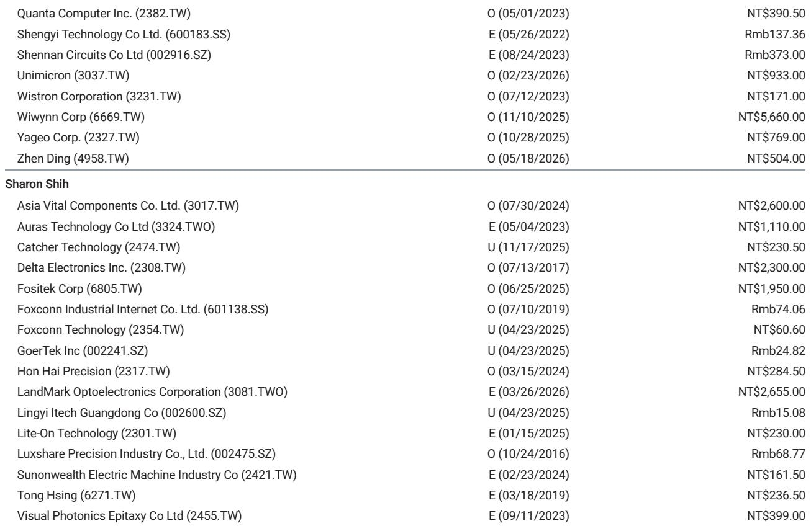
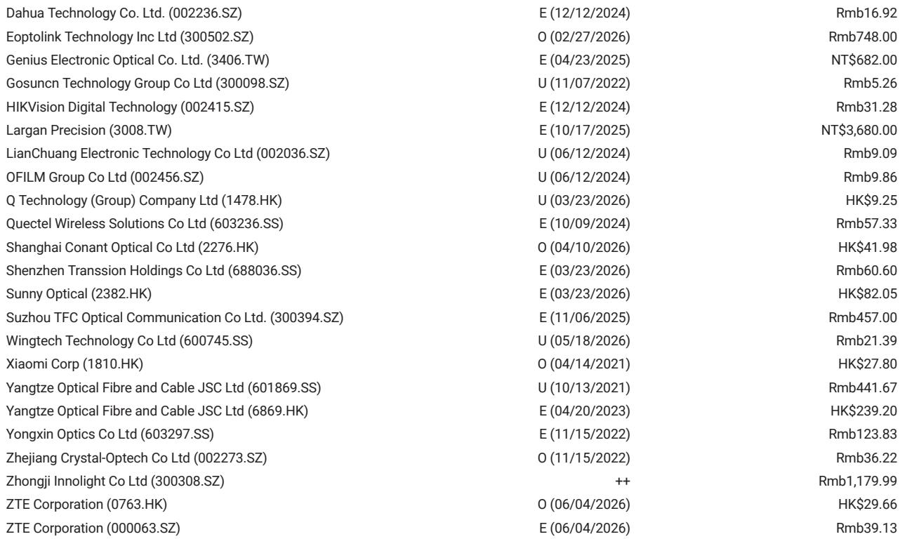

# The AI Infrastructure Build-Out Is Entering a New Phase: From GPU-Led Scaling to System-Level Integration

The dominant narrative in AI infrastructure over the past two years has been about GPU supply—who gets how many H100s, B200s, or Blackwells, and when. Computex 2026 marks a clear inflection point. The conversation has shifted from individual chips to fully integrated rack systems, from air cooling to liquid-cooled megawatt-scale power architectures, and from compute-centric thinking to balanced POD designs where networking, storage, and power interconnects carry equal strategic weight. For investors who have been tracking the AI supply chain through a single-lens GPU story, the message from Computex is unambiguous: the next leg of value creation will be distributed across a much broader set of components and system integrators.

The Vera Rubin POD, displayed in full at the show, is the physical embodiment of this shift. Every eight Vera Rubin NVL72 racks now require one standalone Vera CPU rack, one STX storage rack, and five Groq 3 LPX racks. That 8:1:1:5 ratio is not a technical footnote. It is a roadmap for where capital expenditure and content-per-rack will flow over the next 18 to 24 months. The GPU remains the most expensive single component, but the surrounding ecosystem of CPUs, storage processors, networking switches, power racks, cooling systems, and interconnect hardware is growing faster in percentage terms.

The timing matters. With mass production of the Vera CPU rack scheduled for the fourth quarter of 2026 and Groq 3 LPX racks entering production in the third quarter, the supply chain is moving from prototype validation to volume ramp. This is precisely the moment when component suppliers with design wins begin to see revenue acceleration, and when the competitive landscape for second- and third-tier suppliers becomes clearer. The next six months will separate the companies that have real production-ready qualifications from those that are still in the sample stage.

## The Vera Rubin POD Configuration Reveals a Structural Shift in How AI Clusters Are Balanced

The most analytically useful exhibit at Computex was not any single component but the system architecture of the Vera Rubin POD itself. The fact that NVIDIA is specifying a fixed ratio of CPU racks, storage racks, and inference racks per GPU compute rack tells us something fundamental about the bottlenecks that hyperscalers are now encountering. Early AI clusters were built with a compute-heavy bias. As models grow larger and inference workloads multiply, the limiting factor is no longer just FLOPs. It is data movement, memory bandwidth, and power delivery.

The Vera CPU rack, with 128 to 256 Vera CPUs per rack depending on cooling configuration, addresses the growing need for CPU capacity to handle data preprocessing, orchestration, and control-plane tasks that GPUs are inefficient at. Each Vera CPU supports up to 1.5 terabytes of LPDDR5X memory, which signals that memory-bound workloads are becoming a first-order design constraint. The STX storage rack, built around the BlueField-4 storage processor, addresses the storage networking bottleneck that emerges when GPU clusters try to access training data at petabyte scale. And the Groq 3 LPX racks, each containing 16 LPX accelerators per tray, are purpose-built for inference at scale.

For investors, the implication is that the total addressable market for AI infrastructure is expanding beyond the GPU socket. Companies that provide CPU boards, storage controllers, high-bandwidth memory, and rack-level power solutions are now participating in a growth trajectory that is linked to AI cluster build-out, not just GPU shipments. The question is which of these sub-markets have the highest barriers to entry and the most concentrated supplier bases.

## Power and Cooling Have Become the Binding Constraints, and the Upgrade Cycle Is Accelerating Faster Than Expected

The 800-volt DC power roadmap presented at Computex is the clearest signal yet that power infrastructure is becoming a critical path item for AI cluster deployment. NVIDIA's staged plan—power rack readiness in the third quarter of 2026, 1.6-megawatt power centers by the second quarter of 2027, and 4.8-megawatt power blocks by the first quarter of 2028—implies that hyperscalers are already planning for clusters that draw more power than many industrial facilities.

This is not a gradual evolution. The jump from current 48-volt or 277-volt architectures to 800-volt DC is a step-function change in power delivery efficiency and density. It requires new rectifiers, new busbars, new connectors, and new safety certification standards. The fact that multiple vendors, including Delta, Lite-On, Vertiv, and Schneider, are already showcasing 800-volt standalone power racks suggests that the ecosystem is moving faster than many expected. Delta's demonstration of a 3-megawatt in-row coolant distribution unit, with a 6.8-megawatt version planned by year-end, underscores the scale of thermal management required.

The competitive dynamics in power and cooling are particularly interesting because the qualification cycles are long, the reliability requirements are extreme, and the incumbent suppliers have deep relationships with hyperscalers. New entrants face high barriers, but the rapid pace of technology change—from liquid-to-air to liquid-to-liquid cooling, from traditional CDUs to in-row configurations, from standard QDs to custom designs—creates windows of opportunity for suppliers that can solve specific yield or reliability challenges. FIT's role as the primary design partner for the new Voronoi connector and the next-generation QD for Rubin Ultra racks is a case study in how interconnect and power components are becoming strategic, not just commoditized.

## Networking and Interconnect Content Per Rack Is Rising, and the Supply Chain Is Consolidating Around a Few Key Players

The networking and interconnect story at Computex was less about speeds and feeds and more about system-level integration. The BlueField-4 STX storage rack, the Spectrum-X CPO switch, and the growing role of external laser small form-factor pluggables (ELSFPs) all point to a trend where the network is no longer a separate layer but an embedded part of the compute POD.

The economics are compelling. FIT's ELSFP modules, with ASPs of $400 to $500 for the 20dBm version, represent a significant content opportunity per rack. The Paladin HD2 connectors for VR200 NVL72 midplanes, with ASPs of $70 to $90 per set, are another example of a component that was previously low-value becoming high-value as density increases. The Voronoi connector, still in design optimization, could represent an even larger step up in value per rack if it becomes the standard for future generations.

The key analytical question is whether this rising content per rack translates into sustainable margin expansion. The answer depends on the balance between customization and standardization. NVIDIA's influence over the supply chain is enormous, and the company has a track record of driving standardization that benefits volume producers but compresses margins for single-source suppliers. However, the complexity of the new interconnect designs—particularly the pogo pin challenges with Voronoi and the laser cost structure of ELSFPs—suggests that the suppliers with the deepest engineering capabilities and the strongest relationships with NVIDIA's design teams will maintain pricing power through the initial production cycles.

## The Agentic PC Thesis Is Real but Premature, and the Desktop Form Factor May Be the Surprise Winner

The RTX Spark announcement generated significant attention at Computex, and for good reason. An Arm-based SoC combining a Grace CPU, a Blackwell GPU, AI acceleration, and unified memory represents a genuine architectural innovation for the PC market. Jensen Huang's vision of PCs that operate as autonomous agents, running 24/7 and completing tasks on behalf of users, is compelling in theory.

In practice, the near-term demand picture is underwhelming. The highest-end RTX Spark notebooks will likely exceed $3,000, placing them in a niche that overlaps with professional workstations and premium gaming laptops. The initial volume expectations are modest: approximately one million units for the N1X chip in the first twelve months, with total combined shipments of five to ten million units across both variants. For context, the global PC market ships roughly 250 million units per year. RTX Spark will not move that needle anytime soon.

The more interesting angle is the desktop form factor. A desktop PC that can run AI workloads continuously, with the power budget and thermal headroom that a laptop cannot match, aligns more closely with the agentic vision. If the desktop RTX Spark devices ship at lower price points and find adoption among developers, small businesses, and AI hobbyists, the volume trajectory could be more attractive than the notebook numbers suggest. But the report's observation that many AI power users have already bought Mac Minis this year is a sobering reminder that NVIDIA is entering a market where Apple has already established a beachhead with unified memory architectures.

## What the Report Does Not Fully Answer: The Kyber Risk and the Rubin Ultra Timeline

The report is notably cautious on one specific topic: Kyber readiness for Rubin Ultra. The phrase "we don't think Kyber will be ready for mass deployment in Rubin Ultra" is a significant statement that deserves more analytical weight than it receives in the text. Kyber is the next-generation rack architecture that is supposed to support the highest-density configurations. If it is not ready, then the Rubin Ultra ramp may be constrained not by GPU supply but by the rack infrastructure itself.

The report does not specify what the bottleneck is. Is it the Voronoi connector yield? The 800-volt power rack qualification? The cooling system reliability at higher TDPs? The answer matters because it determines which suppliers are at risk and which have upside if the delay is resolved. Investors who are long on the broader AI infrastructure theme need to understand whether the Kyber delay is a six-month hiccup or a structural issue that shifts the timeline for the next generation.

Similarly, the report leaves open the question of how the competitive landscape in QDs and connectors will evolve if NVIDIA introduces a new QD design for Rubin Ultra. FIT is the primary designer, but the report does not address whether other suppliers are developing alternatives or whether the certification process will create a multi-sourcing requirement. These are the kinds of second-order questions that separate surface-level analysis from deep due diligence.

## A Decision Framework for Investors Navigating the Post-Computex Landscape

For readers who are trying to translate the Computex takeaways into investment decisions, the following framework may be useful. The first dimension is timing. Components that are already in production or entering production in the third and fourth quarters of 2026—Vera CPU racks, Groq 3 LPX racks, 800-volt power racks—offer the most near-term revenue visibility. Components that are still in design optimization, such as the Voronoi connector and the next-generation QD, offer higher potential upside but also higher execution risk.

The second dimension is competitive concentration. Markets with two or three qualified suppliers, such as the 2-inch FFQD market where Danfoss and FIT are the primary players, tend to have more stable pricing and margins. Markets with a larger number of potential suppliers, such as midplane PCBs, are more likely to experience margin compression as volume ramps.

The third dimension is technology inflection. The shift from 48-volt to 800-volt power, from air cooling to liquid cooling, and from standard connectors to custom high-density interconnects all represent technology inflections that favor suppliers with R&D depth and design-win track records. Companies that are merely following the technology curve will struggle to maintain relevance.

The fourth dimension is NVIDIA dependency. Suppliers that are sole-source or primary design partners for specific components within the Vera Rubin ecosystem have high exposure to NVIDIA's roadmap. That is a double-edged sword. When the roadmap accelerates, these suppliers outperform. When there is a delay or a design change, they underperform. Diversification across customers and end-markets is a risk mitigant that is often undervalued.

## The Unresolved Questions That Make the Full Report Worth Reading

The Computex 2026 takeaways are rich in detail, but they also raise questions that the report format cannot fully address. How will the 800-volt power rack certification process affect the timeline for Rubin Ultra deployment? What is the yield trajectory for the Voronoi connector, and what happens if it does not reach acceptable levels by year-end? Will the RTX Spark desktop form factor find a product-market fit that the notebook version cannot? How will the competitive dynamics in ELSFPs evolve as more suppliers enter the market?

These are the questions that separate a surface-level read from a deep analytical engagement. The full report contains the original charts, the detailed BOM analysis, and the supplier-level breakdowns that allow readers to form their own judgments on these issues. The exhibits at Computex told a compelling story, but the numbers behind the story are what matter for investment decisions.

Join the community to read the full report and review the original charts.

*This article is for learning and discussion only and does not constitute investment advice.*

Personal reading notes and learning share only. Not investment advice.

