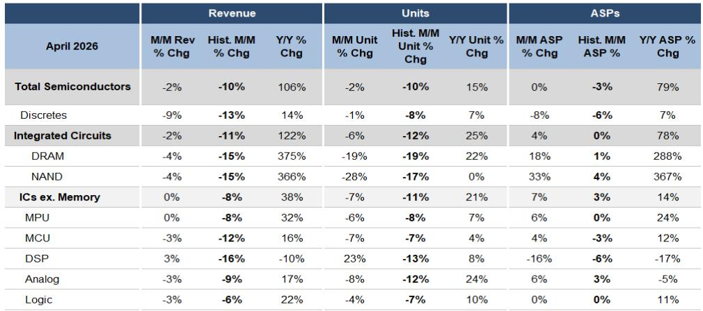
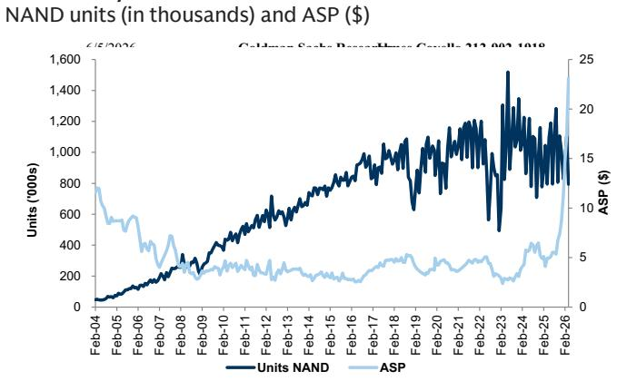
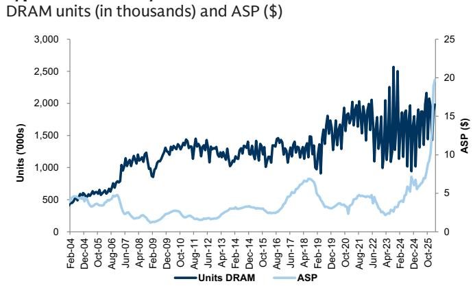

# 半导体行业最危险的误判：把库存正常化当成了需求复苏

四月半导体出货数据出炉，信号比大多数市场参与者预期的更加微妙。某外资投行最新研报基于SIA数据指出，当月集成电路（剔除存储）出货量环比下降7%，看似平淡，但对比历史同期中位数下降10%至12%的水平，实际表现高于季节性趋势。这不是一个简单的“需求回来了”的故事，而是一个行业正在从剧烈去库存阶段重新校准到真实需求轨道的结构性转折。

真正重要的不是出货量在恢复，而是恢复的方式正在重塑竞争格局。报告揭示了一个关键事实：模拟芯片出货量已经回到长期趋势线附近，而MCU仍然深陷低于趋势27%的泥潭。这种分化不是偶然的，它指向一个更深层的判断——本轮周期中，谁先完成库存消化、谁就能在下一轮定价权争夺中占据主动。

市场当前定价的，更多是终端需求的边际改善。但报告真正值得关注的洞察在于供给侧的再平衡正在加速，而不同细分领域的恢复节奏差异，将直接决定哪些公司能在未来12个月跑出超额收益。

## 1. 出货量高于季节性不是复苏信号，而是库存周期进入新阶段的确认

四月IC出货量剔除存储后环比下降7%，低于历史同期中位数的10%至12%。乍看之下，这似乎是需求改善的证据。但更严谨的解读是：出货量正在从过去几个季度“远低于终端需求”的状态，向“接近终端需求”的方向移动。报告明确指出，三个月移动平均的出货量目前仅低于长期趋势1%，而三月份这个缺口是4%。

这意味着什么？过去两年困扰行业的超额库存消化，已经基本完成。出货量现在反映的是真实终端消耗，而不是渠道里堆积的冗余。从这个角度看，高于季节性的环比下降幅度，不是需求爆发，而是库存周期从“去库存”切换到了“正常化”。

但这里有一个容易被忽视的细节：正常化并不意味着所有公司都站在同一起跑线上。那些在去库存周期中管理供应链更激进、更早削减产能的公司，现在面临的是产能利用率回升带来的边际利润弹性。而那些被动等待需求回暖的公司，可能发现自己虽然库存清了，但市场份额已经被侵蚀。

## 2. 模拟芯片率先回到趋势线，这是整个行业定价权转移的风向标

报告中最值得关注的细分数据来自模拟芯片。四月模拟芯片出货量环比下降8%，但高于历史中位数的12%；更重要的是，三个月移动平均出货量已经回到长期趋势线附近，仅低于趋势0.3%，而三月份这个数字是低于趋势2.0%。

模拟芯片往往是整个半导体周期最敏感的领先指标。原因很简单：模拟芯片的应用场景极其分散，覆盖工业、汽车、消费电子等几乎所有终端市场，它的出货量变化反映的是经济活动的广泛强度，而不是单一品类的爆发。当模拟芯片出货量回到趋势线，意味着下游客户已经不再恐慌性砍单，也不再囤积库存，而是开始按真实消耗节奏下单。

这对投资框架的含义是明确的：那些在模拟芯片领域具有规模优势和渠道管理能力的公司，将率先受益于定价权的回归。报告明确表达了对某几家模拟芯片公司的偏好，核心逻辑正是“出货量距离趋势最远”和“供应链管理差异化”——这本质上是在押注那些在周期底部仍然保持产能纪律和客户关系的企业。

## 3. MCU的27%缺口是结构性问题，不是周期性问题

与模拟芯片形成鲜明对比的是MCU。四月MCU出货量环比下降7%，虽然与历史中位数持平，但三个月移动平均仍然低于长期趋势27%，比三月份的25.5%缺口还在扩大。

这不是一个简单的“MCU需求弱”的故事。MCU的困境更多来自供给端：过去两年产能扩张过度，叠加下游汽车和工业客户的库存调整节奏慢于消费电子，导致MCU的库存消化周期被拉长。更重要的是，MCU市场本身正在经历技术迭代——从传统8位、16位向32位迁移，以及RISC-V架构的渗透，都在改变竞争格局。

报告没有完全展开的一点是：MCU的27%缺口是否包含了结构性替代的风险？如果下游客户在去库存过程中同时完成了向更高性能或更低成本方案的迁移，那么即使终端需求恢复，传统MCU厂商也未必能收回失去的市场份额。这是一个需要持续跟踪的关键变量。

## 4. 存储的ASP暴涨掩盖了需求端的真实图景

存储芯片的数据呈现出一种有趣的矛盾。四月DRAM和NAND的营收分别环比下降4%，高于历史中位数的15%——看起来不错。但拆开来看，DRAM出货量环比下降19%，与历史中位数持平；NAND出货量环比下降28%，甚至低于历史中位数的17%。

营收增长的驱动力来自ASP。DRAM的ASP环比上涨18%，NAND的ASP环比上涨33%，均大幅高于历史中位数。这意味着存储芯片的“复苏”本质上是由供给侧定价行为驱动的，而不是由终端需求大幅扩张驱动的。

这引出了一个关键疑问：ASP的上涨可持续吗？如果出货量持续低于季节性，而ASP的上涨主要来自供应商的产能纪律（比如HBM产能挤占、NAND厂商减产），那么一旦终端需求出现任何波动，ASP的脆弱性就会暴露。报告没有给出明确答案，但数据本身已经暗示：当前存储板块的定价可能已经包含了过多乐观预期。

## 5. 报告尚未回答的关键问题：正常化之后的增长引擎在哪里

出货量回到趋势线，只是回答了“库存调整结束了”这个问题。但下一个问题才是真正重要的：趋势线本身会不会上移？也就是说，终端需求有没有新的增长动力？

报告对此着墨不多。它更关注的是“出货量正在接近终端需求”这个事实，而不是“终端需求正在加速增长”。这本身就是一种审慎的态度。但作为读者，我们需要意识到：如果出货量只是回到趋势线，而没有突破趋势线，那么行业整体的增长空间是有限的。真正的超额收益来自那些能够在正常化之后，通过产品组合升级或市场份额扩张实现高于行业增速的公司。

报告提到的某几家模拟芯片和MCU公司，其共同特征是“出货量距离趋势最远”——这意味着它们有更大的回归空间。但回归结束后呢？这个问题需要更深入的产业链调研和公司层面分析才能回答。

## 6. 一个实用的观察框架：从出货量缺口到利润弹性的传导链条

基于报告的数据和逻辑，我们可以建立一个三层的观察框架，用来筛选未来12个月可能跑赢的半导体公司。

第一层：出货量缺口。优先关注那些三个月移动平均出货量仍显著低于长期趋势的公司。缺口越大，意味着去库存越彻底，未来回归趋势的弹性越大。

第二层：产能利用率与固定成本杠杆。出货量恢复只是第一步，更重要的是产能利用率回升带来的毛利率弹性。那些在周期底部没有过度削减产能、同时保持了较高固定成本占比的公司，在出货量回升时将享有更大的利润弹性。

第三层：产品组合与定价权。出货量恢复后，公司能否通过产品升级或客户粘性实现ASP提升？这决定了利润弹性的天花板。模拟芯片厂商在这方面通常优于MCU厂商，因为模拟产品的客户转换成本更高、产品生命周期更长。

这三个层次叠加，才能构成一个完整的投资判断框架。报告在第一个层次上提供了清晰的数据，在第二个和第三个层次上给出了方向性的判断，但具体到每家公司的细节，仍然需要更深入的独立研究。

---

四月的数据告诉我们，半导体行业正在走出最痛苦的库存消化阶段，但这不是一个可以简单买入并持有的时刻。细分领域的恢复节奏差异、定价权的转移、以及结构性替代的风险，都在要求投资者做出更精细的判断。

出货量回到趋势线只是起点，不是终点。真正的机会在于那些能够利用这一轮周期完成份额扩张或产品升级的公司，而这需要超越SIA数据的更深层研究。

如果你对报告中提到的模拟芯片和MCU公司的具体估值位置、产能利用率数据、以及下一阶段的关键跟踪指标感兴趣，欢迎来星球微信群里继续讨论。我们会在社群中分享更完整的原始图表和产业链交叉验证笔记，也会针对报告尚未完全回答的“正常化之后增长引擎在哪”这个问题，组织专题讨论。

Personal reading notes and learning share only. Not investment advice.

