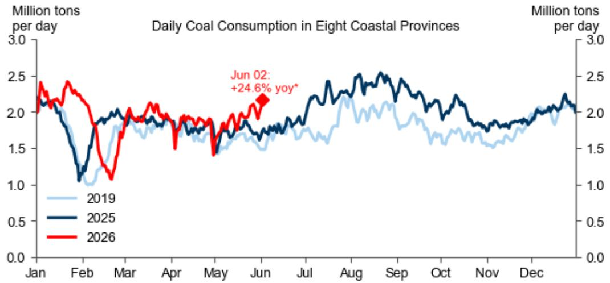

# China Is Not Tightening Capital Controls — It Is Building a Strategic Framework for Cross-Border Technology Management

The State Council's 34-item decree on cross-border investment, released on June 1, is not a signal of capital flight anxiety or a broad clampdown on outbound flows. It is a deliberate, forward-looking regulatory architecture designed to manage the most strategically sensitive dimension of China's global economic integration: technology transfer. The timing, coming shortly after the government blocked the Meta-Manus deal, makes this intention unmistakable. Policymakers are not worried about the quantity of capital leaving China; they are worried about the quality of technology leaving China. This distinction carries profound implications for how global investors should interpret the regulatory landscape, the trajectory of the renminbi, and the real constraints on Chinese corporate expansion abroad.

The decree's 34 items are overwhelmingly focused on establishing frameworks for cross-border technology transfers, supporting Chinese companies as they go global, and managing the operational and geopolitical risks that accompany Chinese assets and operations overseas. Individual cross-border investment receives only a brief mention, and even then, the decree delegates specific measures to investment and commerce authorities. This is not the language of a government rushing to plug capital outflows. It is the language of a government building a governance system for a new phase of globalization — one where Chinese companies are no longer just exporters of goods but owners of foreign assets, operators of overseas facilities, and participants in global technology supply chains.

For investors, the key question is not whether China is opening or closing. It is which types of cross-border activity will face new scrutiny, which will receive active support, and how the balance between these two forces will reshape the competitive landscape.

## The State Council's Decree Targets Technology Sovereignty, Not Capital Flight

The most telling aspect of the June 1 decree is what it does not do. It does not impose new taxes on overseas remittances. It does not tighten quotas for individual foreign exchange purchases. It does not signal alarm about the pace of capital outflows. These omissions are deliberate and consistent with the broader macroeconomic picture. Exporter conversion ratios have risen, meaning companies are bringing more foreign currency back into China rather than hoarding it offshore. The renminbi has appreciated meaningfully this year, and the People's Bank of China's daily fixing suggests an intention to slow, not reverse, that appreciation. If the government were truly worried about capital flight, these conditions would not exist.

Instead, the decree's emphasis on technology transfer regulation reflects a strategic calculus. As the US-China technology race intensifies, Chinese companies are acquiring foreign assets in sectors ranging from semiconductors to artificial intelligence to advanced manufacturing. Each acquisition carries potential national security implications, both for China and for the host country. The government wants to ensure that these outbound investments serve China's long-term technological self-sufficiency goals, not just short-term corporate expansion. This means establishing clear rules about which technologies can be transferred, to whom, and under what conditions.

The Meta-Manus deal was the catalyst, but the decree is not a one-off response. It is the beginning of a permanent regulatory infrastructure. Investors should expect more detailed sector-specific guidelines to emerge over the next 12 to 18 months, particularly in areas involving dual-use technologies, data localization, and critical infrastructure. The strategic implication is clear: Chinese companies with strong domestic technology moats will find it easier to obtain approval for overseas acquisitions, while those whose competitive advantage depends on licensed or imported foreign technology may face greater scrutiny.

## High-Frequency Data Reveals an Economy Adapting to Energy Shocks With Greater Flexibility Than Expected

The latest high-frequency data presents a paradox that deserves careful interpretation. On one hand, energy prices are clearly affecting the Chinese economy. Passenger flight numbers are down, flight cancellations are up, and coal consumption in coastal provinces has risen significantly above year-ago levels. The coal consumption chart from the report is particularly striking: through the spring and early summer of 2026, daily coal consumption has been running well above the 2019 baseline and also above the 2025 trajectory. In June 2026, coastal coal consumption reached approximately 2.1 million tons per day, compared to roughly 1.5 million tons per day in June 2019 and 1.8 million tons per day in June 2025.

On the other hand, the net economic impact appears contained. The daily traffic congestion index remains stable. Weekly steel production and demand are not collapsing. These indicators suggest that the Chinese economy has developed a greater capacity to absorb higher energy costs than it had in previous cycles. This is not a trivial finding. It implies that the structural adjustments China has made over the past five years — including energy efficiency improvements, industrial upgrading, and the shift toward services — are providing real insulation against supply-side shocks.

The "so what" for investors is twofold. First, the resilience of the real economy means that the PBOC has more room to maintain its current policy stance without being forced into aggressive easing or tightening. Second, the divergence between energy-intensive sectors and the broader economy will likely widen. Companies in energy-intensive industries will face margin pressure, but the aggregate economic impact may be manageable. This creates a more nuanced investment landscape than a simple "energy shock = economic slowdown" narrative would suggest.

## Trade Data Will Show AI Capex Booms Are Now a Structural Driver of Chinese Imports

The May trade data preview points to an important structural shift that goes beyond the monthly numbers. Exports are expected to grow 15% year-on-year in USD terms, and imports are expected to grow 30%. The import figure is particularly striking. It reflects the ongoing global AI capex boom, which is driving Chinese imports of semiconductors, advanced manufacturing equipment, and specialized materials. This is not a one-time event. It is a structural change in the composition of Chinese trade.

The AI capex boom is creating a self-reinforcing cycle. Chinese manufacturers are importing capital goods to build the infrastructure for AI production. These capital goods are then used to produce AI-related exports. The result is that both sides of China's trade ledger are growing simultaneously, with imports growing faster than exports. This is a fundamentally different dynamic from the pre-pandemic period, when China's trade surplus was driven primarily by export strength and import weakness.

The implication for the renminbi is significant. A narrowing trade surplus, combined with strong import demand, reduces the structural pressure for renminbi appreciation. This helps explain why the PBOC has been comfortable allowing gradual appreciation while also signaling a desire to slow the pace. The currency is being supported by capital account factors — including the government's efforts to internationalize the renminbi and encourage foreign portfolio inflows — rather than by an overwhelming trade surplus. Investors who focus only on the trade balance to forecast the renminbi are missing the bigger picture.

## The Report Raises an Unanswered Question About the Interaction Between Regulatory Tightening and Credit Cycles

One of the most intriguing aspects of the report is what it leaves partially unanswered. The data preview notes that ample interbank liquidity, despite the PBOC's net liquidity withdrawals, points to continued weakness in bank loan demand. Bank loan growth and total social financing net growth are expected to come in below the levels recorded in the same month last year. This is consistent with the broader theme of structural credit tightening that has characterized China's post-pandemic recovery.

But the report does not fully explore how the new cross-border investment regulations might interact with this credit cycle. If Chinese companies face new restrictions on overseas technology acquisitions, will they redirect capital toward domestic investment? Or will the regulatory uncertainty cause them to delay all major investment decisions? The answer has important implications for credit demand. If companies shift from overseas M&A to domestic capital expenditure, bank loan demand could stabilize or even increase. If they adopt a wait-and-see approach, credit weakness could persist.

This is a meaningful open question. The decree's emphasis on supporting Chinese companies going global suggests that the government wants overseas expansion to continue, but in a more controlled manner. Whether this regulatory clarity encourages or discourages investment will depend on how quickly the specific implementing rules are issued and how predictable they prove to be. Investors should watch for the pace of follow-up regulations as a leading indicator of corporate investment sentiment.

## A Decision Framework for Investors Navigating China's Evolving Cross-Border Regime

For investors trying to position themselves in light of these developments, a structured decision framework is essential. The framework should address three layers of analysis: regulatory direction, economic resilience, and sectoral exposure.

First, on regulatory direction: investors should distinguish between sectors where the government is actively encouraging cross-border activity and sectors where it is tightening controls. Technology sectors with strong domestic innovation capabilities — such as AI, renewable energy, and advanced manufacturing — are likely to receive regulatory support for overseas expansion. Sectors where China is still a technology importer — such as certain semiconductor subsegments or advanced medical devices — may face greater scrutiny. The key variable is whether the overseas acquisition would strengthen China's technology autonomy or increase its dependence on foreign suppliers.

Second, on economic resilience: the high-frequency data suggests that the Chinese economy can absorb higher energy costs without a significant growth downturn. This means that investors should not automatically assume that rising commodity prices will translate into a PBOC easing cycle. The central bank's focus will remain on managing financial stability risks and supporting the renminbi internationalization agenda. Fixed income investors should be cautious about betting on aggressive monetary easing, while equity investors should focus on sectors that benefit from energy transition and industrial upgrading rather than those that depend on low energy costs.

Third, on sectoral exposure: the AI capex boom is creating a structural import demand that will persist regardless of short-term trade policy fluctuations. Investors should look for companies in the semiconductor equipment, automation, and specialty materials sectors that are positioned to benefit from this trend. At the same time, the narrowing trade surplus means that export-oriented sectors may face headwinds from currency appreciation and rising input costs. The winners will be companies with pricing power and technological differentiation, not those competing solely on cost.

The most sophisticated investors will also monitor the interaction between these three layers. A company that benefits from AI capex-driven import demand, has strong domestic technology moats that facilitate overseas expansion, and operates in a sector with low energy intensity would be well-positioned across all three dimensions. A company that relies on imported technology, faces energy cost pressure, and depends on export volume growth would face headwinds on all fronts.

## The Full Report Contains the Data and Charts That Make These Arguments Actionable

The analysis presented here draws on the rich data and detailed sectoral breakdowns contained in the original report. The coal consumption chart, the trade and inflation projections, and the credit data preview provide the empirical foundation for the strategic interpretation offered above. But the report goes deeper, with proprietary indicators, team presentation materials, and webinar replays that offer additional context and granularity.

Investors who want to move beyond the strategic framework to specific investment decisions will need access to the full data set and the original charts. The high-frequency indicators, the sectoral breakdowns of trade data, and the detailed analysis of the PBOC's liquidity operations are all essential for building conviction around the themes discussed here.

Join the community to read the full report and review the original charts.

*This article is for learning and discussion only and does not constitute investment advice.*

Personal reading notes and learning share only. Not investment advice.

