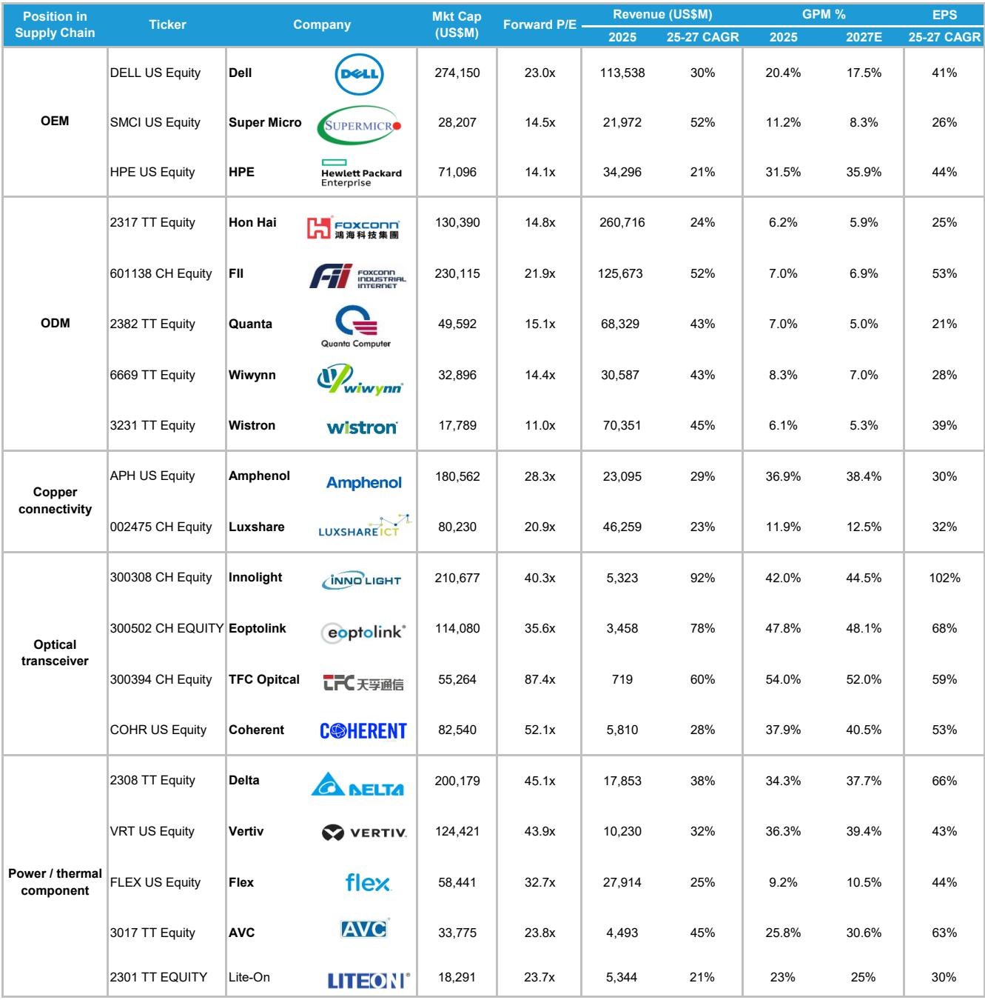
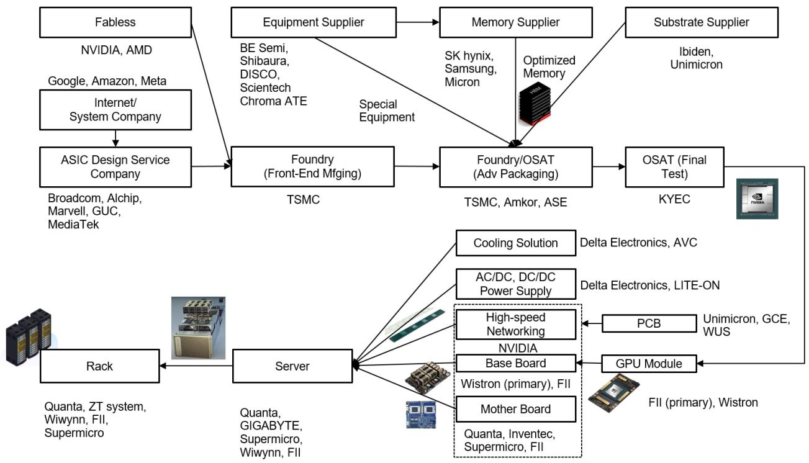
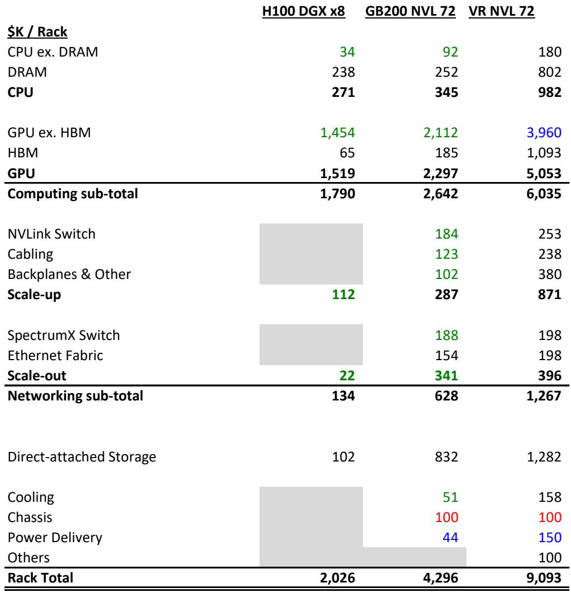

# AI数据中心每GW的真实成本是47亿美元，市场对内存涨价的定价远未充分

当市场还在用8万美元的机柜成本框架讨论Vera Rubin时，一份来自某外资投行的深度拆解给出了完全不同的答案：9.1万美元。这1.1万美元的差距，不是估值误差，而是理解整个AI基础设施投资逻辑的分水岭。

这份报告的核心洞察并不复杂，但影响深远：AI数据中心的资本密集度正在加速上升，而推动这一趋势的关键变量——内存——恰恰是市场最容易忽略的变量。当HBM4价格在2027年可能从16.6美元/GB跳升至53美元/GB时，整个机柜的成本结构将被重塑。这不是周期性的波动，而是结构性重置。

更值得关注的是，这份报告揭示了一个反直觉的结论：即便内存成本大幅上升，GPU仍然是机柜成本中最大的单项。这意味着，市场对英伟达的定价能力可能仍然低估——它不仅能将内存涨价转嫁给客户，还能在GPU端持续获取溢价。

对于任何关注AI产业链的决策者来说，理解这个47亿美元/GW的数字意味着什么，远比追逐下一轮算力芯片的规格参数更为紧迫。

## 1. 内存成本正在成为AI数据中心最大的隐藏变量，而市场仍在使用过时的价格假设

报告中最具冲击力的发现，是Vera Rubin NVL72机柜9.1万美元的成本估算，显著高于媒体广泛报道的8万美元。这1.1万美元的差异，几乎全部来自内存定价的假设差异。

如果使用HBM4的历史价格16.6美元/GB，确实可以得出约8万美元的机柜成本。但报告的核心判断是：到2027年Vera Rubin批量出货时，HBM4的价格将达到53美元/GB。这不仅仅是供应商涨价的问题——英伟达几乎确定会通过动态定价机制将这部分成本完全转嫁给最终客户。

这意味着，仅HBM一项，每个机柜的成本贡献就从34.4万美元跃升至110万美元。加上CPU DRAM和直接附加存储，整个内存/存储子系统在机柜成本中的占比将达到35%，约320万美元。

这背后的逻辑值得深思。内存价格的波动性正在从周期性变为结构性。NAND价格从2023年4月的谷底到2026年5月，累计上涨了11.3倍，年复合增长率高达115%。这与2019年1月至2023年4月期间-20%的年复合增长率形成了鲜明对比。当存储成本在AI基础设施中的占比持续上升时，任何基于历史价格假设的投资模型都可能产生系统性偏差。

## 2. GPU仍然是成本之王，但英伟达的定价权正在从芯片延伸到整个生态

尽管内存成本激增，GPU（不含HBM）仍然是机柜中最大的成本单项，约400万美元，占机柜总成本的44%。以每颗GPU 5.5万美元的价格计算，72颗GPU的配置意味着接近一半的机柜成本来自计算芯片。

但真正的洞察不在于GPU本身的价格，而在于英伟达如何通过系统架构设计来放大其定价权。Vera Rubin NVL72机柜的FP8算力达到2520 PLOPS，是Blackwell的720 PLOPS的3.5倍。这意味着，即便机柜成本从Blackwell时代上升，每美元的计算性能仍在加速提升。

这种性能提升对英伟达而言是双刃剑：一方面，它强化了客户对英伟达架构的依赖；另一方面，它也让英伟达有更大的空间在内存涨价的同时保持整体解决方案的性价比吸引力。报告明确指出，英伟达很可能通过动态定价机制将内存涨价转嫁给客户，而不是自己吸收成本压力。这意味着，英伟达的毛利率可能不会因为内存涨价而受到侵蚀。

## 3. 每GW 47亿美元的全口径资本支出，意味着电力需求增长可能持续落后于资本支出增速

将机柜成本扩展到数据中心整体，报告估算出一个令人瞩目的数字：每GW AI数据中心容量的全口径资本支出约为47亿美元。这个数字的构成是：机柜成本约32亿美元，物理基础设施成本约15亿美元。

这个数字的意义在于，它揭示了AI基础设施投资的真实规模。以Vera Rubin NVL72机柜220kW的额定功率计算，每GW可以支持约3557个机柜。但机柜仅消耗数据中心约78%的电力，因此每GW的实际电力容量对应的机柜数量要少一些。

更关键的是，报告预计每GW的成本将继续上升。这意味着，即便超大规模云服务商的资本支出持续增长，实际新增的电力容量增长速度可能落后于资本支出增速。对于电力基础设施投资者和电网规划者来说，这是一个需要密切关注的信号：AI带来的电力需求增长可能比市场预期的更为集中、更为密集。

## 4. 折旧成本才是真正的经济成本，电力成本远被高估

在讨论AI数据中心的运营成本时，电力成本往往是市场关注的焦点。但报告提供了一个反直觉的视角：真正的经济成本来自折旧。

以每GW数据中心为例，假设电力成本为0.15美元/kWh，年电力成本约为13亿美元。而年折旧成本高达72亿美元，是电力成本的5.5倍以上。人力成本几乎可以忽略不计。

这个结论对理解AI数据中心的商业模式至关重要。由于IT设备（服务器、网络设备）的折旧年限远短于机电设备和建筑，现金资本支出并不能完全反映真实的经济成本。在评估数据中心运营商的盈利能力时，折旧费用才是主导因素，而非电力成本。

这也解释了为什么像Digital Realty和Equinix这样的数据中心REITs能够获得较高的估值倍数——它们的资产折旧结构使得折旧后的现金流相对稳定，而电力成本波动对整体盈利能力的影响被高估了。

## 5. 报告尚未完全回答的关键问题：内存涨价的结构性驱动因素与NAND替代HDD的边界

尽管报告提供了详尽的成本拆解，但仍有几个关键问题需要进一步探讨。

第一个问题是内存涨价的结构性驱动因素。报告指出HBM4价格将从16.6美元/GB跳升至53美元/GB，但并未完全解释这一涨幅背后的供需逻辑。是产能限制？是技术复杂度提升？还是英伟达通过锁定产能协议推高了价格？这些因素对判断价格涨幅的可持续性至关重要。

第二个问题是NAND替代HDD的边界。报告提到数据中心运营商对用NAND替代HDD持谨慎态度，因为性能下降会增加内存负担，而HDD的物理尺寸和功耗问题也限制了其在机柜内的应用。但在外部存储阵列中，HDD仍占主导地位。随着NAND价格持续上涨，这个替代边界是否会发生变化？如果NAND相对于HDD的价格优势消失，数据中心是否会重新转向HDD？这个问题对存储产业链的投资判断有直接影响。

第三个问题是英伟达动态定价机制的具体运作方式。报告提到英伟达可能通过动态定价将内存涨价转嫁给客户，但并未详细说明这个机制如何运作。是季度调整？还是基于合同条款的自动传导？不同客户（超大规模云服务商 vs. 企业客户）是否会面临不同的传导力度？这些问题对判断英伟达的定价能力和客户关系至关重要。

## 6. 投资者的观察框架：从机柜成本到产业链定价权的重新评估

基于这份报告，投资者需要建立一个新的观察框架来重新评估AI产业链的投资逻辑。

第一，关注内存价格走势的频率和深度。报告明确指出，由于内存价格波动性显著高于历史水平，投资者需要频繁更新成本假设。这意味着，任何基于固定成本假设的估值模型都可能很快失效。建议将内存价格跟踪作为AI产业链投资的常规动作，而非偶发事件。

第二，重新评估英伟达的定价权。报告揭示的不仅是英伟达在GPU端的定价权，更是其在整个机柜层面的系统级定价能力。当英伟达能够将内存涨价转嫁给客户时，其毛利率的稳定性可能被市场低估。但这也意味着，如果内存价格出现超预期下跌，英伟达可能面临降价压力。

第三，关注受益于AI基础设施投资的其他环节。报告提到，除了英伟达之外，Unimicron（载板）、Delta（电源管理）、Chroma（测试设备）等公司也是AI基础设施投资的关键受益者。这些公司的估值逻辑与英伟达不同，但同样受益于数据中心资本支出的结构性增长。

第四，警惕高估数据中心运营商的盈利弹性。报告强调折旧成本才是主导因素，意味着数据中心运营商的利润对电力成本波动的敏感度可能低于市场预期，但对资本支出节奏和折旧政策的敏感度更高。

---

这份报告的真正价值，不在于给出了一个精确的成本数字，而在于揭示了一个正在发生的结构性变化：AI数据中心的成本结构正在从以GPU为中心，转向GPU与内存并重的双引擎模式。内存不再是配角，而是与GPU共同决定整个系统的经济性。

对于决策者而言，这意味着需要重新审视AI基础设施投资的回报预期。如果每GW的成本持续上升，而计算性能的提升速度能否持续超越成本增速，将是决定整个AI产业链投资回报率的关键变量。

欢迎来星球微信群里继续讨论：内存涨价的可持续性如何判断？英伟达的定价权能否在Vera Rubin时代继续维持？数据中心运营商的折旧压力是否会传导到租金定价？这些问题的答案，可能比47亿美元/GW这个数字本身更有价值。

Personal reading notes and learning share only. Not investment advice.

