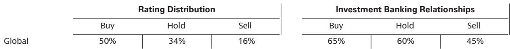

# SNEC 2026的真正信号：分布式储能正在取代组件成为光伏展的主角

光伏行业最大的年度展会SNEC刚刚在上海落幕。如果你只看展馆面积的变化，可能会得出一个平庸的结论：行业情绪分化。但真正值得关注的信号，不是谁扩大了展位、谁缩小了展位，而是——分布式储能（DESS）正在从光伏产业链的配角，变成独立于组件周期的增长主线。

某外资投行在展会期间与8家上市公司管理层进行了交流，并与近20位产业链专家进行了深入访谈。其核心发现是：DESS企业的订单指引显示，2026年第二季度环比增长60%-70%之后，下半年将继续环比提升。而与之形成鲜明对比的是，组件企业的展位面积普遍缩减，部分二三线企业甚至直接缺席。

这不是一个简单的“储能比光伏好”的判断。这是一个关于行业结构重心迁移的判断。光伏行业过去二十年一直以“组件”为轴心运转，所有的定价权、技术路线、投资逻辑都围绕组件展开。但SNEC 2026传递出的信号是：分布式储能正在获得独立的增长逻辑和定价能力，而组件环节正在陷入更深的价格内卷。

以下是我们从这份报告中提炼出的五个核心洞察。

## 1. DESS的增长不再是单一市场驱动，这意味着需求韧性可能超出预期

过去几年，分布式储能的需求波动极大，核心原因在于市场高度集中——欧洲户储爆发时，所有企业蜂拥而入；补贴退坡后，订单断崖式下滑。这种“单点依赖”的脆弱性，是投资者长期对储能板块保持谨慎的根本原因。

但这次的情况不同。报告指出，2026年上半年的强劲增长是由东南亚、中东、东欧、澳大利亚和非洲等多个区域共同驱动的。DESS企业管理层认为，这次的需求复苏“更可持续”。

这个判断的底层逻辑是：多区域驱动意味着需求结构从“政策补贴驱动”转向“经济性驱动”。不同地区的电价结构、电网稳定性、用电模式各不相同，但分布式储能都能找到价值锚点——在东南亚是电网不稳定带来的备用电源需求，在中东是工商业峰谷价差套利，在非洲是离网场景的刚性用电需求。当需求来源足够分散，单一市场的政策波动对整体订单的冲击就会大幅降低。

对于投资者而言，这意味着DESS的估值逻辑需要从“周期成长股”向“结构性成长股”切换。如果多区域需求能够持续，DESS企业的收入可见性和盈利稳定性将显著优于组件企业。

## 2. 碳酸锂涨价不是DESS的威胁，成本结构优化才是真正的护城河

碳酸锂价格近期有所回升，市场普遍担心这会侵蚀储能企业的盈利。但报告揭示了一个反直觉的事实：DESS企业的利润率指引保持稳定。

原因在于，电池成本上涨正在被两个结构性因素消化。第一，电池密度提升。从180Ah升级到340Ah的电池型号，单位生产成本可以下降约20%。第二，产品设计优化。DESS企业有能力推出更具经济性的新产品结构，从而在不牺牲毛利率的情况下吸收上游成本波动。

这告诉我们一件事：DESS行业的竞争壁垒正在从“成本控制”转向“产品定义能力”。能够通过电池规格升级和系统设计优化来对冲原材料波动的企业，将获得持续的定价权和利润率优势。而那些仅仅依靠低价采购电池来组装系统的企业，将在成本波动中暴露真正的脆弱性。

## 3. 组件环节的核心矛盾不是需求，而是Tier 2企业的价格战死循环

报告对组件需求的判断并不悲观。2026年中国光伏装机预期从年初的200GW上调至220-240GW，这意味着下半年同比增长可能超过30%。海外需求在非洲、韩国、东南亚、印度、澳大利亚等地也保持强劲。

但问题出在供给端。尽管Tier 1企业一直在引导市场维持当前组件价格，但部分Tier 2企业已经开始重新采取激进定价策略以获取订单，确保经营性现金流入。在海外市场，价格竞争尤为激烈，多家企业表示其中东项目“基本盈亏平衡”。

这形成了一个典型的囚徒困境：Tier 1企业希望维持价格纪律，但Tier 2企业因为现金流压力而不断降价，导致整个行业的价格中枢下移。更值得警惕的是，上游多晶硅环节的定价压力更为严峻——库存出清需求叠加Tier 1企业从6月开始可能重启的新增供给，将进一步压缩利润空间。

对于组件环节的投资者来说，需求端的故事已经无法支撑估值。真正需要回答的问题是：价格战何时见底？以及，能够撑到价格战结束的企业，需要具备什么样的资产负债表和管理能力？

## 4. 报告尚未完全回答的关键问题：DESS的利润率能否在规模扩张中保持

这是整份报告中最值得追问的一个问题。

目前DESS企业满产运行，订单持续增长，利润率保持稳定。但历史经验告诉我们，当行业进入大规模扩产周期时，供给过剩和价格竞争几乎是不可避免的。DESS企业目前享受的“多区域需求分散”红利，是否会在供给大幅扩张后被稀释？电池密度提升带来的成本下降，是可持续的技术进步，还是一次性的产品升级红利？

报告对此着墨不多，但这恰恰是投资者需要自行判断的核心变量。如果DESS企业的利润率能够在未来2-3个季度持续保持稳定，那么当前的高估值就具备了基本面支撑。如果利润率在规模扩张中开始承压，那么市场对DESS的乐观定价就需要重新审视。

## 5. 一个更务实的观察框架：从“技术路线”转向“订单可见性”和“客户结构”

对于想要跟踪这份报告逻辑的读者，我们建议关注三个维度。

第一，订单可见性。DESS企业的在手订单覆盖周期是判断需求可持续性的最直接指标。如果订单能见度从当前的季度级别延长到半年或更长时间，意味着下游客户对分布式储能的采购正在从“试水”转向“常态化配置”。

第二，客户结构。多区域需求分散是好事，但不同区域的客户质量和付款条件差异巨大。中东和澳大利亚的工商业客户通常信用较好，而部分非洲和东南亚市场的项目回款周期可能更长。能够平衡区域扩张与现金流质量的企业，将具备更强的抗风险能力。

第三，产品迭代速度。电池密度从180Ah到340Ah带来的成本下降是一次性的，但更关键的是企业能否持续推出更高能量密度、更低单位成本的新产品。这决定了企业在未来2-3年内的利润率走向。

---

以上是我们从这份SNEC 2026报告中提炼出的核心判断和未解问题。分布式储能正在成为光伏产业链中最值得关注的独立增长主线，但组件环节的价格战何时见底、DESS利润率能否在规模扩张中保持，仍是需要持续跟踪的关键变量。

这些问题的答案，不在任何一份研报的结论里，而在产业链的每一个订单、每一次报价、每一场客户谈判中。欢迎来星球微信群里继续讨论，我们会持续追踪DESS企业的订单变化、成本结构和竞争格局的演进。

Personal reading notes and learning share only. Not investment advice.

