# The Long View

Q&A on AI, Energy and Climate

On May 26th, we hosted Thomas Spencer, co-author of the IEA's Key Questions on Energy & AI. In this Q&A, we address crucial aspects of the IEA's work:

- How Will Data Centres' (DC) Energy Demand Evolve? In the IEA's Base Case, DC double their share of global electricity from 1.5% to 3% by 2030 (485 → 950 TWh). The US absorbs 45% of incremental demand, followed by other advanced economies and China. The path to 2030 is capped on the upside by physical bottlenecks (memory, turbines) and supported by capex/adoption momentum. Cumulative DC capex of \$3.9trn through 2030 includes \$780bn of energy-related spend, with renewables (360 TWh) and gas (340 TWh) leading new generation. Beyond 2030, scenarios diverge materially.   
- How Much Compute Does AI Need? “Unprecedented” efficiency gains are outpaced by workload intensity. Per-query energy has fallen an order of magnitude, but the Jevons Paradox is in full force. Agentic Reasoning tasks consume \~50 Wh vs. \~0.3 Wh for simple text queries — pointing to the importance of new inference workloads in future demand.

\- Where Can AI Boost Energy Efficiency? Existing AI use cases in industry, energy, transport and buildings could deliver savings equal to 3% of global final energy consumption by 2035. We detail corporate examples across the four industries.

\- Will AI Boost Energy Innovation? AlphaFold's 2024 Nobel Prize suggests AI will foster breakthroughs, and most technologies needed for Net Zero have yet to be invented. Batteries, catalysts for synthetic fuels, $\mathrm{CO}_{2}$ capture materials, and cement are four key areas of AI-led innovation potential.

\- Will AI Have a Net Positive Energy and Climate Footprint? IEA and Stern project emission reductions exceeding DC energy demand, but neither accounts for rebound effects. NGOs warn of greenwashing; a recent study on AI-contrails shows technology is just one part of the equation — AI alone will not solve climate action.

\- Will AI Negatively Impact Affordability? Concerns around the price of electricity are growing, however impacts effectively depend on local conditions.

\- Will Local Opposition Block Datacentres? 98 local moratoriums and souring public sentiment have become a material, and accelerating risk that is already reshaping project siting, timelines, costs, and economics.

\- What Should Investors Engage Upon? The credibility of Big Tech clean energy commitments, the GHG Protocol Scope 2 overhaul (hourly vs. annual matching), and ITU-T L.1801 disclosure standards are key topics for sustainable investors.

\- Who are the EMEA Top Picks? CapGoods and IT Hardware OW-rated companies are well positioned: Legrand, Schneider Electric, Siemens, Siemens Energy, Prysmian; ASML, ASM International, Infineon and Nokia.

# Sustainable Investing Research

# EMEA Sustainable Investing Research

Hugo Dubourg AC

(33-1) 4015 4471

hugo.dubourg@jpmchase.com

Jean-Xavier Hecker

(33-1) 4015 4472

jean-xavier.hecker@JPM.com

Noemie de la Gorce, CFA

(44-20) 7134-4229

noemie.delagorce@JPM.com

JPM Securities plc

Contents 

<table><tr><td>Executive Summary</td><td>2</td></tr><tr><td>How Will Data Centres’ Energy Demand Evolve?</td><td>5</td></tr><tr><td>How Much Compute Does AI Need?</td><td>10</td></tr><tr><td>Where Can AI Boost Energy Efficiency?</td><td>16</td></tr><tr><td>Will AI Boost Energy Innovation?</td><td>30</td></tr><tr><td>Will AI have a net positive energy &amp; climate footprint?</td><td>34</td></tr><tr><td>Will AI Negatively Impact Affordability Through Higher Electricity Prices?</td><td>41</td></tr><tr><td>What Should Investor Engagement Focus On?</td><td>44</td></tr><tr><td>Who are the EMEA Top Picks?</td><td>51</td></tr></table>

# Executive Summary

# How Will Data Centres' Energy Demand Evolve?

Data centres accounted for approximately 1.5% of global electricity consumption in 2025, with demand growing at four times the rate of broader electricity consumption since 2017. Under the IEA Base Case, data centre electricity consumption is projected to roughly double from around 485 TWh in 2025 to 950 TWh by 2030, representing just under 10% of global electricity demand growth over the period. The United States is expected to account for 45% of this incremental demand, followed by other advanced economies (19%) and China (6–7%).

Four scenarios — Base, Lift-Off, Headwinds, and High Efficiency — converge through 2030 due to binding physical constraints, including IT hardware supply (notably memory), grid connection wait times of 4–5 years, gas turbine availability, transformer lead times, and skilled labour shortages. Cumulative data centre capex is estimated at \$3.9 trillion between 2026 and 2030, of which roughly 20% (\~\$780bn) is energy-related. Renewables are expected to contribute the largest share of new generation (\~360 TWh by 2030), with gas a close second (\~340 TWh), particularly in the US. Onsite battery storage and UPS capacity are projected to grow from \~5 GW today to 20–25 GW by 2030.

# How Much Compute Does AI Need?

AI energy efficiency gains are progressing at a pace described as unprecedented in energy history. Per-query energy consumption has fallen by an order of magnitude annually in recent years: Google's median Gemini text prompt consumes 0.24 Wh, OpenAI's average ChatGPT query 0.34 Wh — broadly comparable to a 2011 Google search (0.3 Wh). Hardware performance per watt has improved 30–40% annually over the past decade, and best-in-class hyperscale facilities now achieve PUE ratios of 1.1–1.2 versus 1.5–1.7 for older facilities. The IEA estimates that replacing all Google search queries by GenAI text queries would only represent 1% of current DC.

These gains are being outpaced by a shift toward far more energy-intensive workloads. While simple text queries consume 0.05–0.3 Wh, reasoning queries consume \~1 Wh, and agentic tasks with reasoning enabled can consume \~50 Wh per task. This Jevons paradox dynamic — whereby efficiency improvements drive broader adoption and more sophisticated use cases — explains why aggregate AI electricity consumption continues to climb despite per-task efficiency gains.

The IEA flags but does not deeply explore which workloads will fill its 2030 AI data center projections; our AI-assisted thought experiment finds that per-query economics (text, image, search) explain less than 5% of projected inference demand, with four high-intensity workload classes — agentic, video/multimodal, ambient assistants, and embedded enterprise inference — accounting for 75–85% of the build-out and quantifying the optimism baked into the IEA's base case.

# Will AI Boost Energy Efficiency?

The widespread adoption of well-documented AI applications could deliver energy savings equivalent to approximately 3% of global final energy consumption by 2035. Sector-level potential includes: oil & gas (methane leak detection, \~10% cost

reduction in oilfield development); power (up to \$110bn in annual savings by 2035, 30–50% reduction in outage durations, \~3% efficiency gains at fossil plants); industry (8% energy savings in light industry by 2035); transport (energy savings of up to 20%, equivalent to 120 million cars); and buildings (\~300 TWh of electricity savings by 2035, equivalent to Australia and New Zealand combined).

Notable corporate deployments include Saudi Aramco (\$2bn TRV from AI in 2024), Equinor (\$130m direct AI value in 2025), Veolia (90% N $_2$ O reduction across 120+ wastewater plants), E.ON (70 AI use cases, 30,000 smart substations), Heidelberg Materials (€380m saved in 2025), and Schneider Electric (\~10% electricity savings across 600+ Swedish schools).

These elements will likely represent material drivers of energy- and cost-efficiency gains for energy-intensive industries. We are therefore optimistic about their adoption wherever the benefits can be captured/monetized by companies exposed to new AI solutions. In turn, the adoption of these technologies will likely benefit electrification and solution providers including CapGoods and IT Hardware companies mentioned in this report.

# Will AI Boost Energy Innovation?

There is much discussion around the potential for AI to boost innovation. The 2024 Nobel Prize in Chemistry was awarded to David Baker, Demis Hassabis and John Jumper. The two latter, Google Deepmind researchers, contributed to the development of AlphaFold2, an AI model designed to solve a 50-year-old problem: predicting proteins' complex structures.

AI's potential to accelerate innovation is highest where four conditions align: high-complexity design spaces, strong structured datasets, straightforward verification, and receptive markets with drop-in pathways.

Batteries, catalysts for synthetic fuels, $CO_{2}$ capture materials, and cement represent four key areas of AI-led innovation potential, though commercial scaling remains constrained by industrial qualification, capital costs, and regulatory frameworks rather than discovery itself.

# Will AI Have a Net Positive Energy & Climate Footprint?

Under the IEA's Widespread Adoption Case, AI-enabled emissions reductions in end-use sectors could exceed data centre emissions by 2035. However, this pathway is not guaranteed: it assumes that sector-wide barriers (limited data, poor interoperability) are largely overcome and explicitly excludes rebound effects.

A material distinction exists between traditional AI and generative AI. Schneider Electric analysis indicates generative AI consumes 6–14x more energy than traditional AI. Of 154 documented climate-benefit claims, 97% relate to traditional AI and only 3% to consumer generative systems, with no verifiable substantial emissions reductions attributable to generative AI.

The contrails case study illustrates that technological solutions alone are insufficient: a Google–American Airlines trial achieved a 62% reduction in contrail formation on successfully executed flights, but only 11.6% across all eligible flights due

to operational adoption barriers.

# Will AI Negatively Impact Affordability?

The IEA finds no systematic relationship between load growth and retail electricity prices across major markets from 2019–2024 — but national averages can mask sharp localised pressures in data centre clusters.

In the short term (0–3 years), price pressure is concentrated, not universal. In constrained markets, wholesale tightening and transmission congestion can drive prices higher. Long-term outcomes diverge based on whether jurisdictions pursue integrated, anticipatory growth (neutral to downward pressure) or reactive growth in constrained systems (sustained upward pressure). A cross-cutting concern is that colocation and onsite generation can shift costs onto other consumers.

Three policy levers determine the path: cost allocation and tariff design (e.g., Virginia's new rate class for large data centre loads, effective January 2027), the pace of generation and transmission build-out, and the flexibility profile of the data centre fleet — where the IEA estimates that flexibility for just 0.1–1% of hours per year would suffice to integrate all projected new capacity through 2035.

The right question is therefore not "are data centres raising prices?" but "which jurisdictions are building the institutions to prevent data centre growth from raising consumer prices?"

# Will Local Opposition Block Datacentres?

Local opposition will not stop the AI datacentres buildout, but it has become a material, and accelerating risk that is already reshaping project siting, timelines, costs, and tax economics. Investors should now treat community and regulatory risk as a first-order variable — comparable to power availability and supply chain constraints.

# What Should Investor Engagement Focus On?

The electricity intensity of Big Tech revenues has nearly doubled over recent years, raising questions about the credibility of clean energy commitments. Among hyperscalers, only Alphabet and Microsoft have committed to 24/7 carbon-free energy by 2030, though Microsoft is reportedly reconsidering its target.

The proposed GHG Protocol Scope 2 overhaul — shifting from annual to hourly, location-matched accounting — has split Big Tech, with Meta, Amazon, and Salesforce backing an "impact accounting" approach versus Alphabet and Microsoft supporting hourly matching. IEA analysis indicates 50–80% hourly matching is cost-competitive with gas turbines in the US, with cost premia rising sharply only as procurement nears full 24/7.

The new ITU-T L.1801 standard for assessing AI environmental impact across four life-cycle stages provides a framework for investors to engage on improved disclosure.

# EMEA Top Picks

In the region, we believe CapGoods and IT Hardware are best-placed on the theme, with both sectors rated OW by JPM Equity Strategy. CapGoods OW names include

Legrand (30% datacentre exposure), Schneider Electric (26% datacentre exposure), Siemens, Siemens Energy, and Prysmian. IT Hardware OW names include ASML, ASM International, Infineon, and Nokia.

# How Will Data Centres' Energy Demand Evolve?

# A doubling DC share of electricity demand by 2030

Data centres accounted for about $1.5\%$ of global electricity consumption in 2025, with demand growing at four times the rate of broader electricity consumption since 2017. While roughly $15\%$ of current data centre demand is attributable to AI (with uncertainty), the IEA pins half the near-term growth in servers to AI-linked hardware and warns this may still underestimate AI's share of growth.

In its latest update, the IEA's Base Case sees data centre electricity consumption doubling from around 485 TWh in 2025 to around 950 TWh in 2030. That puts data centres at around one-tenth of global electricity demand growth to 2030, the fourth biggest driver of demand behind industry, EVs, appliances and space cooling. However, this is highly region specific and data centres could account for about $45\%$ of US electricity demand growth to 2030. Physical constraints (DC build, grid connection, availability of servers, memory, gas turbines) explain the IEA's unchanged outlook to 2030.

# Four Scenarios: From Headwinds to Lift-Off

The IEA's modelling approach is bottom-up and grounded in the physical shipments of servers — the core electricity-consuming equipment within data centres. Inputs to the model come from IT-sector projections for server manufacturing and shipments, both historical and forward-looking over a five-year horizon. A central variable is the annual shipment of accelerators (GPUs, TPUs, and similar specialised chips), which drive the high power intensity of AI-focused facilities. Layered on top of these physical inputs are assumptions about utilisation rates, idle power, and power usage effectiveness (PUE), which together translate IT capacity into total facility electricity consumption.

The four cases differ in their assumptions about these underlying drivers. The Base Case provides the central projection and reflects current trends in AI development, investment, and the persistence of supply-chain bottlenecks. The Lift-Off

Case assumes stronger AI adoption, surging digital services demand, and effective resolution of bottlenecks through expanded chip and energy-equipment manufacturing capacity, alongside policy progress that eases grid connection wait times. The Headwinds Case assumes slower demand growth, AI monetisation challenges that dampen investment, and persistent local and electricity-supply constraints; broader macroeconomic factors such as higher interest rates or trade restrictions could push outcomes in this direction. Finally, the High Efficiency

Case holds AI and digital services demand on the same trajectory as the Base Case but assumes that aggressive efficiency strategies — model rightsizing, continued model-efficiency gains, and a partial shift to edge computing — counterbalance demand growth.

In the updated Base Case, data centre electricity consumption grows from around 485 TWh in 2025 to roughly 950 TWh by 2030, accounting for just under 10% of global electricity demand growth over the period. Near-term physical and financial frictions mean that the Lift-Off Case tracks closer to the Base Case in the short

term, while the Headwinds and High Efficiency Cases diverge later than they did in the IEA's 2025 report, reflecting strong near-term momentum in investment and the rapid uptake of energy-intensive AI modes such as agentic AI. Beyond 2030, uncertainty widens materially in both directions.

Figure 1: Data centre demand growth has been significant and largely driven by the US ...   
Share of electricity demand (%)   
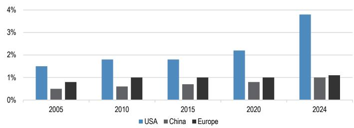

bar

| Year | USA (%) | China (%) | Europe (%) |
|---|---|---|---|
| 2005 | 1.5 | 0.5 | 0.8 |
| 2010 | 1.8 | 0.6 | 1.0 |
| 2015 | 1.8 | 0.7 | 1.0 |
| 2020 | 2.2 | 0.8 | 1.0 |
| 2024 | 3.8 | 1.0 | 1.1 |

Source: IEA (2025), Energy and AI, IEA, Paris https://www.iea.org/reports/energy-and-ai, Licence: CC BY 4.0

Figure 2: The IEA points to strong growth to the end of the decade - capped by physical constraints - with a broader range of 2035 estimates   
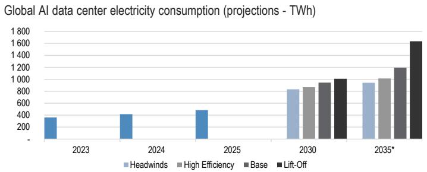

bar

| Year   | Headwinds | High Efficiency | Base  | Lift-Off |
| ------ | --------- | --------------- | ----- | -------- |
| 2023   |           |                 |       |          |
| 2024   |           |                 |       |          |
| 2025   |           |                 |       |          |
| 2030   | 800       | 850             | 950   |          |
| 2035*  | 950       | 1000            | 1200  | 1650     |

Source: JPM based on IEA (2026), Key Questions on Energy and AI, IEA, Paris https://www.iea.org/reports/key-questions-on-energy-and-ai, Licence: CC BY 4.0

Figure 3: AI DC's electricity consumption should almost match that of conventional DC by 2030   
Data centre consumption (TWh)   
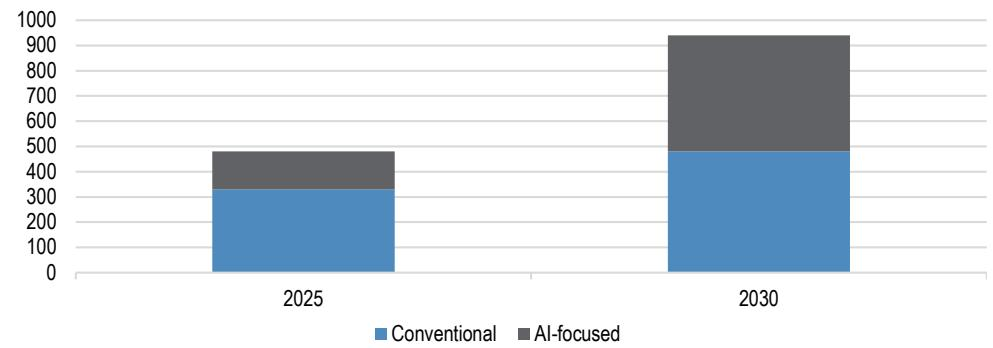

bar_stacked

| Year | Conventional | AI-focused |
| ---- | ------------ | ---------- |
| 2025 | 350          | 150        |
| 2030 | 500          | 450        |

Source: JPM based on IEA (2026), Key Questions on Energy and AI, IEA, Paris https://www.iea.org/reports/key-questions-on-energy-and-ai, Licence: CC BY 4.0

Capacity is “maxed out” to 2030: According to Thomas Spencer, co-author of the IEA report, the unchanged Base Case is explained by physical constraints that limit the outlook’s variability through the end of the decade. The IEA identifies the most binding physical constraints on data centre build-out as: (1) high-end IT hardware supply, notably memory, with order-of-magnitude demand increases straining global manufacturing; (2) grid connection wait times of 4–5 years minimum in major markets; (3) gas turbine availability, with orders up 70% and delivery now slipping past 2030; (4) transformer and specialised electrical equipment lead times, which have doubled; and (5) skilled labour shortages, particularly electricians. From 2030, however, the IEA scenarios are more differentiated, thanks to market dynamics easing these constraints.

Figure 4: Industry projections see a doubling of accelerators shipments to 2030 - with 2035 estimates seeing high uncertainty   
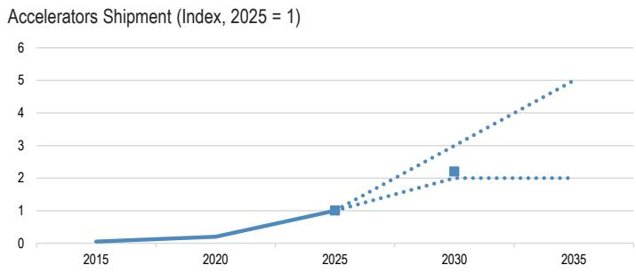

line

| Year | Accelerators Shipment |
| ---- | ---------------------- |
| 2015 | 0.0                    |
| 2020 | 0.2                    |
| 2025 | 1.0                    |
| 2030 | 2.0                    |
| 2035 | 5.0                    |

Source: JPM based on IEA (2026), Key Questions on Energy and AI, IEA, Paris https://www.iea.org/reports/key-questions-on-energy-and-ai, Licence: CC BY 4.0

Figure 5: The 2030 IEA Base Case is derived from industry projections   
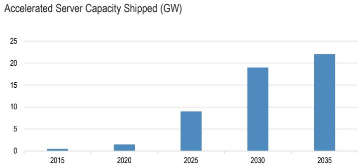

bar

| Year | Accelerated Server Capacity Shipped (GW) |
| ---- | ---------------------------------------- |
| 2015 | 0.5                                      |
| 2020 | 1.5                                      |
| 2025 | 9.0                                      |
| 2030 | 19.0                                     |
| 2035 | 22.0                                     |

Source: JPM based on IEA (2026), Key Questions on Energy and AI, IEA, Paris https://www.iea.org/reports/key-questions-on-energy-and-ai, Licence: CC BY 4.0

Finally, regional dynamics are crucial, as the United States is expected to account for 45% of DC electricity demand, followed by other advanced economies (19%) and China (6-7%).

Figure 6: The US is expected to account for 45% of DC electricity demand growth to 2030   
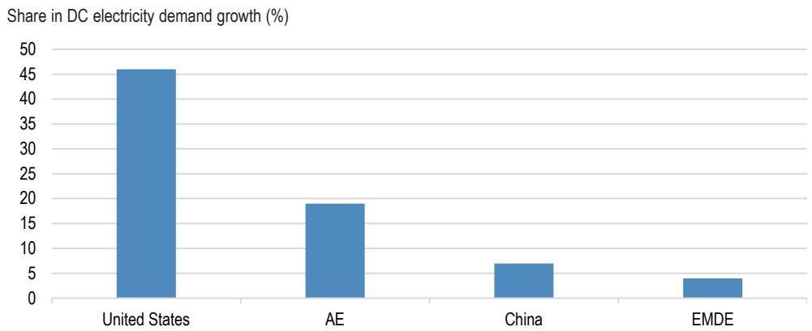

bar

| Entity | Share in DC electricity demand growth (%) |
| :--- | :--- |
| United States | 46 |
| AE | 19 |
| China | 7 |
| EMDE | 4 |

Source: JPM based on IEA (2026), Key Questions on Energy and AI, IEA, Paris https://www.iea.org/reports/key-questions-on-energy-and-ai, Licence: CC BY 4.0

# \$3.9trn of Capex between 2026 and 2030, including 20% for Energy

Cumulative energy capex 2026–2030: \$780bn (\$156bn/year)

The IEA’s latest Base Case estimates for data centre growth imply cumulative investment in data centres of \$3.9trn between 2026 and 2030 of which roughly 20% — approximately \$780bn — is energy-related capex covering grids, generation, backup generators, and uninterruptible power supply. The remaining 80% goes to IT equipment such as servers, accelerators, and storage. The IEA notes that across cases, the absolute energy-related investment ranges from approximately \$500bn in the Headwinds Case to around USD 1 trillion in the Lift-Off Case — a difference of more than \$500bn driven by the scale of capacity additions and the cost of resolving bottlenecks. On an annual basis, that gives about \$780bn of DC Capex, including \$156bn for energy between 2026 and 2030. The IEA stops short of providing total capex estimates in all scenarios.

Figure 7: 20% of \$3.9trn DC Capex for Energy in the Base Case   
Base case Capex (%) - 2026-2030   
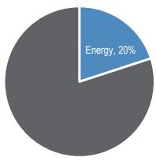

pie

| Category | Value (%) |
|---|---|
| Energy | 20 |
| Other | 100 |

Source: JPM based on IEA (2026), Key Questions on Energy and AI, IEA, Paris https://www.iea.org/reports/key-questions-on-energy-and-ai, Licence: CC BY 4.0

Figure 8: The IEA estimates between \$500bn and \$1trn of Energy Capex by 2030   
Energy capex by case (\$bn) - 2026-2030   
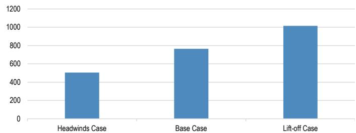

bar

| Case Type | Value |
| :--- | :--- |
| Headwinds Case | 500 |
| Base Case | 780 |
| Lift-off Case | 1020 |

Source: JPM based on IEA (2026), Key Questions on Energy and AI, IEA, Paris https://www.iea.org/reports/key-questions-on-energy-and-ai, Licence: CC BY 4.0

Among EMEA stocks, we view CapGoods and IT Hardware as the best-placed segments, and we detail the JPM OW-rated stocks in the dedicated section, including ASML, Legrand, Nokia and Schneider Electric.

# Significant roll-out of Renewables, Gas, UPS and BESS

Renewables are expected to account for the largest share of additional power demand. Gas is a close second due to large expected deployment in the US. The latest IEA projections increased both renewables and gas expected roll-out by 2030, based on updated market and project pipeline data. With an additional 200TWh (360TWh in 2030), renewables would account for more than one-third of DC total generation by 2030. Gas is expected to grow strongly, mostly in the US, doubling to around 340TWh and reaching around 30% of the mix. The two would cover about 65% of DC electricity demand by the end of the decade.

Figure 9: Renewables are expected to account for the largest share of data center power supply capacity... although gas is a close second with meaningful generation deployment in the US   
Growth in DC generation 2025-2030 (TWh)   
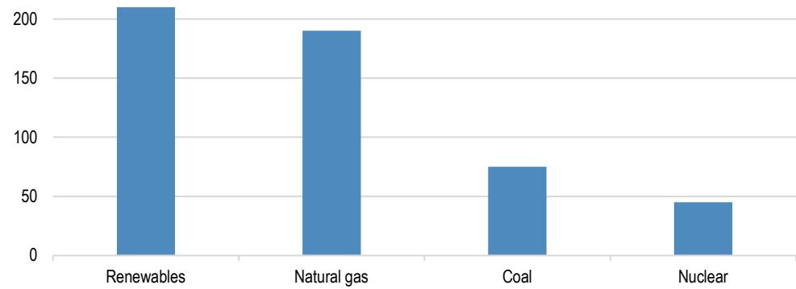

bar

| Category | Value |
|---|---|
| Renewables | 210 |
| Natural gas | 190 |
| Coal | 75 |
| Nuclear | 45 |

Source: IEA (2026), Key Questions on Energy and AI, IEA, Paris https://www.iea.org/reports/key-questions-on-energy-and-ai, Licence: CC BY 4.0

Onsite battery systems will see significant growth, being crucial for data centre power supply reliability, providing short-term backup through Uninterruptible Power Supply (UPS) units in both grid-connected and off-grid setups. In the US, the IEA projects that onsite projects could cover 6-13% of total growth in data centre capacity to 2030. Global data centre UPS capacity is expected to rise by more than 100 GW, broadly matching the growth in data centre infrastructure.

Global installed capacity of longer-duration battery energy storage in data centres will rise from around 5 GW today to 20-25 GW by 2030. The majority of this will be in the United States, where onsite battery storage in data centres is expected to reach 10-12 GW by 2030, compared with more than 90 GW of grid-connected utility-scale battery storage.

Power me up, Scotty! Alpha generation in the battery revolution (V. Heriz & al.) highlights Aneka Tambang, L&F, Sungrow, LGES, CATL and Samsung SDI as JPM OW rated battery stocks.

Figure 10: While onsite generation is one of the most talked about angle of AI DC power...   
Installed Onsite Gas Capacity (GW)   
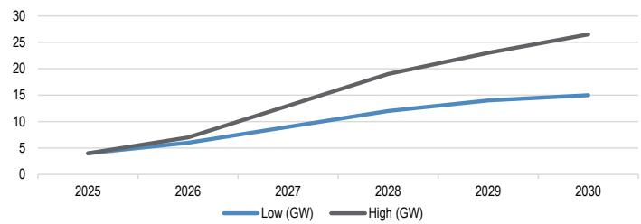

line

| Year | Low (GW) | High (GW) |
|------|----------|-----------|
| 2025 | 4        | 4         |
| 2026 | 6        | 8         |
| 2027 | 9        | 14        |
| 2028 | 12       | 19        |
| 2029 | 14       | 23        |
| 2030 | 15       | 27        |

Source: IEA (2026), Key Questions on Energy and AI, IEA, Paris https://www.iea.org/reports/key-questions-on-energy-and-ai, Licence: CC BY 4.0

Figure 11: Onsite battery storage is expected to grow as fast
Installed Onsite Battery Storage Capacity (GW)   
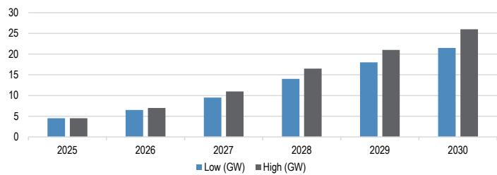

bar

| Year | Low (GW) | High (GW) |
|---|---|---|
| 2025 | 4.5 | 4.5 |
| 2026 | 6.5 | 7.0 |
| 2027 | 9.5 | 11.0 |
| 2028 | 14.0 | 16.5 |
| 2029 | 18.0 | 21.0 |
| 2030 | 21.5 | 26.0 |

Source: IEA (2026), Key Questions on Energy and AI, IEA, Paris https://www.iea.org/reports/key-questions-on-energy-and-ai, Licence: CC BY 4.0

Coal will remain a significant source of AI power generation in China, while Nuclear is expected to see moderate growth to 2030. The long development time of nuclear, as well as lack of maturity of SMRs are limiting the projected roll-out of capacity by the end of the decade.

Europe's Nuclear Renaissance: Recent Developments, Future Outlook Stock Ideas

(Hecker & al.) underlines Centrica, Rolls-Royce Holdings, Siemens Energy, Bouygues, Babcock International, IMI, and Rotork, as JPM nuclear exposed OW EMEA stocks.

# How Much Compute Does AI Need?

# "Unprecedented" energy-efficiency improvements

The IEA report describes the energy efficiency gains in AI as occurring at a pace unprecedented in energy history. Measured per individual task, software and hardware advances have driven the energy use per AI query down by at least an order of magnitude annually in recent years. The first official per-query disclosures from major AI companies confirm this: Google reports that the median Gemini text prompt consumes just 0.24 Wh, while OpenAI puts the average ChatGPT query at 0.34 Wh — a figure independently corroborated by a bottom-up estimate from Microsoft Research for frontier-scale models with over 200 billion parameters.

In our first report on AI & Energy (ChatESG x Lost in Transition(s) - Digital Carbon: Climate, AI the ICT value chain), we mentioned that a 2011 New York Times article reported that a single Google search represented 0.3 Wh of electricity. In other words, in 15 years, software and hardware driven efficiency gains have allowed a shift from traditional search to Generative AI at a similar level of energy consumption. Another measure is that simple text queries now typically consume less electricity than running a television over the same period.

Figure 12: A standard Generative AI text request is now comparable to a 2011 Google Search   
Indicative inference GPU electricity consumption across different model types for text generation and agentic task   
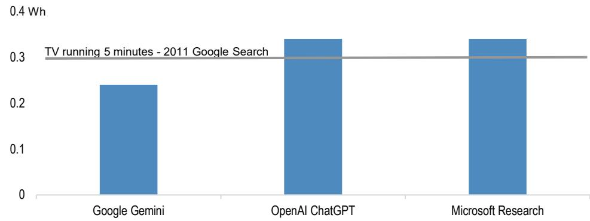

bar

| Company | Energy Consumption (Wh) |
| :--- | :--- |
| Google Gemini | 0.24 |
| OpenAI ChatGPT | 0.34 |
| Microsoft Research | 0.34 |
TV running 5 minutes - 2011 Google Search

Source: JPM based on IEA (2026), Key Questions on Energy and AI, IEA, Paris https://www.iea.org/reports/key-questions-on-energy-and-ai, Licence: CC BY 4.0

These efficiency gains are accelerating. Google reported a 33-fold reduction in energy per prompt over just 12 months to May 2025, driven by advances in model architecture and hardware. On the software side, the compute required to reach a given level of language model performance has roughly halved every eight months, while inference cost per token has fallen by orders of magnitude through model improvements, system optimisation, and more specialised hardware.

On the hardware side, leading AI processors and accelerators have improved performance per watt by roughly 30–40% per year on average over the past decade, supported by advanced process nodes, high-bandwidth memory integration, and task-specific accelerators such as TPUs and inference-optimised ASICs. Best-in-class hyperscale data centres now achieve power usage effectiveness (PUE) ratios of 1.1–1.2, compared to 1.5–1.7 for older facilities — a shift that reduces non-IT energy consumption by roughly two-thirds.

# Counterbalanced by the rapid evolution of use-cases

AI use cases are shifting rapidly toward far more energy-intensive workloads. Reasoning models are AI systems designed to engage in multi-step logical inference — exploring and evaluating multiple solution paths, generating longer chains of intermediate thought, and running iterative verification loops before producing a final output. Agentic AI goes a step further: these are autonomous systems that plan and execute multi-step tasks on a user's behalf, calling external tools, running simulations, and decomposing high-level objectives into sequences of sub-tasks with limited or no human intervention. Unlike a single chat response, an agentic workflow can decouple compute demand from direct human attention, running continuously in the background.

The energy implications are substantial. While a simple text query consumes around 0.05–0.3 Wh, a reasoning query consumes roughly 1 Wh, and an agentic task with reasoning enabled can consume around 50 Wh — orders of magnitude more energy per task than a basic text completion. This reflects the higher token generation, memory usage, and tool calls involved. As reasoning models become widely deployed across major platforms and agentic workflows diffuse into search, productivity tools, customer support, and enterprise automation, aggregate inference demand per user interaction is rising sharply — even as per-operation hardware efficiency continues to improve. This is the central reason the IEA expects AI electricity consumption to keep climbing despite the unprecedented pace of efficiency gains.

Figure 13: Agentic and Reasoning tasks are materially more energy intensive than text queries

Indicative inference GPU electricity consumption across different model types for text generation and agentic task   
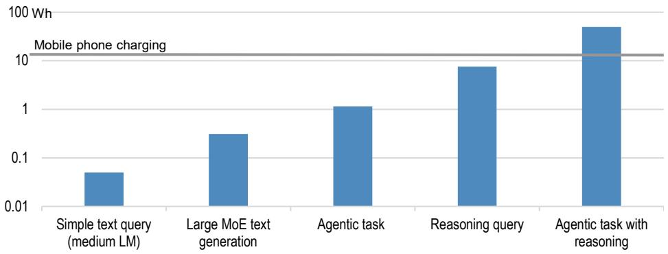

bar

| Category | Value (Wh) |
| :--- | :--- |
| Simple text query (medium LM) | 0.05 |
| Large MoE text generation | 0.3 |
| Agentic task | 1.0 |
| Reasoning query | 8.0 |
| Agentic task with reasoning | 50.0 |
Mobile phone charging (horizontal line at 10 Wh)

Source: IEA analysis based on Hugging Face (2025)

According to the IEA, taking the 2025 per-query figures at face value and applying a “generous” blended average of 1 Wh to account for heavier workloads such as reasoning and multimodal generation, scaling to 10 billion queries per day — comparable to the volume of all daily internet searches worldwide and roughly four times ChatGPT's reported 2.5 billion daily prompts in mid-2025 — would imply annual electricity consumption of only about 3.6 TWh. That represents less than 1% of the 485 TWh that data centres consume today, and only a small draw on the tens of gigawatts of new IT capacity that leading AI companies are each seeking to secure.

The IEA highlights that the implications are significant regarding the future AI demand: the scale of the projected demand implies vastly more usage than simple text inference: large-scale model training, video and image generation, autonomous agents running multi-step pipelines, and enterprise deployments not yet reflected in public usage figures.

Efficiency gains are being outpaced by surging demand and a shift toward far more energy-intensive use cases. Video generation can require hundreds to thousands of times more energy per request than simple text queries, while reasoning models, multimodal systems, and agentic AI — which autonomously plan and execute multi-step tasks — can consume orders of magnitude more tokens per interaction than a single query.

This dynamic, known as the Jevons paradox, means that as AI becomes cheaper and more capable, broader adoption and more sophisticated workloads more than offset the per-task efficiency gains. The report therefore calls for closer monitoring, more frequent updates, and stronger cooperation with the tech sector, including more systematic energy consumption disclosures and breakdowns of how anticipated capacity will be allocated across training, inference, and emerging agentic workloads.

# The Jevons Paradox and Rebound Effects

The Jevons Paradox originates from English economist William Stanley Jevons, who observed in his 1865 work The Coal Question that improvements in the efficiency of steam engines did not reduce coal consumption in Britain — rather, they caused it to increase. His central insight was that as technology makes the use of a resource more efficient, the cost of using that resource effectively falls, which stimulates greater demand and, consequently, higher overall consumption. This runs counter to the intuitive assumption that doing more with less will automatically lead to conservation.

The paradox highlights a fundamental tension in resource economics: efficiency gains, rather than being purely beneficial from a conservation standpoint, can trigger behavioural and economic responses that partially or fully offset the savings originally anticipated. In modern contexts, this logic applies well beyond coal — it extends to fuel-efficient vehicles, energy-saving appliances, water conservation technologies, and computational efficiency in data centres.

Rebound effects are the broader framework used to describe and quantify this phenomenon. They are typically categorized at different scales. The direct rebound effect refers to the increase in consumption of a specific good or service resulting from the efficiency improvement itself — for example, driving more miles because a fuel-efficient car makes each mile cheaper. The indirect rebound effect captures the additional consumption that arises because money saved through efficiency is spent on other goods and services that also consume energy or resources. Finally, economy-wide or macro-level rebound effects account for systemic changes across markets, including shifts in prices, production patterns, and investment behavior triggered by widespread efficiency adoption.

# Back-of-the-envelope AI-assisted inference demand calculation points to “optimism”

The IEA flags but does not deeply explore which workloads will fill its 2030 AI data center projections; our AI-assisted thought experiment finds that per-query economics (text, image, search) explain less than 5% of projected inference demand, with four high-intensity workload classes — agentic, video/multimodal, ambient assistants, and embedded enterprise inference — accounting for 75–85% of the build-out and quantifying the optimism baked into the IEA's base case.

Disclaimer: This is a structured-thinking exercise, not a forecast. Per-task energy intensities, training compute estimates, and adoption volumes are individually order-of-magnitude estimates; their products carry compounded uncertainty. Results are presented as ranges, and point estimates within those ranges should not be read with implied precision. Details are available on request.

# Context

Global data center electricity consumption is projected by the IEA to roughly double from 485 TWh in 2025 to 950 TWh by 2030, lifting the sector's share of global electricity from 1.5% to 3%. Within that envelope, AI-focused infrastructure is expected to grow from \~150 TWh to \~470 TWh, accounting for roughly 70% of all incremental data center demand and reaching near-parity with conventional workloads. First-party per-query disclosures from major AI providers (Google: 0.24 Wh; OpenAI: 0.34 Wh; Microsoft Research: 0.34 Wh) imply that even universal text inference at 10 billion queries per day would consume only \~3.6 TWh annually — less than 1% of today's footprint. The central question is therefore what inference workloads can plausibly absorb the announced capacity, and how robust that demand is to alternative deployment patterns.

Inference is now the central question. Industry signals through late 2025 and early 2026 point to a decisive shift in the AI compute mix. Deloitte estimates inference accounted for \~50% of AI compute in 2025, rising to \~67% in 2026. Major OEMs such as Lenovo project the dollar-spend mix will reverse from a historical \~80/20 training-to-inference split toward \~20/80 by the end of the decade. Training compute remains material — frontier runs are scaling toward 0.3–2 TWh each, with failed runs, post-training, synthetic data generation, and sovereign initiatives plausibly adding to a 100–250 TWh range by 2030 — but its trajectory depends on uncertain pretraining scaling laws, and it is no longer the principal driver of the build-out narrative. The structural questions for 2030 capacity therefore concern inference: which workloads scale, how fast, and where they are deployed.

We construct bottom-up scenarios across the inference workload spectrum — text, reasoning, image, video, agentic, ambient, enterprise embedded, search, and embodied AI — anchored where possible to IEA indicative values (medium LM \~0.05 Wh; large MoE \~0.31 Wh; agentic \~7.6 Wh; reasoning \~1.14 Wh; agentic with reasoning \~50 Wh). Per-task intensities incorporate two opposing forces: efficiency gains (software optimization, hardware perf/watt at 30–40% per year, PUE compression, combining to a realized \~15–30× reduction by 2030) and capability creep under a Jevons dynamic (longer reasoning chains, multimodal context, agentic loops, continuous ambient operation), which the IEA explicitly notes operate as roughly offsetting forces. Population assumptions are held consistent: 8.5 billion global population, 6–6.5 billion internet users, 3–4 billion active AI consumer users, 0.5–1.5 billion heavy users, 350–450 million knowledge workers, and 50–150 million cloud-tethered autonomous devices. This is a structured-thinking framework, not a forecast; results are presented as ranges and point estimates should not be read with implied precision.

# Key findings

- 1. Per-query economics do not explain the inference build-out. Text inference, image generation, and AI-augmented search collectively account for less than 5% of projected 2030 inference demand under any plausible efficiency assumption. The capacity narrative is structurally about other workloads.   
- 2. Four workload classes are the structural drivers of inference demand. Agentic workflows, video and multimodal generation, ambient assistants, and embedded enterprise inference are the only categories whose capability-creep multipliers can match or exceed efficiency gains. Together they plausibly represent 75–85% of inference-attributable demand.   
- 3. The Jevons dynamic governs the inference trajectory. Each order-of-magnitude efficiency gain unlocks new high-intensity workload classes that re-inflate the energy baseline. Net inference electricity demand rises despite — and partly because of — efficiency progress.   
- 4. A material share of inference may migrate outside hyperscaler data centers. Three converging enterprise drivers — cost discipline on cloud, data-locality requirements, and sovereignty and privacy concerns — are pulling inference toward on-premises servers and edge devices. This shifts demand from the IEA's data center perimeter into commercial and industrial electricity categories, complicating the mapping of total AI compute to data-center figures.   
- 5. Training compute remains material but uncertain. A 2030 range of 100–250 TWh for total training compute (frontier runs, failed and exploratory compute, mid-tier and specialized models, post-training, synthetic data generation, sovereign and enterprise training) reflects genuine uncertainty about whether pretraining returns to scale continue or plateau.

# Conclusion

The IEA's 470 TWh figure is best read as one plausible outcome at the optimistic end of a wide range, achievable principally if inference workloads scale broadly and a substantial share remains in hyperscaler facilities. Capacity planning, capital deployment, and policy frameworks all benefit from explicitly working with ranges and tracking inference adoption indicators (production agentic deployment, generative video at consumer scale, ambient assistant penetration, enterprise embedded depth, hyperscaler-versus-on-prem mix) alongside the training-side scaling debate. Beyond that, the analysis does not support strong directional recommendations: uncertainty across inference adoption, deployment location, and training scaling is sufficiently large that prudent stakeholders will likely want to revisit assumptions as data accumulates over the next 12–24 months.

AI data center electricity demand will grow substantially through 2030 under any reasonable scenario, but the range of plausible outcomes is wide and the announced build-out is calibrated to the upper end. The structure of inference demand is now the principal question for capacity planning, with four high-intensity workload classes — agentic, video, ambient, and enterprise embedded — driving the trajectory, and a meaningful share of inference potentially migrating outside the

hyperscaler perimeter. Training compute remains material but its trajectory depends on uncertain scaling laws and is no longer the dominant story.

# Where Can AI Boost Energy Efficiency?

According to the IEA, the widespread adoption of AI applications could lead to significant reduction in energy consumption: the broad application of well-documented AI solutions would be equivalent to around 3% of global final energy consumption in 2035. This section develops the use-cases across energy intensive sectors. However, various barriers to AI adoption would need to be overcome to unlock these gains. AI can be a tool in reducing emissions, but it is not a silver bullet and does not remove the need for proactive policy. We address the limitations of these estimates in the next question.

AI for energy optimisation uses existing AI to make today's system cheaper, cleaner and more reliable by improving production, networks and end-use. In supply and grids, AI enhances demand and renewables forecasting, dispatch, predictive maintenance, fault detection and dynamic operating limits—reducing curtailment and fuel burn while unlocking latent transfer capacity. In upstream sectors, it sharpens oil and gas exploration/operations (including methane leak detection) and improves targeting, automation and processing in critical minerals. On the demand side, AI optimises industrial processes and quality control, enables eco-routing and fleet management in transport, and tunes HVAC and demand flexibility in buildings via smart controls—delivering measurable energy savings and grid services.

These elements will likely represent material drivers of energy- and cost-efficiency gains for energy-intensive industries. We are therefore optimistic about their adoption wherever the benefits can be captured/monetized by companies exposed to new AI solutions. In turn, the adoption of these technologies will likely benefit electrification and solution providers including CapGoods and IT Hardware companies mentioned in an earlier section of this report.

Table 1: Power offers some of the most promising AI uses, including for design, development and operational optimisation   
AI applications for energy optimisation and their applicability by sector 

<table><tr><td>Category</td><td>Definition</td><td>Oil &amp; Gas</td><td>Critical minerals</td><td>Power</td><td>Grids</td><td>Industry</td><td>Transport</td><td>Buildings</td></tr><tr><td>Resource management</td><td>Assessment, characterisation and extraction of resources, including fossil fuels, critical minerals, renewables (e.g. wind, solar, hydro and geothermal) and CCUS.</td><td></td><td></td><td></td><td>N.A.</td><td></td><td>N.A.</td><td>N.A.</td></tr><tr><td>Design and development</td><td>Design, planning, development and construction of assets to extract, harness, transform and transport resources, and assets that are end-users of energy.</td><td></td><td></td><td></td><td></td><td></td><td></td><td></td></tr><tr><td>Operational optimisation</td><td>Enhance the efficiency and output of a process (or set of processes) related to the extraction, generation, transformation and transport of energy, or in end-use sectors.</td><td></td><td></td><td></td><td></td><td></td><td></td><td></td></tr><tr><td>Automation and autonomy</td><td>Remove significant elements of human interaction within a system or process.</td><td></td><td></td><td></td><td></td><td></td><td></td><td>N.A.</td></tr></table>

\*CCUS: Carbon Capture, Utilization and Storage Green : high; yellow : medium ; red : low   
Source: JPM based on IEA

AI is being deployed across multiple energy sectors to optimise operations and reduce emissions through improved efficiency and monitoring. We look in the following sections at some of the use cases highlighted by the IEA.

- Oil & Gas: AI enhances methane leak detection through satellite monitoring systems, enabling faster repairs and reducing a major source of sector emissions.   
- Power Generation: AI optimises operating conditions at fossil fuel plants to maintain peak efficiency, reducing fuel consumption and emissions.

- Industry: AI optimises manufacturing processes, such as improving fuel mix in cement production, achieving energy efficiency gains exceeding 2%.   
- Transport: AI enables more efficient vehicle operations through optimised routing and driving characteristics, delivering 5-10% efficiency improvements and corresponding emissions reductions.   
- Buildings: AI-powered building management systems optimise heating, ventilation, and air conditioning (HVAC) controls, reducing energy consumption by approximately 10%.

Figure 14: Industry and transport have the largest potential for AI driven energy efficiency   
CO2 emissions reductions in the widespread adoption case (Mt CO2)   
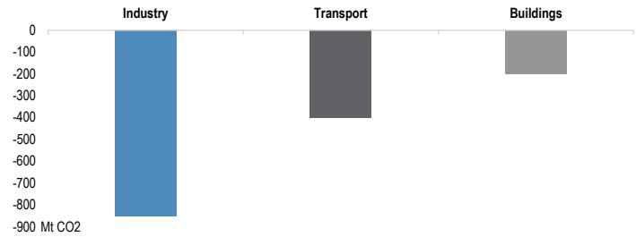

bar

| Category | Value (Mt CO2) |
|---|---|
| Industry | -850 |
| Transport | -400 |
| Buildings | -180 |

Source: IEA (2025), Energy and AI, IEA, Paris https://www.iea.org/reports/energy-and-ai, Licence: CC BY 4.0

Figure 15: AI could reduce energy emissions by about 4% by 2035   
Energy sector CO2 emissions, 2035 (Gt CO2)   
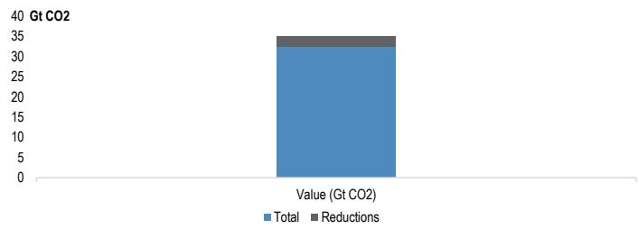

bar_stacked

| Category | Total (Gt CO2) | Reductions (Gt CO2) |
|---|---|---|
| Value | 35 | 2 |
| Gt CO2 | 40 | 0 |

Source: IEA (2025), Energy and AI, IEA, Paris https://www.iea.org/reports/energy-and-ai, Licence: CC BY 4.0

# Oil & Gas

The oil and gas industry has been an early AI adopter, using it to optimise exploration, production, maintenance, and safety. In exploration and development, AI can make resource evaluation more reliable and reduce pre-drilling uncertainty. In operations, AI optimises and automates production processes, detects leaks, predicts maintenance needs, and supports efforts to reduce methane emissions.

# The main areas of application are :

- Exploration and Development: AI is being used to enhance the evaluation of resources and reduce pre-drilling uncertainty. This includes the use of AI in seismic processing to improve interpretation and image quality, making it up to 90% better at classification.   
- Operations and Safety: AI is optimising and automating production processes, leveraging digitalized setups to lower costs, increase reliability, and enhance safety. Remote operations are being facilitated by AI, with cloud computing allowing for the remote analysis of datasets and operational decisions. AI is being used for predictive maintenance, enabling early identification of potential issues and reducing unplanned downtime.   
- Emissions Reduction: AI is playing a crucial role in identifying and mitigating methane leaks, both existing and at-risk. This includes the use of AI-driven methane emitter monitoring systems using satellites. AI is enhancing leak detection and repair programs, allowing for continuous monitoring and rapid detection of fugitive emissions, which comprise around 20% of methane emissions from oil and gas operations.   
- Cost Reduction: AI is contributing to cost reductions in oilfield development and operations. For example, in the Widespread Adoption Case, AI could reduce costs in oilfield development and operations by up to 10%. AI is enabling more efficient

Figure 16: AI-led interventions could reduce exploration...   
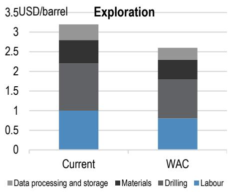

bar_stacked

| Category | Data processing and storage | Materials | Drilling | Labour |
| -------- | --------------------------- | --------- | -------- | ------ |
| Current  | 0.4                         | 0.7       | 1.0      | 1.0    |
| WAC      | 0.3                         | 0.5       | 1.0      | 0.8    |

Source: IEA (2025), Energy and AI, IEA, Paris https://www.iea.org/reports/energy-and-ai, Licence: CC BY 4.0

drilling operations, reduced labour needs, and streamlined materials supply chains, leading to overall cost savings.

\- Carbon Capture and Storage: AI is being used to improve the planning of carbon capture, utilization, and storage (CCUS) projects by enhancing reservoir models and providing more certainty around the efficacy and costs of long-term CO2 storage.

Figure 17: Development...   
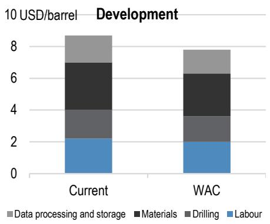

bar_stacked

| Development | Data processing and storage | Materials | Drilling | Labour |
|-------------|-----------------------------|-----------|----------|--------|
| Current     | 2.0                         | 4.0       | 2.0      | 2.0    |
| WAC         | 2.0                         | 3.0       | 2.0      | 2.0    |

Source: IEA (2025), Energy and AI, IEA, Paris https://www.iea.org/reports/energy-and-ai, Licence: CC BY 4.0

Figure 18: And operations costs for new deepwater projects   
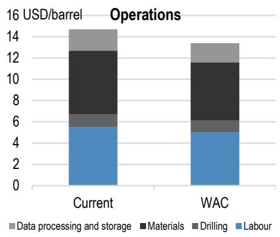

bar_stacked

| Operations | Current | WAC |
| ---------- | ------- | --- |
| Data processing and storage | 2.0 | 2.0 |
| Materials | 4.0 | 4.0 |
| Drilling | 1.0 | 1.0 |
| Labour | 5.0 | 5.0 |

Source: IEA (2025), Energy and AI, IEA, Paris https://www.iea.org/reports/energy-and-ai, Licence: CC BY 4.0

# Corporate Highlights

- Saudi Aramco (OW) processes approximately 10 billion operational data points daily, creating a significant advantage for training industrial algorithms. Aramco stands out among all global peers by utilizing its independently verified Technology Realized Value (TRV) framework to explicitly quantify the financial benefits of its digital deployments. In 2024, Aramco captured \$4 billion in total TRV, with artificial intelligence and digital solutions directly driving approximately 50%—or \$2 billion—of this financial benefit.   
- TotalEnergies' (OW) has announced significant AI investments. The company matches BP with 10 distinct AI use cases and is investing \$1 billion annually into R&D and digital integration. TotalEnergies recently signed partnerships to deploy AspenTech Inmation across 56 sites (collecting and centralizing millions of real-time data points) and roll out Cognite's AI platform across its entire global upstream portfolio. The company has also launched a dedicated joint innovation lab with Mistral AI to develop generative models for its 1,000 internal researchers. While TotalEnergies successfully generated \$200 million in annual savings from its broader 2023-2025 energy efficiency plan, there is no specific quantifiable AI-driven investment returns.   
- ENI (OW) offers a differentiated investment in proprietary high-performance computing (HPC). The deployment of the HPC6 supercomputer (fifth fastest in the world) provides ENI with world-class subsurface modelling capabilities, allowing the company to process complex seismic data and accelerate its time-to-market for new exploration projects. ENI also actively leverages strategic software partnerships, testing NVIDIA's Earth-2 deep learning models to predict weather and gas demand weeks in advance, thereby optimising its energy trading and dispatching operations.   
- Shell (OW) has deployed 8 primary AI use cases, focusing heavily on agentic AI

through its strategic collaboration with SLB to unify subsurface and well construction workflows. The company highlights effective predictive maintenance and LNG optimisation algorithms prevent unexpected facility trips. Shell is utilizing these digital interventions to support a \$5 billion to \$7 billion structural cost savings target by 2028.

- BP (N) has a decade-long partnership with Palantir. With 10 distinct AI use cases, BP excels in upstream operational reliability, utilizing dynamic digital twins to increase operated production by approximately 4% while protecting 10% of production from going offline. This AI-driven surveillance recently pushed BP's upstream availability to 97%, significantly outperforming historical baselines. BP is also rapidly accelerating its well-planning efficiency, utilizing generative AI to reduce planning cycle times by 90%. BP is executing a \$1.7 billion structural cost reduction program heavily reliant on digital workflows, yet does not provide AI-specific financial savings.   
- Equinor (UW) stands out with 11 distinct AI use cases and explicitly reported that artificial intelligence generated \$130 million in direct value creation and cost savings in 2025. Furthermore, Equinor tracks its cumulative AI-driven financial benefits, reporting over \$330 million in realized value since 2020. Equinor is able to directly tie predictive maintenance—which monitors 700 rotating machines via 24,000 sensors—to \$120 million of structural savings. The company maintains an important technology funding, stabilizing its research, development, and digital investments at \$730 million in 2025.

# Other Corporate Use-Cases:

- ADNOC (with AIQ): Trialed an agentic AI based on large language models to automate subsurface workflows and seismic processing, reporting substantially higher processing accuracy and faster interpretation that reduce uncertainty and shorten cycle times.   
- Aker BP: Deploys digital twins integrating real-time data and engineering models to streamline operations and maintenance, improving uptime and enabling closer-to-optimal set-points that cut energy intensity.   
- Chevron: Combines field data, physics-based models and machine learning for reservoir analytics and production forecasting, yielding faster history matching and more reliable well planning that can raise recovery and cut planning lead times.   
- ExxonMobil: Applies AI to demand and production forecasting, reporting roughly a 25% reduction in forecast error that improves nominations, inventory alignment and operational efficiency, reducing energy waste.   
- Google (with Fervo Energy): Partner to pilot and procure next-generation geothermal using oil-and-gas drilling techniques, supplying firm low-emissions power to match data-centre loads and showcasing transferable subsurface and drilling optimisation.

# Utilities

AI can help balance increasingly complex, decentralized, and digitalized electricity networks. AI improves forecasting and integration of variable renewable energy generation, reducing curtailment and emissions. AI-based fault detection rapidly identifies and precisely pinpoints grid faults, reducing outage durations by 30-50%. Remote sensors and AI-based management can increase transmission line capacity.

\- Power System Operations AI is being integrated into power system operations to manage the complexities of integrating renewable energy sources into the grid. AI-enhanced control systems allow plants and facilities to operate at rated performance for longer periods, improving efficiency and minimizing downtime. AI is used for real-time forecasting to assess system imbalances, and AI-driven weather and demand prediction models improve the accuracy of forecasts, minimizing the curtailment of wind and solar PV in conjunction with demand shifting or storage. In practice, AI-based fault detection rapidly identifies and precisely pinpoints grid faults, reducing outage durations by roughly 30–50%. Remote sensors and AI-based management can also increase transmission line capability without new lines—dynamic line ratings and related tools can unlock up to about 175 GW of transfer capacity, a scale that can exceed projected data-centre load growth to 2030 in the base outlook. In the Widespread Adoption Case, these system-level and plant-level optimisations collectively contribute to large economic and emissions benefits, including up to USD 110 billion in annual savings by 2035 from avoided fuels and lower operating costs, and substantial reductions in curtailment and associated emissions.

\- Power Plant Operations and Maintenance: AI is applied to improve the operation and maintenance of power plants and storage assets, offering potential increases in uptime, improved efficiencies, reduced maintenance and fuel costs, and reduced stress on assets. Predictive and condition-based maintenance strategies, facilitated by AI, can yield benefits such as increased efficiency and extended asset lifetimes. AI can also support the development of digital twins for real-time monitoring and simulation of power sector assets. Quantitatively, optimising plant O&M schedules can raise average fossil-fuel plant efficiency by around 3% in the Widespread Adoption Case, saving on the order of 200 million tonnes of coal equivalent and 95 billion cubic metres of natural gas per year and avoiding about 850 million tonnes of CO₂ annually. Further enhancing efficiency to deliver roughly 6–8% more electricity per unit of fuel could translate into fuel savings of around USD 40 billion per year, with approximately 65% of those savings arising in coal-fired generation. Extending the operational lifetimes of plants by roughly four years would postpone retirement of about 435 GW by 2035 (including \~120 GW of wind and \~50 GW of solar PV, plus \~170 GW coal and \~60 GW gas), deferring up to \~7% of cumulative investment in new power plants (around USD 760 billion) and cutting annual capital recovery payments by up to \~USD 35 billion.

\- Electricity Networks: AI is used to optimise grid management, improving efficiency and performance across operational parameters. AI applications in real-time operations focus on determining system imbalances, and load and generation forecasting, especially for renewables. AI helps optimise maintenance schedules and equipment replacement based on condition monitoring, with decisions that can be methodically evaluated and refined. AI image analysis is used for asset monitoring and management, particularly for vegetation management. These tools complement the quantified system-level gains above by reducing outages, improving asset utilisation, and enabling higher renewable penetration without proportionate increases in grid build-out.

\- Grid Planning and Development: AI is leveraged for long-term scenario planning, enabling grid planners to efficiently plan and reliably integrate renewable energy sources. AI helps navigate uncertainties in future electricity demand driven by widespread electrification and the unpredictable evolution of power system technologies. AI is used in asset operation planning to define and calibrate maintenance policies and activity planning, such as optimised scheduling and

operation mode. By improving siting, timing, and portfolio choices, these capabilities reinforce the quantified benefits from lower curtailment, higher efficiency, deferred capex, and reduced outage and fuel cost.

Figure 19: AI-apps in power plants could yield potential cost savings of up to \$110bn annually to 2035   
Annual cost savings in the WAC in power plant operations 2025-2035   
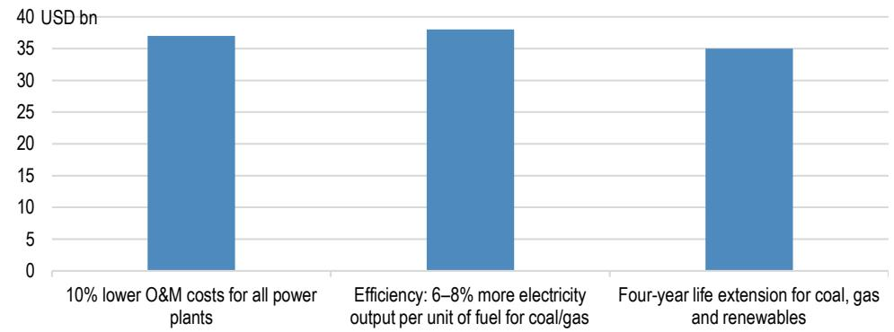

bar

| Category | Value (USD bn) |
|---|---|
| 10% lower O&M costs for all power plants | 37 |
| Efficiency: 6–8% more electricity output per unit of fuel for coal/gas | 38 |
| Four-year life extension for coal, gas and renewables | 35 |

Source: IEA (2025), Energy and AI, IEA, Paris https://www.iea.org/reports/energy-and-ai, Licence: CC BY 4.0

# Corporate Highlights

\- Veolia (N): Veolia's AI strategy is anchored by its Hubgrade platform and the emerging Talk to My Plant agentic AI program. In the water business, AI-powered digital twins deployed across over 120 wastewater treatment plants reduce $\mathrm{N}_2\mathrm{O}$ emissions by up to $90\%$ , cut energy consumption by up to $40\%$ , and lower carbon footprints by up to $60\%$ , while smart aeration control via the Purecontrol solution — extended to more than 200 sites — generates an average additional energy saving of $10\%$ . In the waste business, AI optimises waste-to-energy facilities to improve energy recovery and environmental outcomes, route optimisation delivers cost savings of up to $6\%$ , and solutions like BOM DIA limit pollutant content in recyclable streams to $5\%$ , while MasterChef material mix algorithms aim to increase hazardous waste incinerator treatment capacity by $5\%$ . In the energy business, AI solutions spanning forecasting, network monitoring, and production optimisation — including EnEffCo and Eurekam, deployed across more than 2,000 projects in 38 countries — achieve energy savings of up to $30\%$ for industrial customers, while an agentic layer transforms operational data into real-time decisions across heating, cooling, and electricity flexibility markets.

- E.ON (OW) has already implemented approximately 70 distinct AI use cases across its markets (although details are lacking) and deployed 30,000 smart substations to enable real-time grid automation. E.ON's envelopio digital twin technology now actively manages over 41 million connection points, providing real-time simulation and predictive analytics for $51\%$ of the German distribution grid. The group deploys field assistants as AI digital companions for low-voltage operations (up to $45\%$ increased efficiency).   
- National Grid's (OW) corporate venture arm, National Grid Partners, has aggressively positioned the utility at the forefront of grid modernization by committing \$100 million specifically to AI energy startups, adding to the \$150 million it has already deployed across 18 AI companies. Furthermore, National Grid is piloting AI infrastructure through a partnership with NVIDIA and Emerald AI, demonstrating that AI data centres can dynamically adjust their power consumption to support grid stability.

- Iberdrola (N) stands out by linking executive remuneration directly to AI implementation success, applying a 7.5% weighting to artificial intelligence objectives in its management variable pay structure. Beyond leading the sector with €425 million in annual R&D spending, Iberdrola has launched East-West Digital to commercialize AI solutions.   
- Engie (OW) has secured a global licensing agreement with Kaluza's Energy Intelligence Platform to optimise distributed energy assets and enhance B2C customer experiences, securing its competitive standing in digital energy management. The group expanded its power purchase agreement with Meta to 1.3 GW to support data center operations with $100\%$ clean energy. Engie also aims to develop 3 to 4 GW of co-sited data centres by 2030, supported by a 6 GW global pipeline.   
- Enel (OW) has moved 100% of its applications to the cloud to accelerate the deployment of enterprise AI tools. To capture the AI infrastructure wave, Enel is actively repurposing available industrial sites to provide data center operators with rapid grid connections and long-term energy supply. While highly competent, Enel lacks some of the highly publicized, proprietary AI venture initiatives seen in the top three.   
- RWE (OW) focuses on AI primarily as a demand catalyst for its power generation portfolio rather than a core software differentiator. The company is strategically unlocking the value of its existing real estate by developing over 10 potential data center sites with more than 3 GW of secured grid-connection capacity.   
- SSE (OW) identifies data center growth and AI load requirements as major tailwinds for its robust offshore wind and transmission pipeline. However, SSE's strategic focus remains firmly rooted in traditional capacity building and physical grid expansion, with fewer disclosed deployments of proprietary, predictive AI network technologies compared to its continental peers.   
- Centrica (OW) is leveraging AI as an internal cost-reduction tool, targeting a 30% reduction in customer contact demand and contributing to a £500 million transformation savings program.

# Industrials

The industry of the future will be increasingly digitalized and automated, with countries and companies leading AI integration in manufacturing gaining an advantage. AI applications can accelerate product development, lower costs, and enhance quality. In the Widespread Adoption Case, energy savings of around 8% could be achieved by 2035 in light industry, such as the manufacturing of electronics or machinery. In buildings, the potential is limited by the rate of digitalisation, but there are compelling illustrations of impact, such as on efficiency and demand response. Widespread adoption of existing AI applications to optimise industrial processes can lead to energy savings equivalent to Mexico’s total energy consumption today. European companies hold over half of the market share for industrial automation solutions, critical for industrial AI deployment.

\- Process Optimisation: AI is being used to optimise production processes, which directly impacts energy demand. This involves collecting data through sensors in the process and applying AI algorithms to improve efficiency and detect inefficiencies. In energy-intensive industries, AI can enable additional efficiency savings in single-digit percentages. For example, ArcelorMittal achieved 3% energy savings at a steel plant in Luxembourg by using AI to assess and optimise the plant's energy

performance in real time. In non-energy-intensive industries, the potential savings from AI-based process optimisation are even higher. The widespread adoption of known AI applications could save around 8 exajoules (EJ) of industry energy demand by 2035.

- Quality Control: AI is used for quality control through image recognition, which can optimise material balance in production processes. This is particularly relevant in industries where the quality of input and output materials is crucial. In the steel industry, AI solutions can measure the quality of secondary materials to maximize their use, enhancing circularity and reducing emissions intensities. For example, Gerdau reduced quality variations by 15% by optimising its material balance using AI.   
- Predictive Maintenance: AI enables predictive maintenance by identifying potential issues early, allowing for maintenance without unplanned downtime. This can lead to more efficient equipment operation and reduced energy consumption.   
- Generative Design and Digital Twins: AI is used in generative design to generate and test various designs or digital prototypes, leading to more energy-efficient products and faster production establishment for new technologies. Digital twins, which are virtual representations of processes or factories, allow for the simulation of new configurations, accelerating energy-efficient plant setups and identifying process optimisations.   
- Supply Chain Management: AI applications in supply chain management optimise demand, price forecasting, and transport, leading to more efficient supply chains and reduced energy use.   
- Robots and Automation: AI improves the management of robot automation, allowing for better handling of variations in items and processes and more efficient working alongside humans. This can lead to faster product cycles and lower costs for manufactured goods.   
- Regional Leadership and Competitiveness: Advanced economies currently have a competitive advantage in many of the technologies required for digitalization and automation. Europe leads in automation, North America in industrial software, and Asia in robotics. The improvement of manufacturing processes with AI can indirectly impact the energy sector by reducing the production costs of energy technologies, improving their cost competitiveness.

Figure 20: Light Industries show relatively higher savings potential, although heavy industry should also benefit from   
Energy savings in the WAC from optimising production processes, 2035   
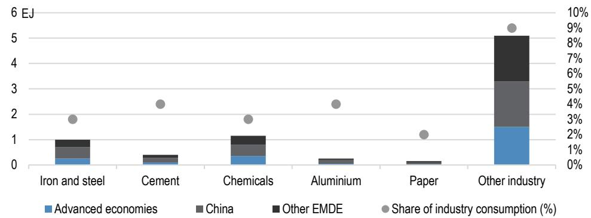

bar

| Industry          | Advanced economies | China | Other EMDE | Share of industry consumption (%) |
| ----------------- | ------------------- | ----- | ---------- | ---------------------------------- |
| Iron and steel    | 0.2                 | 0.4   | 0.6        | 2.0                                |
| Cement            | 0.1                 | 0.2   | 0.3        | 2.5                                |
| Chemicals         | 0.3                 | 0.5   | 0.7        | 1.8                                |
| Aluminium         | 0.1                 | 0.2   | 0.3        | 2.4                                |
| Paper             | 0.0                 | 0.1   | 0.1        | 1.2                                |
| Other industry    | 1.5                 | 2.0   | 2.5        | 9.0                                |

Source: IEA (2025), Energy and AI, IEA, Paris https://www.iea.org/reports/energy-and-ai, Licence: CC BY 4.0

- Heidelberg Materials (OW) integrates AI directly into its core margin expansion strategy by linking its Transformation Accelerator Initiative to financial metrics (€380 million saved in 2025), and scaling physical AI integrations like the Heidelberg Remote Optimization Center and autonomous haulage fleets. Heidelberg Materials adopted Carbon Re's technology in their kiln operations. By analysing a plant's manufacturing data, Carbon Re's cloud-based platform, Delta Zero, can recommend ways to cut emissions during production by dynamically optimising processes to achieve the lowest possible carbon dioxide output and fuel use. This has reportedly already led to significant improvements at their Mokra plant, including a 4.1% reduction in fuel costs and a 2% decrease in carbon emissions.   
- CRH (OW): While its \$250 million Venturing Fund successfully identifies high-potential technologies like AICrete and VODA.ai, the fragmented nature of its connected portfolio means AI deployments are highly specialized by vertical rather than generating unified, centralized margin expansion at the scale of its European peers. CRH has invested in AICrete – a company using AI to better predict recipe formulations for concrete and optimise the amount of cement used. Results from a pilot project indicate potential savings of 3.5% on material costs, and an average 5% reduction in carbon emissions.   
- Holcim (OW) displays the systemic deployment of the C3 AI suite across over 100 global plants and the rapid scaling of the OptiCEM formulation tool.

# Transport

AI applications in transport can improve efficiency and save costs, but they may also increase personal mobility demand. AI is used to manage traffic, optimise routes, predict maintenance needs, and develop autonomous vehicles. While autonomous vehicles operate more efficiently than conventional ones, they might attract people away from public transport as costs fall and availability increases, leading to rebound effects.

Widespread AI adoption across the transport sector could enhance vehicle operation and management, cutting energy consumption by up to 20% - equivalent to the energy used by 120 million cars; it also has applications in reducing contrails and improving electric vehicle ranges.

- Operational Optimisation: AI is being applied in various aspects of road transport, including route optimisation, predictive maintenance, and improved capacity utilisation. AI-enabled route optimisation leverages real-time data and algorithms to optimise routes, using GPS, traffic, weather, and historical data for improved operational sustainability. Studies suggest that AI-based route optimisation in road transport can reduce fuel consumption and emissions by around 2-15%. Predictive maintenance for freight fleets is another area where AI can help reduce energy use and costs by monitoring asset health, forecasting failures, and optimising maintenance.   
- Capacity Utilisation: AI can improve capacity utilisation in road freight by predicting demand, optimising loading, and suggesting routes to minimise empty space. AI-powered capacity utilisation solutions have the potential to cut around 5% of global road freight emissions. AI solutions can also reduce fuel demand by optimising truck schedules to minimise idle time.   
- Autonomous Vehicles: Autonomous vehicles (AVs) offer significant potential in the passenger car segment. AVs optimise fuel consumption through eco-driving algorithms, reduced idling, smarter routing, and predictive maintenance. Studies suggest that optimised AVs can cut fuel consumption by over 20% compared to

conventional cars. They can also boost occupancy rates through shared mobility, especially for commuting trips, potentially cutting urban car ownership by 20-40%.

- AI in Public Transport: AI is being implemented in public transport for smart scheduling, demand prediction, and better resource allocation, reducing unnecessary trips and potentially reducing fuel consumption by 12-20%. AI can improve public transport fleets with predictive maintenance, enhancing efficiency and vehicle lifespans.   
- AI in Aviation, Shipping, and Rail: In aviation, AI-driven flight route optimisation systems show the potential to reduce fuel consumption by 5-12% per flight. In shipping, AI-based navigation platforms with voyage optimisation tools can reduce fuel consumption by up to 10%. In rail, AI-based operation optimisation systems, including routing and predictive maintenance tools, can reduce rail energy demand by up to 20%.   
- Contrail Reduction: AI offers a scalable and cost-effective solution for reducing contrails, which may account for nearly $60\%$ of aviation's global warming effect. AI can predict when and where contrails are likely to form by analysing weather, satellite, and flight data, enabling airlines to optimise routes by redirecting aircraft to different altitudes.

Figure 21: The IEA 3% decrease in energy demand for cars by 2035   
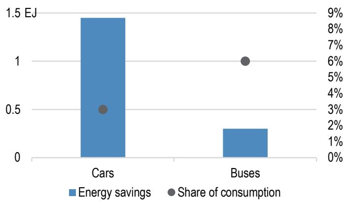

bar_line

| Category | Energy savings (EJ) | Share of consumption (%) |
| :--- | :--- | :--- |
| Cars | 1.45 | 3.0 |
| Buses | 0.28 | 6.0 |

Source: JPM,   
IEA (2025), Energy and AI, IEA, Paris https://www.iea.org/reports/energy-and-ai, Licence: CC BY 4.0

Figure 22: For non-road transport, aviation would see the largest decrease but rail the greatest % reduction   
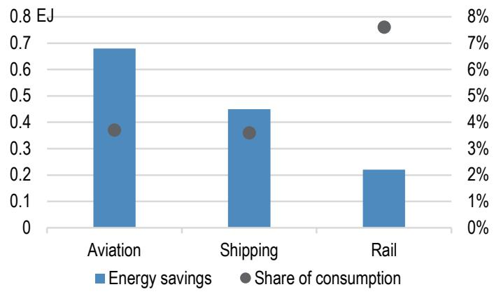

bar_line

| Category | Energy savings (EJ) | Share of consumption (%) |
| :--- | :--- | :--- |
| Aviation | 0.68 | 3.7 |
| Shipping | 0.45 | 3.6 |
| Rail | 0.22 | 7.6 |

Source: JPM,   
IEA (2025), Energy and AI, IEA, Paris https://www.iea.org/reports/energy-and-ai, Licence: CC BY 4.0

# Referenced Corporate Use-Cases:

- Alaska Airlines: Uses AI-driven flight route optimisation to avoid contrail-prone airspace and improve fuel efficiency; reported results include significant contrail reduction during trials at a modest fuel cost per flight, demonstrating a practical pathway to lower non- $\mathrm{CO}_{2}$ climate impacts and fuel use.   
- Carnival Corporation: Deploys AI-based energy optimisation across cruise operations; reported impact is about a 5% reduction in fleet fuel consumption through smarter propulsion and hotel-load management.   
- Deutsche Bahn (Germany): Implements AI-enabled eco-driving and operations optimisation for rail services; reported impact includes reductions in traction energy through speed profile adjustments and improved timetable adherence.

- KEPCO (Korea) – wind and weather prediction for grid-connected transport operations: Uses AI for wind-speed and weather forecasting that supports electric rail and network-coupled transport scheduling; reported impact is improved reliability and lower imbalance costs for systems that depend on variable renewables.   
- SNCF (France): Applies AI-enabled eco-driving and predictive analytics in rail operations; reported impact is traction-energy savings of roughly 10–15% and improved punctuality through better speed and dwell-time management.   
- VIA Rail (Canada): Uses AI-assisted eco-driving to optimise train speed profiles and braking; reported impact is energy consumption reductions in the range of 10–15% on equipped corridors.   
- Waymo (United States): Operates AI-based autonomous ride-hailing fleets; reported impact includes per-ride energy efficiency gains from smoother driving and routing, with the broader system impact contingent on managing induced demand and mode shift.   
- DHL/Greenplan: Employs an AI route-optimisation engine for last-mile and network operations; reported impact is up to 20% lower fuel use on optimised delivery routes, alongside reduced miles and improved on-time performance.   
- Walmart (United States): Applies AI-enabled predictive maintenance and fleet optimisation to trucking operations; reported impact includes 5–7% improvements in fuel efficiency and lower maintenance costs through condition-based interventions.   
- TuSimple (United States): Demonstrates AI-enabled autonomous trucking with optimised driving profiles; reported impact is a 10–20% reduction in fuel consumption on test runs, particularly at lower speeds.   
- Google (urban mobility tools): Provides AI-enabled eco-routing that guides drivers to lower-energy routes; reported impact is measurable fuel/energy savings at trip level, aggregated at city scale through high adoption.   
- European ports (5G-LOGINNOV pilots): Trials AI-supported truck platooning and port automation in living labs; reported impact is improved terminal throughput and lower fuel use through coordinated movements and reduced idling.

# Buildings

In buildings, AI-led optimisations have significant potential to enhance heating and cooling system efficiency and make electricity use more flexible. Barriers include fragmented building ownership, lack of digitalization, and inadequate incentives.

Scaling up existing AI-led interventions could lead to global electricity savings of around 300 TWh by 2035(5% of the total electricity consumption for heating and cooling), equivalent to the annual electricity generation of Australia and New Zealand combined. In buildings, the AI's potential is limited by the rate of digitalisation, but there are compelling illustrations of impact, such as on efficiency and demand response.

\- Energy Efficiency and Demand Response: AI is being used to optimise energy efficiency in buildings by managing heating, ventilation, and air conditioning (HVAC) systems, lighting, and other energy-consuming devices. AI algorithms can analyze data from sensors and smart meters to adjust energy use in real-time, reducing waste and improving efficiency. This can lead to significant energy savings and cost reductions for building operators and occupants.

- Smart Building Management: AI is enabling the development of smart building management systems that integrate various building functions, such as security, lighting, and climate control, into a single platform. These systems use AI to analyze data from connected devices and optimise building operations, improving comfort and reducing energy consumption.   
- Predictive Maintenance: AI is being used for predictive maintenance in buildings, allowing for the early detection of equipment failures and reducing downtime. By analyzing data from sensors and equipment, AI can predict when maintenance is needed, preventing costly repairs and extending the lifespan of building systems.   
- Occupant Comfort and Health: AI is being used to enhance occupant comfort and health by monitoring indoor air quality, temperature, and lighting conditions. AI algorithms can adjust building systems to maintain optimal conditions, improving the well-being of occupants and increasing productivity.   
- Integration with Renewable Energy: AI is facilitating the integration of renewable energy sources, such as solar panels and wind turbines, into building energy systems. AI can optimise the use of renewable energy by predicting energy production and adjusting consumption patterns accordingly, reducing reliance on grid electricity and lowering emissions.   
- Barriers to Adoption: The report highlights several barriers to the widespread adoption of AI in the buildings sector, including the slow rate of digitalization, fragmented ownership of buildings, and a lack of incentives for building owners to invest in AI technologies. Overcoming these barriers will require regulatory changes, incentives, and increased awareness of the benefits of AI in buildings.

Figure 23: AI could foster flexible demand capacity, with advanced economies best placed   
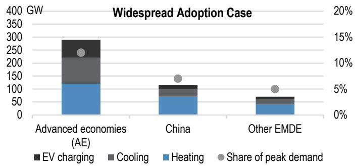

bar_stacked

Widespread Adoption Case
| Category | EV charging (GW) | Cooling (GW) | Heating (GW) | Share of peak demand (%) |
| :--- | :--- | :--- | :--- | :--- |
| Advanced economies (AE) | 120 | 90 | 120 | 13 |
| China | 15 | 20 | 70 | 6 |
| Other EMDE | 40 | 20 | 40 | 5 |

Source: IEA (2025), Energy and AI, IEA, Paris https://www.iea.org/reports/energy-and-ai, Licence: CC BY 4.0

Figure 24: Smarter buildings with flexible energy use and grid integration would drive up to 20% reduction   
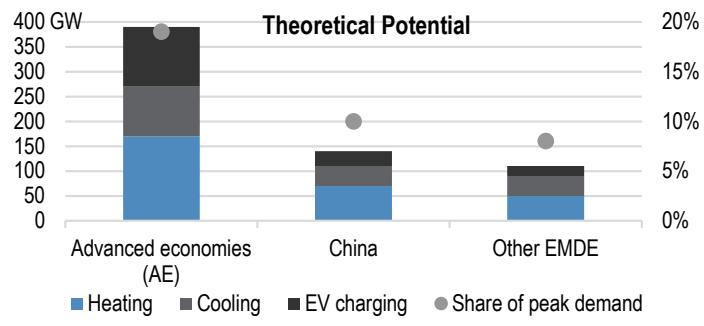

bar_stacked

Theoretical Potential
| Category | Heating (GW) | Cooling (GW) | EV charging (GW) | Share of peak demand (%) |
| :--- | :--- | :--- | :--- | :--- |
| Advanced economies (AE) | 170 | 85 | 95 | 20 |
| China | 70 | 40 | 35 | 10 |
| Other EMDE | 50 | 35 | 30 | 8 |

Source: IEA (2025), Energy and AI, IEA, Paris https://www.iea.org/reports/energy-and-ai, Licence: CC BY 4.0

Figure 25: Within buildings, the residential technical potential is non-negligible   
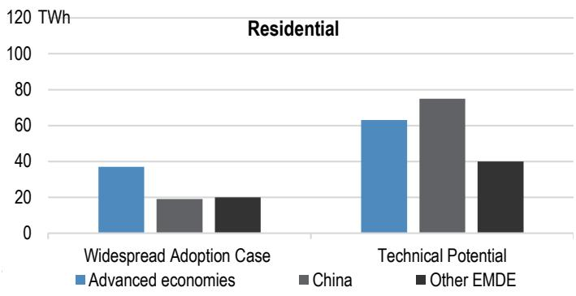

bar

Residential
| Scenario | Advanced economies (TWh) | China (TWh) | Other EMDE (TWh) |
| :--- | :--- | :--- | :--- |
| Widespread Adoption Case | 37 | 19 | 20 |
| Technical Potential | 63 | 75 | 40 |

Source: IEA (2025), Energy and AI, IEA, Paris https://www.iea.org/reports/energy-and-ai, Licence: CC BY 4.0

Figure 26: But non-residential will contribute most of the expected energy savings   
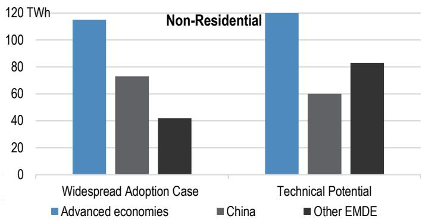

bar

Non-Residential
| Category | Advanced economies (TWh) | China (TWh) | Other EMDE (TWh) |
| :--- | :--- | :--- | :--- |
| Widespread Adoption Case | 115 | 73 | 42 |
| Technical Potential | 118 | 60 | 83 |

Source: IEA (2025), Energy and AI, IEA, Paris https://www.iea.org/reports/energy-and-ai, Licence: CC BY 4.0

# Corporate Use-Cases:

- Infosys (India): Deploys AI-powered building energy management across a large corporate campus (offices, hotel, data centre, food courts, parking), using thousands of sensors to create digital twins and optimise HVAC setpoints every 15 minutes; reported impact is about a 7% additional energy-efficiency gain on top of an already efficient baseline.   
- Siemens (Switzerland, Monte Rosa Hut): Implements AI-enhanced building controls in a high-altitude, off-grid facility with extreme conditions; reported impact is roughly a $30\%$ reduction in total building energy consumption by learning the building's thermodynamics and dynamically optimising operations.   
- City of Stockholm & Stockholm Exergi (Sweden): Integrates data-centre waste-heat recovery with district heating and AI-supported network operations; reported impact is meeting around 1.5% of system heat demand from recovered data-centre heat and cutting about 50 g CO $_{2}$ per kWh of supplied heat, demonstrating a scalable building-sector decarbonisation pathway.   
- Voltalis (France): Provides AI-controlled smart switches and gateways for residential electric heating loads to deliver aggregated flexibility; reported impact includes lower consumer bills and provision of demand response services that reduce peak loads and support the grid.   
- Equinix (Global): Uses AI-enabled monitoring and controls in data-centre buildings to optimise cooling and track PUE/WUE; reported impact is lower energy and water use through adaptive cooling strategies and continuous optimisation in large-scale facilities.   
- Schneider Electric (Sweden schools portfolio): Applies AI-led optimisation to HVAC across a network of more than 600 school buildings using \~10 000 sensors and external data (weather, tariffs, social data), with a digital-twin approach; reported impact is around 10% electricity savings from improved scheduling and setpoint control.   
- Industrial Analytics (Singapore, technology manufacturer HQ): Optimises an existing BMS using AI without new hardware, by training on historical data to re-tune cooling; reported impact is approximately 23% reduction in cooling energy for a 27 000 m $^{2}$ headquarters building.   
- Google (Global campuses): Implements AI-assisted building and energy

management (including eco-settings and flexibility services) across large corporate sites; reported impact is reduced electricity consumption, improved flexibility, and better alignment with low-emissions power on an hourly basis.

- Microsoft (Global campuses and data centres): Leverages AI for forecasting and energy optimisation in buildings and data centres (aligned with hourly carbon-free energy goals); reported impact includes reduced curtailment exposure, improved operational efficiency, and lower building energy use via smarter controls.   
- ABB & Heidelberg Materials with alcemy (Czechia): Uses AI for cement-plant process optimisation that also benefits on-site building services (e.g., heat recovery and HVAC integration), reporting \~2–5% energy savings and more stable operations that reduce overall facility energy intensity.

# Will AI Boost Energy Innovation?

# AI can accelerate solutions to energy innovation challenges

According to the IEA, the energy system's evolution over the past fifteen years shows what innovation can deliver: Since 2010, unconventional oil and gas went from $10\%$ to $25\%$ of global supply, annual electricity from solar photovoltaics has expanded from $\sim 30$ TWh to $\sim 2000$ TWh; and electric vehicles have grown from a negligible share to more than $20\%$ of global car sales. These gains have been driven by steep cost declines and persistent performance improvements.

The pace of innovation remains the principal constraint: across multiple energy technologies, the journey from invention to first commercialisation has typically exceeded three decades, with another two decades to reach mass-market adoption. Artificial neural networks themselves took on the order of 35 years from prototype to first commercial use, underscoring why compressing timelines is critical for climate and energy-security goals. Yet gaps remain and timelines are long.

Figure 27: Innovation timelines for energy technologies and artificial neural networks   
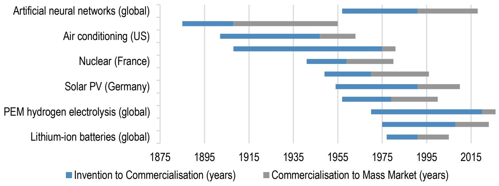

bar_stacked

| Category | Invention to Commercialisation (years) | Commercialisation to Mass Market (years) |
| --- | --- | --- |
| Artificial neural networks (global) | 1940 | 75 |
| Air conditioning (US) | 1930 | 40 |
| Nuclear (France) | 1920 | 25 |
| Solar PV (Germany) | 1910 | 60 |
| PEM hydrogen electrolysis (global) | 1980 | 20 |
| Lithium-ion batteries (global) | 1930 | 30 |

Source: IEA (2025), Energy and AI, IEA, Paris https://www.iea.org/reports/energy-and-ai, Licence: CC BY 4.0

# State of play: patents, start-ups, and the “under-the-radar” gap

- Only about one percent of energy-related patents explicitly reference AI, and roughly two percent of energy start-ups claim an AI value proposition, far below the shares in life sciences and agriculture. High capital intensity, long asset lifetimes, and strict safety and reliability requirements help explain why energy has attracted a smaller share of AI-oriented venture investment than digital industries.   
- Many energy companies are already deploying AI to optimise existing assets—such as grid forecasting, predictive maintenance, and battery analytics—without labelling themselves as “AI companies.” As a result, headline statistics likely understate the sector’s real adoption of AI.

Figure 28: The energy sector has not seen the rapid increase in AI-led innovation seen in medical devices and other sectors   
Share of AI in patents by sector (%)   
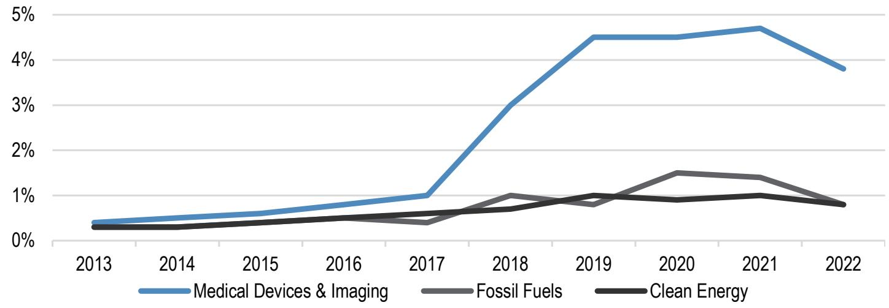

line

| Year | Medical Devices & Imaging | Fossil Fuels | Clean Energy |
|------|---------------------------|--------------|--------------|
| 2013 | 0.4%                      | 0.3%         | 0.3%         |
| 2014 | 0.5%                      | 0.3%         | 0.3%         |
| 2015 | 0.6%                      | 0.4%         | 0.4%         |
| 2016 | 0.8%                      | 0.5%         | 0.5%         |
| 2017 | 1.0%                      | 0.4%         | 0.6%         |
| 2018 | 3.0%                      | 1.0%         | 0.7%         |
| 2019 | 4.5%                      | 0.8%         | 1.0%         |
| 2020 | 4.5%                      | 1.5%         | 0.9%         |
| 2021 | 4.7%                      | 1.4%         | 1.0%         |
| 2022 | 3.8%                      | 0.8%         | 0.8%         |

Source: IEA (2025), Energy and AI, IEA, Paris https://www.iea.org/reports/energy-and-ai, Licence: CC BY 4.0

# Why AI can help—and limits from AlphaFold's lesson

- There is much discussion around the potential for AI to boost innovation. The 2024 Nobel Prize in Chemistry was awarded to David Baker, Demis Hassabis and John Jumper. The two latter, Google Deepmind researchers, contributed to the development of AlphaFold2, an AI model designed to solve a 50-year-old problem: predicting proteins' complex structures.   
- AI can accelerate discovery—when the data exist: AlphaFold's 45 000-fold speedup in mapping protein structures was enabled by the Protein Data Bank's high-quality, 50-years-in-the-making dataset, but still required experimental validation before deployment—reminding us AI needs large, validated data and human oversight to translate breakthroughs into products.   
- Energy is different: Many energy bottlenecks lie in integrating materials into complex products and systems (e.g., batteries, device design) and then into supply chains and regulatory environments. AI's success in biomedicine must be applied with care: multi-scale engineering, certification, and supply-chain readiness dominate outcomes after discovery.

# Where AI helps across the innovation pipeline

AI is making materials discovery dramatically faster by predicting promising candidates, automating experiments, and mining published knowledge — but realizing this potential at scale will require significant investment in shared tools, good data, and smart experimental strategy.

Figure 29: AI-led search in large solution spaces can meaningfully speed up research   
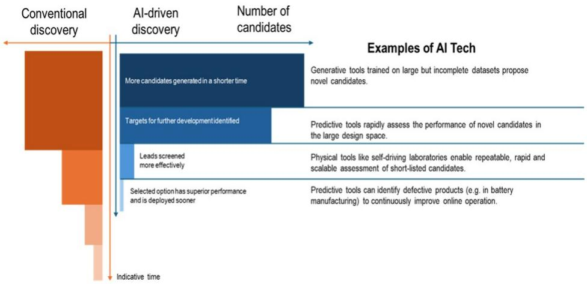

flowchart

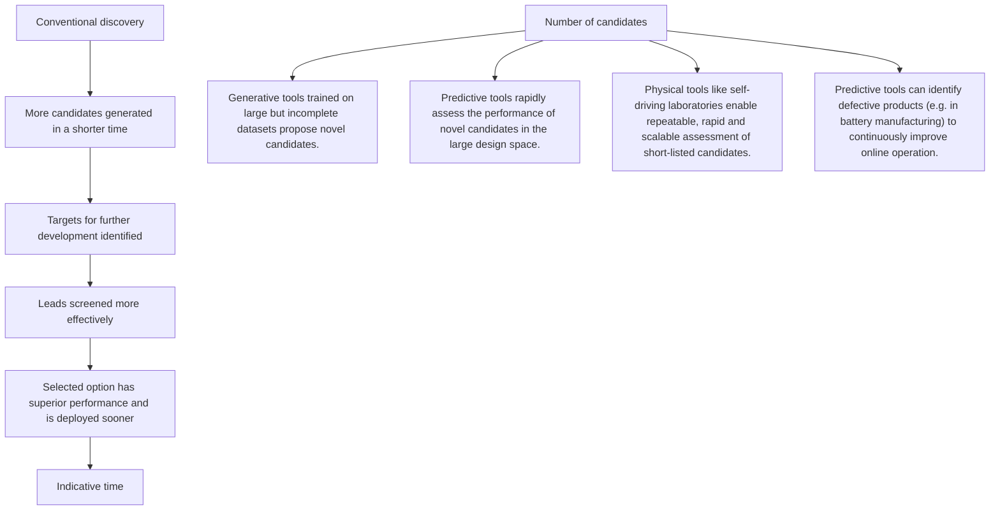
```mermaid
graph TD
    A["Conventional discovery"] --> B["More candidates generated in a shorter time"]
    B --> C["Targets for further development identified"]
    C --> D["Leads screened more effectively"]
    D --> E["Selected option has superior performance and is deployed sooner"]
    E --> F["Indicative time"]
    G["Number of candidates"] --> H["Generative tools trained on large but incomplete datasets propose novel candidates."]
    G --> I["Predictive tools rapidly assess the performance of novel candidates in the large design space."]
    G --> J["Physical tools like self-driving laboratories enable repeatable, rapid and scalable assessment of short-listed candidates."]
    G --> K["Predictive tools can identify defective products (e.g. in battery manufacturing) to continuously improve online operation."]
```

Source: JPM based on IEA (2025), Energy and AI, IEA, Paris https://www.iea.org/reports/energy-and-ai, Licence: CC BY 4.0

# Not all energy technology areas will be similarly accelerated by AI

AI will not accelerate all energy technologies equally. It delivers the highest impact where four conditions align:

- High-complexity design spaces with many well-described candidates: Problems like catalyst design (and analogously pharmaceuticals) involve vast combinations that are impractical to explore by trial-and-error but are well-suited to AI search and ranking when training data are available.   
- Strong, structured datasets: Machine learning can screen families such as perovskites for solar PV, but model reliability is limited today because only about a thousand of more than ten million possible perovskite structures have been synthesized and measured, constraining high-quality, real-world training data.   
- Straightforward testing and verification: AI candidates perform best where lab validation is standardized and low-variance (for example, reverse-osmosis membranes tested with standard seawater), while areas like plastics recycling are harder because heterogeneous feedstocks make pre-deployment replication and verification difficult.   
- Receptive markets with “drop-in” pathways: AI yields faster real-world impact where products can be adopted without regulatory changes, behaviour shifts, or major adjacent-asset build-outs—whereas challenges that require new infrastructure or market rules will scale more slowly even if AI speeds discovery and prototyping.

Figure 30: Potential for AI to accelerate progress against selected key energy technology challenges 

<table><tr><td>Technology Challenge</td><td>Solution Space Complexity</td><td>Structured Data Availability</td><td>Pre-deployment Verification</td><td>Integration and Scaling</td></tr><tr><td>Synthetic fuels - Catalysts with high efficiency, selectivity and stability</td><td></td><td></td><td></td><td></td></tr><tr><td>Hydrogen electrolysis - Low-cost, highly efficient and durable electrolyser catalysts</td><td></td><td></td><td></td><td></td></tr><tr><td>Carbon capture, utilisation and storage - Stable CO2 capture materials with high affinity and low energy penalty</td><td></td><td></td><td></td><td></td></tr><tr><td>Electric vehicles - Novel battery chemistries using cheap materials (e.g. sodium-ion, solid-state)</td><td></td><td></td><td></td><td></td></tr><tr><td>High-temperature heat storage - Stable phase change materials with high conductivity and latent heat</td><td></td><td></td><td></td><td></td></tr><tr><td>Desalination - Productive, stable and energy efficient reverse osmosis membranes</td><td></td><td></td><td></td><td></td></tr><tr><td>Advanced biofuels - Improved performance of enzymes and yeasts for 2nd/3rd generation biofuels</td><td></td><td></td><td></td><td></td></tr><tr><td>Solar photovoltaics - Efficient, stable, scalable perovskite cells without critical mineral inputs</td><td></td><td></td><td></td><td></td></tr><tr><td>High-temperature heat pumps - Identification of working fluids which phase change at high temperatures</td><td></td><td></td><td></td><td></td></tr><tr><td>Long-duration energy storage - Cheaper, efficient redox-flow or other long-duration batteries</td><td></td><td></td><td></td><td></td></tr><tr><td>Decarbonised cement - Cement production from calcium silicate raw materials</td><td></td><td></td><td></td><td></td></tr><tr><td>Plastics recycling - Energy-efficient upgrading of pyrolysis oils</td><td></td><td></td><td></td><td></td></tr><tr><td>Effective nuclear fusion - Fusion reaction control</td><td></td><td></td><td></td><td></td></tr></table>

Source: IEA (2025), Energy and AI, IEA, Paris https://www.iea.org/reports/energy-and-ai, Licence: CC BY 4.0, Green : high; yellow : medium ; red : low

# Four Areas of AI Innovation: Batteries, Catalysts for synthetic fuels, Carbon Capture Materials and Cement

- Batteries: AI can accelerate discovery for electrolytes, cathodes, and solid-state materials, speed multi-scale modelling from atomistic to cell level, and improve factory operations through defect detection and process analytics. It can also enhance battery management systems and life-cycle prediction, enabling safer, longer-lived packs. However, industrial qualification and supply-chain build-out remain the primary bottlenecks to time-to-market.   
- Catalysts for synthetic fuels: Predictive models trained on physics-based data can screen catalytic candidates hundreds to thousands of times faster than traditional approaches, and generative models can propose new materials. Open datasets for catalysis enable rapid triage. However, commercial viability hinges on carbon and capital costs; therefore, policy—such as carbon pricing and sustainable-fuel mandates—ultimately determines scale.   
- CO $_{2}$ capture materials: Models can navigate complex solvent and sorbent chemistries, propose metal-organic frameworks for direct air capture, and reduce dependence on expensive process simulations. Generative workflows can create large libraries of candidates for rapid evaluation. Yet infrastructure and regulatory constraints dominate the pace of real-world adoption.   
- Cement: AI can moderately accelerate early-stage innovation and blend optimisation, but it will only have a limited impact on the slow scaling dynamics of such a large, conservative market without long-term capital and standards reform.

Overall, AI will foster cheaper development and/or production of innovative solutions i.e. Greater efficiency is the main expected outcome of AI-led innovation.

# Will AI have a net positive energy & climate footprint?

# Up to 3% energy reduction by 2035 according to the IEA

As discussed in the previous section, in its 2025 Energy & AI report, the IEA compares the emissions of datacentres to the expected carbon emissions reductions of existing AI use-cases in high emitting sectors in 2035, and finds a material positive climate contribution of AI. AI-enabled optimisation of production processes could reduce energy costs by 3–10% in energy-intensive industries (steel, aluminium, chemicals, cement), where energy is a critical production input. In parallel, well-documented AI use cases could save over 13 EJ of energy by 2035, equivalent to 3% of global final energy consumption.

# The IEA's Widespread Adoption Case

The IEA Energy & AI report introduces a “Widespread Adoption Case” to estimate sector-level impacts of AI in energy by 2035 because system-wide benefits like cost cuts, reliability, and resilience are hard to quantify beyond individual case studies. It focuses only on AI uses already demonstrated in the real world and assumes they can be scaled across the sector.

- Key assumptions: (1) only existing, case-proven AI interventions are included; (2) sector-wide barriers such as limited data and poor interoperability are assumed to be largely overcome; (3) full theoretical potential is not modeled—structural constraints (e.g., uneven digital infrastructure by region) limit complete adoption.   
- It is an ambitious, but not guaranteed, pathway: without regulatory changes and incentives, persistent barriers like data access, digital infrastructure, and skills shortages could block widespread adoption.   
- Scope limits: rebound effects are explicitly excluded, and speculative or futuristic AI applications are not considered due to unknown impacts.

Figure 31: The IEA argues that AI-led emissions savings could exceed data centers' emissions; although rebound effects are unknown   
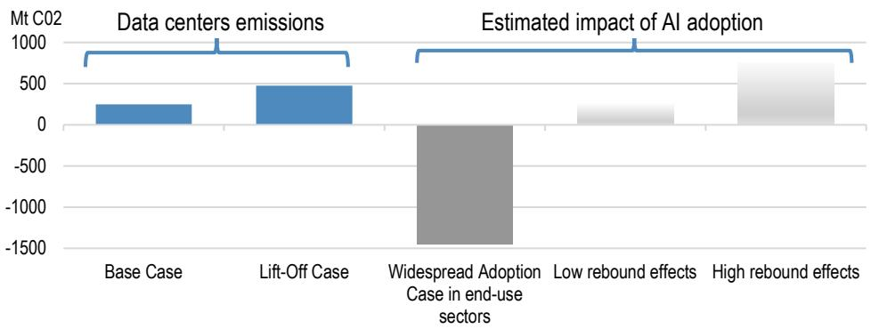

bar

| Category | Data centers emissions (Mt CO2) | Estimated impact of AI adoption (Mt CO2) |
|---|---|---|
| Base Case | 250 | 800 |
| Lift-Off Case | 450 | 800 |
| Widespread Adoption Case in end-use sectors | -1400 | 800 |
| Low rebound effects | 200 | 800 |
| High rebound effects | 700 | 800 |

Source: IEA (2025), Energy and AI, IEA, Paris https://www.iea.org/reports/energy-and-ai, Licence: CC BY 4.0

We highlight that:

- The IEA explicitly states that despite focusing only on existing use cases, the emissions reductions are not on track to materialize without regulatory and other interventions. One could argue that many more use-cases will appear in the decade to 2035, however their effective implementation will depend on economic, technical and policy factors.   
- The analysis does not account for rebound effects. Jevons Paradox is a big question mark in this context, with the recent evolutions of AI models showing “unprecedented” improvements in energy efficiency, but use cases and consumption massively increasing associated energy demand.

# 36% closer to alignment: Green and Intelligent

Another paper, published in Nature by Nicholas Stern, models how AI can accelerate emissions reductions by 2035 in three sectors—Power, Meat & Dairy, and Light Road Vehicles—by speeding adoption of low-carbon solutions and improving their efficiency. The three sectors together account for roughly half of global emissions. The report focuses on three impact pathways: transforming complex systems, innovating discovery and resource efficiency, and nudging behaviour.

Together, the three sectors are estimated to potentially drive 3.2–5.4 GtCO $_{2}$ e emissions reductions annually by 2035 compared to a BAU scenario based on the IEA announced climate pledges. This would mean moving 36% closer to alignment with an ambitious emissions reduction trajectory versus BAU by 2035, and largely dismiss the emissions associated with data centres.

Table 2: AI key impact areas to accelerate the climate transition 

<table><tr><td>1. Transforming complex systems</td><td>2. Innovating technology discovery and resource efficiency</td><td>3. Nudging and behavioural change</td><td>4. Modelling climate systems and policy interventions</td><td>5. Managing adaptation and resilience</td></tr><tr><td>Integrated management of energy systems, multimodal transport, and the urban ecosystem</td><td>Acceleration of scientific discovery and incubation of green tech innovation at scale</td><td>Modelling of social behaviour, pattern analysis, and prediction</td><td>Forecasting of extreme weather and climate change scenarios</td><td>Forecasting of climate impacts and early warning systems</td></tr><tr><td>Simulations of inter-systemic flows and cross-system interaction through AI-powered digital twins</td><td>Generation of sustainable design options</td><td>Facilitation of pro-environmental behaviour through advanced data analytics and AI-powered assistants</td><td>Modelling the effects of climate change and the effectiveness of different policy scenarios</td><td>Management of financial and human climate risk and impact towards more resilient systems</td></tr><tr><td>Prediction of investment risks in low-carbon projects</td><td>Maximisation of asset use and efficiency over lifetime</td><td></td><td></td><td>Strategic planning on climate adaptation</td></tr></table>

Source: Stern et al.

\- Power (electricity generation and grids): better forecasting of supply and demand, and optimised management of distributed energy resources to integrate solar PV and wind more efficiently into grids, including raising load factors and stabilizing intermittency with advanced control and prediction. AI's impact on adoption rates of solar and wind is modeled as minimal because affordability and attractiveness are already strong; the bulk of gains come from efficiency/operational improvements rather than shifting the S-curve of adoption. By 2035, the paper expects emissions reductions of about 1.8 GtCO2e per year from higher renewable load factors and grid optimisation (about 12% of the sector's 15.3 GtCO2e emissions in 2023).

\- Food, specifically meat and dairy (including alternative proteins): Accelerate the discovery and commercialization of alternative proteins (APs) with better taste/ texture and potentially lower costs, plus behavioural nudges to increase AP uptake. AI enhances attractiveness through protein design and may improve affordability under more ambitious assumptions, shifting the technology adoption S-curve for APs from niche toward mass-market faster by improving enabling conditions (affordability, attractiveness, accessibility) that drive adoption in the authors' S-curve model framework. The authors model that by 2035, AP market share rises from \~8–14% in BAU to 18–33% in an ambitious AI case, and to 27–50% in a

highly ambitious AI case where AI also achieves broad cost parity, materially increasing displacement of traditional meat and dairy. By 2035, emissions reductions would reach 0.9–1.6 GtCO2e in the ambitious AI case and 1.7–3.0 GtCO2e in the highly ambitious AI case, driven predominantly by higher AP adoption rather than efficiency-of-production add-ons. This represents between 18% and 34% of the sector's 8.7 GtCO2e emissions in 2023.

\- Mobility, specifically light road vehicles (including EVs and shared mobility): The authors model that 1/ AI-enhanced shared mobility increase vehicle utilization and reduce total passenger-kilometers driven; 2/ Higher EV adoption via cheaper battery compositions and optimised charging infrastructure thanks to AI. This would lead to a cut of 0.4 GtCO2e in annual reductions from shared-mobility efficiency plus 0.2 GtCO2e from higher EV adoption, totaling 0.5–0.6 GtCO2e per year for the sector by 2035. This represents between 15.6% and 18.8% of the sector's 3.2 GtCO2e emissions in 2023.

Figure 32: Total emissions and emissions savings from AI in 2035 for the sectors in scope   
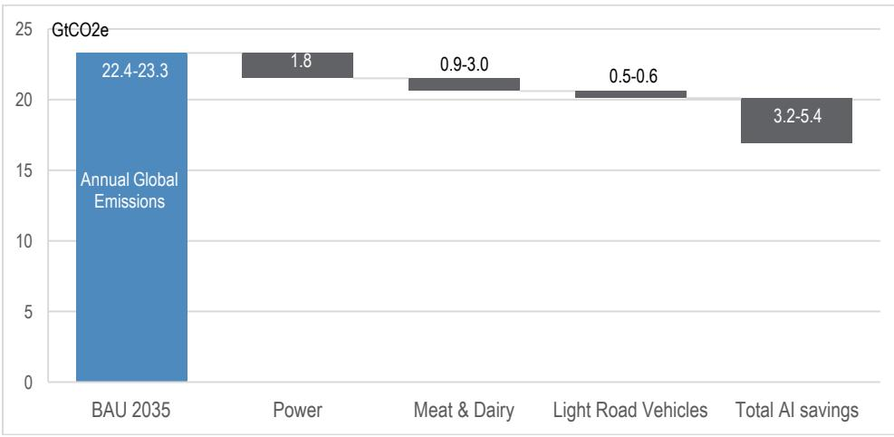

bar

GtCO2e
| Category | Value |
| :--- | :--- |
| BAU 2035 Annual Global Emissions | 22.4-23.3 |
| Power | 1.8 |
| Meat & Dairy | 0.9-3.0 |
| Light Road Vehicles | 0.5-0.6 |
| Total AI savings | 3.2-5.4 |

Source: Stern et al

Together, the three sectors are estimated to potentially drive 3.2–5.4 GtCO $_{2}$ e emissions reductions annually by 2035 compared to a BAU scenario based on the IEA announced climate pledges. This would mean moving 36% closer to alignment with an ambitious emissions reduction trajectory versus BAU by 2035, and largely dismiss the emissions associated with data centres.

While we find the approach interesting; we note that most of the examples are derived from traditional AI, following the criticisms detailed in the next section.

We also note that the report compares the contribution to a BAU scenario, which - to our understanding - does not account for policy targets (EV subsidies; alternative proteins support).

# Generative and Traditional AI Are Not The Same

In March 2026, we hosted Ketan Joshi, author of “The AI Climate Hoax: Behind the Curtain of How Big Tech Greenwashes Impacts”. The report distinguishes

“generative AI” from “Traditional AI”: It leverages Schneider Electric analysis showing that generative AI consumes between six and fourteen times more energy than traditional AI across scenarios, anchoring the argument that most claimed benefits (traditional AI) are separable from the harms (consumer generative AI) and should not be rhetorically coupled to justify data centre growth.

However, we flag that while the argument remains valid, the “unprecedented” energy efficiency developments highlighted by the IEA suggest that the efficiency gap may not remain so evident in the long-run as dedicated software and hardware improvements are delivered.

Figure 33: GenAI is significantly more energy intensive than “traditional” AI   
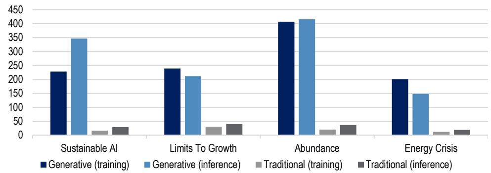

bar

| Category | Generative (training) | Generative (inference) | Traditional (training) | Traditional (inference) |
| :--- | :--- | :--- | :--- | :--- |
| Sustainable AI | 225 | 345 | 10 | 25 |
| Limits To Growth | 235 | 210 | 30 | 35 |
| Abundance | 405 | 410 | 15 | 35 |
| Energy Crisis | 200 | 145 | 8 | 15 |

Source: Schneider Electric

Out of 154 climate-benefit claims, it shows that 150 (97%) relate to traditional AI (predictive, computer vision, physical, narrow generative), and only 4 (3%) relate to consumer generative systems (public chatbots and similar). Crucially, the analysis finds no verifiable, substantial emissions reductions attributable to generative AI systems such as ChatGPT, Gemini, or Copilot. The small set of consumer-generative claims comes from a 2023 Microsoft playbook and consists mostly of qualitative assertions rather than quantified, audited reductions. This overwhelming tilt in claims, according to the authors, highlights that touted climate benefits arise in technological domains that are effectively different from those driving today's compute expansion and energy impacts.

The report goes further, by showing that only 26% of the claims cite published academic papers; 36% provide no evidence whatsoever. The remainder draw on corporate sources (reports or websites), media, NGOs, or unpublished academic work. The report details weak referencing in prominent institutional studies—for example, claims of fleet fuel savings attributed to AI that trace back to non-authoritative websites lacking primary data or identifiable authorship.

The case for “dedicated” and more efficient AI algorithms is strong due to their documented contribution to energy efficiency and own greater energy efficiency. Whenever possible, these solutions should be preferred to “generalists” models in terms of energy efficiency. However, while Joshi addresses the economic logic going against sustainability considerations, the spill-overs of AI technology development to scientific and sustainability considerations as yet to be fully considered, in our view.

Figure 34: Almost all documented AI energy and climate use-cases are linked to “traditional AI”   
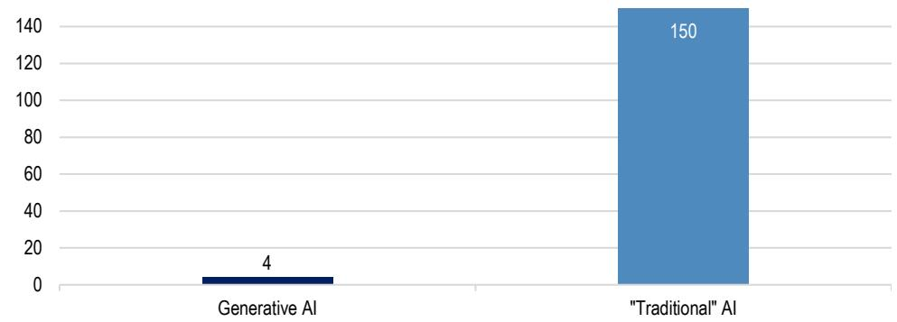

bar

| Category | Value |
|---|---|
| Generative AI | 4 |
| "Traditional" AI | 150 |

Source: JPM based on The AI Climate Hoax: Behind the Curtain of How Big Tech Greenwashes Impacts

# AI Is Not a Climate “Silver Bullet”: Contrails as an example

Aviation is a significant contributor to climate change, responsible for approximately 3.5% of human-driven warming when both CO2 emissions and non-CO2 effects are considered. While much attention focuses on carbon emissions from jet fuel, contrails—the condensation trails that form ice crystals behind aircraft—account for roughly 2% of the world's effective radiative forcing (the net change in energy flow at the top of the atmosphere that drives surface warming) and represent about half of aviation's total warming impact. Unlike CO2, which persists for centuries, contrails have a short-lived but intense warming effect, trapping outgoing heat for hours to days.

Just 3% of flights generate 80% of contrail warming, making targeted avoidance a potentially transformative and cost-effective climate solution. Using AI and satellite forecasting, planes can take minor detours—typically adding only 1% to fuel use and flight time—to avoid atmospheric conditions that create warming contrails, at an estimated cost of just a few dollars per tonne of CO2-equivalent avoided, hundreds of times cheaper than sustainable aviation fuels.

Building on this promise, Google and American Airlines conducted a large-scale trial to test whether contrail avoidance could work within standard airline operations. As described in their study "Efficacy of Scalable Airline-led Contrail Avoidance" by Sankar et al., the trial involved approximately 2,400 eastbound transatlantic flights. Google's AI contrail forecasts were integrated directly into the airline's flight planning software.

The results revealed both the technology's effectiveness and the operational challenges of implementation. Flights that successfully followed the contrail-avoidance plans achieved a 62% reduction in contrail formation rate compared to the control group with no statistically significant difference in fuel usage. However, across all 1,232 eligible flights, the overall reduction was only 11.6% because dispatchers selected avoidance routes only 15% of the time, and pilots successfully executed them in just 60% of those cases.

The low adoption stemmed from operational barriers rather than technical limitations. Dispatchers, working under time pressure, often defaulted to familiar routes and received only top-down map views without vertical profiles showing why altitude adjustments were necessary. Pilots similarly lacked complete information about non-

standard routes, leading to deviations. The voluntary nature of participation, with no mandates or incentives, also contributed to low uptake. However, the authors emphasize these barriers are surmountable through better user interfaces with vertical route profiles, making contrail-optimised routes the default option, and introducing regulatory requirements or financial incentives.

The study demonstrates that technological solutions are not sufficient, but need to be implemented in the right operational, financial and regulatory environment in order to deliver on their promise. We believe the study is a powerful illustration of both the material potential climate benefits of AI, but also of the need to think about system-change, including technological, but also operational, financial and regulatory solutions to complex problems.

Figure 35: Despite markedly positive climate benefits, a limited share of flights included in the study pursued contrails-avoided plans   
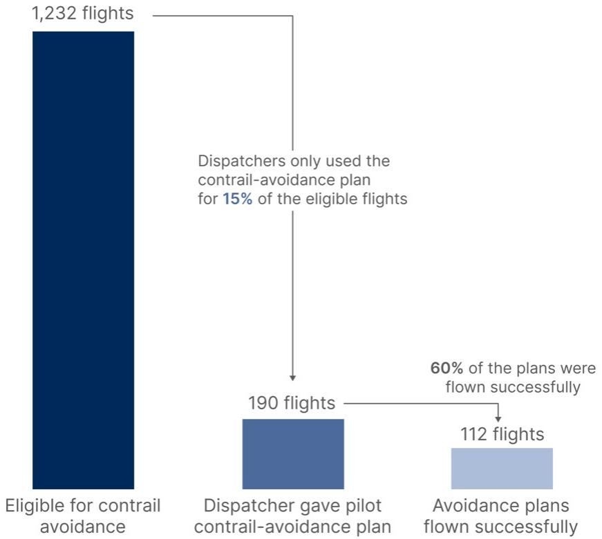

bar

| Category | Count (Number) |
| :--- | :--- |
| Eligible for contrail avoidance | 1,232 |
| Dispatchers only used the contrail-avoidance plan for 15% of the eligible flights | 190 |
| Avoidance plans flown successfully | 112 |
60% of the plans were flown successfully

Source: https://hannahritchie.substack.com/p/contrails-google-ai

# Will AI Negatively Impact Affordability Through Higher Electricity Prices?

The IEA stops short of a clear-cut answer. Whether data centre growth pressures electricity prices hinges on the interaction of four variables: the speed at which new demand arrives, the location of that load, the state of the local power system, and the market and regulatory architecture that governs cost allocation.

Notably, the IEA's empirical work finds no systematic relationship between load growth and retail price changes across major markets between 2019 and 2024. In the EU, prices rose even as demand stagnated; in the US, states with greater load growth did not generally see larger price increases. National averages can, however, mask localised effects in clusters with concentrated load growth.

The more useful question is therefore not "are data centres raising prices?" but "which jurisdictions are building the institutions to prevent data centre growth from raising consumer prices?"

# Short-Term Impacts (0–3 Years): Pressure Concentrated in Constrained Markets

In the near term, the binding constraint is physical: existing generation, transmission, and interconnection capacity cannot expand on the same timeline as hyperscale data centres, which can be sited and energised in one to two years versus the much longer cycles required for major transmission and dispatchable generation. Several mechanisms can drive upward price pressure where this gap is acute.

Wholesale market tightening in constrained nodes. Rapid growth in large, inflexible loads can increase reliance on higher-cost generation that would otherwise run less frequently, putting upward pressure on wholesale prices. In PJM (the regional transmission organisation operating the high-voltage grid and wholesale electricity and capacity markets across 13 US states and DC, including Virginia's "Data Centre Alley"), the most recent capacity auctions — forward markets in which generators are paid to be available years in advance — cleared at the regulatory price cap in successive rounds. The independent market monitor cited projected large data centre load additions as a key contributing factor, alongside long interconnection queues and resource-accreditation changes that lowered capacity credits for parts of the gas fleet.

Transmission congestion in clustered geographies. When generation is abundant in one area but cannot reach load due to constrained transmission lines, prices diverge between zones and delivered costs rise in load pockets. Where data centres concentrate in specific locations (e.g., Northern Virginia, Dublin), they can amplify this congestion and may prompt short-term procurement of emergency reserve generation to maintain adequacy.

Counter-evidence from ERCOT. Importantly, this short-term pressure is not universal. Despite Texas being a major data centre hotspot, forward prices (the prices agreed today for power delivered at a future date, which reflect market expectations on supply-demand balance) on ERCOT's North Hub are relatively flat through 2030. ERCOT — the Electric Reliability Council of Texas, the grid operator covering most of the state — is unusual in being an "energy-only" market with no capacity market, meaning scarcity pricing during tight conditions is the sole signal for new investment. The flat curve suggests market participants currently anticipate sufficient supply, driven by rapid solar, wind, and battery storage additions, to meet rising demand without sustained price pressure. Some announced data centre demand may also fail to materialise, as interconnection queues for large loads tend to overstate ultimate load.

Systems with spare capacity can benefit. In systems with more relaxed demand-supply balances, additional load can actually improve asset utilisation and spread fixed costs over a larger customer base, in some cases exerting downward pressure on per-unit system costs.

Figure 36: There is no obvious correlation between increases in local electricity demand and price Electricity demand and price change (%)   
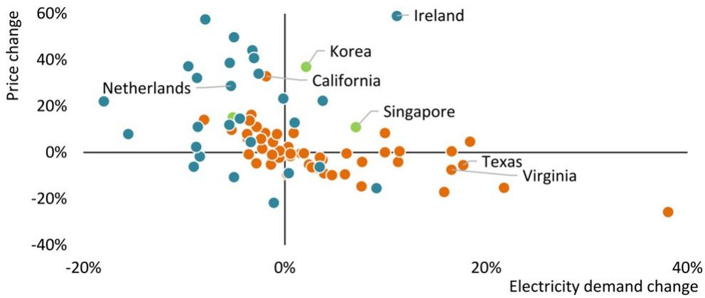  
Source: IEA (2026), Key Questions on Energy and AI, IEA, Paris https://www.iea.org/reports/key-questions-on-energy-and-ai, Licence: CC BY 4.0

# Long-Term Impacts: Outcomes Diverge by Policy Path

Over longer horizons, the price trajectory depends on whether the system anticipated the load and whether cost-causation principles were enforced. The IEA frames this as a question of whether data centres raise or lower the system load factor — the ratio of average to peak demand across the whole power system, where higher values mean fixed infrastructure costs are spread over more kilowatt-hours, lowering per-unit costs.

Data centres typically have high load factors of 75–90% (the ratio of their average load to peak load), meaning they draw close to their peak almost continuously — unlike spikier residential demand. In theory, this supports efficient capital utilisation. However, they often have lower nameplate capacity utilisation (the ratio of average load to contracted/installed grid capacity), because computing equipment is installed progressively and operators tend to over-contract grid capacity. This can lead to oversized networks and reduced capital efficiency.

\- Path A — Anticipated, integrated growth (neutral to downward pressure). Where transmission planning, interconnection processes, and siting are coordinated, data centre demand can anchor new low-cost supply. Co-location requirements (as in Ireland, where new large loads are increasingly required to colocate with generation) ensure demand growth is matched by supply and reduce transmission costs. Operational flexibility — shifting non-urgent workloads, reallocating compute across locations, modulating cooling, or using onsite storage — can further reduce system stress. The IEA estimates that if data centre demand is flexible for just 0.1–1% of hours per year, current systems could integrate all projected new capacity through 2035.

\- Path B — Reactive growth in constrained systems (sustained upward pressure). Where interconnection queues remain backlogged, permitting is slow, and tariffs do not isolate cost causation, short-term pressures become structural. Singapore's temporary cap on new connections illustrates the regulatory endpoint when constraints become binding.

A critical concern cuts across both paths: co-location agreements, onsite generation, or direct supply contracts can shift costs to other consumers — for example, if a data centre diverts output from an existing plant, or if reduced grid draw raises per-unit infrastructure costs for everyone else.

# Three Levers That Determine Which Path Dominates

According to the IEA, three policy and planning choices determine which path dominates.

- 1. Cost allocation and tariff design. Globally, large new loads are mostly integrated into existing grid tariff frameworks, but data centre-specific rate classes are emerging. Virginia has approved a new rate class effective January 2027 for loads over 25 MW with load factors above 75%, including minimum demand charges, exit fees, and long-term commitment requirements. Hydro-Québec is proposing a rate for data centres above 5 MW at roughly double what large consumers currently pay. Major US technology companies have also signed a voluntary pledge with the federal government to cover network upgrade costs or procure additional generation capacity.   
- 2. Pace of generation and transmission build-out. Expanding supply and grid infrastructure is the most direct mitigant — accelerating new generation, colocation, capacity remuneration mechanisms, and rapidly deployable options like solar+storage. EU-level initiatives such as the European Grids Package aim to strengthen network planning and connection processes.   
- 3. Flexibility profile of the data centre fleet. Three forms of flexibility are available: onsite power assets (batteries, gas turbines), reduced auxiliary consumption (notably cooling), and geographic or temporal rerouting of workloads. Realising the third is hardest, due to organisational opacity (co-location operators often lack visibility into tenant workloads), contractual constraints (strict service-level penalties), and financial disincentives (electricity is a small share of total data centre costs, so utilisation has high opportunity cost).

# Will Local Opposition Block AI Datacentres?

Local opposition will not stop the AI datacentres buildout, but it has become a material, and accelerating risk that is already reshaping project siting, timelines, costs, and tax economics. Investors should now treat community and regulatory risk as a first-order variable — comparable to power availability and supply chain constraints.

The 40,000-acre, 9-gigawatt Stratos project in Utah - promoted as the world's largest - is reportedly halved under pressure from the Utah Senate President, environmental groups, and (per reporting) death threats against elected officials over Great Salt Lake water concerns. The 9 GW capacity exceeds Utah's entire peak electricity demand. The project has not broken ground or received permits, illustrating that opposition can reshape projects long before construction begins.

# Not In My Backyard (NIMBY) incidents are becoming a structured, multi-state movement with material financial impact:

- \$156 billion of U.S. data center projects were blocked or delayed in 2025 due to local opposition, moratoriums, and litigation (Data Center Watch).   
- 20+ proposed facilities were canceled in Q1 2026, representing >\$40 billion in lost investment.   
- \~100 distinct moratorium actions are catalogued across the U.S. as of June 2026, including \~63 currently active pauses, 9 permanent bans, and \~12 proposed or in-process restrictions.

Surveys are clearly highlighting opposition to datacentres projects. Quality-of-life concerns outweigh electricity-price concerns by roughly 2:1 in the underlying survey research, and an opinion shift in Virginia — the world's largest data center hub — is a signal that even the most established markets are politically destabilizing:

- Escalent / Hahn (May 2026): Only 23% of consumers feel comfortable living within 10 miles of a data center   
- Washington Post / Schar School (April 2026): Support for local data centers in Virginia fell from 69% (2023) to 35% (2026); support for tax breaks fell from 61% to 37%;   
- Gallup (Mar 2026): 71% of Americans oppose a local AI data center (48% strongly, 23% somewhat); only 7% strongly favour;   
- Harvard / MIT (Nov 2025): 40% support, 32% oppose; data centers viewed less favorably than auto factories or e-commerce warehouses.

The regulatory landscape is hardening, with 98 local moratorium proposals referenced by the US Data Center Moratorium Tracker. The website counts 18 state bills, and 67 currently active local moratoriums. Ohio suspended new data center tax exemptions. New York State legislators are voting on a one-year moratorium. May 2026 appears particularly rich with 25 new moratorium actions including first-ever local pauses in Texas (Hill County), Nevada (Reno) and Utah (Iron County). Virginia (HB 591, SB 253), California (SB 1168), Oklahoma (HB 2992), Illinois, and Washington are advancing legislation to shift grid-upgrade and capacity costs from residential ratepayers to data center operators. Virginia SB 253 alone would cut residential bills by \$5.50/

month while raising data center rates by $\sim 15\%$ . Voluntary "ratepayer protection" pledges have been signed by Microsoft, Google, Meta, Oracle, xAI, and Amazon. A December 2025 executive order left zoning and permitting authority with the states — meaning the patchwork is durable.

# Counter-pressures are also multiplying:

- State preemption: Texas (Hood County rejection, Hill County litigation threats), South Dakota (SB 232 tabled in favor of SB 135 local-control framework), and Maine (gubernatorial veto) show state actors pushing back on local bans.   
- Industry concessions: Voluntary pledges to fund grid upgrades, climate initiatives for advanced cooling, and the abandonment of NDAs in community engagement.   
- Litigation: Developers have sued or threatened to sue moratoria in Chatham County (NC), Smithfield (RI), and elsewhere; outcomes will set important precedents.

Figure 37: There are currently 98 local moratoriums projects in the US (active in orange)   
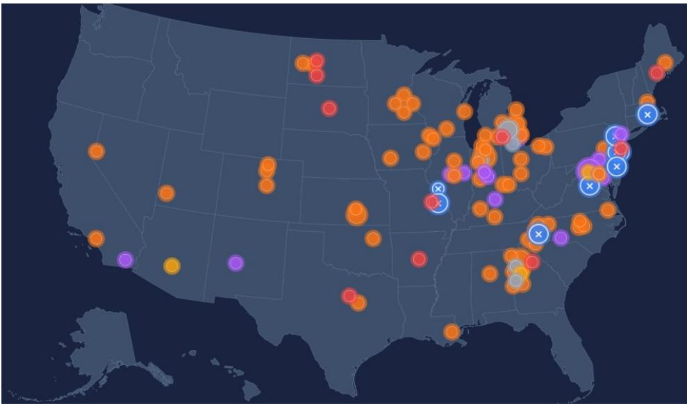

geo

| Location | Color  | Marker |
|----------|--------|--------|
| Various U.S. states | Orange | Circle |
| Various U.S. states | Red    | Circle |
| Various U.S. states | Blue   | Cross |
| Various U.S. states | Purple | Circle |
| Various U.S. states | Yellow | Circle |
| Various U.S. states | Grey   | Circle |
| Various U.S. states | Gray   | Circle |
| Various U.S. states | Grey   | Cross |
| Various U.S. states | Grey   | Cross |
| Various U.S. states | Grey   | Cross |
| Various U.S. states | Grey   | Cross |
| Various U.S. states | Grey   | Cross |
| Various U.S. states | Grey   | Cross |
| Various U.S. states | Grey   | Cross |
| Various U.S. states | Grey   | Cross |
| Various U.S. states | Grey   | Cross |
| Various US. states | Orange | Circle |
| Various US. states | Red    | Circle |
| Various US. states | Blue   | Circle |
| Various US. states | Purple | Circle |
| Various US. states | Yellow | Circle |
| Various US. states | Grey   | Circle |
| Various US. states | Grey   | Cross |
| Various US. states | Grey   | Cross |
| Various US. states | Grey   | Cross |
| Various US. states | Grey   | Cross |
| Various US. states | Grey   | Cross |
| Various US. states | Grey   | Cross |
| Various US. states | Grey   | Cross |
| Various US. states | Grey   | Cross |
| Various US. states | Grey   | Cross |
| Various US. states | Grey   | Cross |

Source: US Data Center Moratorium Tracker

# What Should Investor Engagement Focus On?

# Big Tech's AI push is transforming their energy footprint

The “AI Climate Hoax” report explains that generative AI requires ingesting large corpuses of data, ongoing training, and energy-intensive inference, and is propelled by “scaling laws” culture that associates capability gains with ever larger models and workloads. It quotes recent statements about data centres blanketing the world as illustrative of the scale being contemplated. Additionally, AI is increasingly embedded non-optionally across digital services (e.g., “AI Overviews” in search), triggering compute without explicit user intent and amplifying baseline load growth.

Corporations acknowledge that AI is a primary cause of rising energy consumption and emissions, however stopping short of disclosing the specific portion of growth attributable to AI workloads despite having demonstrated capacity to estimate emissions for single interactions—suggesting the feasibility for better aggregation and transparency at company level.

Figure 38: According to the AI Climate Hoax report, the actual carbon trajectories of companies are increasing significantly   
Total carbon emissions (MtCO2e) and targets of Big Tech companies, according to Ketan Joshi   
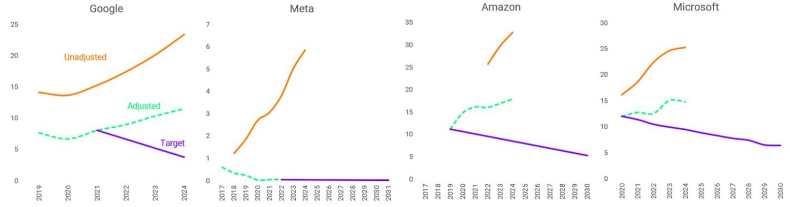  
"Unadjusted" emissions estimate the volume of fossil fuels used in power consumption on a grid.   
"Adjusted" emissions account for certificates from renewable energy companies, or power purchasing deal   
Source: The AI Climate Hoax

The AI boom is significantly increasing the electricity intensity of Big Tech companies. We view this shift as significant as it strengthens the physical constraints to business growth, manifesting in the short term in data centre construction, availability of chips and energy to power rapidly growing AI operations.

Figure 39: The electricity intensity of big tech's revenues has nearly doubled over the last few years. Electricity Intensity of Revenues (Mwh/M\$)   
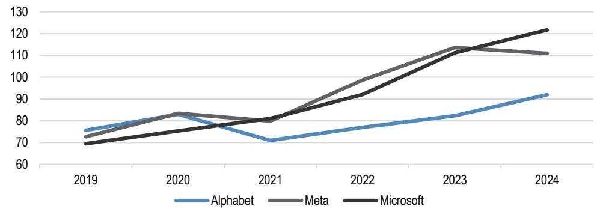

line

| Year | Alphabet | Meta | Microsoft |
| ---- | -------- | ---- | --------- |
| 2019 | 75       | 72   | 68        |
| 2020 | 83       | 84   | 75        |
| 2021 | 70       | 80   | 80        |
| 2022 | 75       | 100  | 92        |
| 2023 | 82       | 113  | 111       |
| 2024 | 92       | 110  | 122       |

Source: JPM, Corporate Reports

As data centres' capacity rapidly expands, alongside electricity demand, the strength of their clean energy commitments is coming under scrutiny. The vast majority of large companies have ambitious net zero commitments, commitments to cover their electricity demand with clean energy. Microsoft recently recommitted to buying enough renewable energy to match all its electricity needs after meeting that goal for the first time last year, but is now reportedly reconsidering its 2030 target.

Table 3: The largest data center operators largely have climate targets, supported by clean energy procurement 

<table><tr><td>Company</td><td>Estimated Data Centre Capacity (MW)</td><td>Net Zero Emissions Target Year</td><td>Clean, Green or Renewable Electricity Target</td><td>Current Share</td><td>Hourly Matching Target</td></tr><tr><td>Meta</td><td>9,780</td><td>2030</td><td>100% renewable</td><td>100%</td><td>-</td></tr><tr><td>Google</td><td>8,960</td><td>2030</td><td>100% renewable match</td><td>100%</td><td>100% by 2030</td></tr><tr><td>Amazon</td><td>7,660</td><td>2040</td><td>100% renewable by 2025</td><td>100%</td><td></td></tr><tr><td>Microsoft</td><td>6,970</td><td>2030 (Carbon Negative)</td><td>100% renewable through 2030</td><td>100%</td><td>100% by 2030</td></tr><tr><td>Digital Realty</td><td>3,000</td><td>-</td><td>100% renewable</td><td>75%</td><td>-</td></tr><tr><td>Equinix</td><td>1,850</td><td>2040</td><td>100% renewable by 2030</td><td>96%</td><td>-</td></tr><tr><td>Tencent</td><td>1,760</td><td>2030</td><td>100% green by 2030</td><td>12%</td><td>-</td></tr><tr><td>Alibaba Cloud</td><td>1,660</td><td>2030</td><td>100% clean energy by 2030</td><td>64%</td><td>-</td></tr><tr><td>NTT Data</td><td>1,500</td><td>2030 (Data Centres)</td><td>100% renewable by 2030</td><td>63%</td><td>-</td></tr><tr><td>Aligned</td><td>1,290</td><td>2040</td><td>100% renewable since 2020</td><td>100%</td><td>-</td></tr><tr><td>Huawei</td><td>1,260</td><td>2040</td><td>-</td><td>&gt;50%</td><td>-</td></tr><tr><td>Apple</td><td>1,240</td><td>2030</td><td>100% renewable</td><td>100%</td><td>-</td></tr><tr><td>Vantage</td><td>1,180</td><td>2030</td><td>-</td><td>58%</td><td>-</td></tr><tr><td>CyrusOne</td><td>1,120</td><td>2030</td><td>-</td><td></td><td>-</td></tr><tr><td>QTS Data Centres</td><td>1,060</td><td>-</td><td>-</td><td>65%</td><td>-</td></tr><tr><td>Baidu</td><td>980</td><td>2030</td><td>100% renewable AI cloud</td><td>5%</td><td>-</td></tr><tr><td>GDS</td><td>980</td><td>2030</td><td>100% renewable by 2030</td><td>36%</td><td>-</td></tr><tr><td>Switch</td><td>660</td><td>2021</td><td>100% renewable since 2016</td><td>100%</td><td>-</td></tr><tr><td>Princeton Digital</td><td>620</td><td>2030</td><td>100% green by 2030</td><td>14%</td><td>-</td></tr><tr><td>OVH Cloud</td><td>600</td><td>-</td><td>100% low-carbon energy by 2025</td><td>92%</td><td>-</td></tr><tr><td>Chindata</td><td>579</td><td>2060</td><td>100% renewable by 2040</td><td>7%</td><td>-</td></tr><tr><td>Oracle</td><td>400</td><td>2050</td><td>100% renewable energy by 2025</td><td>86%</td><td>-</td></tr></table>

Source: JPM, IEA (2025), Energy and AI, IEA, Paris https://www.iea.org/reports/energy-and-ai, Licence: CC BY 4.0

# GHG Protocol & SBTi: Will Hourly Matching Prevail?

New types of climate commitments are appearing, as debates about the effectiveness of renewable energy certificates and carbon accounting have gained traction. The Greenhouse Gas Protocol — used by 97% of S&P 500 companies and last revised in 2015 — is considering a Scope 2 overhaul, proposing a shift from annual to hourly, location-matched renewable energy accounting (see The Great Reset: How new GHG accounting rules could shake up corporate climate claims). The reform has split Big Tech and drawn opposing camps among investors, manufacturers, and clean-energy developers, against a backdrop of growing scrutiny of renewable energy certificates (RECs). SBTi has also considered evolutions on its methodology regarding clean energy.

Among large tech companies, only Alphabet and Microsoft have committed to this objective by 2030 although Microsoft is reportedly considering scrapping its 2030 target after an April deal with Chevron and Engine No. 1 to deliver gas-powered electricity for its data centres.

Current rules allow corporates to match annual consumption with an equivalent volume of clean energy procured or self-generated, using RECs to cover shortfalls. This permits, for instance, an Irish data centre to use summer Spanish solar certificates to cover winter Irish consumption while claiming 100% renewable status. The proposed framework would require claims to reflect the time and location of actual power use — aligning Scope 2 reporting with physical market reality and incentivising 24/7 carbon-free supply. Hourly matching (or 24/7 clean energy) denotes matching electricity consumption, particularly for data centres, with renewable production hour-by-hour rather than on an annual average, ensuring genuine around-the-clock decarbonisation.

Meta, Amazon, and Salesforce are members of the Emissions First Partnership, which supports an "impact accounting" (consequential) approach prioritising investment in the dirtiest grids (Africa, Southeast Asia, Latin America), regardless of where the procuring company consumes power. Impact Accounting and Hourly Matching: A Review synthesizes multiple grid-modelling studies to argue that emissions matching ("emissionality") substantially outperforms hourly matching as a procurement standard. Its central claim is that location dominates timing: variation in grid carbon intensity across geographies dwarfs variation across hours, such that annual matching in Poland (109 kg CO₂/MWh avoided) delivers more impact than 100% hourly matching almost anywhere else in Europe. Hourly matching also carries severe cost premiums — 9 to 38× more expensive per MWh and 6 to 12× more expensive per ton of CO₂ avoided than emissions matching — costs that would erode voluntary participation and could produce lower total reductions in practice. Geographic flexibility further addresses global inequity, since avoided emissions rates are 2–3× higher in the Global South, redirecting capital toward underserved markets like India, Indonesia, and Pakistan with co-benefits in air quality and energy access. The authors stress, however, that none of this works without strict new-build additionality requirements, since otherwise consumers simply claim credit for pre-existing clean generation.

The New Climate Briefing - aligned with the Climate Group's 24/7 Carbon-Free Coalition, whose founding members include Google, Vodafone, AstraZeneca, AirTrunk, Iron Mountain Data Centres, and Shree Cement - defends local 24/7 hourly matching and characterizes the competing Emissions First Partnership proposal as a repackaging of discredited offsetting. It argues that only granular, locally-matched hourly procurement creates the demand signal needed for additional renewables, storage, and grid flexibility, while avoided-emissions accounting relies on unverifiable counterfactuals that Princeton research has found "ineffective." Removing geographic boundaries, the authors warn, would let the largest electricity consumers — particularly hyperscalers expanding AI-driven data centres — avoid the hard work of decarbonizing their own grids through storage, transmission, and policy advocacy where they actually operate. Because the IEA Net Zero scenario requires near-zero electricity emissions in advanced economies by 2030, offsetting via cheap distant certificates would distract from urgency and risk fossil lock-in, while a 24/7 framework would force major buyers into deeper supplier engagement to clean the grids in their manufacturing regions.

The two coalitions share common ground — both reject annual volumetric matching as ineffective, both insist additionality is non-negotiable, and both recognize that AI-driven data centre growth is reshaping the stakes — but they diverge on what corporate climate accountability is fundamentally for. The metastudy adopts a consequentialist lens in which every dollar should chase the highest marginal ton of $CO_{2}$ avoided wherever it lies, while the NewClimate briefing adopts a responsibility-based lens in which large consumers must decarbonize the specific grids they burden, because that transformation requires their capital, political weight, and operational engagement. Both critiques carry force: hourly local matching is genuinely expensive and could collapse voluntary

participation, yet unbounded geographic flexibility would clearly weaken decarbonisation pressure on the world's most demanding electricity consumers.

Constraints include costs and availability of clean generation: IEA findings show that 50%–80% hourly matching in the USA is cost-competitive with gas turbines, with cost premia rising sharply only as procurement nears full 24/7. A corporate survey cited by Reuters found 80% of companies doubted they could procure time-matched clean electricity.

ShareAction has organized a public statement from 14 investors representing over \$1.2 trillion in assets, calling on the GHG Protocol to adopt hourly matching within "deliverable market boundaries." The signatories advocate for phased implementation to allow companies and power markets time to adapt, along with grandfathering provisions for existing clean-energy contracts. A coalition of 64 companies, NGOs, and developers has called for voluntary status, alongside SolarPower Europe and WindEurope. EFRAG recommends the protocol set principles only, leaving technical definitions to local jurisdictions.

Figure 40: 50% to 80% hourly matching low-emissions portfolios are comparable in cost with annual matching, as well as gas turbine projects in the USA   
Average cost of electricity consumed by component for different portfolios and average CO2 emissions intensity in the USA, 2025   
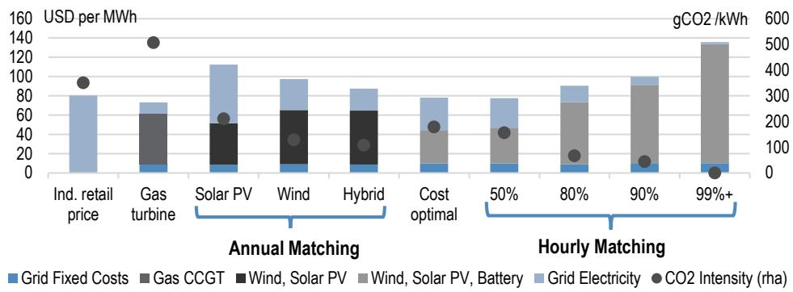

bar

| Category           | Sub-category             | Value (USD per MWh) | CO2 Intensity (rho) |
| ------------------ | ----------------------- | ------------------- | -------------------- |
| Annual Matching    | Ind. retail price       | 80                  | 350                  |
| Annual Matching    | Gas turbine            | 10                  | 500                  |
| Annual Matching    | Solar PV                | 10                  | 200                  |
| Annual Matching    | Wind                    | 10                  | 200                  |
| Annual Matching    | Hybrid                  | 10                  | 200                  |
| Annual Matching    | Cost optimal            | 10                  | 200                  |
| Hourly Matching    | 50%                     | 10                  | 150                  |
| Hourly Matching    | 80%                     | 10                  | 100                  |
| Hourly Matching    | 90%                     | 10                  | 50                   |
| Hourly Matching    | 99%+                    | 10                  | 50                   |

Source: ,IEA (2025), Energy and AI, IEA, Paris https://www.iea.org/reports/energy-and-ai, Licence: CC BY 4.0

# Greater Transparency Remains Key For Investors

While the above questions will be relevant for all investors; sustainability focused investors will also aim to better understand the value-chain footprint of AI systems. In this regard, the recent creation of ITU-T L.1801: Guidelines for assessing the environmental impact of artificial intelligence systems should be an opportunity for investors to engage towards better disclosures.

# ITU-T L.1801 : Guidelines for assessing the environmental impact of AI systems

ITU-T L.1801 is the world's first standard for measuring AI systems' environmental impact — from GPU mining to user queries. It includes 4 life cycles stages, 5 environmental impact categories and 3 orders of effects.

L.1801 is built on Life Cycle Assessment (LCA- cf. ITU-T L.1410), which measures the full life of a system, from raw material extraction to end-of-life treatment. As of today, AI companies today report only Stage 3 — inference electricity, while 1 and 4 in particular are almost universally missing from current AI environmental disclosures.

- Raw material acquisition: Materials for hardware — mining, processing, transportation to manufacturing;   
- Production: Hardware manufacturing + inception, design/development, verification/validation + initial training;   
- Use: Deployment, operation and monitoring, re-evaluation, continuous validation + inference and continuous learning / re-training;   
- End-of-life treatment (EoLT): Hardware decommissioning + software retirement.

# L.1801 mandates one impact category and recommends four more:

- Climate Change - GHG emissions across full life cycle: The only mandatory metric. Covers CO₂, methane, and all greenhouse gases across the complete life cycle — hardware manufacturing, training, inference, and end-of-life.   
- Water Use - Cooling systems & energy generation: Data centres use water for direct cooling of hardware. Energy generation — particularly thermal power plants — also consumes significant water. L.1801 requires both to be counted, not just one or the other.   
- Minerals & Metal - Rare earth elements for hardware: GPUs and TPUs require cobalt, lithium, neodymium, tantalum, and other critical minerals. The standard identifies mining and extraction as a significant source of resource depletion across the AI hardware supply chain. As AI hardware demand scales, the environmental impact of mineral extraction becomes increasingly material — and is almost never included in current AI environmental disclosures.   
- Fossil Fuels & Energy Sources: The environmental impact of AI's energy consumption depends on where that energy comes from. The standard's preferred hierarchy — market-based emission factors first, then location-based, global average only as a last resort — exists precisely because grid mix changes significantly change results.   
- Biodiversity: Material extraction and land use for data centres and power infrastructure affect local ecosystems directly. GHG emissions from AI also contribute to climate change, which the standard identifies as a driver of biodiversity impact throughout the life cycle. Listed as an "additional consideration" rather than a recommended category because credible, scalable measurement methodologies are still developing.

The Ripple Effect : Most standards stop at measuring the direct footprint of the system itself. L.1801 goes further, requiring assessment of second- and higher-order effects — the environmental consequences of what AI changes in the world around it. The standard includes a complete worked example: “a developer using an AI coding assistant”.

- First Order: the AI system’s own direct environmental footprint   
• Second Order: What changes in the developer's environment as a result   
• Higher Order: Systemic changes across the industry and economy   
• Other - Non-carbon: Social and human capital effects

# Who are the EMEA Top Picks?

According to the IEA projections, the U.S. is expected to see the greatest share of DC growth, yet we believe EMEA companies are also benefiting from the trend through US exposure, but also through a lagging EMEA DC story. The views of JPM Fundamental analysts reflect these aspects in both CapGoods and IT Hardware. In addition, the two European sectors are OW according to JPM Equity Strategy.

# CapGoods

The team highlights varying degrees of datacentre exposure across the companies under their coverage: datacentres represent approximately 30% of sales for Legrand, while Schneider similarly generates around 26% of its sales from datacentres. For ABB, datacentres represent roughly 9% of group sales, whereas Siemens has mid-single-digit datacentre exposure within group sales. The team describes Atlas Copco as having indirect exposure to internet/data spend through its semiconductor exposure in the Vacuum Technique business area, with semiconductor exposure representing approximately 15-20% of group sales. They report that Prysmian's datacentre business accounts for about 7% of sales, while Siemens Energy has 10% indirect exposure to datacentres through power generation, with DC power needs identified as the biggest growth driver for power generation equipment. Halma's datacentre exposure represents approximately 20% of group revenue, according to the team. Other companies, including Assa Abloy, Oxford Instruments, Rotork, and Spirax, have less than 5% exposure.

# Legrand (Overweight; Price Target: €180.00) covered by Phil Buller

Link to latest note : Legrand: Q1'26 Results Wrap-Up: Nudging estimates higher on Q1 US DC beat + pricing

Investment Thesis: The JPM European Capital Goods team believes Legrand is a high-quality franchise offering many favourable, long-term characteristics, including a strong execution track record, access to attractive low voltage profit pools and demonstrable pricing power, all underpinned by a relentlessly applied operating model. The team believes datacentres will be the single most attractive end market in its coverage in the coming years. Legrand, at 30% is now higher than Schneider. Given Legrand's market position, the team does not believe the market is fully reflecting the likely contribution from DC to Legrand's growth profile, and sees incremental upside in the event of a European resi recovery and/or US core office. The stock looks attractively valued in absolute terms, albeit towards the higher end of recent historical averages. Importantly, however, the growth outlook in the years ahead is potentially materially different to that of the prior five years, which in the team's view justifies the current levels.

Valuation: The JPM European Capital Goods team's June 2027 Price Target is based on a reverse DCF valuation. The 12-month forward target multiple is 18x EV/adj. EBITA, applied to the team's 2027 forecasts and rolled six months forward. The multiple takes growth, margin, cost of capital and asset intensity into account.

# Risks to Rating and Price Target

\- Datacentre market growth slows versus high expectations, dragging on Legrand's

growth potential, or remains lumpy as was seen in H1'24.

- European resi remains weak for longer than expected, although after such a protracted downturn, the JPM European Capital Goods team sees more upside than downside from current levels.   
- M&A pipeline slows, dragging on the overall group growth profile, although the team does not believe consensus models the consistent M&A roll-up story so this is likely immaterial.

# Sustainability

Legrand presents a robust sustainability profile that positions it favorably within the global electrical equipment sector. The company holds an MSCI ESG Rating of AA, placing it in the Leader tier of MSCI's CCC–AAA scale, which reflects strong peer-relative management of financially material ESG issues. This is corroborated by a Sustainalytics ESG Risk Score of 13.66, situating Legrand firmly in the Low Risk band (10–20). The corporate material topics include Product Quality & Safety Management, Sustainable Product development, and Energy Management, where the group is qualified as leading by Bloomberg.

From a climate transition standpoint, Legrand has an SBTi-validated emissions reduction target. This is supported by a formally disclosed transition plan. The company reports EU Taxonomy aligned revenues of 12% and capex of 14%.

Legrand also enjoys strong reception within the sustainable investment community. The stock is held by 2,714 ESG-labelled funds globally, including 171 SFDR Article 9 funds — the strictest "sustainable investment" category under EU regulation — and 2,132 Article 8 funds promoting environmental and/or social characteristics.

# Prysmian (Overweight; Price Target: €172.00) covered by Akash Gupta

Link to latest note : Digital Solutions deep dive - lifting the PT to €172

# Investment Thesis

- Energy transition and Grid spending to drive growth in Europe: \~35% of Prysmian's revenues come from medium- and high-voltage grids, where the JPM European Capital Goods team sees strong growth in the coming years from the existing backlog and customers' investment plans. Both segments are margin accretive.   
- Electrification and data centre investments to boost growth in the US: Driven by the acquisition of Encore and Channell, the JPM European Capital Goods team estimates the US to account for \~40% of group sales and >50% of Adj EBITDA. Growth in the US is driven by electrification (incl data centres) and grid modernization. Strong growth for optical fibers brings another growth opportunity in the U.S.   
- Strong cash-flow generation prospects: The JPM European Capital Goods team also likes Prysmian's strong cash-flow generation profile, which, despite higher capex levels, is better than that of its cable peers. A continued increase in the HV backlog should provide a tailwind for cash flow.

Valuation: The JPM European Capital Goods team's June 2027 Price Target is based on a reverse DCF valuation. The 12-month forward target multiple is 17x EV/adj.

EBITA, applied to the team's 2028 forecasts and discounted back by 6 months. The EV is adjusted for negative working capital in the Transmission business and €1bn hybrid bond.

Risks to Rating and Price Target: The JPM European Capital Goods team sees the following downside risks: 1) Delays in project awards could push-out growth in HV and bring downside risk to estimates. 2) Compliance risks – The cable industry has been accused of cartel-like activity and any potential accusation in the future could lead to a de-rating of the stock. 3) Potential execution issues in HV projects could lead to downside, including risks in the ramp-up of new production lines. 4) Prysmian has seen a big increase in North America margin since 2022, some of which is over-earning due to the supply/demand situation. If margins normalize beyond the team's expectations, then that could create downside. 5) Competitive risks from Chinese fiber makers. 6) If the supply of metals tightens then there could be a risk in sourcing of metals like copper and aluminum. 7) If DC capex growth slows or turns negative then it could impact medium term growth potential.

# Sustainability

Prysmian holds an MSCI ESG Rating of AA, placing it in the Leader category on MSCI's CCC–AAA scale, while its Sustainalytics ESG Risk Score of 17.24 situates the Company in the Low Risk band. According to Bloomberg, Prysmian is positioned as Leading on GHG Emissions Management and Energy Management, and Lagging on Occupational Health & Safety, reflecting a generally favorable peer-relative profile on environmental stewardship alongside an identified area for operational improvement on workforce safety.

On climate transition, Prysmian has SBTi validated near term and net zero targets. This commitment is reinforced by a formally disclosed Transition Plan. EU Taxonomy alignment further substantiates the Company's transition orientation, with Taxonomy-aligned revenues of 23% and Taxonomy-aligned capex of 56%, the latter signaling meaningful forward-looking capital deployment toward sustainable economic activities.

In terms of sustainable fund ownership, Prysmian is held by 172 SFDR Article 9 funds — the strictest "sustainable investment" classification — alongside 2,129 Article 8 funds promoting environmental and/or social characteristics, with total ESG fund holdings reaching 2,746.

# Schneider Electric (Overweight; Price Target: €325.00) covered by Phil Buller

Link to latest note: Schneider Electric Q1 wrap: Strong start, outgrowth is still evident on a multi-year view

# Investment Thesis

\- 2025 was a blip, secular outgrowth story is unchanged. Schneider has unequivocally, in the JPM European Capital Goods team's view, got the best portfolio when it comes to exposure to attractive secular end markets overall, and continues to offer upper-quartile organic growth and earnings progression, second only to Siemens Energy. This was also true for 2025, however multiples reflected that fact in late 2024 and marginal downgrades to consensus (FX and tariff driven) in 2025 saw multiples compress, to the extent the shares now offer an attractive entry point.

\- New CFO is important. The somewhat uninspiring 2025 was uncharacteristic of Schneider. However, this can largely be attributed to tariff and FX headwinds vis-à-vis elevated market expectations. With a new CFO now in place and a solid Q1 now behind us, the team sees a confidence rebuilding period and multiple expansion opportunity ahead for 2026.

Valuation: The JPM European Capital Goods team's June 2027 Price Target is based on a reverse DCF valuation. The 12-month forward target multiple is 20.5x EV/adj. EBITA, applied to the team's 2027 forecasts, and rolled six months forward. The multiple takes into account the through-cycle growth, margin, cost of capital and asset intensity.

Risks to Rating and Price Target: Management. Investors are struggling with the recent change in financial execution and are wondering if this is in any way a delayed reaction to the unexpected ousting of Peter Herweck c.12 months ago. In the JPM European Capital Goods team's view, Schneider is generally very well managed indeed, but the fact there are questions being asked on this topic muddies the otherwise attractive underlying growth story.

# Sustainability

Schneider Electric (SU FP) carries an MSCI ESG Rating of AA, placing it in the Leader tier on MSCI's CCC–AAA scale, alongside a Sustainalytics ESG Risk Score of 7.14, which falls within the Negligible risk band (0–10). According to Bloomberg, the company is positioned as Leading on each of its principal material topics, namely Product Quality Management, Sustainable Product, and Energy Management, indicating a consistently strong peer-relative profile across the issues most financially material to its business model.

On climate, Schneider Electric has both a Near-Term Validated and a Net-Zero Validated target under the Science Based Targets initiative. This is reinforced by a formally disclosed Transition Plan. From a green revenue standpoint, 32% of reported revenues and 24% of capex are aligned with the EU Taxonomy, underscoring a meaningful share of activities and forward investment contributing to the bloc's environmental objectives.

In terms of sustainable fund ownership, Schneider Electric is held by 320 SFDR Article 9 funds, classified under SFDR's strictest "sustainable investment" category, and 3,117 Article 8 funds, which promote environmental and/or social characteristics. Total ESG fund ownership stands at 4,187 funds.

# Siemens (Overweight; Price Target: €335.00) covered by Phil Buller

Link to latest note : Q2'26 Results - First Take - DI and SI beat and raise offset by Mobility tariffs, earlier than expected buyback

# Investment Thesis

\- Portfolio strategy. The eight-year portfolio simplification effort, which started with the debatable ‘fleet of ships’ strategy, is almost complete. Whilst painfully slow at times, it has unequivocally resulted in a better business with higher growth prospects, higher gross and operating margins and more predictable FCF. The shareholding in SHL (67% or c€32bn FV) is the next and perhaps final step in this journey, which was addressed at the CMD and the company plan to return c30% of SHL to SIE shareholders in 2027.

- Strong core. Siemens' exposure to automation, software, electrification and mobility is attractive in the current context and should deliver above sector average organic growth on a multi-year view.   
- Focus moves to execution. After years of structural change and higher investments, Siemens is entering a period where the focus moves to execution, driving growth and improving margins, returns and cash. Whilst the guidance on leverage is low, we see this as conservative during the CFO transition year.

Valuation: JPM European Capital Goods team sets its June 2027 price target using a Sum-of-the-Parts and the market price for Siemens Energy and its Med Tech colleagues' view on Fair Value for SHL, and applies a 15% holding discount. The team takes a conservative approach to its chosen multiples across the group's assets, taking a discount to peer group averages in most cases.

# Risks to Rating and Price Target

- Portfolio challenges persist. In the event that the SHL exit is protracted, this would be negative for the stock, although the team sees the timeline as investible now with the Feb AGM only c3 quarters away.   
- M&A. Siemens has a mixed M&A track record and may do further acquisitions (potentially at high multiples) or disposals/partnerships with a negative impact on value in the short term. If M&A were to occur in parallel to shareholder friendly actions, the market would likely be accommodating.   
- Digital Industries recovery slow to materialize. DI has seen significant pressure on margins as demand normalised and customers/distributors have destocked. The likelihood of this continuing is now low; however, as the flagship division, this will be important for the equity.   
- Index risk: The Siemens shares have a tight correlation with the DAX index. In the event of a material shift in perception on the German economy and stimulus plans, this would drive the multiple lower.

# Sustainability

Siemens AG (SIE) holds an MSCI ESG Rating of AAA, placing it firmly within the Leader band on MSCI's CCC–AAA scale, and a Sustainalytics ESG Risk Score of 23.11, which falls in the Medium risk band. On a peer-relative basis, Bloomberg characterizes Siemens as Leading on Energy Management and Occupational Health & Safety, while positioning the company as Lagging on Product Quality Management — a material topic that warrants closer monitoring given its relevance to the company's diversified industrial portfolio.

On climate transition, Siemens has secured SBTi validation for both its near-term emissions reduction target and its long-term net-zero target. From a real-economy alignment perspective, 29% of the company's revenues and 40% of its capex are classified as EU Taxonomy-aligned, indicating that a meaningful share of both current activity and forward investment is directed toward environmentally sustainable economic activities as defined under the EU framework.

In terms of sustainable fund ownership, Siemens is held by 191 SFDR Article 9 funds, 2,690 SFDR Article 8 funds, and a total of 3,363 ESG funds.

# Siemens Energy (Overweight; Price Target: €225.00) covered by Phil Buller

Link to latest note : Siemens Energy Q2'26 Wrap-up and Model Update - Longer-term prospects still improving, reiterate OW/AFL

# Investment Thesis

- Strong and Sustainable FCF Trade: Siemens Energy's earnings growth outlook through 2028 is stronger than peers, with company guidance likely beatable in Gas Services (GS), Grid Tech (GT), and possibly Gamesa. The company is locking in supply/demand imbalances into long-term, profitable service contracts extending into the 2040s. GS services FCF alone could justify the current valuation and provide protection against future volatility.   
- Electricity Demand Growth: Accelerating electricity demand, driven by electrification and AI, especially in the US, will require significant grid investment. Siemens Energy, with its leading gas turbines, grid equipment, and offshore wind portfolio, is well-positioned to benefit from this trend and generate recurring FCF from service contracts.   
- Share Price Outlook: Despite a strong share rally, there is potential for $>50\%$ upside over 12-18 months as long-only investors revisit the stock, driven by improved FCF margins similar to Rolls-Royce's recent performance.   
- Wind Business Turnaround: The wind business turnaround is nearly complete, with break-even expected before the end of 2026, despite challenges from a reduced onshore presence.

Valuation : To derive its Jun-27 PT of €225 the JPM European Capital Goods team values Siemens Energy on 20x calendarised 2028E EV/EBITA. The multiple is derived from a reverse DCF using long-term growth, normalised margin, capital structure, cost of capital, capital intensity and tax rates, among others. The team adjusts the EV to reflect net contract liabilities and excess provisions over normalised levels, but no longer adjusts for the cash cost of the Siemens India acquisition, as it carries a corresponding asset of the same value.

# Risks to Rating and Price Target

- Upside risks are: 1) Siemens Energy could outperform if it continues to grow above guidance, which the JPM European Capital Goods team sees as possible in both GS and GT given the volume outlook and backlog, noting also that the company beat its prior three-year guidance c two years ahead of schedule. 2) The multiple for the stock could re-rate if incremental buyers from long-only institutions can gain comfort in the sustainability of the FCF margin. 3) A more favourable environment for renewables in future could bring upside.   
- Downside risks are: 1) Execution on projects could bring downside to estimates. 2) If electricity demand growth slows then the company could see a de-rating of the share price. 3) Aggressive behaviour by some competitors could bring downside.

# Sustainability

Siemens Energy carries an MSCI ESG Rating of BBB, placing it in the average band of MSCI's CCC–AAA scale, while its Sustainalytics ESG Risk Score of 13.58 sits firmly within the Low Risk category (10–20). On a peer-relative basis, Bloomberg characterizes the company as Leading on both Sustainable Product and Energy Management, two topics central to its core business model, and Above Median on Product Quality Management. This positioning is consistent with the company's strategic orientation toward the energy transition value chain and reflects relative strength on the material topics most directly tied to its commercial footprint.

On climate, Siemens Energy has a Near-Term SBTi-validated target. The company's exposure to transition-aligned economic activity is meaningful: EU Taxonomy-aligned revenues stand at 41%, and Taxonomy-aligned capex reaches 55%, indicating that forward investment is being directed toward eligible activities at a higher proportion than current revenue mix — a constructive signal for the pace of green capital deployment. Some investors will avoid the company due to its exposure to gas generation.

From a sustainable finance ownership perspective, Siemens Energy is held by 102 SFDR Article 9 funds, classified under SFDR's strictest sustainable investment category, and 2,069 Article 8 funds, which promote environmental or social characteristics. In aggregate, 2,535 ESG funds hold the stock.

# IT Hardware

# ASM International (Overweight; Price Target: €930.00) covered by Sandeep Deshpande

Link to latest note : ASM International Takeaways from London TMT Conference 2026

Investment Thesis: ASM International has significantly improved its position in the semi-cap industry in the past few years. All major leading edge semi manufacturers have begun to use its ALD tools for 5nm/3nm/2nm processes. It dominates the logic market in ALD. Its position in the memory market is improving. In particular, as DRAM uses logic like high-k metal gates and then moves to 4F2 architecture, it will use more single wafer ALD tools, benefiting ASMI. ASMI has also increased its share in Epitaxy over the last four years, expanding its share well beyond its historical customer/s.

Valuation: ASM International has traded at 25x to 33x forward P/E multiple (interquartile range) in the past five years with an average and median multiple of 30x fwd P/E, driven by the increasing importance of ALD and Epitaxy for advanced semiconductor manufacturing. As the number and complexity of ALD and Epi layers continue to increase in new memory and logic architectures (4F2 and peripheral FinFET in DRAM, Backside Power Delivery Networks and 1.4nm nodes in logic), the JPM European Tech Hardware & Payments team estimates that ASMI should trade at its five-year average multiple of 30x forward P/E. Using a 30.3x multiple on the team's FY28 EPS estimates (excluding results on investments) implies an ASMI standalone value of €894, to which the team adds the value of the 25% stake in ASM Pacific valued at €36. Thus, its Dec'27 price target is €930.

Risks to Rating and Price Target: If mass adoption of ALD technology is slower than current estimates and/or if the company loses share in the ALD market, there could be downside to our estimates and target price. An economic downturn would also clearly have a detrimental effect. Faster- and higher-than-expected recovery in orders in the

near term could result in upside to our estimates and the stock.

# Sustainability

ASM International (ASM NA) holds an MSCI ESG Rating of AAA, placing the company in the Leader category on MSCI's CCC–AAA scale, while its Sustainalytics ESG Risk Score of 7.84 falls within the Negligible Risk band (0–10), reflecting a strong peer-relative sustainability profile. According to Bloomberg, ASM is positioned as Leading on Energy Management, Above Median on Water Management, and at the Median on Occupational Health & Safety, indicating particular strength in resource and energy stewardship — a material consideration for a semiconductor equipment manufacturer — with adequate but less differentiated performance on workforce safety relative to peers.

On climate transition, ASM has both a Near-Term Validated and a Net-Zero Validated target with the Science Based Targets initiative (SBTi), placing it among the more advanced cohort of issuers with full SBTi endorsement across both time horizons. This is reinforced by a formally disclosed transition plan. EU Taxonomy alignment, however, remains nil at present, with 0% Taxonomy-aligned revenues and 0% Taxonomy-aligned capex, reflecting the current absence of qualifying activities under the Taxonomy's technical screening criteria for the company's core semiconductor manufacturing operations.

ASM International is held by 111 SFDR Article 9 funds — the strictest "sustainable investment" classification under SFDR — alongside 1,956 Article 8 funds promoting environmental and/or social characteristics, and 2,379 ESG funds in aggregate.

# ASML (Overweight; Price Target: €1,515.00) covered by Sandeep Deshpande

Link to latest note : ASML: Takeaways from London TMT Conference 2026

Investment Thesis: ASML is the sole supplier of EUV tools and its market share in the lithography segment should exceed 80-89% (seen in the last decade) driven by higher EUV ASP. The shift to High-NA that should start in '27 should help litho intensity improve as should greater EUV adoption in DRAM. The industry environment has changed significantly in recent quarters with a significant increase in DRAM prices. ASML, with its exposure to all the major memory companies, should be a significant beneficiary of a memory up-cycle.

Valuation: The JPM European Tech Hardware & Payments team's ASML target price is €1,515 (\$1,813) which is equivalent to 29.4x the team's '28 EPS. ASML has historically traded at 28-39x forward earnings in the last five years (interquartile range) and at an average multiple of 33.2x. The team's multiple is thus at the lower end of ASML's trading range to reflect its upcycle estimates.

Risks to Rating and Price Target: The JPM European Tech Hardware & Payments team believes the key risks that could prevent the stock from achieving its price target are: 1) export restrictions on tools to key geographies, such as China; and 2) an economic downturn, which would jeopardise the team's earnings estimates and PT. Further, lower-than-expected EUV adoption could imply downside to its estimates. Continuing increase in interest rates would also be negative to the multiple used and, thus, negative to the team's target price.

# Sustainability

ASML carries an MSCI ESG Rating of AAA, placing it firmly within the Leader tier on MSCI's CCC–AAA scale, while its Sustainalytics ESG Risk Score of 8.75 sits within the Negligible Risk band (0–10), reflecting a very low level of unmanaged ESG risk on a peer-relative basis. According to Bloomberg's material topic assessment, ASML is positioned as Leading on Energy Management and above the peer median on Water Management, while it is characterized as Lagging on Occupational Health & Safety — an area that warrants closer monitoring against sector peers.

On the climate transition front, ASML has both a Near-Term and a Net-Zero target validated by the Science Based Targets initiative (SBTi), representing the most rigorous level of third-party endorsement available under the SBTi framework. This is reinforced by a formally disclosed transition plan. EU Taxonomy alignment, however, remains immaterial at this stage, with 0.0% of revenues and 0.0% of capex currently classified as Taxonomy-aligned — a profile consistent with the limited applicability of the current Taxonomy technical screening criteria to advanced semiconductor lithography activities.

ASML features broadly across Europe's sustainable fund universe, held by 4,426 ESG funds in total. This includes 256 Article 9 funds, which sit within SFDR's strictest "sustainable investment" classification, and 3,415 Article 8 funds promoting environmental and/or social characteristics.

# Infineon Technologies (Overweight; Price Target: €74.00) covered by Sandeep Deshpande

Link to latest note: Raise in FY26 guidance and the exit revenue/margin in 4Q26 point to significant FY27/FY28 estimate increases. Maintain OW rating.

Investment Thesis: Infineon is exposed to multiple secular trends including AI power, software defined vehicles and ADAS where it is a market leader. In reported results, Infineon has now indicated improving trends in its core auto business (\~50% of revenue). Infineon is also a major beneficiary of power semiconductor growth due to AI power, where it is a leading supplier. The strength in MOSFETs due to AI power demand is helping pricing for MOSFETs in non AI markets and this trend will be accretive to Infineon margins. Overall with the cycle improving and with the co.'s strong AI power position, Infineon should see estimate upgrades for the next few quarters in our opinion.

Valuation: The JPM European Tech Hardware & Payments team's Dec-27 price target is based on a 22x its FY28 EPS estimate. Infineon has traded between 15.6x and 23.0x its forward earnings in the past 10 years (inter quartile range), with an average multiple of 19.6x. Given the company's growing exposure to AI, structural growth in power infrastructure (which should inflect towards the end of '27) and potential for earnings upgrades, the stock should trade towards the high-end of that range, hence the team's multiple of 22x (implying that it expects further estimate increases through the next year).

# Risks to Rating and Price Target

Key risks that could keep the rating and target price from being achieved include:

\- Macro: If the global economy slips into recession, the target would prove too

optimistic.

- Competitive pressures in a weak environment could mean weaker profitability than forecast.   
- Sudden shift from a currency tailwind to a headwind would impact margins and sales negatively, and vice versa.

# Sustainability

Infineon Technologies carries an MSCI ESG Rating of AA, placing it within the Leader tier on MSCI's CCC–AAA scale, and a Sustainalytics ESG Risk Score of 18.88, situating it in the Low Risk band. According to Bloomberg, Infineon is positioned as Leading on Energy Management and Above Median on Water Management, while it is characterized as Lagging on Occupational Health & Safety — a peer-relative profile that highlights strong environmental stewardship alongside an identified area for operational improvement on workforce safety.

On climate, Infineon has a Near-Term SBTi-validated target, providing external assurance that its medium-horizon decarbonisation pathway is aligned with the latest climate science, and the company supports this commitment with a formally disclosed transition plan. EU Taxonomy alignment, however, remains nascent, with 0% Taxonomy-aligned revenues and 0% Taxonomy-aligned capex, reflecting the limited current overlap between the semiconductor activity classification and the Taxonomy's defined eligible economic activities.

From a sustainable finance ownership perspective, Infineon is held by 188 SFDR Article 9 funds — the strictest "sustainable investment" classification — and by 2,382 Article 8 funds, which promote environmental and/or social characteristics. In aggregate, the stock features in 3,051 ESG-labelled funds.

# Nokia (Overweight; Price Target: €12.00) covered by Sandeep Deshpande

Link to note : Nokia - Beat and raise likely through ‘26. Reiterate Overweight rating.

Investment Thesis: With \~30% of its revenue coming from the Optical Networks and IP Networks business units, which are exposed to AI infrastructure, and which are guided to grow 10-12%, the JPM European Tech Hardware & Payments team believes that Nokia can grow sales slightly short of mid-single digit to '28. At the same time, due to operational gearing in the NI business unit, coupled with synergies from the Infinera deal, the earnings of the co. could grow \~14%. If Nokia can deliver on this earnings growth, the team believes that the stock could re-rate with its earnings multiple rising to the high teens, which would make the stock a multi-year compounder. The team maintains its OW rating on the stock.

Valuation: The JPM European Tech Hardware & Payments team's new Dec-27 price target is €12.00 (prev. €6.90 in Jun-27), which applies a 26.5x multiple to its current estimated 2028 Adj. EPS of €0.45 (previously 16x €0.43). For the ADR, the team's updated Dec-27 price target is \$14.00 (prev. \$8.20 in Jun-27). The team recognises that the applied multiple looks rich versus Nokia's own history; however, as it has shown in this note, the team sees further upside potential to Nokia EPS driven by growth in Optical & IP Networks. In the scenario outlined in this note, the team sees Nokia generating EPS of €0.55 in 2028; in such a case, Nokia shares could comfortably trade on low-20s P/E thus justifying its €12 price target (equivalent to 22x €0.55 EPS in

2028).

# Risks to Rating and Price Target

- Weaker-than-expected TelCo capex spending, which would result in downside to estimates   
- Market share loss and competitive pressure in Nokia’s networks division   
• Deterioration in FCF and net cash position

# Sustainability

Nokia (NOKIA FH) holds an MSCI ESG Rating of AAA, positioning the company as a Leader within MSCI's CCC–AAA framework, while its Sustainalytics ESG Risk Score of 9.58 places it firmly within the Negligible Risk band (0–10). On a peer-relative basis, Bloomberg identifies Sustainable Product, Social Supply Chain Management, and labour & Employment Practices as the company's most material ESG topics, and characterizes Nokia as Leading on each — reflecting a consistently strong positioning across its principal sustainability exposures.

From a climate transition standpoint, Nokia has both Near-Term and Net-Zero targets validated by the Science Based Targets initiative (SBTi), representing the most rigorous tier of third-party validated decarbonisation commitments. This is reinforced by a formally disclosed transition plan, providing structured visibility into the company's pathway to its stated objectives. EU Taxonomy alignment currently stands at 3% of revenues and 0% of capex, indicating limited eligibility under the Taxonomy's technical screening criteria as presently defined.

In terms of SFDR-classified fund ownership, Nokia is held by 59 Article 9 funds — SFDR's strictest "sustainable investment" category — alongside 1,812 Article 8 funds, which promote environmental and/or social characteristics. In aggregate, 2,227 ESG-classified funds currently hold the stock.

Analyst Certification: The Research Analyst(s) denoted by an “AC” on the cover of this report certifies (or, where multiple Research Analysts are primarily responsible for this report, the Research Analyst denoted by an “AC” on the cover or within the document individually certifies, with respect to each security or issuer that the Research Analyst covers in this research) that: (1) all of the views expressed in this report accurately reflect the Research Analyst’s personal views about any and all of the subject securities or issuers; and (2) no part of any of the Research Analyst's compensation was, is, or will be directly or indirectly related to the specific recommendations or views expressed by the Research Analyst(s) in this report. For all Korea-based Research Analysts listed on the front cover, if applicable, they also certify, as per KOFIA requirements, that the Research Analyst’s analysis was made in good faith and that the views reflect the Research Analyst’s own opinion, without undue influence or intervention.

All authors named within this report are Research Analysts who produce independent research unless otherwise specified. In Europe, Sector Specialists (Sales and Trading) may be shown on this report as contacts but are not authors of the report or part of the Research Department.

# Important Disclosures

Company-Specific Disclosures: JPM does and seeks to do business with companies covered in its research reports. As a result, investors should be aware that the firm may have a conflict of interest that could affect the objectivity of this report. Investors should consider this report as only a single factor in making their investment decision. Important disclosures, including price charts and credit opinion history tables (if applicable), are available for compendium reports and all JPM-covered companies, and certain non-covered companies, by visiting https://www.jpmm.com/research/disclosures, calling 1-800-477-0406, or e-mailing research.disclosure.inquiries@JPM.com with your request.

# Explanation of Equity Research Ratings, Designations and Analyst(s) Coverage Universe:

JPM uses the following rating system: Overweight (over the duration of the price target indicated in this report, we expect this stock will outperform the average total return of the stocks in the Research Analyst's, or the Research Analyst's team's, coverage universe); Neutral (over the duration of the price target indicated in this report, we expect this stock will perform in line with the average total return of the stocks in the Research Analyst's, or the Research Analyst's team's, coverage universe); and Underweight (over the duration of the price target indicated in this report, we expect this stock will underperform the average total return of the stocks in the Research Analyst's, or the Research Analyst's team's, coverage universe. NR is Not Rated. In this case, JPM has removed the rating and, if applicable, the price target, for this stock because of either a lack of a sufficient fundamental basis or for legal, regulatory or policy reasons. The previous rating and, if applicable, the price target, no longer should be relied upon. An NR designation is not a recommendation or a rating. Some stocks under coverage have a rating but no price target; in these cases, we expect the stock will outperform/perform in line/underperform the average total return of the stocks in the Research Analyst's, or the Research Analyst's team's, coverage universe of the relevant duration of the region. In our Asia (ex-Australia and ex-India) and U.K. small- and mid-cap Equity Research, each stock's expected total return is compared to the expected total return of a benchmark country market index, not to those Research Analysts' coverage universe. If it does not appear in the Important Disclosures section of this report, the certifying Research Analyst's coverage universe can be found on JPM's Research website, https://www.JPMmarkets.com.

JPM Equity Research Ratings Distribution, as of April 04, 2026 

<table><tr><td></td><td>Overweight (buy)</td><td>Neutral (hold)</td><td>Underweight (sell)</td></tr><tr><td>JPM Global Equity Research Coverage*</td><td>51%</td><td>37%</td><td>12%</td></tr><tr><td>IB clients**</td><td>83%</td><td>79%</td><td>74%</td></tr><tr><td>JPMS Equity Research Coverage*</td><td>49%</td><td>39%</td><td>13%</td></tr><tr><td>IB clients**</td><td>94%</td><td>93%</td><td>85%</td></tr></table>

\*Please note that the percentages may not add to 100% because of rounding.   
\*\*Percentage of subject companies within each of the "buy," "hold" and "sell" categories for which JPM has provided investment banking services within the previous 12 months.   
For purposes of FINRA ratings distribution rules only, our Overweight rating falls into a buy rating category; our Neutral rating falls into a hold rating category; and our Underweight rating falls into a sell rating category. Please note that stocks with an NR designation are not included in the table above. This information is current as of the end of the most recent calendar quarter.

Equity Valuation and Risks: For valuation methodology and risks associated with covered companies or price targets for covered companies, please see the most recent company-specific research report at http://www.JPMmarkets.com, contact the primary analyst or your JPM representative, or email research.disclosure.inquiries@JPM.com. For material information about the proprietary models used, please see the Summary of Financials in company-specific research reports and the Company Tearsheets, which are available to download on the company pages of our client website, http://www.JPMmarkets.com. This report also sets out within it the material underlying assumptions used.

# History of Investment Recommendations:

A history of JPM investment recommendations disseminated during the preceding 12 months can be accessed on the Research & Commentary page of http://www.JPMmarkets.com where you can also search by analyst name, sector or financial instrument.

Analysts' Compensation: The research analysts responsible for the preparation of this report receive compensation based upon various factors, including the quality and accuracy of research, client feedback, competitive factors, and overall firm revenues.

Registration of non-US Analysts: Unless otherwise noted, the non-US analysts listed on the front of this report are employees of non-US affiliates of JPM Securities LLC, may not be registered as research analysts under FINRA rules, may not be associated persons of JPM Securities LLC, and may not be subject to FINRA Rule 2241 or 2242 restrictions on communications with covered companies, public appearances, and trading securities held by a research analyst account.

# Other Disclosures

JPM is a marketing name for investment banking businesses of JPM Chase & Co. and its subsidiaries and affiliates worldwide.

UK MIFID FICC research unbundling exemption: UK clients should refer to UK MIFID Research Unbundling exemption for details of JPM's implementation of the FICC research exemption and guidance on relevant FICC research categorisation.

All research material made available to clients are simultaneously available on our client website, JPM Markets, unless specifically permitted by relevant laws. Not all research content is redistributed, e-mailed or made available to third-party aggregators. For all research material available on a particular stock, please contact your sales representative.

Any long form nomenclature for references to China; Hong Kong; Taiwan; and Macau within this research material are Mainland China; Hong Kong SAR (China); Taiwan (China); and Macau SAR (China).

JPM may, from time to time, write on issuers or securities targeted by economic or financial sanctions imposed or administered by the governmental authorities of the U.S., EU, UK or other relevant jurisdictions (Sanctioned Securities). Nothing in this report is intended to be read or construed as encouraging, facilitating, promoting or otherwise approving investment or dealing in such Sanctioned Securities. Clients should be aware of their own legal and compliance obligations when making investment decisions.

Any digital or crypto assets discussed in this research report are subject to a rapidly changing regulatory landscape. For relevant regulatory advisories on crypto assets, including bitcoin and ether, please see https://www.JPM.com/disclosures/cryptoasset-disclosure.

The author(s) of this research report may not be licensed to carry on regulated activities in your jurisdiction and, if not licensed, do not hold themselves out as being able to do so.

Exchange-Traded Funds (ETFs): JPM Securities LLC (“JPMS”) acts as authorized participant for substantially all U.S.-listed ETFs. To the extent that any ETFs are mentioned in this report, JPMS may earn commissions and transaction-based compensation in connection with the distribution of those ETF shares and may earn fees for performing other trade-related services, such as securities lending to short sellers of the ETF shares. JPMS may also perform services for the ETFs themselves, including acting as a broker or dealer to the ETFs. In addition, affiliates of JPMS may perform services for the ETFs, including trust, custodial, administration, lending, index calculation and/or maintenance and other services.

Options and Futures related research: If the information contained herein regards options- or futures-related research, such information is available only to persons who have received the proper options or futures risk disclosure documents. Please contact your JPM Representative or visit https://www.theocc.com/components/docs/riskstoc.pdf for a copy of the Option Clearing Corporation's Characteristics and Risks of Standardized Options or https://www.finra.org/sites/default/files/2020-08/Security\_Futures\_Risk\_Disclosure\_Statement\_2020.pdf for a copy of the Security Futures Risk Disclosure Statement.

Changes to Interbank Offered Rates (IBORs) and other benchmark rates: Certain interest rate benchmarks are, or may in the future become, subject to ongoing international, national and other regulatory guidance, reform and proposals for reform. For more information, please consult: https://www.JPM.com/global/disclosures/interbank\_offered\_rates

Private Bank Clients: Where you are receiving research as a client of the private banking businesses offered by JPM Chase & Co. and its subsidiaries (“JPM Private Bank”), research is provided to you by JPM Private Bank and not by any other division of JPM, including, but not limited to, the JPM Corporate and Investment Bank and its Global Research division.

Legal entity responsible for the production and distribution of research: The legal entity identified below the name of the Reg AC Research Analyst who authored this material is the legal entity responsible for the production of this research. Where multiple Reg AC Research Analysts authored this material with different legal entities identified below their names, these legal entities are jointly responsible for the production of this research. Where more than one legal entity is listed under an analyst's name, the first legal entity is responsible for the production unless stated otherwise. Research Analysts from various JPM affiliates may have contributed to the production of this material but may not be licensed to carry out regulated activities in your jurisdiction (and do not hold themselves out as being able to do so). Unless otherwise stated below in the legal entity disclosures, this material has been distributed by the legal entity responsible for production, or where more than one legal entity is listed under the analyst's name, the first legal entity will be responsible for distribution. If you have any queries, please contact the relevant Research Analyst in your jurisdiction or the entity in your jurisdiction that has distributed this research material.

Legal Entities Disclosures and Country-/Region-Specific Disclosures:

Argentina: JPM Chase Bank N.A Sucursal Buenos Aires is regulated by Banco Central de la República Argentina (“BCRA”- Central Bank of Argentina) and Comisión Nacional de Valores (“CNV”- Argentinian Securities Commission - ALYC y AN Integral N°51).

Australia: JPM Securities Australia Limited (“JPMSAL”) (ABN 61 003 245 234/AFS Licence No: 238066) is regulated by the Australian Securities and Investments Commission and is a Market Participant of ASX Limited, a Clearing and Settlement Participant of ASX Clear Pty Limited and a Clearing Participant of ASX Clear (Futures) Pty Limited. This material is issued and distributed in Australia by or on behalf of JPMSAL only to "wholesale clients" (as defined in section 761G of the Corporations Act 2001). A list of all financial products covered can be found by visiting https://www.jpmm.com/research/disclosures. JPM seeks to cover companies of relevance to the domestic and international investor base across all Global Industry Classification Standard (GICS) sectors, as well as across a range of market capitalisation sizes. If applicable, in the course of conducting public side due diligence on the subject company(ies), the Research Analyst team may at times perform such diligence through corporate engagements such as site visits, discussions with company representatives, management presentations, etc. Research issued by JPMSAL has been prepared in accordance with JPM Australia’s Research Independence Policy which can be found at the following link: JPM Australia - Research Independence Policy.

Brazil: Banco JPM S.A. is regulated by the Comissao de Valores Mobiliarios (CVM) and by the Central Bank of Brazil. Ombudsman JPM: 0800-7700847 / 0800-7700810 (For Hearing Impaired) / ouvidoria.jp.morgan@jpmchase.com.

Canada: JPM Securities Canada Inc. is a registered investment dealer, regulated by the Canadian Investment Regulatory Organization and the Ontario Securities Commission and is the participating member on Canadian exchanges. This material is distributed in Canada by or on behalf of JPM Securities Canada Inc.

Chile: Inversiones JPM Limitada is an unregulated entity incorporated in Chile.

China: JPM Securities (China) Company Limited has been approved by CSRC to conduct the securities investment consultancy business.

Colombia: Banco JPM Colombia S.A. is supervised by the Superintendencia Financiera de Colombia (SFC). Any reference in this material to products or services offered abroad by entities other than the Bank in Colombia is included exclusively for descriptive purposes. Such references do not constitute, and should not be construed as, promotional activity or the provision of financial products or services within Colombian territory, as defined under applicable Colombian regulation.

Dubai International Financial Centre (DIFC): JPM Chase Bank, N.A., Dubai Branch is regulated by the Dubai Financial Services Authority (DFSA) and its registered address is Dubai International Financial Centre - The Gate, West Wing, Level 3 and 9 PO Box 506551, Dubai, UAE. This material has been distributed by JPM Chase Bank, N.A., Dubai Branch to persons regarded as professional clients or market counterparties as defined under the DFSA rules.

European Economic Area (EEA): Unless specified to the contrary, research is distributed in the EEA by JPM SE (“JPM SE”), which is authorised as a credit institution by the Federal Financial Supervisory Authority (Bundesanstalt für Finanzdienstleistungsaufsicht, BaFin) and jointly supervised by the BaFin, the German Central Bank (Deutsche Bundesbank) and the European Central Bank (ECB). JPM SE is a company headquartered in Frankfurt with registered address at TaunusTurm, Taunustor 1, Frankfurt am Main, 60310, Germany. The material has been distributed in the EEA to persons regarded as professional investors (or equivalent) pursuant to Art. 4 para. 1 no. 10 and Annex II of MiFID II and its respective implementation in their home jurisdictions (“EEA professional investors”). This material must not be acted on or relied on by persons who are not EEA professional investors. Any investment or investment activity to which this material relates is only available to EEA relevant persons and will be engaged in only with EEA relevant persons.

Hong Kong: JPM Securities (Asia Pacific) Limited (CE number AAJ321) is regulated by the Hong Kong Monetary Authority and the Securities and Futures Commission in Hong Kong, and JPM Broking (Hong Kong) Limited (CE number AAB027) is regulated by the Securities and Futures Commission in Hong Kong. JPM Chase Bank, N.A., Hong Kong Branch (CE Number AAL996) is regulated by the Hong Kong Monetary Authority and the Securities and Futures Commission, is organized under the laws of the United States with limited liability. Where the distribution of this material is a regulated activity in Hong Kong, the material is distributed in Hong Kong by or through JPM Securities (Asia Pacific) Limited and/or JPM Broking (Hong Kong) Limited.

India: JPM India Private Limited (Corporate Identity Number - U67120MH1992FTC068724), having its registered office at JPM Tower, Off. C.S.T. Road, Kalina, Santacruz - East, Mumbai – 400098, is registered with the Securities and Exchange Board of India (SEBI) as a 'Research Analyst' having registration number INH000001873. JPM India Private Limited is also registered with SEBI as a member of the National Stock Exchange of India Limited and the Bombay Stock Exchange Limited (SEBI Registration Number – INZ000239730) and as a Merchant Banker (SEBI Registration Number - MB/INM000002970). Telephone: 91-22-6157 3000, Facsimile: 91-22-6157 3990 and Website: http://www.jpmipl.com. JPM Chase Bank, N.A. - Mumbai Branch is licensed by the Reserve Bank of India (RBI) (Licence No. 53/Licence No. BY.4/94; SEBI - IN/CUS/014/ CDSL : IN-DP-CDSL-444-2008/ IN-DP-NSDL-285-2008/ INBI00000984/ INE231311239) as a Scheduled Commercial Bank in India, which is its primary license allowing it to carry on Banking business in India and other activities, which a Bank branch in India are permitted to undertake. For non-local research material, this material is not distributed in India by JPM India Private Limited. Compliance Officer: Ashutosh Sharma; ashutosh.j.sharma@jpmchase.com; +912261575002. Grievance Officer: Ramprasadh K, jpmipl.research.feedback@JPM.com; +912261573000. Registration granted by SEBI and certification from NISM in no way guarantee performance of the intermediary or provide any assurance of returns to investors. Please visit Terms and Conditions and Most Important Terms and Conditions (MITC). The annual Compliance audit report is available at http://www.jpmipl.com/#research.

Indonesia: PT JPM Sekuritas Indonesia is a member of the Indonesia Stock Exchange and is registered and supervised by the Otoritas Jasa Keuangan (OJK).

Korea: JPM Securities (Far East) Limited, Seoul Branch, is a member of the Korea Exchange (KRX). JPM Chase Bank, N.A., Seoul Branch, is licensed as a branch office of foreign bank (JPM Chase Bank, N.A.) in Korea. Both entities are regulated by the Financial Services Commission (FSC) and the Financial Supervisory Service (FSS). For non-macro research material, the material is distributed in Korea by or through JPM Securities (Far East) Limited, Seoul Branch.

Japan: JPM Securities Japan Co., Ltd. and JPM Chase Bank, N.A., Tokyo Branch are regulated by the Financial Services Agency in Japan.

Malaysia: This material is issued and distributed in Malaysia by JPM Securities (Malaysia) Sdn Bhd (18146-X), which is a Participating Organization of Bursa Malaysia Berhad and holds a Capital Markets Services License issued by the Securities Commission in Malaysia.

Mexico: JPM Casa de Bolsa, S.A. de C.V., JPM Grupo Financiero is member of the Mexican Stock Exchange (“Bolsa Mexicana de Valores”) and the Institutional Stock Exchange (“Bolsa Institucional de Valores”), and it is authorized to act as a broker dealer by the National Banking and Securities Exchange Commission (“Comisión Nacional Bancaria y de Valores”).

New Zealand: This material is issued and distributed by JPMSAL in New Zealand only to "wholesale clients" (as defined in the Financial Markets Conduct Act 2013). JPMSAL is registered as a Financial Service Provider under the Financial Service providers (Registration and Dispute Resolution) Act of 2008.

Philippines: JPM Securities Philippines Inc. is a Trading Participant of the Philippine Stock Exchange and a member of the Securities Clearing Corporation of the Philippines and the Securities Investor Protection Fund. It is regulated by the Securities and Exchange Commission.

Singapore: This material is issued and distributed in Singapore by or through JPM Securities Singapore Private Limited (JPMSS) [MDDI (P) 057/08/2025 and Co. Reg. No.: 199405335R], which is a member of the Singapore Exchange Securities Trading Limited, and/or JPM Chase Bank, N.A., Singapore branch (JPMCB Singapore), both of which are regulated by the Monetary Authority of Singapore. This material is issued and distributed in Singapore only to accredited investors, expert investors and institutional investors, as defined in Section 4A of the Securities and Futures Act, Cap. 289 (SFA). This material is not intended to be issued or distributed to any retail investors or any other investors that do not fall into the classes of “accredited investors,” “expert investors” or “institutional investors,” as defined under Section 4A of the SFA. Recipients of this material in Singapore are to contact JPMSS or JPMCB Singapore in respect of any matters arising from, or in connection with, the material.

South Africa: JPM Equities South Africa Proprietary Limited and JPM Chase Bank, N.A., Johannesburg Branch are members of the Johannesburg Securities Exchange and are regulated by the Financial Services Conduct Authority (FSCA).

Taiwan: JPM Securities (Taiwan) Limited is a participant of the Taiwan Stock Exchange (company-type) and regulated by the Taiwan Securities and Futures Bureau. Material relating to equity securities is issued and distributed in Taiwan by JPM Securities (Taiwan) Limited, subject to the license scope and the applicable laws and the regulations in Taiwan. To the extent that JPM Securities (Taiwan) Limited produces research materials on securities not listed on the Taiwan Stock Exchange or Taipei Exchange (“Non-Taiwan Listed Securities”), these materials shall not constitute securities recommendations for the purpose of applicable Taiwan regulations, and, for the avoidance of doubt, JPM Securities (Taiwan) Limited does not act as broker for Non-Taiwan Listed Securities. According to Paragraph 2, Article 7-1 of Operational Regulations Governing Securities Firms Recommending Trades in Securities to Customers (as amended or supplemented) and/or other applicable laws or regulations, please note that the recipient of this material is not permitted to engage in any activities in connection with the material that may give rise to conflicts of interests, unless otherwise disclosed in the “Important Disclosures” in this material.

Thailand: This material is issued and distributed in Thailand by JPM Securities (Thailand) Ltd., which is a member of the Stock Exchange of Thailand and is regulated by the Ministry of Finance and the Securities and Exchange Commission. The registered address is 548 One City Center Building, 50th Floor, Ploenchit Road, Lymphini, Pathum Wan, Bangkok 10330.

UK: Research is produced in the UK by JPM Securities plc (“JPMS plc”) which is a member of the London Stock Exchange and is authorised by the Prudential Regulation Authority and regulated by the Financial Conduct Authority and the Prudential Regulation Authority or JPM Markets Limited (“JPMML Ltd”) which is authorised and regulated by the Financial Conduct Authority. Unless specified to the contrary, this material is distributed in the UK by JPMS plc and is directed in the UK only to: (a) persons having professional experience in matters relating to investments falling within article 19(5) of the Financial Services and Markets Act 2000 (Financial Promotion) (Order) 2005 (“the FPO”); (b) persons outlined in article 49 of the FPO (high net worth companies, unincorporated associations or partnerships, the trustees of high value trusts, etc.); or (c) any persons to whom this communication may otherwise lawfully be made; all such persons being referred to as "UK relevant persons". This material must not be acted on or relied on by persons who are not UK relevant persons. Any investment or investment activity to which this material relates is only available to UK relevant persons and will be engaged in only with UK relevant persons. A description of JPM EMEA’s policy for prevention and avoidance of conflicts of interest related to the production of Research can be found at the following link: JPM EMEA - Research Independence Policy.

U.S.: JPM Securities LLC (“JPMS”) is a member of the NYSE, FINRA, SIPC, and the NFA. JPM Chase Bank, N.A. is a member of the FDIC. Material published by non-U.S. affiliates is distributed in the U.S. by JPMS who accepts responsibility for its content.

General: Additional information is available upon request. The information in this material has been obtained from sources believed to be reliable. While all reasonable care has been taken to ensure that the facts stated in this material are accurate and that the forecasts, opinions and expectations contained herein are fair and reasonable, JPM Chase & Co. or its affiliates and/or subsidiaries (collectively JPM) make no representations or warranties whatsoever to the completeness or accuracy of the material provided, except with respect to any disclosures relative to JPM and the Research Analyst's involvement with the issuer that is the subject of the material. Accordingly, no reliance should be placed on the accuracy, fairness or completeness of the information contained in this material. There may be certain discrepancies with data and/or limited content in this material as a result of calculations, adjustments, translations to different languages, and/or local regulatory restrictions, as applicable. These discrepancies should not impact the overall investment analysis, views and/or recommendations of the subject company(ies) that may be discussed in the material. Artificial intelligence tools may have been used in the preparation of this material, including assisting in data analysis, pattern recognition, and content drafting for research material. JPM accepts no liability whatsoever for any loss arising from any use of this material or its contents, and neither JPM nor any of its respective directors, officers or employees, shall be in any way responsible for the contents hereof, apart from the liabilities and responsibilities that may be imposed on them by the relevant regulatory authority in the jurisdiction in question, or the regulatory regime thereunder. Opinions, forecasts or projections contained in this material represent JPM's current opinions or judgment as of the date of the material only and are therefore subject to change without notice. Periodic updates may be provided on companies/industries based on company-specific developments or announcements, market conditions or any other publicly available information. There can be no assurance that future results or events will be consistent with any such opinions, forecasts or projections, which represent only one possible outcome. Furthermore, such opinions, forecasts or projections are subject to certain risks, uncertainties and assumptions that have not been verified, and future actual results or events could differ materially. The value of, or income from, any investments referred to in this material may fluctuate and/or be affected by changes in exchange rates. All pricing is indicative as of the close of market for the securities discussed, unless otherwise stated. Past performance is not indicative of future results. Accordingly, investors may receive back less than originally invested. This material is not intended as an offer or solicitation for the purchase or sale of any financial instrument. The opinions and recommendations herein do not take into account individual client circumstances, objectives, or needs and are not intended as recommendations of particular securities, financial instruments or strategies to particular clients. This material may include views on structured securities, options, futures and other derivatives. These are complex instruments, may involve a high degree of risk and may be appropriate investments only for sophisticated investors who are capable of understanding and assuming the risks involved. The recipients of this material must make their own independent decisions regarding any securities or financial instruments mentioned herein and should seek advice from such independent financial, legal, tax or other adviser as they deem necessary. JPM may trade as a principal on the basis of the Research Analysts' views and research, and it may also engage in transactions for its own account or for its clients' accounts in a manner inconsistent with the views taken in this material, and JPM is under no obligation to ensure that such other communication is brought to the attention of any recipient of this material. Others within JPM, including Strategists, Sales staff and other Research Analysts, may take views that are inconsistent with those taken in this material. Employees of JPM not involved in the preparation of this material may have investments in the securities (or derivatives of such securities) mentioned in this material and may trade them in ways different from those discussed in this material. This material is not an advertisement for or marketing of any issuer, its products or services, or its securities in any jurisdiction.

Confidentiality and Security Notice: This transmission may contain information that is privileged, confidential, legally privileged, and/or exempt from disclosure under applicable law. If you are not the intended recipient, you are hereby notified that any disclosure, copying, distribution, or use of the information contained herein (including any reliance thereon) is STRICTLY PROHIBITED. Although this transmission and any attachments are believed to be free of any virus or other defect that might affect any computer system into which it is received and opened, it is the responsibility of the recipient to ensure that it is virus free and no responsibility is accepted by JPM Chase & Co., its subsidiaries and affiliates, as applicable, for any loss or damage arising in any way from its use. If you received this transmission in error, please immediately contact the sender and destroy the material in its entirety, whether in electronic or hard copy format. This message is subject to electronic monitoring: https://www.JPM.com/disclosures/email

MSCI: Certain information herein (“Information”) is reproduced by permission of MSCI Inc., its affiliates and information providers (“MSCI”) ©2026. No reproduction or dissemination of the Information is permitted without an appropriate license. MSCI MAKES NO EXPRESS OR IMPLIED WARRANTIES (INCLUDING MERCHANTABILITY OR FITNESS) AS TO THE INFORMATION AND DISCLAIMS ALL LIABILITY TO THE EXTENT PERMITTED BY LAW. No Information constitutes investment advice, except for any applicable Information from MSCI ESG Research. Subject also to msci.com/disclaimer

Sustainalytics: Certain information, data, analyses and opinions contained herein are reproduced by permission of Sustainalytics and: (1) includes the proprietary information of Sustainalytics; (2) may not be copied or redistributed except as specifically authorized; (3) do not constitute investment advice nor an endorsement of any product or project; (4) are provided solely for informational purposes; and (5) are not warranted to be complete, accurate or timely. Sustainalytics is not responsible for any trading decisions, damages or other losses related to it or its use. The use of the data is subject to conditions available at https://www.sustainalytics.com/legal-disclaimers. ©2026 Sustainalytics. All Rights Reserved.

"Other Disclosures" last revised May 16, 2026.

Copyright 2026 JPM Chase & Co. All rights reserved. This material or any portion hereof may not be reprinted, sold or redistributed without the written consent of JPM. It is strictly prohibited to use or share without prior written consent from JPM any research material received from JPM or an authorized third-party (“JPM Data”) in any third-party artificial intelligence (“AI”) systems or models when such JPM Data is accessible by a third-party.

Completed 05 Jun 2026 07:51 PM BST

Disseminated 08 Jun 2026 12:15 AM BST