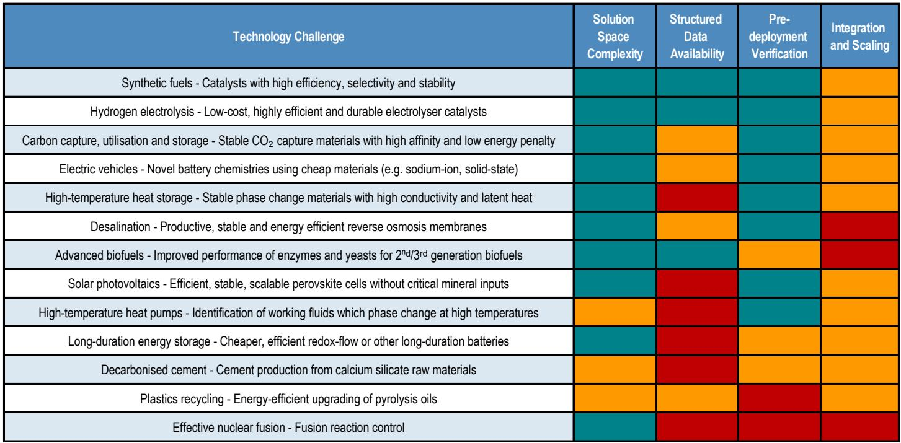
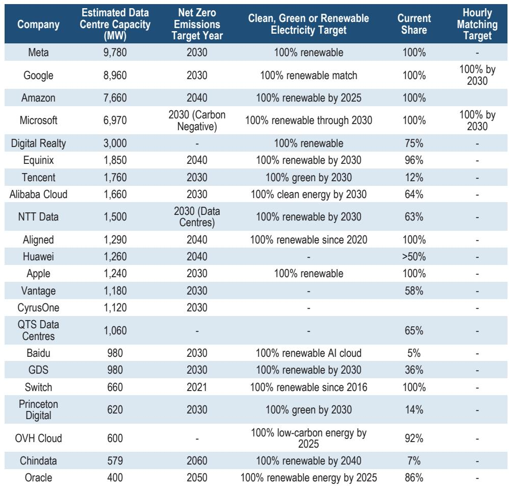
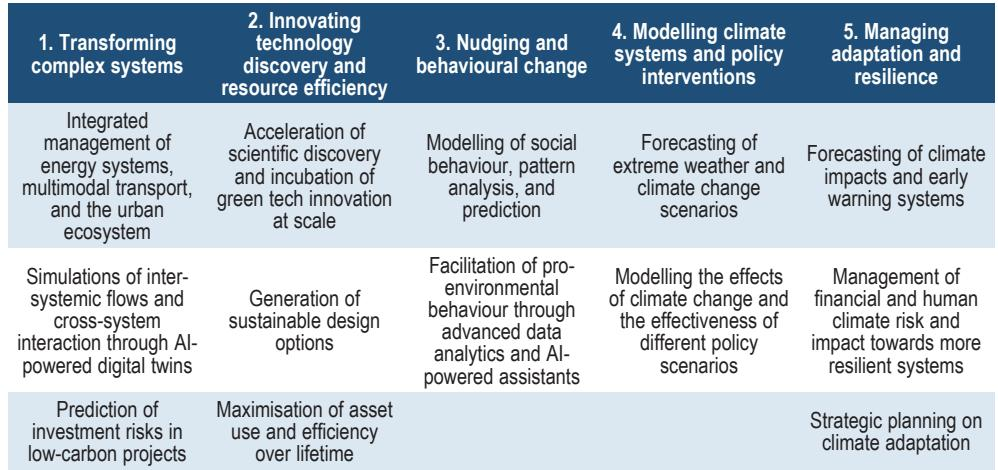

# AI's Energy Paradox: Efficiency Gains Will Not Save Us From Surging Demand

The prevailing narrative around artificial intelligence and energy is dangerously incomplete. Most discussions frame the problem as a simple equation: AI data centers will consume enormous amounts of electricity, and the question is whether renewables can scale fast enough to meet that demand. This framing misses the deeper strategic tension that will define the next decade of energy markets and investment.

The real story is not about data center demand alone. It is about a self-reinforcing cycle in which AI simultaneously drives unprecedented electricity consumption growth while offering the tools to transform how that energy is produced, distributed, and consumed. The net outcome of this cycle is not predetermined. It depends on investment decisions being made today, regulatory frameworks being designed this year, and the pace at which AI itself can be applied to solve the very problems it creates.

A global investment bank report, drawing on the International Energy Agency's latest analysis, provides the data to understand this dynamic. But the report's conclusions point toward strategic questions that extend far beyond its pages. The critical insight for investors, policymakers, and corporate leaders is this: the next five years will see a convergence of forces that make the 2030 energy landscape look fundamentally different from today, and the companies that position themselves for this transformation will capture disproportionate value.

## Data Center Electricity Demand Will Double by 2030, But Physical Constraints Cap the Upside

The IEA's base case projects that data centers will double their share of global electricity consumption from 1.5% to 3% by 2030, rising from approximately 485 TWh to 950 TWh. This growth is not evenly distributed. The United States absorbs 45% of incremental demand, making data centers the single largest driver of U.S. electricity demand growth over the period, potentially accounting for 45% of the total increase.

What makes this projection strategically significant is not the number itself, but the forces that constrain it. The IEA's four scenarios—Base, Lift-Off, Headwinds, and High Efficiency—all converge through 2030 because of binding physical bottlenecks. Transformer lead times stretch to four years. Grid connection wait times average 4-5 years. Gas turbine availability is constrained. Memory chip supply is limited. Skilled labor is scarce. These are not financial constraints that can be solved with more capital. They are physical constraints that impose a hard ceiling on how fast the buildout can proceed.

The implication is counterintuitive but critical: the near-term path is more predictable than most investors assume. The uncertainty that dominates headlines about AI energy demand is real, but it applies primarily to the post-2030 period. For the next five years, the physical world imposes a discipline that financial markets cannot override.

## The Jevons Paradox is the Most Important Dynamic Investors Are Ignoring

The report documents something remarkable about AI energy efficiency. Per-query energy consumption has fallen by an order of magnitude in recent years. A Google Gemini text prompt consumes 0.24 Wh, comparable to a 2011 Google search. Hardware performance per watt has improved 30-40% annually. Best-in-class hyperscale facilities achieve power usage effectiveness ratios of 1.1-1.2, compared to 1.5-1.7 for older facilities.

Yet aggregate AI electricity consumption continues to climb. This is the Jevons Paradox in full force: as efficiency improves, the cost of computation falls, enabling more sophisticated use cases that consume far more energy per task. A simple text query consumes 0.05-0.3 Wh. A reasoning query consumes approximately 1 Wh. An agentic task with reasoning enabled can consume 50 Wh per task—two orders of magnitude more.

The strategic implication is profound. The report's analysis suggests that traditional per-query categories like text, image, and search explain less than 5% of projected inference demand. The remaining 75-85% comes from four high-intensity workload classes: agentic reasoning, video and multimodal processing, ambient assistants, and embedded enterprise inference. These are not hypothetical future use cases. They are being deployed today, and their energy intensity means that even aggressive efficiency improvements will not flatten the demand curve.

## AI's Potential to Reduce Energy Consumption is Real, But Concentrated in Specific Sectors

The IEA estimates that widespread adoption of existing AI applications could deliver energy savings equivalent to approximately 3% of global final energy consumption by 2035. When broken down by sector, the potential is substantial: up to $110 billion in annual savings in the power sector by 2035, 8% energy savings in light industry, energy savings equivalent to 120 million cars in transport, and approximately 300 TWh of electricity savings in buildings.

Corporate deployments are already demonstrating the potential. Saudi Aramco reported $2 billion in total realized value from AI in 2024. Equinor generated $130 million in direct AI value in 2025. Veolia achieved a 90% reduction in nitrous oxide emissions across 120 wastewater plants. Heidelberg Materials saved 380 million euros in 2025.

The pattern that emerges is clear: AI's energy efficiency benefits are real and measurable, but they are concentrated in industrial and infrastructure applications where the economic incentive to adopt is strong and the data required for training is available. The sectors that stand to benefit most are those with high energy costs, structured operational data, and clear monetization pathways for efficiency gains.

## The Net Climate Impact Question Cannot Be Answered Without Addressing Rebound Effects

The IEA's Widespread Adoption Case suggests that AI-enabled emissions reductions in end-use sectors could exceed data center emissions by 2035. But this conclusion comes with two critical caveats that the report explicitly acknowledges but does not fully resolve.

First, the pathway assumes that sector-wide barriers—limited data availability, poor interoperability between systems, and organizational resistance to change—are largely overcome. This is not a trivial assumption. The contrails case study illustrates the challenge: a Google-American Airlines trial achieved a 62% reduction in contrail formation on successfully executed flights, but only 11.6% across all eligible flights due to operational adoption barriers. Technology alone is insufficient.

Second, and more fundamentally, the analysis excludes rebound effects. When AI makes energy consumption more efficient, the cost of that consumption falls, potentially enabling new uses that partially or fully offset the savings. This is not a theoretical concern. The same Jevons Paradox that drives AI compute demand applies to energy efficiency: cheaper energy enables more energy consumption.

The report identifies a material distinction between traditional AI and generative AI that is often overlooked. Generative AI consumes 6-14 times more energy than traditional AI. Of 154 documented climate-benefit claims, 97% relate to traditional AI and only 3% to consumer generative systems, with no verifiable substantial emissions reductions attributable to generative AI. This distinction matters because the fastest-growing segment of AI deployment is also the segment with the weakest climate credentials.

## Local Opposition Has Become a First-Order Investment Risk

The report documents 98 local moratoriums on data center development and notes that souring public sentiment has become a material and accelerating risk. This is not peripheral noise. It is reshaping project siting, timelines, costs, and economics in ways that investors must treat as comparable to power availability and supply chain constraints.

The affordability concern is real but localized. The IEA finds no systematic relationship between load growth and retail electricity prices across major markets from 2019 to 2024. But national averages mask sharp localized pressures in data center clusters. In constrained markets, wholesale tightening and transmission congestion can drive prices higher. The critical question is not whether data centers raise prices, but which jurisdictions are building the institutions to prevent data center growth from raising consumer prices.

Three policy levers determine the path: cost allocation and tariff design, the pace of generation and transmission build-out, and the flexibility profile of the data center fleet. The IEA estimates that flexibility for just 0.1-1% of hours per year would suffice to integrate all projected new capacity through 2035. This is a remarkably small number, but achieving it requires intentional design of market structures and grid operations.

## A Decision Framework for Investors

The report provides the raw material for a strategic framework that investors can apply across sectors. The framework has three dimensions.

First, identify where physical constraints create bottlenecks. The companies that solve transformer lead times, grid connection delays, turbine availability, and memory supply will capture value regardless of which AI demand scenario materializes. The report's EMEA top picks—Legrand, Schneider Electric, Siemens, Siemens Energy, Prysmian, ASML, ASM International, Infineon, and Nokia—reflect this logic.

Second, distinguish between AI as a demand driver and AI as an efficiency enabler. Companies in the capital goods and IT hardware sectors benefit from both dynamics. Companies in energy-intensive industries benefit primarily from the efficiency side. The winners will be those that can monetize efficiency gains while managing exposure to demand-driven cost increases.

Third, assess the regulatory and political risk in each jurisdiction. The report's analysis of local opposition and affordability concerns suggests that the data center buildout will not proceed uniformly. Jurisdictions that pursue integrated, anticipatory growth will attract investment. Those that reactively accommodate growth in constrained systems will face sustained upward pressure on consumer prices and political backlash.

## What the Report Does Not Fully Answer

The report leaves several strategic questions unresolved. The most important is how the post-2030 divergence between scenarios will play out. The IEA's four scenarios diverge materially beyond 2030, but the report does not provide a framework for assessing which scenario is more likely. The answer depends on factors that are inherently uncertain: the pace of AI capability advancement, the emergence of new use cases, the resolution of supply chain constraints, and the evolution of regulatory frameworks.

A second unresolved question concerns the timing and magnitude of rebound effects. The report acknowledges that its net positive climate analysis excludes rebounds, but does not model what happens when efficiency gains enable new consumption patterns. This is not an academic gap. It is the central uncertainty in any assessment of AI's net energy and climate impact.

A third question concerns the credibility of Big Tech clean energy commitments. The report notes that the electricity intensity of Big Tech revenues has nearly doubled, and that only Alphabet and Microsoft have committed to 24/7 carbon-free energy by 2030, with Microsoft reportedly reconsidering. The proposed GHG Protocol Scope 2 overhaul—shifting from annual to hourly, location-matched accounting—has split the industry. The outcome of this debate will determine whether clean energy commitments translate into actual emissions reductions or remain aspirational targets.

## The Strategic Imperative

The convergence of AI and energy is not a sector-specific trend. It is a structural transformation that will reshape electricity markets, industrial competition, and investment returns for the next decade. The companies that understand the physical constraints, the efficiency paradox, and the regulatory dynamics will be positioned to navigate the uncertainty. Those that treat AI energy demand as a simple extrapolation of current trends will be caught off guard.

The report's data provides the foundation for this understanding. But the strategic implications extend beyond what any single report can capture. The questions it leaves unanswered are not weaknesses. They are invitations to deeper analysis.

Join the community to read the full report and review the original charts.

*This article is for learning and discussion only and does not constitute investment advice.*

Personal reading notes and learning share only. Not investment advice.

