# Semiconductors | North America

# Weekly: NVDA memory cuts? And Apr SIA

Potential reduction in Vera Rubin rack content is another indication of the intensity of the memory shortage; separately, we are raising our industry estimates post a strong April SIA report Friday.

NVDA DRAM cuts reflect tight supply conditions. There were reports this week from Semi Analysis that suggested NVIDIA was reducing LPDDR5 memory content from the Vera Rubin racks from 55 TB to 28 TB, reducing the SOCAMM memory module size from 192 GB to 96 GB.

While we are not sure that it will impact every rack, we were able to confirm that there have been some changes and that it least some racks will be shipped with this lower configuration. Given the importance of memory we suspect that the higher configurations will be available, if not immediately, then shortly after shipments begin in F3q.

The rack memory is a significant portion of overall global demand for DRAM; assuming that 53-70k racks are built next year, at 55 TB, the rack SOCAMM would approach 5% of global demand, so cutting that in half across the board - the most draconian figure - would be 2%+ impact (1.4 mm TB reduction for a 62mm TB market), but one which impacts a higher value portion of the market.

That said, all of our contacts would indicate that NVIDIA, and for that matter everyone in cloud, will buy every GB of SOCAMM that they can get, and our assumption would be that if they can catch up then they would return to higher configurations. This is entirely to ensure that the DRAM shortage has minimized impact to GPU rack sales, and is actually evidence that there is a true shortage not a double ordering window - and that incremental supply will be met wit incremental demand.

Overall SIA data was stronger than expected for April, driven by both broad markets and memory. April Semiconductor Industry Association billings data reported on Friday, June 5th, came in higher than our estimates and seasonality for broad markets and memory:

- Overall: Sales were down 2.2% m/m, above our estimate of -12.1% and above the 10-yr average change of -10.6%. 3-month y/y growth accelerated to 93.9% from 79.1%, and one month y/y growth was 106.4%.   
- Trend by geography (y/y): The Americas (+158.5%) was followed by Asia Pacific (+113.0%), China (+76.7%), Europe (+64.1%), and Japan (+25.7%).

Broad markets accelerated, following a broadly strong March:

MS & CO. LLC

# Joseph Moore

Equity Analyst

Joseph.Moore@morganstanley.com +1 212 761-7516

# Ella Tulchinsky

Research Associate

Ella.Tulchinsky@morganstanley.com +1 212 761-2222

# Nicole Kozhukhov

Research Associate

Nicole.Kozhukhov@morganstanley.com +1 212 761-1636

# Mason Wayne

Research Associate

Mason.Wayne@morganstanley.com +1 212 761-6012

# Shane Brett

Equity Analyst

Shane.Brett@morganstanley.com +1 212 761-1022

2026 EXTEL

ALL-AMERICA RESEARCH POLL

May 26 – June, 12 2026

VIEW OUR ANALYSTS >

# SEMICONDUCTORS

North America

Industry View

Attractive

MS does and seeks to do business with companies covered in MS. As a result, investors should be aware that the firm may have a conflict of interest that could affect the objectivity of MS. Investors should consider MS as only a single factor in making their investment decision.

For analyst certification and other important disclosures, refer to the Disclosure Section, located at the end of this report.

- Discrete (beat): -3.4% m/m vs our estimate of -8.0% and the 10-yr average change of -9.7%. Units were above the 10-yr average (0.2% vs -7.2%) while ASP was below (-3.6% vs -2.6%).   
- Analog (beat): -2.7% m/m vs our estimate of -6.0% and 10-yr average of -9.1%. Units were above the 10-yr average (-7.1% vs -8.9%) and ASP was above (4.4% vs -3.5%).   
- MCU (beat): -3.1% m/m vs our estimate of -9.0% and 10-yr average change of -12.2%. Units were above the 10-yr average (-7.1% vs -8.9%) and ASP was above (4.4% vs -3.5%).   
- MPU (beat): -0.2% m/m vs our estimate of -2.5% and 10-yr average change of -6.3%.

April built on an accelerating March, continuing to align with positive JunQ guides from suppliers. From the commentary we have heard intra-quarter, the cycle continues to improve, with Industrial in particular re-accelerating from cyclical lows and broadening out to non-AI-related areas. And while we have seen pricing increases across the supply chain, we'd note that the largest driver is cost pass-through versus value recapture, ex a few companies such as ADI. AI continues to outpace, and while we still are hearing there is no replenishment cycle, visibility into a 2H acceleration looks stronger.

In analog, the 3-month average y/y growth accelerated from 21.9% to 22.4%, led by Application Specific. MCUs' 3-month average y/y growth decelerated to 13.2% from 16.9% in March, with growth decelerating in both General Purpose and Application Specific, though the latter at a slower rate.

Exhibit 1: Global Semiconductor Sales   
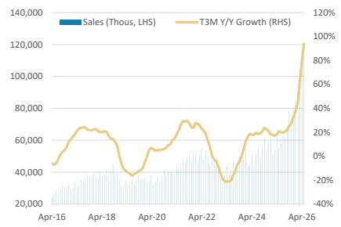

bar_line

| Date   | Sales (Thous, LHS) | T3M Y/Y Growth (RHS) |
|--------|--------------------|----------------------|
| Apr-16 | ~45,000            | ~45%                 |
| Apr-18 | ~65,000            | ~65%                 |
| Apr-20 | ~40,000            | ~40%                 |
| Apr-22 | ~70,000            | ~70%                 |
| Apr-24 | ~30,000            | ~30%                 |
| Apr-26 | ~120,000           | ~120%                |

Source: SIA, MS

Exhibit 2: Semiconductor Sales by Region   
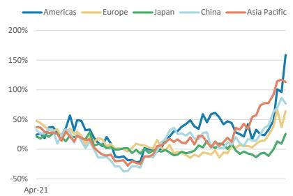

line

| Date   | Americas | Europe | Japan | China | Asia Pacific |
|--------|----------|--------|-------|-------|--------------|
| Apr-21 | ~30%     | ~40%   | ~20%  | ~20%  | ~30%         |
|        |          |        |       |       |              |

Source: SIA, MS

Memory was strong in April, with both NAND and DRAM outperforming seasonality and our estimates:

\- DRAM: Above expectation and 5-yr average, coming in at -3.7% m/m vs our estimate of -24.2% m/m and 5-yr average of -27.6%. Bits were above our estimate (-16.5% vs -31.7%) m/m, up 52.8% y/y), while ASP was above (15.3% vs 10.0%). On a 3-month y/y basis, total DRAM sales reached 298.5% in April, marking a new historical high since 2001, while ASP growth (188.1%) has now increased for nine consecutive quarters.

\- NAND: Above expectation and the 5-yr average, coming in at -4.2% m/m vs our estimate of -11.2% and 5-yr average of -13.9%. Bits were above our estimate (-20.9% m/m vs -22.8%) again likely reflecting constraints, while ASPs were above (up 21.0% m/m vs 15.0%- prices were up 281.6% y/y). On a 3-month average y/y basis, revenue reached 307.0% in April, also marking a new record in our dataset's history, while ASP growth of 213.4% also marked a new record and volume decelerated slightly to 30.7% from 36.8% in March.

The April data reinforces our view that there is no quick fix to the memory shortage, with DRAM increasingly the principal bottleneck to the AI buildout and NAND also very tight as hyperscalers continue to absorb higher-performance supply. We think the strength is still primarily supply/demand driven rather than an inventory-led cycle, with HBM wafer intensity, cleanroom/EUV constraints, and limited incremental NAND capacity all supporting a higher-for-longer pricing environment. While investors remain focused on the durability debate, we would view LTAs as a symptom of tight supply and hyperscaler urgency to secure capacity, rather than the cause of the cycle. We continue to view memory supply as a critical constraint on AI, which should support unusually strong DRAM pricing, a more durable NAND recovery, and continued ownership of that exposure through MU and SNDK.

Changes to our forecast: Our forecast comes up from +91% to +103% for this year, reflecting strength across the board but mainly memory, where our CY26 forecast increases from \$807bn to \$880bn, as 3q pricing is starting to look higher than our previous forecast. For CY27, we are assuming 22% growth y/y to \$1.96 trillion, mostly due to memory pricing rippling through.

Our take: April SIA adds another datapoint that this is less of a narrow AI cycle and increasingly a broader supply-constrained upcycle. Memory remains the most obvious expression of that, with DRAM now a principal bottleneck to the AI buildout and NAND also tightening as hyperscalers absorb higher-performance supply. We would continue to own that exposure through MU and SNDK, particularly given the lack of a quick supply response and the increasing evidence that pricing strength can last longer than investors had expected. At the same time, the better-than-seasonal broad-market data reinforces what suppliers have been saying intra-quarter: Industrial is re-accelerating from cyclical lows, demand is broadening into non-AI areas, and inventory digestion is moving further into the rear-view. That combination keeps us constructive on leading-edge logic beneficiaries including NVDA, AVGO, and ALAB, cap equipment / supply-chain beneficiaries including LRCX, KLAC, and MKSI, and broader analog / MCU suppliers such as ADI, NXP, and ALGM as the broad-market cycle accelerates.

# SIA Note Charts

Exhibit 3: April 2026 Semiconductor Sales by Product (Y/Y)   
April 2026 Semiconductor Sales by Product (Y/Y)   
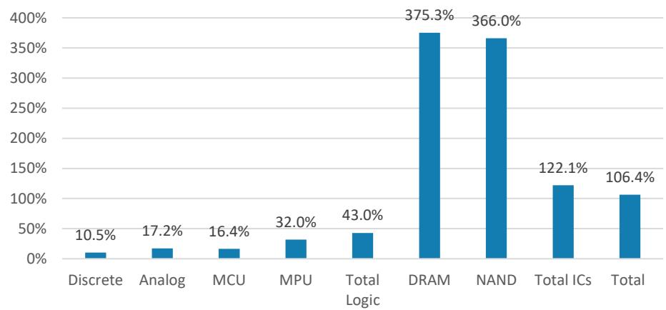

bar

| Category | Value (%) |
| :--- | :--- |
| Discrete | 10.5 |
| Analog | 17.2 |
| MCU | 16.4 |
| MPU | 32.0 |
| Total Logic | 43.0 |
| DRAM | 375.3 |
| NAND | 366.0 |
| Total ICs | 122.1 |
| Total | 106.4 |

Source: SIA, MS

Exhibit 4: Variance Table 

<table><tr><td>Reported Item ($ mn)</td><td>April 2026 Actual</td><td>April 2026 Est.</td><td>Difference (Act-Est)</td><td>Last Mth</td><td>MoM</td><td>Last Yr</td><td>YoY</td><td>Last Mth (Before Revision)</td><td>Last Mth Revised vs. Reported</td></tr><tr><td>Discrete / Opto / Sensors Sales</td><td>8,521</td><td>8,117</td><td>5.0%</td><td>8,823</td><td>-3.4%</td><td>7,714</td><td>10.5%</td><td>8,823</td><td></td></tr><tr><td>Analog Sales</td><td>7,917</td><td>7,650</td><td>3.5%</td><td>8,138</td><td>-2.7%</td><td>6,757</td><td>17.2%</td><td>8,138</td><td></td></tr><tr><td>MCU Sales</td><td>2,049</td><td>1,924</td><td>6.5%</td><td>2,114</td><td>-3.1%</td><td>1,760</td><td>16.4%</td><td>2,114</td><td>0</td></tr><tr><td>MPU Sales</td><td>5,745</td><td>5,614</td><td>2.3%</td><td>5,758</td><td>-0.2%</td><td>4,352</td><td>32.0%</td><td>5,758</td><td>0</td></tr><tr><td>Total Micro Sales</td><td>8,017</td><td>7,754</td><td>3.4%</td><td>8,088</td><td>-0.9%</td><td>6,361</td><td>26.0%</td><td>8,088</td><td>0</td></tr><tr><td>Total Logic (ex Micro) Sales</td><td>32,569</td><td>31,417</td><td>3.7%</td><td>32,388</td><td>0.6%</td><td>22,026</td><td>47.9%</td><td>32,388</td><td></td></tr><tr><td>Total Logic Sales</td><td>40,586</td><td>39,171</td><td>3.6%</td><td>40,476</td><td>0.3%</td><td>28,387</td><td>43.0%</td><td>40,476</td><td></td></tr><tr><td>DRAM Sales</td><td>37,566</td><td>29,573</td><td>27.0%</td><td>39,028</td><td>-3.7%</td><td>7,904</td><td>375.3%</td><td>39,028</td><td>0</td></tr><tr><td>DRAM Gigabit Equivalents</td><td>28,417,085</td><td>23,447,461</td><td>21.2%</td><td>34,037,628</td><td>-16.5%</td><td>18,598,712</td><td>52.8%</td><td>34,037,628</td><td>0</td></tr><tr><td>DRAM Price per Gb Equivalent</td><td>$1.3220</td><td>$1.2613</td><td>4.8%</td><td>$1.1466</td><td>15.3%</td><td>$0.4250</td><td>211.1%</td><td>$1.1466</td><td>$0.0000</td></tr><tr><td>NAND Sales</td><td>18,349</td><td>17,016</td><td>7.8%</td><td>19,160</td><td>-4.2%</td><td>3,937</td><td>366.0%</td><td>19,160</td><td></td></tr><tr><td>NAND 1 Gigabit Equivalent</td><td>613,243,576</td><td>598,396,859</td><td>2.5%</td><td>774,855,320</td><td>-20.9%</td><td>502,098,632</td><td>22.1%</td><td>774,855,320</td><td></td></tr><tr><td>NAND Price per Gb Equivalent</td><td>$0.0299</td><td>$0.0284</td><td>5.2%</td><td>$0.0247</td><td>21.0%</td><td>$0.0078</td><td>281.6%</td><td>$0.0247</td><td></td></tr><tr><td>Total Memory Sales</td><td>56,654</td><td>47,174</td><td>20.1%</td><td>58,772</td><td>-3.6%</td><td>12,208</td><td>364.1%</td><td>58,772</td><td>0</td></tr><tr><td>Total ICs</td><td>105,156</td><td>93,994</td><td>11.9%</td><td>107,386</td><td>-2.1%</td><td>47,351</td><td>122.1%</td><td>107,386</td><td>0</td></tr><tr><td>Semiconductor Sales</td><td>113,677</td><td>102,112</td><td>11.3%</td><td>116,210</td><td>-2.2%</td><td>55,066</td><td>106.4%</td><td>116,210</td><td>0</td></tr></table>

Source: SIA, MS

Exhibit 5: Quarterly SIA Data 

<table><tr><td></td><td>Mar/24A</td><td>Jun/24A</td><td>Sep/24A</td><td>Dec/24A</td><td>Mar/25A</td><td>Jun/25A</td><td>Sep/25A</td><td>Dec/25A</td><td>Mar/26A</td><td>Jun/26E</td><td>Sep/26E</td><td>Dec/26E</td></tr><tr><td colspan="13">Revenues ($ Millions)</td></tr><tr><td>Discretes / Optos / Sensors</td><td>22,185</td><td>21,383</td><td>24,285</td><td>23,191</td><td>21,519</td><td>22,629</td><td>25,449</td><td>24,905</td><td>23,996</td><td>26,151</td><td>28,532</td><td>28,388</td></tr><tr><td>Analog</td><td>19,276</td><td>19,011</td><td>20,648</td><td>20,653</td><td>19,813</td><td>20,186</td><td>23,052</td><td>23,396</td><td>22,756</td><td>24,209</td><td>26,095</td><td>26,468</td></tr><tr><td>MCU</td><td>5,751</td><td>5,409</td><td>5,512</td><td>5,087</td><td>4,950</td><td>5,326</td><td>5,694</td><td>5,628</td><td>5,788</td><td>6,466</td><td>6,735</td><td>6,722</td></tr><tr><td>MPU</td><td>12,124</td><td>13,276</td><td>13,911</td><td>14,860</td><td>13,606</td><td>13,943</td><td>15,894</td><td>17,615</td><td>16,548</td><td>18,078</td><td>19,410</td><td>20,579</td></tr><tr><td>Other</td><td>651</td><td>658</td><td>690</td><td>703</td><td>728</td><td>752</td><td>813</td><td>768</td><td>565</td><td>669</td><td>100</td><td>100</td></tr><tr><td>Total Micro</td><td>18,526</td><td>19,343</td><td>20,114</td><td>20,650</td><td>19,284</td><td>20,021</td><td>22,401</td><td>24,011</td><td>22,902</td><td>25,213</td><td>26,245</td><td>27,400</td></tr><tr><td>Logic (ex Micro)</td><td>48,462</td><td>49,479</td><td>56,194</td><td>61,634</td><td>65,356</td><td>68,892</td><td>78,853</td><td>88,783</td><td>91,117</td><td>101,338</td><td>109,583</td><td>117,024</td></tr><tr><td>Total Logic</td><td>66,988</td><td>68,822</td><td>76,307</td><td>82,283</td><td>84,640</td><td>88,913</td><td>101,254</td><td>112,794</td><td>114,019</td><td>126,550</td><td>135,828</td><td>144,424</td></tr><tr><td>DRAM</td><td>18,175</td><td>22,269</td><td>26,173</td><td>28,243</td><td>27,074</td><td>31,635</td><td>39,949</td><td>51,939</td><td>93,436</td><td>147,692</td><td>163,222</td><td>177,551</td></tr><tr><td>NAND</td><td>13,472</td><td>17,813</td><td>18,003</td><td>17,140</td><td>12,617</td><td>15,404</td><td>17,382</td><td>22,282</td><td>42,794</td><td>76,274</td><td>84,702</td><td>89,738</td></tr><tr><td>Other</td><td>1,039</td><td>1,010</td><td>1,133</td><td>1,048</td><td>1,070</td><td>1,154</td><td>1,310</td><td>1,329</td><td>1,544</td><td>2,214</td><td>2,214</td><td>2,214</td></tr><tr><td>Total Memory</td><td>32,685</td><td>41,092</td><td>45,308</td><td>46,431</td><td>40,761</td><td>48,193</td><td>58,641</td><td>76,550</td><td>137,775</td><td>226,179</td><td>250,138</td><td>269,503</td></tr><tr><td>Total ICs</td><td>118,949</td><td>128,925</td><td>142,263</td><td>149,367</td><td>145,214</td><td>157,293</td><td>182,946</td><td>211,740</td><td>274,550</td><td>376,939</td><td>412,061</td><td>440,396</td></tr><tr><td>Total Semiconductor</td><td>141,134</td><td>150,308</td><td>166,547</td><td>172,558</td><td>166,732</td><td>179,921</td><td>208,395</td><td>236,645</td><td>298,546</td><td>403,090</td><td>440,593</td><td>468,783</td></tr><tr><td>Q/Q Change</td><td>-3.3%</td><td>6.5%</td><td>10.8%</td><td>3.6%</td><td>-3.4%</td><td>7.9%</td><td>15.8%</td><td>13.6%</td><td>26.2%</td><td>35.0%</td><td>9.3%</td><td>6.4%</td></tr><tr><td>Y/Y Change</td><td>18.1%</td><td>18.6%</td><td>23.7%</td><td>18.2%</td><td>18.1%</td><td>19.7%</td><td>25.1%</td><td>37.1%</td><td>79.1%</td><td>124.0%</td><td>111.4%</td><td>98.1%</td></tr></table>

Source: SIA, MS

Exhibit 6: Annual SIA Data 

<table><tr><td></td><td>2010A</td><td>2017A</td><td>2018A</td><td>2019A</td><td>2020A</td><td>2021A</td><td>2022A</td><td>2023A</td><td>2024A</td><td>2025A</td><td>2026E</td><td>2027E</td></tr><tr><td colspan="13">Revenues ($ Millions)</td></tr><tr><td>Discretes / Optos / Sensors</td><td>48,406</td><td>69,087</td><td>75,446</td><td>78,953</td><td>79,164</td><td>92,945</td><td>99,591</td><td>98,359</td><td>91,044</td><td>94,502</td><td>107,066</td><td>114,712</td></tr><tr><td>Analog</td><td>42,285</td><td>53,069</td><td>58,380</td><td>53,939</td><td>55,658</td><td>73,816</td><td>88,919</td><td>81,146</td><td>79,588</td><td>86,447</td><td>99,529</td><td>108,504</td></tr><tr><td>MCU</td><td>14,799</td><td>16,430</td><td>17,027</td><td>15,808</td><td>15,484</td><td>19,622</td><td>25,030</td><td>27,861</td><td>21,758</td><td>21,597</td><td>25,711</td><td>28,489</td></tr><tr><td>MPU</td><td>39,927</td><td>44,370</td><td>46,371</td><td>47,974</td><td>51,812</td><td>56,766</td><td>51,299</td><td>45,480</td><td>54,172</td><td>61,059</td><td>74,614</td><td>83,018</td></tr><tr><td>Other</td><td>5,908</td><td>3,286</td><td>3,262</td><td>2,658</td><td>2,382</td><td>2,845</td><td>3,217</td><td>3,172</td><td>2,702</td><td>3,062</td><td>1,434</td><td>400</td></tr><tr><td>Total Micro</td><td>60,633</td><td>64,086</td><td>66,660</td><td>66,440</td><td>69,678</td><td>79,234</td><td>79,546</td><td>76,513</td><td>78,633</td><td>85,718</td><td>101,760</td><td>111,907</td></tr><tr><td>Logic (ex Micro)</td><td>77,377</td><td>102,196</td><td>109,411</td><td>106,535</td><td>118,408</td><td>153,710</td><td>176,097</td><td>178,493</td><td>215,768</td><td>301,883</td><td>419,062</td><td>500,028</td></tr><tr><td>Total Logic</td><td>138,010</td><td>166,281</td><td>176,071</td><td>172,975</td><td>188,086</td><td>232,944</td><td>255,643</td><td>255,006</td><td>294,401</td><td>387,601</td><td>520,822</td><td>611,935</td></tr><tr><td>DRAM</td><td>39,210</td><td>72,802</td><td>98,604</td><td>62,475</td><td>64,324</td><td>92,960</td><td>77,769</td><td>51,945</td><td>94,860</td><td>150,598</td><td>581,901</td><td>675,059</td></tr><tr><td>NAND</td><td>21,735</td><td>47,227</td><td>54,263</td><td>40,180</td><td>49,390</td><td>55,953</td><td>47,109</td><td>36,104</td><td>66,427</td><td>67,685</td><td>293,508</td><td>445,443</td></tr><tr><td>Other</td><td>8,669</td><td>3,946</td><td>4,428</td><td>3,785</td><td>3,769</td><td>4,921</td><td>4,948</td><td>4,261</td><td>4,229</td><td>4,229</td><td>4,229</td><td>4,229</td></tr><tr><td>Total Memory</td><td>69,614</td><td>123,976</td><td>157,295</td><td>106,440</td><td>117,482</td><td>153,834</td><td>129,825</td><td>92,309</td><td>165,516</td><td>222,512</td><td>879,638</td><td>1,124,732</td></tr><tr><td>Total ICs</td><td>249,909</td><td>343,326</td><td>391,746</td><td>333,354</td><td>361,226</td><td>460,594</td><td>474,388</td><td>428,461</td><td>539,505</td><td>696,560</td><td>1,499,989</td><td>1,845,171</td></tr><tr><td>Total Semiconductor</td><td>298,315</td><td>412,414</td><td>467,192</td><td>412,307</td><td>440,389</td><td>553,540</td><td>573,978</td><td>526,820</td><td>630,549</td><td>791,061</td><td>1,607,055</td><td>1,959,883</td></tr><tr><td>Y/Y % Growth</td><td>31.8%</td><td>21.7%</td><td>13.3%</td><td>-11.7%</td><td>6.8%</td><td>25.7%</td><td>3.7%</td><td>-8.2%</td><td>19.7%</td><td>25.5%</td><td>103.2%</td><td>22.0%</td></tr><tr><td>5 year CAGR</td><td>6.0%</td><td>7.2%</td><td>8.9%</td><td>4.2%</td><td>5.6%</td><td>10.3%</td><td>6.8%</td><td>2.4%</td><td>8.9%</td><td>12.4%</td><td>23.8%</td><td>27.8%</td></tr><tr><td>10 year CAGR</td><td>3.9%</td><td>4.9%</td><td>6.5%</td><td>6.2%</td><td>4.0%</td><td>6.3%</td><td>7.0%</td><td>5.6%</td><td>6.5%</td><td>9.0%</td><td>16.8%</td><td>16.9%</td></tr><tr><td>Y/Y Real Growth</td><td>30.0%</td><td>19.5%</td><td>11.0%</td><td>-13.1%</td><td>6.0%</td><td>21.7%</td><td>-3.4%</td><td>-12.3%</td><td>16.7%</td><td>23.0%</td><td>99.2%</td><td>19.6%</td></tr></table>

Source: SIA, MS

# Semiconductor Coverage – Valuation / Stock Performance

Exhibit 7: Weekly stock performance   
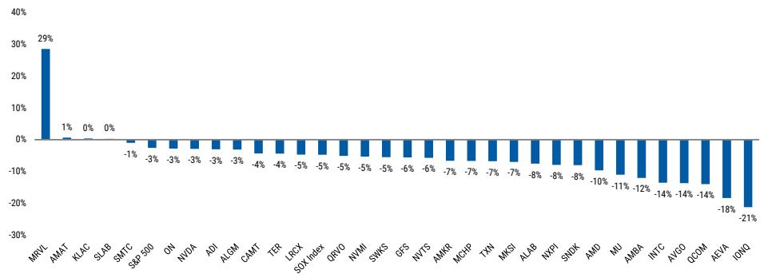

bar

| Ticker | Value (%) |
| :--- | :--- |
| MRVL | 29 |
| AMAT | 1 |
| KLAC | 0 |
| SLAB | 0 |
| SMTC | -1 |
| S&P 500 | -3 |
| ON | -3 |
| NVDA | -3 |
| ADI | -3 |
| ALGM | -3 |
| CAMT | -4 |
| TER | -4 |
| LRCX | -5 |
| SOX Index | -5 |
| QIRVO | -5 |
| NVMI | -5 |
| SWKS | -5 |
| GFS | -6 |
| NVTS | -6 |
| AMKR | -7 |
| MCHP | -7 |
| TXN | -7 |
| MKSI | -7 |
| ALAB | -8 |
| NXPI | -8 |
| SNDK | -8 |
| AMD | -10 |
| MU | -11 |
| AMBA | -12 |
| INTC | -14 |
| AVGO | -14 |
| OCOM | -14 |
| AEVA | -18 |
| IONO | -21 |

Source: FactSet, MS

Exhibit 8: Monthly stock performance   
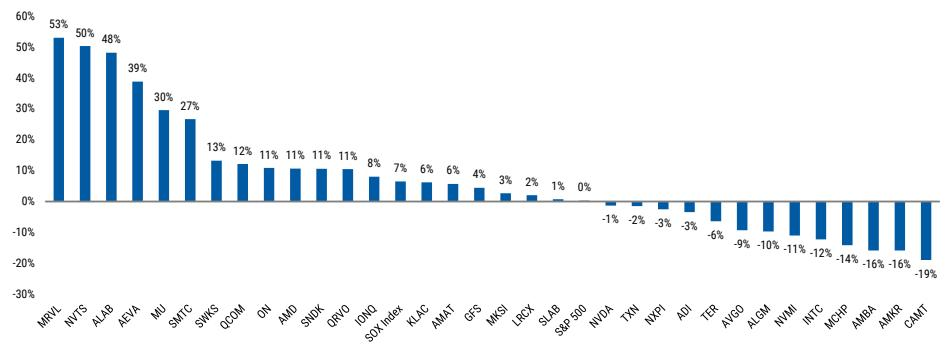

bar

| Entity | Value (%) |
| :--- | :--- |
| MRVL | 53 |
| NVTS | 50 |
| ALAB | 48 |
| AEVA | 39 |
| MU | 30 |
| SMTC | 27 |
| SWKS | 13 |
| QCOM | 12 |
| ON | 11 |
| AMD | 11 |
| SNDK | 11 |
| DRVO | 11 |
| IONQ | 8 |
| SOX Index | 7 |
| KLAC | 6 |
| AMAT | 6 |
| GFS | 4 |
| MKSI | 3 |
| LRCK | 2 |
| SLAB | 1 |
| S&P 500 | 0 |
| NVDA | -1 |
| TXN | -2 |
| NKPI | -3 |
| ADI | -3 |
| TER | -6 |
| AVGO | -9 |
| ALGM | -10 |
| NVMI | -11 |
| INTC | -12 |
| MCHP | -14 |
| AMBA | -16 |
| AMKR | -16 |
| CAMT | -19 |

Source: FactSet, MS

Exhibit 9: YTD stock performance   
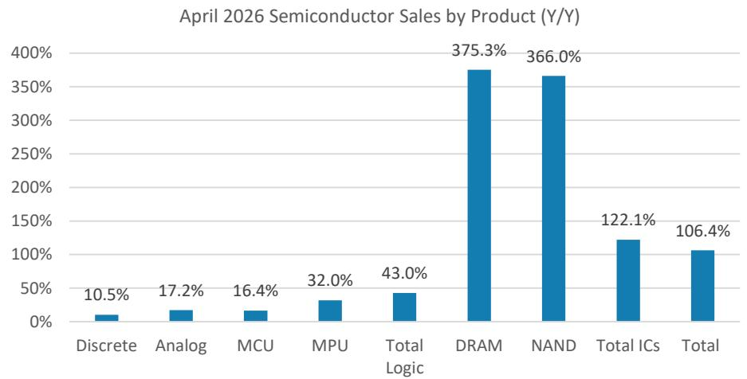

bar

April 2026 Semiconductor Sales by Product (Y/Y)
| Product | Y/Y (%) |
| :--- | :--- |
| Discrete | 10.5 |
| Analog | 17.2 |
| MCU | 16.4 |
| MPU | 32.0 |
| Total Logic | 43.0 |
| DRAM | 375.3 |
| NAND | 366.0 |
| Total ICs | 122.1 |
| Total | 106.4 |

Source: FactSet, MS

# Semis Week Ahead

Exhibit 10: June 8th - June 12th, 2026

Monday, June 8th

Tuesday, June 9th

PCIM Europe -Day 1

https://pcim.mesago.com/nuernberg/en/expo.html

Wednesday, June 10th

PCIM Europe -Day 2

https://pcim.mesago.com/nuernberg/en/expo.html

Thursday, June 11th

PCIM Europe -Day 3

https://pcim.mesago.com/nuernberg/en/expo.html

Friday, June 12th

LOOKING AHEAD

Wednesday, June 24th

QCOM Investor Day

MU Earnings

4:30pm ET

Thursday, June 25th

Renesas Capital Markets Day

Thursday, July 23rd

AMD Advancing AI

https://www.youtube.com/@AMD/streams

Wednesday, September 16th

ON Financial Analyst Day

2:00pm ET

Source: Bloomberg, Refinitiv, MS

# Semiconductor Coverage

Exhibit 11: Semiconductors - Risk Reward 

<table><tr><td rowspan="2">Ticker</td><td rowspan="2">Rating</td><td rowspan="2">Price</td><td colspan="3">Risk-Reward</td><td rowspan="2">% Upside / Downside Base</td></tr><tr><td>Bear</td><td>Base</td><td>Bull</td></tr><tr><td colspan="7">Computing</td></tr><tr><td>AMD</td><td>EW</td><td>$466.4</td><td>$210</td><td>$410</td><td>$570</td><td>-12%</td></tr><tr><td>INTC</td><td>EW</td><td>$99.2</td><td>$43</td><td>$73</td><td>$110</td><td>-26%</td></tr><tr><td>NVDA</td><td>OW</td><td>$205.1</td><td>$160</td><td>$288</td><td>$330</td><td>40%</td></tr><tr><td colspan="7">Memory</td></tr><tr><td>MU</td><td>OW</td><td>$864.0</td><td>$675</td><td>$1,050</td><td>$1,650</td><td>22%</td></tr><tr><td>SNDK</td><td>OW</td><td>$1,559.3</td><td>$1,100</td><td>$1,750</td><td>$2,635</td><td>12%</td></tr><tr><td colspan="7">Capital Equipment</td></tr><tr><td>AMAT</td><td>EW</td><td>$453.0</td><td>$330</td><td>$502</td><td>$693</td><td>11%</td></tr><tr><td>CAMT</td><td>EW</td><td>$164.2</td><td>$118</td><td>$163</td><td>$214</td><td>-1%</td></tr><tr><td>KLAC</td><td>OW</td><td>$1,929.2</td><td>$1,367</td><td>$1,900</td><td>$2,334</td><td>-2%</td></tr><tr><td>LRCX</td><td>OW</td><td>$303.3</td><td>$219</td><td>$331</td><td>$436</td><td>9%</td></tr><tr><td>MKSI</td><td>OW</td><td>$301.7</td><td>$234</td><td>$374</td><td>$506</td><td>24%</td></tr><tr><td>NVMI</td><td>EW</td><td>$475.8</td><td>$366</td><td>$494</td><td>$643</td><td>4%</td></tr><tr><td>TER</td><td>EW</td><td>$357.9</td><td>$267</td><td>$387</td><td>$512</td><td>8%</td></tr><tr><td colspan="7">Comm-IC / Multi-Market</td></tr><tr><td>ALAB</td><td>OW</td><td>$317.1</td><td>$121</td><td>$240</td><td>$332</td><td>-24%</td></tr><tr><td>AMBA</td><td>OW</td><td>$63.5</td><td>$34</td><td>$96</td><td>$136</td><td>51%</td></tr><tr><td>AVGO</td><td>OW</td><td>$385.7</td><td>$308</td><td>$502</td><td>$637</td><td>30%</td></tr><tr><td>MRVL</td><td>EW</td><td>$263.5</td><td>$130</td><td>$195</td><td>$286</td><td>-26%</td></tr><tr><td>QCOM</td><td>UW</td><td>$215.9</td><td>$94</td><td>$146</td><td>$199</td><td>-32%</td></tr><tr><td>QRVO</td><td>EW</td><td>$98.3</td><td>$40</td><td>$84</td><td>$110</td><td>-15%</td></tr><tr><td>SMTC</td><td>EW</td><td>$151.0</td><td>$95</td><td>$175</td><td>$230</td><td>16%</td></tr><tr><td>SWKS</td><td>EW</td><td>$73.6</td><td>$43</td><td>$76</td><td>$105</td><td>3%</td></tr><tr><td colspan="7">Analog / MCUs</td></tr><tr><td>ADI</td><td>OW</td><td>$401.4</td><td>$342</td><td>$428</td><td>$517</td><td>7%</td></tr><tr><td>ALGM</td><td>OW</td><td>$46.4</td><td>$43</td><td>$51</td><td>$70</td><td>10%</td></tr><tr><td>MCHP</td><td>EW</td><td>$88.3</td><td>$69</td><td>$94</td><td>$118</td><td>6%</td></tr><tr><td>NVTS</td><td>UW</td><td>$25.1</td><td>$4.9</td><td>$13.7</td><td>$22.7</td><td>-45%</td></tr><tr><td>NXPI</td><td>OW</td><td>$296.0</td><td>$268</td><td>$335</td><td>$400</td><td>13%</td></tr><tr><td>ON</td><td>EW</td><td>$117.3</td><td>$62</td><td>$87</td><td>$115</td><td>-26%</td></tr><tr><td>SLAB</td><td>EW</td><td>$218.1</td><td>$83</td><td>$231</td><td>$265</td><td>6%</td></tr><tr><td>TXN</td><td>UW</td><td>$285.1</td><td>$184</td><td>$221</td><td>$263</td><td>-22%</td></tr><tr><td colspan="7">Components</td></tr><tr><td>AEVA</td><td>EW</td><td>$23.0</td><td>$4.5</td><td>$18.5</td><td>$52.0</td><td>-20%</td></tr><tr><td colspan="7">Foundry</td></tr><tr><td>GFS</td><td>EW</td><td>$75.5</td><td>$34</td><td>$58</td><td>$96</td><td>-23%</td></tr><tr><td>AMKR</td><td>EW</td><td>$65.0</td><td>$49</td><td>$69</td><td>$88</td><td>6%</td></tr><tr><td colspan="7">Quantum Computing</td></tr><tr><td>IONQ</td><td>EW</td><td>$56.8</td><td>$6</td><td>$48.5</td><td>$110</td><td>-15%</td></tr></table>

Source: FactSet, MS estimates

Exhibit 12: MS vs. Street 

<table><tr><td rowspan="2" colspan="2"></td><td colspan="3">CY2026e EPS</td><td rowspan="2"></td><td colspan="3">CY2026e Revenue</td></tr><tr><td>MS</td><td>Consensus</td><td>% Diff</td><td>MS</td><td>Consensus</td><td>% Diff</td></tr><tr><td rowspan="12">OW</td><td>ADI</td><td>$13.21</td><td>$12.69</td><td>(4%)</td><td>ADI</td><td>$15,499</td><td>$15,069</td><td>(3%)</td></tr><tr><td>ALAB</td><td>$2.88</td><td>$2.97</td><td>(8%)</td><td>ALAB</td><td>$1,532</td><td>$1,547</td><td>(1%)</td></tr><tr><td>ALGM</td><td>$0.93</td><td>$0.88</td><td>10%</td><td>ALGM</td><td>$1,048</td><td>$1,017</td><td>2%</td></tr><tr><td>AMBA</td><td>$0.74</td><td>$0.80</td><td>3%</td><td>AMBA</td><td>$443</td><td>$439</td><td>0%</td></tr><tr><td>AVGO</td><td>$13.68</td><td>$12.73</td><td>(3%)</td><td>AVGO</td><td>$123,943</td><td>$115,415</td><td>0%</td></tr><tr><td>KLAC</td><td>$43.86</td><td>$43.70</td><td>(1%)</td><td>KLAC</td><td>$15,335</td><td>$15,318</td><td>(0%)</td></tr><tr><td>LRCX</td><td>$7.00</td><td>$6.83</td><td>(0%)</td><td>LRCX</td><td>$27,067</td><td>$26,926</td><td>(0%)</td></tr><tr><td>MKSI</td><td>$11.70</td><td>$11.70</td><td>4%</td><td>MKSI</td><td>$4,793</td><td>$4,805</td><td>1%</td></tr><tr><td>MU</td><td>$81.93</td><td>$73.71</td><td>45%</td><td>MU</td><td>$144,942</td><td>$132,538</td><td>18%</td></tr><tr><td>NVDA</td><td>$4.77</td><td>$8.55</td><td>6%</td><td>NVDA</td><td>$215,938</td><td>$374,813</td><td>5%</td></tr><tr><td>NXPI</td><td>$14.96</td><td>$14.68</td><td>4%</td><td>NXPI</td><td>$14,138</td><td>$14,028</td><td>1%</td></tr><tr><td>SNDK</td><td>$161.07</td><td>$125.16</td><td>43%</td><td>SNDK</td><td>$38,078</td><td>$32,035</td><td>7%</td></tr><tr><td rowspan="17">EW</td><td>AEVA</td><td>-$1.80</td><td>-$1.68</td><td>2%</td><td>AEVA</td><td>$33</td><td>$33</td><td>(19%)</td></tr><tr><td>AMAT</td><td>$13.75</td><td>$12.90</td><td>2%</td><td>AMAT</td><td>$36,416</td><td>$34,815</td><td>3%</td></tr><tr><td>AMD</td><td>$7.22</td><td>$7.47</td><td>1%</td><td>AMD</td><td>$48,807</td><td>$49,875</td><td>(5%)</td></tr><tr><td>AMKR</td><td>$2.07</td><td>$2.08</td><td>(8%)</td><td>AMKR</td><td>$7,570</td><td>$7,610</td><td>(4%)</td></tr><tr><td>CAMT</td><td>$3.56</td><td>$3.50</td><td>10%</td><td>CAMT</td><td>$577</td><td>$571</td><td>5%</td></tr><tr><td>GFS</td><td>$1.94</td><td>$1.89</td><td>(4%)</td><td>GFS</td><td>$7,250</td><td>$7,238</td><td>(1%)</td></tr><tr><td>INTC</td><td>$1.12</td><td>$1.08</td><td>21%</td><td>INTC</td><td>$58,131</td><td>$58,496</td><td>0%</td></tr><tr><td>IONQ</td><td>-$0.54</td><td>-$0.35</td><td>(109%)</td><td>IONQ</td><td>$266</td><td>$263</td><td>3%</td></tr><tr><td>MCHP</td><td>$2.71</td><td>$2.78</td><td>(1%)</td><td>MCHP</td><td>$5,769</td><td>$5,811</td><td>2%</td></tr><tr><td>MRVL</td><td>$3.98</td><td>$3.93</td><td>3%</td><td>MRVL</td><td>$11,498</td><td>$11,188</td><td>2%</td></tr><tr><td>NVMI</td><td>$10.12</td><td>$10.47</td><td>1%</td><td>NVMI</td><td>$1,057</td><td>$1,064</td><td>4%</td></tr><tr><td>ON</td><td>$3.12</td><td>$3.09</td><td>8%</td><td>ON</td><td>$6,472</td><td>$6,466</td><td>(0%)</td></tr><tr><td>QRVO</td><td>$6.31</td><td>$6.91</td><td>(3%)</td><td>QRVO</td><td>$3,346</td><td>$3,514</td><td>(7%)</td></tr><tr><td>SLAB</td><td>$3.00</td><td>$2.77</td><td>9%</td><td>SLAB</td><td>$934</td><td>$922</td><td>1%</td></tr><tr><td>SMTC</td><td>$2.72</td><td>$2.58</td><td>(2%)</td><td>SMTC</td><td>$1,375</td><td>$1,331</td><td>0%</td></tr><tr><td>SWKS</td><td>$4.68</td><td>$5.04</td><td>(4%)</td><td>SWKS</td><td>$3,750</td><td>$3,947</td><td>(3%)</td></tr><tr><td>TER</td><td>$8.03</td><td>$7.37</td><td>0%</td><td>TER</td><td>$4,748</td><td>$4,518</td><td>2%</td></tr><tr><td rowspan="3">UW</td><td>NVTS</td><td>-$0.17</td><td>-$0.17</td><td>13%</td><td>NVTS</td><td>$43</td><td>$42</td><td>15%</td></tr><tr><td>QCOM</td><td>$9.39</td><td>$10.69</td><td>(100%)</td><td>QCOM</td><td>$40,152</td><td>$42,538</td><td>(100%)</td></tr><tr><td>TXN</td><td>$7.82</td><td>$7.60</td><td>(1%)</td><td>TXN</td><td>$21,035</td><td>$20,927</td><td>(1%)</td></tr></table>

Source: FactSet, MS estimates

# Revenue and EPS Growth

Exhibit 13: 2025-27e Revenue CAGR   
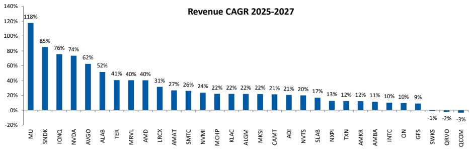

bar

Revenue CAGR 2025-2027
| Company | Revenue CAGR (%) |
|---|---|
| MU | 118 |
| SNDK | 85 |
| IONQ | 76 |
| NVDA | 74 |
| AVGO | 62 |
| ALAB | 52 |
| TER | 41 |
| MRVL | 40 |
| AMD | 40 |
| LRCX | 31 |
| AMAT | 27 |
| SMTC | 26 |
| NVMI | 24 |
| MCHP | 22 |
| KLAC | 22 |
| ALGM | 22 |
| MKSI | 22 |
| CAMT | 21 |
| ADI | 21 |
| NVTS | 20 |
| SLAB | 17 |
| NXPI | 13 |
| TXN | 12 |
| AMKR | 12 |
| AMBA | 11 |
| INTC | 10 |
| ON | 10 |
| GFS | 9 |
| SWKS | -1 |
| QRVO | -2 |
| QCOM | -3 |

Source: FactSet, MS estimates

Exhibit 14: 2025-27e EPS CAGR   
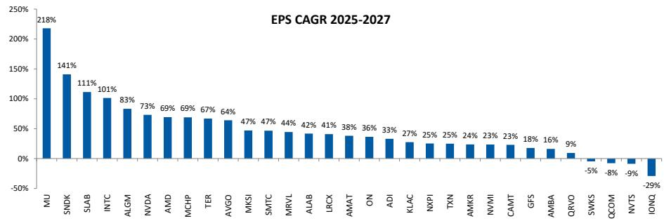

bar

EPS CAGR 2025-2027
| Company | EPS CAGR (%) |
|---|---|
| MU | 218 |
| SNDK | 141 |
| SLAB | 111 |
| INTC | 101 |
| ALGM | 83 |
| NVDA | 73 |
| AMD | 69 |
| MCHP | 69 |
| TER | 67 |
| AVGO | 64 |
| MKSI | 47 |
| SMTC | 47 |
| MRVL | 44 |
| ALAB | 42 |
| LR CX | 41 |
| AMAT | 38 |
| ON | 36 |
| ADI | 33 |
| KLAC | 27 |
| NXPI | 25 |
| TXN | 25 |
| AMKR | 24 |
| NVMI | 23 |
| CAMT | 23 |
| GFS | 18 |
| AMBA | 16 |
| QRVO | 9 |
| SWKS | -5 |
| QCOM | -8 |
| NVTS | -9 |
| IONQ | -29 |

Source: FactSet, MS estimates

# Inventory

Exhibit 15: Semiconductor Company inventory is at 111 days, up 3 days q/q which is 4 days behind of the seasonal decrease of 1 days. DOI is 22 days above the historical median and trailing 4-quarters slightly increased..

Semiconductor Company (DOI)   
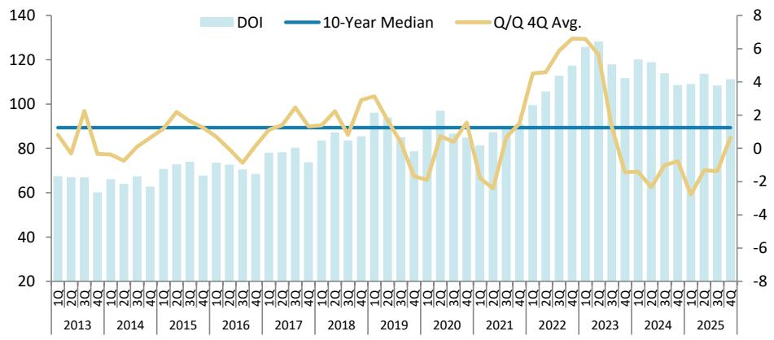

bar_line

| Year | DOI | 10-Year Median | Q/Q 4Q Avg. |
|------|-----|----------------|-------------|
| 2013 | 68  | 90             | 8           |
| 2014 | 67  | 90             | 7           |
| 2015 | 75  | 90             | 9           |
| 2016 | 73  | 90             | 7           |
| 2017 | 80  | 90             | 10          |
| 2018 | 85  | 90             | 9           |
| 2019 | 95  | 90             | 10          |
| 2020 | 98  | 90             | 8           |
| 2021 | 88  | 90             | -3          |
| 2022 | 115 | 90             | 7           |
| 2023 | 130 | 90             | 6           |
| 2024 | 118 | 90             | -2          |
| 2025 | 110 | 90             | -3          |

Source: FactSet, MS

Exhibit 16: Semi Customer DOI decreased 6 days sequentially to 52 days, below the seasonal decrease of 3 days. DOI is below the historical median and trailing 4 quarters increased from last quarter.

Semi Customers (DOI)   
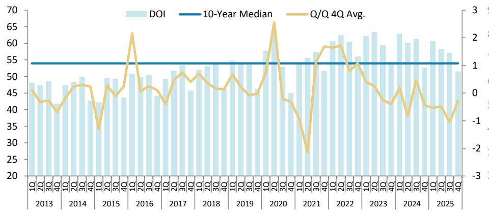

bar_line

| Year | DOI | 10-Year Median | Q/Q 4Q Avg. |
|------|-----|----------------|-------------|
| 2013 | 48  | 54             | 0           |
| 2014 | 49  | 54             | 0           |
| 2015 | 47  | 54             | 0           |
| 2016 | 51  | 54             | 0           |
| 2017 | 53  | 54             | 0           |
| 2018 | 52  | 54             | 0           |
| 2019 | 54  | 54             | 0           |
| 2020 | 57  | 54             | 0           |
| 2021 | 55  | 54             | -2          |
| 2022 | 60  | 54             | 1           |
| 2023 | 63  | 54             | -1          |
| 2024 | 61  | 54             | -1          |
| 2025 | 58  | 54             | -1          |

Source: FactSet, MS

Exhibit 17: Distributor inventory is at 63 days, down 2 days q/q, below the seasonal decline of 0 days. DOI is 9 days above the historical median while trailing 4-quarters decreased sequentially.   
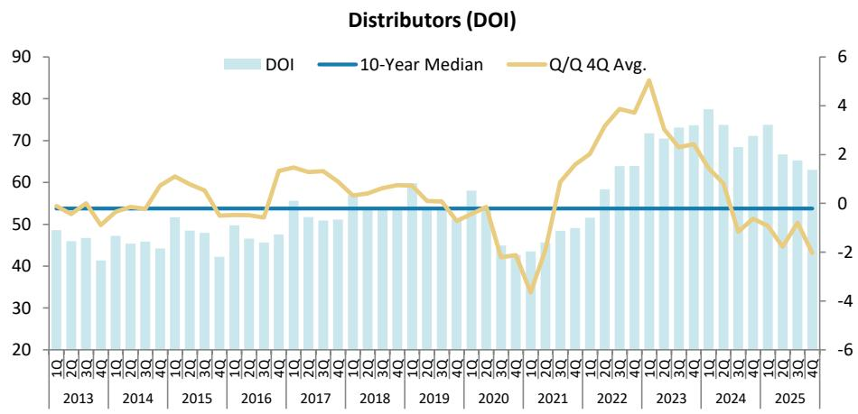  
Source: FactSet, MS

# Short Interest

Exhibit 18: Short Interest as % of Float 

<table><tr><td></td><td>5/Jun/25</td><td>6/Mar/26</td><td>5/Apr/26</td><td>6/May/26</td><td>5/Jun/26</td></tr><tr><td>ADI</td><td>1.5%</td><td>1.7%</td><td>2.0%</td><td>2.2%</td><td>1.9%</td></tr><tr><td>AEVA</td><td>5.8%</td><td>15.0%</td><td>13.3%</td><td>12.7%</td><td>12.5%</td></tr><tr><td>ALAB</td><td>6.2%</td><td>6.3%</td><td>9.0%</td><td>7.7%</td><td>7.2%</td></tr><tr><td>ALGM</td><td>7.0%</td><td>5.5%</td><td>6.4%</td><td>5.9%</td><td>5.6%</td></tr><tr><td>AMAT</td><td>2.1%</td><td>1.7%</td><td>1.6%</td><td>2.0%</td><td>2.3%</td></tr><tr><td>AMBA</td><td>3.4%</td><td>4.5%</td><td>4.8%</td><td>6.0%</td><td>5.5%</td></tr><tr><td>AMD</td><td>2.4%</td><td>2.1%</td><td>2.2%</td><td>2.2%</td><td>2.7%</td></tr><tr><td>AMKR</td><td>2.7%</td><td>3.4%</td><td>3.5%</td><td>3.0%</td><td>3.0%</td></tr><tr><td>AVGO</td><td>1.0%</td><td>1.0%</td><td>1.1%</td><td>1.1%</td><td>1.1%</td></tr><tr><td>CAMT</td><td>6.8%</td><td>6.8%</td><td>7.6%</td><td>6.6%</td><td>6.4%</td></tr><tr><td>GFS</td><td>1.7%</td><td>1.9%</td><td>3.1%</td><td>1.8%</td><td>1.7%</td></tr><tr><td>INTC</td><td>2.1%</td><td>2.4%</td><td>2.4%</td><td>2.8%</td><td>2.8%</td></tr><tr><td>IONQ</td><td>9.6%</td><td>23.0%</td><td>21.7%</td><td>22.4%</td><td>19.6%</td></tr><tr><td>KLAC</td><td>2.7%</td><td>2.3%</td><td>2.4%</td><td>2.4%</td><td>2.6%</td></tr><tr><td>LRCX</td><td>2.0%</td><td>2.1%</td><td>2.2%</td><td>2.3%</td><td>2.6%</td></tr><tr><td>MCHP</td><td>5.6%</td><td>4.0%</td><td>5.1%</td><td>5.5%</td><td>5.4%</td></tr><tr><td>MKSI</td><td>5.7%</td><td>5.7%</td><td>5.5%</td><td>5.3%</td><td>6.4%</td></tr><tr><td>MRVL</td><td>2.7%</td><td>3.7%</td><td>3.2%</td><td>3.2%</td><td>3.7%</td></tr><tr><td>MU</td><td>2.8%</td><td>2.6%</td><td>2.8%</td><td>3.3%</td><td>3.1%</td></tr><tr><td>NVDA</td><td>0.9%</td><td>1.0%</td><td>1.2%</td><td>1.2%</td><td>1.2%</td></tr><tr><td>NVMI</td><td>5.0%</td><td>4.2%</td><td>5.2%</td><td>4.8%</td><td>5.4%</td></tr><tr><td>NVTS</td><td>12.2%</td><td>18.8%</td><td>18.6%</td><td>17.9%</td><td>16.5%</td></tr><tr><td>NXPI</td><td>2.3%</td><td>3.6%</td><td>3.2%</td><td>2.6%</td><td>3.1%</td></tr><tr><td>ON</td><td>9.4%</td><td>8.2%</td><td>7.8%</td><td>7.4%</td><td>9.0%</td></tr><tr><td>QCOM</td><td>2.0%</td><td>3.6%</td><td>4.1%</td><td>4.7%</td><td>4.8%</td></tr><tr><td>QRVO</td><td>6.7%</td><td>7.6%</td><td>7.1%</td><td>6.7%</td><td>7.1%</td></tr><tr><td>SLAB</td><td>5.6%</td><td>5.1%</td><td>4.6%</td><td>5.7%</td><td>7.2%</td></tr><tr><td>SMTC</td><td>7.7%</td><td>5.0%</td><td>5.8%</td><td>6.7%</td><td>5.8%</td></tr><tr><td>SNDK</td><td>4.3%</td><td>5.8%</td><td>5.4%</td><td>7.3%</td><td>6.2%</td></tr><tr><td>SWKS</td><td>9.3%</td><td>14.3%</td><td>13.3%</td><td>15.1%</td><td>16.3%</td></tr><tr><td>TER</td><td>4.1%</td><td>2.9%</td><td>3.1%</td><td>3.5%</td><td>3.9%</td></tr><tr><td>TXN</td><td>2.1%</td><td>2.1%</td><td>2.0%</td><td>1.7%</td><td>2.0%</td></tr><tr><td>AVERAGE</td><td>4.6%</td><td>5.6%</td><td>5.7%</td><td>5.8%</td><td>5.8%</td></tr><tr><td>MEDIAN</td><td>4.1%</td><td>4.0%</td><td>4.6%</td><td>4.8%</td><td>5.4%</td></tr></table>

Source: FactSet, MS

# Disclosure Section

The information and opinions in MS were prepared by MS & Co. LLC, and/or MS C.T.V.M. S.A., and/or MS Mexico, Casa de Bolsa, S.A. de C.V., and/or MS Canada Limited. As used in this disclosure section, "MS" includes MS & Co. LLC, MS C.T.V.M. S.A., MS Mexico, Casa de Bolsa, S.A. de C.V., MS Canada Limited and their affiliates as necessary.

For important disclosures, stock price charts and equity rating histories regarding companies that are the subject of this report, please see the MS Disclosure Website at www.morganstanley.com/eqr/disclosures/webapp/generalresearch, or contact your investment representative or MS at 1585 Broadway, (Attention: Research Management), New York, NY, 10036 USA.

For valuation methodology and risks associated with any recommendation, rating or price target referenced in this research report, please contact the Client Support Team as follows: US/Canada +1 800 303-2495; Hong Kong +852 2848-5999; Latin America +1 718 754-5444 (U.S.); London +44 (0)20-7425-8169; Singapore +65 6834-6860; Sydney +61 (0)2-9770-1505; Tokyo +81 (0)3-6836-9000. Alternatively you may contact your investment representative or MS at 1585 Broadway, (Attention: Research Management), New York, NY 10036 USA.

# Analyst Certification

The following analysts hereby certify that their views about the companies and their securities discussed in this report are accurately expressed and that they have not received and will not receive direct or indirect compensation in exchange for expressing specific recommendations or views in this report: Shane Brett; Nicole Kozhukhov; Joseph Moore; Ella Tulchinsky; Mason Wayne.

# Global Research Conflict Management Policy

MS has been published in accordance with our conflict management policy, which is available at www.morganstanley.com/institutional/research/conflictpolicies. A Portuguese version of the policy can be found at www.morganstanley.com.br

# Important Regulatory Disclosures on Subject Companies

As of April 30, 2026, MS beneficially owned 1% or more of a class of common equity securities of the following companies covered in MS: Advanced Micro Devices, Aeva Technologies Inc, Allegro Microsystems Inc, Ambarella Inc, Analog Devices Inc., Arm Holdings plc, Astera Labs Inc, Broadcom Inc., Cadence Design Systems Inc, Intel Corporation, IonQ Inc, KLA Corp, Lam Research Corp, Marvell Technology Group Ltd, Microchip Technology Inc., Micron Technology Inc., NVIDIA Corp., NXP Semiconductor NV, ON Semiconductor Corp., Qualcomm Inc., SanDisk Corporation., Semtech Corp., Silicon Laboratories Inc., Skyworks Solutions Inc, Synopsys Inc., Texas Instruments, Wolfspeed, INC.

Within the last 12 months, MS managed or co-managed a public offering (or 144A offering) of securities of Analog Devices Inc., Broadcom Inc., GlobalFoundries Inc, Intel Corporation, MKS Inc., NXP Semiconductor NV, ON Semiconductor Corp., Semtech Corp..

Within the last 12 months, MS has received compensation for investment banking services from Advanced Micro Devices, Aeva Technologies Inc, Allegro Microsystems Inc, Amkor Technology Inc, Analog Devices Inc., Broadcom Inc., Intel Corporation, IonQ Inc, Micron Technology Inc., MKS Inc., NXP Semiconductor NV, ON Semiconductor Corp., Semtech Corp., Texas Instruments.

In the next 3 months, MS expects to receive or intends to seek compensation for investment banking services from Advanced Micro Devices, Aeva Technologies Inc, Allegro Microsystems Inc, Ambarella Inc, Amkor Technology Inc, Analog Devices Inc., Arm Holdings plc, Astera Labs Inc, Broadcom Inc., Cadence Design Systems Inc, GlobalFoundries Inc, Intel Corporation, IonQ Inc, KLA Corp, Lam Research Corp, Marvell Technology Group Ltd, Microchip Technology Inc., Micron Technology Inc., MKS Inc., Navitas Semiconductor Corp, NVIDIA Corp., NXP Semiconductor NV, ON Semiconductor Corp., Qualcomm Inc., SanDisk Corporation., Semtech Corp., Silicon Laboratories Inc., Skyworks Solutions Inc, Synopsys Inc., Texas Instruments, Wolfspeed, INC.

Within the last 12 months, MS has received compensation for products and services other than investment banking services from Advanced Micro Devices, Ambarella Inc, Amkor Technology Inc, Analog Devices Inc., Broadcom Inc., Cadence Design Systems Inc, GlobalFoundries Inc, Intel Corporation, Marvell Technology Group Ltd, Microchip Technology Inc., Micron Technology Inc., NVIDIA Corp., NXP Semiconductor NV, ON Semiconductor Corp., Qualcomm Inc., Silicon Laboratories Inc., Synopsys Inc., Texas Instruments.

Within the last 12 months, MS has provided or is providing investment banking services to, or has an investment banking client relationship with, the following company: Advanced Micro Devices, Aeva Technologies Inc, Allegro Microsystems Inc, Ambarella Inc, Amkor Technology Inc, Analog Devices Inc., Arm Holdings plc, Astera Labs Inc, Broadcom Inc., Cadence Design Systems Inc, GlobalFoundries Inc, Intel Corporation, IonQ Inc, KLA Corp, Lam Research Corp, Marvell Technology Group Ltd, Microchip Technology Inc., Micron Technology Inc., MKS Inc., Navitas Semiconductor Corp, NVIDIA Corp., NXP Semiconductor NV, ON Semiconductor Corp., Qualcomm Inc., SanDisk Corporation., Semtech Corp., Silicon Laboratories Inc., Skyworks Solutions Inc, Synopsys Inc., Texas Instruments, Wolfspeed, INC.

Within the last 12 months, MS has either provided or is providing non-investment banking, securities-related services to and/or in the past has entered into an agreement to provide services or has a client relationship with the following company: Advanced Micro Devices, Ambarella Inc, Amkor Technology Inc, Analog Devices Inc., Broadcom Inc., Cadence Design Systems Inc, GlobalFoundries Inc, Intel Corporation, IonQ Inc, Marvell Technology Group Ltd, Microchip Technology Inc., Micron Technology Inc., MKS Inc., NVIDIA Corp., NXP Semiconductor NV, ON Semiconductor Corp., Qualcomm Inc., Semtech Corp., Silicon Laboratories Inc., Synopsys Inc., Texas Instruments, Wolfspeed, INC.

MS & Co. LLC makes a market in the securities of Aeva Technologies Inc, Ambarella Inc, MKS Inc., Silicon Laboratories Inc..

The equity research analysts or strategists principally responsible for the preparation of MS have received compensation based upon various factors, including quality of research, investor client feedback, stock picking, competitive factors, firm revenues and overall investment banking revenues. Equity Research analysts' or strategists' compensation is not linked to investment banking or capital markets transactions performed by MS or the profitability or revenues of particular trading desks.

MS and its affiliates do business that relates to companies/instruments covered in MS, including market making, providing liquidity, fund management, commercial banking, extension of credit, investment services and investment banking. MS sells to and buys from customers the securities/instruments of companies covered in MS on a principal basis. MS may have a position in the debt of the Company or instruments discussed in this report. MS trades or may trade as principal in the debt securities (or in related derivatives) that are the subject of the debt research report.

Certain disclosures listed above are also for compliance with applicable regulations in non-US jurisdictions.

# STOCK RATINGS

MS uses a relative rating system using terms such as Overweight, Equal-weight, Not-Rated or Underweight (see definitions below). MS does not assign ratings of Buy, Hold or Sell to the stocks we cover. Overweight, Equal-weight, Not-Rated and Underweight are not the equivalent of buy, hold and sell. Investors should carefully read the definitions of all ratings used in MS. In addition, since MS contains more complete information concerning the analyst's views, investors should carefully read MS, in its entirety, and not infer the contents from the rating alone. In any case, ratings (or research) should not be used or relied upon as investment advice. An investor's decision to buy or sell a stock should depend on individual circumstances (such as the investor's existing holdings) and other considerations.

# Global Stock Ratings Distribution

(as of May 31, 2026)

The Stock Ratings described below apply to MS's Fundamental Equity Research and do not apply to Debt Research produced by the Firm.

For disclosure purposes only (in accordance with FINRA requirements), we include the category headings of Buy, Hold, and Sell alongside our ratings of Overweight, Equal-weight, Not-Rated and Underweight. MS does not assign ratings of Buy, Hold or Sell to the stocks we cover. Overweight, Equal-weight, Not-Rated and Underweight are not the equivalent of buy, hold, and sell but represent recommended relative weightings (see definitions below). To satisfy regulatory requirements, we correspond Overweight, our most positive stock rating, with a buy recommendation; we correspond Equal-weight and Not-Rated to hold and Underweight to sell recommendations, respectively.

<table><tr><td></td><td colspan="2">Coverage Universe</td><td colspan="3">Investment Banking Clients (IBC)</td><td colspan="2">Other Material Investment ServicesClients (MISC)</td></tr><tr><td>Stock RatingCategory</td><td>Count</td><td>% of Total</td><td>Count</td><td>% of Total IBC</td><td>% of RatingCategory</td><td>Count</td><td>% of Total OtherMISC</td></tr><tr><td>Overweight/Buy</td><td>1542</td><td>42%</td><td>465</td><td>51%</td><td>30%</td><td>707</td><td>43%</td></tr><tr><td>Equal-weight/Hold</td><td>1571</td><td>43%</td><td>369</td><td>40%</td><td>23%</td><td>723</td><td>44%</td></tr><tr><td>Not-Rated/Hold</td><td>3</td><td>0%</td><td>0</td><td>0%</td><td>0%</td><td>1</td><td>0%</td></tr><tr><td>Underweight/Sell</td><td>551</td><td>15%</td><td>86</td><td>9%</td><td>16%</td><td>201</td><td>12%</td></tr><tr><td>Total</td><td>3,667</td><td></td><td>920</td><td></td><td></td><td>1632</td><td></td></tr></table>

Data include common stock and ADRs currently assigned ratings. Investment Banking Clients are companies from whom MS received investment banking compensation in the last 12 months. Due to rounding off of decimals, the percentages provided in the "% of total" column may not add up to exactly 100 percent.

# Analyst Stock Ratings

Overweight (O). The stock's total return is expected to exceed the average total return of the analyst's industry (or industry team's) coverage universe, on a risk-adjusted basis, over the next 12-18 months.

Equal-weight (E). The stock's total return is expected to be in line with the average total return of the analyst's industry (or industry team's) coverage universe, on a risk-adjusted basis, over the next 12-18 months.

Not-Rated (NR). Currently the analyst does not have adequate conviction about the stock's total return relative to the average total return of the analyst's industry (or industry team's) coverage universe, on a risk-adjusted basis, over the next 12-18 months.

Underweight (U). The stock's total return is expected to be below the average total return of the analyst's industry (or industry team's) coverage universe, on a risk-adjusted basis, over the next 12-18 months.

Unless otherwise specified, the time frame for price targets included in MS is 12 to 18 months.

# Analyst Industry Views

Attractive (A): The analyst expects the performance of his or her industry coverage universe over the next 12-18 months to be attractive vs. the relevant broad market benchmark, as indicated below.

In-Line (I): The analyst expects the performance of his or her industry coverage universe over the next 12-18 months to be in line with the relevant broad market benchmark, as indicated below. Cautious (C): The analyst views the performance of his or her industry coverage universe over the next 12-18 months with caution vs. the relevant broad market benchmark, as indicated below. Benchmarks for each region are as follows: North America - S&P 500; Latin America - relevant MSCI country index or MSCI Latin America Index; Europe - MSCI Europe; Japan - TOPIX; Asia - relevant MSCI country index or MSCI sub-regional index or MSCI AC Asia Pacific ex Japan Index.

# Important Disclosures for MS Smith Barney LLC Customers

Important disclosures regarding any material conflict of interest that can reasonably be expected to have influenced MS Smith Barney LLC's choice of a third-party research provider or the subject company of a third-party research report, are available on the MS Wealth Management disclosure website at www.morganstanley.com/online/researchdisclosures.

For MS specific disclosures, you may refer to https://www.morganstanley.com/eqr/disclosures/webapp/generalresearch.

Each MS report is reviewed and approved on behalf of MS Smith Barney LLC. This review and approval is conducted by the same person who reviews the research report on behalf of MS. This could create a conflict of interest.

# Other Important Disclosures

A member of Research who had or could have had access to the research prior to completion owns securities (or related derivatives) in the Micron Technology Inc., NVIDIA Corp.. This person is not a research analyst or a member of research analyst's household.

MS policy is to update research reports as and when the Research Analyst and Research Management deem appropriate, based on developments with the issuer, the sector, or the market that may have a material impact on the research views or opinions stated therein. In addition, certain Research publications are intended to be updated on a regular periodic basis (weekly/monthly/quarterly/annual) and will ordinarily be updated with that frequency, unless the Research Analyst and Research Management determine that a different publication schedule is appropriate based on current conditions.

MS is not acting as a municipal advisor and the opinions or views contained herein are not intended to be, and do not constitute, advice within the meaning of Section 975 of the Dodd-Frank Wall Street Reform and Consumer Protection Act.

MS produces an equity research product called a "Tactical Idea." Views contained in a "Tactical Idea" on a particular stock may be contrary to the recommendations or views expressed in research on the same stock. This may be the result of differing time horizons, methodologies, market events, or other factors. For all research available on a particular stock, please contact your sales representative or go to Matrix at http://www.morganstanley.com/matrix.

MS is provided to our clients through our proprietary research portal on Matrix and also distributed electronically by MS to clients. Certain, but not all, MS products are also made available to clients through third-party vendors or redistributed to clients through alternate electronic means as a convenience. For access to all available MS, please contact your sales representative or go to Matrix at http://www.morganstanley.com/matrix.

Any access and/or use of MS is subject to MS's Terms of Use (http://www.morganstanley.com/terms.html). By accessing and/or using MS, you are indicating that you have read and agree to be bound by our Terms of Use (http://www.morganstanley.com/terms.html). In addition you consent to MS processing your personal data and using cookies in accordance with our Privacy Policy and our Global Cookies Policy (http://www.morganstanley.com/privacy\_pledge.html), including for the purposes of setting your preferences and to collect readership data so that we can deliver better and more personalized service and products to you. To find out more information about how MS processes personal data, how we use cookies and how to reject cookies see our Privacy Policy and our Global Cookies Policy (http://www.morganstanley.com/privacy\_pledge.html). Please use the provided link to review the Terms and Conditions and Most Important Terms and Conditions for MS India Company Private Limited (https://www.morganstanley.com/assets/pdfs/about-us-global-offices/india/Terms\_and\_conditions.pdf) and the following link to review the audit report (https://ny.matrix.ms.com/eqr/research/webapp/researchdocs/MSICPL\_Morgan\_Stanley\_Research\_Audit\_Report.pdf).

If you do not agree to our Terms of Use and/or if you do not wish to provide your consent to MS processing your personal data or using cookies please do not access our research. MS does not provide individually tailored investment advice. MS has been prepared without regard to the circumstances and objectives of those who receive it. MS recommends that investors independently evaluate particular investments and strategies, and encourages investors to seek the advice of a financial adviser. The appropriateness of an investment or strategy will depend on an investor's circumstances and objectives. The securities, instruments, or strategies discussed in MS may not be suitable for all investors, and certain investors may not be eligible to purchase or participate in some or all of them. MS is not an offer to buy or sell or the solicitation of an offer to buy or sell any security/instrument or to participate in any particular trading strategy. The value of and income from your investments may vary because of changes in interest rates, foreign exchange rates, default rates, prepayment rates, securities/instruments prices, market indexes, operational or financial conditions of companies or other factors. There may be time limitations on the exercise of options or other rights in securities/instruments transactions. Past performance is not necessarily a guide to future performance. Estimates of future performance are based on assumptions that may not be realized. If provided, and unless otherwise stated, the closing price on the cover page is that of the primary exchange for the subject company's securities/instruments.

The fixed income research analysts, strategists or economists principally responsible for the preparation of MS have received compensation based upon various factors, including quality, accuracy and value of research, firm profitability or revenues (which include fixed income trading and capital markets profitability or revenues), client feedback and competitive factors. Fixed Income Research analysts', strategists' or economists' compensation is not linked to investment banking or capital markets transactions performed by MS or the profitability or revenues of particular trading desks.

The "Important Regulatory Disclosures on Subject Companies" section in MS lists all companies mentioned where MS owns 1% or more of a class of common equity securities of the companies. For all other companies mentioned in MS, MS may have an investment of less than 1% in securities/instruments or derivatives of securities/instruments of companies and may trade them in ways different from those discussed in MS. Employees of MS not involved in the preparation of MS may have investments in securities/instruments or derivatives of securities/instruments of companies mentioned and may trade them in ways different from those discussed in MS. Derivatives may be issued by MS or associated persons.

With the exception of information regarding MS, MS is based on public information. MS makes every effort to use reliable, comprehensive information, but we make no representation that it is accurate or complete. We have no obligation to tell you when opinions or information in MS change apart from when we intend to discontinue equity research coverage of a subject company. Facts and views presented in MS have not been reviewed by, and may not reflect information known to, professionals in other MS business areas, including investment banking personnel.

MS personnel may participate in company events such as site visits and are generally prohibited from accepting payment by the company of associated expenses unless pre-approved by authorized members of Research management.

MS may make investment decisions that are inconsistent with the recommendations or views in this report.

To our readers based in Taiwan or trading in Taiwan securities/instruments: Information on securities/instruments that trade in Taiwan is distributed by MS Taiwan Limited ("MSTL"). Such information is for your reference only. The reader should independently evaluate the investment risks and is solely responsible for their investment decisions. MS may not be distributed to the public media or quoted or used by the public media without the express written consent of MS. Any non-customer reader within the scope of Article 7-1 of the Taiwan Stock Exchange Recommendation Regulations accessing and/or receiving MS is not permitted to provide MS to any third party (including but not limited to related parties, affiliated companies and any other third parties) or engage in any activities regarding MS which may create or give the appearance of creating a conflict of interest. Information on securities/instruments that do not trade in Taiwan is for informational purposes only and is not to be construed as a recommendation or a solicitation to trade in such securities/instruments. MSTL may not execute transactions for clients in these securities/instruments.

MS is not incorporated under PRC law and the research in relation to this report is conducted outside the PRC. MS does not constitute an offer to sell or the solicitation of an offer to buy any securities in the PRC. PRC investors shall have the relevant qualifications to invest in such securities and shall be responsible for obtaining all relevant approvals, licenses, verifications and/or registrations from the relevant governmental authorities themselves. Neither this report nor any part of it is intended as, or shall constitute, provision of any consultancy or advisory service of securities investment as defined under PRC law. Such information is provided for your reference only.

MS is disseminated in Brazil by MS C.T.V.M. S.A. located at Av. Brigadeiro Faria Lima, 3600, 6th floor, São Paulo - SP, Brazil; and is regulated by the Comissão de Valores Mobiliários; in Mexico by MS México, Casa de Bolsa, S.A. de C.V which is regulated by Comision Nacional Bancaria y de Valores. Paseo de los Tamarindos 90, Torre 1, Col. Bosques de las Lomas Floor 29, 05120 Mexico City; in Japan by MS MUFG Securities Co., Ltd. and, for Commodities related research reports only, MS Capital Group Japan Co., Ltd; in Hong Kong by MS Asia Limited (which accepts responsibility for its contents) and by MS Bank Asia Limited; in Singapore by MS Asia (Singapore) Pte. (Registration number 199206298Z) and/or MS Asia (Singapore) Securities Pte Ltd (Registration number 200008434H), regulated by the Monetary Authority of Singapore (which accepts legal responsibility for its contents and should be contacted with respect to any matters arising from, or in connection with, MS) and by MS Bank Asia Limited, Singapore Branch (Registration number T14FC0118J); in Australia to "wholesale clients" within the meaning of the Australian Corporations Act by MS Australia Limited A.B.N. 67 003 734 576, holder of Australian financial services license No. 233742, which accepts responsibility for its contents; in Australia to "wholesale clients" and "retail clients" within the meaning of the Australian Corporations Act by MS Wealth Management Australia Pty Ltd (A.B.N. 19 009 145 555, holder of Australian financial services license No. 240813, which accepts responsibility for its contents; in Korea by MS & Co International plc, Seoul Branch; in India by MS India Company Private Limited having Corporate Identification No (CIN) U22990MH1998PTC115305, regulated by the Securities and Exchange Board of India ("SEBI") and holder of licenses as a Research Analyst (SEBI Registration No. INH000001105); Stock Broker (SEBI Stock Broker Registration No. INZ000244438), Merchant Banker (SEBI Registration No. INM000011203), and depository participant with National Securities Depository Limited (SEBI Registration No. IN-DP-NSDL-567-2021) having registered office at Altimus, Level 39 & 40, Pandurang Budhkar Marg, Worli, Mumbai 400018, India;

Telephone no. +91-22-61181000; Compliance Officer Details: Mr. Tejarshi Hardas, Tel. No.: +91-22-61181000 or Email: tejarshi.hardas@morganstanley.com; Grievance officer details: Mr. Tejarshi Hardas, Tel. No.: +91-22-61181000 or Email: msic-compliance@morganstanley.com. MS India Company Private Limited (MSICPL) may use AI tools in providing research services. All recommendations contained herein are made by the duly qualified research analysts; in Canada by MS Canada Limited; in Germany and the European Economic Area where required by MS Europe S.E., authorised and regulated by Bundesanstalt fuer Finanzdienstleistungsaufsicht (BaFin) under the reference number 149169; in the US by MS & Co. LLC, which accepts responsibility for its contents. MS & Co. International plc, authorized by the Prudential Regulation Authority and regulated by the Financial Conduct Authority and the Prudential Regulation Authority, disseminates in the UK research that it has prepared, and research which has been prepared by any of its affiliates, only to persons who (i) are investment professionals falling within Article 19(5) of the Financial Services and Markets Act 2000 (Financial Promotion) Order 2005 (as amended, the "Order"); (ii) are persons who are high net worth entities falling within Article 49(2)(a) to (d) of the Order; or (iii) are persons to whom an invitation or inducement to engage in investment activity (within the meaning of section 21 of the Financial Services and Markets Act 2000, as amended) may otherwise lawfully be communicated or caused to be communicated. RMB MS Proprietary Limited is a member of the JSE Limited and A2X (Pty) Ltd. RMB MS Proprietary Limited is a joint venture owned equally by MS International Holdings Inc. and RMB Investment Advisory (Proprietary) Limited, which is wholly owned by FirstRand Limited. The information in MS is being disseminated by MS Saudi Arabia, regulated by the Capital Market Authority in the Kingdom of Saudi Arabia, and is directed at Sophisticated investors only.

The information in MS is being communicated by MS & Co. International plc (DIFC Branch), regulated by the Dubai Financial Services Authority (the DFSA) or by MS & Co. International plc (ADGM Branch), regulated by the Financial Services Regulatory Authority Abu Dhabi (the FSRA), and is directed at Professional Clients only, as defined by the DFSA or the FSRA, respectively. The financial products or financial services to which this research relates will only be made available to a customer who we are satisfied meets the regulatory criteria of a Professional Client. A distribution of the different MS Research ratings or recommendations, in percentage terms for Investments in each sector covered, is available upon request from your sales representative.

The information in MS is being communicated by MS & Co. International plc (QFC Branch), regulated by the Qatar Financial Centre Regulatory Authority (the QFCRA), and is directed at business customers and market counterparties only and is not intended for Retail Customers as defined by the QFCRA.

As required by the Capital Markets Board of Turkey, investment information, comments and recommendations stated here, are not within the scope of investment advisory activity. Investment advisory service is provided exclusively to persons based on their risk and income preferences by the authorized firms. Comments and recommendations stated here are general in nature. These opinions may not fit to your financial status, risk and return preferences. For this reason, to make an investment decision by relying solely to this information stated here may not bring about outcomes that fit your expectations.

The trademarks and service marks contained in MS are the property of their respective owners. Third-party data providers make no warranties or representations relating to the accuracy, completeness, or timeliness of the data they provide and shall not have liability for any damages relating to such data. The Global Industry Classification Standard (GICS) was developed by and is the exclusive property of MSCI and S&P.

MS, or any portion thereof may not be reprinted, sold or redistributed without the written consent of MS.

Indicators and trackers referenced in MS may not be used as, or treated as, a benchmark under Regulation EU 2016/1011, or any other similar framework.

The issuers and/or fixed income products recommended or discussed in certain fixed income research reports may not be continuously followed. Accordingly, investors should regard those fixed income research reports as providing stand-alone analysis and should not expect continuing analysis or additional reports relating to such issuers and/or individual fixed income products. MS may hold, from time to time, material financial and commercial interests regarding the company subject to the Research report.

Registration granted by SEBI and certification from the National Institute of Securities Markets (NISM) in no way guarantee performance of the intermediary or provide any assurance of returns to investors. Investment in securities market are subject to market risks. Read all the related documents carefully before investing.

Stock Ratings are subject to change. Please see latest research for each company.   
\* Historical prices are not split adjusted.   
INDUSTRY COVERAGE: Semiconductors 

<table><tr><td>COMPANY (TICKER)</td><td>RATING (AS OF)</td><td>PRICE* (06/05/2026)</td></tr><tr><td colspan="3">Joseph Moore</td></tr><tr><td>Advanced Micro Devices (AMD.O)</td><td>E (06/09/2024)</td><td>$466.38</td></tr><tr><td>Aeva Technologies Inc (AEVA.O)</td><td>E (07/19/2021)</td><td>$23.01</td></tr><tr><td>Allegro Microsystems Inc (ALGM.O)</td><td>O (02/13/2026)</td><td>$46.39</td></tr><tr><td>Ambarella Inc (AMBA.O)</td><td>O (03/29/2016)</td><td>$63.52</td></tr><tr><td>Amkor Technology Inc (AMKR.O)</td><td>E (11/08/2023)</td><td>$64.95</td></tr><tr><td>Analog Devices Inc. (ADI.O)</td><td>O (11/16/2023)</td><td>$401.39</td></tr><tr><td>Astera Labs Inc (ALAB.O)</td><td>O (05/11/2025)</td><td>$317.06</td></tr><tr><td>Broadcom Inc. (AVGO.O)</td><td>O (06/09/2024)</td><td>$385.73</td></tr><tr><td>GlobalFoundries Inc (GFS.O)</td><td>E (10/28/2024)</td><td>$75.53</td></tr><tr><td>Intel Corporation (INTC.O)</td><td>E (02/22/2023)</td><td>$99.17</td></tr><tr><td>IonQ Inc (IONQ.N)</td><td>E (04/25/2023)</td><td>$56.78</td></tr><tr><td>Marvell Technology Group Ltd (MRVL.O)</td><td>E (09/14/2015)</td><td>$263.47</td></tr><tr><td>Microchip Technology Inc. (MCHP.O)</td><td>E (07/10/2024)</td><td>$88.34</td></tr><tr><td>Micron Technology Inc. (MU.O)</td><td>O (10/06/2025)</td><td>$864.01</td></tr><tr><td>Navitas Semiconductor Corp (NVTS.O)</td><td>U (04/06/2025)</td><td>$25.08</td></tr><tr><td>NVIDIA Corp. (NVDA.O)</td><td>O (03/16/2023)</td><td>$205.10</td></tr><tr><td>NXP Semiconductor NV (NXPI.O)</td><td>O (02/11/2025)</td><td>$295.96</td></tr><tr><td>ON Semiconductor Corp. (ON.O)</td><td>E (05/11/2025)</td><td>$117.26</td></tr><tr><td>Qorvo Inc (QRVO.O)</td><td>E (10/28/2025)</td><td>$98.28</td></tr><tr><td>Qualcomm Inc. (QCOM.O)</td><td>U (02/10/2026)</td><td>$215.94</td></tr><tr><td>SanDisk Corporation. (SNDK.O)</td><td>O (03/03/2025)</td><td>$1,559.32</td></tr><tr><td>Semtech Corp. (SMTC.O)</td><td>E (04/06/2025)</td><td>$151.02</td></tr><tr><td>Silicon Laboratories Inc. (SLAB.O)</td><td>E (01/19/2021)</td><td>$218.11</td></tr><tr><td>Skyworks Solutions Inc (SWKS.O)</td><td>E (11/28/2018)</td><td>$73.57</td></tr><tr><td>Texas Instruments (TXN.O)</td><td>U (04/13/2020)</td><td>$285.06</td></tr><tr><td>Wolfspeed, INC (WOLF.N)</td><td>NR (04/06/2025)</td><td>$55.06</td></tr><tr><td colspan="3">Lee Simpson</td></tr><tr><td>Arm Holdings plc (ARM.O)</td><td>E (04/07/2026)</td><td>$342.93</td></tr><tr><td>Cadence Design Systems Inc (CDNS.O)</td><td>O (02/14/2024)</td><td>$376.19</td></tr><tr><td>Synopsys Inc. (SNPS.O)</td><td>E (02/27/2026)</td><td>$464.85</td></tr></table>

© 2026 MS