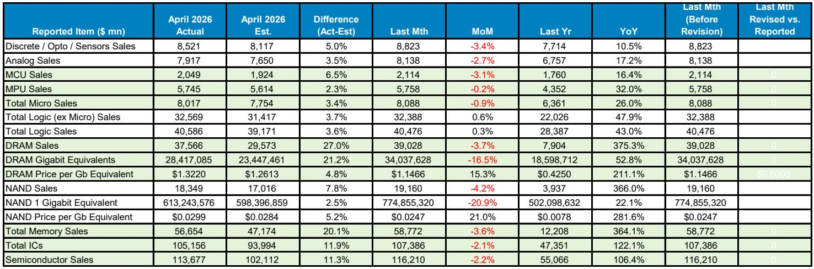
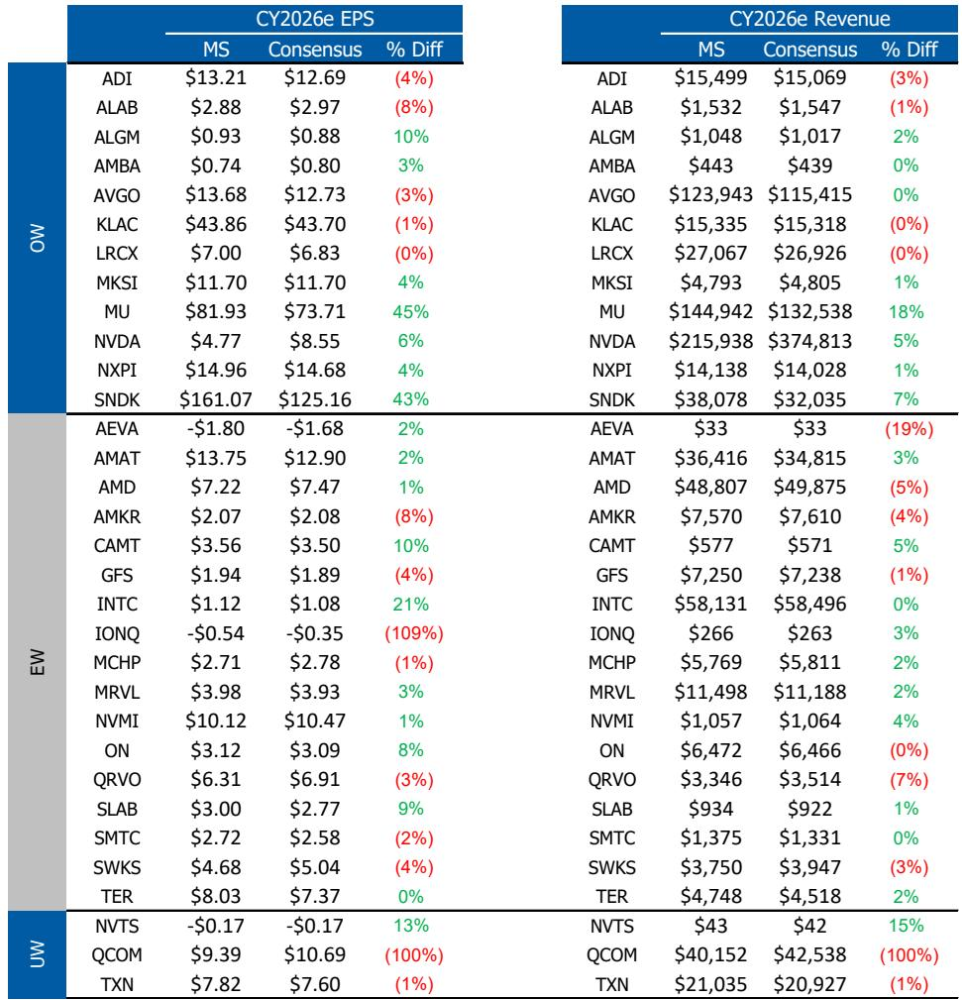
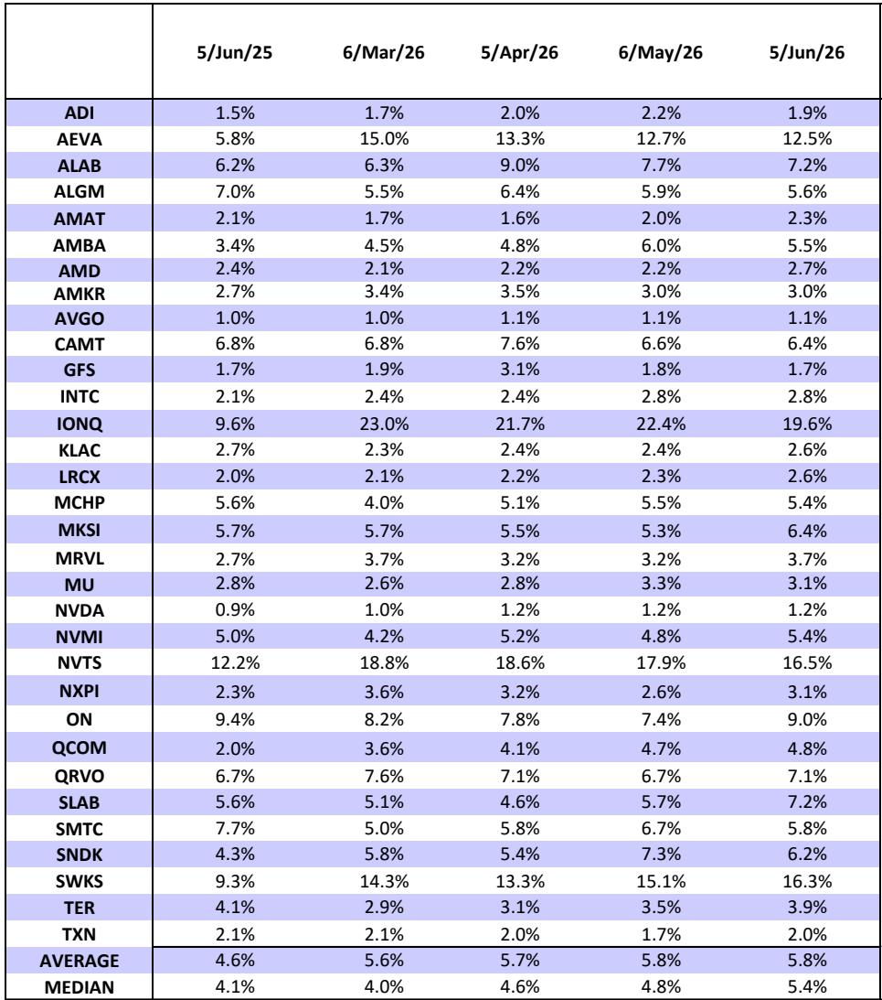

# 市场真正低估的不是AI需求，而是存储供给的结构性瓶颈

四月SIA数据公布后，某外资投行半导体团队连夜上调了全年行业预测。但真正值得关注的，不是数字本身有多强，而是数字背后揭示了一个正在被市场低估的结构性变化：存储芯片正从AI需求的被动受益者，转变为整个AI基建扩张的主动约束条件。

市场当前的分歧在于：这轮半导体周期到底是AI驱动的窄周期，还是全面复苏的宽周期。四月数据给出了一个更微妙的答案——它既是宽周期，但宽周期的核心驱动力并非需求全面开花，而是存储供给侧的极度紧张正在重塑整个产业链的定价权和投资逻辑。

报告上调2026年全球半导体销售预测至约1.96万亿美元，同比增长103%。这个数字本身并不令人意外，意外的是驱动上调的主要来源——存储定价的持续性超出预期。当市场还在争论AI资本开支何时见顶时，真正的瓶颈已经悄然转移到了存储产能的物理极限上。

## 1. 存储短缺已经从“会不会发生”变成了“如何分配”

NVIDIA大幅缩减Vera Rubin机柜的LPDDR5内存配置，从55TB降至28TB，SOCAMM内存模块从192GB砍到96GB。这条消息在市场上引起了关注，但多数讨论停留在“对NVIDIA出货节奏的影响”上。

真正重要的判断是：这个动作本身证明了存储短缺的严重程度，而非NVIDIA遇到了需求问题。

报告指出，53,000至70,000个Vera Rubin机柜如果全部采用55TB配置，仅SOCAMM部分就将消耗全球DRAM产能的近5%。即便按最极端情况全面减半，也会对全球DRAM市场造成超过2%的供给冲击——而且冲击的是整个市场中价值最高的部分。

更值得关注的是报告中的一个关键判断：所有的渠道反馈都表明，NVIDIA和所有云厂商会买下能买到的每一GB SOCAMM。这意味着这不是需求不足的问题，而是供给严重不足的问题。减配只是为了确保GPU机柜出货不受存储短缺拖累，一旦产能跟上来，配置会立即恢复。

这反过来证实了一个重要结论：当前的存储短缺是真实的供给约束，不是双重下单造成的虚增需求。每一次新增供给都会立即被真实需求消化。

## 2. 四月SIA数据打破了一个关键假设：季节性规律已经失效

四月通常是半导体销售的淡季。过去十年，四月环比平均下降10.6%。但今年的四月数据只下降了2.2%，远高于预期。这不是一个温和的偏离，而是一个信号：传统的季节性规律已经被结构性力量打破。

分产品看，几乎所有类别都超出预期：

离散器件环比下降3.4%，而预期是下降8.0%；模拟芯片下降2.7%，预期是下降6.0%；MCU下降3.1%，预期是下降9.0%；MPU几乎持平，仅下降0.2%，预期是下降2.5%。

这些数字合在一起意味着什么？不是AI在拉动一切，而是非AI领域的需求正在以超季节性的速度恢复。报告特别提到，工业领域正在从周期底部重新加速，需求正在向非AI领域扩散。库存消化正在成为过去式。

对于产业决策者来说，这意味着一个更重要的判断：如果非AI需求复苏和AI建设同时进行，而存储产能又是硬约束，那么整个半导体供应链的紧张程度可能会超过大多数人的预期。

## 3. DRAM价格创下历史新高，但驱动因素并非周期性的库存回补

四月DRAM销售同比增长375.3%，ASP同比增长211.1%，3个月平均ASP增速达到188.1%，连续九个季度上升。NAND同样强劲，ASP同比增长281.6%。

这些数字看起来像是周期顶峰的特征，但报告的核心论点是：这轮价格强势的驱动因素与过往周期完全不同。

过往的存储周期通常由库存回补驱动，价格上涨会刺激供给快速释放，然后价格见顶回落。但当前周期的特点是供给侧存在多重结构性约束：HBM对晶圆产能的占用、洁净室和EUV光刻机的产能限制、以及NAND增量产能的有限性。

报告明确区分了LTA（长期协议）的性质：LTA不是周期的原因，而是供给紧张和超大规模客户急于锁定产能的结果。这个判断对理解周期持续性至关重要。如果LTA是需求信号，那么价格上行空间有限；但如果LTA是供给约束的反映，那么高价格环境可能比市场预期的更持久。

对于投资者而言，这意味着需要重新评估存储公司的估值框架。如果这轮周期的定价权持续时间更长，那么基于历史周期的估值模型可能系统性低估了这些公司的盈利能力和现金生成能力。

## 4. 报告尚未完全回答的关键问题：供给响应的时间差有多长

报告在多个地方暗示了供给侧的约束，但有一个关键问题没有被完全展开：供给响应的具体时间表。

报告提到“短期内没有快速解决方案”，HBM的晶圆强度、洁净室和EUV约束、NAND增量产能有限。但对于产业决策者来说，真正需要知道的是：这些约束需要多长时间才能缓解？是6个月、12个月还是24个月？

报告上调了2027年预测至22%的增长，暗示供给紧张会延续到明年。但这里有一个关键的未解问题：如果存储供给是AI建设的瓶颈，那么当存储产能终于跟上时，AI需求是否还会保持当前的增长速度？换句话说，存储短缺是否正在“压制”AI建设的速度，一旦压制解除，AI需求会出现一次性爆发，还是AI需求本身也在自然放缓？

另一个未完全回答的问题是：非AI领域的复苏是否可持续。四月数据很强，但工业领域从周期底部反弹的持续性如何？MCU增速已经在三月到四月间从16.9%放缓至13.2%，虽然仍高于预期，但方向值得关注。

## 5. 一个更广阔的观察框架：这轮周期的核心变量是“供给弹性”而非“需求增速”

对于读者来说，与其关注每个月的销售数字是超预期还是低于预期，不如建立一个更根本的观察框架：评估整个半导体供应链的供给弹性。

传统上，投资者和分析师习惯从需求端出发进行预测：AI资本开支、PC换机周期、汽车销量、工业自动化渗透率。但在当前环境下，供给弹性可能比需求增速对定价和盈利的影响更大。

需要关注的几个关键供给弹性指标包括：存储厂商的资本开支计划是否加速、HBM与非HBM DRAM的产能分配比例、洁净室和EUV设备的交付周期、以及NAND向更高层数堆叠的技术迁移速度。

报告暗示，当前周期的“更高更久”定价环境，本质上是因为供给弹性低于历史均值。如果这个判断成立，那么即使需求增速从当前水平放缓，只要不出现断崖式下跌，存储公司的盈利仍可能保持强劲。

对于更广泛的半导体行业而言，四月数据传达的信息是：周期已经从AI单轮驱动转向了“AI+工业复苏”的双轮驱动。报告提到的“broadening out to non-AI-related areas”和“Industrial re-accelerating from cyclical lows”是这个判断最直接的证据。

## 6. 顺着这些未解问题继续

四月SIA数据提供了一幅清晰的图景：存储短缺正在成为AI建设的硬约束，而非AI领域的需求复苏正在为周期提供第二条腿。但正如上文提到的，关于供给响应时间表、非AI复苏可持续性、以及AI需求在供给约束解除后的演变方向，报告留下了值得深入讨论的空间。

这些未解问题恰好是理解这轮周期走向的关键。欢迎来星球微信群里继续讨论——我们会在群里分享完整的原始报告图表和季度数据表格，并围绕这些开放性问题做更深入的推演。

Personal reading notes and learning share only. Not investment advice.

